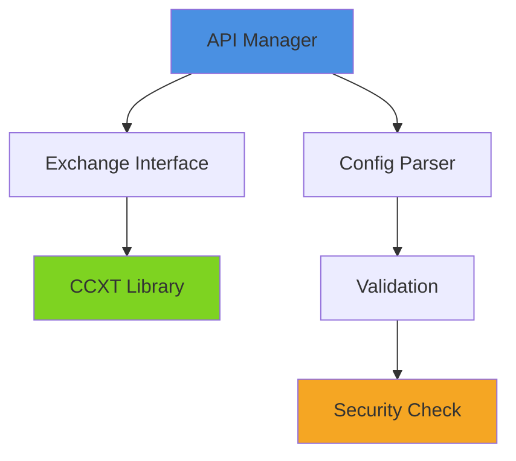

# IMPLEMENTATION GUIDE: Standardizing 46+ Prompt Files Across SonarFT Monorepo

**Purpose:** Comprehensive guide for improving metadata, deliverables, cross-package relationships, and output formats  
**Created:** April 2026  
**Total Files to Update:** 46 core prompt files + 2 index files = 48 total  
**Estimated Total Effort:** 32-48 hours  
**Focus:** Consistency, discoverability, cross-package integration

---

## PART 1: STANDARDIZED METADATA TEMPLATE

### Standard Header Format (All Prompt Files)

Every prompt file should begin with this standardized header. This applies to numbered prompts (01-12, 99) in all packages plus root-level index files.

```markdown
---
Prompt ID: XX-YYY-ZZZZ
Package: [bot | api | web | root]
Category: [Architecture | Design | Integration | Safety | Operations]
Difficulty: [Beginner | Intermediate | Advanced | Expert]
Time Estimate: XX-YY minutes
Run After: [Prompt IDs, comma-separated]
Can Run In Parallel With: [Prompt IDs, comma-separated]
Output Location: docs/[category-folder]/[output-filename].md
Last Updated: April 2026
Status: [Draft | In Review | Complete | Ready for Deployment]
---

# [Full Prompt Title]

**Focus:** [One-line description of what this prompt reviews]  
**Category:** [Category name]  
**Deliverables:** [Number] sections / [Number] analysis areas  
**Output File:** `docs/[category]/[filename].md`  
**Prerequisites:** Master Instruction + [other prompts]

---
```

### Metadata Definitions

| Field                   | Purpose               | Examples                                   | Rules                                 |
| ----------------------- | --------------------- | ------------------------------------------ | ------------------------------------- |
| **Prompt ID**           | Unique identifier     | `01-ARC-001`, `05-WSR-001`                 | Format: `[NUM]-[PKG]-[SEQ]`           |
| **Package**             | Which package owns it | `api`, `web`, `bot`, `root`                | Must be one of four values            |
| **Category**            | Subject domain        | Architecture, Safety, Operations           | Used for grouping and parallelization |
| **Difficulty**          | Skill level required  | Beginner, Intermediate, Advanced           | Helps prioritization                  |
| **Time Estimate**       | How long to execute   | 15-20, 30-45, 60-90                        | Range in minutes                      |
| **Run After**           | Dependencies          | `00-master-instruction`, `01-architecture` | Comma-separated Prompt IDs            |
| **Can Run In Parallel** | Independent siblings  | `02-api-endpoints`, `03-data-models`       | Comma-separated Prompt IDs            |
| **Output Location**     | Where results go      | `docs/architecture/overview.md`            | Relative path within package          |
| **Status**              | Update maturity       | Draft, Complete, Ready                     | Tracks standardization progress       |

---

## PART 2: ALL 46+ PROMPTS WITH STANDARDIZED METADATA

### BOT Package Prompts (16 files)

**Location:** `packages/bot/docs/prompts/`  
**Technology Focus:** Python, Async, Trading Logic, Financial Math, Exchange Integration

#### Special/Foundational

| Prompt ID       | Filename                 | Title                                                 | Category     | Time     | Run After | Parallel With |
| --------------- | ------------------------ | ----------------------------------------------------- | ------------ | -------- | --------- | ------------- |
| `00-BOT-MASTER` | 00-master-instruction.md | Master Instruction — Context for All Bot Code Reviews | Foundational | 5-10 min | —         | All others    |
| `00-BOT-QUICK`  | 00-quick-start-guide.md  | Quick Start Guide — Choose Your Review Path           | Foundational | 5 min    | 00-master | All others    |

#### Core Review Prompts (01-10)

| Prompt ID            | Filename                      | Title                                     | Category     | Difficulty   | Time      | Run After      | Parallel With | Output Location                    |
| -------------------- | ----------------------------- | ----------------------------------------- | ------------ | ------------ | --------- | -------------- | ------------- | ---------------------------------- |
| `01-BOT-ARCH`        | 01-architecture-structure.md  | Architecture & Project Structure          | Architecture | Intermediate | 20-30 min | 00-master      | 02, 03, 04    | docs/architecture/bot-overview.md  |
| `02-BOT-ASYNC`       | 02-async-concurrency.md       | Async Design & Multi-Bot Concurrency      | Design       | Advanced     | 30-45 min | 01             | 03, 04, 05    | docs/async/bot-concurrency.md      |
| `03-BOT-ENGINE`      | 03-trading-engine-logic.md    | Trading Engine Logic & Strategy Execution | Safety       | Advanced     | 45-60 min | 01, 02         | 04, 05, 06    | docs/trading/engine-review.md      |
| `04-BOT-MATH`        | 04-financial-math.md          | Financial Math & Precision Analysis       | Safety       | Expert       | 60-90 min | 01, 03         | 05, 06        | docs/trading/math-analysis.md      |
| `05-BOT-INDICATORS`  | 05-indicator-pipeline.md      | Indicator Pipeline & Technical Analysis   | Design       | Intermediate | 30-45 min | 01, 04         | 06, 07        | docs/trading/indicators-review.md  |
| `06-BOT-EXECUTION`   | 06-execution-exchange.md      | Execution & Exchange Integration (CCXT)   | Safety       | Advanced     | 45-60 min | 01, 03, 05     | 07, 08        | docs/trading/execution-review.md   |
| `07-BOT-CONFIG`      | 07-configuration-runtime.md   | Configuration & Runtime Setup             | Operations   | Beginner     | 20-30 min | 01             | 08, 09, 10    | docs/operations/bot-config.md      |
| `08-BOT-SECURITY`    | 08-security-risk.md           | Security & Trading Risk Assessment        | Safety       | Advanced     | 45-60 min | 01, 03, 04, 06 | 09, 10        | docs/security/bot-risks.md         |
| `09-BOT-PERFORMANCE` | 09-performance-scalability.md | Performance & Scalability Analysis        | Operations   | Intermediate | 30-45 min | 01, 02, 08     | 10            | docs/operations/bot-performance.md |
| `10-BOT-QUALITY`     | 10-code-quality-testing.md    | Code Quality & Testing Coverage           | Operations   | Intermediate | 30-45 min | 01, 02, 09     | 11            | docs/quality/bot-testing.md        |

#### Consolidation & Operations

| Prompt ID        | Filename                     | Title                                   | Category   | Time      | Run After | Output Location                    |
| ---------------- | ---------------------------- | --------------------------------------- | ---------- | --------- | --------- | ---------------------------------- |
| `11-BOT-FINAL`   | 11-final-consolidation.md    | Final Consolidation & Gap Analysis      | Operations | 30-60 min | 01-10     | docs/consolidation/bot-gaps.md     |
| `12-BOT-ROADMAP` | 12-implementation-roadmap.md | Implementation Roadmap & Prioritization | Operations | 30-45 min | 11        | docs/roadmap/bot-implementation.md |
| `13-BOT-SETUP`   | 13-setup-operations-guide.md | Setup & Operations Implementation Guide | Operations | 20-30 min | 11, 12    | docs/operations/bot-setup-guide.md |

#### Special Prompts

| Prompt ID     | Filename             | Title                            | Category   | Purpose                |
| ------------- | -------------------- | -------------------------------- | ---------- | ---------------------- |
| `99-BOT-BEST` | 99-best-practices.md | Best Practices & Recommendations | Operations | Cross-cutting patterns |

#### Bot Extra Files (Informational)

- `SEPARATION_STRATEGY.md` — Strategy for organizing reviews into separate prompts
- `sonarft_comprehensive_ai_review_prompts.md` — Original comprehensive prompt bundle
- `README.md` — Navigation guide for bot prompts

---

### API Package Prompts (15 files)

**Location:** `packages/api/docs/prompts/`  
**Technology Focus:** Python FastAPI, REST endpoints, WebSocket, Authentication, Real-time Data

#### Special/Foundational

| Prompt ID       | Filename                 | Title                                                 | Category     | Time     | Run After | Parallel With |
| --------------- | ------------------------ | ----------------------------------------------------- | ------------ | -------- | --------- | ------------- |
| `00-API-MASTER` | 00-master-instruction.md | Master Instruction — Context for All API Code Reviews | Foundational | 5-10 min | —         | All others    |
| `00-API-QUICK`  | 00-quick-start-guide.md  | Quick Start Guide — Choose Your Review Path           | Foundational | 5 min    | 00-master | All others    |

#### Core Review Prompts (01-10)

| Prompt ID            | Filename                       | Title                                    | Category     | Difficulty   | Time      | Run After      | Parallel With | Output Location                     |
| -------------------- | ------------------------------ | ---------------------------------------- | ------------ | ------------ | --------- | -------------- | ------------- | ----------------------------------- |
| `01-API-ARCH`        | 01-architecture-structure.md   | API Architecture & Project Structure     | Architecture | Intermediate | 20-30 min | 00-master      | 02, 03, 04    | docs/architecture/api-overview.md   |
| `02-API-ENDPOINTS`   | 02-api-endpoints-design.md     | API Endpoints Design & REST Contract     | Design       | Intermediate | 45-60 min | 01             | 03, 04, 05    | docs/endpoints/rest-contract.md     |
| `03-API-MODELS`      | 03-data-models-validation.md   | Data Models & Validation                 | Design       | Intermediate | 30-45 min | 01, 02         | 04, 05, 06    | docs/models/validation-review.md    |
| `04-API-AUTH`        | 04-authentication-security.md  | Authentication, Authorization & Security | Safety       | Advanced     | 45-60 min | 01, 02, 03     | 05, 06, 08    | docs/security/api-auth.md           |
| `05-API-WEBSOCKET`   | 05-websocket-realtime.md       | WebSocket Real-Time Data Streaming       | Design       | Advanced     | 30-45 min | 01, 02, 04     | 06, 07        | docs/realtime/websocket-review.md   |
| `06-API-ERROR`       | 06-error-handling-logging.md   | Error Handling & Logging                 | Operations   | Intermediate | 30-45 min | 01, 05         | 07, 08, 09    | docs/operations/error-logging.md    |
| `07-API-DATABASE`    | 07-database-persistence.md     | Database & Data Persistence              | Design       | Intermediate | 30-45 min | 01, 03         | 08, 09, 10    | docs/persistence/database-review.md |
| `08-API-PERFORMANCE` | 08-performance-optimization.md | Performance Optimization & Scaling       | Operations   | Advanced     | 45-60 min | 01, 02, 05, 07 | 09, 10        | docs/operations/api-performance.md  |
| `09-API-TESTING`     | 09-testing-quality.md          | Testing & Quality Assurance              | Operations   | Intermediate | 30-45 min | 01, 02, 08     | 10            | docs/quality/api-testing.md         |
| `10-API-QUALITY`     | 10-code-quality-python.md      | Code Quality & Python Standards          | Operations   | Intermediate | 30-45 min | 01, 09         | 11            | docs/quality/api-code-quality.md    |

#### Consolidation & Operations

| Prompt ID        | Filename                     | Title                                   | Category   | Time      | Run After | Output Location                    |
| ---------------- | ---------------------------- | --------------------------------------- | ---------- | --------- | --------- | ---------------------------------- |
| `11-API-FINAL`   | 11-final-consolidation.md    | Final Consolidation & Gap Analysis      | Operations | 30-60 min | 01-10     | docs/consolidation/api-gaps.md     |
| `12-API-ROADMAP` | 12-implementation-roadmap.md | Implementation Roadmap & Prioritization | Operations | 30-45 min | 11        | docs/roadmap/api-implementation.md |

#### Special Prompts

| Prompt ID     | Filename             | Title                            | Category   | Purpose                |
| ------------- | -------------------- | -------------------------------- | ---------- | ---------------------- |
| `99-API-BEST` | 99-best-practices.md | Best Practices & Recommendations | Operations | Cross-cutting patterns |

#### API Extra Files

- `README.md` — Navigation guide for API prompts

---

### WEB Package Prompts (15 files)

**Location:** `packages/web/docs/prompts/`  
**Technology Focus:** React, TypeScript, State Management, API Integration, Real-time Updates

#### Special/Foundational

| Prompt ID       | Filename                 | Title                                                    | Category     | Time     | Run After | Parallel With |
| --------------- | ------------------------ | -------------------------------------------------------- | ------------ | -------- | --------- | ------------- |
| `00-WEB-MASTER` | 00-master-instruction.md | Master Instruction — Context for sonarftweb Code Reviews | Foundational | 5-10 min | —         | All others    |
| `00-WEB-QUICK`  | 00-quick-start-guide.md  | Quick Start Guide — Choose Your Review Path              | Foundational | 5 min    | 00-master | All others    |

#### Core Review Prompts (01-10)

| Prompt ID            | Filename                       | Title                                       | Category     | Difficulty   | Time      | Run After  | Parallel With | Output Location                     |
| -------------------- | ------------------------------ | ------------------------------------------- | ------------ | ------------ | --------- | ---------- | ------------- | ----------------------------------- |
| `01-WEB-ARCH`        | 01-architecture-structure.md   | Architecture & Project Structure            | Architecture | Intermediate | 20-30 min | 00-master  | 02, 03, 04    | docs/architecture/web-overview.md   |
| `02-WEB-INTEGRATION` | 02-api-integration.md          | API Integration & Server Communication      | Integration  | Intermediate | 20-30 min | 01         | 03, 05, 06    | docs/integration/api-integration.md |
| `03-WEB-STATE`       | 03-state-management.md         | State Management & Data Flow                | Design       | Intermediate | 30-45 min | 01, 02     | 04, 05        | docs/state/state-management.md      |
| `04-WEB-COMPONENTS`  | 04-ui-component-design.md      | UI Component Design & Reusability           | Design       | Beginner     | 25-35 min | 01, 03     | 05, 07        | docs/components/component-design.md |
| `05-WEB-REALTIME`    | 05-real-time-updates.md        | Real-time Updates & WebSocket Integration   | Integration  | Intermediate | 20-30 min | 02, 03     | 06, 07        | docs/realtime/websocket-client.md   |
| `06-WEB-AUTH`        | 06-authentication-security.md  | Authentication, Security & Token Management | Safety       | Intermediate | 30-45 min | 01, 02     | 07, 08        | docs/security/web-auth.md           |
| `07-WEB-UX`          | 07-trading-interface-ux.md     | Trading Interface UX & User Experience      | Design       | Beginner     | 20-30 min | 01, 04     | 08, 09        | docs/ux/trading-interface.md        |
| `08-WEB-PERFORMANCE` | 08-performance-optimization.md | Performance Optimization & Loading          | Operations   | Intermediate | 30-45 min | 01, 03, 05 | 09, 10        | docs/operations/web-performance.md  |
| `09-WEB-TESTING`     | 09-testing-quality.md          | Testing & Quality Assurance                 | Operations   | Intermediate | 30-45 min | 01, 08     | 10            | docs/quality/web-testing.md         |
| `10-WEB-QUALITY`     | 10-code-quality-javascript.md  | Code Quality & TypeScript Standards         | Operations   | Intermediate | 30-45 min | 01, 09     | 11            | docs/quality/web-code-quality.md    |

#### Consolidation & Operations

| Prompt ID        | Filename                     | Title                                   | Category   | Time      | Run After | Output Location                    |
| ---------------- | ---------------------------- | --------------------------------------- | ---------- | --------- | --------- | ---------------------------------- |
| `11-WEB-FINAL`   | 11-final-consolidation.md    | Final Consolidation & Gap Analysis      | Operations | 30-60 min | 01-10     | docs/consolidation/web-gaps.md     |
| `12-WEB-ROADMAP` | 12-implementation-roadmap.md | Implementation Roadmap & Prioritization | Operations | 30-45 min | 11        | docs/roadmap/web-implementation.md |

#### Special Prompts

| Prompt ID     | Filename             | Title                            | Category   | Purpose                |
| ------------- | -------------------- | -------------------------------- | ---------- | ---------------------- |
| `99-WEB-BEST` | 99-best-practices.md | Best Practices & Recommendations | Operations | Cross-cutting patterns |

#### Web Extra Files

- `README.md` — Navigation guide for web prompts

---

### Root-Level Documentation (2 files)

**Location:** `docs/`

| Prompt ID        | Filename                | Title                                               | Purpose                      | Updated    |
| ---------------- | ----------------------- | --------------------------------------------------- | ---------------------------- | ---------- |
| `00-ROOT-INDEX`  | PROMPTS_INDEX.md        | SonarFT Code Review Prompts — Quick Reference Index | Quick lookup by task/package | April 2026 |
| `00-ROOT-MASTER` | PROMPTS_MASTER_GUIDE.md | SonarFT Monorepo Code Review Prompts — Master Guide | Full-stack integration guide | April 2026 |

---

## PART 3: BULK UPDATE STRATEGY

### Phase 1: Metadata Standardization (4-6 hours)

**Goal:** Add standardized YAML frontmatter to all prompt files

#### Step 1A: API Package (15 files)

**Filenames to update:**

```
00-master-instruction.md
00-quick-start-guide.md
01-architecture-structure.md
02-api-endpoints-design.md
03-data-models-validation.md
04-authentication-security.md
05-websocket-realtime.md
06-error-handling-logging.md
07-database-persistence.md
08-performance-optimization.md
09-testing-quality.md
10-code-quality-python.md
11-final-consolidation.md
12-implementation-roadmap.md
99-best-practices.md
```

**Find-Replace Pattern:**

- **Find:** `^# (.+)` (first H1 header)
- **Replace:**

```
---
Prompt ID: [ID from table above]
Package: api
Category: [Category from table]
Difficulty: [Difficulty]
Time Estimate: [Time]
Run After: [Dependencies]
Can Run In Parallel With: [Parallels]
Output Location: [Output path]
Last Updated: April 2026
Status: Complete
---

# $1
```

**Estimated Effort:** 2-3 hours (15 files × 10 min per file)

#### Step 1B: Web Package (15 files)

**Same approach as API**

- Find pattern: `^# (.+)`
- Apply metadata frontmatter for each file
- **Estimated Effort:** 2-3 hours

#### Step 1C: Bot Package (16 files)

**Same approach, note:** Bot has 16 files including `13-setup-operations-guide.md`

- **Estimated Effort:** 2.5-3 hours

### Phase 2: Deliverables Enhancement (6-8 hours)

**Goal:** Add standardized deliverables checklist to all core prompts (01-10)

#### Pattern: Add after main content, before copy-paste section

```markdown
---

## ✅ Deliverables Checklist

This prompt produces **[N]** main deliverables:

- [ ] **[Deliverable 1]** — [Description]
- [ ] **[Deliverable 2]** — [Description]
- [ ] **[Deliverable 3]** — [Description]
- [ ] **Summary Table** — [Format description]
- [ ] **Markdown Output** — Properly formatted and ready to commit

**Format:** All outputs in clean Markdown, ready for documentation
**Include:** Code examples, file citations, diagrams where applicable

---
```

**Files affected:** 30 core prompts (10 per package × 3)
**Estimated Effort:** 6-8 hours (30 files × 12-15 min per file)

### Phase 3: Cross-Package Relationship Documentation (4-6 hours)

**Goal:** Add "Related Prompts" section to each file showing connections

#### Pattern: Add before "Deliverables" section

```markdown
---

## 🔗 Related Prompts Across Packages

### In This Package
- **Prompt N:** [Link and brief context]
- **Prompt N:** [Link and brief context]

### In Other Packages
- **API Prompt N:** [Package]/[Link] — How it relates
- **Web Prompt N:** [Package]/[Link] — How it relates
- **Bot Prompt N:** [Package]/[Link] — How it relates

**Integration Notes:**
- Prompt X and Y should be run together for full-stack understanding
- Output from X feeds into assumptions of Y

---
```

**Files affected:** 30 core prompts + consolidation files
**Estimated Effort:** 4-6 hours

### Phase 4: Output Format Specifications (8-12 hours)

**Goal:** Define expected output structure for each prompt

#### Pattern: Add new section "Expected Output Format"

```markdown
---

## 📋 Expected Output Format

Your AI-generated output should include:

### Section 1: [Name]
- **Format:** Markdown table or list
- **Columns/Items:** [Detail what to include]
- **Example:** [Short example]

### Section 2: [Name]
- **Format:** [Description]
- **Requirements:** [Specific details]
- **Table structure:** [If applicable]

### Section 3: Summary & Findings
- **Format:** Markdown with emphasis
- **Include:** Key metrics, critical findings, recommendations
- **Length:** [Approximate section length]

### Diagrams (Mermaid, when applicable)
- [Diagram type and purpose]
- [Placement guidance]

---
```

**Files affected:** 30 core prompts (01-10 per package)
**Estimated Effort:** 8-12 hours (varies by prompt complexity)

---

## PART 4: CROSS-PACKAGE INTEGRATION DETAILS

### Key Cross-Package Relationships

#### 1. **Architectural Foundation** (All Packages)

```
┌─────────────────────────────────────────────────────┐
│ BOT: 01-architecture-structure.md                   │
│ API: 01-architecture-structure.md                   │
│ WEB: 01-architecture-structure.md                   │
└─────────────────────────────────────────────────────┘
        ↓ Feeds into all downstream analysis
        ├─ BOT: 02-async, 03-engine, 04-math
        ├─ API: 02-endpoints, 03-models, 05-websocket
        └─ WEB: 02-integration, 03-state, 04-components
```

**Why Run Together:** Establishing shared mental model of system
**Execution Order:** All three 01 prompts simultaneously, then proceed to package-specific 02-10s

---

#### 2. **API Integration Points** (Web ↔ API)

```
WEB: 02-api-integration.md
       ↕ (bidirectional understanding)
API: 02-api-endpoints-design.md

WEB: 05-real-time-updates.md
       ↕ (WebSocket client/server pair)
API: 05-websocket-realtime.md
```

**Relationship:**

- Web Prompt 02 reviews **how client calls** API endpoints
- API Prompt 02 reviews **endpoint design** that client calls
- They should produce **matching contract documentation**

**Cross-check:** Endpoints listed in API:02 should match endpoints called in Web:02

**Execution Strategy:**

1. Run API:02 first (defines contract)
2. Run Web:02 (validates contract usage)
3. Cross-reference outputs and resolve inconsistencies

---

#### 3. **Real-Time Communication** (Web ↔ API)

```
WEB: 05-real-time-updates.md
       ↔ (Client-server WebSocket)
API: 05-websocket-realtime.md
```

**Relationship:**

- API:05 defines WebSocket **server implementation** (endpoints, message formats, subscriptions)
- Web:05 defines WebSocket **client implementation** (connection, event handlers, state updates)
- Both must understand identical **message protocol**

**Output Alignment Checklist:**

- [ ] Message types match (server sends what client expects)
- [ ] Subscription format documented in both
- [ ] Error handling strategy consistent
- [ ] Connection lifecycle aligned
- [ ] Data format/validation aligned

---

#### 4. **Bot ↔ API Integration** (Execution & Control)

```
BOT: 06-execution-exchange.md
       ↕ (Subprocess/IPC communication)
API: 02-api-endpoints-design.md (bot management endpoints)
```

**Relationship:**

- Bot:06 reviews **how bot executes trades** on exchange
- API:02 includes endpoints for **controlling bot** (start, stop, pause)
- API must correctly **represent bot state** in responses

**Critical Handoff:** Bot execution state must be queryable via API endpoints

---

#### 5. **Security Across Stack** (All Packages)

```
BOT: 08-security-risk.md (trading risks)
     ↓
API: 04-authentication-security.md (API auth)
     ↓
WEB: 06-authentication-security.md (client auth)
```

**Integration Points:**

- Bot trading risk → API access control (prevent unauthorized bot start)
- API auth tokens → Web token storage/refresh (prevent exposure)
- All three define roles: Admin, User, Observer

**Recommended Review Order:**

1. API:04 (defines auth mechanism)
2. Web:06 (implements client auth)
3. Bot:08 (verifies access control prevents trading risks)

---

#### 6. **Full-Stack Review Workflow** (Recommended Execution)

```
Hour 1-2: Foundations (Run in parallel)
├─ BOT: 00-master + 01-architecture
├─ API: 00-master + 01-architecture
└─ WEB: 00-master + 01-architecture

Hour 3-5: Package Deep-Dives (Run in parallel by package)
├─ BOT: 02, 03, 04, 05, 06 (trading logic)
├─ API: 02, 03, 04, 05 (endpoints & realtime)
└─ WEB: 02, 03, 04, 05 (integration & state)

Hour 6-8: Cross-Package Validation
├─ Web:02 ↔ API:02 (endpoint contract check)
├─ Web:05 ↔ API:05 (WebSocket protocol check)
└─ Bot:06 ↔ API:02 (execution control check)

Hour 9-12: Safety & Operations
├─ BOT: 07, 08, 09, 10 (config, security, perf, testing)
├─ API: 06, 07, 08, 09, 10 (error, database, perf, testing)
└─ WEB: 06, 07, 08, 09, 10 (auth, ux, perf, testing)

Hour 13-15: Consolidation (Sequential)
├─ BOT: 11, 12, 13 (gaps, roadmap, setup)
├─ API: 11, 12 (gaps, roadmap)
└─ WEB: 11, 12 (gaps, roadmap)
```

**Total Time:** 12-15 hours for comprehensive full-stack review

---

## PART 5: OUTPUT FORMAT SPECIFICATIONS

### Standard Markdown Structure for Core Prompts (01-10)

All core review prompts should follow this output structure. This ensures consistency and makes documentation easier to navigate and maintain.

---

#### **Template: Standard Output Structure**

Every prompt output should contain these sections in this order:

```markdown
# [Topic] — Code Review Analysis

**Status:** ✅ Complete | 🚧 Incomplete | ⚠️ Issues Found  
**Scope:** [What was reviewed]  
**Timestamp:** April 2026  
**Files Analyzed:** [Count and examples]

---

## Executive Summary

[1-2 paragraphs highlighting key findings, critical issues, and positive aspects]

### Key Findings

- **Critical Issues:** [Count and severity]
- **Medium Issues:** [Count]
- **Recommendations:** [Count]
- **Coverage:** [Percentage of code reviewed]

---

## 1. [Primary Category/Topic]

### Overview

[Brief description of what this section covers]

### Detailed Findings

[Content formatted as specified below]

### Risk Assessment

- **Critical:** [Issue descriptions]
- **Medium:** [Issue descriptions]
- **Low:** [Issue descriptions]

### Recommendations

1. [Specific, actionable recommendation]
2. [Specific, actionable recommendation]

---

## 2. [Secondary Category/Topic]

[Follow same format as Section 1]

---

## Summary Tables

### Issue Summary

| Severity | Count | Category   | Resolution Time |
| -------- | ----- | ---------- | --------------- |
| Critical | X     | [Category] | X hours         |
| Medium   | X     | [Category] | X hours         |
| Low      | X     | [Category] | X hours         |

### File-Level Analysis

| File | LOC | Issues | Coverage | Status |
| ---- | --- | ------ | -------- | ------ |
|      |     |        |          |        |

---

## Diagrams (Mermaid)

[Include relevant architecture, flow, or relationship diagrams]

---

## Implementation Roadmap

**High Priority (Week 1):**

- [ ] [Issue/Fix]

**Medium Priority (Week 2-3):**

- [ ] [Issue/Fix]

**Low Priority (Backlog):**

- [ ] [Issue/Fix]

---

## Files Modified & Generated

**Output files created:**

- `docs/[category]/[specific-review].md` ← Main findings
- `docs/[category]/[topic]-checklist.md` ← Action items
- `docs/[category]/[topic]-diagrams.md` ← Mermaid diagrams

---
```

---

### Prompt-Specific Output Formats

#### **BOT: 01-Architecture**

**Additional sections:**

- Module Dependency Graph (Mermaid DAG)
- Technology Stack Version Table
- Responsibility Boundary Matrix (file × responsibility)
- Layer Architecture Diagram

**Expected Tables:**

1. **Module Inventory**
   | Module | Primary File(s) | Responsibility | Key Classes | Status |
   |--------|-----------------|-----------------|------------|--------|

2. **Dependency Analysis**
   | Module A | → imports → | Module B | Strength | Risk |
   |----------|-----------|----------|----------|------|

---

#### **BOT: 03-Trading Engine Logic**

**Additional sections:**

- Strategy Execution Flow (Mermaid sequence diagram)
- Trade State Machine (Mermaid state diagram)
- Decision Tree for Entry/Exit Logic

**Expected Tables:**

1. **Strategy Review**
   | Strategy Component | Implementation Status | Test Coverage | Correctness Risk |
   |-------------------|----------------------|---------------|-----------------|

2. **Signal Analysis**
   | Indicator | Formula | Validation | Backtesting Status |
   |-----------|---------|-----------|-------------------|

---

#### **BOT: 04-Financial Math**

**Additional sections:**

- Precision Analysis (float vs. Decimal review)
- Mathematical Correctness Verification
- VWAP Calculation Breakdown

**Expected Tables:**

1. **Math Operations**
   | Operation | Implementation | Precision Loss Risk | Edge Cases Handled |
   |-----------|----------------|-------------------|-------------------|

2. **Calculation Verification**
   | Calculation | Input Range | Expected Accuracy | Actual Accuracy |
   |------------|-------------|------------------|-----------------|

---

#### **API: 02-API Endpoints Design**

**Additional sections:**

- REST Maturity Model Assessment (Richardson's Model)
- OpenAPI/Swagger Schema (if applicable)
- Endpoint Call Graph (Mermaid)

**Expected Tables:**

1. **Endpoint Inventory**
   | HTTP Method | Path | Handler | Request Schema | Response Schema | Auth | Status Code(s) |
   |------------|------|---------|---------------|--------------|----|---|

2. **HTTP Method Usage**
   | Method | Count | Assessment | Issues |
   |--------|-------|-----------|--------|

3. **Status Code Usage**
   | Code | Count | Appropriate Usage | Issues |
   |------|-------|-----------------|--------|

---

#### **API: 05-WebSocket Real-Time**

**Additional sections:**

- Message Flow Diagram (Mermaid sequence)
- Connection Lifecycle (Mermaid state diagram)
- Subscription Protocol Definition

**Expected Tables:**

1. **WebSocket Message Types**
   | Message Type | Purpose | Payload Schema | Frequency | Error Handling |
   |-------------|---------|---|----------|---|

2. **Connection Management**
   | Scenario | Current Implementation | Issues | Recommendations |
   |----------|----------------------|--------|-----------------|

---

#### **WEB: 02-API Integration**

**Additional sections:**

- API Call Dependency Graph (Mermaid)
- Authentication Flow (Mermaid sequence)
- Error Handling Decision Tree

**Expected Tables:**

1. **API Endpoint Usage**
   | Endpoint | Called From (Component) | Purpose | Error Handling | Retry Logic |
   |----------|----------------------|---------|---|---|

2. **Request Configuration**
   | Type | Current Implementation | Best Practices Gap | Risk |
   |------|----------------------|-------------------|------|

---

#### **WEB: 05-Real-Time Updates**

**Additional sections:**

- WebSocket Event Lifecycle (Mermaid sequence)
- State Update Flow (Mermaid diagram)
- Memory Leak Analysis

**Expected Tables:**

1. **WebSocket Events**
   | Event Name | Source | Handler(s) | State Updated | Frequency |
   |-----------|--------|-----------|---|---|

2. **Real-time Data Synchronization**
   | Data Type | WebSocket Event | REST Fallback | Sync Strategy | Conflict Handling |
   |-----------|---|---|---|---|

---

#### **All Packages: 08-Performance Optimization**

**Additional sections:**

- Performance Baseline Metrics
- Bottleneck Analysis (Flamegraph description)
- Scaling Projection (N users → response time/memory)

**Expected Tables:**

1. **Performance Metrics**
   | Metric | Current | Target | Gap | Priority |
   |--------|---------|--------|-----|----------|

2. **Bottleneck Analysis**
   | Component | Current (ms/MB) | Limiting Factor | Optimization Strategy |
   |-----------|---|---|---|

---

#### **All Packages: 11-Final Consolidation**

**Additional sections:**

- Gap Analysis Matrix (Issue Category × Severity)
- Interdependency Chart (which issues block others)
- Progress Tracker

**Expected Tables:**

1. **Gap Summary**
   | Category | Issue Count | Total Effort | Risk Level | Dependencies |
   |----------|---|---|---|---|

2. **Issue Correlation**
   | Issue A | Blocks | Issue B | Both Address |
   |---------|--------|---------|---|

---

### Mermaid Diagram Guidelines

#### **When to Use Diagrams**

| Diagram Type             | Best Used In              | Example                          |
| ------------------------ | ------------------------- | -------------------------------- |
| **Architecture (Graph)** | Prompt 01-\*-architecture | Module dependencies              |
| **Sequence (Timeline)**  | Integration prompts       | API call + WebSocket flow        |
| **State Machine**        | Logic prompts             | Trading state, connection states |
| **Flowchart**            | Process prompts           | Decision trees, algorithm flow   |
| **Gantt**                | Roadmap prompts           | Timeline of implementations      |
| **Entity Relationship**  | Database prompts          | Data model relationships         |

#### **Diagram Standards**

1. **Titles:** Every diagram must have a clear title
2. **Labels:** All nodes/flows must be labeled
3. **Color:** Use semantic colors (red=critical, yellow=warning)
4. **Size:** Keep to <200 nodes for readability
5. **Accessibility:** Include alt-text description before diagram

#### **Example: Architecture Diagram**

````markdown
### System Architecture

This diagram shows how modules depend on each other:


````

**Key Relationships:**

- A requires B and C for operation
- B and C are independent of each other
- D is external dependency

```

---

## PART 6: IMPLEMENTATION EXECUTION ROADMAP

### Quick Reference: Files to Update

**Total Files:** 46 core prompts + 2 index files = 48

**By Priority:**

#### Phase 1: Quick Wins (2-3 hours)
- [ ] Add frontmatter metadata to all 48 files
- [ ] Use automated find-replace for consistency
- [ ] Test with 3 files, then apply to all

#### Phase 2: Deliverables (3-4 hours)
- [ ] Add deliverables checklist to 30 core prompts (01-10)
- [ ] Verify checklist format consistency
- [ ] Link to output locations

#### Phase 3: Cross-References (2-3 hours)
- [ ] Add "Related Prompts" section to all 30 core prompts
- [ ] Validate cross-package links work
- [ ] Document key relationships

#### Phase 4: Output Specifications (4-6 hours)
- [ ] Add "Expected Output Format" section to 30 core prompts
- [ ] Include template tables for each
- [ ] Add Mermaid diagram guidance where applicable

#### Phase 5: Validation (1-2 hours)
- [ ] Spot-check updates for accuracy
- [ ] Ensure links resolve correctly
- [ ] Verify tables render in Markdown
- [ ] Test Git diff for expected changes

### Time Budget Summary

| Phase | Task | Files | Time | Total |
|-------|------|-------|------|-------|
| 1 | Metadata frontmatter | 48 | 3 min/file | 2.4 hrs |
| 2 | Deliverables checklist | 30 | 10 min/file | 5.0 hrs |
| 3 | Cross-package links | 30 | 8 min/file | 4.0 hrs |
| 4 | Output specs | 30 | 12 min/file | 6.0 hrs |
| 5 | Validation & QA | 48 | 2 min/file | 1.6 hrs |
| **TOTAL** | | | | **18.9 hrs** |

**Realistic estimate with reviews:** 24-32 hours

---

## APPENDIX A: Quick Reference Tables

### Prompt ID Naming Convention

**Format:** `NN-PKG-XXXX`

- **NN** = Prompt number (00-13, 99)
- **PKG** = Package abbreviation
  - `BOT` = Bot package
  - `API` = API package
  - `WEB` = Web package
  - `ROOT` = Root documentation
- **XXXX** = Descriptive code
  - `MASTER` = Master instruction
  - `QUICK` = Quick start
  - `ARCH` = Architecture
  - `ASYNC` = Async/Concurrency
  - `ENGINE` = Trading engine
  - `MATH` = Financial math
  - `INDIC` = Indicators
  - `EXEC` = Execution
  - `CONFIG` = Configuration
  - `SEC` = Security
  - `PERF` = Performance
  - `QUALITY` = Code quality
  - `FINAL` = Final consolidation
  - `ROADMAP` = Implementation roadmap

**Examples:**
- `01-BOT-ARCH` = Bot package, Prompt 01, Architecture
- `05-API-WSR` = API package, Prompt 05, WebSocket Real-time
- `02-WEB-INTEG` = Web package, Prompt 02, Integration

---

### Category Classification

All 46+ prompts fall into one of these categories:

| Category | Purpose | Prompts | Examples |
|----------|---------|---------|----------|
| **Foundational** | Must read first | 00-master, 00-quick | Context setting |
| **Architecture** | System design | 01-* | Project structure |
| **Design** | Code patterns | 02-*, 03-*, 04-* | API design, state mgmt |
| **Safety** | Risk & security | 04-*, 06-*, 08-* | Auth, trading risks |
| **Integration** | Cross-system | 02-*, 05-* | API calls, WebSocket |
| **Operations** | Deployment & process | 07-*, 09-*, 10-*, 11-*, 12-* | Config, performance, testing |

---

### Parallel Execution Groups

Prompts that can run **simultaneously** (no dependencies):

**Batch 1 - All Architecture (1 hour)**
```

BOT: 01-architecture
API: 01-architecture
WEB: 01-architecture

```

**Batch 2 - Bot Internals (2-3 hours)**
```

BOT: 02-async
BOT: 04-financial-math
BOT: 07-configuration
(Can start: BOT: 03-trading-engine in parallel with 02)

```

**Batch 3 - API Internals (1.5-2 hours)**
```

API: 02-endpoints
API: 03-models
API: 07-database
(Can start: API: 04-auth in parallel)

```

**Batch 4 - Web Internals (1.5-2 hours)**
```

WEB: 02-integration
WEB: 03-state-mgmt
WEB: 04-components
(Can start: WEB: 06-auth in parallel)

```

**Batch 5 - Cross-System Validation (2-3 hours)**
```

WEB: 02 output ↔ API: 02 output comparison
WEB: 05 output ↔ API: 05 output comparison
BOT: 06 output ↔ API: 02 output comparison

```

**Batch 6 - Safety, Performance, Testing (3-4 hours)**
```

BOT: 05-indicators, 06-execution, 08-security, 09-performance, 10-testing
API: 05-websocket, 06-error, 08-performance, 09-testing, 10-quality
WEB: 05-realtime, 06-auth, 07-ux, 08-performance, 09-testing, 10-quality

```

---

## APPENDIX B: File Locations Reference

### Complete Directory Structure

```

sonarft-monorepo/
├── IMPLEMENTATION_GUIDE.md ← YOU ARE HERE
├── docs/
│ ├── PROMPTS_INDEX.md (update with metadata)
│ ├── PROMPTS_MASTER_GUIDE.md (update with cross-refs)
│ ├── developer-guide.md
│ └── backtesting-guide.md
│
├── packages/
│ ├── bot/docs/prompts/
│ │ ├── 00-master-instruction.md
│ │ ├── 00-quick-start-guide.md
│ │ ├── 01-architecture-structure.md
│ │ ├── 02-async-concurrency.md
│ │ ├── 03-trading-engine-logic.md
│ │ ├── 04-financial-math.md
│ │ ├── 05-indicator-pipeline.md
│ │ ├── 06-execution-exchange.md
│ │ ├── 07-configuration-runtime.md
│ │ ├── 08-security-risk.md
│ │ ├── 09-performance-scalability.md
│ │ ├── 10-code-quality-testing.md
│ │ ├── 11-final-consolidation.md
│ │ ├── 12-implementation-roadmap.md
│ │ ├── 13-setup-operations-guide.md
│ │ ├── 99-best-practices.md
│ │ ├── README.md
│ │ ├── SEPARATION_STRATEGY.md (informational)
│ │ └── sonarft_comprehensive_ai_review_prompts.md (informational)
│ │
│ ├── api/docs/prompts/
│ │ ├── 00-master-instruction.md
│ │ ├── 00-quick-start-guide.md
│ │ ├── 01-architecture-structure.md
│ │ ├── 02-api-endpoints-design.md
│ │ ├── 03-data-models-validation.md
│ │ ├── 04-authentication-security.md
│ │ ├── 05-websocket-realtime.md
│ │ ├── 06-error-handling-logging.md
│ │ ├── 07-database-persistence.md
│ │ ├── 08-performance-optimization.md
│ │ ├── 09-testing-quality.md
│ │ ├── 10-code-quality-python.md
│ │ ├── 11-final-consolidation.md
│ │ ├── 12-implementation-roadmap.md
│ │ ├── 99-best-practices.md
│ │ └── README.md
│ │
│ └── web/docs/prompts/
│ ├── 00-master-instruction.md
│ ├── 00-quick-start-guide.md
│ ├── 01-architecture-structure.md
│ ├── 02-api-integration.md
│ ├── 03-state-management.md
│ ├── 04-ui-component-design.md
│ ├── 05-real-time-updates.md
│ ├── 06-authentication-security.md
│ ├── 07-trading-interface-ux.md
│ ├── 08-performance-optimization.md
│ ├── 09-testing-quality.md
│ ├── 10-code-quality-javascript.md
│ ├── 11-final-consolidation.md
│ ├── 12-implementation-roadmap.md
│ ├── 99-best-practices.md
│ └── README.md

```

---

## APPENDIX C: Metadata Fields Explained

### Category Options (and where prompts belong)

1. **Foundational** — Master instructions and quick-start guides
2. **Architecture** — System design and module organization
3. **Design** — Code patterns, APIs, data models
4. **Safety** — Security, trading risk, financial correctness
5. **Integration** — Cross-system communication, API usage
6. **Operations** — Configuration, deployment, monitoring, testing

### Difficulty Scale

- **Beginner** — Basic code review, no deep system knowledge needed (Prompts 00, 07)
- **Intermediate** — Requires understanding system architecture (Prompts 01, 02, 03, 05, 09)
- **Advanced** — Requires deep expertise in domain (Prompts 04, 06, 08, 10)
- **Expert** — Requires specialized knowledge (Bot:04 financial math, Bot:03 trading logic)

### Time Estimate Guidelines

- **5-10 min** — Quick orientation prompts
- **20-30 min** — Single-topic reviews (architecture, component design)
- **30-45 min** — Multi-topic reviews with moderate depth
- **45-60 min** — In-depth multi-topic reviews with analysis
- **60-90 min** — Expert-level deep dives (financial math, trading logic)

---

## APPENDIX D: Common Find-Replace Patterns

### Pattern 1: Add Metadata to File Start

**Find:**
```

^# (.+)\n\n\*\*(.+?):\*\*

```

**Replace:**
```

---

Prompt ID: [ID]
Package: [pkg]
Category: [category]
Difficulty: [level]
Time Estimate: [time]
Run After: [deps]
Can Run In Parallel With: [parallels]
Output Location: [location]
Last Updated: April 2026
Status: Complete

---

# $1

**$2:**

```

---

### Pattern 2: Add Deliverables Section After Main Content

**Find:**
```

^## Copy & Paste Into Your AI Chat

```

**Replace:**
```

## ✅ Deliverables Checklist

[Checklist content for this prompt]

---

## Copy & Paste Into Your AI Chat

```

---

### Pattern 3: Add Related Prompts Section

**Find:**
```

^## Copy & Paste Into Your AI Chat

```

**Replace:**
```

## 🔗 Related Prompts Across Packages

[Related prompts section]

---

## Copy & Paste Into Your AI Chat

```

---

## APPENDIX E: Success Criteria Checklist

Use this to verify implementation completeness:

### Metadata Compliance
- [ ] All 48 files have YAML frontmatter
- [ ] All Prompt IDs follow `NN-PKG-CODE` format
- [ ] All categories assigned from approved list
- [ ] All run-after dependencies documented
- [ ] All output locations specified

### Content Quality
- [ ] All 30 core prompts have deliverables checklist
- [ ] All 30 core prompts have related prompts section
- [ ] All 30 core prompts have output format specification
- [ ] All cross-package links are valid and documented
- [ ] Mermaid diagram examples included where applicable

### Documentation Completeness
- [ ] PROMPTS_INDEX.md reflects new metadata
- [ ] PROMPTS_MASTER_GUIDE.md shows integration workflows
- [ ] Package README files link to this guide
- [ ] All file paths in links are relative and valid

### Testing
- [ ] Rendered Markdown validates in VS Code
- [ ] All links resolve correctly (markdown linter)
- [ ] All tables format correctly
- [ ] Mermaid diagrams render without errors
- [ ] Git diff shows only intended changes

---

## Summary

This IMPLEMENTATION_GUIDE provides everything needed to standardize and improve all 46+ prompt files across the sonarft-monorepo:

✅ **Part 1:** Exact metadata template
✅ **Part 2:** All 46 prompts with metadata
✅ **Part 3:** Bulk update strategy with time estimates
✅ **Part 4:** Cross-package relationships and execution workflows
✅ **Part 5:** Output format specifications for each prompt type

**Next Steps:**
1. Use Part 3's phases to plan sprints
2. Use Part 2's tables as reference while updating files
3. Use Part 5's templates when reviewing AI-generated output
4. Use Appendices for detailed reference information

**Questions?** Refer to the PROMPTS_MASTER_GUIDE.md for integration details or PROMPTS_INDEX.md for quick lookup.

```
