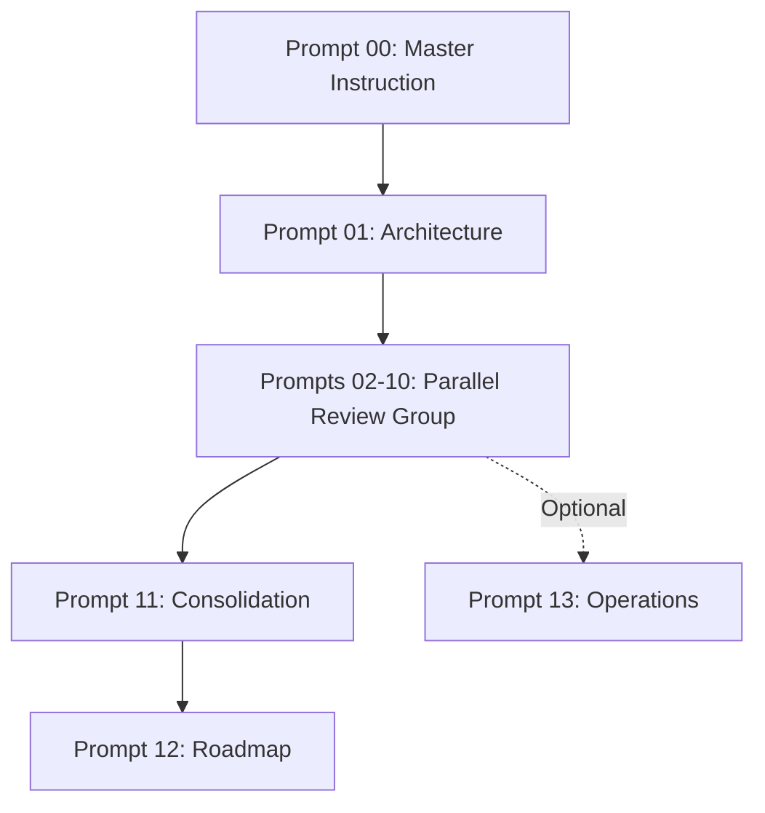

# Comprehensive Prompt Improvement Recommendations

## sonarft Monorepo Code Review Prompts Analysis

**Date:** April 2026  
**Scope:** All 49 prompt files (Bot: 19, API: 16, Web: 15)  
**Analysis Focuses:** Structure, clarity, completeness, consistency, and AI reviewer effectiveness

---

## Executive Summary

The prompt suite has **strong foundational structure** with:

- ✅ Clear modular organization (10 core prompts per package)
- ✅ Consistent master instructions
- ✅ Good coverage of major domains

However, there are **systematic inconsistencies and gaps** that reduce effectiveness:

- ❌ **Metadata inconsistency** — Header information varies across prompts
- ❌ **Output format ambiguity** — AI doesn't know exactly what structure to produce
- ❌ **Missing cross-references** — Prompts don't indicate dependencies/relationships
- ❌ **Incomplete "How to Use"** — Users unclear on workflow
- ❌ **Non-applicable feature handling** — Prompts don't guide AI on missing features
- ❌ **No output verification guidance** — Users don't know how to validate AI output

**Recommendation:** Implement all Category 1 and 2 improvements immediately (relatively low effort, high impact). These are implementable in bulk via find-and-replace and template standardization.

---

## Category 1: Metadata Standardization (HIGH PRIORITY)

### Problem

Prompt headers are inconsistent across packages and individual prompts.

**Current State:**

- Bot prompts: Inconsistent metadata format
- API prompts: More consistent (e.g., "Prompt: 02-api-endpoints-design")
- Web prompts: Similar inconsistency to Bot
- Missing fields: Cross-references, dependencies, output structure hints

**Impact:** Users don't know at a glance:

- What this prompt does
- When to run it (before/after what?)
- What the output should look like
- How long it takes
- What prerequisites are needed

### Recommendation

Create standardized metadata header for ALL core review prompts (01-10 in each package). Every prompt should start with:

```markdown
# Prompt ## — [Full Name]

**Package:** bot | api | web  
**Prompt ID:** ##-prompt-name  
**Category:** [Domain category]  
**Criticality:** Standard | High | Critical  
**Output Location:** `docs/[path]/[filename].md`  
**Time Estimate:** ##-## minutes  
**Run After:** [Prompt names - ordered list]  
**Can Run In Parallel With:** [List of prompts that can run simultaneously]  
**Prerequisites:** [Dependencies to have completed first]  
**Output Structure:** [See section below]

---

## When to Use This Prompt

[Current description, improved]

---
```

**Impact by Prompt Count:** 30 core prompts (10 per package) need this header standardization

**Foundation/Post-Review files** (00s, 11-13, 99s) get simplified headers appropriate to their role

### Specific Examples

**Current (Bot 01-architecture-structure.md):**

```
# Prompt 1 — Architecture & Project Structure

**Focus:** System organization, technology stack, and module design
**Category:** Architecture & Design
**Output File:** `docs/architecture/overview.md`
**Run After:** [00-master-instruction.md](./00-master-instruction.md)
**Time Estimate:** 20-30 minutes
**Prerequisites:** Have sonarft codebase uploaded to AI
```

**Improved (with full metadata):**

```
# Prompt 01 — Architecture & Project Structure

**Package:** bot
**Prompt ID:** 01-architecture-structure
**Category:** Architecture & Design
**Criticality:** High (context for all other prompts)
**Output Location:** `docs/architecture/overview.md`
**Time Estimate:** 20-30 minutes
**Run After:** 00-master-instruction.md
**Can Run In Parallel With:** None (all others depend on this)
**Prerequisites:** Have sonarft codebase uploaded to AI
**Output Structure:** See "Expected Output Format" section below
```

**API 02-api-endpoints-design.md (Current):**

```
# API Endpoints Design & REST Contract Review Prompt

**Prompt:** 02-api-endpoints-design
**Time:** 45-60 minutes
**Output:** Markdown document in `docs/endpoints/`
**Prerequisites:** [Master Instruction](./00-master-instruction.md)
```

**Improved:**

```
# Prompt 02 — API Endpoints Design & REST Contract

**Package:** api
**Prompt ID:** 02-api-endpoints-design
**Category:** API Design
**Criticality:** High
**Output Location:** `docs/endpoints/design.md`
**Time Estimate:** 45-60 minutes
**Run After:** 01-architecture-structure.md
**Can Run In Parallel With:** 03-data-models-validation.md, 04-authentication-security.md
**Prerequisites:** 00-master-instruction.md read, codebase uploaded
**Output Structure:** See "Expected Output Format" section below
```

---

## Category 2: Output Format Specification (HIGH PRIORITY)

### Problem

Prompts tell AI to "produce a Markdown document" but don't specify what sections/structure to include. This leads to variable output quality.

**Current State:**

- Some prompts have detailed output descriptions (e.g., Bot Prompt 1: "The AI will produce... containing: Technology Stack Table...")
- Most prompts are vague: "Generate Markdown document"
- No standardized section layout across packages
- Each prompt re-invents output structure

**Impact:**

- AI output inconsistency (format varies by prompt)
- Users can't easily compare findings across prompts
- Generated docs have different organization styles
- Harder to consolidate into final reports

### Recommendation

Add standardized "**Expected Output Format**" section to EVERY core review prompt (01-10).

Format should specify:

1. **Document structure** (sections in order)
2. **Table formats** (if using tables, show exact format)
3. **How to handle "not found" cases**
4. **Code example sections** (when to include)
5. **Diagram expectations** (Mermaid format guidance)

### Implementation Template

Add this section to each prompt (after "When to Use This Prompt"):

```markdown
---

## Expected Output Format

When you generate output for this prompt, structure it as follows:

### Document Sections (in this order)
1. **Executive Summary** (1 paragraph, 3-5 key findings)
2. **[Domain Area 1]** - Key findings for this area
3. **[Domain Area 2]** - Key findings for this area
4. **Issues & Concerns** - Table format (see below)
5. **Recommendations** - Prioritized list
6. **Next Steps** - What to review next

### Table Format for Issues
When listing issues, use this table structure:

| ID | Component | Issue | Severity | Recommendation |
|----|-----------|-------|----------|-----------------|
| A1 | [component] | [description] | Low/Medium/High/Critical | [action] |

### Diagram Format
When creating diagrams, use Mermaid format:
- Architecture diagrams: flowchart or graph
- Sequences: sequenceDiagram
- State machines: stateDiagram

### Handling Missing Features
If a feature is not found in the code (e.g., caching is not implemented):
- Write: "⚠️ Feature not implemented: [description]"
- Explain the impact of it being missing
- Suggest implementation approach

### Code Examples
When showing issues, provide:
- File path and line numbers
- Code snippet (3-5 lines of context)
- Explanation of the issue
- Suggested fix (if applicable)

---
```

### Specific Examples

**Bot Prompt 04-financial-math.md - Current Incomplete:**

```
### Output Format

Generate a Markdown document including:
- Executive Summary
- Complete Endpoint Reference Table (Method | Path | Handler | Auth | Description)
- Design Pattern Analysis
- Endpoint Documentation Examples
- Consistency Assessment
- Issues Found (with severity ratings)
- Recommendations (prioritized)
- Before/After refactoring examples
```

**Improved (with specific guidance):**

```
### Output Format

Your output document `docs/trading/financial-math-review.md` should contain exactly these sections in order:

**1. Executive Summary (1 paragraph)**
- Concise assessment of financial math precision
- Single critical finding (if any)

**2. Precision Settings Inventory**
- Table with columns: Setting | Current Value | Recommended | Risk
- Document where Decimal precision is set
- Identify float contamination risks

**3. Financial Calculations Audit**
- Table format:
  | Calculation | Location | Uses Decimal | Rounding | Risk Level |
  |------------|----------|------------|---------|-----------|

**4. Issues Found**
- Table format:
  | Issue ID | Calculation | Severity | Example | Fix |
  |----------|------------|----------|---------|-----|

**5. Recommendations**
- Prioritized list (Critical first)
- Each with: Recommendation | Effort | Impact

**Handling Missing Features:**
If Decimal is not used anywhere:
- Write: "⚠️ Feature not implemented: Decimal precision setup"
- Explain: "All monetary calculations use Python floats, creating rounding errors"
- Suggest: "Add: from decimal import Decimal; getcontext().prec = 28"
```

---

## Category 3: Prompt Clarity & Completeness (HIGH PRIORITY)

### Problem

Prompts have varying levels of detail. Some have 8 sections, others 15+. Some guide AI thoroughly, others are vague. Inconsistent prompt quality affects output quality.

**Current State:**

- Bot Prompt 01: ~50 lines of instruction (solid)
- Bot Prompt 04 (Financial Math): ~150 lines (very thorough)
- API Prompt 05 (WebSocket): ~100 lines (good detail)
- Web Prompt 03 (State Management): ~120 lines (good)
- Bot Prompt 03 (Trading Logic): Variable depth

**Impact:**

- Shorter prompts get less thorough analysis
- Users don't know which prompts are thorough vs shallow
- Inconsistent review quality across packages

### Recommendation

Audit all prompts for completeness. Each core review prompt (01-10) should have:

1. **Clear section count:** Aim for 8-12 subsections (too few = shallow, too many = overwhelming)
2. **Concrete examples:** Each major section should have "example code" or "sample findings"
3. **"Not Applicable" handling:** Guidance for when a section doesn't apply
4. **Consistency across packages:** Similar domains should have similar detail level

### Specific Gaps Identified

**Bot Prompt 02 (Async-Concurrency) is good** (8 sections, detailed)
**API Prompt 05 (WebSocket-Realtime) needs improvement:**

- Current: Missing guidance on "what if WebSocket is not fully implemented?"
- Recommendation: Add "⚠️ Handling Partial Implementations" section

**Web Prompt 04 (UI-Component-Design) is unclear:**

- Current: Says "Copy prompt below" but prompt is missing
- Recommendation: Include full prompt or link to template file

**Bot Prompt 06 (Execution-Exchange) needs:**

- More guidance on "what if using mock exchange for testing?"
- Example connection flows
- Clearer error scenario guidance

### Implementation Approach

For each prompt, audit against this checklist:

```
□ Does it have 8-12 main sections?
□ Does each section have concrete examples?
□ Does it address "feature not implemented" cases?
□ Does it show expected output?
□ Does it explain severity levels used?
□ Does it reference related prompts?
□ Is guidance actionable (not vague)?
□ Does it handle edge cases?
```

---

## Category 4: Cross-References & Navigation (HIGH PRIORITY)

### Problem

Prompts don't indicate relationships with other prompts in the same package or across packages.

**Current State:**

- Bot Prompt 01 says "Run this first" but doesn't list what can run next
- Some prompts reference others in "Run After" but inconsistently
- No "See Also" sections
- No indication of parallel-runnable prompts
- Cross-package references only in READMEs, not in individual prompts

**Impact:**

- Users don't know optimal workflow
- Some users run prompts out of order unnecessarily
- No cross-package guidance (when to review Bot, then API, then Web)
- Hard to find related analysis across packages

### Recommendation

Add two sections to every core review prompt:

**1. Add to metadata (Recommendation 1 already covers this):**

- "Run After: [list]"
- "Can Run In Parallel With: [list]"

**2. Add new "Related Prompts" section before "The Prompt":**

```markdown
---

## Related Prompts

**Must Complete First:**
- [00-master-instruction.md](./00-master-instruction.md) — Core context

**Dependency Chain:**
This prompt depends on findings from:
- [01-architecture-structure.md](./01-architecture-structure.md) — Architecture overview context

**Recommended Together:**
Run with one of these for comprehensive analysis:
- [02-async-concurrency.md](./02-async-concurrency.md) — For concurrency-heavy code
- [08-security-risk.md](./08-security-risk.md) — For security-critical sections

**Cross-Package Related:**
- **API:** [02-api-endpoints-design.md](../../api/docs/prompts/02-api-endpoints-design.md) — If reviewing API integration
- **Web:** [02-api-integration.md](../../web/docs/prompts/02-api-integration.md) — If reviewing web client calls

---
```

### Specific Examples

**Bot Prompt 01 (current):**

```
# Prompt 1 — Architecture & Project Structure
**Run After:** [00-master-instruction.md](./00-master-instruction.md)
```

**Improved:**

```
# Prompt 01 — Architecture & Project Structure

**Run After:** 00-master-instruction.md
**Can Run In Parallel With:** None (all others depend on this)
**Recommended Sequence:** This is the first prompt. Follow with prompts 02-10 in any order.

---

## Related Prompts

**Foundation:**
- [00-master-instruction.md](./00-master-instruction.md) — Context setup

**Dependencies:**
- After this prompt, all other bot prompts can run (02-10)

**Recommended Sequence for Complete Audit:**
1. This prompt (01) — Get architecture overview
2. [02-async-concurrency.md](./02-async-concurrency.md) — Verify async safety
3. [03-trading-engine-logic.md](./03-trading-engine-logic.md) — Trading correctness
4. [04-financial-math.md](./04-financial-math.md) — Financial precision
5. Others (any order)

**Cross-Package Context:**
If doing full-stack review (Bot → API → Web):
- **Next:** API [01-architecture-structure.md](../../api/docs/prompts/01-architecture-structure.md) — Understand API that bot connects to
- **Then:** Web [01-architecture-structure.md](../../web/docs/prompts/01-architecture-structure.md) — See how web uses bot

---
```

---

## Category 5: "How to Use" Clarity (MEDIUM PRIORITY)

### Problem

Master Instructions have detailed "How to Use" but individual prompts have minimal guidance.

**Current State:**

- Master Instructions: 3-page "How to Use This Instruction" section
- Individual Prompts: 1-2 sentences like "Copy and paste into your AI chat"
- Unclear: Should users use same chat or new chat?
- Unclear: How to save output exactly?
- Unclear: What to do if AI output seems incomplete?

**Impact:**

- Users unsure about workflow
- Some users may repeat master instruction unnecessarily
- No guidance on output validation
- No guidance on customization

### Recommendation

Add "**How to Use This Prompt**" section to each individual prompt.

Template:

```markdown
## How to Use This Prompt

### Step 1: Prepare Your Chat

- Use the same AI conversation where you pasted the Master Instruction
- OR start a new conversation and re-paste the Master Instruction
  - New chat: Better if the conversation is getting long (>20 exchanges)
  - Same chat: Preferred if conversation is still focused

### Step 2: Copy & Paste

1. Copy the entire text in the "## The Prompt" section below (including code block if present)
2. Paste into your AI chat
3. Wait for acknowledgment that AI understands

### Step 3: Provide Context

If starting a new chat, first paste:

1. The Master Instruction from [00-master-instruction.md](./00-master-instruction.md)
2. Then this prompt

If continuing same chat, just paste the prompt.

### Step 4: Let AI Generate Output

- AI will analyze the codebase and produce documentation
- This typically takes 2-3 minutes (watch the token count)
- AI will structure output with clear sections

### Step 5: Save the Output

Copy AI's complete output and save to: `docs/[expected-path]/[filename].md`

**Expected output location:** `docs/[path]/[filename].md` (shown in header)

### Step 6: Validate Output

Before moving to next prompt, verify the output contains:

- ✅ Executive summary or overview
- ✅ All major sections listed in "Expected Output Format"
- ✅ Specific findings with code citations (file names, line numbers)
- ✅ Tables and structured data
- ✅ Recommendations section

**If output seems incomplete:**

- Ask AI: "Can you expand on [section name]? Provide more specific findings."
- This usually fixes truncated output

---
```

### Specific Example

**Current (Bot Prompt 02-async-concurrency.md):**

```
## When to Use This Prompt

Use this prompt to verify async/await correctness and identify concurrency risks. Critical for a system designed for multi-bot concurrency.

**Best for:**
- Verifying async safety
- Finding race conditions
- Checking task lifecycle management
- Validating error handling in async code

---

## The Prompt

Copy and paste this into your AI chat:
```

**Improved:**

```
## When to Use This Prompt

Use this prompt to verify async/await correctness and identify concurrency risks. Critical for a system designed for multi-bot concurrency.

**Best for:**
- Verifying async safety
- Finding race conditions
- Checking task lifecycle management
- Validating error handling in async code

---

## How to Use This Prompt

### Step 1: Prepare Your Chat
- You should already have the Master Instruction pasted and the codebase uploaded
- Use the same chat session from Prompt 01 (01-architecture-structure.md)
- If your chat is getting long, start a new one and re-paste the Master Instruction

### Step 2: Copy & Paste This Prompt
1. Copy everything between the triple backticks below
2. Paste into your AI chat
3. Wait for "I'll analyze the async patterns..." or similar confirmation

### Step 3: Let AI Analyze (2-3 minutes)
- The AI will examine all async functions and patterns
- It will create tables of findings and risk assessments
- It will generate Mermaid diagrams of execution flow

### Step 4: Save the Output
Copy the complete AI response and save to:
```

docs/architecture/async-concurrency.md

```

### Step 5: Verify Output
Before moving to Prompt 03, check that your saved file contains:
- ✅ Executive summary of async correctness
- ✅ Inventory of async functions with risk levels
- ✅ Task management review (creation, monitoring, cleanup)
- ✅ Concurrency risk table
- ✅ Mermaid flow diagram
- ✅ Specific remediation recommendations

**If output is incomplete:**
- Ask AI: "Add more detail to the Task Management Analysis section. Provide specific examples from the code."
- Re-save the updated output

---

## The Prompt

Copy and paste this into your AI chat:
```

---

## Category 6: Workflow & Sequencing Clarity (MEDIUM PRIORITY)

### Problem

While quick-start guides show paths, individual prompts don't explain WHY order matters or which prompts have true dependencies vs optional ordering.

**Current State:**

- Master Instructions say "run prompts in order" but many don't have hard dependencies
- Some prompts can run in parallel (no dependency)
- Some prompts have true dependencies (need prior results)
- No workflow diagram
- No guidance on "what if I only want to review security?"

**Impact:**

- Users unnecessarily wait for sequential execution
- No guidance on focused/selective audits
- Hard to parallelize work among team members

### Recommendation

Add to each package's README (bot, api, web) a **workflow section** with:

1. **Dependency diagram** (Mermaid flowchart)
2. **Execution matrix** (which prompts can run in parallel)
3. **Focused review paths** (e.g., "Security-focused audit")

Template for README improvement:

````markdown
## Execution Workflows

### Parallel Execution Matrix

These prompts have **NO dependencies** on each other (can run in parallel):

| Group             | Prompts | Notes                                                              |
| ----------------- | ------- | ------------------------------------------------------------------ |
| Post-Architecture | 02-10   | All depend on 01 being completed first, but can run simultaneously |

These prompts **must run sequentially**:

| Sequence     | Dependencies                                |
| ------------ | ------------------------------------------- |
| 01 → {02-10} | All others depend on 01 completing          |
| {01-10} → 11 | Consolidation requires all 10 prior prompts |
| 11 → 12      | Roadmap needs consolidation findings        |

### Workflow Diagram


````

### Focused Review Paths

**Security Audit Only (30-45 min)**

- Prompt 01 (Architecture) — 20 min
- Prompt 08 (Security) — 25 min
- Total: 45 minutes
- Output: `docs/security/security-audit.md`

**Performance Audit Only (30-45 min)**

- Prompt 01 (Architecture) — 20 min
- Prompt 09 (Performance) — 25 min
- Total: 45 minutes
- Output: `docs/performance/performance-analysis.md`

**Team-Distributed Full Audit (2-3 hours)**

- Person 1: Prompt 01 (20 min)
- Persons 2-5: Prompts 02-10 in parallel (25-35 min each)
- Person 6: Prompt 11 using outputs from Persons 2-5 (20 min)
- Total: 2-3 hours elapsed time
- Output: Complete docs/ folder

---

````

---

## Category 7: Non-Applicable Feature Handling (MEDIUM PRIORITY)

### Problem
Prompts assume features exist that may not be in a particular codebase, or ask about specific technologies that vary by package.

**Current State:**
- Bot Prompt 01: "Examine async framework libraries" (correct for all)
- API Prompt 05: "How many concurrent connections can WebSocket handle?" (assumes WebSocket exists)
- Web Prompt 08: "Image optimization: Are images lazy-loaded?" (assumes image presence)
- Some sections become "feature not found" with no guidance

**Impact:**
- AI produces "feature not found" without impact analysis
- Users wonder: Is this a problem?
- No guidance on what the impact is of missing features

### Recommendation

Add "**⚠️ Feature Not Implemented Guidance**" section to prompts where features might be optional:

Template:

```markdown
## ⚠️ If This Feature Is Not Implemented

If [feature] is not found in the code:

**For This Prompt:**
- Document it as: "⚠️ Not implemented: [feature description]"
- Assess impact: Why is this missing? Is it a problem?
- Example: "WebSocket for real-time updates is not implemented. Impact: Trading updates require page refresh."

**Next Steps:**
- If critical to operations: Flag for implementation
- If non-critical: Note as nice-to-have improvement

---
````

### Specific Examples

**Bot Prompt 07 (Configuration-Runtime) - Add:**

```
## ⚠️ If Runtime Configuration Is Not Found

If no configuration file format is found (no JSON, YAML, etc.):
- Document: "⚠️ Configuration not implemented: No external config detected"
- Assess: "Configuration appears to be hardcoded in Python files"
- Impact: "Changes require code modification and redeployment"
- Flag: HIGH priority improvement (externalize configuration)
```

**API Prompt 05 (WebSocket-Realtime) - Add:**

```
## ⚠️ If WebSocket Is Not Fully Implemented

If WebSocket endpoints are not found or incomplete:
- Document: "⚠️ Real-time streaming not implemented: No WebSocket endpoints found"
- Current approach: List alternative (polling, Server-Sent Events, etc.)
- Impact: "Real-time UI updates not supported. Clients must poll API."
- Options: "Consider implementing WebSocket for reduced latency (impact on server)"
```

**Web Prompt 08 (Performance-Optimization) - Add:**

```
## ⚠️ If Optimization Feature Is Not Present

Common missing features in sonarftweb:

**Code Splitting Not Implemented:**
- Document: "⚠️ Code splitting not implemented: Single bundle approach"
- Impact: "All code loaded on first page. Larger initial bundle = slower first paint"
- Recommendation: "Implement route-based code splitting"

**Image Optimization Not Present:**
- Document: "⚠️ Image optimization not implemented: No lazy loading detected"
- Impact: "[estimate] KB of images loaded on initial page"
- Recommendation: "Implement lazy loading with Intersection Observer API"
```

---

## Category 8: AI Output Verification Guidance (MEDIUM PRIORITY)

### Problem

Users don't know how to validate or improve AI-generated output. Some don't realize output can be incomplete or need follow-up.

**Current State:**

- No guidance on "how much detail is enough?"
- No checklist to verify completeness
- No examples of "good output" vs "insufficient output"
- No guidance on follow-up prompts if output is incomplete

**Impact:**

- Users accept incomplete analyses
- Some analyses miss important details
- No improvement loop when output is insufficient

### Recommendation

Add "**Output Verification Checklist**" to each prompt's "How to Use" section:

Template:

```markdown
### Verify Output Completeness

After AI generates output, check your saved file contains:

**Required Sections (ALL must be present):**

- ☐ Executive summary/overview
- ☐ [Section 1 title]
- ☐ [Section 2 title]
- ...
- ☐ Recommendations or next steps

**Quality Indicators (look for these):**

- ☐ File paths and line numbers (e.g., "In sonarft_bot.py line 45")
- ☐ Code snippets showing examples
- ☐ Table format for findings (not just prose)
- ☐ Severity/priority levels assigned
- ☐ Specific improvement suggestions (not vague)
- ☐ Mermaid diagrams (if applicable)

**If Output Seems Incomplete:**

Missing entire sections:
```

Ask AI: "You didn't cover [section name]. Please add it with specific findings."
Then re-save the updated output.

```

Lacks specific examples:
```

Ask AI: "Add specific file names and line numbers. Show code snippets of the issues found."

```

Too vague:
```

Ask AI: "Your recommendations are too vague. For each recommendation, explain:

- What to change (specific code location)
- Why (impact of change)
- Example of fixed code"

```

**Common Follow-up Prompts:**
- "Expand on [section]. Provide more specific findings and examples."
- "Create a before/after code example for the top 3 recommendations."
- "Add severity levels (Low/Medium/High/Critical) to each issue."

---
```

### Specific Examples

**Bot Prompt 04 (Financial-Math) Output Verification:**

```
### Verify Financial Math Review Completeness

Check that your output includes:

**Required Content:**
- ☐ Inventory of ALL financial calculations (table with locations)
- ☐ Decimal vs float assessment
- ☐ At least 3 specific calculations analyzed in detail
- ☐ VWAP calculation verification (critical)
- ☐ Fee calculation verification
- ☐ Profit calculation verification
- ☐ Rounding issues identified (if any)
- ☐ Recommendations with specific code changes

**Quality Checks:**
- ☐ Every recommendation includes file path and line number
- ☐ Shows example problematic code (3-5 lines)
- ☐ Shows corrected code
- ☐ Uses Decimal library or similar precision method
- ☐ Severity levels assigned (Low/Medium/High)

**If output lacks calculations detail:**
Ask AI: "I need more detail on specific calculations. For each financial calculation:
1. Show the current code
2. Explain the precision risk
3. Show the corrected approach with Decimal
Include: VWAP, fees, profit calculation, exchange minimums"
```

---

## Category 9: Standardize Severity/Priority Levels (MEDIUM PRIORITY)

### Problem

Different prompts use different severity rating systems, making consolidated reports confusing.

**Current State:**

- Some use: Low, Medium, High, Critical
- Some use: Low, Medium, High
- Some use: Severity | Effort | Impact (different dimensions)
- Financial Math uses: Risk Level
- Consistency: Not enforced across packages

**Impact:**

- Consolidated reports mix terminology
- Hard to rank issues across domains
- Users confused by different scales

### Recommendation

Standardize severity levels across ALL prompts:

```markdown
## Standard Severity Levels

Use these exact terms for ALL issues/risks:

| Level        | Definition                                | Time to Address       | Example                                         |
| ------------ | ----------------------------------------- | --------------------- | ----------------------------------------------- |
| **Critical** | Blocks production / causes immediate harm | Before any deployment | Data loss bug, financial error, security breach |
| **High**     | Significant risk but not blocking         | Before production     | Memory leak under load, missing auth check      |
| **Medium**   | Should be fixed but not urgent            | Next sprint           | Code duplication, non-optimal algorithm         |
| **Low**      | Nice-to-have improvement                  | Backlog               | Code style issue, unused import                 |

### Using These Levels

- When listing issues, assign exactly one level per issue
- Explain reasoning: "Critical because [consequence]"
- Group findings by level in recommendations section
```

Add this to 99-best-practices.md in each package, then reference it from every prompt:

```markdown
**Severity Levels:** See [Best Practices — Standard Severity Levels](./99-best-practices.md#standard-severity-levels) for definitions.
```

---

## Category 10: Cross-Package Integration Points (MEDIUM PRIORITY)

### Problem

When reviewing a full-stack system, prompts don't guide users on how to coordinate findings across bot → API → web.

**Current State:**

- Bot prompts: Mention API integration but don't detail where
- API prompts: Mention bot engine and web client but vaguely
- Web prompts: Mention API but don't show integration points
- No guidance on "this finding in bot affects API design"

**Impact:**

- Full-stack reviews miss integration issues
- Architecture improvements in one package don't consider others
- Users don't realize bot bug might explain API issue

### Recommendation

Add "**Full-Stack Context**" sections to each package's README and foundation prompts:

For `/packages/bot/docs/prompts/README.md` - Add:

```markdown
## Full-Stack Review Context

### How Bot Integrates with API

- **Bot Process:** sonarft_bot.py runs as subprocess
- **API Integration:** sonarft_api_manager.py creates HTTP clients to API
- **WebSocket:** Real-time updates flow from API → Web
- **Configuration:** API serves configuration to bot

**When reviewing bot for full-stack impact:**

- Check: Does bot's error handling propagate to API?
- Check: Are bot execution times compatible with API timeout settings?
- Check: Is bot state exposed through API endpoints?

### How API Integrates with Web

- **Endpoints:** Web consumes bot management endpoints
- **WebSocket:** Real-time data flows to web client
- **Authentication:** API authentication affects web security

**When reviewing bot architecture:**

- Consider: How will the API expose bot functionality?
- Consider: What WebSocket messages does API need to send?
- Consider: Will bot state changes trigger API events?

### Recommended Full-Stack Audit Order

1. **Bot Prompts 01-10** (30-35 min each = 5+ hours)
2. **Review Integration:** Run [API Prompt 01](../../api/docs/prompts/01-architecture-structure.md) with bot findings in mind
3. **API Prompts 02-10** (30-45 min each = 5+ hours)
4. **Review Integration:** Run [Web Prompt 02](../../web/docs/prompts/02-api-integration.md) with API findings
5. **Web Prompts 03-10** (25-35 min each = 3+ hours)
6. **Consolidate:** Run [Final Consolidation](./11-final-consolidation.md) across all three packages
7. **Integration Review:** Create integration risk analysis (see below)

### Integration Risk Analysis

After completing all three package reviews, create:

- Document: `docs/integration/full-stack-analysis.md`
- Content:
  - Cross-package architecture diagram
  - Integration point risks
  - Data flow verification
  - Deployment order and dependencies

---
```

### Specific Example for Cross-Package Prompts

**Add to Bot Prompt 01 (Architecture-Structure):**

```markdown
## Full-Stack Consideration

This prompt focuses on bot architecture in isolation. For full-stack review:

### How Bot Architecture Affects API

- Bot module structure determines what API endpoints are needed
- Async patterns in bot affect API request handling
- Bot configuration approach influences API configuration endpoints

**After completing this prompt:**

- Review [API Prompt 01: Architecture](../../api/docs/prompts/01-architecture-structure.md)
- Compare: Do API module responsibilities align with bot responsibilities?
- Note: Any architectural mismatches between bot and API

### Related API Findings

- API endpoints should map to bot capabilities (1:1 mapping preferred)
- Bot error types should match API error responses
- Bot configuration fields should have API endpoints to modify them

---
```

---

## Category 11: Time Estimate Validation (LOW PRIORITY)

### Problem

Time estimates may not reflect actual AI execution time, which varies by codebase size.

**Current State:**

- Bot prompts: 20-30 min ranges
- API prompts: 30-60 min ranges
- Web prompts: 20-35 min ranges
- No guidance on what affects time
- No guidance on "if output is slow..."

**Impact:**

- Users frustrated if execution takes longer than estimated
- No guidance on timeout handling
- No acknowledgment of codebase-size dependency

### Recommendation

Add "**Time Estimate Factors**" to master instructions and quick-start guides:

```markdown
### Time Estimates

Shown times assume:

- Codebase size: Medium (5,000-20,000 lines of code)
- Complexity: Average (no unusual patterns)
- AI model: GPT-4 or Claude (recommended)

**If your codebase is larger:**

- Add 50-100% to estimated time
- Larger codebases require more detailed analysis

**If AI response is slow:**

- Check: Is your codebase unusually large?
- Try: Running simpler prompts first (e.g., Prompt 10 before Prompt 01)
- Try: Asking AI to focus on key files only

---
```

---

## Category 12: Inconsistent Link Formats (LOW PRIORITY)

### Problem

Links to prompts use inconsistent formats across files.

**Current State:**

- Some: `[Prompt Name](./##-filename.md)`
- Some: `[Prompt Name](./filename.md)` (without number)
- Some: `[##-filename.md](./##-filename.md)` (shows filename, not title)
- Cross-package links: Sometimes missing, sometimes broken format

**Impact:**

- Minor: Inconsistent navigation experience
- Minor: Some links harder to read

### Recommendation

Standardize link format for all prompts:

```markdown
# Standard Link Format

**Internal (same package):**

- Prompt name with file: [Prompt 01 — Architecture Structure](./01-architecture-structure.md)
- External reference: [See best practices](./99-best-practices.md)

**Cross-package:**

- Link format: [Prompt 02 — API Endpoints](../../api/docs/prompts/02-api-endpoints-design.md)
- Always include prompt number and full name
```

Apply consistently via find-and-replace across all three packages.

---

## Implementation Priority & Effort Matrix

| Category                             | Priority | Effort    | Impact    | Affects                             |
| ------------------------------------ | -------- | --------- | --------- | ----------------------------------- |
| **1. Metadata Standardization**      | 🔴 HIGH  | 2-3 hours | Very High | 30 prompts (01-10 x3)               |
| **2. Output Format Specification**   | 🔴 HIGH  | 3-4 hours | Very High | 30 prompts (01-10 x3)               |
| **3. Prompt Clarity & Completeness** | 🔴 HIGH  | 4-6 hours | High      | 30 prompts + review                 |
| **4. Cross-References & Navigation** | 🟡 HIGH  | 2-3 hours | High      | 30 prompts + 3 READMEs              |
| **5. "How to Use" Clarity**          | 🟡 MED   | 2-3 hours | Medium    | 30 prompts (01-10 x3)               |
| **6. Workflow & Sequencing**         | 🟡 MED   | 1-2 hours | Medium    | 3 READMEs                           |
| **7. Non-Applicable Features**       | 🟡 MED   | 2-3 hours | Medium    | ~10-15 prompts                      |
| **8. Output Verification Guidance**  | 🟡 MED   | 2-3 hours | Medium    | 30 prompts (01-10 x3)               |
| **9. Standardize Severity Levels**   | 🟠 LOW   | 1 hour    | Medium    | 3 best-practices files + 30 prompts |
| **10. Cross-Package Integration**    | 🟠 LOW   | 1-2 hours | Medium    | 3 READMEs, foundation prompts       |
| **11. Time Estimate Validation**     | ⚪ LOW   | 30 min    | Low       | Master instructions                 |
| **12. Link Format Consistency**      | ⚪ LOW   | 1 hour    | Low       | ~100+ links across all files        |

**Total Effort:** 22-30 hours  
**Recommended Timeline:**

- Categories 1-4: Complete first (9-13 hours) — Core consistency improvements
- Categories 5-8: Complete second (8-10 hours) — User guidance improvements
- Categories 9-12: Complete as polish (4-5 hours) — Nice-to-have refinements

---

## Bulk Implementation Approach

Since you have ~49 files, use bulk operations:

### For Category 1 (Metadata) & 2 (Output Format):

1. **Create template files** for each package:
   - `/packages/bot/docs/prompts/TEMPLATE-01-core-prompt.md`
   - `/packages/api/docs/prompts/TEMPLATE-01-core-prompt.md`
   - `/packages/web/docs/prompts/TEMPLATE-01-core-prompt.md`

2. **Use find-and-replace** to add metadata headers to all 01-10 prompts

3. **Use find-and-replace** to add "Expected Output Format" sections

### For Category 4 (Cross-References):

1. Create cross-reference matrix (Excel/CSV):

   ```
   Prompt | Run After | Can Parallel With | Related (Cross-Pkg) | Cross-Pkg Link
   01 | 00-master | None | API-01, Web-01 | ../../api/docs/...
   02 | 01 | 03-10 | API-02 | ../../api/docs/...
   ```

2. Use this matrix to add "Related Prompts" sections uniformly

### For Other Categories:

Apply similar templating and bulk find-and-replace approaches per category.

---

## Success Metrics

After implementing all recommendations:

| Metric                     | Before  | Target | Validation                              |
| -------------------------- | ------- | ------ | --------------------------------------- |
| Consistency Score          | 60%     | 95%+   | All headers follow same format          |
| Output Spec Clarity        | 40%     | 100%   | Every prompt specifies output structure |
| Navigation Efficiency      | Medium  | High   | Users can find relationships quickly    |
| Time Estimate Accuracy     | Unknown | ±15%   | Track actual vs estimated time          |
| User Guidance Completeness | 50%     | 95%    | Every prompt has "How to Use" section   |
| AI Output Quality          | Medium  | High   | Fewer follow-up questions needed        |

---

## Next Steps

1. **Review this document** with team
2. **Prioritize categories** 1-4 for immediate implementation
3. **Create templates** for each category
4. **Assign to team** (can be parallelized)
5. **Test on sample prompts** before bulk application
6. **Update monorepo master guides** ([PROMPTS_MASTER_GUIDE.md](../../docs/PROMPTS_MASTER_GUIDE.md), [PROMPTS_INDEX.md](../../docs/PROMPTS_INDEX.md))
7. **Document changes** in this file with dates completed

---

## Appendix A: Metadata Template

Use this template for all core review prompts (01-10):

```markdown
# Prompt ## — [Full Descriptive Name]

**Package:** bot | api | web  
**Prompt ID:** ##-prompt-slug  
**Category:** [Domain]  
**Criticality:** Standard | High | Critical  
**Output Location:** `docs/[category]/[filename].md`  
**Time Estimate:** ##-## minutes  
**Run After:** [List of prompts that must complete first]  
**Can Run In Parallel With:** [List of prompts with no dependencies]  
**Prerequisites:** [Requirements]

---

## When to Use This Prompt

[Description of when/why to use]

---

## Expected Output Format

[Sections AI should generate, with structure]

---

## How to Use This Prompt

[Step-by-step instructions]

---

## Related Prompts

[Cross-references]

---

## The Prompt

[Actual prompt text]

---

## What This Generates

[Summary of output]
```

---

## Appendix B: Quick Reference — All 49 Prompt Files by Package

### Bot Package (19 files)

- 00-master-instruction.md ✓
- 00-quick-start-guide.md ✓
- 01-architecture-structure.md (Needs improvement)
- 02-async-concurrency.md ✓
- 03-trading-engine-logic.md (Medium)
- 04-financial-math.md ✓
- 05-indicator-pipeline.md (Medium)
- 06-execution-exchange.md (Medium)
- 07-configuration-runtime.md (Medium)
- 08-security-risk.md (Medium)
- 09-performance-scalability.md (Medium)
- 10-code-quality-testing.md (Medium)
- 11-final-consolidation.md ✓
- 12-implementation-roadmap.md (Medium)
- 13-setup-operations-guide.md (Medium)
- 99-best-practices.md (Medium)
- README.md ✓
- SEPARATION_STRATEGY.md (Reference)
- sonarft_comprehensive_ai_review_prompts.md (Legacy)

### API Package (16 files)

- 00-master-instruction.md ✓
- 00-quick-start-guide.md (Medium)
- 01-architecture-structure.md (Medium)
- 02-api-endpoints-design.md (Medium)
- 03-data-models-validation.md (Low detail)
- 04-authentication-security.md (Medium)
- 05-websocket-realtime.md (Medium)
- 06-error-handling-logging.md (Low detail)
- 07-database-persistence.md (Low detail)
- 08-performance-optimization.md (Medium)
- 09-testing-quality.md (Medium)
- 10-code-quality-python.md (Medium)
- 11-final-consolidation.md (Medium)
- 12-implementation-roadmap.md (Medium)
- 99-best-practices.md ✓
- README.md ✓

### Web Package (15 files)

- 00-master-instruction.md ✓
- 00-quick-start-guide.md (Medium)
- 01-architecture-structure.md (Medium)
- 02-api-integration.md (Low detail)
- 03-state-management.md (Medium)
- 04-ui-component-design.md (Low detail)
- 05-real-time-updates.md (Medium)
- 06-authentication-security.md (Medium)
- 07-trading-interface-ux.md (Low detail)
- 08-performance-optimization.md (Medium)
- 09-testing-quality.md (Low detail)
- 10-code-quality-javascript.md (Low detail)
- 11-final-consolidation.md (Medium)
- 12-implementation-roadmap.md (Medium)
- README.md ✓

✓ = Excellent (minimal changes)  
Medium = Good foundation, needs improvements  
Low detail = Needs expansion

---

**Document Version:** 1.0  
**Last Updated:** April 2026  
**Next Review:** After implementing improvements
