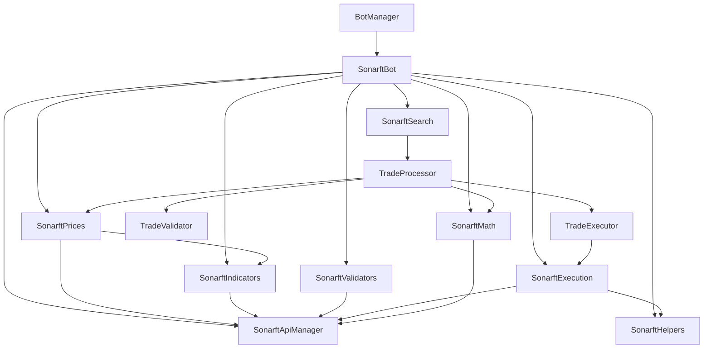
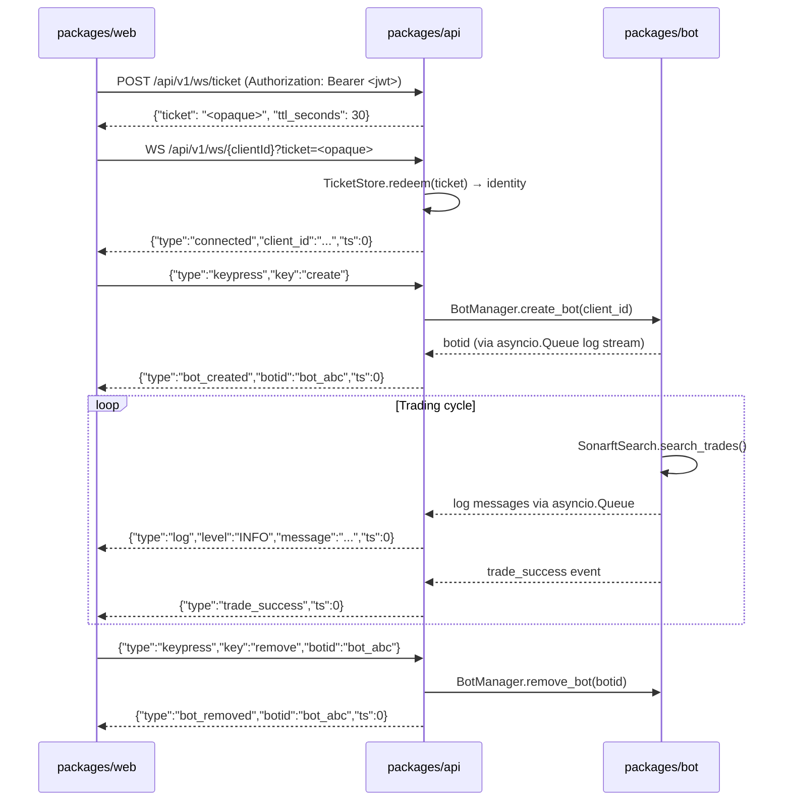
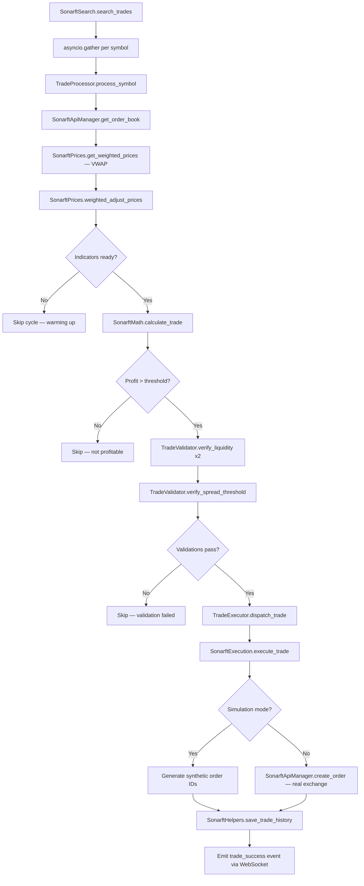

# Architecture

This document describes the SonarFT monorepo architecture: package responsibilities, layered design, data flow, trade execution lifecycle, concurrency model, and runtime storage.

---

## Monorepo Structure

SonarFT is a three-layer monorepo. Each package is independently deployable and has a single, well-defined responsibility.

```
sonarft-monorepo/
├── packages/
│   ├── bot/        # Python trading engine — no HTTP, no auth
│   ├── api/        # FastAPI backend — HTTP, WebSocket, auth
│   └── web/        # React frontend — UI only
├── shared/
│   └── types/
│       └── api.ts  # Single source of truth for API contract
├── infra/          # Docker Compose orchestration
└── Makefile        # Top-level commands
```

The key architectural constraint is **strict layer separation**:

- `packages/bot` has no knowledge of HTTP, authentication, or WebSocket protocols. It is a pure Python library importable as `sonarft-bot`.
- `packages/api` imports `sonarft-bot` and exposes its functionality over HTTP and WebSocket. It owns all auth, rate limiting, and transport concerns.
- `packages/web` talks only to `packages/api`. It has no direct knowledge of the bot engine.
- `shared/types/api.ts` defines the API contract as TypeScript types. The corresponding Pydantic models in `packages/api/src/models/schemas.py` must stay in sync.

---

## Layered Architecture

```
┌─────────────────────────────────────────────────────────────────┐
│  Transport Layer (packages/api)                                 │
│  FastAPI · uvicorn · CORSMiddleware · JWT auth · rate limiting  │
│  REST endpoints · WebSocket handler · ticket auth               │
└──────────────────────────┬──────────────────────────────────────┘
                           │ Python import
┌──────────────────────────▼──────────────────────────────────────┐
│  Orchestration Layer (packages/bot)                             │
│  BotManager — lifecycle, asyncio.Lock, client→bot mapping       │
│  SonarftBot — config loading, module wiring, run loop           │
└──────────────────────────┬──────────────────────────────────────┘
                           │ method calls
┌──────────────────────────▼──────────────────────────────────────┐
│  Strategy Layer (packages/bot)                                  │
│  SonarftSearch — concurrent symbol search via asyncio.gather    │
│  TradeProcessor — per-symbol price fetch, adjustment, profit    │
│  TradeValidator — liquidity and spread validation               │
│  TradeExecutor — async task management for execution            │
└──────────────────────────┬──────────────────────────────────────┘
                           │ method calls
┌──────────────────────────▼──────────────────────────────────────┐
│  Analysis Layer (packages/bot)                                  │
│  SonarftPrices — VWAP, weighted adjustment, spread logic        │
│  SonarftIndicators — RSI, MACD, StochRSI, SMA, volatility       │
│  SonarftMath — profit/fee calculation, exchange precision rules │
└──────────────────────────┬──────────────────────────────────────┘
                           │ method calls
┌──────────────────────────▼──────────────────────────────────────┐
│  Infrastructure Layer (packages/bot)                            │
│  SonarftApiManager — ccxtpro WebSocket / ccxt REST abstraction  │
│  SonarftExecution — order placement (real and simulated)        │
│  SonarftValidators — order book depth and spread checks         │
│  SonarftHelpers — file I/O, trade history persistence           │
└──────────────────────────┬──────────────────────────────────────┘
                           │ CCXT / ccxtpro
┌──────────────────────────▼──────────────────────────────────────┐
│  Exchange APIs                                                  │
│  OKX · Binance · Bitfinex · Kraken · KuCoin · ...              │
└─────────────────────────────────────────────────────────────────┘
```

---

## Dependency Graph



All dependencies flow downward. No module instantiates its own dependencies — they are all injected via constructor. `SonarftBot.initialize_modules()` is the single wiring point for the entire dependency graph.

---

## Data Flow

### REST Request Flow

```
Browser → packages/web
  → GET/POST /api/v1/clients/{id}/bots
  → packages/api (FastAPI)
    → JWT validation (require_auth dependency)
    → BotService.create_bot(client_id)
      → BotManager.create_bot(client_id)
        → SonarftBot.create_bot(config_setup)
          → load_configurations()
          → initialize_modules()
    → return {"botid": "..."}
  → packages/web renders updated bot list
```

### WebSocket Flow



The WebSocket ticket pattern keeps the JWT out of server access logs and browser history. The ticket has a 30-second TTL and is single-use — it is consumed on the first WebSocket connection attempt.

---

## Trade Execution Lifecycle



### Price Adjustment Inputs

`SonarftPrices.weighted_adjust_prices` combines the following signals to compute adjusted bid/ask prices:

| Signal | Source | Effect |
|---|---|---|
| Market direction | SMA or EMA trend | Bull: raise ask, lower bid; Bear: inverse |
| Short-term trend | Recent OHLCV close changes | Amplifies or dampens direction signal |
| RSI | pandas-ta | Overbought (≥70): widen spread; Oversold (≤30): tighten |
| StochRSI %K/%D | pandas-ta | Crossover signals refine entry/exit timing |
| MACD | pandas-ta | Weights the dynamic volatility adjustment factor |
| Volatility | Order book mid-price std dev | Scales the final price adjustment magnitude |
| Support/resistance | Historical high/low | Clamps adjusted prices within bounds |
| Spread factors | Config: `spread_increase_factor`, `spread_decrease_factor` | Applied based on combined direction signal |

The final price is a weighted blend of the target VWAP price and the current order book weighted price.

---

## Multi-Bot Concurrency Model

```
BotManager
├── _bots: dict[botid → SonarftBot]     # protected by asyncio.Lock
├── _clients: dict[client_id → [botid]] # protected by asyncio.Lock
└── _lock: asyncio.Lock

Per bot:
  SonarftBot
  ├── _stop_event: asyncio.Event         # signals run loop to stop
  ├── run_bot() — main asyncio task
  │   └── SonarftSearch.search_trades()
  │       └── asyncio.gather(*symbol_tasks)
  │           └── TradeProcessor.process_symbol() per symbol
  └── _fee_refresh_task — background asyncio.Task (24h interval)
  └── _db_backup_task   — background asyncio.Task (24h interval)
```

Key concurrency properties:

- **Bot registry** is protected by `asyncio.Lock`. All reads and writes to `_bots` and `_clients` acquire the lock. `stop_bot()` is called outside the lock to avoid blocking during network I/O.
- **Per-exchange locks** in `SonarftApiManager` prevent concurrent balance race conditions on the same exchange across multiple symbols.
- **Symbol processing** within a single bot cycle runs concurrently via `asyncio.gather`. Each symbol is an independent coroutine.
- **Stop event** uses `asyncio.Event` with `asyncio.wait_for(asyncio.shield(...))` for interruptible sleeps. The shield prevents the stop event wait from being cancelled when the outer timeout fires.
- **Circuit breaker** tracks consecutive failures. After `SONARFT_MAX_FAILURES` (default: 5) consecutive errors, the bot sets its stop event and sends a webhook alert.

---

## Configuration Lifecycle

```
config.json
  └── references → config_parameters.json (parameters_N)
                 → config_exchanges.json  (exchanges_N)
                 → config_symbols.json    (symbols_N)
                 → config_fees.json       (exchanges_fees_N)
                 → config_indicators.json (indicators_N)
                 → config_markets.json    (market_N)

SonarftBot.load_configurations(config_setup)
  └── _load_config_section(pathname, key)  # generic JSON loader
      └── Pydantic validation (ParametersConfig, SymbolConfig, FeeConfig)
          └── _check_live_mode_guard()     # blocks live mode without SONARFT_ALLOW_LIVE
              └── initialize_modules()     # wires all dependencies
```

**Hot-reload** (via `PUT /api/v1/clients/{id}/parameters`):

```
API endpoint → ConfigService.update_parameters(client_id, data)
  → BotManager.reload_parameters(client_id, new_parameters)
    → SonarftBot.apply_parameters(parameters)
      → save old values
      → apply new values
      → _validate_parameters()
        → on failure: restore old values, raise ValueError
        → on success: propagate to sonarft_search, sonarft_execution, sonarft_prices
      → audit log: record what changed
```

---

## Simulation Mode Design

Simulation mode is controlled by `is_simulating_trade` (integer `0` or `1`) in `config_parameters.json`. The flag propagates through the entire stack at bot creation time.

**Execution branching in `SonarftExecution`:**

```python
if not self.is_simulation_mode:
    # Real path: place limit order on exchange via ccxt
    order_placed = await self.api_manager.create_order(...)
else:
    # Simulation path: generate synthetic data
    slippage = random.uniform(0, 0.001)
    executed_amount = trade_amount
    remaining_amount = 0
    order_placed_id = f"{side}_{random.randint(100000, 999999)}"
```

**Safety mechanisms:**

1. `_check_live_mode_guard()` raises `BotCreationError` if `is_simulating_trade=0` and `SONARFT_ALLOW_LIVE` is not set in the environment.
2. `apply_parameters()` checks the same guard when switching from simulation to live via hot-reload.
3. Balance checks short-circuit in simulation mode: `if self.is_simulation_mode: return True`.
4. The API startup log emits a prominent warning if auth is disabled.

---

## Shared Type Synchronization

`shared/types/api.ts` is the single source of truth for the API contract. It defines all TypeScript interfaces for REST responses, WebSocket events, and WebSocket commands.

The corresponding Pydantic models in `packages/api/src/models/schemas.py` must stay in sync. When adding or modifying a type:

1. Update `shared/types/api.ts` first
2. Update `packages/api/src/models/schemas.py` to match
3. Update any affected frontend code in `packages/web/src/`
4. Run `make test` to verify both sides compile and tests pass

**Risk:** TypeScript and Python are not automatically linked. A mismatch will cause runtime serialization errors that are not caught at compile time. The CI pipeline runs both test suites on every push, which provides a safety net but not a guarantee.

---

## Runtime Storage Structure

```
packages/bot/sonarftdata/
├── config.json                    # Named config sets
├── config_parameters.json         # Trading parameters
├── config_exchanges.json          # Exchange lists
├── config_symbols.json            # Trading pairs
├── config_fees.json               # Fee structures
├── config_indicators.json         # Indicator settings
├── config_markets.json            # Market types
├── config/                        # Per-client runtime config
│   ├── {client_id}_parameters.json
│   └── {client_id}_indicators.json
├── bots/                          # Per-bot registry
│   └── {botid}.json
├── history/                       # Trade and order history
│   ├── sonarft.db                 # SQLite: daily_loss table
│   ├── {botid}_orders.json        # Order history (JSON)
│   └── {botid}_trades.json        # Trade history (JSON)
└── backups/                       # SQLite database backups
    └── sonarft_backup_{YYYYMMDD}.db
```

In Docker deployments, `sonarftdata/` is mounted as a named volume (`bot-data`) shared between the `bot` and `api` containers. This ensures trade history and configuration are persisted across container restarts.

---

## Logging Architecture

```
Request arrives
  → RequestIdMiddleware: generate/propagate X-Request-ID
    → ContextVar _request_id_var set for this request
      → All log calls within the request include [request_id]

Log destinations:
  1. Console (stdout) — always enabled
  2. Rotating file (logs/sonarft.log) — enabled when LOG_FILE is set
     10 MB per file, 7 backups
  3. Structured JSON file (logs/sonarft.jsonl) — enabled when JSON_LOG_FILE is set
     Format: {"timestamp":..., "level":..., "request_id":..., "logger":..., "message":...}
  4. Metrics file (logs/sonarft_metrics.jsonl) — enabled when METRICS_LOG_FILE is set
     50 MB per file, 14 backups — raw JSON lines from sonarft_metrics logger
  5. WebSocket stream — per-client log messages via asyncio.Queue
     Bot log records → API WebSocket handler → client browser

Log format: "%(asctime)s %(levelname)s [%(request_id)s] %(name)s — %(message)s"
ccxt verbose output suppressed: logging.getLogger("ccxt").setLevel(logging.WARNING)
```

---

## Middleware Stack

Middleware is applied in reverse registration order (last registered = outermost). The effective order from outermost to innermost is:

```
Incoming request
  → GZipMiddleware          # compress responses ≥1000 bytes (~3-10× smaller)
  → SlowAPIMiddleware        # rate limiting (slowapi)
  → SecurityHeadersMiddleware # X-Frame-Options, HSTS, CSP, etc.
  → AccessLogMiddleware      # log method, path, status, duration
  → RequestIdMiddleware      # generate/propagate X-Request-ID
  → CORSMiddleware           # validate Origin header
  → Route handler
```

Each middleware has a specific reason for its position:

- **GZip** is outermost so it compresses the final response after all headers are set.
- **SlowAPI** is before security headers so rate-limit responses also get security headers.
- **SecurityHeaders** wraps all responses including error responses.
- **AccessLog** records the final status code after all processing.
- **RequestId** is innermost so the ID is available to all log calls within the request.
- **CORS** is innermost so it can reject cross-origin requests before route handlers run.
