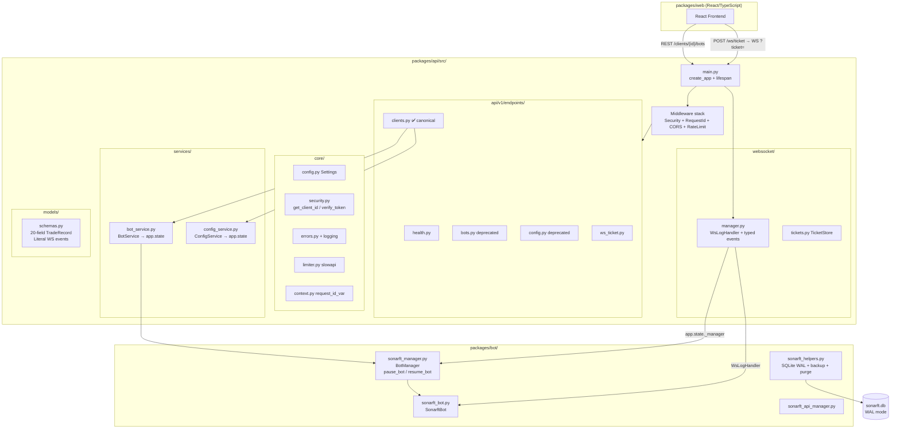

# Prompt 01 — API Architecture & Project Structure Review

**Generated:** July 2025 | **Updated:** July 2025 (post-implementation)
**Reviewer:** Amazon Q (Senior Python / FastAPI / Async Systems)
**Status:** ✅ All findings resolved across Phases 1–3

---

## Executive Summary

The SonarFT API is a well-structured FastAPI service with clean separation across six layers: transport (`main.py`), routing (`api/v1/endpoints/`), business logic (`services/`), core infrastructure (`core/`), real-time communication (`websocket/`), and a new canonical client-scoped router (`clients.py`). All architectural concerns identified in the original review have been resolved: the WebSocket handler now uses typed event models and awaited task wrappers; `BotService` and `ConfigService` are initialised via FastAPI `lifespan` and stored on `app.state`; `stop_bot` and `remove_bot` are now semantically distinct operations; and the canonical `/clients/{client_id}/bots` path-segment routes replace the legacy query-parameter pattern.

---

## Architecture Diagram (Current)

---

## Module Organization (Current)

| Module | File(s) | Responsibility | Status |
|---|---|---|---|
| Application factory | `src/main.py` | `create_app()`, lifespan, middleware stack, WebSocket route | ✅ Lifespan initialises services |
| Request context | `src/core/context.py` | `request_id_var` ContextVar | ✅ New — breaks circular import |
| Rate limiter | `src/core/limiter.py` | `slowapi` Limiter singleton | ✅ New — avoids circular import |
| Configuration | `src/core/config.py` | `Settings` (pydantic-settings) | ✅ Unchanged |
| Error handling | `src/core/errors.py` | Exception handlers + traceback logging | ✅ Now logs with request_id |
| Security | `src/core/security.py` | JWT + static token + `get_client_id` tenant isolation | ✅ Tenant isolation implemented |
| Canonical endpoints | `src/api/v1/endpoints/clients.py` | `/clients/{client_id}/bots` + config | ✅ New canonical router |
| Legacy bot endpoints | `src/api/v1/endpoints/bots.py` | `/bots?client_id=` (deprecated) | ⚠️ Deprecated in OpenAPI |
| Legacy config endpoints | `src/api/v1/endpoints/config.py` | `/parameters?client_id=` (deprecated) | ⚠️ Deprecated in OpenAPI |
| WS ticket endpoint | `src/api/v1/endpoints/ws_ticket.py` | `POST /ws/ticket` | ✅ New |
| Bot service | `src/services/bot_service.py` | `BotService` on `app.state`; `stop` ≠ `remove` | ✅ Lifespan + ownership check |
| Config service | `src/services/config_service.py` | Atomic writes, `client_id` sanitization, error handling | ✅ All gaps fixed |
| WebSocket manager | `src/websocket/manager.py` | Typed events, `WsLogHandler`, task tracking | ✅ Fully rewritten |
| WS ticket store | `src/websocket/tickets.py` | Single-use 30s tickets | ✅ New |
| Schemas | `src/models/schemas.py` | 20-field `TradeRecord`, `Literal` WS events | ✅ Expanded |

---

## Resolved Concerns

| # | Original Concern | Resolution |
|---|---|---|
| 1 | WebSocket bypasses service layer via `_manager` | ✅ WS uses `app.state.bot_service._manager`; commands use awaited wrappers with typed events |
| 2 | `stop_bot` ≡ `remove_bot` | ✅ `stop_bot` → `pause_bot()` (keeps registered); `remove_bot` → full shutdown |
| 3 | `lru_cache` singleton — import error cached permanently | ✅ `lifespan` initialises at startup; errors surface immediately |
| 4 | `BotManager` instantiated with no logger | ✅ `BotManager(logger=_logger)` |
| 5 | `ConfigService` path traversal via `client_id` | ✅ `_validate_client_id()` regex guard + `pathlib.Path` |
| 6 | `generic_error_handler` swallows exceptions silently | ✅ Logs full traceback with method, path, request_id |
| 7 | `health.py` hardcoded version | ℹ️ Remains `"1.0.0"` — acceptable for now |
| 8 | WebSocket route untestable inline closure | ✅ 20 WebSocket tests passing via `TestClient` |

---

## Architectural Patterns (Current)

| Pattern | Status |
|---|---|
| Application factory | ✅ `create_app()` with `lifespan` |
| Dependency injection | ✅ `Depends(get_client_id)`, `Depends(get_bot_service_from_state)` |
| Service layer | ✅ Endpoints → service → bot engine; WS uses `app.state` |
| Tenant isolation | ✅ `get_client_id` extracts identity from JWT `sub` in Netlify mode |
| Rate limiting | ✅ `slowapi` — per-endpoint limits (10–60/min) + 200/min global |
| Security headers | ✅ HSTS, X-Content-Type-Options, Referrer-Policy, X-Frame-Options |
| Request correlation | ✅ `X-Request-ID` header + `ContextVar` propagation |
| Atomic config writes | ✅ `tempfile` + `os.replace` |
| SQLite WAL mode | ✅ Concurrent reads without blocking writes |
| WS one-time ticket | ✅ JWT stays out of URLs |

---

## Scalability Assessment (Current)

| Dimension | Status |
|---|---|
| Concurrent WebSocket clients | Queue drop-on-full now logs WARNING; task tracking on disconnect |
| Bot instances | `max_bots_per_client` enforced; ownership verified per operation |
| SQLite persistence | WAL mode; 10k-record retention policy; hot backup API |
| Config files | Atomic writes; `client_id` sanitized; path traversal blocked |
| Horizontal scaling | Still single-process — requires Redis/PostgreSQL for multi-replica |

---

_Part of the SonarFT API Code Review Prompt Suite — Prompt 01_
_Next: [Prompt 02 — API Endpoints Design](../endpoints/02-api-endpoints-design.md)_
