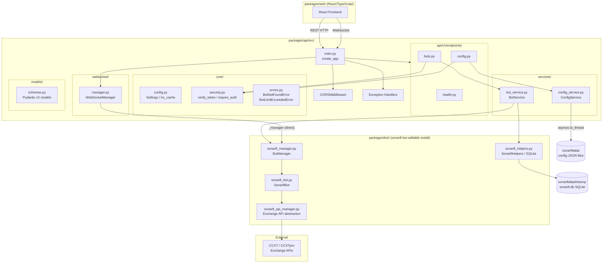

# Prompt 01 — API Architecture & Project Structure Review

**Generated:** July 2025  
**Reviewer:** Amazon Q (Senior Python / FastAPI / Async Systems)  
**Source files inspected:** `packages/api/src/`, `packages/bot/` (integration points)  
**Output location:** `docs/architecture/01-api-architecture.md`

---

## Executive Summary

The SonarFT API is a well-structured FastAPI service that cleanly separates concerns across five layers: transport (main.py), routing (api/v1/endpoints/), business logic (services/), core infrastructure (core/), and real-time communication (websocket/). The application factory pattern (`create_app()`) is correctly implemented and the dependency injection model via FastAPI `Depends` is consistent throughout. Integration with the bot engine is achieved through direct Python import of the `sonarft-bot` package (installed as a local editable dependency), which is a pragmatic and low-latency coupling strategy. Three architectural concerns stand out: the WebSocket handler in `main.py` bypasses the service layer by accessing `bot_service._manager` directly; `BotService` and `ConfigService` are singletons via `lru_cache` which prevents per-request state isolation; and `BotService.stop_bot` and `remove_bot` are functionally identical, indicating a missing abstraction.

---

## Architecture Diagram

---

## Module Organization

| Module | File(s) | Responsibility | Notes |
|---|---|---|---|
| Application factory | `src/main.py` | `create_app()`, middleware, routers, WebSocket route | WebSocket registered inline — not via a router |
| Configuration | `src/core/config.py` | `Settings` (pydantic-settings), `get_settings()` | `lru_cache` singleton; `.env` file support |
| Error handling | `src/core/errors.py` | `BotNotFoundError`, `BotLimitExceededError`, 3 handlers | Generic 500 handler masks all unhandled exceptions |
| Security | `src/core/security.py` | JWT (Netlify JWKS) + static token fallback, `require_auth` dep | JWKS client initialized at import time |
| Bot endpoints | `src/api/v1/endpoints/bots.py` | CRUD + run/stop/orders/trades for bots | Path regex validation on `botid` |
| Config endpoints | `src/api/v1/endpoints/config.py` | Parameters + indicators GET/PUT | No prefix on router — relies on `main.py` prefix |
| Health endpoint | `src/api/v1/endpoints/health.py` | `GET /health` | No auth required — correct |
| Bot service | `src/services/bot_service.py` | Wraps `BotManager`; bot lifecycle, history queries | `lru_cache` singleton; lazy bot import |
| Config service | `src/services/config_service.py` | JSON file read/write for parameters & indicators | `asyncio.to_thread` for blocking I/O |
| WebSocket manager | `src/websocket/manager.py` | Per-client connections, event queues, receive/send loops | Keepalive ping every 30 s |
| Schemas | `src/models/schemas.py` | All Pydantic v2 request/response models | Flat file — no sub-modules |

---

## Integration Points

### API → Bot Package

The API integrates with the bot engine via **direct Python import** of the `sonarft-bot` package, installed as a local editable dependency (`pip install -e ../bot`). There is no subprocess, IPC socket, or HTTP bridge — the bot runs in the same Python process as the API.

| API side | Bot side | Mechanism |
|---|---|---|
| `BotService.__init__` | `sonarft_manager.BotManager` | Direct import, instantiated once via `lru_cache` |
| `BotService.__init__` | `sonarft_helpers.SonarftHelpers` | Class reference (not instance) for classmethod queries |
| `BotService.get_orders/get_trades` | `SonarftHelpers._async_query` | Classmethod → `asyncio.to_thread` → SQLite |
| `BotService.create/run/stop/remove_bot` | `BotManager.create_bot / run_bot / remove_bot` | `await` calls into bot async methods |
| `WebSocketManager._receive_loop` | `BotManager.create_bot / run_bot / remove_bot` | `asyncio.create_task(bot_manager.*)` — **direct manager access, bypassing service layer** |

### API → Frontend

- REST endpoints consumed by the React frontend at `VITE_API_URL` (default `http://localhost:8000/api/v1`)
- WebSocket at `VITE_WS_URL` (default `ws://localhost:8000/api/v1/ws/{clientId}?token=`)
- CORS configured via `Settings.cors_origins` (comma-separated env var)

### Bot → Exchanges

- `SonarftApiManager` dispatches to `ccxtpro` (WebSocket, default) or `ccxt` (REST, fallback)
- Exchange credentials are managed entirely within the bot package — the API has no direct exchange access

---

## Application Factory Pattern

`create_app()` in `main.py` follows the standard FastAPI factory pattern correctly:

1. Loads `Settings` via `get_settings()`
2. Instantiates `FastAPI` with title, version, and prefixed docs URLs
3. Registers `CORSMiddleware` with explicit method/header allowlist
4. Registers three domain exception handlers
5. Includes three routers under `settings.api_prefix`
6. Instantiates `WebSocketManager` and registers the WebSocket route inline

One deviation: the WebSocket route is defined as a closure inside `create_app()` rather than as a separate router. This is functional but makes the WebSocket endpoint harder to test in isolation and breaks the pattern established by the three HTTP routers.

---

## Architectural Patterns

| Pattern | Applied | Consistency |
|---|---|---|
| Application factory | `create_app()` in `main.py` | ✅ Consistent |
| Dependency injection | `Depends(get_bot_service)`, `Depends(require_auth)` | ✅ Consistent across all endpoints |
| Service layer | `BotService`, `ConfigService` abstract business logic from endpoints | ⚠️ Bypassed by WebSocket manager (direct `_manager` access) |
| Singleton services | `lru_cache` on `get_bot_service`, `get_config_service`, `get_settings` | ✅ Consistent — but see concerns |
| Async I/O offload | `asyncio.to_thread` for all blocking file/SQLite operations | ✅ Consistent in `ConfigService` and `SonarftHelpers` |
| Pydantic v2 models | All request/response bodies use `BaseModel` | ✅ Consistent |
| Path validation | `Path(pattern=r"^[a-zA-Z0-9_-]{1,64}$")` on all `botid` params | ✅ Consistent |
| Auth dependency | `Auth = Annotated[None, Depends(require_auth)]` alias | ✅ Consistent across bots.py and config.py |

---

## Architectural Strengths

1. **Clean layering** — The `endpoints → service → bot engine` chain is well-defined. Endpoints contain no business logic; services contain no HTTP concerns. `ConfigService` is a textbook example of this separation.

2. **Async-first with correct offloading** — All blocking I/O (file reads, SQLite writes) is correctly offloaded via `asyncio.to_thread`, preventing event loop starvation. The WebSocket manager's dual `asyncio.gather` loop (receive + send) is a solid pattern for concurrent bidirectional streaming.

3. **Flexible auth with safe defaults** — The three-mode auth strategy (Netlify JWT → static token → dev open) in `security.py` is pragmatic. The JWKS client is initialized once at import time, avoiding per-request key fetching overhead.

---

## Architectural Concerns

| # | Concern | Severity | Location |
|---|---|---|---|
| 1 | WebSocket manager accesses `bot_service._manager` directly, bypassing the service layer | **High** | `main.py:websocket_endpoint`, `websocket/manager.py:_receive_loop` |
| 2 | `BotService.stop_bot` and `BotService.remove_bot` are functionally identical — both call `_manager.remove_bot` | **Medium** | `services/bot_service.py:44-51` |
| 3 | `lru_cache` on `get_bot_service` means a single `BotService` instance is shared across all requests; if the bot package raises on import, the error is cached permanently | **Medium** | `services/bot_service.py:67` |
| 4 | `BotManager.create_bot` calls `self.logger.info(...)` but `BotManager.__init__` accepts an optional logger — when instantiated by `BotService` with no logger argument, `self.logger` is `None`, causing `AttributeError` at runtime | **High** | `bot_service.py:24`, `sonarft_manager.py:21,130` |
| 5 | `ConfigService` constructs file paths via f-string interpolation of `client_id` without sanitization — a malicious `client_id` like `../../etc/passwd` could traverse directories | **High** | `services/config_service.py:35,40,45,50,55` |
| 6 | `generic_error_handler` returns a static `"Internal server error"` string, swallowing all exception details from logs at the handler level | **Low** | `core/errors.py:27` |
| 7 | `health.py` returns a hardcoded `version: "1.0.0"` string rather than reading from `Settings.api_version` | **Low** | `api/v1/endpoints/health.py` |
| 8 | The WebSocket route is defined as an inline closure in `create_app()` rather than as a router, making it untestable via standard FastAPI `TestClient` patterns | **Low** | `main.py:57-68` |

---

## Recommendations

**Priority 1 — Critical fixes**

1. **Pass a logger to `BotManager`** — In `BotService.__init__`, pass a module-level logger: `self._manager = BotManager(logger=_logger)`. Without this, any `create_bot` or `run_bot` call will raise `AttributeError: 'NoneType' object has no attribute 'info'`.

2. **Sanitize `client_id` in `ConfigService`** — Apply the same `sanitize_client_id()` function already present in `sonarft_helpers.py` before constructing any file path. Import and call it at the top of each `get_parameters`, `update_parameters`, `get_indicators`, `update_indicators` method.

3. **Route WebSocket commands through `BotService`** — Remove the `bot_manager` parameter from `WebSocketManager.handle_connection`. Instead, inject `BotService` and call `service.create_bot / run_bot / remove_bot`. This restores the service layer contract and centralizes the bot limit check (currently duplicated between `bots.py` and `manager.py`).

**Priority 2 — Design improvements**

4. **Differentiate `stop_bot` from `remove_bot`** — `stop_bot` should halt execution but keep the bot instance registered (call a `bot.stop_bot_flag = True` equivalent); `remove_bot` should stop and deregister. Currently both call `_manager.remove_bot`, making the distinction meaningless to API consumers.

5. **Replace `lru_cache` on `get_bot_service` with a lifespan singleton** — Use FastAPI's `lifespan` context manager to initialize `BotService` once at startup and store it in `app.state`. This allows proper error handling at startup and avoids the permanent-cache-on-import-error problem.

6. **Move the WebSocket route to a dedicated router** — Extract the WebSocket endpoint into `api/v1/endpoints/ws.py` and register it via `app.include_router(ws_router, prefix=prefix)` for consistency and testability.

**Priority 3 — Minor polish**

7. **Read version from settings in `HealthResponse`** — Replace the hardcoded `version: str = "1.0.0"` default in `schemas.py` with a dynamic value sourced from `get_settings().api_version`.

8. **Log unhandled exceptions before swallowing** — In `generic_error_handler`, add `_logger.exception("Unhandled error: %s", exc)` before returning the 500 response so errors are observable in production logs.

---

## Scalability Assessment

| Dimension | Current State | Limit / Risk |
|---|---|---|
| Concurrent WebSocket clients | One `asyncio.Queue` per client, `maxsize=1000` | Queue drop-on-full is silent; no backpressure signal to client |
| Bot instances | `max_bots_per_client` (default 5), enforced in service + WS manager | Limit check duplicated — WS manager and `BotService` can diverge |
| Persistence | SQLite single file (`sonarft.db`) | Single-writer bottleneck under high trade volume; not suitable for multi-process deployment |
| Config files | Per-client JSON files on local disk | No locking between API and bot processes writing the same file |
| Horizontal scaling | Single-process (uvicorn) | `BotManager` state is in-memory; no shared state store — cannot scale to multiple API replicas |

---

_Part of the SonarFT API Code Review Prompt Suite — Prompt 01_  
_Next: [Prompt 02 — API Endpoints Design](../prompts/02-api-endpoints-design.md)_
