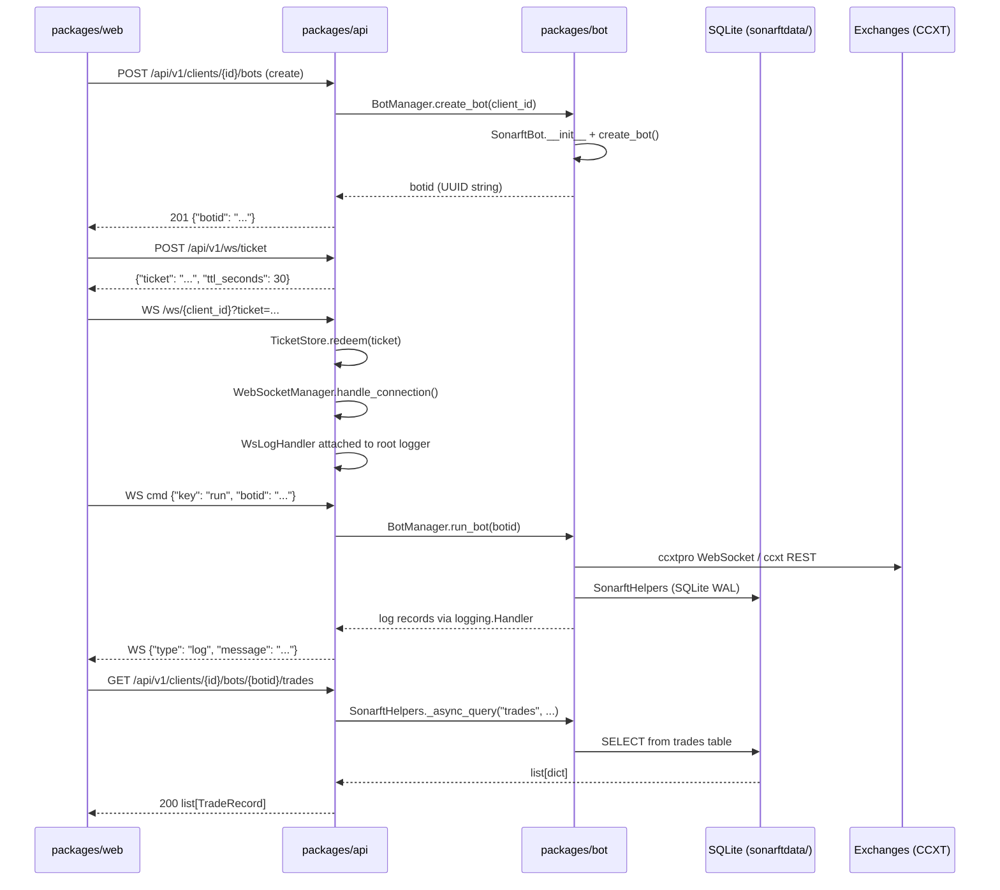

# API Architecture & Project Structure Review

**Prompt ID:** 01-API-ARCH  
**Package:** `packages/api`  
**Output:** `docs/architecture/01-api-architecture.md`  
**Reviewed:** July 2025  
**Status:** Complete

---

## Executive Summary

The SonarFT API is a well-structured FastAPI application with clear separation of concerns across five layers: endpoints, services, models, websocket, and core. The application factory pattern (`create_app()` in `main.py`) is correctly implemented with lifespan-managed service initialisation, a comprehensive middleware stack, and typed exception handlers. The primary architectural strength is the clean service abstraction over the bot engine — `BotService` wraps `BotManager` entirely, keeping the bot package import lazy and isolated. The main structural concern is **dual routing**: a canonical `/clients/{client_id}/bots` path coexists with a deprecated `/bots?client_id=` path, with significant logic duplication between `clients.py` and `bots.py`. A secondary concern is that the `WebSocketManager` is instantiated at module level inside `websocket.py` rather than being managed through `app.state`, creating a hidden singleton that bypasses the lifespan pattern used everywhere else.

---

## Architecture Diagram

```mermaid
graph TD
    subgraph "packages/web (React + TypeScript)"
        FE[Frontend Client]
    end

    subgraph "packages/api (FastAPI)"
        subgraph "Middleware Stack"
            GZ[GZipMiddleware]
            RL[SlowAPIMiddleware - Rate Limiting]
            SH[SecurityHeadersMiddleware]
            AL[AccessLogMiddleware]
            RI[RequestIdMiddleware]
            CO[CORSMiddleware]
        end

        subgraph "Endpoints — api/v1/endpoints/"
            HE[health.py\nGET /health]
            CL[clients.py\nCanonical /clients/{id}/bots]
            BO[bots.py\nLegacy /bots?client_id=]
            CF[config.py\nLegacy /parameters, /indicators]
            WS[websocket.py\nWS /ws/{client_id}]
            TK[ws_ticket.py\nPOST /ws/ticket]
        end

        subgraph "Core — core/"
            SEC[security.py\nJWT + static token auth]
            CFG[config.py\nSettings + ID_PATTERN]
            ERR[errors.py\nException classes + handlers]
            LIM[limiter.py\nslowapi Limiter]
            CTX[context.py\nrequest_id ContextVar]
        end

        subgraph "Services — services/"
            BS[BotService\nbot_service.py]
            CS[ConfigService\nconfig_service.py]
        end

        subgraph "Models — models/"
            SCH[schemas.py\nPydantic v2 models]
        end

        subgraph "WebSocket — websocket/"
            WM[WebSocketManager\nmanager.py]
            TS[TicketStore\ntickets.py]
        end
    end

    subgraph "packages/bot (Python)"
        BM[BotManager\nsonarft_manager.py]
        SB[SonarftBot\nsonarft_bot.py]
        SH2[SonarftHelpers\nsonarft_helpers.py]
    end

    subgraph "External"
        EX[CCXT / CCXTpro\nCrypto Exchanges]
        NL[Netlify Identity\nJWKS endpoint]
    end

    FE -->|HTTP REST| CO
    FE -->|WebSocket| CO
    CO --> RI --> AL --> SH --> RL --> GZ
    GZ --> CL & BO & CF & HE & WS & TK
    CL & BO --> BS
    CF --> CS
    WS --> WM
    TK --> TS
    BS --> BM --> SB --> EX
    BS --> SH2
    SEC -->|JWKS fetch| NL
    WM -->|logging.Handler| BM
```

---

## Module Organization Table

| Module | Path | Responsibility | Lines (approx) |
|---|---|---|---|
| `main.py` | `src/main.py` | App factory, middleware stack, lifespan, logging setup | ~230 |
| `health.py` | `src/api/v1/endpoints/health.py` | `GET /health` — liveness probe | ~10 |
| `clients.py` | `src/api/v1/endpoints/clients.py` | Canonical client-scoped endpoints (bots + config) | ~170 |
| `bots.py` | `src/api/v1/endpoints/bots.py` | Legacy bot endpoints (`/bots?client_id=`) | ~120 |
| `config.py` | `src/api/v1/endpoints/config.py` | Legacy config endpoints (`/parameters`, `/indicators`) | ~90 |
| `websocket.py` | `src/api/v1/endpoints/websocket.py` | WebSocket entry point, ticket/token resolution | ~60 |
| `ws_ticket.py` | `src/api/v1/endpoints/ws_ticket.py` | `POST /ws/ticket` — JWT-to-ticket exchange | ~30 |
| `config.py` | `src/core/config.py` | `Settings` (pydantic-settings), `ID_PATTERN`, `get_settings()` | ~45 |
| `errors.py` | `src/core/errors.py` | Domain exception classes + async handlers | ~80 |
| `security.py` | `src/core/security.py` | JWT decode (Netlify JWKS), static token, `require_auth`, `get_client_id` | ~120 |
| `limiter.py` | `src/core/limiter.py` | `slowapi` Limiter singleton (200 req/min default) | ~10 |
| `context.py` | `src/core/context.py` | `request_id_var` ContextVar | ~10 |
| `bot_service.py` | `src/services/bot_service.py` | `BotService` — wraps `BotManager`; bot lifecycle + history queries | ~100 |
| `config_service.py` | `src/services/config_service.py` | `ConfigService` — JSON file read/write with mtime cache + atomic writes | ~150 |
| `schemas.py` | `src/models/schemas.py` | All Pydantic v2 request/response models + WS event models | ~160 |
| `manager.py` | `src/websocket/manager.py` | `WebSocketManager` — per-client queues, log streaming, command dispatch | ~280 |
| `tickets.py` | `src/websocket/tickets.py` | `TicketStore` — in-memory single-use WS auth tickets | ~55 |

---

## Integration Points Diagram



### Bot Integration Details

| API Component | Bot Component | Mechanism |
|---|---|---|
| `BotService.__init__` | `BotManager.__init__`, `SonarftHelpers` | Direct Python import (`from sonarft_manager import BotManager`) |
| `BotService.create_bot()` | `BotManager.create_bot()` | Async method call — returns UUID string |
| `BotService.run_bot()` | `BotManager.run_bot()` | Async method call |
| `BotService.stop_bot()` | `BotManager.pause_bot()` | Async method call (note: API calls it "stop", bot calls it "pause") |
| `BotService.remove_bot()` | `BotManager.remove_bot()` | Async method call |
| `BotService.get_orders/trades()` | `SonarftHelpers._async_query()` | Direct class method call on `SonarftHelpers` (not an instance) |
| `WebSocketManager._handle_*` | `BotManager.*` | Direct async calls via `bot_manager` reference passed at connection time |
| `WsLogHandler.emit()` | All `sonarft.*` loggers | `logging.Handler` attached to `logging.root` — zero-coupling event bridge |
| `ConfigService` | `sonarftdata/config/` | Shared filesystem — both packages read/write the same JSON files |

---

## 1. Overall Architecture

The API follows a **layered architecture** with four distinct tiers:

1. **Transport layer** — `main.py` middleware stack (CORS, rate limiting, security headers, access log, request ID, GZip)
2. **Routing layer** — `api/v1/endpoints/` routers registered with a versioned prefix (`/api/v1`)
3. **Service layer** — `services/` abstracts all bot engine and config I/O behind async interfaces
4. **Integration layer** — `packages/bot` imported as a Python library; no subprocess, no HTTP, no IPC

Separation of concerns is well-maintained. Endpoints contain no business logic — they delegate entirely to services. Services contain no HTTP concerns — they raise domain exceptions (`BotNotFoundError`, `ConfigWriteError`) that are caught by registered exception handlers in `main.py`. Models are defined once in `schemas.py` and reused across all endpoints.

The `create_app()` factory in `main.py` is clean and complete: it loads settings, registers middleware in the correct order (outermost first), registers all exception handlers, and mounts all routers under the versioned prefix.

---

## 2. Module Organization

### `api/v1/endpoints/`

Five routers are registered. Two serve the same resources under different URL patterns:

| Router | Prefix | Style | Status |
|---|---|---|---|
| `health.py` | `/api/v1` | Standalone | Active |
| `clients.py` | `/api/v1/clients` | Path-segment (`/clients/{id}/bots`) | Canonical |
| `bots.py` | `/api/v1/bots` | Query-param (`/bots?client_id=`) | Deprecated |
| `config.py` | `/api/v1` | Query-param (`/parameters?client_id=`) | Deprecated |
| `websocket.py` | `/api/v1` | WebSocket (`/ws/{client_id}`) | Active |
| `ws_ticket.py` | `/api/v1` | REST (`/ws/ticket`) | Active |

Naming conventions are consistent within each router. The `Annotated` type alias pattern for dependencies (`Auth`, `ClientId`, `BotSvc`) is used uniformly across all endpoint files.

### `core/`

Each module has a single, clear responsibility. `context.py` exists specifically to break a circular import that would occur if `request_id_var` were defined in `main.py` — this is a correct and minimal solution.

### `services/`

Both services follow the same pattern: async public methods, `asyncio.to_thread()` for blocking I/O, domain exceptions for error signalling, and `lru_cache` fallback singletons for test compatibility. `ConfigService` implements an mtime-based JSON cache and atomic writes via `tempfile` + `os.replace()`.

### `models/schemas.py`

All Pydantic v2 models are in a single file. This is appropriate at the current scale. Models are reused across both canonical and legacy endpoints. WebSocket event models mirror the TypeScript interfaces in `shared/types/api.ts`.

### `websocket/`

`WebSocketManager` handles the full connection lifecycle: auth verification, queue creation, log handler attachment, concurrent send/receive loops via `asyncio.gather()`, keepalive pings, and cleanup. `TicketStore` is a clean, self-contained in-memory store with TTL eviction.

---

## 3. Application Factory Pattern

`create_app()` in `src/main.py` is well-implemented:

- Uses `FastAPI(lifespan=_lifespan)` — the modern lifespan pattern (not deprecated `on_startup`/`on_shutdown`)
- Services are stored on `app.state` (not module-level globals or `lru_cache` singletons in production)
- Middleware is registered in the correct Starlette order (last-added = outermost)
- `ORJSONResponse` is set as the default response class for performance
- Auth bypass warning is emitted at startup when neither auth method is configured

The `_lifespan` handler correctly catches `Exception` on each service init independently, so a `ConfigService` failure does not prevent `BotService` from starting (and vice versa). Both services return `503` via `get_*_service_from_state()` if they failed to initialise.

---

## 4. Cross-Package Dependencies

```
packages/api
  └── sonarft_manager.BotManager          (bot_service.py:14)
  └── sonarft_helpers.SonarftHelpers      (bot_service.py:13)
  └── sonarft_manager.BotManager          (websocket/manager.py — TYPE_CHECKING only)
  └── sonarftdata/config/*.json           (config_service.py — shared filesystem)
```

The bot package is imported as a standard Python library (`pip install -e ../bot`). There are no subprocess calls, no HTTP calls, and no shared memory. The coupling is:

- **Direct**: `BotService` holds a `BotManager` instance and calls its async methods
- **Filesystem**: `ConfigService` reads/writes JSON files in `sonarftdata/config/` — the same directory the bot reads at startup
- **Logging**: `WsLogHandler` attaches to `logging.root` and intercepts records from `sonarft.*` loggers

No circular dependencies exist. The bot package has no knowledge of the API package.

---

## 5. Architectural Patterns

| Pattern | Where Used | Consistency |
|---|---|---|
| Application factory | `create_app()` in `main.py` | ✅ Single factory, no module-level app mutation |
| Service layer | `BotService`, `ConfigService` | ✅ All endpoint logic delegates to services |
| Dependency injection | FastAPI `Depends()` throughout | ✅ Consistent use of `Annotated` type aliases |
| Domain exceptions | `errors.py` + registered handlers | ✅ No raw `HTTPException` in service layer |
| Lifespan state | `app.state.bot_service`, `app.state.config_service` | ✅ Used in production; `lru_cache` fallback for tests |
| Atomic file writes | `_write_json()` in `config_service.py` | ✅ `tempfile` + `os.replace()` |
| Single-use tickets | `TicketStore` in `websocket/tickets.py` | ✅ Correct TTL + eviction |
| Request correlation | `RequestIdMiddleware` + `request_id_var` ContextVar | ✅ Propagated to all log lines and error responses |

---

## Architectural Strengths

1. **Clean service abstraction over the bot engine.** `BotService` fully encapsulates `BotManager` — endpoints never import from `packages/bot` directly. The lazy import in `BotService.__init__` means the API process starts cleanly even if the bot package has an import error, surfacing the failure at the service level with a clear log message rather than crashing the entire process.

2. **Comprehensive, correctly ordered middleware stack.** Security headers, access logging, request ID propagation, rate limiting, CORS, and GZip are all present and registered in the correct Starlette order. The `SecurityHeadersMiddleware` includes `Content-Security-Policy: default-src 'none'`, `Strict-Transport-Security`, and `Cache-Control: no-store` — appropriate for a pure JSON API handling financial data.

3. **Zero-coupling log streaming via `logging.Handler`.** `WsLogHandler` bridges the bot engine's log output to WebSocket clients without any direct coupling between `WebSocketManager` and the bot internals. The filter (`_is_bot_record`) correctly restricts delivery to `sonarft.*` loggers, preventing API-internal log lines from leaking to clients.

---

## Architectural Concerns

### High

| # | Concern | Location | Detail |
|---|---|---|---|
| H1 | **`WebSocketManager` is a module-level singleton** | `src/api/v1/endpoints/websocket.py:17` | `_ws_manager = WebSocketManager()` is instantiated at import time, outside `app.state`. This bypasses the lifespan pattern, makes the manager invisible to tests that inspect `app.state`, and means it cannot be replaced or reset between test runs without module reimport. |
| H2 | **`BotService.get_orders/trades()` bypasses ownership check** | `src/services/bot_service.py:72-85` | Both methods accept `client_id` but never verify that `botid` belongs to `client_id` before querying. Any authenticated user who knows a `botid` can read another client's trade history. The `_bot_owned_by()` guard used in `run_bot`, `stop_bot`, and `remove_bot` is absent here. |

### Medium

| # | Concern | Location | Detail |
|---|---|---|---|
| M1 | **Significant logic duplication between `clients.py` and `bots.py`** | Both files | Every bot lifecycle endpoint (`list`, `create`, `run`, `stop`, `remove`, `orders`, `trades`) is implemented twice with near-identical bodies. The only differences are path vs. query-param `client_id` extraction and the deprecation headers. This doubles the surface area for bugs and drift. |
| M2 | **`ConfigService` and bot engine share a filesystem without coordination** | `src/services/config_service.py`, `packages/bot/bot_config.py` | Both packages read/write `sonarftdata/config/`. The API writes atomically (`os.replace`), but there is no locking or notification mechanism. A bot reading its config file mid-write (between `tempfile` creation and `os.replace`) will read the old file — this is safe. However, a bot that has already loaded config at startup will not see API-written changes until it is restarted or hot-reloaded. This is a documented limitation but not surfaced in API responses. |
| M3 | **`WsLogHandler` attaches to `logging.root` per client connection** | `src/websocket/manager.py:_attach_log_handler` | With N concurrent WebSocket clients, N handlers are attached to the root logger. Every log record from any `sonarft.*` logger is processed by all N handlers (filtered but still iterated). Under high concurrency this adds O(N) work per log record. |
| M4 | **`BotService._bot_exists()` is defined but never called** | `src/services/bot_service.py:87-90` | Dead code. `_bot_owned_by()` is used instead for all ownership checks. |
| M5 | **Legacy routes re-raise `BotLimitExceededError` as `HTTPException(429)`** | `src/api/v1/endpoints/bots.py:57-59` | The registered exception handler for `BotLimitExceededError` already returns 429. The `try/except` in `create_bot` (legacy) re-raises it as a plain `HTTPException`, bypassing the handler and losing the `request_id` field in the error body. The canonical `clients.py` has the same pattern. |

### Low

| # | Concern | Location | Detail |
|---|---|---|---|
| L1 | **`HealthResponse` hardcodes `version = "1.0.0"`** | `src/models/schemas.py:163` | The version is not read from `Settings.api_version`. A version bump in `config.py` will not be reflected in the health endpoint response. |
| L2 | **`get_settings()` is `lru_cache`-cached but `Settings` reads `.env` at construction** | `src/core/config.py:43` | In tests that patch environment variables after import, `get_settings()` returns the cached instance with the original values. Tests must call `get_settings.cache_clear()` before patching. This is a known pydantic-settings pattern but is not documented in the test suite. |
| L3 | **`BotManager.run_bot()` references `BotRunError` which is defined after the method** | `packages/bot/sonarft_manager.py:155` | `BotRunError` is caught in `run_bot()` but is defined at the bottom of the file. This works at runtime (Python resolves names at call time, not definition time) but is confusing and the docstring notes it is "never raised". The `except` clause is dead code. |
| L4 | **No readiness probe distinct from liveness probe** | `src/api/v1/endpoints/health.py` | `GET /health` always returns `{"status": "ok"}` regardless of whether `BotService` or `ConfigService` initialised successfully. A load balancer cannot distinguish a healthy instance from one where both services failed to start. |

---

## Recommendations

### Priority 1 — Fix before production

**R1 (H2): Add ownership check to `get_orders` and `get_trades` in `BotService`**

```python
async def get_orders(self, botid: str, client_id: str, ...) -> list:
    if not self._bot_owned_by(botid, client_id):
        raise BotNotFoundError(botid)
    return await self._helpers._async_query("orders", botid, ...)
```

Apply the same fix to `get_trades`. This is a data isolation bug — one authenticated client can read another client's trade history.

---

**R2 (H1): Move `WebSocketManager` into `app.state` via the lifespan handler**

In `_lifespan` in `main.py`:
```python
from .websocket.manager import WebSocketManager
app.state.ws_manager = WebSocketManager()
```

In `websocket.py`, read it from `websocket.app.state.ws_manager` instead of the module-level `_ws_manager`. This makes the manager testable, replaceable, and consistent with the service pattern.

---

### Priority 2 — Structural improvements

**R3 (M1): Eliminate the `bots.py` / `clients.py` duplication via a shared handler module**

Extract the shared bot lifecycle logic into `src/services/bot_service.py` or a thin `src/api/v1/_bot_handlers.py` module. Both routers call the same handler functions, differing only in how `client_id` is extracted. This reduces the duplicate endpoint count from 14 to 7.

---

**R4 (M5): Remove the redundant `try/except` around `BotLimitExceededError` in endpoint files**

The registered exception handler in `main.py` already handles `BotLimitExceededError` with the correct status code and `request_id`. The `try/except` in `create_bot` endpoints should be removed:

```python
# Before (clients.py and bots.py)
try:
    botid = await service.create_bot(client_id)
    return BotCreateResponse(botid=botid)
except BotLimitExceededError as exc:
    raise HTTPException(status_code=429, detail=str(exc)) from exc

# After — let the registered handler do its job
botid = await service.create_bot(client_id)
return BotCreateResponse(botid=botid)
```

---

### Priority 3 — Quality improvements

**R5 (L1): Read `HealthResponse.version` from `Settings`**

```python
@router.get("/health", response_model=HealthResponse, tags=["Health"])
async def health() -> HealthResponse:
    return HealthResponse(version=get_settings().api_version)
```

**R6 (L4): Add a readiness probe that checks service state**

```python
@router.get("/health/ready", tags=["Health"])
async def ready(request: Request) -> dict:
    bot_ok = getattr(request.app.state, "bot_service", None) is not None
    cfg_ok = getattr(request.app.state, "config_service", None) is not None
    if not bot_ok or not cfg_ok:
        raise HTTPException(status_code=503, detail="Services not ready")
    return {"status": "ready"}
```

**R7 (M4): Remove dead `_bot_exists()` method from `BotService`**

**R8 (M3): Cap concurrent WebSocket clients or use a broadcast handler**

If the number of concurrent WebSocket clients is expected to grow, consider a single root-level log handler that fans out to all active queues, rather than one handler per client. This reduces per-record overhead from O(N) to O(1) at the handler level.

---

## Scalability Assessment

| Dimension | Current Approach | Limit | Recommendation |
|---|---|---|---|
| Concurrent bots | In-process `BotManager._bots` dict | Single process; limited by event loop and exchange API rate limits | Acceptable for current scale; multi-process would require shared state (Redis) |
| Concurrent WS clients | Per-client `asyncio.Queue` + log handler | O(N) log handler overhead; queue max 1000 events | Cap at ~50 concurrent clients before O(N) handler cost becomes measurable |
| Config reads | mtime-based JSON cache in `ConfigService` | Single-process cache; not shared across workers | Acceptable for single-worker deployment; add Redis cache for multi-worker |
| Bot history queries | `SonarftHelpers._async_query()` → SQLite WAL | SQLite WAL supports concurrent reads; write contention at high trade frequency | Acceptable; consider PostgreSQL if trade volume exceeds ~1000 trades/min |
| Rate limiting | `slowapi` in-process counter | Resets on restart; not shared across workers | Add Redis backend for multi-worker deployments |

---

_Generated by Amazon Q Developer — SonarFT API Code Review Prompt Suite, Prompt 01_
