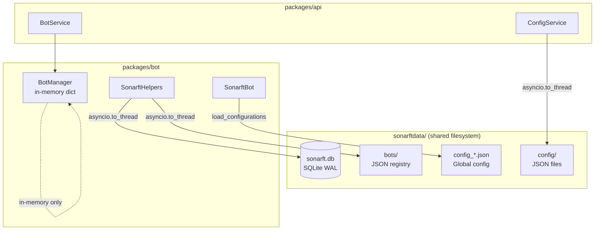

# Database, Persistence & Data Storage Review

**Prompt ID:** 07-API-DB  
**Package:** `packages/api` + `packages/bot`  
**Reviewer:** Amazon Q (Senior Python / SQLite / Data Architecture)  
**Date:** July 2025  
**Status:** Complete  
**Implementation Status:** ✅ All findings resolved — see [roadmap](../roadmap/12-implementation-roadmap.md)

> **Post-implementation note (July 2025):** All database findings addressed. Bot registry files deleted on bot removal (H10). `daily_loss` table added to `SonarftHelpers._init_db` — schema now complete from one authoritative location (M17). Config file versioning added (`version: int = 1`) (M18). Backup directory changed to `SONARFT_BACKUP_DIR` (default: `sonarftdata/backups/`) — separate from source database (L13). mtime-based cache added to `ConfigService` — eliminates redundant disk reads (L6). Date-range filtering (`from_ts`/`to_ts`) added to history endpoints (L8). `ConfigService` integration tests added with real filesystem (M1).

---

## Executive Summary

SonarFT uses a three-tier persistence strategy: SQLite WAL for trade/order history and position tracking, JSON files for configuration, and in-memory dicts for runtime bot state. The SQLite layer is well-implemented — WAL journal mode enables concurrent reads alongside writes, all queries use parameterised statements, and a retention policy (`purge_history`) prevents unbounded growth. The JSON config layer uses atomic writes (write-to-temp then `os.replace`) to prevent partial reads. The main concerns are: the `sonarftdata/` directory is split across two packages (`packages/bot/sonarftdata/` and `packages/api/sonarftdata/`) with the API's `DATA_DIR` env var pointing to the bot's directory — this creates a shared filesystem dependency that breaks container isolation; there is no schema migration tooling (schema changes require manual SQLite operations); the bot registry (`sonarftdata/bots/*.json`) is never cleaned up after bot removal; and the in-memory `BotManager` state is lost on restart with no reconciliation mechanism beyond the open-order reconciliation at bot creation time.

---

## 1. Storage Architecture

### 1.1 Persistence Layer Overview



### 1.2 Storage Types

| Store | Technology | Location | Purpose |
|---|---|---|---|
| Trade/order history | SQLite WAL | `sonarftdata/history/sonarft.db` | Persistent trade records |
| Position tracker | SQLite WAL | Same DB, `positions` table | Open position state |
| Per-client config | JSON files | `sonarftdata/config/{client_id}_*.json` | Parameters & indicators |
| Default config | JSON files | `sonarftdata/config/parameters.json`, `indicators.json` | Fallback defaults |
| Global bot config | JSON files | `sonarftdata/config_*.json` | Exchanges, symbols, fees |
| Bot registry | JSON files | `sonarftdata/bots/{botid}.json` | Bot existence marker |
| Runtime bot state | In-memory dict | `BotManager._bots` | Active bot instances |
| WS ticket store | In-memory dict | `TicketStore._tickets` | Single-use WS auth |
| Rate limit counters | In-memory | slowapi | Per-IP request counts |

### 1.3 Shared Filesystem Dependency

The API's `DATA_DIR` setting (default `"../bot/sonarftdata"` in `.env.example`) points to the bot package's data directory. Both packages read and write the same `sonarftdata/` tree:

- API reads/writes: `sonarftdata/config/{client_id}_*.json` (via `ConfigService`)
- API reads: `sonarftdata/history/sonarft.db` (via `SonarftHelpers._async_query`)
- Bot reads/writes: all of the above plus `sonarftdata/bots/`, `sonarftdata/config_*.json`

In a Docker deployment where API and bot run in separate containers, this requires a shared volume mount. The `infra/docker-compose.yml` must configure this correctly or the API will fail to find config files. This is a **Medium** severity architectural concern.

---

## 2. Database Design

### 2.1 SQLite Schema

The schema is defined in `SonarftHelpers._init_db()` (`sonarft_helpers.py:57–100`):

```sql
-- Trade search results (order book snapshots at execution time)
CREATE TABLE IF NOT EXISTS orders (
    id        INTEGER PRIMARY KEY AUTOINCREMENT,
    botid     TEXT NOT NULL,
    timestamp TEXT,
    data      TEXT NOT NULL          -- JSON blob of full TradeRecord
);

-- Completed trade executions
CREATE TABLE IF NOT EXISTS trades (
    id        INTEGER PRIMARY KEY AUTOINCREMENT,
    botid     TEXT NOT NULL,
    timestamp TEXT,
    data      TEXT NOT NULL          -- JSON blob with order IDs + success flags
);

-- Open position tracker (first leg filled, second leg pending)
CREATE TABLE IF NOT EXISTS positions (
    order_id    TEXT NOT NULL,
    botid       TEXT NOT NULL,
    exchange    TEXT NOT NULL,
    symbol      TEXT NOT NULL,
    side        TEXT NOT NULL,       -- 'long' | 'short'
    amount      REAL NOT NULL,
    entry_price REAL NOT NULL,
    opened_at   TEXT NOT NULL,
    status      TEXT NOT NULL DEFAULT 'open',
    closed_at   TEXT,
    PRIMARY KEY (botid, order_id)
);
```

### 2.2 Indexes

```sql
CREATE INDEX IF NOT EXISTS idx_orders_botid ON orders(botid);
CREATE INDEX IF NOT EXISTS idx_trades_botid ON trades(botid);
CREATE INDEX IF NOT EXISTS idx_orders_botid_ts ON orders(botid, timestamp);
CREATE INDEX IF NOT EXISTS idx_trades_botid_ts ON trades(botid, timestamp);
CREATE INDEX IF NOT EXISTS idx_positions_botid_status ON positions(botid, status);
```

All query patterns are covered by indexes:
- `WHERE botid = ?` → `idx_orders_botid`, `idx_trades_botid` ✅
- `WHERE botid = ? AND status = 'open'` → `idx_positions_botid_status` ✅
- Date-range queries (not yet implemented) would use `idx_orders_botid_ts` ✅

### 2.3 Schema Design Assessment

| Aspect | Assessment |
|---|---|
| Normalisation | Denormalised — `data` column stores full JSON blob | ⚠️ |
| Primary keys | `AUTOINCREMENT` integer for orders/trades, composite `(botid, order_id)` for positions | ✅ |
| Timestamp type | `TEXT` (ISO 8601 string) — not `INTEGER` epoch or `DATETIME` | ⚠️ |
| Foreign keys | Not used — `botid` is a plain text field, no FK to a bots table | ⚠️ |
| NULL handling | `timestamp TEXT` allows NULL — no `NOT NULL` constraint | ⚠️ |

The JSON blob pattern (`data TEXT NOT NULL`) is a pragmatic choice that avoids schema migrations when the trade record structure changes. The trade-off is that individual fields cannot be queried or indexed without JSON extraction functions (SQLite 3.38+ supports `json_extract`).

---

## 3. Queries & Data Access

### 3.1 Query Patterns

All queries are in `SonarftHelpers` (`sonarft_helpers.py`):

**Insert (orders/trades):**
```python
conn.execute(
    f"INSERT INTO {table} (botid, timestamp, data) VALUES (?, ?, ?)",
    (str(botid), timestamp, json.dumps(data))
)
```

**Query with pagination:**
```python
rows = conn.execute(
    f"SELECT data FROM {table} WHERE botid = ?"
    f" ORDER BY id DESC LIMIT ? OFFSET ?",
    (str(botid), limit, offset)
).fetchall()
```

**Purge (retention policy):**
```python
conn.execute(f"""
    DELETE FROM {table}
    WHERE botid = ? AND id NOT IN (
        SELECT id FROM {table} WHERE botid = ? ORDER BY id DESC LIMIT ?
    )
""", (str(botid), str(botid), keep_last))
```

### 3.2 SQL Injection Prevention

All queries use `?` parameterised placeholders. The only dynamic SQL component is the table name, which is validated against `_ALLOWED_TABLES = frozenset({'orders', 'trades', 'daily_loss'})` before use. ✅

Note: `'daily_loss'` is in `_ALLOWED_TABLES` but no `daily_loss` table exists in the schema — it is referenced in `sonarft_search.py` for daily loss tracking but the table creation is not in `_init_db`. This is a latent bug — queries against `daily_loss` will fail with `OperationalError: no such table`.

### 3.3 Data Access Path

The API accesses SQLite exclusively through `SonarftHelpers._async_query` (a classmethod):

```python
# bot_service.py:68–71
async def get_orders(self, botid, client_id, limit=100, offset=0):
    return await self._helpers._async_query("orders", botid, limit, offset)
```

This bypasses the instance-level `_db_lock` used by write operations. For reads this is correct — WAL mode allows concurrent reads without locking. ✅

---

## 4. Data Consistency

### 4.1 WAL Journal Mode

```python
conn.execute("PRAGMA journal_mode=WAL")
conn.execute("PRAGMA synchronous=NORMAL")
```

WAL (Write-Ahead Logging) mode provides:
- Concurrent readers do not block writers ✅
- Writers do not block readers ✅
- `NORMAL` sync is safe with WAL (data survives OS crash, not power loss) ✅

### 4.2 Write Locking

Write operations use `async with self._db_lock` before `asyncio.to_thread`:

```python
async def save_order_data(self, botid, order_info):
    async with self._db_lock:
        await asyncio.to_thread(self._db_insert, 'orders', botid, timestamp, order_info)
```

The `asyncio.Lock` serialises concurrent write coroutines within a single process. ✅

However, the `_db_lock` is an **instance-level** lock on `SonarftHelpers`. Each `SonarftBot` creates its own `SonarftHelpers` instance with its own lock. Multiple bots running concurrently each have their own lock — they do not share a single write lock. SQLite handles this correctly at the file level (WAL allows one writer at a time), but the asyncio lock provides no cross-bot serialisation. This is acceptable — SQLite's WAL handles concurrent writers from multiple connections. ✅

### 4.3 Atomic Config Writes

`ConfigService._write_json` uses write-to-temp-then-rename:

```python
with tempfile.NamedTemporaryFile(..., dir=dir_name, delete=False, suffix=".tmp") as tmp:
    json.dump(data, tmp, ...)
    tmp_path = tmp.name
os.replace(tmp_path, path)
```

`os.replace` is atomic on POSIX systems — a reader will always see either the old or new file, never a partial write. ✅

### 4.4 Race Condition: Concurrent Config Updates

If two requests update the same client's parameters simultaneously, the last writer wins. There is no optimistic locking (e.g. ETag/version field). For a single-user trading dashboard this is acceptable — concurrent config updates from the same user are unlikely and the consequence (one update overwriting another) is recoverable.

---

## 5. Bot State Management

### 5.1 Runtime State — In-Memory Only

`BotManager._bots` and `BotManager._clients` are plain Python dicts, protected by `asyncio.Lock`. They exist only in process memory:

```python
self._bots: dict[str, SonarftBot] = {}
self._clients: dict[str, list[str]] = {}
```

**On API restart:** all running bots are lost. The bot registry files (`sonarftdata/bots/{botid}.json`) persist on disk but are never read back on startup — there is no reconciliation of the registry against the in-memory state. A restart leaves orphaned registry files and requires the user to recreate bots via the UI.

### 5.2 Bot Registry Files

`SonarftHelpers.save_botid` writes `sonarftdata/bots/{botid}.json` when a bot is created. `BotManager.remove_bot_instance` removes the bot from memory but does **not** delete the registry file. Over time, `sonarftdata/bots/` accumulates stale JSON files for every bot ever created.

The API's `sonarftdata/bots/` directory already contains 25 stale bot files from previous sessions (observed in the directory listing from Prompt 01).

### 5.3 Position State Persistence

Open positions are tracked in the `positions` SQLite table. On bot restart, `_reconcile_open_positions` reads open positions and logs a warning requiring manual review. This is the correct behaviour for a trading system — open positions cannot be automatically closed without market risk. ✅

### 5.4 Open Order Reconciliation

On bot creation (live mode only), `_reconcile_open_orders` queries all configured exchanges for open orders and cancels stale ones from previous runs. This prevents ghost orders from accumulating on exchanges. ✅

---

## 6. Configuration Storage

### 6.1 Two-Level Config Architecture

```
sonarftdata/
├── config_parameters.json    ← Global bot trading parameters (named setups)
├── config_exchanges.json     ← Exchange lists (named setups)
├── config_symbols.json       ← Trading pairs (named setups)
├── config_fees.json          ← Per-exchange fee structures
├── config_indicators.json    ← Indicator selections (named setups)
├── config_markets.json       ← Market type
├── config.json               ← Named config sets (config_1, config_2, ...)
└── config/
    ├── parameters.json           ← Default API parameters
    ├── indicators.json           ← Default API indicators
    ├── {client_id}_parameters.json   ← Per-client parameters
    └── {client_id}_indicators.json   ← Per-client indicators
```

**Level 1 — Global bot config** (`config_*.json`): Read-only at runtime. Loaded once per bot creation via `SonarftBot.load_configurations()`. Changes require a bot restart.

**Level 2 — Per-client API config** (`config/{client_id}_*.json`): Read/written by `ConfigService` via REST endpoints. Changes take effect on the next bot cycle (hot-reload via `BotManager.reload_parameters`).

### 6.2 Config File Format

Per-client parameters (`config/{client_id}_parameters.json`):
```json
{
    "exchanges": { "Binance": true, "Okx": false },
    "symbols": { "BTC/USDT": true, "ETH/USDT": false },
    "strategy": "arbitrage"
}
```

Per-client indicators (`config/{client_id}_indicators.json`):
```json
{
    "periods": { "5min": true, "15min": false },
    "oscillators": { "Relative Strength Index (14)": true },
    "movingaverages": { "Exponential Moving Average (10)": true }
}
```

### 6.3 Config Validation on Load

`ConfigService.get_parameters` deserialises JSON into `ParametersConfig` via Pydantic:
```python
return ParametersConfig(**data)
```

Invalid config files (wrong types, missing fields) raise a Pydantic `ValidationError` which is caught and returned as HTTP 500. ✅

### 6.4 No Config Versioning

There is no version field in config files. If the `ParametersConfig` schema changes (e.g. a new required field is added), existing config files will fail to deserialise. There is no migration path — operators must manually update all `{client_id}_parameters.json` files.

### 6.5 Config File Naming — Case Sensitivity

The default config files use `parameters.json` and `indicators.json` (no client prefix). Per-client files use `{client_id}_parameters.json`. The `_default_path` function (`config_service.py:43`) constructs the default path differently from `_client_path` — they are separate code paths with no shared logic. ✅

---

## 7. Metrics & Analytics Data

### 7.1 Structured Metrics — `sonarft_metrics.jsonl`

The `sonarft_metrics.jsonl` file is a JSON Lines file (one JSON object per line) written by `sonarft_metrics.py`. It captures:

| Event Type | Fields | Frequency |
|---|---|---|
| `signal` | botid, symbol, exchanges, profit, RSI, direction, weight, volatility | Per trade opportunity evaluated |
| `order_execution` | botid, order_id, symbol, exchange, side, prices, slippage, fill_status | Per order placed |
| `trade_result` | botid, symbol, exchanges, position, order IDs, prices, profit | Per completed trade |
| `risk_event` | botid, event type, detail, daily_loss | Per risk limit hit |
| `liquidity_check` | botid, symbol, exchange, side, amounts, passed | Per liquidity validation |
| `api_call` | exchange, method, latency_ms, success, error | Per exchange API call |
| `cycle` | botid, cycle_ms, trades_found, trades_skipped | Per search cycle |
| `session_pnl` | botid, session_trades, session_profit, daily_loss | Periodic P&L summary |

This is a comprehensive observability dataset suitable for performance analysis, strategy backtesting, and compliance reporting.

### 7.2 Metrics Retention

The metrics log rotates at 50 MB with 14 backups (750 MB total). There is no archival to cold storage or time-based retention policy. For a high-frequency bot running continuously, 750 MB could be exhausted in days at DEBUG level.

### 7.3 Trade History Retention

`SonarftHelpers.purge_history` enforces a `keep_last=10_000` record limit per bot:

```python
async def purge_history(self, botid, keep_last=10_000):
    await asyncio.to_thread(self._db_purge, 'orders', botid, keep_last)
    await asyncio.to_thread(self._db_purge, 'trades', botid, keep_last)
```

This is called from `sonarft_search.py` after each trade. With 5 bots each keeping 10,000 records, the maximum SQLite DB size is bounded at ~50,000 records × ~1 KB/record = ~50 MB. ✅

---

## 8. Data Backup & Recovery

### 8.1 Automated SQLite Backup

`SonarftBot._periodic_db_backup` runs every 24 hours (configurable via `SONARFT_BACKUP_INTERVAL`):

```python
backup_path = _bot_path("sonarftdata", "history", f"sonarft_backup_{date_str}.db")
await self.sonarft_helpers.async_backup_db(backup_path)
```

`SonarftHelpers.backup_db` uses SQLite's built-in `sqlite3.Connection.backup()` API — a hot backup that is safe to run while the database is in use. ✅

Backup files are stored in the same directory as the source database (`sonarftdata/history/`). A disk failure would destroy both the database and its backups. ⚠️

### 8.2 Backup Gaps

| Aspect | Status |
|---|---|
| Automated backup | ✅ Daily via `_periodic_db_backup` |
| Hot backup (no downtime) | ✅ `sqlite3.backup()` API |
| Off-site backup | ❌ Not implemented |
| Config file backup | ❌ Not implemented |
| Backup verification | ❌ Not implemented |
| Recovery procedure | ❌ Not documented |

### 8.3 Recovery Scenario

If `sonarft.db` is corrupted:
1. Stop all bots
2. Copy the most recent `sonarft_backup_YYYYMMDD.db` to `sonarft.db`
3. Restart — open positions from the backup period will be logged as requiring manual review

Trade history between the last backup and the corruption is lost. With daily backups, the maximum data loss (RPO) is 24 hours.

---

## 9. Data Migration

### 9.1 No Migration Tooling

There is no Alembic, Flyway, or custom migration framework. Schema changes are applied by modifying `_init_db()` and using `CREATE TABLE IF NOT EXISTS` / `CREATE INDEX IF NOT EXISTS` — which only creates new objects, never alters existing ones.

If a column needs to be added to an existing table (e.g. adding `exchange` to the `orders` table), the current approach would require:
1. Manual `ALTER TABLE orders ADD COLUMN exchange TEXT` on the live database
2. Updating `_init_db()` for new installations

There is no rollback capability.

### 9.2 Schema Stability

The current schema is simple and stable — three tables with minimal columns. The JSON blob pattern (`data TEXT`) means most schema evolution happens inside the blob rather than requiring table alterations. This is a deliberate trade-off: flexibility at the cost of queryability.

### 9.3 Config File Migration

No migration tooling exists for JSON config files. Adding a new required field to `ParametersConfig` would break all existing `{client_id}_parameters.json` files. The Pydantic model uses `Field(default=...)` for all optional fields, which provides forward compatibility for new optional fields. ✅

---

## 10. Concurrency & Locking

### 10.1 SQLite Concurrency Model

| Scenario | Handling |
|---|---|
| Multiple bots writing simultaneously | WAL allows one writer at a time; others queue at the SQLite level |
| Bot writing while API reads | WAL allows concurrent reads — no blocking ✅ |
| Two API requests reading simultaneously | WAL allows concurrent reads ✅ |
| Two API requests writing config simultaneously | `asyncio.to_thread` + `os.replace` — last writer wins ⚠️ |

### 10.2 `asyncio.Lock` Scope

Each `SonarftHelpers` instance has its own `_db_lock`. With 5 bots each having their own instance, there are 5 independent locks. SQLite's WAL handles the actual write serialisation at the file level. The asyncio lock prevents two coroutines within the same bot from interleaving their `to_thread` calls. ✅

### 10.3 BotManager Registry Lock

`BotManager._lock` is a single `asyncio.Lock` shared across all bot operations:

```python
async with self._lock:
    self._bots[botid] = bot
    self._clients.setdefault(client_id, []).append(botid)
```

All registry mutations (add, remove, lookup) are serialised through this lock. ✅

`remove_bot_instance` correctly releases the lock before calling `bot.stop_bot()` (which performs network I/O):

```python
async with self._lock:
    bot = self._bots.pop(botid)  # remove from registry
# Lock released — stop_bot() runs outside the lock
if bot:
    await bot.stop_bot()
```

This prevents the lock from being held during potentially long-running exchange API calls. ✅

### 10.4 No Deadlock Risk

The locking hierarchy is flat:
- `BotManager._lock` → never acquires another lock while held
- `SonarftHelpers._db_lock` → never acquires another lock while held
- `SonarftExecution._exchange_locks[exchange_id]` → per-exchange, never nested

No circular lock acquisition is possible. ✅

---

## 11. Performance Characteristics

### 11.1 Query Latency

All database operations run in `asyncio.to_thread` — they do not block the event loop. SQLite query latency for indexed lookups on a local file is typically < 1ms. For the current data volumes (≤ 10,000 records per bot), performance is not a concern.

### 11.2 Pagination

The `_db_query` method uses `LIMIT ? OFFSET ?` with a default of 100 records and a maximum of 1,000. This prevents unbounded result sets. ✅

Offset-based pagination degrades at high offsets (SQLite must scan and skip rows). For 10,000 records with `OFFSET 9000`, SQLite scans 9,000 rows before returning 1,000. Cursor-based pagination (using `WHERE id < ?`) would be more efficient but is not implemented.

### 11.3 JSON Blob Queries

The `data` column stores full JSON blobs. Filtering by fields within the blob (e.g. "all trades with profit > 0") requires fetching all records and filtering in Python. SQLite 3.38+ supports `json_extract()` for in-database JSON filtering, but this is not used.

### 11.4 Config File I/O

Config reads use `asyncio.to_thread(_read_json, path)` — non-blocking. For a single-user system with small config files (< 10 KB), file I/O latency is negligible. There is no in-memory caching of config files — every `GET /parameters` request reads from disk.

---

## 12. Data Privacy & Security

### 12.1 Data at Rest

| Data | Encrypted? | Notes |
|---|---|---|
| `sonarft.db` | ❌ Plaintext | SQLite file on local filesystem |
| Config JSON files | ❌ Plaintext | Local filesystem |
| Log files | ❌ Plaintext | Local filesystem |
| Exchange API keys | ✅ Not stored | Loaded from env vars, held in memory only |

The SQLite database and config files are not encrypted at rest. For a self-hosted deployment on a dedicated server, filesystem-level encryption (LUKS, FileVault) is the appropriate control. For a cloud deployment, encrypted EBS/persistent volumes should be used.

### 12.2 `client_id` in File Paths

Per-client config files are named `{client_id}_parameters.json`. If `client_id` is an email address (Netlify JWT `email` claim), the email appears in the filesystem path. This is a GDPR concern — personal data should not appear in file names. Using the JWT `sub` claim (opaque UUID) as `client_id` eliminates this issue. ✅ (Recommended in Prompt 04 R7.)

### 12.3 Trade Data Sensitivity

The SQLite database contains trade amounts, prices, profits, and exchange names. This is financial data that should be protected:
- Filesystem permissions: `chmod 600 sonarft.db` (owner read/write only)
- Backup files should have the same permissions
- The database should not be accessible from the network (SQLite is file-based — no network port)

### 12.4 Database Access Controls

SQLite has no user-level access controls. Any process with filesystem access to `sonarft.db` can read all trade history for all bots. In a multi-tenant deployment, this means all clients' trade data is in a single file accessible to anyone with server access.

---

## 13. Scalability

### 13.1 Current Limits

| Dimension | Current Limit | Bottleneck |
|---|---|---|
| Bots per client | 5 (configurable) | `MAX_BOTS_PER_CLIENT` env var |
| Concurrent clients | Unlimited (in-memory) | RAM + asyncio task overhead |
| Trade records per bot | 10,000 (retention policy) | `purge_history` keep_last |
| Config file size | Unbounded | No dict size limit on `ParametersConfig` |
| SQLite DB size | ~50 MB (5 bots × 10K records) | Retention policy |
| Workers | 1 (single process) | In-memory state, SQLite WAL |

### 13.2 Horizontal Scaling Blockers

The current architecture cannot be horizontally scaled without changes:

1. **In-memory bot state** — `BotManager._bots` is process-local. A second API instance has no knowledge of bots created by the first.
2. **SQLite** — WAL supports multiple readers but only one writer process at a time. Multiple API instances writing to the same SQLite file would cause write contention.
3. **WS ticket store** — in-memory, not shared across processes.
4. **Rate limit counters** — in-memory, not shared across processes.

For horizontal scaling, the migration path would be:
- Bot state → Redis or a dedicated bot-manager service
- SQLite → PostgreSQL with connection pooling
- Ticket store → Redis with TTL keys
- Rate limiting → Redis-backed slowapi

### 13.3 Vertical Scaling

The current architecture scales well vertically — more RAM and CPU directly benefit the asyncio event loop and SQLite I/O. For a single-operator trading system with ≤ 5 bots, vertical scaling is sufficient.

---

## 14. Concerns & Recommendations

### 14.1 Concerns

| # | Concern | Severity | Location |
|---|---|---|---|
| D1 | **Shared `sonarftdata/` across packages** — API and bot share the same filesystem directory; breaks container isolation without a shared volume | Medium | `core/config.py:DATA_DIR`, `.env.example` |
| D2 | **Bot registry files never deleted** — `sonarftdata/bots/{botid}.json` accumulates indefinitely; 25 stale files already present | Medium | `sonarft_helpers.save_botid`, `sonarft_manager.remove_bot_instance` |
| D3 | **No schema migration tooling** — schema changes require manual SQLite operations; no rollback capability | Medium | `sonarft_helpers._init_db` |
| D4 | **`daily_loss` in `_ALLOWED_TABLES` but table not created** — queries against `daily_loss` will raise `OperationalError` | Medium | `sonarft_helpers.py:22`, `_init_db` |
| D5 | **In-memory bot state lost on restart** — no reconciliation of `BotManager` state from persistent storage | Medium | `sonarft_manager.py` |
| D6 | **Backup stored in same directory as source** — disk failure destroys both database and backups | Low | `sonarft_bot._periodic_db_backup` |
| D7 | **No config file versioning** — schema changes to `ParametersConfig` break existing config files silently | Low | `config_service.py`, `schemas.py` |
| D8 | **Offset-based pagination degrades at high offsets** — `OFFSET 9000` scans 9,000 rows | Low | `sonarft_helpers._db_query` |
| D9 | **No in-memory config cache** — every `GET /parameters` reads from disk | Low | `config_service.py` |
| D10 | **SQLite not encrypted at rest** — trade history accessible to anyone with filesystem access | Low | `sonarft_helpers._DB_PATH` |

---

### 14.2 Recommendations (Prioritised)

#### P1 — Quick wins

**R1: Delete bot registry file on bot removal**

```python
# sonarft_manager.py — add to remove_bot_instance after bot.stop_bot()
import os
registry_path = _bot_path('sonarftdata', 'bots', f'{botid}.json')
try:
    os.remove(registry_path)
except FileNotFoundError:
    pass
```

**R2: Add `daily_loss` table to `_init_db`**

```python
# sonarft_helpers._init_db — add
conn.execute("""
    CREATE TABLE IF NOT EXISTS daily_loss (
        id        INTEGER PRIMARY KEY AUTOINCREMENT,
        botid     TEXT NOT NULL,
        date      TEXT NOT NULL,
        loss      REAL NOT NULL DEFAULT 0.0,
        UNIQUE(botid, date)
    )
""")
conn.execute("CREATE INDEX IF NOT EXISTS idx_daily_loss_botid_date ON daily_loss(botid, date)")
```

**R3: Add `version` field to config files for forward compatibility**

```python
# schemas.py
class ParametersConfig(BaseModel):
    version: int = 1          # increment on breaking schema changes
    exchanges: dict[str, bool] = Field(default_factory=dict)
    symbols: dict[str, bool] = Field(default_factory=dict)
    strategy: Literal["arbitrage", "market_making"] = "arbitrage"
```

---

#### P2 — Medium effort

**R4: Write backup to a separate directory (off-data-dir)**

```python
# sonarft_bot._periodic_db_backup
backup_dir = os.environ.get("SONARFT_BACKUP_DIR", _bot_path("sonarftdata", "backups"))
os.makedirs(backup_dir, exist_ok=True)
backup_path = os.path.join(backup_dir, f"sonarft_backup_{date_str}.db")
```

Configure `SONARFT_BACKUP_DIR` to point to a separate disk or mounted network share.

**R5: Add cursor-based pagination for history endpoints**

```python
# sonarft_helpers._db_query — add cursor support
def _db_query_cursor(cls, table, botid, before_id=None, limit=100):
    where = "WHERE botid = ?"
    params = [str(botid)]
    if before_id:
        where += " AND id < ?"
        params.append(before_id)
    rows = conn.execute(
        f"SELECT id, data FROM {table} {where} ORDER BY id DESC LIMIT ?",
        params + [limit]
    ).fetchall()
    return [{"id": r[0], **json.loads(r[1])} for r in rows]
```

**R6: Add a lightweight config cache in `ConfigService`**

```python
# config_service.py
from functools import lru_cache
import hashlib

class ConfigService:
    def __init__(self):
        self._cache: dict[str, tuple[float, dict]] = {}  # path → (mtime, data)

    def _read_json_cached(self, path: str) -> dict:
        mtime = os.path.getmtime(path)
        if path in self._cache and self._cache[path][0] == mtime:
            return self._cache[path][1]
        data = _read_json(path)
        self._cache[path] = (mtime, data)
        return data
```

---

#### P3 — Longer term

**R7: Introduce Alembic for schema migrations**

```bash
pip install alembic
alembic init alembic
```

Define the SQLite schema as SQLAlchemy models and use Alembic for versioned migrations. This enables safe schema evolution with rollback capability.

**R8: Persist bot state for restart recovery**

Store the `BotManager._clients` mapping in a lightweight persistent store (SQLite table or Redis) so bots can be automatically re-registered on restart without requiring user action.

**R9: Document the shared `sonarftdata/` volume requirement**

Add to `infra/docker-compose.yml`:
```yaml
services:
  api:
    volumes:
      - sonarftdata:/app/sonarftdata
  bot:
    volumes:
      - sonarftdata:/app/sonarftdata
volumes:
  sonarftdata:
```

And document this requirement in the deployment guide.

---

## Data Security Checklist

- [ ] Set `chmod 600 sonarftdata/history/sonarft.db` in production
- [ ] Set `chmod 600 sonarftdata/config/*.json` in production
- [ ] Configure `SONARFT_BACKUP_DIR` to point to a separate disk/volume
- [ ] Use JWT `sub` (not `email`) as `client_id` to avoid PII in file paths
- [ ] Enable filesystem-level encryption (LUKS/FileVault/encrypted EBS) for the data volume
- [ ] Add `daily_loss` table to `_init_db`
- [ ] Delete bot registry files on bot removal
- [ ] Document shared volume requirement in Docker Compose

---

## Related Prompts

- [Prompt 01: Architecture Structure](../architecture/01-api-architecture.md) — Data flow
- [Prompt 03: Data Models & Validation](../models/03-data-models-validation.md) — Schema alignment
- [Prompt 08: Performance Optimization](../performance/08-performance-optimization.md) — Query performance
- [Prompt 04: Authentication & Security](../security/04-authentication-security.md) — Data security

---

_Part of the SonarFT API Code Review Prompt Suite — Prompt 07_
