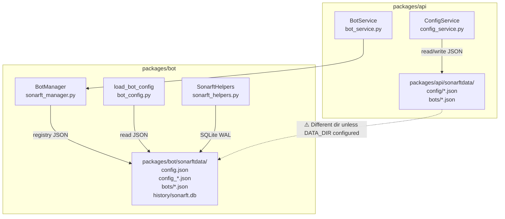

# Database, Persistence & Data Storage Review

**Prompt ID:** 07-API-DB  
**Package:** `packages/api` + `packages/bot`  
**Output:** `docs/database/07-database-persistence.md`  
**Reviewed:** July 2025  
**Status:** Complete

---

## Executive Summary

SonarFT uses a two-tier persistence model: a **SQLite database** (WAL mode) for runtime trade and order history, and a **JSON file system** for all configuration. The SQLite layer is well-designed — parameterised queries throughout, a table-name allowlist preventing injection, WAL mode for concurrent reads, and a hot-backup API. The JSON config layer uses atomic writes (`tempfile` + `os.replace`) and mtime-based caching. The most significant structural concern is the **split `sonarftdata/` directory**: the API's `ConfigService` writes to `packages/api/sonarftdata/config/`, while the bot's `load_bot_config()` reads from `packages/bot/sonarftdata/` — these are **different directories** unless `DATA_DIR` is explicitly configured to point at the bot's data directory. In the default development setup, config written by the API is invisible to the bot. A secondary concern is the complete absence of schema migration tooling — any schema change requires manual SQLite DDL and there is no rollback path.

---

## Data Architecture Diagram



---

## Storage Architecture

| Store | Technology | Location | Owner | Purpose |
|---|---|---|---|---|
| Trade/order history | SQLite 3 (WAL) | `packages/bot/sonarftdata/history/sonarft.db` | `SonarftHelpers` | Orders, trades, positions, daily_loss, errors, balances |
| Bot registry | JSON files | `sonarftdata/bots/{botid}.json` | `SonarftHelpers.save_botid()` | Persist botid across restarts |
| Client config (API) | JSON files | `packages/api/sonarftdata/config/{client_id}_parameters.json` | `ConfigService` | UI-facing exchange/symbol/indicator toggles |
| Client config (Bot) | JSON files | `packages/bot/sonarftdata/config_{section}.json` | `load_bot_config()` | Trading engine parameters |
| Master config index | JSON file | `packages/bot/sonarftdata/config.json` | Manual / bot | Maps config_N → file paths |
| Metrics log | JSONL file | `packages/api/logs/sonarft_metrics.jsonl` | `sonarft_metrics.py` | Structured observability events |
| In-memory cache | Python dict | `ConfigService._cache` | `ConfigService` | mtime-keyed JSON cache |
| In-memory bot state | Python dict | `BotManager._bots`, `_clients` | `BotManager` | Live bot instances (lost on restart) |
| In-memory WS tickets | Python dict | `TicketStore._tickets` | `TicketStore` | Single-use auth tickets (lost on restart) |

---

## Database Schema

### SQLite — `sonarftdata/history/sonarft.db`

```sql
-- WAL mode + NORMAL sync (set at init time)
PRAGMA journal_mode = WAL;
PRAGMA synchronous = NORMAL;

CREATE TABLE IF NOT EXISTS orders (
    id        INTEGER PRIMARY KEY AUTOINCREMENT,
    botid     TEXT NOT NULL,
    timestamp TEXT,
    data      TEXT NOT NULL          -- JSON blob of full trade record
);

CREATE TABLE IF NOT EXISTS trades (
    id        INTEGER PRIMARY KEY AUTOINCREMENT,
    botid     TEXT NOT NULL,
    timestamp TEXT,
    data      TEXT NOT NULL          -- JSON blob of full trade record
);

CREATE TABLE IF NOT EXISTS positions (
    order_id    TEXT NOT NULL,
    botid       TEXT NOT NULL,
    exchange    TEXT NOT NULL,
    symbol      TEXT NOT NULL,
    side        TEXT NOT NULL,
    amount      REAL NOT NULL,
    entry_price REAL NOT NULL,
    opened_at   TEXT NOT NULL,
    status      TEXT NOT NULL DEFAULT 'open',
    closed_at   TEXT,
    PRIMARY KEY (botid, order_id)
);

CREATE TABLE IF NOT EXISTS daily_loss (
    botid TEXT NOT NULL,
    date  TEXT NOT NULL,
    loss  REAL NOT NULL DEFAULT 0.0,
    PRIMARY KEY (botid, date)
);

CREATE TABLE IF NOT EXISTS errors (
    id        INTEGER PRIMARY KEY AUTOINCREMENT,
    timestamp TEXT,
    data      TEXT NOT NULL
);

CREATE TABLE IF NOT EXISTS balances (
    id        INTEGER PRIMARY KEY AUTOINCREMENT,
    timestamp TEXT,
    data      TEXT NOT NULL
);

-- Indexes
CREATE INDEX IF NOT EXISTS idx_orders_botid        ON orders(botid);
CREATE INDEX IF NOT EXISTS idx_trades_botid        ON trades(botid);
CREATE INDEX IF NOT EXISTS idx_orders_botid_ts     ON orders(botid, timestamp);
CREATE INDEX IF NOT EXISTS idx_trades_botid_ts     ON trades(botid, timestamp);
CREATE INDEX IF NOT EXISTS idx_positions_botid_status ON positions(botid, status);
CREATE INDEX IF NOT EXISTS idx_errors_ts           ON errors(timestamp);
CREATE INDEX IF NOT EXISTS idx_balances_ts         ON balances(timestamp);
```

### Schema design assessment

| Aspect | Assessment |
|---|---|
| Primary keys | ✅ `AUTOINCREMENT` on history tables; composite `(botid, order_id)` on positions |
| Indexes | ✅ Composite `(botid, timestamp)` indexes support the date-range query pattern |
| Normalisation | ⚠️ `orders` and `trades` store full JSON blobs — denormalised. Individual fields (price, profit) are not queryable without JSON parsing |
| `timestamp` column type | ⚠️ `TEXT` — SQLite has no native datetime type, but text ISO 8601 sorts correctly. Consistent format is not enforced at the DB level |
| `errors` and `balances` | ⚠️ No `botid` column — errors and balances are not scoped to a bot. All bots share the same error/balance history |
| Foreign keys | ❌ Not used — SQLite foreign key enforcement is off by default and not enabled |

---

## Query Patterns

### `_db_query` — standard paginated fetch

```python
# sonarft_helpers.py:_db_query
SELECT data FROM {table} WHERE botid = ?
ORDER BY id DESC LIMIT ? OFFSET ?
```

- ✅ Parameterised — no SQL injection risk
- ✅ Table name validated against `_ALLOWED_TABLES` frozenset before f-string interpolation
- ✅ `ORDER BY id DESC` — most recent first, consistent with user expectations
- ✅ `LIMIT`/`OFFSET` — prevents unbounded result sets

### `_db_query_range` — date-range filtered fetch

```python
# sonarft_helpers.py:_db_query_range
SELECT data FROM {table} WHERE botid = ?
[AND timestamp >= ?] [AND timestamp <= ?]
ORDER BY id DESC LIMIT ? OFFSET ?
```

- ✅ Parameterised — `from_ts`/`to_ts` are bound parameters, not interpolated
- ⚠️ `timestamp` is a `TEXT` column — range comparison works correctly only if all timestamps use the same ISO 8601 format. The log file shows `%Y-%m-%dT%H:%M:%S` format used consistently by `save_order_history` and `save_trade_history`, but this is not enforced at the schema level

### `_db_purge` — retention enforcement

```python
# sonarft_helpers.py:_db_purge
DELETE FROM {table}
WHERE botid = ? AND id NOT IN (
    SELECT id FROM {table} WHERE botid = ?
    ORDER BY id DESC LIMIT ?
)
```

- ✅ Correct subquery pattern for keeping the N most recent rows
- ⚠️ The subquery re-scans the table — on large tables this is O(N). An alternative using `MIN(id)` of the top-N set would be more efficient

### `daily_loss` upsert

```python
# sonarft_helpers.py:_save_daily_loss_sync
INSERT INTO daily_loss (botid, date, loss) VALUES (?, ?, ?)
ON CONFLICT(botid, date) DO UPDATE SET loss = excluded.loss
```

- ✅ Atomic upsert — no race condition between read and write
- ✅ Uses SQLite's `ON CONFLICT` clause correctly

### Position tracking

```python
# sonarft_helpers.py:_position_open_sync
INSERT OR IGNORE INTO positions (...) VALUES (...)

# sonarft_helpers.py:_position_close_sync
UPDATE positions SET status = 'closed', closed_at = ?
WHERE botid = ? AND order_id = ?
```

- ✅ `INSERT OR IGNORE` prevents duplicate position records
- ✅ Composite primary key `(botid, order_id)` enforces uniqueness

---

## Data Consistency

### SQLite WAL mode

WAL (Write-Ahead Logging) is enabled at init time:
```python
conn.execute("PRAGMA journal_mode=WAL")
conn.execute("PRAGMA synchronous=NORMAL")
```

- WAL allows concurrent readers without blocking writers
- `NORMAL` sync is safe with WAL and significantly faster than `FULL`
- Each `sqlite3.connect()` call opens a new connection — no connection pool

### Asyncio locking

`SonarftHelpers` uses a per-instance `asyncio.Lock` (`self._db_lock`) for write operations:

```python
async with self._db_lock:
    await asyncio.to_thread(self._db_insert, ...)
```

Read operations (`_db_query`, `_db_query_range`) do not acquire the lock — correct, since WAL allows concurrent reads.

**Gap:** `SonarftHelpers` is instantiated per-bot (`SonarftBot.initialize_modules()`). Each bot instance has its own `_db_lock`. Since all bots write to the same SQLite file, the per-instance lock does not prevent concurrent writes from multiple bots. SQLite's WAL mode handles this at the database level (serialised writes), but the asyncio lock provides no cross-bot coordination. This is acceptable — SQLite WAL serialises writes internally — but the lock is misleading: it only prevents concurrent writes from the same bot instance, not from multiple bots.

### `ConfigService` atomic writes

```python
# config_service.py:_write_json
with tempfile.NamedTemporaryFile(..., dir=dir_name, delete=False, suffix=".tmp") as tmp:
    json.dump(data, tmp, ...)
    tmp_path = tmp.name
os.replace(tmp_path, path)
```

`os.replace()` is atomic on POSIX systems — a reader will always see either the old or the new file, never a partial write. This is the correct pattern.

### In-memory bot state

`BotManager._bots` and `_clients` are in-memory only. On process restart, all running bots are lost. The bot registry JSON files (`sonarftdata/bots/{botid}.json`) persist botids but do not persist running state — bots must be recreated and restarted after a restart.

---

## Configuration Storage

### Two separate config systems

| System | Files | Owner | Purpose |
|---|---|---|---|
| API client config | `packages/api/sonarftdata/config/{client_id}_parameters.json` | `ConfigService` | UI toggles: which exchanges/symbols/indicators are enabled |
| Bot engine config | `packages/bot/sonarftdata/config_*.json` | `load_bot_config()` | Trading parameters: thresholds, amounts, timeouts |

These are **not the same config**. The API config controls the UI state; the bot config controls the trading engine. They are read by different code paths and stored in different directories.

### The `DATA_DIR` gap

`ConfigService` resolves its config path as:
```python
# config_service.py:_client_path
base = Path(data_dir).resolve() / "config"
```
where `data_dir = get_settings().data_dir` (default: `"sonarftdata"`).

This resolves to `packages/api/sonarftdata/config/` when the API is run from `packages/api/`.

`load_bot_config()` reads from:
```python
# bot_config.py:_load_config_section
bot_path("sonarftdata", "config.json")  # → packages/bot/sonarftdata/config.json
```

These are different directories. The `.env.example` shows `DATA_DIR=../bot/sonarftdata` as the intended production value, but the default `"sonarftdata"` points to the API's own directory. In the default development setup, config written by the API is not read by the bot.

### Config versioning

Both `ClientParametersConfig` and `IndicatorsConfig` have a `version: int` field (default 1). This is a schema version marker but there is no migration logic — if the schema changes, old files with `version: 1` will either fail Pydantic validation or silently use defaults for new fields.

### Config validation on load

`load_bot_config()` validates all sections through Pydantic models (`ParametersConfig`, `SymbolConfig`, `FeeConfig`) and raises `BotCreationError` with a clear message on failure. Exchange names are validated against the ccxt registry. This is thorough.

`ConfigService.get_parameters()` constructs `ClientParametersConfig(**data)` from the JSON — Pydantic validates field types and key format. Invalid files raise `ConfigWriteError` (misnamed — it's a read error in this path).

---

## Bot State Management

### Runtime state (in-memory only)

| State | Storage | Persistence |
|---|---|---|
| Running bot instances | `BotManager._bots` dict | ❌ Lost on restart |
| Client→bot mapping | `BotManager._clients` dict | ❌ Lost on restart |
| Bot run loop task | `asyncio.Task` in `SonarftBot` | ❌ Lost on restart |
| WS connections | `WebSocketManager.connections` | ❌ Lost on restart |
| WS auth tickets | `TicketStore._tickets` | ❌ Lost on restart |

### Persistent state

| State | Storage | Persistence |
|---|---|---|
| Bot registry (botid) | `sonarftdata/bots/{botid}.json` | ✅ Survives restart |
| Trade history | SQLite `orders` table | ✅ Survives restart |
| Execution history | SQLite `trades` table | ✅ Survives restart |
| Open positions | SQLite `positions` table | ✅ Survives restart |
| Daily loss accumulator | SQLite `daily_loss` table | ✅ Survives restart |
| Client config | JSON files | ✅ Survives restart |

**Gap:** There is no mechanism to restore running bots after a restart. The bot registry files record which botids existed, but the API does not read them at startup to recreate bot instances. After a restart, clients must recreate and restart their bots via the API or WebSocket.

---

## Data Backup & Recovery

### Automated backup (`SonarftHelpers.backup_db`)

```python
# sonarft_helpers.py:backup_db
src = sqlite3.connect(cls._DB_PATH)
dst = sqlite3.connect(dst_path)
src.backup(dst)
```

Uses SQLite's built-in online backup API — safe to call while the database is in use. Configured via:

| Env var | Default | Description |
|---|---|---|
| `SONARFT_BACKUP_INTERVAL` | `86400` (24h) | Backup frequency in seconds (0 = disabled) |
| `SONARFT_BACKUP_DIR` | `sonarftdata/backups/` | Backup destination |
| `SONARFT_BACKUP_KEEP_DAYS` | `7` | Retention (0 = keep all) |

**Gap:** The backup is triggered by the bot's internal scheduler, not by the API. The API has no endpoint to trigger a manual backup or query backup status.

**Gap:** JSON config files are not included in the backup. Only the SQLite database is backed up. A disaster recovery scenario requires separately backing up `sonarftdata/config/` and `sonarftdata/bots/`.

### Data retention

`SonarftHelpers.purge_history()` keeps the last 10,000 records per bot in `orders` and `trades`. This is called periodically by the bot. The `errors`, `balances`, and `positions` tables have no automatic purge.

---

## Data Migration

**No migration tooling exists.** There is no Alembic, no migration scripts, and no schema version tracking in the database. Schema changes require:

1. Manual `ALTER TABLE` or table recreation
2. Data transformation scripts written ad-hoc
3. No rollback path

The `_init_db()` method uses `CREATE TABLE IF NOT EXISTS` — it is safe to run on an existing database but cannot add columns to existing tables or change column types. Any schema evolution beyond adding new tables requires manual intervention.

---

## Concurrency & Locking

| Scenario | Mechanism | Assessment |
|---|---|---|
| Multiple bots writing to SQLite | SQLite WAL serialises writes | ✅ Safe |
| Concurrent reads during writes | WAL allows concurrent reads | ✅ Safe |
| Same bot writing from multiple coroutines | `asyncio.Lock` per bot instance | ✅ Safe within one bot |
| API reading while bot writes | WAL — reads see consistent snapshot | ✅ Safe |
| Config file read during write | `os.replace()` atomic swap | ✅ Safe |
| Config cache invalidation | `_invalidate_cache()` after write | ✅ Safe (single process) |
| Multi-worker API deployment | No shared state | ⚠️ Each worker has its own cache and bot state |

---

## Performance Characteristics

| Operation | Mechanism | Expected Latency | Notes |
|---|---|---|---|
| Insert order/trade | `asyncio.to_thread` + SQLite WAL | < 5ms | Offloaded to thread pool |
| Query 100 records | `asyncio.to_thread` + indexed SELECT | < 10ms | Composite index on `(botid, timestamp)` |
| Query with date range | Same + range filter | < 15ms | Index used for botid; timestamp range is a scan within botid partition |
| Config read (cached) | Dict lookup | < 0.1ms | mtime check + dict lookup |
| Config read (uncached) | `asyncio.to_thread` + file read | < 5ms | |
| Config write | `asyncio.to_thread` + atomic write | < 10ms | |
| Purge 10k records | Subquery DELETE | 50-200ms | Scales with table size |

**Scalability limits:**

- SQLite is single-writer — at very high trade frequency (> 1000 writes/second), write contention becomes a bottleneck. At the current scale (simulated trades every 6-18 seconds per bot), this is not a concern.
- The `_db_purge` subquery becomes expensive as tables grow beyond the retention limit. At 10,000 records per bot × 5 bots = 50,000 rows, this is negligible.
- The JSON config cache is per-process. In a multi-worker deployment, each worker maintains its own cache — a config write by one worker is not immediately visible to others until their cache expires (next mtime check).

---

## Data Privacy & Security

| Concern | Status | Notes |
|---|---|---|
| SQLite encryption at rest | ❌ Not implemented | Standard SQLite — no encryption. Trade history is stored in plaintext. |
| Config file encryption | ❌ Not implemented | JSON files are plaintext. |
| Exchange API keys in DB | ✅ Not stored | Keys are env vars only, never written to SQLite or JSON |
| PII in trade records | ✅ None | Trade records contain exchange names, prices, amounts — no user PII |
| DB file permissions | ⚠️ OS-level only | No application-level access control on the SQLite file |
| Config file permissions | ⚠️ OS-level only | JSON files readable by any process with filesystem access |
| Backup encryption | ❌ Not implemented | Backup files are unencrypted copies of the database |

---

## Concerns & Recommendations

### High

| # | Concern | Location | Detail |
|---|---|---|---|
| H1 | **`DATA_DIR` default creates a split config directory** | `config_service.py`, `bot_config.py` | Default `DATA_DIR="sonarftdata"` resolves to `packages/api/sonarftdata/config/`. The bot reads from `packages/bot/sonarftdata/`. Config written by the API is invisible to the bot unless `DATA_DIR=../bot/sonarftdata` is set. This is a silent misconfiguration — no error is raised, the bot just uses its own config files. |

### Medium

| # | Concern | Location | Detail |
|---|---|---|---|
| M1 | **No schema migration tooling** | `sonarft_helpers.py:_init_db` | `CREATE TABLE IF NOT EXISTS` cannot evolve existing schemas. Any column addition or type change requires manual DDL and has no rollback path. |
| M2 | **Bot state is not restored after restart** | `BotManager`, `sonarft_helpers.py` | Bot registry files persist botids but the API does not read them at startup. After a restart, all bots must be recreated manually. |
| M3 | **JSON config files not included in backup** | `sonarft_helpers.py:backup_db` | Only the SQLite database is backed up. Config files and bot registry files require a separate backup strategy. |
| M4 | **`errors` and `balances` tables have no `botid` column** | `sonarft_helpers.py:_init_db` | Errors and balances are not scoped to a bot — all bots share the same error/balance history. Querying errors for a specific bot is not possible. |
| M5 | **`_db_purge` subquery is O(N) on large tables** | `sonarft_helpers.py:_db_purge` | The `NOT IN (SELECT ... LIMIT ?)` pattern re-scans the table. At current scale this is fine; at high trade frequency it degrades. |

### Low

| # | Concern | Location | Detail |
|---|---|---|---|
| L1 | **`timestamp` column is untyped TEXT** | `sonarft_helpers.py:_init_db` | No format constraint at the DB level. Range queries work only if all timestamps use the same ISO 8601 format. |
| L2 | **No foreign key enforcement** | `sonarft_helpers.py:_init_db` | SQLite foreign keys are off by default. `PRAGMA foreign_keys = ON` would catch orphaned records. |
| L3 | **SQLite not encrypted at rest** | `sonarft_helpers.py` | Trade history is stored in plaintext. For a financial application, encryption at rest (SQLCipher or filesystem-level encryption) should be considered. |
| L4 | **Config `version` field has no migration logic** | `schemas.py`, `config_service.py` | The `version` field exists but is never checked or incremented. Schema changes will silently use Pydantic defaults for new fields. |
| L5 | **Per-instance `asyncio.Lock` does not coordinate across bots** | `sonarft_helpers.py` | The lock prevents concurrent writes from the same bot instance but not from multiple bots. SQLite WAL handles this correctly, making the lock misleading. |

---

## Recommendations

### Priority 1

**R1 (H1): Validate and document `DATA_DIR` configuration**

Add a startup check that warns when `DATA_DIR` points to a different location than the bot's `sonarftdata/`:

```python
# main.py:_lifespan
import os
from pathlib import Path
settings = get_settings()
api_data = Path(settings.data_dir).resolve()
bot_data = Path(__file__).parent.parent.parent / "bot" / "sonarftdata"
if api_data != bot_data.resolve():
    _logger.warning(
        "DATA_DIR (%s) differs from bot sonarftdata (%s). "
        "Config written by the API will not be read by the bot unless DATA_DIR "
        "is set to the bot's sonarftdata directory.",
        api_data, bot_data,
    )
```

Also update `.env.example` to make the correct value explicit:
```bash
# Data directory — must point to the bot's sonarftdata for config to be shared
DATA_DIR=../bot/sonarftdata
```

---

### Priority 2

**R2 (M1): Add a lightweight schema migration mechanism**

Without Alembic, a simple version table approach works:

```python
# sonarft_helpers.py:_init_db
conn.execute("""
    CREATE TABLE IF NOT EXISTS schema_version (
        version INTEGER NOT NULL DEFAULT 1
    )
""")
row = conn.execute("SELECT version FROM schema_version").fetchone()
current = row[0] if row else 0
if current < 1:
    # Initial schema — already created above
    conn.execute("INSERT INTO schema_version VALUES (1)")
# Future migrations:
# if current < 2:
#     conn.execute("ALTER TABLE errors ADD COLUMN botid TEXT")
#     conn.execute("UPDATE schema_version SET version = 2")
conn.commit()
```

**R3 (M4): Add `botid` column to `errors` table**

```sql
ALTER TABLE errors ADD COLUMN botid TEXT;
CREATE INDEX IF NOT EXISTS idx_errors_botid ON errors(botid);
```

Update `_db_insert_no_botid` to accept an optional `botid` parameter.

**R4 (M3): Include config files in backup**

```python
# sonarft_helpers.py:backup_db — extend to include config
import shutil

@classmethod
def backup_full(cls, dst_dir: str) -> None:
    """Backup SQLite DB + config files to dst_dir."""
    os.makedirs(dst_dir, exist_ok=True)
    # DB backup
    cls.backup_db(os.path.join(dst_dir, "sonarft.db"))
    # Config backup
    config_src = os.path.join(os.path.dirname(cls._DB_PATH), "..", "config")
    config_dst = os.path.join(dst_dir, "config")
    if os.path.isdir(config_src):
        shutil.copytree(config_src, config_dst, dirs_exist_ok=True)
```

---

### Priority 3

**R5 (M5): Replace `_db_purge` subquery with a more efficient pattern**

```python
@classmethod
def _db_purge(cls, table: str, botid: str, keep_last: int = 10_000) -> None:
    if table not in _ALLOWED_TABLES:
        raise ValueError(f"Invalid table name: {table!r}")
    with sqlite3.connect(cls._DB_PATH) as conn:
        # Find the minimum id to keep — single index scan
        row = conn.execute(
            f"SELECT id FROM {table} WHERE botid = ? ORDER BY id DESC LIMIT 1 OFFSET ?",
            (str(botid), keep_last - 1)
        ).fetchone()
        if row:
            conn.execute(
                f"DELETE FROM {table} WHERE botid = ? AND id < ?",
                (str(botid), row[0])
            )
            conn.commit()
```

**R6 (L2): Enable SQLite foreign key enforcement**

```python
# sonarft_helpers.py:_init_db
conn.execute("PRAGMA foreign_keys = ON")
```

---

## Backup & Recovery Plan

| Component | Backup method | Frequency | Retention | Recovery |
|---|---|---|---|---|
| SQLite DB | `sqlite3.backup()` API | 24h (configurable) | 7 days (configurable) | Copy backup file to `sonarftdata/history/sonarft.db` |
| Config JSON files | File copy (not implemented) | Manual | Manual | Copy files back to `sonarftdata/config/` |
| Bot registry JSON | File copy (not implemented) | Manual | Manual | Copy files back to `sonarftdata/bots/` |
| Metrics JSONL | Log rotation (7 files × 50MB) | Automatic | ~350MB rolling | Archive to cold storage |

**RTO estimate:** < 5 minutes (copy backup file, restart process)  
**RPO:** Up to 24 hours of trade history loss (configurable down to minutes by reducing `SONARFT_BACKUP_INTERVAL`)

---

## Data Security Checklist

- [x] Parameterised SQL queries throughout
- [x] Table-name allowlist for dynamic SQL
- [x] Atomic config file writes (`os.replace`)
- [x] Path traversal prevention on config paths
- [x] Exchange API keys never stored in DB or config files
- [x] No PII in trade records
- [ ] SQLite encryption at rest ← L3
- [ ] Config file encryption ← L3
- [ ] Backup encryption ← L3
- [ ] Foreign key enforcement ← L2
- [ ] `botid` column on `errors`/`balances` tables ← M4
- [ ] Schema migration tooling ← M1

---

_Generated by Amazon Q Developer — SonarFT API Code Review Prompt Suite, Prompt 07_


---

## Post-Implementation Update (July 2025)

### Resolved findings

| ID | Finding | Resolution |
|---|---|---|
| H1 | `DATA_DIR` default creates split config directory | Startup warning added when `DATA_DIR` differs from bot's `sonarftdata/`; `.env.example` updated |
| M1 | No schema migration tooling | `schema_version` table added; migration 1 adds `botid` to `errors`/`balances` |
| M2 | Bot state not restored after restart | Registry scan at startup logs orphaned bots; `save_botid()` now stores `client_id` |
| M3 | JSON config files not in backup | `backup_full(dst_dir)` added — backs up DB + `config/` + `bots/` |
| M4 | `errors`/`balances` have no `botid` column | `botid TEXT` column added via migration 1; indexes added |
| M5 | `_db_purge` O(N) subquery | Replaced with `OFFSET`-based index scan — O(log N) cutoff lookup |

### Schema version

The database now tracks schema version in a `schema_version` table. Current version: **1**.

Migration history:
- **v0 → v1**: `ALTER TABLE errors ADD COLUMN botid TEXT` + `ALTER TABLE balances ADD COLUMN botid TEXT` + indexes

### `backup_full()` usage

```python
# Async — call from a scheduled task
await helpers.async_backup_full("/path/to/backup/2025-07-01/")
# Backs up: sonarft.db + sonarftdata/config/*.json + sonarftdata/bots/*.json
```
