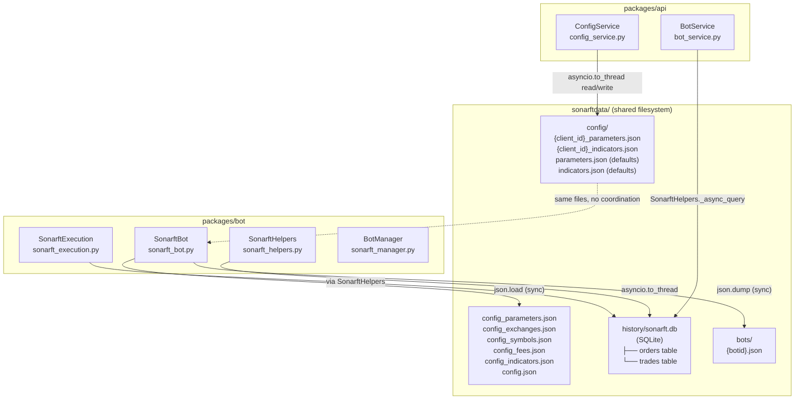

# Prompt 07 — Database, Persistence & Data Storage Review

**Generated:** July 2025  
**Reviewer:** Amazon Q (Senior Python / Data Architecture / SQLite)  
**Source files inspected:**
- `packages/api/src/services/config_service.py`
- `packages/api/src/services/bot_service.py`
- `packages/bot/sonarft_helpers.py`
- `packages/bot/sonarft_bot.py`
- `packages/bot/sonarft_execution.py`
- `packages/bot/sonarftdata/config/` (runtime config files)
- `packages/bot/sonarftdata/config_parameters.json`
- `packages/bot/sonarftdata/config_indicators.json`

**Output location:** `docs/database/07-database-persistence.md`

---

## Executive Summary

SonarFT uses a two-tier persistence strategy: SQLite for trade and order history (bot package), and flat JSON files for all configuration (both packages). The SQLite implementation in `SonarftHelpers` is well-structured — parameterized queries, indexed tables, async-safe via `asyncio.to_thread`, and a JSON fallback. However, six significant issues affect production readiness: the API's `ConfigService` and the bot's `SonarftBot` both read and write the same JSON config files with no file-level locking or coordination, creating a race condition window; the SQLite database is a single file shared across all bots with a single `asyncio.Lock`, which serializes all writes; there is no pagination on history queries (full table scans per bot); there is no data retention or archiving policy; a corrupted `[object Object]_parameters.json` file is present in the live config directory indicating a prior client-side bug; and there is no schema migration tooling — schema changes require manual database recreation.

---

## Data Architecture Overview



---

## 1. Storage Architecture

| Store | Technology | Owner | Access Pattern | Async-safe? |
|---|---|---|---|---|
| Trade & order history | SQLite (`sonarft.db`) | `SonarftHelpers` | Write: bot execution; Read: API + bot | ✅ via `asyncio.to_thread` + `asyncio.Lock` |
| Per-client runtime config | JSON files (`config/`) | `ConfigService` (API) + `SonarftBot` (bot) | Read/write: both packages | ❌ No coordination |
| Bot static config | JSON files (`sonarftdata/`) | `SonarftBot` only | Read: bot startup | ✅ Read-only at runtime |
| Bot registry | JSON files (`bots/`) | `SonarftBot` | Write: bot creation | ✅ `asyncio.to_thread` |
| Bot instance state | In-memory (`BotManager._bots`) | `BotManager` | Read/write: API + bot | ✅ `asyncio.Lock` |
| OHLCV / order book cache | In-memory dicts | `SonarftApiManager` | Read/write: bot only | ⚠️ No lock (single-process safe) |

---

## 2. SQLite Schema

```sql
-- sonarftdata/history/sonarft.db

CREATE TABLE IF NOT EXISTS orders (
    id        INTEGER PRIMARY KEY AUTOINCREMENT,
    botid     TEXT NOT NULL,
    timestamp TEXT,
    data      TEXT NOT NULL          -- JSON blob of full order record
);

CREATE TABLE IF NOT EXISTS trades (
    id        INTEGER PRIMARY KEY AUTOINCREMENT,
    botid     TEXT NOT NULL,
    timestamp TEXT,
    data      TEXT NOT NULL          -- JSON blob of full trade record
);

CREATE INDEX IF NOT EXISTS idx_orders_botid ON orders(botid);
CREATE INDEX IF NOT EXISTS idx_trades_botid ON trades(botid);
```

### Schema Assessment

| Aspect | Status | Notes |
|---|---|---|
| Primary key | ✅ `AUTOINCREMENT INTEGER` | Monotonic, collision-free |
| `botid` index | ✅ Present on both tables | O(log n) lookup by bot |
| `timestamp` index | ❌ Missing | Range queries by date will full-scan |
| Normalized fields | ⚠️ Partial | `botid` and `timestamp` are columns; all other fields are in a JSON blob |
| Foreign keys | ❌ Not used | No referential integrity between orders and trades |
| Schema version | ❌ Not tracked | No `schema_version` table or migration tooling |
| WAL mode | ❌ Not enabled | Default journal mode — concurrent reads blocked during writes |

### JSON Blob Design Trade-off

Storing the full record as a JSON blob in `data TEXT` is pragmatic — it avoids schema migrations when new fields are added to `Trade`. However it has costs:

- No ability to query by field value (e.g. `WHERE profit > 0`) without loading all rows
- No ability to add a column index on `profit`, `position`, or `buy_exchange`
- `timestamp` is duplicated as both a column and inside the JSON blob

---

## 3. Query Patterns

### All queries in `SonarftHelpers._db_query`

```python
# sonarft_helpers.py:_db_query
def _db_query(cls, table: str, botid: str) -> list:
    with sqlite3.connect(cls._DB_PATH) as conn:
        rows = conn.execute(
            f"SELECT data FROM {table} WHERE botid = ? ORDER BY id",
            (str(botid),)
        ).fetchall()
    return [json.loads(row[0]) for row in rows]
```

| Property | Assessment |
|---|---|
| Parameterized query | ✅ Uses `?` placeholder — SQL injection safe |
| Table name interpolation | ⚠️ `f"SELECT data FROM {table}"` — `table` is always `'orders'` or `'trades'` (internal call), but if this method were ever exposed to external input it would be injectable |
| `fetchall()` with no LIMIT | ❌ Full table scan per bot — unbounded result set |
| `ORDER BY id` | ✅ Insertion order — correct for history |
| Connection per query | ⚠️ New `sqlite3.connect()` per call — no connection pooling |
| WAL mode not set | ⚠️ Concurrent reads during a write will block |

### Insert pattern

```python
# sonarft_helpers.py:_db_insert
def _db_insert(cls, table: str, botid: str, timestamp: str, data: dict) -> None:
    with sqlite3.connect(cls._DB_PATH) as conn:
        conn.execute(
            f"INSERT INTO {table} (botid, timestamp, data) VALUES (?, ?, ?)",
            (str(botid), timestamp, json.dumps(data))
        )
        conn.commit()
```

Each insert opens a new connection, inserts one row, and commits. For high-frequency trading this is inefficient — each trade cycle produces at least two inserts (one order + one trade), each requiring a full connection open/commit/close cycle.

---

## 4. Concurrency & Locking

### SQLite Write Serialization

```python
# sonarft_helpers.py:save_order_data
async def save_order_data(self, botid, order_info: dict) -> None:
    async with self._db_lock:                          # asyncio.Lock — serializes all writes
        await asyncio.to_thread(self._db_insert, ...)
```

All writes go through a single `asyncio.Lock` (`self._db_lock`). This is correct for single-process safety but means all bots share one write queue — a slow disk write for bot A blocks bot B's trade persistence.

**Reads are not locked:**

```python
# sonarft_helpers.py:get_orders
async def get_orders(self, botid) -> list:
    async with self._db_lock:                          # ← reads also acquire the write lock
        return await asyncio.to_thread(self._db_query, ...)
```

Reads also acquire `_db_lock`, which means an API request for trade history blocks all concurrent bot writes. Enabling WAL mode would allow concurrent reads without blocking writes:

```python
@classmethod
def _init_db(cls) -> None:
    with sqlite3.connect(cls._DB_PATH) as conn:
        conn.execute("PRAGMA journal_mode=WAL")        # ← add this
        conn.execute("PRAGMA synchronous=NORMAL")      # ← safer than FULL for WAL
        ...
```

With WAL mode, reads and writes can proceed concurrently — reads would no longer need the lock.

### Config File Race Condition — HIGH

The `sonarftdata/config/` directory is written by `ConfigService` (API layer) and read by `SonarftBot.load_configurations` (bot layer). There is no coordination between them:

```python
# config_service.py:update_parameters — API writes
async def update_parameters(self, client_id: str, config: ParametersConfig) -> None:
    path = f"{self._data_dir}/config/{client_id}_parameters.json"
    await asyncio.to_thread(_write_json, path, config.model_dump())

# sonarft_bot.py:load_configurations — bot reads (at startup only)
# BUT: BotManager.reload_parameters calls bot.apply_parameters() for hot-reload
# The JSON file is the source of truth for new bot instances
```

If the API writes a new config file while a new bot is being created and reading the same file, the bot may read a partially written JSON file. `_write_json` uses `json.dump` directly to the target file — there is no atomic write (write-to-temp + rename):

```python
# config_service.py:_write_json
def _write_json(path: str, data: dict) -> None:
    os.makedirs(os.path.dirname(path), exist_ok=True)
    with open(path, "w", encoding="utf-8") as f:
        json.dump(data, f, ensure_ascii=False, indent=4)
```

A crash or concurrent read mid-write produces a truncated JSON file. The fix is atomic write via a temp file:

```python
import tempfile

def _write_json(path: str, data: dict) -> None:
    os.makedirs(os.path.dirname(path), exist_ok=True)
    dir_name = os.path.dirname(path)
    with tempfile.NamedTemporaryFile(
        mode="w", encoding="utf-8", dir=dir_name, delete=False, suffix=".tmp"
    ) as tmp:
        json.dump(data, tmp, ensure_ascii=False, indent=4)
        tmp_path = tmp.name
    os.replace(tmp_path, path)   # atomic on POSIX
```

---

## 5. Corrupted Config File — MEDIUM

The live config directory contains a file named `[object Object]_parameters.json`:

```
sonarftdata/config/
├── [object Object]_parameters.json   ← corrupted filename
├── 369_parameters.json
├── c482b04b-dc92-4899-9a8c-2425c1f12203_parameters.json
├── c482b04b-dc92-4899-9a8c-2425c1f12203_indicators.json
├── indicators.json
└── parameters.json
```

`[object Object]` is the JavaScript string representation of an unserialised object — this was created when a frontend bug passed a JavaScript object as `client_id` instead of a string. This confirms two things:

1. `client_id` is not validated before being used in file path construction (confirmed in Prompts 03 and 04)
2. The file system already contains evidence of a prior path construction bug

This file should be deleted and the `client_id` validation fix (Prompt 04, item 3) applied immediately.

---

## 6. Configuration Storage Design

### Per-Client Runtime Config (`sonarftdata/config/`)

| File | Written by | Read by | Format |
|---|---|---|---|
| `{client_id}_parameters.json` | `ConfigService.update_parameters` | `SonarftBot.load_configurations` (new bots) | `ParametersConfig` JSON |
| `{client_id}_indicators.json` | `ConfigService.update_indicators` | `SonarftBot.load_configurations` (new bots) | `IndicatorsConfig` JSON |
| `parameters.json` | Manual / seeded | `ConfigService.get_default_parameters` | `ParametersConfig` JSON |
| `indicators.json` | Manual / seeded | `ConfigService.get_default_indicators` | `IndicatorsConfig` JSON |

**Schema mismatch between config files and bot config:**

The per-client `parameters.json` stores `ParametersConfig` (exchanges + symbols as `dict[str, bool]`):

```json
{
    "exchanges": {"Binance": true, "Okx": false},
    "symbols": {"BTC/USDT": true, "ETH/USDT": false}
}
```

But `SonarftBot.load_configurations` reads from `config_parameters.json` which has a completely different schema:

```json
{
    "parameters_1": [{
        "profit_percentage_threshold": 0.003,
        "trade_amount": 0.01,
        "is_simulating_trade": 1,
        ...
    }]
}
```

The API's `ParametersConfig` (exchanges/symbols toggles) and the bot's `config_parameters.json` (trading parameters) are **two different configuration domains** with no overlap. The API config controls which exchanges and symbols are active in the UI; the bot config controls trading behaviour. This distinction is not documented anywhere and the naming (`ParametersConfig` for both) is confusing.

### Static Bot Config (`sonarftdata/config_*.json`)

These files are read once at bot startup by `SonarftBot.load_configurations` and are never written by the API. They are effectively immutable at runtime. No versioning, migration, or rollback mechanism exists.

---

## 7. Bot State Management

| State | Storage | Persistence across restart? |
|---|---|---|
| Bot instance (running/stopped) | In-memory `BotManager._bots` | ❌ Lost on restart |
| Bot ID registry | `sonarftdata/bots/{botid}.json` | ✅ Persisted |
| Trade history | SQLite `orders` + `trades` tables | ✅ Persisted |
| Active parameters | In-memory `SonarftBot` attributes | ❌ Lost on restart — reloaded from JSON on next `create_bot` |
| Daily loss accumulator | In-memory `SonarftSearch.daily_loss_accumulated` | ❌ Lost on restart |
| Exchange market data cache | In-memory `SonarftApiManager` dicts | ❌ Lost on restart — reloaded from exchange |

**Critical gap:** The daily loss accumulator (`SonarftSearch.daily_loss_accumulated`) is in-memory only. If the bot process restarts mid-day, the daily loss counter resets to zero, potentially allowing the bot to exceed its `max_daily_loss` limit on the same calendar day.

---

## 8. Data Retention & Archiving

| Aspect | Status |
|---|---|
| Trade history retention policy | ❌ Not defined — grows indefinitely |
| Order history retention policy | ❌ Not defined — grows indefinitely |
| Config file cleanup | ❌ Not defined — orphaned client files accumulate |
| Bot registry cleanup | ❌ Not defined — `bots/` directory grows indefinitely |
| SQLite database size limit | ❌ Not defined |
| Log file rotation | ❌ Not configured |

A bot running 100 trades/day for a year would accumulate ~36,500 rows per table. At ~500 bytes per JSON blob, that is ~18 MB per bot per year — manageable for SQLite but unbounded. Without a retention policy, the database will grow until disk space is exhausted.

---

## 9. Backup & Recovery

| Aspect | Status |
|---|---|
| SQLite backup strategy | ❌ Not implemented |
| Config file backup | ❌ Not implemented |
| Point-in-time recovery | ❌ Not possible |
| Recovery time objective (RTO) | ❌ Not defined |
| Recovery point objective (RPO) | ❌ Not defined |

SQLite supports online backup via the `sqlite3` backup API without locking the database. A simple daily backup task would suffice for the current scale:

```python
import sqlite3

def backup_db(src_path: str, dst_path: str) -> None:
    src = sqlite3.connect(src_path)
    dst = sqlite3.connect(dst_path)
    src.backup(dst)
    dst.close()
    src.close()
```

---

## 10. Performance Characteristics

| Query | Current Performance | Risk |
|---|---|---|
| `GET /bots/{botid}/orders` | O(n) full scan, all rows returned | High — unbounded for active bots |
| `GET /bots/{botid}/trades` | O(n) full scan, all rows returned | High — same |
| Insert order/trade | O(log n) with botid index | Low — fast |
| Config file read | O(1) file open + JSON parse | Low |
| Config file write | O(1) file write | Low — but not atomic |
| Bot instance lookup | O(1) dict lookup | Low |

The `idx_orders_botid` and `idx_trades_botid` indexes make per-bot queries efficient. The bottleneck is `fetchall()` with no `LIMIT` — for a bot with 10,000 trades, the API returns all 10,000 records in a single response.

Adding `LIMIT`/`OFFSET` to `_db_query` (recommended in Prompt 02) requires a one-line change:

```python
@classmethod
def _db_query(cls, table: str, botid: str, limit: int = 100, offset: int = 0) -> list:
    with sqlite3.connect(cls._DB_PATH) as conn:
        rows = conn.execute(
            f"SELECT data FROM {table} WHERE botid = ? ORDER BY id DESC LIMIT ? OFFSET ?",
            (str(botid), limit, offset)
        ).fetchall()
    return [json.loads(row[0]) for row in rows]
```

Note: `ORDER BY id DESC` returns most recent first, which is the expected default for history endpoints.

---

## 11. Scalability Assessment

| Dimension | Current Limit | Bottleneck |
|---|---|---|
| Bots per process | `max_bots_per_client × clients` | In-memory `BotManager._bots` |
| Concurrent writes | Serialized by `asyncio.Lock` | Single SQLite file + single lock |
| Concurrent reads | Blocked by write lock | WAL mode would fix this |
| Multi-process / multi-host | ❌ Not supported | In-memory state, single SQLite file |
| Config file concurrency | ❌ Race condition | No file locking |
| Database size | Unbounded | No retention policy |

SQLite is appropriate for the current single-process deployment. For multi-process or multi-host scaling, a client-server database (PostgreSQL) would be required. The current architecture does not support horizontal scaling.

---

## 12. Data Security

| Aspect | Status | Notes |
|---|---|---|
| SQLite file permissions | ⚠️ Not enforced in code | Depends on OS filesystem permissions |
| Config file permissions | ⚠️ Not enforced in code | Same |
| Encryption at rest | ❌ Not implemented | Trade history and config stored in plaintext |
| Exchange API keys in storage | ✅ Not stored | Keys loaded from env vars only |
| PII in trade records | ⚠️ Exchange account IDs may appear | Depends on exchange API response |
| `client_id` in filenames | ⚠️ UUID format in practice | But no enforcement — any string accepted |

---

## Issues Summary

| # | Issue | Severity | Location |
|---|---|---|---|
| 1 | Config file write is not atomic — concurrent read during write produces truncated JSON | **High** | `config_service.py:_write_json` |
| 2 | No coordination between `ConfigService` (API) and `SonarftBot` (bot) reading/writing same config files | **High** | `config_service.py`, `sonarft_bot.py` |
| 3 | `[object Object]_parameters.json` in live config directory — evidence of prior `client_id` injection bug | **High** | `sonarftdata/config/` |
| 4 | No pagination on `_db_query` — full table scan returned to API for all history | **High** | `sonarft_helpers.py:_db_query` |
| 5 | Daily loss accumulator is in-memory only — resets to zero on process restart | **Medium** | `sonarft_search.py:daily_loss_accumulated` |
| 6 | SQLite WAL mode not enabled — reads block during writes | **Medium** | `sonarft_helpers.py:_init_db` |
| 7 | Single `asyncio.Lock` serializes all reads and writes across all bots | **Medium** | `sonarft_helpers.py:_db_lock` |
| 8 | No `timestamp` index on `orders`/`trades` tables — date range queries will full-scan | **Medium** | `sonarft_helpers.py:_init_db` |
| 9 | No data retention or archiving policy — database grows indefinitely | **Medium** | `sonarft_helpers.py` |
| 10 | No backup strategy for SQLite database or config files | **Medium** | System-level gap |
| 11 | `ParametersConfig` naming conflates two unrelated config domains (UI toggles vs trading params) | **Low** | `schemas.py`, `config_service.py` |
| 12 | No schema migration tooling — schema changes require manual database recreation | **Low** | `sonarft_helpers.py:_init_db` |
| 13 | New `sqlite3.connect()` per query — no connection pooling | **Low** | `sonarft_helpers.py:_db_query`, `_db_insert` |

---

## Recommendations

### Priority 1 — High impact

**1. Atomic config file writes**

```python
# config_service.py
import tempfile

def _write_json(path: str, data: dict) -> None:
    os.makedirs(os.path.dirname(path), exist_ok=True)
    dir_name = os.path.dirname(os.path.abspath(path))
    with tempfile.NamedTemporaryFile(
        mode="w", encoding="utf-8", dir=dir_name, delete=False, suffix=".tmp"
    ) as tmp:
        json.dump(data, tmp, ensure_ascii=False, indent=4)
        tmp_path = tmp.name
    os.replace(tmp_path, path)  # atomic on POSIX, near-atomic on Windows
```

**2. Delete `[object Object]_parameters.json` and apply `client_id` validation**

```bash
rm "packages/bot/sonarftdata/config/[object Object]_parameters.json"
```

Then apply `sanitize_client_id()` in `ConfigService` (see Prompt 04, item 3).

**3. Add pagination to `_db_query`**

```python
@classmethod
def _db_query(cls, table: str, botid: str, limit: int = 100, offset: int = 0) -> list:
    with sqlite3.connect(cls._DB_PATH) as conn:
        rows = conn.execute(
            f"SELECT data FROM {table} WHERE botid = ? ORDER BY id DESC LIMIT ? OFFSET ?",
            (str(botid), limit, offset)
        ).fetchall()
    return [json.loads(row[0]) for row in rows]
```

### Priority 2 — Medium impact

**4. Enable WAL mode and separate read/write locks**

```python
@classmethod
def _init_db(cls) -> None:
    with sqlite3.connect(cls._DB_PATH) as conn:
        conn.execute("PRAGMA journal_mode=WAL")
        conn.execute("PRAGMA synchronous=NORMAL")
        # ... rest of schema creation
```

With WAL mode, remove `_db_lock` from read methods — only writes need the lock.

**5. Persist daily loss accumulator**

```python
# sonarft_search.py — persist to SQLite on update, reload on start
async def _persist_daily_loss(self) -> None:
    # Store in a simple key-value table in sonarft.db
    ...
```

Alternatively, store it in a `bot_state` table keyed by `(botid, date)`.

**6. Add `timestamp` index**

```python
conn.execute(
    "CREATE INDEX IF NOT EXISTS idx_orders_timestamp ON orders(botid, timestamp)"
)
conn.execute(
    "CREATE INDEX IF NOT EXISTS idx_trades_timestamp ON trades(botid, timestamp)"
)
```

### Priority 3 — Low impact

**7. Add a `schema_version` table**

```python
conn.execute("""
    CREATE TABLE IF NOT EXISTS schema_version (
        version INTEGER PRIMARY KEY,
        applied_at TEXT NOT NULL
    )
""")
# Insert current version if not present
conn.execute(
    "INSERT OR IGNORE INTO schema_version (version, applied_at) VALUES (1, datetime('now'))"
)
```

**8. Implement a simple retention policy**

```python
@classmethod
def _purge_old_records(cls, table: str, botid: str, keep_last: int = 10000) -> None:
    """Delete oldest records beyond keep_last for a given bot."""
    with sqlite3.connect(cls._DB_PATH) as conn:
        conn.execute(f"""
            DELETE FROM {table}
            WHERE botid = ? AND id NOT IN (
                SELECT id FROM {table} WHERE botid = ?
                ORDER BY id DESC LIMIT ?
            )
        """, (str(botid), str(botid), keep_last))
        conn.commit()
```

---

## Data Security Checklist

- [ ] Set restrictive filesystem permissions on `sonarftdata/` (`chmod 700`)
- [ ] Delete `[object Object]_parameters.json` from config directory
- [ ] Apply `client_id` sanitization before all file path construction
- [ ] Implement atomic writes for all config file updates
- [ ] Enable SQLite WAL mode for concurrent read safety
- [ ] Define and implement a data retention policy
- [ ] Implement SQLite backup strategy (daily `sqlite3.backup()`)
- [ ] Document the two distinct config domains (`ParametersConfig` UI toggles vs bot trading params)

---

_Part of the SonarFT API Code Review Prompt Suite — Prompt 07_  
_Previous: [Prompt 06 — Error Handling & Logging](../error-handling/06-error-handling-logging.md)_  
_Next: [Prompt 08 — Performance Optimization](../prompts/08-performance-optimization.md)_
