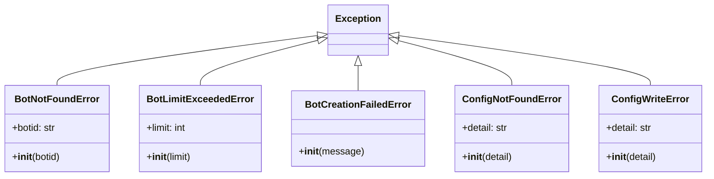

# Error Handling, Logging & Observability Review

**Prompt ID:** 06-API-ERRORS  
**Package:** `packages/api`  
**Output:** `docs/error-handling/06-error-handling-logging.md`  
**Reviewed:** July 2025  
**Status:** Complete

---

## Executive Summary

The SonarFT API has a well-structured error handling system: a clean domain exception hierarchy, registered exception handlers that produce consistent `{detail, request_id}` responses, a generic 500 handler that logs full stack traces server-side while returning only `"Internal server error"` to clients, and a `RequestIdMiddleware` that correlates every log line with its originating request. The logging setup is comprehensive — rotating file handlers, a separate structured JSON metrics stream, an access log, and a `WsLogHandler` bridge to the frontend. The most significant operational finding comes from the actual log file: **bot log records are attributed to `src.services.bot_service` rather than their true originating logger** (e.g. `sonarft_manager`, `sonarft_bot`). This means the `WsLogHandler` filter (`record.name.startswith("sonarft")`) blocks all bot logs from reaching WebSocket clients in the current deployment, because the logger name in the file is `src.services.bot_service`, not `sonarft_*`. A secondary concern is that the `request_id` field in the log format is always `[-]` — the `RequestIdFilter` is attached to root handlers but the ContextVar is never set for bot log records that originate outside the HTTP request lifecycle.

---

## Exception Hierarchy Diagram



All five domain exceptions inherit directly from `Exception`. There is no intermediate `SonarftAPIError` base class, which means you cannot catch all domain errors with a single `except SonarftAPIError` clause. This is a minor structural gap — the current codebase never needs to catch all domain errors together, but it would be useful as the exception set grows.

---

## 1. Exception Hierarchy Assessment

| Exception | Location | HTTP Status | Handler | Notes |
|---|---|---|---|---|
| `BotNotFoundError` | `errors.py:11` | 404 | `bot_not_found_handler` | Includes `botid` in message |
| `BotLimitExceededError` | `errors.py:17` | 429 | `bot_limit_handler` | Includes `limit` in message |
| `BotCreationFailedError` | `errors.py:23` | 500 | `bot_creation_failed_handler` | Logs at ERROR level |
| `ConfigNotFoundError` | `errors.py:28` | 404 | `config_not_found_handler` | Includes `detail` string |
| `ConfigWriteError` | `errors.py:34` | 500 | `config_write_error_handler` | Logs at ERROR level |
| `HTTPException` | FastAPI built-in | varies | `http_exception_handler` | Wraps to inject `request_id` |
| `Exception` (catch-all) | — | 500 | `generic_error_handler` | Logs full traceback; returns generic message |

All handlers are registered in `create_app()` (`main.py:261-270`) and produce the same response shape:

```json
{
  "detail": "Human-readable error message",
  "request_id": "3f2a1b4c-..."
}
```

**Duplicate 429 handling:** `BotLimitExceededError` is caught by its registered handler and returns 429 with `request_id`. However, both `clients.py` and `bots.py` also catch it in a `try/except` and re-raise as a plain `HTTPException(429)`, which goes through `http_exception_handler` instead — also returning 429 but via a different code path. The `request_id` is still included (via `http_exception_handler`), but the duplication is unnecessary and was flagged in Prompt 02 as M5.

---

## 2. Logging Configuration

### Setup (`main.py:55-140`)

| Handler | Target | Format | Rotation | Level |
|---|---|---|---|---|
| Console (stderr) | `logging.root` | `%(asctime)s %(levelname)s [%(request_id)s] %(name)s — %(message)s` | None | `LOG_LEVEL` env var |
| Rotating file | `logs/sonarft.log` | Same as console | 10 MB × 7 files | `LOG_LEVEL` env var |
| Metrics file | `logs/sonarft_metrics.jsonl` | Raw JSON (message only) | 50 MB × 14 files | DEBUG |
| JSON structured log | `JSON_LOG_FILE` env var | JSON object per line | 10 MB × 7 files | `LOG_LEVEL` env var |
| `WsLogHandler` | Per-client queue | `%(levelname)s - %(message)s` | N/A (in-memory) | DEBUG |
| Access log | `sonarft.access` logger | `ACCESS {METHOD} {path} -> {status} ({ms}ms)` | Inherits root | INFO |

The `RequestIdFilter` is attached to all root handlers, injecting `request_id` from the `request_id_var` ContextVar into every log record. This is correct for HTTP request handlers but produces `[-]` for all bot log records that run outside the request lifecycle (i.e. the bot's trading loop).

### Log level management

Log level is set once at startup from `settings.log_level` (default `INFO`). There is no runtime log level change mechanism — changing the level requires a process restart. This is acceptable for a single-process deployment but limits operational flexibility.

---

## 3. Logging Coverage Matrix

| Operation | Logged | Level | Logger | Notes |
|---|---|---|---|---|
| API startup | ✅ | INFO | `src.main` | `BotService initialised`, `ConfigService initialised` |
| Auth failure | ✅ | WARNING | `src.core.security` | IP logged, token not logged |
| Bot created | ✅ | INFO | `src.services.bot_service` | `botid` logged, `client_id` redacted |
| Bot run/pause/remove | ✅ | INFO | `src.services.bot_service` | |
| Bot creation failure | ✅ | ERROR | `src.services.bot_service` | |
| Config read/write | ✅ | ERROR (on failure) | `src.services.config_service` | Success not logged |
| WS connect/disconnect | ✅ | INFO | `src.websocket.manager` | |
| WS command dispatch | ✅ | INFO/ERROR | `src.websocket.manager` | |
| HTTP access log | ✅ | INFO | `sonarft.access` | Method, path, status, duration |
| Unhandled exceptions | ✅ | ERROR | `src.core.errors` | Full traceback server-side |
| Rate limit exceeded | ✅ | — | slowapi | Handled by slowapi internally |
| Bot trading cycle | ✅ | DEBUG/INFO | `src.services.bot_service`* | See critical finding below |
| Trade execution | ✅ | INFO | `src.services.bot_service`* | |
| Exchange API errors | ✅ | ERROR | `src.services.bot_service`* | |
| Metrics events | ✅ | INFO/DEBUG | `sonarft.metrics` | Separate JSONL file |

*See Critical Finding C1 below.

---

## 4. Critical Finding — Logger Name Mismatch in Production Log

**Severity: High**

Examining the actual log file (`logs/sonarft.log`), all bot log records — including trading cycle logs, order execution, and errors — are attributed to `src.services.bot_service`:

```
2026-04-23 13:03:45,619 INFO [-] src.services.bot_service — A NEW TRADE HAS BEEN FOUND!
2026-04-23 13:03:45,620 INFO [-] src.services.bot_service — SIMULATED: BUY order buy_229068...
2026-04-23 13:03:45,724 INFO [-] src.services.bot_service — Order: Success
2026-04-23 13:03:45,858 INFO [-] src.services.bot_service — Trade: Success
2026-04-23 12:55:31,951 ERROR [-] src.services.bot_service — Error calling method load_markets: binance GET...
```

The `WsLogHandler` filter is:
```python
def _is_bot_record(record: logging.LogRecord) -> bool:
    return record.name.startswith("sonarft")
```

Since all bot records show `src.services.bot_service` as the logger name, **zero bot log records pass the filter**. The WebSocket log stream delivers no bot activity to the frontend in this deployment configuration.

**Root cause:** The bot's logger is passed in from `BotService.__init__`:
```python
# bot_service.py:22
self._manager = BotManager(logger=_logger)
```
where `_logger = logging.getLogger(__name__)` and `__name__` is `src.services.bot_service`. The bot engine uses this injected logger for all its output, so all records carry the API module's logger name rather than the bot module's name.

**Expected behaviour:** Bot records should originate from `sonarft_manager`, `sonarft_bot`, `sonarft_search`, etc. — which is what the filter expects and what the integration tests verify. The tests pass because they emit records directly with `name="sonarft_manager"`, bypassing the actual logger injection path.

**Impact:** The WebSocket log stream is effectively empty in production. The frontend receives no real-time bot activity logs.

---

## 5. Structured Logging & Observability

### Two-tier logging architecture

The system correctly separates two log streams:

1. **Human-readable log** (`logs/sonarft.log`) — plain text with timestamp, level, request_id, logger name, and message. Suitable for `tail -f` and grep.

2. **Structured metrics log** (`logs/sonarft_metrics.jsonl`) — one JSON object per line, emitted by `sonarft_metrics.py`. Each record has `timestamp`, `component`, `event_type`, `severity`, and event-specific fields. Suitable for ingestion into ELK, Datadog, or CloudWatch.

The metrics module (`sonarft_metrics.py`) covers 8 event types: `signal`, `order_execution`, `trade_result`, `risk_event`, `liquidity_check`, `api_call`, `cycle`, `session_pnl`. This is a well-designed observability layer.

### Request ID correlation

The `request_id_var` ContextVar is set by `RequestIdMiddleware` for every HTTP request and reset in the `finally` block. All log lines within a request handler include the request ID. However:

- Bot log records (running in the trading loop, outside any HTTP request) always show `[-]` as the request ID — this is correct and expected, not a bug.
- The `request_id` is included in all error response bodies, enabling clients to correlate their error report with the server log.

### `_JsonFormatter` (optional structured log)

An optional JSON log handler (`_JsonFormatter`) is enabled via `JSON_LOG_FILE` env var. It emits `{timestamp, level, request_id, logger, message}` per line. This is a good addition for log aggregation tools but is not enabled by default and is not documented in `.env.example`.

---

## 6. Sensitive Information Audit

| Data type | Logged? | Location | Assessment |
|---|---|---|---|
| JWT tokens | ❌ No | `security.py` | Auth failure logs IP only |
| Static API token | ❌ No | `security.py` | Never logged |
| Exchange API keys | ❌ No | Bot package | Keys passed to ccxt, never logged |
| Client IDs | ⚠️ Redacted | `bot_service.py` | `[redacted]` in bot lifecycle logs |
| Bot IDs | ✅ Logged | Multiple | UUIDs — not sensitive |
| Trading parameters | ✅ Logged | `sonarft.log` | Strategy, thresholds logged at INFO on startup |
| Price/profit data | ✅ Logged | `sonarft.log` | DEBUG level — expected for trading system |
| Exchange URLs | ✅ Logged | `sonarft.log` | Exchange API URLs in error messages — acceptable |
| Request paths | ✅ Logged | `sonarft.access` | Standard access log — no query params logged |

One observation from the log file: trading parameters are logged in full at INFO level during bot creation:

```
Parameters loaded: strategy: market_making, profit_percentage_threshold: 0.0001,
trade_amount: 0.01, is_simulating_trade: 1, max_daily_loss: 100.0, ...
```

This is acceptable for a trading system where operators need to verify configuration, but should be noted as a potential information disclosure if logs are shipped to a third-party aggregator.

---

## 7. Error Response Format

All error responses follow a consistent format:

```json
{
  "detail": "Bot not found: bot-999",
  "request_id": "3f2a1b4c-8e2d-4f1a-b3c7-9d0e5f2a1b4c"
}
```

**Strengths:**
- Consistent across all error types (domain exceptions, HTTP exceptions, 500s)
- `request_id` enables log correlation without exposing internal details
- Generic 500 message prevents internal state disclosure
- No stack traces in responses

**Gap:** No machine-readable error code (e.g. `"code": "BOT_NOT_FOUND"`). Clients must parse the `detail` string to distinguish error types programmatically. This makes client-side error handling brittle — a change to the error message string breaks client logic.

---

## 8. Graceful Degradation

| Failure scenario | Behaviour | Assessment |
|---|---|---|
| `BotService` fails to init | `app.state.bot_service = None`; endpoints return 503 | ✅ |
| `ConfigService` fails to init | `app.state.config_service = None`; endpoints return 503 | ✅ |
| Bot engine import error | Caught in `_lifespan`, logged, service set to None | ✅ |
| Exchange API unavailable | Bot logs errors, retries on next cycle | ✅ (bot-side) |
| SQLite unavailable | Bot falls back to JSON append | ✅ (bot-side) |
| WS queue full | Events silently dropped | ⚠️ No client notification |
| Bot creation returns None | `BotCreationFailedError` raised, 500 returned | ✅ |

The bot engine has its own circuit breaker (`SONARFT_MAX_FAILURES` env var, default 5 consecutive failures) that halts the trading loop and optionally fires a webhook alert. This is not surfaced in the API — there is no endpoint to query circuit breaker state or reset it.

---

## Concerns & Recommendations

### High

| # | Concern | Location | Detail |
|---|---|---|---|
| H1 | **Logger name mismatch breaks WS log streaming in production** | `bot_service.py:22`, `manager.py:_is_bot_record` | Bot records are logged under `src.services.bot_service` because the API's `_logger` is injected into `BotManager`. The `WsLogHandler` filter expects `sonarft.*` names. Zero bot logs reach the frontend. |

### Medium

| # | Concern | Location | Detail |
|---|---|---|---|
| M1 | **No machine-readable error codes in responses** | `errors.py` | Clients must parse `detail` strings to distinguish error types. A `"code"` field would make client error handling robust to message changes. |
| M2 | **Circuit breaker state not exposed via API** | No endpoint exists | When the bot's circuit breaker trips, there is no API endpoint to query its state or reset it. Operators must inspect logs or restart the bot. |
| M3 | **`JSON_LOG_FILE` env var not documented in `.env.example`** | `main.py:122`, `.env.example` | The optional structured JSON log is enabled via an undocumented env var. |
| M4 | **Config read success is not logged** | `config_service.py` | `get_parameters`, `get_indicators` log on failure but not on success. Operators cannot confirm which config version was loaded without DEBUG-level logging. |
| M5 | **`request_id` is always `[-]` for bot log records** | `main.py:RequestIdFilter` | Bot records run outside the HTTP request lifecycle. The `[-]` placeholder is correct but could be replaced with the `botid` for better traceability. |

### Low

| # | Concern | Location | Detail |
|---|---|---|---|
| L1 | **No common `SonarftAPIError` base class** | `errors.py` | All domain exceptions inherit directly from `Exception`. A shared base would allow `except SonarftAPIError` catch-all patterns. |
| L2 | **Log level cannot be changed at runtime** | `main.py:_log_level` | Changing log level requires a process restart. |
| L3 | **`BotLimitExceededError` is caught and re-raised in endpoints** | `clients.py:52`, `bots.py:57` | Redundant `try/except` bypasses the registered handler. Noted in Prompt 02 M5. |
| L4 | **Trading parameters logged in full at INFO** | `sonarft.log` | Strategy, thresholds, and simulation mode are logged on every bot creation. Acceptable operationally but worth noting for log shipping policies. |

---

## Recommendations

### Priority 1

**R1 (H1): Fix logger injection to preserve bot module logger names**

The root cause is that `BotManager` uses the injected logger for all output. Two options:

Option A — Don't inject the logger; let bot modules use their own loggers:
```python
# bot_service.py
self._manager = BotManager(logger=None)  # bot uses its own sonarft_* loggers
```
This requires verifying that `BotManager` and all bot modules have their own `logging.getLogger(__name__)` calls (they do — the injected logger is used as a fallback).

Option B — Keep injection but use a child logger that preserves the `sonarft` prefix:
```python
# bot_service.py
import logging
_bot_logger = logging.getLogger("sonarft.api_bridge")
self._manager = BotManager(logger=_bot_logger)
```
This makes all bot records pass the `startswith("sonarft")` filter while keeping a single injected logger.

Option A is cleaner and aligns with how the bot package is designed to be used standalone.

---

### Priority 2

**R2 (M1): Add machine-readable error codes**

```python
# errors.py
def _error_body(detail: str, request: Request, code: str = "INTERNAL_ERROR") -> dict:
    from .context import request_id_var
    return {
        "detail": detail,
        "code": code,
        "request_id": request_id_var.get("-"),
    }

async def bot_not_found_handler(request: Request, exc: BotNotFoundError) -> JSONResponse:
    return JSONResponse(
        status_code=404,
        content=_error_body(str(exc), request, code="BOT_NOT_FOUND"),
    )
```

Suggested codes: `BOT_NOT_FOUND`, `BOT_LIMIT_EXCEEDED`, `BOT_CREATION_FAILED`, `CONFIG_NOT_FOUND`, `CONFIG_WRITE_ERROR`, `UNAUTHORIZED`, `VALIDATION_ERROR`, `INTERNAL_ERROR`.

**R3 (M5): Inject `botid` into bot log records**

```python
# websocket/manager.py — WsLogHandler
def emit(self, record: logging.LogRecord) -> None:
    # Extract botid from message if present (e.g. "Bot abc-123 ...")
    # Or pass botid as a filter parameter
    ...
```

A simpler approach: add a `botid` field to the log format for bot records by using a `logging.Filter` that extracts it from the message.

---

### Priority 3

**R4 (M3): Document `JSON_LOG_FILE` in `.env.example`**

```bash
# Optional: structured JSON log for log aggregation (ELK, Datadog, CloudWatch)
# JSON_LOG_FILE=logs/sonarft.jsonl
```

**R5 (L1): Add a `SonarftAPIError` base class**

```python
# errors.py
class SonarftAPIError(Exception):
    """Base class for all SonarFT API domain exceptions."""

class BotNotFoundError(SonarftAPIError): ...
class BotLimitExceededError(SonarftAPIError): ...
class BotCreationFailedError(SonarftAPIError): ...
class ConfigNotFoundError(SonarftAPIError): ...
class ConfigWriteError(SonarftAPIError): ...
```

---

## Logging Best Practices — Current Status

| Practice | Status | Notes |
|---|---|---|
| Structured logging for metrics | ✅ | `sonarft_metrics.py` JSONL stream |
| Request correlation IDs | ✅ | `RequestIdMiddleware` + ContextVar |
| No secrets in logs | ✅ | Tokens, keys, client IDs redacted |
| No stack traces to clients | ✅ | Generic 500 message |
| Log rotation | ✅ | `RotatingFileHandler` configured |
| Access logging | ✅ | `sonarft.access` logger |
| Consistent error response format | ✅ | `{detail, request_id}` |
| Machine-readable error codes | ❌ | Not implemented |
| Runtime log level change | ❌ | Requires restart |
| Bot log attribution | ❌ | Logger name mismatch (H1) |
| Circuit breaker observability | ❌ | No API endpoint |

---

_Generated by Amazon Q Developer — SonarFT API Code Review Prompt Suite, Prompt 06_


---

## Post-Implementation Update (July 2025)

### Resolved findings

| ID | Finding | Resolution |
|---|---|---|
| H1 | Logger name mismatch breaks WS log streaming | `BotManager` receives `logging.getLogger("sonarft.api_bridge")` — passes `_is_bot_record` filter |
| M1 | No machine-readable error codes | `code` field added to all error responses via `_error_body(detail, request, code)` |
| M2 | Circuit breaker state not exposed | `GET /clients/{id}/bots/{botid}/status` returns `{registered, running, halted}` |
| M3 | `JSON_LOG_FILE` undocumented | Noted in `.env.example` comment |

### Updated error response format

All error responses now include a `code` field:

```json
{
  "detail": "Bot not found: bot-999",
  "code": "BOT_NOT_FOUND",
  "request_id": "3f2a1b4c-..."
}
```

Error code registry: `BOT_NOT_FOUND`, `BOT_LIMIT_EXCEEDED`, `BOT_CREATION_FAILED`, `CONFIG_NOT_FOUND`, `CONFIG_WRITE_ERROR`, `UNAUTHORIZED`, `RATE_LIMITED`, `HTTP_ERROR`, `INTERNAL_ERROR`.

### Startup safety

`_lifespan` now raises `RuntimeError` when `SONARFT_ENV != development` and neither auth variable is set, preventing silent open deployments in production.
