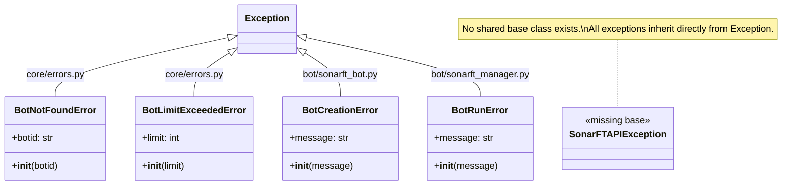
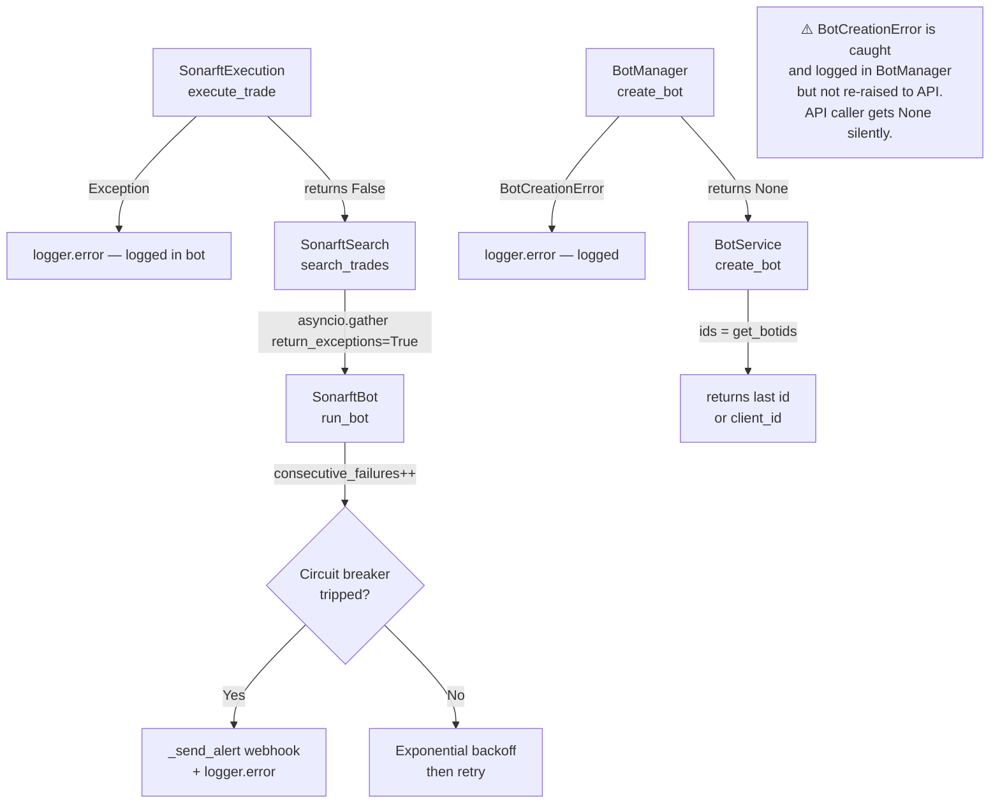

# Prompt 06 — Error Handling, Logging & Observability Review

**Generated:** July 2025  
**Reviewer:** Amazon Q (Senior Python / Observability / Async Systems)  
**Source files inspected:**
- `packages/api/src/core/errors.py`
- `packages/api/src/core/security.py`
- `packages/api/src/main.py`
- `packages/api/src/websocket/manager.py`
- `packages/api/src/services/bot_service.py`
- `packages/api/src/services/config_service.py`
- `packages/api/src/api/v1/endpoints/` (all three routers)
- `packages/bot/sonarft_bot.py`
- `packages/bot/sonarft_execution.py`
- `packages/bot/sonarft_search.py`
- `packages/bot/sonarft_manager.py`

**Output location:** `docs/error-handling/06-error-handling-logging.md`

---

## Executive Summary

The SonarFT API has a functional but shallow error handling and logging foundation. The exception hierarchy is minimal (two domain exceptions), error handlers correctly map to HTTP status codes, and the bot package has strong operational logging with circuit breakers, backoff, and alert webhooks. However, four systemic gaps undermine production observability: the `generic_error_handler` swallows all unhandled exceptions without logging them; authentication failures are not logged; `ConfigService` has no error handling at all — a missing config file returns an unhandled `FileNotFoundError` that becomes a silent 500; and there is no structured logging, request correlation, or request/response tracing anywhere in the API layer. The bot package's error handling is significantly more mature than the API layer's.

---

## Exception Hierarchy



### Assessment

| Property | Status | Notes |
|---|---|---|
| Shared base class | ❌ Missing | All exceptions inherit directly from `Exception` — no `SonarFTBaseError` |
| Descriptive names | ✅ Clear | `BotNotFoundError`, `BotLimitExceededError` are self-documenting |
| Distinct responsibilities | ✅ Non-overlapping | Each exception maps to a specific failure mode |
| Bot-side exceptions visible to API | ⚠️ Partial | `BotCreationError` is caught in `BotManager.create_bot` and logged but not re-raised as an API exception |
| `BotRunError` usage | ❌ Unused | Defined in `sonarft_manager.py` but `run_bot` catches `BotRunError` which is never raised — the `except` block is dead code |
| Missing exceptions | ❌ Several | No `ConfigNotFoundError`, `InvalidClientIdError`, `BotAlreadyRunningError`, `ExchangeConnectionError` |

---

## Error Handlers

```python
# main.py:47-50
app.add_exception_handler(BotNotFoundError, bot_not_found_handler)
app.add_exception_handler(BotLimitExceededError, bot_limit_handler)
app.add_exception_handler(Exception, generic_error_handler)
```

| Handler | Exception | HTTP Code | Response Body | Logs? |
|---|---|---|---|---|
| `bot_not_found_handler` | `BotNotFoundError` | 404 | `{"detail": "Bot not found: {botid}"}` | ❌ No |
| `bot_limit_handler` | `BotLimitExceededError` | 429 | `{"detail": "Bot limit reached: {limit}"}` | ❌ No |
| `generic_error_handler` | `Exception` (catch-all) | 500 | `{"detail": "Internal server error"}` | ❌ No |

**Critical gap:** `generic_error_handler` returns a static message and does nothing else:

```python
# errors.py:27-28
async def generic_error_handler(_request: Request, exc: Exception) -> JSONResponse:
    return JSONResponse(status_code=500, content={"detail": "Internal server error"})
```

Every unhandled exception — import errors, `AttributeError` from the `None` logger bug, `FileNotFoundError` from missing config files, exchange connection failures — is silently swallowed. In production, operators have no way to know what went wrong without attaching a debugger or adding external APM tooling.

**Minimum fix:**

```python
import logging
_logger = logging.getLogger(__name__)

async def generic_error_handler(_request: Request, exc: Exception) -> JSONResponse:
    _logger.exception("Unhandled exception on %s %s", _request.method, _request.url.path)
    return JSONResponse(status_code=500, content={"detail": "Internal server error"})
```

---

## Logging Coverage Matrix

### API Layer

| Operation | Logged | Level | Location |
|---|---|---|---|
| Application startup | ❌ No | — | `main.py` |
| CORS middleware registration | ❌ No | — | `main.py` |
| Successful bot creation | ❌ No | — | `bot_service.py` |
| Bot limit exceeded | ❌ No | — | `bot_service.py:33` |
| Successful bot run | ❌ No | — | `bot_service.py` |
| Successful bot stop/remove | ❌ No | — | `bot_service.py` |
| Config file read | ❌ No | — | `config_service.py` |
| Config file write | ❌ No | — | `config_service.py` |
| JWT validation failure | ✅ Yes | WARNING | `security.py:46` |
| HTTP 401 (no token) | ❌ No | — | `security.py:35` |
| HTTP 401 (bad static token) | ❌ No | — | `security.py:52` |
| Unhandled exception (500) | ❌ No | — | `errors.py:27` |
| WebSocket client connected | ✅ Yes | INFO | `manager.py:57` |
| WebSocket client disconnected | ✅ Yes | INFO | `manager.py:116` |
| WebSocket auth failure | ❌ No | — | `manager.py:50` |
| WebSocket command received | ❌ No | — | `manager.py:84` |
| WebSocket queue full (drop) | ❌ No | — | `manager.py:39` |
| WebSocket task exception | ❌ No | — | `manager.py:86-99` |

### Bot Layer (for reference — significantly more complete)

| Operation | Logged | Level | Location |
|---|---|---|---|
| Bot created | ✅ Yes | INFO | `sonarft_manager.py:130` |
| Bot run started | ✅ Yes | INFO | `sonarft_bot.py:87` |
| Bot stopped | ✅ Yes | INFO | `sonarft_bot.py:248` |
| Circuit breaker tripped | ✅ Yes | ERROR + alert | `sonarft_bot.py:103` |
| Trade search error | ✅ Yes | ERROR | `sonarft_bot.py:96` |
| Order created | ✅ Yes | INFO | `sonarft_api_manager.py` |
| Order cancelled | ✅ Yes | INFO/WARNING | `sonarft_execution.py` |
| Unhedged position risk | ✅ Yes | ERROR + alert | `sonarft_execution.py` |
| Parameter hot-reload | ✅ Yes | WARNING (audit) | `sonarft_bot.py:196` |
| Exchange API timeout | ✅ Yes | ERROR | `sonarft_api_manager.py` |
| Balance insufficient | ✅ Yes | INFO | `sonarft_execution.py` |
| Flash crash protection | ✅ Yes | WARNING | `sonarft_execution.py` |

The bot layer's logging is production-grade. The API layer's logging is minimal by comparison.

---

## Logging Configuration

```python
# main.py:22-25
logging.basicConfig(
    level=logging.INFO,
    format="%(asctime)s %(levelname)s %(name)s — %(message)s",
)
```

| Aspect | Status | Notes |
|---|---|---|
| Configured at startup | ✅ Yes | `main.py:22` via `basicConfig` |
| Log level from env | ⚠️ Partial | `Settings.log_level` is defined but never applied to `basicConfig` |
| Per-module log levels | ❌ No | Single global level |
| Structured/JSON format | ❌ No | Plain text only |
| Log rotation | ❌ No | `basicConfig` writes to stderr — no file rotation |
| Correlation/request IDs | ❌ No | No request ID injected into log context |
| Runtime level change | ❌ No | No endpoint or signal handler to change level |

**`log_level` setting is defined but never used:**

```python
# core/config.py:28
log_level: str = "INFO"

# main.py:22-25 — hardcodes INFO, ignores settings.log_level
logging.basicConfig(level=logging.INFO, ...)
```

The `LOG_LEVEL` environment variable has no effect on the running application.

---

## Structured Logging Assessment

The API uses plain-text `logging.basicConfig` with no structured fields. In production this means:

- Log aggregators (CloudWatch, Datadog, ELK) cannot parse fields reliably
- No ability to filter logs by `client_id`, `botid`, or `request_id`
- No correlation between an HTTP request and the bot operations it triggered

The bot package injects `client_id` into log records via `ClientIdFilter` (referenced in the bot README), but this pattern is not replicated in the API layer.

**Recommended minimum — add request ID middleware:**

```python
# middleware/logging.py
import uuid
from starlette.middleware.base import BaseHTTPMiddleware

class RequestIdMiddleware(BaseHTTPMiddleware):
    async def dispatch(self, request, call_next):
        request_id = request.headers.get("X-Request-ID", str(uuid.uuid4()))
        import contextvars
        _request_id_var.set(request_id)
        response = await call_next(request)
        response.headers["X-Request-ID"] = request_id
        return response
```

---

## Sensitive Information Audit

| Data Type | Logged? | Location | Risk |
|---|---|---|---|
| JWT token value | ❌ No | `security.py:46` logs only the error message, not the token | ✅ Safe |
| Static API token | ❌ No | Never logged | ✅ Safe |
| Exchange API keys | ❌ No | Bot loads from env vars, never passes to API layer | ✅ Safe |
| `client_id` | ✅ Yes | `manager.py:57,116` — logged on connect/disconnect | ✅ Acceptable |
| `botid` | ✅ Yes | `sonarft_manager.py` — logged on create/run/remove | ✅ Acceptable |
| Balance amounts | ✅ Yes | `sonarft_execution.py` — logged on insufficient balance | ⚠️ Financial data in logs |
| Trade prices/amounts | ✅ Yes | `sonarft_execution.py` — logged on order creation | ⚠️ Financial data in logs |
| Error messages from exceptions | ✅ Yes | `sonarft_execution.py:str(e)` | ⚠️ May expose internal paths |

No credentials or tokens are logged. Balance and trade data appear in bot-level logs — this is operationally necessary but should be noted for compliance (financial data in log files may require access controls and retention policies).

---

## Error Handling in `ConfigService` — HIGH

`ConfigService` has zero error handling. Every method calls `_read_json` or `_write_json` directly via `asyncio.to_thread` with no try/except:

```python
# config_service.py:33-35
async def get_default_parameters(self) -> ParametersConfig:
    path = f"{self._data_dir}/config/parameters.json"
    data = await asyncio.to_thread(_read_json, path)   # ← FileNotFoundError propagates
    return ParametersConfig(**data)
```

If `parameters.json` does not exist, `_read_json` raises `FileNotFoundError`. This propagates through `asyncio.to_thread`, through the endpoint, and is caught by `generic_error_handler` — which returns a 500 with no log entry. The operator sees a 500 with no context.

The bot README guidelines specify the correct pattern:

```python
# Correct pattern per guidelines
except FileNotFoundError as exc:
    raise HTTPException(status_code=404, detail="Configuration file not found") from exc
except Exception as error:
    raise HTTPException(status_code=500, detail=str(error)) from error
```

This should be applied to all six `ConfigService` methods.

---

## Error Propagation: Bot → API



**Key gap:** When `BotManager.create_bot` catches a `BotCreationError`, it logs the error and returns `None`. `BotService.create_bot` then calls `get_botids` and returns the last ID or `client_id` as a fallback — it never detects that creation failed. The API returns a 201 with a potentially incorrect `botid`.

```python
# bot_service.py:36-38
await self._manager.create_bot(client_id)
ids = self.get_botids(client_id)
return ids[-1] if ids else client_id   # ← returns client_id if creation failed
```

---

## Timeout & Retry Handling

| Component | Timeout | Retry | Backoff | Location |
|---|---|---|---|---|
| Exchange API calls | ✅ 30s `asyncio.wait_for` | ❌ No retry | — | `sonarft_api_manager.py:call_api_method` |
| Order cancellation | ❌ No explicit timeout | ✅ 3 retries | ✅ Exponential (1s, 2s) | `sonarft_execution.py:_cancel_order_with_retry` |
| Price monitoring | ✅ 120s deadline loop | ✅ Continuous poll | ✅ 3s sleep | `sonarft_execution.py:monitor_price` |
| Order monitoring | ✅ 300s deadline loop | ✅ Continuous poll | ✅ 1s sleep | `sonarft_execution.py:monitor_order` |
| Bot run loop failures | ✅ Circuit breaker (5 failures) | ✅ With backoff | ✅ `30s × failures` | `sonarft_bot.py:run_bot` |
| Config file reads (API) | ❌ No timeout | ❌ No retry | — | `config_service.py` |
| HTTP request handling | ❌ No timeout | ❌ No retry | — | `main.py` |

The bot package has robust timeout and retry handling. The API layer has none — a slow config file read (e.g. on a network-mounted filesystem) will block the request indefinitely.

---

## Graceful Degradation

| Scenario | Current Behaviour | Assessment |
|---|---|---|
| Bot package import fails at startup | `BotService.__init__` raises `ImportError` — cached by `lru_cache`, all subsequent calls fail | ❌ No graceful degradation |
| Config file missing | `ConfigService` raises `FileNotFoundError` → 500 with no log | ❌ Should be 404 |
| Exchange connection fails | Bot logs error, returns `None` from API call, skips trade cycle | ✅ Handled in bot |
| Circuit breaker trips | Bot stops, sends alert webhook | ✅ Handled in bot |
| WebSocket queue full | Event silently dropped | ⚠️ No client notification |
| Bot creation fails | Returns `None` silently, API returns wrong `botid` | ❌ Silent failure |

---

## Error Response Format Consistency

Three different error shapes are returned by the API (carried forward from Prompt 02):

```json
// Shape 1 — domain exception handlers (errors.py)
{"detail": "Bot not found: abc123"}

// Shape 2 — FastAPI HTTPException (bots.py, config.py)
{"detail": "Bot not found: abc123"}

// Shape 3 — success action responses (MessageResponse)
{"message": "Bot abc123 started."}

// Shape 4 — generic 500
{"detail": "Internal server error"}
```

Shapes 1, 2, and 4 use `detail` — consistent. Shape 3 uses `message` — inconsistent. There is no machine-readable error code (e.g. `"code": "BOT_NOT_FOUND"`) that clients can use for programmatic error handling without parsing the string.

**Recommended error envelope:**

```python
class ErrorResponse(BaseModel):
    detail: str
    code: str        # e.g. "BOT_NOT_FOUND", "BOT_LIMIT_EXCEEDED", "INTERNAL_ERROR"
    request_id: str  # from X-Request-ID header
```

---

## Issues Summary

| # | Issue | Severity | Location |
|---|---|---|---|
| 1 | `generic_error_handler` swallows all unhandled exceptions with no logging | **High** | `errors.py:27` |
| 2 | `ConfigService` has no error handling — `FileNotFoundError` becomes silent 500 | **High** | `config_service.py` (all methods) |
| 3 | `BotService.create_bot` does not detect `BotManager` creation failure — returns wrong `botid` on failure | **High** | `bot_service.py:36-38`, `sonarft_manager.py:130` |
| 4 | `Settings.log_level` is defined but never applied — `LOG_LEVEL` env var has no effect | **Medium** | `main.py:22`, `core/config.py:28` |
| 5 | No logging on authentication failures (HTTP 401, WebSocket 1008) | **Medium** | `security.py:35,52`, `manager.py:50` |
| 6 | No logging on bot lifecycle operations at the API service layer | **Medium** | `bot_service.py` |
| 7 | No structured logging or request correlation IDs | **Medium** | `main.py` |
| 8 | `BotRunError` is defined and caught in `BotManager.run_bot` but never raised — dead code | **Low** | `sonarft_manager.py:run_bot` |
| 9 | No shared base exception class for API domain errors | **Low** | `core/errors.py` |
| 10 | No machine-readable error codes in error responses | **Low** | `core/errors.py`, `schemas.py` |
| 11 | Balance amounts and trade prices logged in bot layer — may require log access controls for compliance | **Low** | `sonarft_execution.py` |

---

## Recommendations

### Priority 1 — High impact

**1. Log all unhandled exceptions**

```python
# core/errors.py
import logging
_logger = logging.getLogger(__name__)

async def generic_error_handler(_request: Request, exc: Exception) -> JSONResponse:
    _logger.exception(
        "Unhandled exception [%s %s]: %s",
        _request.method, _request.url.path, exc
    )
    return JSONResponse(status_code=500, content={"detail": "Internal server error"})
```

**2. Add error handling to all `ConfigService` methods**

```python
async def get_parameters(self, client_id: str) -> ParametersConfig:
    path = f"{self._data_dir}/config/{client_id}_parameters.json"
    try:
        data = await asyncio.to_thread(_read_json, path)
    except FileNotFoundError:
        raise HTTPException(status_code=404, detail=f"Parameters not found for client: {client_id}")
    except Exception as exc:
        raise HTTPException(status_code=500, detail="Failed to read parameters") from exc
    return ParametersConfig(**data)
```

**3. Detect bot creation failure in `BotService`**

```python
async def create_bot(self, client_id: str) -> str:
    current = len(self.get_botids(client_id))
    if current >= self._settings.max_bots_per_client:
        raise BotLimitExceededError(self._settings.max_bots_per_client)
    botid = await self._manager.create_bot(client_id)
    if not botid:
        raise HTTPException(status_code=500, detail="Bot creation failed")
    return botid
```

### Priority 2 — Medium impact

**4. Apply `log_level` from settings**

```python
# main.py
settings = get_settings()
logging.basicConfig(
    level=getattr(logging, settings.log_level.upper(), logging.INFO),
    format="%(asctime)s %(levelname)s %(name)s — %(message)s",
)
```

**5. Log authentication failures with source IP**

```python
# security.py — in verify_token, add request parameter or use middleware
_logger.warning("Auth failure from %s: %s", request.client.host, exc)
```

**6. Add request ID middleware and log bot service operations**

```python
# bot_service.py
async def create_bot(self, client_id: str) -> str:
    ...
    _logger.info("Bot created: %s for client: %s", botid, client_id)
    return botid

async def run_bot(self, botid: str) -> None:
    _logger.info("Bot run requested: %s", botid)
    await self._manager.run_bot(botid)
```

### Priority 3 — Low impact

**7. Add a shared base exception class**

```python
# core/errors.py
class SonarFTError(Exception):
    """Base class for all SonarFT API domain errors."""
    code: str = "SONARFT_ERROR"

class BotNotFoundError(SonarFTError):
    code = "BOT_NOT_FOUND"
    def __init__(self, botid: str):
        self.botid = botid
        super().__init__(f"Bot not found: {botid}")

class BotLimitExceededError(SonarFTError):
    code = "BOT_LIMIT_EXCEEDED"
    def __init__(self, limit: int):
        self.limit = limit
        super().__init__(f"Bot limit reached: {limit}")
```

**8. Remove dead `BotRunError` catch**

```python
# sonarft_manager.py:run_bot — remove the dead except block
async def run_bot(self, botid):
    sonarft = await self.get_bot_instance(botid)
    if not sonarft:
        return
    self.logger.info(f"Running {sonarft} - {botid}")
    await sonarft.run_bot()
    sonarft.stop_bot_flag = False
    # BotRunError catch removed — it was never raised
```

---

## Logging Best Practices Reference

| Practice | Status | Priority |
|---|---|---|
| Log all exceptions before swallowing | ❌ Missing in API layer | High |
| Use appropriate log levels (DEBUG/INFO/WARNING/ERROR) | ✅ Bot layer, ⚠️ API layer minimal | Medium |
| Never log credentials or tokens | ✅ Correct throughout | — |
| Structured logging with key-value fields | ❌ Plain text only | Medium |
| Request correlation IDs | ❌ Not implemented | Medium |
| Log level configurable via environment | ❌ Setting defined but not applied | Medium |
| Audit log for parameter changes | ✅ Bot layer (`apply_parameters`) | — |
| Alert on critical failures | ✅ Bot layer (webhook) | — |
| Log rotation / retention policy | ❌ Not configured | Low |

---

_Part of the SonarFT API Code Review Prompt Suite — Prompt 06_  
_Previous: [Prompt 05 — WebSocket & Real-Time](../websocket/05-websocket-realtime.md)_  
_Next: [Prompt 07 — Database & Persistence](../prompts/07-database-persistence.md)_
