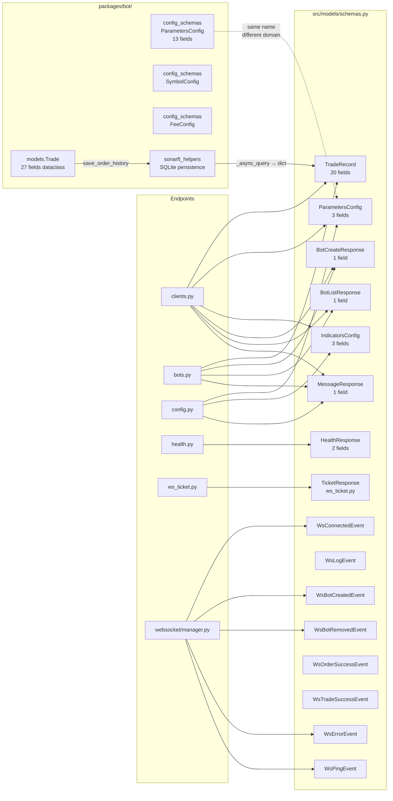

# Data Models & Validation Review

**Prompt ID:** 03-API-MODELS  
**Package:** `packages/api`  
**Reviewer:** Amazon Q (Senior Python / FastAPI / Pydantic v2)  
**Date:** July 2025  
**Status:** Complete

---

## Executive Summary

The SonarFT API defines 18 Pydantic v2 models across two files: `src/models/schemas.py` (API contract) and `packages/bot/config_schemas.py` (bot configuration). Pydantic v2 adoption is correct throughout — `@field_validator`, `@model_validator`, `ConfigDict`, and `model_dump()` are used consistently with no v1 legacy patterns. The API schemas are well-aligned with the shared TypeScript contract in `shared/types/api.ts`, with one notable gap: the `WsLogEvent` level union differs between Python (`DEBUG`–`CRITICAL`) and TypeScript (`INFO`|`WARNING`|`ERROR`). The `TradeRecord` model correctly uses `extra="ignore"` to absorb bot-side fields not exposed via the API. The main validation gaps are: `ParametersConfig` has no field-level constraints on its dict values (any boolean-keyed dict is accepted), `TradeRecord` numeric fields have no range validation, and there is no cross-field invariant enforcing that `buy_price < sell_price` for a profitable trade. The bot-side `config_schemas.ParametersConfig` is significantly richer than the API-side `ParametersConfig` — the two share a name but model different domains and should not be confused.

---

## 1. Model Inventory

### 1.1 API Models — `src/models/schemas.py`

| Model | Purpose | Used By | Field Count |
|---|---|---|---|
| `BotCreateResponse` | Bot creation response | `clients.py`, `bots.py` | 1 |
| `BotListResponse` | List of bot IDs | `clients.py`, `bots.py` | 1 |
| `BotActionRequest` | ⚠️ Unused request body | Defined but not used by any endpoint | 1 |
| `BotStatusResponse` | Bot status | Defined but not used by any endpoint | 2 |
| `TradeRecord` | Order/trade history record | `clients.py`, `bots.py` | 20 |
| `ParametersConfig` | Trading parameters (API contract) | `clients.py`, `config.py`, `config_service.py` | 3 |
| `IndicatorsConfig` | Indicator settings (API contract) | `clients.py`, `config.py`, `config_service.py` | 3 |
| `WsConnectedEvent` | WS: client connected | `websocket/manager.py` | 3 |
| `WsLogEvent` | WS: log line streamed | `websocket/manager.py` (dict, not model) | 4 |
| `WsBotCreatedEvent` | WS: bot created | `websocket/manager.py` | 3 |
| `WsBotRemovedEvent` | WS: bot removed | `websocket/manager.py` | 3 |
| `WsOrderSuccessEvent` | WS: order placed | `websocket/manager.py` (dict, not model) | 2 |
| `WsTradeSuccessEvent` | WS: trade completed | `websocket/manager.py` (dict, not model) | 2 |
| `WsErrorEvent` | WS: error message | `websocket/manager.py` | 3 |
| `WsPingEvent` | WS: keepalive ping | `websocket/manager.py` | 2 |
| `MessageResponse` | Generic mutation response | All action endpoints | 1 |
| `HealthResponse` | Health check response | `health.py` | 2 |
| `TicketResponse` | WS ticket issuance | `ws_ticket.py` (local copy) | 2 |

### 1.2 Bot Config Models — `packages/bot/config_schemas.py`

| Model | Purpose | Used By | Field Count |
|---|---|---|---|
| `ParametersConfig` | Bot trading parameters (config file) | `sonarft_bot.load_configurations()` | 13 |
| `SymbolConfig` | Trading pair definition | `sonarft_bot.load_configurations()` | 2 |
| `FeeConfig` | Exchange fee structure | `sonarft_bot.load_configurations()` | 5 |

### 1.3 Bot Domain Model — `packages/bot/models.py`

| Model | Type | Purpose | Field Count |
|---|---|---|---|
| `Trade` | `@dataclass` | In-memory trade packet passed between bot modules | 19 + 8 indicator fields |

### 1.4 Unused Models

`BotActionRequest` (`schemas.py:17`) and `BotStatusResponse` (`schemas.py:21`) are defined but never referenced by any endpoint or service. They are dead code.

---

## 2. Pydantic V2 Compliance

### 2.1 Assessment

| Feature | Usage | Verdict |
|---|---|---|
| `BaseModel` inheritance | All models | ✅ |
| `@field_validator` (v2 style) | `ParametersConfig`, `IndicatorsConfig`, `SymbolConfig` | ✅ |
| `@model_validator(mode="after")` | `config_schemas.ParametersConfig` | ✅ |
| `ConfigDict` | `TradeRecord` uses `ConfigDict(extra="ignore")` | ✅ |
| `model_dump()` | `config_service.py:95,110` | ✅ (not deprecated `.dict()`) |
| `Field(...)` with constraints | `config_schemas.py` throughout | ✅ |
| `Literal` types | `ParametersConfig.strategy`, `WsLogEvent.level`, all WS event `type` fields | ✅ |
| `pydantic-settings BaseSettings` | `core/config.py Settings` | ✅ |
| No v1 `@validator` usage | — | ✅ |
| No `orm_mode = True` (v1) | — | ✅ |
| `json_schema_extra` / examples | Not used on any model | ⚠️ Missing |

All models are fully Pydantic v2 compliant. No v1 compatibility shims (`from pydantic.v1 import ...`) are present.

### 2.2 `TicketResponse` Duplication

`ws_ticket.py:16` defines a local `TicketResponse(BaseModel)` with fields `ticket: str` and `ttl_seconds: int = 30`. The shared types file `shared/types/api.ts:68` defines `WsTicketResponse` with the same shape. However, `TicketResponse` is not imported from `schemas.py` — it is defined inline in the endpoint file. This is a minor inconsistency: all other response models live in `schemas.py`.

---

## 3. Field Validation Audit

### 3.1 `TradeRecord` — `schemas.py:30–52`

```python
class TradeRecord(BaseModel):
    model_config = ConfigDict(extra="ignore")
    timestamp: str                  # ISO 8601 — no format validation
    position: str                   # "LONG"/"SHORT" — no Literal constraint
    base: str                       # e.g. "BTC" — no length/pattern constraint
    quote: str                      # e.g. "USDT" — no length/pattern constraint
    buy_exchange: str               # no allowlist
    sell_exchange: str              # no allowlist
    buy_price: float                # no gt=0 constraint
    sell_price: float               # no gt=0 constraint
    buy_trade_amount: float         # no gt=0 constraint
    sell_trade_amount: float        # no gt=0 constraint
    executed_amount: float          # no ge=0 constraint
    buy_value: float                # no ge=0 constraint
    sell_value: float               # no ge=0 constraint
    buy_fee_rate: float             # no ge=0, le=1 constraint
    sell_fee_rate: float            # no ge=0, le=1 constraint
    buy_fee_base: float             # no ge=0 constraint
    buy_fee_quote: float            # no ge=0 constraint
    sell_fee_quote: float           # no ge=0 constraint
    profit: float                   # can be negative — correct
    profit_percentage: float        # can be negative — correct
```

`TradeRecord` is a **read-only response model** populated from SQLite. Since the data originates from the bot engine (not user input), the absence of constraints is lower risk than it would be for a request model. However, adding `gt=0` to price/amount fields would catch data corruption early and improve OpenAPI documentation.

### 3.2 `ParametersConfig` — `schemas.py:62–80`

```python
class ParametersConfig(BaseModel):
    exchanges: dict[str, bool] = Field(default_factory=dict)
    symbols: dict[str, bool] = Field(default_factory=dict)
    strategy: Literal["arbitrage", "market_making"] = "arbitrage"
```

- `strategy` is correctly constrained to a `Literal` union. ✅
- `exchanges` and `symbols` dict **keys** are validated by `_validate_config_keys` regex (`^[\w\s/(). %,:-]{1,128}$`). ✅
- Dict **values** are typed `bool` — Pydantic v2 will coerce `0`/`1`/`"true"` to `bool`. This is intentional (the frontend sends `true`/`false`). ✅
- No constraint on dict **size** — a client could submit 10,000 exchange entries. ⚠️

### 3.3 `IndicatorsConfig` — `schemas.py:83–100`

Same structure as `ParametersConfig`. Same key validation. Same missing size constraint on the three dicts (`periods`, `oscillators`, `movingaverages`).

### 3.4 `WsLogEvent` — `schemas.py:109–113`

```python
class WsLogEvent(BaseModel):
    type: Literal["log"] = "log"
    level: Literal["DEBUG", "INFO", "WARNING", "ERROR", "CRITICAL"] = "INFO"
    message: str
    ts: int
```

The Python model allows `DEBUG` and `CRITICAL` levels. The TypeScript contract (`shared/types/api.ts:88`) only declares `"INFO" | "WARNING" | "ERROR"`. This is a **cross-package type mismatch** — if the bot emits a `DEBUG` or `CRITICAL` log, the TypeScript union is violated and the frontend's type narrowing will fail silently.

### 3.5 Bot `config_schemas.ParametersConfig` — `config_schemas.py:12–44`

This is the richer, bot-side config model. Key constraints:

| Field | Constraint | Notes |
|---|---|---|
| `profit_percentage_threshold` | `gt=0, lt=1` | ✅ |
| `trade_amount` | `gt=0` | ✅ |
| `is_simulating_trade` | `Literal[0, 1]` | ✅ |
| `max_daily_loss` | `ge=0` | ✅ |
| `spread_increase_factor` | `default=1.00020` | ⚠️ No range constraint at field level — enforced by `@model_validator` only for `market_making` strategy |
| `flash_crash_threshold` | `gt=0, lt=1` | ✅ |
| `maker_buy_fee` / `maker_sell_fee` in `FeeConfig` | `default=None, ge=0` | ✅ Optional fees |

The `@model_validator(mode="after")` on `ParametersConfig` correctly enforces spread factor ranges only when `strategy == "market_making"`. This is a cross-field invariant correctly implemented at the model level.

---

## 4. Type Annotations

### 4.1 Completeness

All model fields have explicit type annotations. No bare `Any` types are used. `Optional` is expressed as `X | None` (Python 3.10+ union syntax) consistently.

### 4.2 `str | None` on WS Event botid Fields

```python
# schemas.py:103, 109
class WsBotCreatedEvent(BaseModel):
    botid: str | None = None

class WsBotRemovedEvent(BaseModel):
    botid: str | None = None
```

Both match the TypeScript contract (`api.ts:97,103`: `botid: string | null`). The nullable type is consistent across the stack but semantically weak — a successfully created bot always has a botid. See Concerns §8.1.

### 4.3 `ts: int` vs `timestamp: str`

WS event models use `ts: int` (Unix epoch). `TradeRecord` uses `timestamp: str` (ISO 8601). Both are consistent within their respective domains (real-time events vs persisted history) but require two different parsing paths on the frontend. The TypeScript contract correctly reflects both types.

### 4.4 `HealthResponse.version` Static Default

```python
class HealthResponse(BaseModel):
    status: str = "ok"
    version: str = "1.0.0"   # schemas.py:130
```

The type is correct (`str`) but the default is hardcoded rather than derived from `Settings.api_version`. This is a data integrity issue, not a type issue.

---

## 5. Request Models vs Response Models

### 5.1 Separation of Concerns

| Model | Direction | Shared? | Notes |
|---|---|---|---|
| `ParametersConfig` | Request **and** Response | ✅ Same model | Used as both PUT body and GET response — acceptable for a symmetric config resource |
| `IndicatorsConfig` | Request **and** Response | ✅ Same model | Same as above |
| `TradeRecord` | Response only | — | Never used as a request body |
| `BotCreateResponse` | Response only | — | ✅ |
| `BotListResponse` | Response only | — | ✅ |
| `MessageResponse` | Response only | — | ✅ |
| `HealthResponse` | Response only | — | ✅ |
| `TicketResponse` | Response only | — | ✅ |
| `BotActionRequest` | Request (unused) | — | ⚠️ Dead code |
| `BotStatusResponse` | Response (unused) | — | ⚠️ Dead code |
| WS event models | Server → Client | — | ✅ Clearly directional |

Using `ParametersConfig` and `IndicatorsConfig` as both request and response models is a deliberate and correct design choice here — the config resource is symmetric (you PUT what you GET back). There is no risk of accidentally exposing write-only fields in responses or accepting read-only fields in requests because the models contain no such fields.

### 5.2 Secret / Sensitive Field Exposure

No model exposes sensitive data. Exchange API keys are loaded from environment variables in `sonarft_bot._load_api_keys()` and never flow through the API layer. The `Settings` model (`core/config.py`) contains `sonarft_api_token` and `netlify_site_url` but these are never serialised into any response model.

`TradeRecord` exposes fee rates and profit figures — this is intentional trading data, not sensitive credentials.

### 5.3 `BotActionRequest` — Dead Code

`BotActionRequest` (`schemas.py:17`) defines `botid: str | None = None`. It is imported nowhere and used by no endpoint. It should be removed.

---

## 6. Nested Models

### 6.1 Nesting Depth

All API models are flat (depth 1). There are no nested Pydantic models within models. The `ParametersConfig.exchanges` and `IndicatorsConfig.periods` fields use `dict[str, bool]` — a primitive dict, not a nested model.

This is appropriate for the current data shapes. No circular references are possible.

### 6.2 `Trade` Dataclass — Bot Side

The bot-side `Trade` dataclass (`models.py:22`) has 27 fields including 8 optional indicator fields (`market_direction_buy`, `market_rsi_buy`, etc.) with `default=None`. These indicator fields are used internally by the execution layer to avoid re-fetching market data but are **not persisted** to SQLite and do not appear in `TradeRecord`. The separation is correct.

### 6.3 Shared Sub-models

There are no shared sub-models extracted for reuse. The WS event models all repeat `ts: int` and `type: Literal[...]` independently rather than inheriting from a `WsBaseEvent` base class. The TypeScript contract does define `WsBaseEvent` (`api.ts:80`) — the Python side does not mirror this hierarchy.

---

## 7. Serialization

### 7.1 JSON Serialization

All models use Pydantic v2's default JSON serialization via `model_dump()`. No custom `__json_encoder__` or `model_serializer` overrides are present.

`ConfigService.update_parameters` calls `config.model_dump()` (`config_service.py:95`) and passes the result to `_write_json`. This correctly serialises `ParametersConfig` to a plain dict before JSON encoding.

`WebSocketManager._push_model` calls `model.model_dump()` and then `json.dumps()` (`manager.py:93,270`). This is correct but bypasses `orjson` (which is listed in `requirements.txt`) — the WS send path uses the stdlib `json` module.

### 7.2 `extra="ignore"` on `TradeRecord`

```python
class TradeRecord(BaseModel):
    model_config = ConfigDict(extra="ignore")
```

This silently drops fields present in the SQLite record but absent from the schema. Fields dropped include `buy_order_id`, `sell_order_id`, `order_buy_success`, `order_sell_success`, `trade_success` (written by `save_trade_history`, `sonarft_helpers.py:195–215`). This is intentional — the API exposes a clean subset — but means the trades endpoint and orders endpoint return identical schemas even though the underlying data differs.

### 7.3 `Literal` Enum Serialization

`Literal` fields serialize to their string values by default in Pydantic v2. `WsConnectedEvent(type="connected", ...)` serialises to `{"type": "connected", ...}` correctly. No custom serialization needed.

### 7.4 `orjson` — Declared but Underused

`orjson` is in `requirements.txt` but is not used in the hot path. The WebSocket send loop (`manager.py:270`) uses `json.dumps()`. For high-frequency log streaming this is a missed performance opportunity. FastAPI itself can be configured to use `orjson` via `ORJSONResponse`.

### 7.5 Datetime Handling

`TradeRecord.timestamp` is typed `str` — no `datetime` object is used anywhere in the API layer. The ISO 8601 string is written by the bot (`sonarft_helpers.py:155`: `time.strftime("%Y-%m-%dT%H:%M:%S", t)`) and read back as a plain string. This avoids timezone ambiguity but also means no date arithmetic or validation is possible at the API layer.

---

## 8. Model Relationships Diagram



**Key relationship:** `Trade` (bot dataclass, 27 fields) → `SonarftHelpers.save_order_history` → SQLite → `SonarftHelpers._async_query` → `TradeRecord` (API model, 20 fields). The 7-field gap is intentional (`extra="ignore"`).

**Name collision:** `ParametersConfig` exists in both `packages/api/src/models/schemas.py` (3 fields, API contract) and `packages/bot/config_schemas.py` (13 fields, bot config). They model different domains and are never imported together, but the shared name is a potential source of confusion for contributors.

---

## 9. Validation Rules Completeness

### 9.1 Audit Table

| Model | Field | Current Validation | Missing Validation | Risk |
|---|---|---|---|---|
| `TradeRecord` | `buy_price`, `sell_price` | None | `gt=0` | Low (response-only) |
| `TradeRecord` | `buy_fee_rate`, `sell_fee_rate` | None | `ge=0, le=1` | Low (response-only) |
| `TradeRecord` | `position` | `str` | `Literal["LONG", "SHORT"]` | Low |
| `TradeRecord` | `timestamp` | `str` | ISO 8601 pattern or `datetime` | Low |
| `ParametersConfig` | `exchanges` dict size | None | `max_length` on dict | Low |
| `ParametersConfig` | `symbols` dict size | None | `max_length` on dict | Low |
| `IndicatorsConfig` | `periods`/`oscillators`/`movingaverages` dict size | None | `max_length` on dict | Low |
| `WsLogEvent` | `level` | `Literal["DEBUG","INFO","WARNING","ERROR","CRITICAL"]` | Align with TypeScript (`INFO\|WARNING\|ERROR`) | Medium |
| `HealthResponse` | `version` | `str = "1.0.0"` | Derive from `Settings.api_version` | Low |
| `BotActionRequest` | all | — | Remove (dead code) | Low |
| `BotStatusResponse` | all | — | Remove (dead code) | Low |

### 9.2 Dict Size Limits

`ParametersConfig.exchanges` and `ParametersConfig.symbols` accept unbounded dicts. A malicious or buggy client could submit a payload with thousands of entries, causing the `_write_json` call in `ConfigService` to write a very large file. Pydantic v2 does not natively support `max_length` on `dict` fields, but it can be enforced with a `@field_validator`:

```python
@field_validator("exchanges")
@classmethod
def limit_exchanges(cls, v: dict[str, bool]) -> dict[str, bool]:
    if len(v) > 50:
        raise ValueError("exchanges dict must not exceed 50 entries")
    return v
```

### 9.3 `TradeRecord.position` Literal

The bot writes `"LONG"` or `"SHORT"` to the `position` field (`sonarft_execution.py` — trade position determination). Constraining the API model to `Literal["LONG", "SHORT"]` would make the contract explicit and catch any future bot-side changes that introduce new position types.

---

## 10. Data Integrity

### 10.1 Cross-Field Invariants

| Invariant | Enforced? | Location |
|---|---|---|
| `sell_price > buy_price` for a profitable trade | ❌ Not in API model | Would require `@model_validator` on `TradeRecord` |
| `profit = sell_value - buy_value - fees` | ❌ Not validated | Computed by `SonarftMath.calculate_trade` |
| `strategy` in `ParametersConfig` matches bot's loaded strategy | ❌ Not validated | Config file and API are independent |
| `spread_increase_factor > 1.0` when `strategy == "market_making"` | ✅ Bot-side only | `config_schemas.ParametersConfig @model_validator` |

The API-side `ParametersConfig` does not enforce the spread factor invariant — it only validates key names. If a client PUTs `{"strategy": "market_making", "exchanges": {...}}` the API accepts it without checking spread factors. The bot applies the constraint at load time via `config_schemas.ParametersConfig`, so the invariant is eventually enforced, but not at the API boundary.

### 10.2 `Trade` Dataclass Integrity

The bot-side `Trade` dataclass (`models.py:22`) uses `@dataclass` without `frozen=True`. Fields are mutable after construction. The indicator fields (`market_direction_buy`, etc.) default to `None` and are set post-construction by the price adjustment layer. This is intentional but means a `Trade` object can be in a partially-initialised state. No API-layer impact since `Trade` never crosses the API boundary.

### 10.3 `FeeConfig` Optional Maker Fees

```python
class FeeConfig(BaseModel):
    maker_buy_fee: float = Field(default=None, ge=0)
    maker_sell_fee: float = Field(default=None, ge=0)
```

`default=None` with `ge=0` is a type annotation inconsistency — `ge=0` implies `float` but `None` is the default. Pydantic v2 will accept `None` here because the field type is inferred as `float | None` from the default, but the `ge=0` constraint only applies when the value is not `None`. This is functionally correct but the type annotation should be explicit: `maker_buy_fee: float | None = Field(default=None, ge=0)`.

---

## 11. Concerns & Recommendations

### 11.1 Concerns

| # | Concern | Severity | Location |
|---|---|---|---|
| 8.1 | **`WsLogEvent.level` mismatch with TypeScript** — Python allows `DEBUG`/`CRITICAL`; TypeScript only declares `INFO\|WARNING\|ERROR`. Frontend type narrowing silently fails for `DEBUG` and `CRITICAL` log lines. | Medium | `schemas.py:111`, `shared/types/api.ts:88` |
| 8.2 | **`ParametersConfig` name collision** — API `ParametersConfig` (3 fields) and bot `config_schemas.ParametersConfig` (13 fields) share a name but model different domains. Contributors importing from the wrong module will get silent type errors. | Medium | `schemas.py:62`, `config_schemas.py:12` |
| 8.3 | **No dict size limits on `ParametersConfig`/`IndicatorsConfig`** — unbounded dict payloads accepted, enabling large file writes. | Low | `schemas.py:63–65`, `schemas.py:84–86` |
| 8.4 | **`BotActionRequest` and `BotStatusResponse` are dead code** — defined but never used. They add noise and may mislead contributors. | Low | `schemas.py:17–23` |
| 8.5 | **`TicketResponse` defined in `ws_ticket.py` instead of `schemas.py`** — breaks the convention that all response models live in `schemas.py`. | Low | `ws_ticket.py:16` |
| 8.6 | **`TradeRecord` numeric fields have no constraints** — prices, amounts, and fee rates are unconstrained `float`. Acceptable for a response model but weakens OpenAPI documentation. | Low | `schemas.py:38–51` |
| 8.7 | **`orjson` declared in requirements but not used in hot path** — WS send loop uses stdlib `json.dumps()`. | Low | `requirements.txt`, `manager.py:270` |
| 8.8 | **No `WsBaseEvent` base class in Python** — TypeScript defines `WsBaseEvent` with `type` and `ts`; Python repeats these fields on every event model independently. | Low | `schemas.py:103–130`, `api.ts:80` |
| 8.9 | **`FeeConfig` maker fee fields lack explicit `float \| None` annotation** — `default=None` with `ge=0` implies nullable float but the type is not declared explicitly. | Low | `config_schemas.py:50–51` |

---

### 11.2 Recommendations (Prioritised)

#### P1 — Quick wins

**R1: Align `WsLogEvent.level` with the TypeScript contract**

Either restrict Python to match TypeScript:
```python
# schemas.py:111
level: Literal["INFO", "WARNING", "ERROR"] = "INFO"
```
Or expand TypeScript to match Python (preferred — preserves DEBUG visibility):
```typescript
// shared/types/api.ts:88
level: "DEBUG" | "INFO" | "WARNING" | "ERROR" | "CRITICAL";
```
Update both files atomically to keep the contract in sync.

**R2: Remove dead code models**

```python
# schemas.py — delete these two models entirely
class BotActionRequest(BaseModel): ...   # line 17
class BotStatusResponse(BaseModel): ...  # line 21
```

**R3: Move `TicketResponse` to `schemas.py`**

```python
# schemas.py — add alongside other response models
class WsTicketResponse(BaseModel):
    ticket: str
    ttl_seconds: int = 30

# ws_ticket.py — replace local definition with import
from ..models.schemas import WsTicketResponse
```

This also aligns the Python name with the TypeScript `WsTicketResponse`.

**R4: Fix `FeeConfig` nullable field annotation**

```python
# config_schemas.py:50–51
maker_buy_fee: float | None = Field(default=None, ge=0)
maker_sell_fee: float | None = Field(default=None, ge=0)
```

---

#### P2 — Medium effort

**R5: Add dict size limits to config models**

```python
# schemas.py
@field_validator("exchanges")
@classmethod
def limit_exchanges(cls, v: dict[str, bool]) -> dict[str, bool]:
    _validate_config_keys(v, "exchanges")
    if len(v) > 50:
        raise ValueError("exchanges must not exceed 50 entries")
    return v
```
Apply the same pattern to `symbols`, `periods`, `oscillators`, and `movingaverages`.

**R6: Add `Literal` constraint to `TradeRecord.position`**

```python
# schemas.py
position: Literal["LONG", "SHORT"]
```

**R7: Introduce a `WsBaseEvent` base class**

```python
# schemas.py
class WsBaseEvent(BaseModel):
    ts: int

class WsConnectedEvent(WsBaseEvent):
    type: Literal["connected"] = "connected"
    client_id: str

class WsBotCreatedEvent(WsBaseEvent):
    type: Literal["bot_created"] = "bot_created"
    botid: str
```

This mirrors the TypeScript hierarchy and reduces field repetition across 8 event models.

---

#### P3 — Longer term

**R8: Rename one of the two `ParametersConfig` classes**

Rename the API-side model to `TradingParametersConfig` or `ClientParametersConfig` to eliminate the name collision with the bot-side `config_schemas.ParametersConfig`. Update all import sites and the TypeScript contract accordingly.

**R9: Use `orjson` in the WebSocket send loop**

```python
# manager.py — replace
import orjson

await websocket.send_text(orjson.dumps(event).decode())
```

For high-frequency log streaming (60+ messages/second), `orjson` is 3–5× faster than stdlib `json` for dict serialization.

**R10: Add `@model_validator` to API `ParametersConfig` for spread factor invariant**

```python
# schemas.py
from pydantic import model_validator

class ParametersConfig(BaseModel):
    exchanges: dict[str, bool] = Field(default_factory=dict)
    symbols: dict[str, bool] = Field(default_factory=dict)
    strategy: Literal["arbitrage", "market_making"] = "arbitrage"
    spread_increase_factor: float | None = None
    spread_decrease_factor: float | None = None

    @model_validator(mode="after")
    def validate_spread_for_market_making(self) -> "ParametersConfig":
        if self.strategy == "market_making":
            if self.spread_increase_factor is not None:
                if not (1.0 < self.spread_increase_factor < 1.01):
                    raise ValueError("spread_increase_factor must be between 1.0 and 1.01")
        return self
```

This enforces the invariant at the API boundary, not just at bot load time.

---

## Related Prompts

- [Prompt 01: Architecture Structure](../architecture/01-api-architecture.md) — Module organisation
- [Prompt 02: API Endpoints Design](../endpoints/02-api-endpoints-design.md) — How models are used
- [Prompt 04: Authentication & Security](../security/04-authentication-security.md) — Sensitive field handling
- [Prompt 10: Code Quality Python](../code-quality/10-code-quality-python.md) — Code organisation

---

_Part of the SonarFT API Code Review Prompt Suite — Prompt 03_
