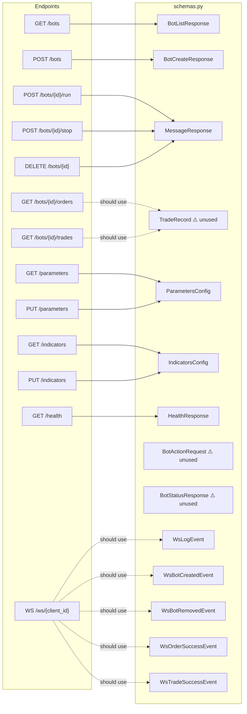

# Prompt 03 — Data Models & Validation Review

**Generated:** July 2025  
**Reviewer:** Amazon Q (Senior Python / Pydantic v2 / Data Integrity)  
**Source files inspected:**
- `packages/api/src/models/schemas.py`
- `packages/api/src/api/v1/endpoints/` (all three routers)
- `packages/api/src/services/bot_service.py`, `config_service.py`
- `packages/bot/models.py` (cross-package alignment)
- `shared/types/api.ts` (TypeScript contract — source of truth)

**Output location:** `docs/models/03-data-models-validation.md`

---

## Executive Summary

The SonarFT API defines 14 Pydantic v2 models in a single flat file (`schemas.py`) covering bot lifecycle, trade history, configuration, WebSocket events, and generic responses. The models are clean, correctly use `BaseModel`, and are free of v1 legacy patterns. However, four significant gaps exist: `TradeRecord` is defined but never used as a `response_model` on any endpoint; `ParametersConfig` and `IndicatorsConfig` use `dict[str, bool]` fields with no field-level validation, meaning any key/value structure is accepted; the `Trade` dataclass in `packages/bot/models.py` has 10 additional fields not present in `TradeRecord` (fee breakdown, indicator snapshots), creating a silent data loss path when bot history is serialized to the API response; and the shared TypeScript contract in `shared/types/api.ts` is manually maintained with no automated sync mechanism, making drift inevitable.

---

## Model Inventory

| Model | Purpose | Used By (endpoints) | Used By (services) | Field Count |
|---|---|---|---|---|
| `BotCreateResponse` | Response: newly created bot ID | `POST /bots` | — | 1 |
| `BotListResponse` | Response: list of bot IDs for a client | `GET /bots` | — | 1 |
| `BotActionRequest` | ⚠️ Unused — no endpoint accepts this as a body | — | — | 1 |
| `BotStatusResponse` | ⚠️ Unused — no endpoint returns this | — | — | 2 |
| `TradeRecord` | Response: single trade/order history entry | ❌ Not wired to any endpoint | — | 13 |
| `ParametersConfig` | Request + Response: trading parameters | `GET/PUT /parameters`, `GET /parameters/defaults` | `ConfigService` | 2 |
| `IndicatorsConfig` | Request + Response: indicator settings | `GET/PUT /indicators`, `GET /indicators/defaults` | `ConfigService` | 3 |
| `WsLogEvent` | WebSocket event: log message | `websocket/manager.py` (implicit) | — | 4 |
| `WsBotCreatedEvent` | WebSocket event: bot created | `websocket/manager.py` (implicit) | — | 3 |
| `WsBotRemovedEvent` | WebSocket event: bot removed | `websocket/manager.py` (implicit) | — | 3 |
| `WsOrderSuccessEvent` | WebSocket event: order placed | `websocket/manager.py` (implicit) | — | 2 |
| `WsTradeSuccessEvent` | WebSocket event: trade completed | `websocket/manager.py` (implicit) | — | 2 |
| `MessageResponse` | Generic success message | `POST /run`, `POST /stop`, `DELETE`, `PUT /parameters`, `PUT /indicators` | — | 1 |
| `HealthResponse` | Health check response | `GET /health` | — | 2 |

**Summary:** 14 models defined, 2 are completely unused (`BotActionRequest`, `BotStatusResponse`), 1 is defined but not wired (`TradeRecord`), and 5 WebSocket event models are defined but the WebSocket manager sends raw `dict` objects rather than using them.

---

## Model Relationships Diagram



---

## 1. Pydantic V2 Compliance

| Check | Status | Notes |
|---|---|---|
| `BaseModel` inheritance | ✅ All models use `BaseModel` | No v1 `class Config` patterns |
| `@field_validator` usage | ✅ N/A — no custom validators defined | No v1 `@validator` present |
| `model_dump()` usage | ✅ `config_service.py` calls `config.model_dump()` | Correct v2 API |
| `ConfigDict` | ⚠️ Not used | No `model_config = ConfigDict(...)` on any model |
| `Field()` with metadata | ⚠️ Minimal — only `Field(default_factory=dict)` on config models | No `description`, `examples`, `ge`, `le`, `pattern` constraints |
| `model_validator` | ❌ Not used | No cross-field validation |
| JSON schema examples | ❌ Not configured | OpenAPI examples are auto-generated only |
| Aliases | ❌ Not used | All field names are direct Python identifiers |

---

## 2. Field-by-Field Validation Audit

### `BotCreateResponse` / `BotListResponse`

```python
class BotCreateResponse(BaseModel):
    botid: str                    # ⚠️ No pattern constraint — any string accepted

class BotListResponse(BaseModel):
    botids: list[str]             # ⚠️ No item-level pattern constraint
```

`botid` is validated with `Path(pattern=r"^[a-zA-Z0-9_-]{1,64}$")` at the endpoint level but the response model itself imposes no constraint. A bot ID generated by the bot engine that violates the pattern would pass through silently.

---

### `TradeRecord`

```python
class TradeRecord(BaseModel):
    timestamp: str                # ⚠️ Free-form string — no datetime type or format constraint
    position: str                 # ⚠️ Should be Literal["LONG", "SHORT"] or an Enum
    base: str                     # ⚠️ No length/pattern constraint
    quote: str                    # ⚠️ No length/pattern constraint
    buy_trade_amount: float       # ⚠️ No gt=0 constraint — negative amounts accepted
    buy_exchange: str             # ⚠️ No constraint
    buy_price: float              # ⚠️ No gt=0 constraint
    buy_value: float              # ⚠️ No constraint
    sell_exchange: str            # ⚠️ No constraint
    sell_price: float             # ⚠️ No gt=0 constraint
    sell_value: float             # ⚠️ No constraint
    profit: float                 # ✅ Can be negative (loss) — correct
    profit_percentage: float      # ✅ Can be negative — correct
```

**Cross-package field gap vs `Trade` dataclass in `packages/bot/models.py`:**

| Field | `Trade` (bot) | `TradeRecord` (API) | Gap |
|---|---|---|---|
| `timestamp` | ❌ Not present | ✅ Present | Added by `save_order_history` |
| `position` | ✅ | ✅ | ✅ Aligned |
| `base` | ✅ | ✅ | ✅ Aligned |
| `quote` | ✅ | ✅ | ✅ Aligned |
| `buy_trade_amount` | ✅ | ✅ | ✅ Aligned |
| `sell_trade_amount` | ✅ | ❌ Not in TradeRecord | ⚠️ Missing |
| `executed_amount` | ✅ | ❌ Not in TradeRecord | ⚠️ Missing |
| `buy_value` | ✅ | ✅ | ✅ Aligned |
| `sell_value` | ✅ | ✅ | ✅ Aligned |
| `buy_fee_rate` | ✅ | ❌ Not in TradeRecord | ⚠️ Missing |
| `sell_fee_rate` | ✅ | ❌ Not in TradeRecord | ⚠️ Missing |
| `buy_fee_base` | ✅ | ❌ Not in TradeRecord | ⚠️ Missing |
| `buy_fee_quote` | ✅ | ❌ Not in TradeRecord | ⚠️ Missing |
| `sell_fee_quote` | ✅ | ❌ Not in TradeRecord | ⚠️ Missing |
| `market_direction_buy` | ✅ | ❌ Not in TradeRecord | ℹ️ Internal — intentionally excluded |
| `market_rsi_buy` | ✅ | ❌ Not in TradeRecord | ℹ️ Internal — intentionally excluded |
| `profit` | ✅ | ✅ | ✅ Aligned |
| `profit_percentage` | ✅ | ✅ | ✅ Aligned |

5 financially significant fields (`sell_trade_amount`, `executed_amount`, `buy_fee_rate`, `sell_fee_rate`, `buy_fee_base`, `buy_fee_quote`, `sell_fee_quote`) are persisted to SQLite by `save_order_history` but absent from `TradeRecord`. When the API eventually wires `TradeRecord` as a response model, these fields will be silently dropped.

---

### `ParametersConfig` / `IndicatorsConfig`

```python
class ParametersConfig(BaseModel):
    exchanges: dict[str, bool] = Field(default_factory=dict)   # ⚠️ Any key accepted
    symbols: dict[str, bool] = Field(default_factory=dict)     # ⚠️ Any key accepted

class IndicatorsConfig(BaseModel):
    periods: dict[str, bool] = Field(default_factory=dict)
    oscillators: dict[str, bool] = Field(default_factory=dict)
    movingaverages: dict[str, bool] = Field(default_factory=dict)
```

These models accept any arbitrary key-value pairs. A `PUT /parameters` request with `{"exchanges": {"__proto__": true}}` or `{"exchanges": {"../../../../etc/passwd": true}}` would pass Pydantic validation and be written to disk by `ConfigService`. The keys are never validated against the known exchange/symbol lists in `sonarftdata/config_exchanges.json` and `sonarftdata/config_symbols.json`.

---

### WebSocket Event Models

```python
class WsLogEvent(BaseModel):
    type: str = "log"             # ⚠️ Should be Literal["log"]
    level: str = "INFO"           # ⚠️ Should be Literal["INFO", "WARNING", "ERROR"]
    message: str
    ts: int

class WsBotCreatedEvent(BaseModel):
    type: str = "bot_created"     # ⚠️ Should be Literal["bot_created"]
    botid: Optional[str] = None
    ts: int
```

All WebSocket event models use `type: str` with a default value instead of `Literal[...]`. This means the discriminator field provides no type safety — any string is accepted. More critically, the `WebSocketManager` in `manager.py` sends raw `dict` objects directly (`json.dumps(event)`) and never instantiates these models, so they provide zero runtime validation.

---

### `BotActionRequest` and `BotStatusResponse` — Unused Models

```python
class BotActionRequest(BaseModel):
    botid: Optional[str] = None   # ❌ No endpoint uses this as a request body

class BotStatusResponse(BaseModel):
    botid: str
    status: str                   # ❌ No endpoint returns this
```

`BotStatusResponse` would be the correct return type for `POST /bots/{botid}/run` and `POST /bots/{botid}/stop` — returning the new bot status after the action. Currently these endpoints return `MessageResponse` (a plain string), which is less informative.

---

## 3. Cross-Package Alignment: API vs Shared TypeScript Types

`shared/types/api.ts` is declared as the "single source of truth for the API contract." Comparing it against `schemas.py`:

| TypeScript type | Python equivalent | Alignment |
|---|---|---|
| `TradeRecord` | `TradeRecord` | ⚠️ TS has 13 fields, Python has 13 — aligned on surface, but Python `TradeRecord` is never used as a response model |
| `ParametersConfig` | `ParametersConfig` | ✅ Field names match |
| `IndicatorsConfig` | `IndicatorsConfig` | ✅ Field names match |
| `BotListResponse` | `BotListResponse` | ✅ Aligned |
| `BotCreateResponse` | `BotCreateResponse` | ✅ Aligned |
| `MessageResponse` | `MessageResponse` | ✅ Aligned |
| `HealthResponse` | `HealthResponse` | ✅ Aligned |
| `WsConnectedEvent` | ❌ Not in schemas.py | ⚠️ Missing Python model — sent as raw dict in `manager.py` |
| `WsErrorEvent` | ❌ Not in schemas.py | ⚠️ Missing Python model — sent as raw dict in `manager.py` |
| `WsPingEvent` | ❌ Not in schemas.py | ⚠️ Missing Python model — sent as raw dict in `manager.py` |
| `WsCommand` (union) | ❌ Not in schemas.py | ⚠️ No Python model for inbound WS commands |

The TypeScript file defines `WsConnectedEvent`, `WsErrorEvent`, `WsPingEvent`, and the full `WsCommand` union — none of which have Python counterparts in `schemas.py`. The WebSocket manager sends these as raw dicts, meaning there is no Python-side validation that the emitted events conform to the TypeScript contract.

There is also no automated mechanism (e.g. `datamodel-code-generator`, `pydantic-to-typescript`, or a CI check) to detect drift between `api.ts` and `schemas.py`. The comment "Any change here must be reflected in packages/api/src/models/schemas.py" is a manual convention with no enforcement.

---

## 4. Serialization Analysis

| Aspect | Status | Notes |
|---|---|---|
| `datetime` fields | ⚠️ `timestamp` is `str` in `TradeRecord` | No `datetime` type — format is `"%m-%d-%Y %H:%M:%S"` set in `sonarft_helpers.py`, not enforced by the model |
| Enum serialization | ❌ No enums defined | `position`, `level`, `status`, `type` fields are all plain `str` |
| Sensitive field exclusion | ✅ No secrets in any response model | Auth tokens never appear in schemas |
| `model_dump()` usage | ✅ Used correctly in `config_service.py` | `config.model_dump()` for JSON write |
| `orjson` | ✅ Listed in `requirements.txt` | FastAPI will use it for faster serialization if installed |
| Float precision | ⚠️ `float` used for all financial values | No `Decimal` type — rounding behavior depends on Python float arithmetic |

---

## 5. Issues Summary

| # | Issue | Severity | Location |
|---|---|---|---|
| 1 | `ParametersConfig` / `IndicatorsConfig` accept arbitrary dict keys — no validation against known exchanges/symbols | **High** | `schemas.py:42-50` |
| 2 | `TradeRecord` missing 5 fee fields present in bot's `Trade` dataclass — silent data loss when wired | **High** | `schemas.py:27-40`, `bot/models.py:9-28` |
| 3 | `TradeRecord` never used as `response_model` — orders/trades endpoints return untyped `list` | **High** | `bots.py:71,80` (from Prompt 02) |
| 4 | WebSocket event models use `type: str` instead of `Literal[...]` — no discriminator type safety | **Medium** | `schemas.py:55-80` |
| 5 | WebSocket manager sends raw `dict` — event models provide zero runtime validation | **Medium** | `websocket/manager.py` |
| 6 | `WsConnectedEvent`, `WsErrorEvent`, `WsPingEvent`, `WsCommand` exist in TypeScript but have no Python model | **Medium** | `shared/types/api.ts`, `schemas.py` (missing) |
| 7 | No automated sync between `shared/types/api.ts` and `schemas.py` — drift is inevitable | **Medium** | `shared/types/api.ts` |
| 8 | `BotActionRequest` and `BotStatusResponse` are defined but unused | **Low** | `schemas.py:16-19` |
| 9 | `timestamp` in `TradeRecord` is `str` — no `datetime` type or format validation | **Low** | `schemas.py:28` |
| 10 | `position` field should be `Literal["LONG", "SHORT"]` — currently unconstrained `str` | **Low** | `schemas.py:29` |
| 11 | Financial float fields (`buy_price`, `sell_price`, `buy_trade_amount`) have no `gt=0` constraint | **Low** | `schemas.py:32-38` |
| 12 | No `Field(description=...)` on any field — OpenAPI parameter docs are blank | **Low** | `schemas.py` throughout |

---

## 6. Recommendations

### Priority 1 — High impact

**1. Expand `TradeRecord` to include fee fields**

```python
class TradeRecord(BaseModel):
    timestamp: str
    position: Literal["LONG", "SHORT"]
    base: str
    quote: str
    buy_exchange: str
    sell_exchange: str
    buy_price: float = Field(gt=0)
    sell_price: float = Field(gt=0)
    buy_trade_amount: float = Field(gt=0)
    sell_trade_amount: float
    executed_amount: float
    buy_value: float
    sell_value: float
    buy_fee_rate: float
    sell_fee_rate: float
    buy_fee_base: float
    buy_fee_quote: float
    sell_fee_quote: float
    profit: float
    profit_percentage: float
```

**2. Add key validation to `ParametersConfig` and `IndicatorsConfig`**

The simplest approach is a `model_validator` that checks keys against a known allowlist loaded from the config files. A lighter alternative is to use `Annotated` with a custom type:

```python
from pydantic import model_validator

class ParametersConfig(BaseModel):
    exchanges: dict[str, bool] = Field(default_factory=dict)
    symbols: dict[str, bool] = Field(default_factory=dict)

    @model_validator(mode="after")
    def validate_keys(self) -> "ParametersConfig":
        _VALID_KEY = re.compile(r"^[a-zA-Z0-9_/-]{1,64}$")
        for field_name, mapping in [("exchanges", self.exchanges), ("symbols", self.symbols)]:
            for key in mapping:
                if not _VALID_KEY.match(key):
                    raise ValueError(f"Invalid key in {field_name}: {key!r}")
        return self
```

### Priority 2 — Medium impact

**3. Use `Literal` types for discriminator fields**

```python
from typing import Literal

class WsLogEvent(BaseModel):
    type: Literal["log"] = "log"
    level: Literal["INFO", "WARNING", "ERROR"] = "INFO"
    message: str
    ts: int
```

**4. Use event models in `WebSocketManager`**

```python
# Instead of raw dict in manager.py:
await queue.put_nowait({"type": "connected", "client_id": client_id, "ts": int(time.time())})

# Use the model:
from ..models.schemas import WsConnectedEvent
event = WsConnectedEvent(client_id=client_id, ts=int(time.time()))
await queue.put_nowait(event.model_dump())
```

This ensures every emitted event is validated against the schema before being sent.

**5. Add missing Python models for TypeScript-only types**

```python
class WsConnectedEvent(BaseModel):
    type: Literal["connected"] = "connected"
    client_id: str
    ts: int

class WsErrorEvent(BaseModel):
    type: Literal["error"] = "error"
    message: str
    ts: int

class WsPingEvent(BaseModel):
    type: Literal["ping"] = "ping"
    ts: int
```

### Priority 3 — Low impact

**6. Remove unused models or promote them**

- Delete `BotActionRequest` (no endpoint uses it)
- Wire `BotStatusResponse` as the return type for `POST /bots/{botid}/run` and `POST /bots/{botid}/stop` — returning `{"botid": "...", "status": "running"}` is more useful than `{"message": "Bot abc started."}`

**7. Add `Field(description=...)` to all public models**

```python
class TradeRecord(BaseModel):
    timestamp: str = Field(description="Trade execution time (MM-DD-YYYY HH:MM:SS)")
    position: Literal["LONG", "SHORT"] = Field(description="Trade direction")
    profit: float = Field(description="Net profit in quote currency after fees")
```

This populates the OpenAPI schema with human-readable descriptions, improving the interactive docs at `/api/v1/docs`.

---

_Part of the SonarFT API Code Review Prompt Suite — Prompt 03_  
_Previous: [Prompt 02 — API Endpoints Design](../endpoints/02-api-endpoints-design.md)_  
_Next: [Prompt 04 — Authentication & Security](../prompts/04-authentication-security.md)_
