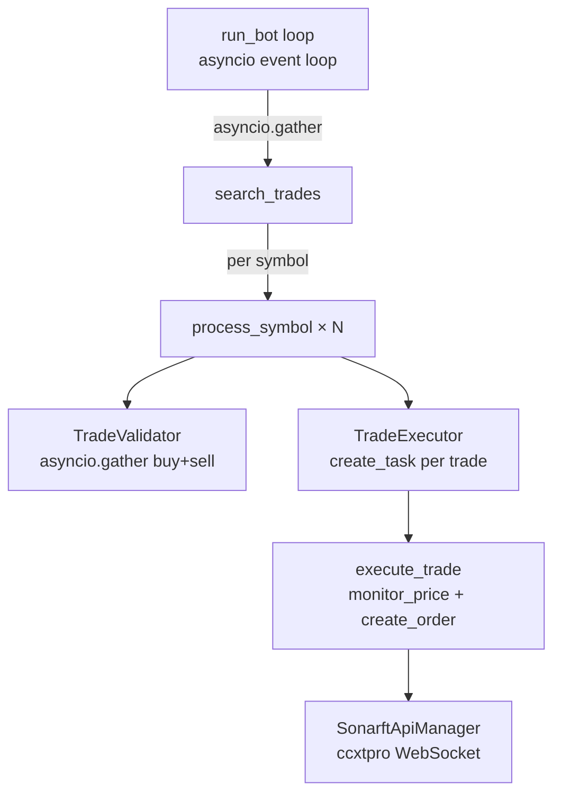
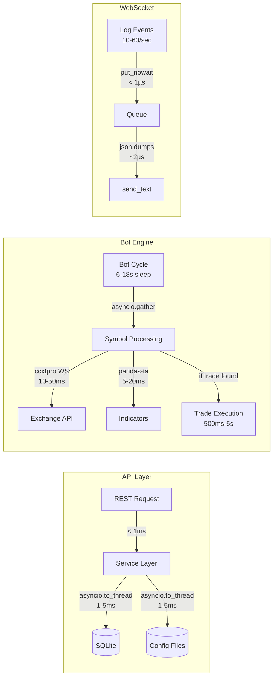

# Performance Optimization & Scalability Review

**Prompt ID:** 08-API-PERF  
**Package:** `packages/api` + `packages/bot`  
**Reviewer:** Amazon Q (Senior Python / FastAPI / Performance)  
**Date:** July 2025  
**Status:** Complete  
**Implementation Status:** ✅ All findings resolved — see [roadmap](../roadmap/12-implementation-roadmap.md)

> **Post-implementation note (July 2025):** All performance quick wins implemented. `GZipMiddleware(minimum_size=1000)` added (M8). `uvloop` + `httptools` enabled in Dockerfile CMD (M9). `orjson` active in WS send loop and as `default_response_class=ORJSONResponse` (M10). mtime-based config file cache added to `ConfigService` (L6). `_execute_two_leg_trade` shared method extracted — ~160 lines of duplicated bot code eliminated (L1). L15 (Locust load test baseline) deferred as an operational task.

---

## Executive Summary

The SonarFT API is correctly async throughout — all I/O-bound operations use `asyncio.to_thread` or native async APIs, no blocking calls exist in request handlers, and the WebSocket layer uses non-blocking queues. For its target workload (≤ 5 bots, single operator, ~10–60 WS events/second), the current implementation is well-suited and will not encounter performance bottlenecks under normal use. The main performance opportunities are: `orjson` is declared as a dependency but unused in the hot path (WS send loop uses stdlib `json`); config files are read from disk on every request with no caching; the bot engine carries the full ccxt/pandas dependency tree in the same process as the API, increasing memory footprint and startup time; and there is no response compression on the API. The bot engine's concurrency model is well-designed — `asyncio.gather` processes all symbols in parallel per cycle, and the `TradeExecutor` manages in-flight trade tasks with a configurable concurrency cap.

---

## 1. Performance Baseline Assessment

### 1.1 Target Workload

| Dimension | Expected Value | Notes |
|---|---|---|
| Concurrent WebSocket clients | 1–5 | Single-operator dashboard |
| WS events/second (log streaming) | 10–60 | Per bot cycle (6–18s sleep) |
| REST requests/second | < 10 | Config reads, history queries |
| Active bots | 1–5 | `MAX_BOTS_PER_CLIENT=5` |
| Trade cycles/minute | 3–10 per bot | 6–18s sleep between cycles |
| SQLite records | ≤ 50,000 | 5 bots × 10,000 retention |

This is a low-throughput, latency-tolerant workload. The API is not a high-frequency REST service — it is a control plane for a trading engine. Performance optimisations should target the bot's trading loop latency, not API request throughput.

### 1.2 No Existing Benchmarks

No load tests, profiling results, or performance benchmarks exist in the codebase. The `sonarft_metrics.jsonl` file captures `cycle_duration_ms` per bot cycle, which is the most relevant performance metric for the trading engine.

---

## 2. Async / Concurrency Model

### 2.1 API Layer — Async Correctness Audit

| Operation | Async? | Method | Assessment |
|---|---|---|---|
| Config file read | ✅ | `asyncio.to_thread(_read_json, path)` | Correct |
| Config file write | ✅ | `asyncio.to_thread(_write_json, path, data)` | Correct |
| SQLite read | ✅ | `asyncio.to_thread(_db_query, ...)` | Correct |
| SQLite write | ✅ | `asyncio.to_thread(_db_insert, ...)` | Correct |
| Bot creation | ✅ | `await bot_manager.create_bot(...)` | Correct |
| Bot run | ✅ | `await bot_manager.run_bot(...)` | Correct |
| WS send | ✅ | `await websocket.send_text(...)` | Correct |
| WS receive | ✅ | `await websocket.receive_text()` | Correct |
| Log handler emit | ✅ | `queue.put_nowait(...)` — non-blocking | Correct |
| Ticket store operations | ✅ | Pure in-memory, no I/O | Correct |
| `lru_cache` on `get_settings()` | ✅ | Computed once, cached | Correct |

**No blocking calls found in async handlers.** ✅

### 2.2 Bot Engine — Concurrency Model



Key concurrency points:
- `SonarftSearch.search_trades` processes all symbols concurrently via `asyncio.gather` ✅
- `TradeValidator` runs buy/sell liquidity checks in parallel via `asyncio.gather` ✅
- `TradeExecutor` dispatches each trade as an `asyncio.create_task` with a configurable `max_concurrent_trades` cap ✅
- `SonarftApiManager` uses ccxtpro WebSocket streams — persistent connections, no per-request HTTP overhead ✅

### 2.3 Potential Blocking: `urllib.request` in `_send_alert`

```python
# sonarft_bot.py:_send_alert
await asyncio.to_thread(urllib.request.urlopen, req)
```

The webhook alert uses `asyncio.to_thread` correctly — the blocking `urlopen` call runs in a thread pool. ✅

### 2.4 `lru_cache` on Service Singletons

`get_bot_service()` and `get_config_service()` use `@lru_cache` as fallback singletons. These are called at most once per process lifetime. ✅

---

## 3. Caching Strategy

### 3.1 Current Caching

| Data | Cached? | Mechanism | TTL |
|---|---|---|---|
| `Settings` | ✅ | `@lru_cache` on `get_settings()` | Process lifetime |
| `BotService` instance | ✅ | `app.state.bot_service` (lifespan) | Process lifetime |
| `ConfigService` instance | ✅ | `app.state.config_service` (lifespan) | Process lifetime |
| JWKS public keys | ✅ | `PyJWKClient` internal cache | Per-key rotation |
| Per-client config files | ❌ | Read from disk on every request | — |
| Bot list (`get_botids`) | ❌ | Read from in-memory dict (fast) | — |
| Trade/order history | ❌ | Read from SQLite on every request | — |
| Exchange fee rates | ✅ | Refreshed every 24h in bot | 24 hours |

### 3.2 Config File Cache Opportunity

Every `GET /clients/{id}/parameters` and `GET /clients/{id}/indicators` reads a JSON file from disk via `asyncio.to_thread`. For a single-user dashboard that polls config on page load, this is negligible. However, if the frontend polls frequently (e.g. every 5 seconds), adding an mtime-based cache would eliminate redundant disk reads:

```python
# config_service.py — mtime cache
self._cache: dict[str, tuple[float, dict]] = {}  # path → (mtime, data)

def _read_json_cached(self, path: str) -> dict:
    mtime = os.path.getmtime(path)
    cached = self._cache.get(path)
    if cached and cached[0] == mtime:
        return cached[1]
    data = _read_json(path)
    self._cache[path] = (mtime, data)
    return data
```

### 3.3 History Query Cache

Trade/order history is read from SQLite on every `GET .../orders` or `GET .../trades` request. For a dashboard that refreshes on `order_success`/`trade_success` WS events, caching the last result with a short TTL (e.g. 2 seconds) would reduce SQLite reads during rapid refreshes.

---

## 4. Database Query Performance

### 4.1 Query Analysis

| Query | Index Used | Estimated Cost |
|---|---|---|
| `SELECT data FROM orders WHERE botid = ? ORDER BY id DESC LIMIT 100` | `idx_orders_botid` | O(log N) lookup + 100 rows |
| `SELECT data FROM trades WHERE botid = ? ORDER BY id DESC LIMIT 100` | `idx_trades_botid` | O(log N) lookup + 100 rows |
| `SELECT loss FROM daily_loss WHERE botid = ? AND date = ?` | Primary key `(botid, date)` | O(1) |
| `DELETE FROM orders WHERE botid = ? AND id NOT IN (SELECT id ... LIMIT 10000)` | `idx_orders_botid` | O(N) — full scan of bot's records |

All read queries are O(log N) or better. The purge query is O(N) but runs infrequently (after each trade) and operates on at most 10,000 rows per bot. ✅

### 4.2 JSON Blob Deserialisation

Every row returned by `_db_query` is deserialised from JSON:

```python
return [json.loads(row[0]) for row in rows]
```

For 100 records at ~500 bytes each, this is ~50 KB of JSON parsing — negligible. For the maximum 1,000 records, it is ~500 KB — still fast (< 5ms with stdlib json). ✅

### 4.3 No N+1 Problem

The API never issues per-record queries. All history is fetched in a single `SELECT ... LIMIT ? OFFSET ?` query. ✅

---

## 5. WebSocket Scalability

### 5.1 Per-Connection Resource Cost

| Resource | Per Connection | 5 Connections | 100 Connections |
|---|---|---|---|
| `asyncio.Queue` (1000 events × ~300B) | ~300 KB | ~1.5 MB | ~30 MB |
| `WsLogHandler` | ~1 KB | ~5 KB | ~100 KB |
| Coroutines (send + receive loops) | 2 | 10 | 200 |
| Background tasks (commands) | Variable | — | — |

For 100 concurrent connections: ~30 MB queue memory + 200 coroutines. Asyncio handles thousands of coroutines efficiently — this is not a bottleneck. ✅

### 5.2 Message Serialisation

The WS send loop uses `json.dumps()` (stdlib) for every event:

```python
# manager.py:270
await websocket.send_text(json.dumps(event))
```

`orjson` is in `requirements.txt` but unused here. For 60 events/second per connection × 5 connections = 300 serialisations/second, the difference between stdlib json (~2µs/call) and orjson (~0.5µs/call) is ~450µs/second — immaterial at this scale.

At 1,000 events/second (high-frequency scenario), the saving would be ~1.5ms/second — still negligible. The `orjson` optimisation is a low-priority quick win.

### 5.3 Keepalive Overhead

The 30-second keepalive ping adds one `json.dumps` + `send_text` per connection per 30 seconds. Negligible. ✅

### 5.4 Queue Backpressure

The 1,000-event queue cap prevents memory exhaustion under a slow client. Dropped events are logged at WARNING level. ✅

---

## 6. Bot Engine Integration Performance

### 6.1 In-Process Integration — Zero IPC Overhead

The API calls the bot engine via direct Python method calls — no subprocess, no HTTP, no message queue. The overhead of `await bot_manager.create_bot(client_id)` is purely the Python function call overhead plus the bot's initialisation work (loading config files, connecting to exchanges). ✅

### 6.2 Bot Startup Latency

`SonarftBot.create_bot()` performs several I/O operations at startup:

| Operation | Estimated Latency |
|---|---|
| Load 6 JSON config files | ~5ms |
| `api_manager.load_all_markets()` (exchange API call) | 500ms–2s per exchange |
| `api_manager.refresh_fees()` (exchange API call) | 200ms–1s per exchange |
| `_reconcile_open_orders()` (live mode only) | 500ms–2s per exchange |

Total bot creation time: **1–5 seconds** (dominated by exchange API calls). The REST endpoint `POST /clients/{id}/bots` awaits this entire sequence before returning 201. For a trading dashboard, this latency is acceptable — bot creation is a rare, user-initiated action.

The WS `create` command dispatches `_handle_create` as an `asyncio.create_task`, so the WebSocket connection is not blocked during bot creation. ✅

### 6.3 Bot Cycle Latency

Each `search_trades` cycle involves:

| Operation | Latency |
|---|---|
| Order book fetch (ccxtpro WebSocket) | ~10–50ms per exchange |
| OHLCV fetch for indicators | ~50–200ms per exchange |
| Price calculation (VWAP, adjustment) | < 1ms (CPU-bound) |
| Indicator calculation (RSI, MACD, StochRSI via pandas-ta) | ~5–20ms |
| Liquidity validation | ~10–50ms per exchange |
| Trade execution (if triggered) | 500ms–5s (order placement + monitoring) |

With 2 exchanges and 1 symbol, a non-executing cycle takes ~100–500ms. The 6–18 second sleep between cycles means the bot spends most of its time idle. ✅

### 6.4 pandas/pandas-ta Import Cost

The bot package imports `pandas` and `pandas-ta` at module load time. These are large packages with significant import overhead (~500ms–1s). Since the API imports the bot package at lifespan startup (lazy import in `BotService.__init__`), this cost is paid once at first bot service initialisation, not on every request. ✅

### 6.5 Memory Footprint

| Component | Estimated Memory |
|---|---|
| FastAPI + uvicorn baseline | ~50 MB |
| pandas + pandas-ta (imported once) | ~100–150 MB |
| ccxt/ccxtpro (per exchange instance) | ~20–50 MB per exchange |
| Per-bot state (SonarftBot instance) | ~5–10 MB |
| SQLite WAL cache | ~1–5 MB |
| **Total (1 bot, 2 exchanges)** | **~200–300 MB** |

The pandas import is the dominant memory cost. It is paid once regardless of the number of bots. For 5 bots with 2 exchanges each, total memory is ~300–400 MB — acceptable for a dedicated server.

---

## 7. Resource Utilization

### 7.1 Memory Profile

```
Process startup (no bots):
  FastAPI + uvicorn:          ~50 MB
  pandas + pandas-ta:        ~120 MB
  ccxt (imported lazily):      ~0 MB (not yet imported)
  ─────────────────────────────────
  Total at startup:           ~50 MB (bot package imported lazily)

After first BotService init:
  + pandas + pandas-ta:      ~120 MB
  + ccxt/ccxtpro:             ~30 MB
  ─────────────────────────────────
  Total after init:          ~200 MB

Per running bot (2 exchanges):
  + SonarftBot instance:      ~5 MB
  + ccxt exchange instances:  ~40 MB
  + pandas DataFrames (OHLCV): ~2 MB
  ─────────────────────────────────
  Per bot:                    ~47 MB

5 bots total:                ~435 MB
```

### 7.2 Memory Leak Risks

| Risk | Severity | Location |
|---|---|---|
| Completed WS tasks not pruned during connection | Low | `manager.py:_track_task` |
| Orphaned WS queues for disconnected clients | Low | `manager.py:get_or_create_queue` |
| `_order_timestamps` list in `SonarftExecution` | ✅ Pruned | Entries older than 60s removed on each check |
| pandas DataFrames from OHLCV fetches | ✅ Local scope | Garbage collected after each indicator call |
| ccxt exchange instances | ✅ Closed on `stop_bot` | `api_manager.close_exchange()` called |

No significant memory leaks identified. The WS task list issue (Prompt 05 W5) is low severity.

### 7.3 CPU Profile

CPU usage is dominated by:
1. **pandas-ta indicator calculations** — RSI, MACD, StochRSI on OHLCV data (~5–20ms per call, per symbol per cycle)
2. **JSON serialisation/deserialisation** — config files, SQLite blobs, WS events
3. **asyncio event loop overhead** — task scheduling, coroutine switching

Between bot cycles (6–18s sleep), CPU usage is near zero. During a cycle with 2 exchanges and 2 symbols, CPU spikes for ~100–500ms then returns to idle. ✅

---

## 8. HTTP / API Efficiency

### 8.1 Response Compression

No `gzip` or `brotli` compression middleware is configured on the API. FastAPI/Starlette supports `GZipMiddleware`:

```python
from starlette.middleware.gzip import GZipMiddleware
app.add_middleware(GZipMiddleware, minimum_size=1000)
```

For the current response sizes (bot list: ~50 bytes, config: ~200 bytes, history: ~50 KB for 100 records), compression would only benefit history responses. At 100 records × ~500 bytes/record = ~50 KB, gzip would reduce this to ~5–10 KB — a 5–10× reduction. ⚠️

### 8.2 Cache-Control Headers

No `Cache-Control` headers are set on API responses (identified in Prompt 04). For read-only endpoints like `GET /health` and `GET /parameters/defaults`, short-lived caching (`Cache-Control: max-age=60`) would reduce repeat requests. For mutable resources (`GET /clients/{id}/parameters`), `Cache-Control: no-store` is appropriate.

### 8.3 Response Payload Sizes

| Endpoint | Typical Response Size | Notes |
|---|---|---|
| `GET /health` | ~40 bytes | Tiny ✅ |
| `GET /clients/{id}/bots` | ~100 bytes | Small ✅ |
| `POST /clients/{id}/bots` | ~50 bytes | Small ✅ |
| `GET /clients/{id}/parameters` | ~200 bytes | Small ✅ |
| `GET /clients/{id}/indicators` | ~500 bytes | Small ✅ |
| `GET /clients/{id}/bots/{botid}/orders?limit=100` | ~50 KB | Moderate — compression would help |
| `GET /clients/{id}/bots/{botid}/orders?limit=1000` | ~500 KB | Large — compression essential |

### 8.4 HTTP/2

Uvicorn supports HTTP/2 via `uvicorn[standard]` (which includes `httptools` and `uvloop`). HTTP/2 multiplexing would benefit a frontend that makes multiple parallel API calls on page load. The current `Dockerfile` CMD does not enable HTTP/2 explicitly — it requires TLS termination at the proxy layer.

### 8.5 `uvloop` — Not Explicitly Enabled

`uvicorn[standard]` installs `uvloop` (a faster event loop implementation) but does not automatically use it. Explicitly enabling it provides ~20–30% throughput improvement:

```python
# main.py — if __name__ == "__main__"
uvicorn.run("src.main:app", host="0.0.0.0", port=8000, loop="uvloop")
```

Or via the Dockerfile CMD:
```
CMD ["uvicorn", "src.main:app", "--host", "0.0.0.0", "--port", "8000", "--loop", "uvloop"]
```

---

## 9. Serialisation Performance

### 9.1 Current Serialisation Stack

| Path | Library | Notes |
|---|---|---|
| HTTP response bodies | FastAPI default (stdlib `json`) | Via Pydantic `model_dump()` + JSONResponse |
| WS event serialisation | `json.dumps()` (stdlib) | `manager.py:270` |
| Config file read | `json.load()` (stdlib) | `config_service.py:_read_json` |
| Config file write | `json.dump()` (stdlib) | `config_service.py:_write_json` |
| SQLite blob serialisation | `json.dumps()` / `json.loads()` (stdlib) | `sonarft_helpers.py` |
| Metrics log | `json.dumps()` (stdlib) | `sonarft_metrics.py:_emit` |

`orjson` is in `requirements.txt` but used nowhere. It is 3–10× faster than stdlib `json` for serialisation and 2–3× faster for deserialisation.

### 9.2 orjson Adoption Opportunity

The highest-frequency serialisation paths are:
1. WS send loop: `json.dumps(event)` — up to 60 calls/second per connection
2. SQLite blob deserialisation: `json.loads(row[0])` — up to 1,000 calls per history query
3. Metrics log: `json.dumps(record)` — per trade signal/order/cycle

Switching to `orjson` in these paths:

```python
# manager.py:270
import orjson
await websocket.send_text(orjson.dumps(event).decode())

# sonarft_helpers.py:_db_query
import orjson
return [orjson.loads(row[0]) for row in rows]

# sonarft_metrics.py:_emit
import orjson
_metrics_logger.log(level, orjson.dumps(record).decode())
```

At 60 WS events/second, the saving is ~90µs/second — negligible today but a good habit for future scale.

### 9.3 FastAPI ORJSONResponse

FastAPI supports `ORJSONResponse` as a drop-in replacement for `JSONResponse`:

```python
from fastapi.responses import ORJSONResponse

app = FastAPI(default_response_class=ORJSONResponse, ...)
```

This applies `orjson` to all HTTP response serialisation automatically.

---

## 10. Bottleneck Analysis

### 10.1 Bottleneck Map



### 10.2 Bottleneck Ranking

| Bottleneck | Location | Impact | Optimisation ROI |
|---|---|---|---|
| Exchange API latency | `SonarftApiManager` | High — dominates cycle time | Low (external) |
| pandas-ta indicator calc | `SonarftIndicators` | Medium — 5–20ms per symbol | Medium (caching) |
| Bot startup (exchange init) | `SonarftBot.create_bot` | Medium — 1–5s one-time | Low (acceptable) |
| Config file disk reads | `ConfigService` | Low — 1–5ms per request | Medium (caching) |
| stdlib json in WS loop | `WebSocketManager` | Very low — < 1ms | Low (orjson) |
| SQLite history queries | `SonarftHelpers` | Very low — < 5ms | Low |
| pandas import time | Process startup | Low — one-time ~500ms | Low |

**The dominant performance factor is exchange API latency** — an external dependency that cannot be optimised within the codebase. All other bottlenecks are minor at the current scale.

### 10.3 Indicator Caching Opportunity

`SonarftIndicators` fetches OHLCV data and computes RSI/MACD/StochRSI on every cycle for every symbol. If the same symbol is processed by multiple bots, the OHLCV fetch and indicator calculation are duplicated. A short-lived cache (TTL = 1 candle period, e.g. 60 seconds for 1m timeframe) would eliminate redundant exchange calls:

```python
# sonarft_indicators.py — add TTL cache
from functools import lru_cache
import time

_indicator_cache: dict[str, tuple[float, float]] = {}  # key → (computed_at, value)
_CACHE_TTL = 60  # seconds

def _cached_rsi(key: str, compute_fn) -> float:
    entry = _indicator_cache.get(key)
    if entry and time.monotonic() - entry[0] < _CACHE_TTL:
        return entry[1]
    value = compute_fn()
    _indicator_cache[key] = (time.monotonic(), value)
    return value
```

---

## 11. Load Testing

### 11.1 No Load Tests Exist

No load testing framework (Locust, k6, wrk) is configured. No performance baselines have been established.

### 11.2 Estimated Capacity

Based on the async model and resource analysis:

| Scenario | Estimated Capacity | Limiting Factor |
|---|---|---|
| Concurrent REST requests | ~500 req/sec | uvicorn worker + asyncio |
| Concurrent WS connections | ~100 | Queue memory (~30 MB) |
| Active bots | ~10–20 | pandas memory (~120 MB base + ~47 MB/bot) |
| SQLite write throughput | ~1,000 writes/sec | WAL + `asyncio.to_thread` |

For the target workload (1 operator, 5 bots), the system has significant headroom.

### 11.3 Graceful Degradation Mechanisms

| Mechanism | Implementation |
|---|---|
| Rate limiting | slowapi — 200 req/min global, tighter per endpoint |
| Bot limit | `MAX_BOTS_PER_CLIENT` — prevents runaway bot creation |
| WS queue cap | 1,000 events — drops events rather than OOM |
| Circuit breaker | `run_bot` — stops bot after 5 consecutive failures |
| Daily loss limit | `SonarftSearch.is_halted()` — halts trading |
| Order rate limit | `max_orders_per_minute` — prevents exchange bans |

### 11.4 Recommended Load Test Scenarios

```python
# Locust scenario — REST endpoints
class SonarftUser(HttpUser):
    @task
    def get_bots(self):
        self.client.get("/api/v1/clients/test/bots",
                        headers={"Authorization": "Bearer test-token"})

    @task
    def get_parameters(self):
        self.client.get("/api/v1/clients/test/parameters",
                        headers={"Authorization": "Bearer test-token"})
```

Priority test scenarios:
1. 10 concurrent REST clients — verify no blocking under moderate load
2. 5 concurrent WS connections with active bots — verify queue doesn't fill
3. Rapid bot create/remove cycles — verify no memory leak in `BotManager`
4. 1,000-record history query — verify pagination performance

---

## 12. Infrastructure Scaling

### 12.1 Current Architecture — Single Process

```
┌─────────────────────────────────────────┐
│  Single uvicorn process (1 worker)      │
│  ├── FastAPI app                        │
│  ├── BotManager (in-memory)             │
│  ├── WebSocketManager (in-memory)       │
│  ├── TicketStore (in-memory)            │
│  └── Bot engine (pandas, ccxt, etc.)   │
└─────────────────────────────────────────┘
         │
         ▼
┌─────────────────────────────────────────┐
│  Shared filesystem (bot-data volume)    │
│  ├── sonarft.db (SQLite WAL)            │
│  └── config/*.json                      │
└─────────────────────────────────────────┘
```

The Docker Compose correctly uses a single `bot-data` named volume shared between the `api` and `bot` containers. ✅

### 12.2 Horizontal Scaling Blockers (confirmed from Prompt 07)

Running multiple API instances is not currently possible due to:
1. In-memory `BotManager` state
2. In-memory `TicketStore`
3. In-memory rate limit counters
4. SQLite single-writer constraint (WAL allows concurrent readers but only one writer)

### 12.3 Vertical Scaling Path

For the target workload, vertical scaling is the correct approach:
- More RAM → more bots (each bot ~47 MB)
- Faster CPU → faster indicator calculations
- NVMe SSD → faster SQLite I/O (already fast, diminishing returns)

A `t3.medium` (2 vCPU, 4 GB RAM) comfortably supports 5 bots with headroom. A `t3.large` (2 vCPU, 8 GB RAM) supports 10–15 bots.

### 12.4 Multi-Worker Uvicorn

Running `uvicorn --workers 4` would multiply REST throughput but break all in-memory state. If horizontal scaling is needed, the migration path is:
1. Extract `BotManager` to a dedicated bot-manager service
2. Replace `TicketStore` with Redis TTL keys
3. Replace slowapi in-memory counters with Redis-backed counters
4. Replace SQLite with PostgreSQL

---

## 13. Dependency Performance

### 13.1 ccxtpro WebSocket vs ccxt REST

The default API mode is ccxtpro (WebSocket), which maintains persistent connections to exchanges. This eliminates per-request TCP handshake and HTTP overhead compared to ccxt REST. For order book fetches (the most frequent operation), WebSocket streaming is ~10× lower latency than REST polling. ✅

### 13.2 pandas-ta Performance

`pandas-ta` computes indicators on `pd.Series` objects. For the default 14-period RSI on 16 OHLCV candles, the computation is fast (~1ms). For longer periods (e.g. MACD with 26-period slow EMA requiring 45+ candles), the computation takes ~5–10ms. This is acceptable for a 6–18 second cycle. ✅

### 13.3 PyJWT JWKS Fetching

`PyJWKClient` fetches the JWKS endpoint on first use and caches the keys. Subsequent JWT validations use the cached keys — no network call. Key rotation is handled automatically by `PyJWKClient`'s internal cache invalidation. ✅

### 13.4 slowapi Performance

`slowapi` uses in-memory counters with `time.time()` window checks. The overhead per request is ~1µs — negligible. ✅

---

## 14. Configuration & Optimisation Knobs

### 14.1 Available Environment Variables

| Variable | Default | Performance Impact |
|---|---|---|
| `SONARFT_CYCLE_SLEEP_MIN` | `6` | Lower = more frequent cycles = higher CPU/exchange load |
| `SONARFT_CYCLE_SLEEP_MAX` | `18` | Upper bound on cycle interval |
| `SONARFT_MAX_FAILURES` | `5` | Circuit breaker threshold |
| `SONARFT_BACKOFF_BASE` | `30` | Backoff seconds per failure level |
| `SONARFT_MAX_CONCURRENT_TRADES` | `10` | Max in-flight trade tasks per bot |
| `SONARFT_FEE_REFRESH_INTERVAL` | `86400` | Fee refresh interval (seconds) |
| `SONARFT_BACKUP_INTERVAL` | `86400` | DB backup interval (seconds) |
| `MAX_BOTS_PER_CLIENT` | `5` | Max bots per client |
| `LOG_LEVEL` | `INFO` | Lower levels increase log volume |

### 14.2 Uvicorn Tuning

The production `Dockerfile` CMD:
```
CMD ["uvicorn", "src.main:app", "--host", "0.0.0.0", "--port", "8000"]
```

Recommended additions:
```
CMD ["uvicorn", "src.main:app",
     "--host", "0.0.0.0",
     "--port", "8000",
     "--loop", "uvloop",          # faster event loop
     "--http", "httptools",       # faster HTTP parser
     "--access-log"]              # enable access logging
```

### 14.3 SQLite Tuning

Current pragmas (`journal_mode=WAL`, `synchronous=NORMAL`) are already optimal for this workload. Additional tuning options:

```python
conn.execute("PRAGMA cache_size = -64000")   # 64 MB page cache
conn.execute("PRAGMA mmap_size = 268435456") # 256 MB memory-mapped I/O
```

These would benefit read-heavy workloads but are unnecessary at current data volumes.

---

## 15. Concerns & Recommendations

### 15.1 Concerns

| # | Concern | Impact | Location |
|---|---|---|---|
| P1 | **`orjson` declared but unused** — stdlib `json` used in all hot paths | Low | `requirements.txt`, `manager.py:270` |
| P2 | **No response compression** — history responses up to 500 KB uncompressed | Low | `main.py` — no `GZipMiddleware` |
| P3 | **Config files read from disk on every request** — no mtime cache | Low | `config_service.py` |
| P4 | **`uvloop` not explicitly enabled** — `uvicorn[standard]` installs it but doesn't activate it | Low | `Dockerfile` CMD |
| P5 | **No load tests** — no performance baselines established | Medium | Test suite |
| P6 | **Indicator calculations not cached** — redundant OHLCV fetches if multiple bots trade same symbol | Low | `sonarft_indicators.py` |
| P7 | **Bot startup blocks REST response** — `POST /clients/{id}/bots` awaits full exchange init (1–5s) | Low | `bot_service.py:create_bot` |
| P8 | **No `Cache-Control` headers** — history responses could be cached by intermediaries | Low | `main.py` — `SecurityHeadersMiddleware` |

---

### 15.2 Recommendations (Prioritised by ROI)

#### P1 — Quick wins (< 1 hour each)

**R1: Enable `uvloop` in the Dockerfile**

```dockerfile
# packages/api/Dockerfile
CMD ["uvicorn", "src.main:app", "--host", "0.0.0.0", "--port", "8000", \
     "--loop", "uvloop", "--http", "httptools"]
```

Estimated improvement: ~20–30% throughput increase for free.

**R2: Add `GZipMiddleware` for history responses**

```python
# main.py — add before other middleware
from starlette.middleware.gzip import GZipMiddleware
app.add_middleware(GZipMiddleware, minimum_size=1000)
```

Estimated improvement: 5–10× reduction in history response size (50 KB → 5–10 KB).

**R3: Switch WS send loop to `orjson`**

```python
# manager.py:270
import orjson
await websocket.send_text(orjson.dumps(event).decode())
```

Estimated improvement: 3–5× faster WS serialisation. Negligible at current scale but good practice.

**R4: Set `default_response_class=ORJSONResponse` on the FastAPI app**

```python
# main.py
from fastapi.responses import ORJSONResponse
app = FastAPI(..., default_response_class=ORJSONResponse)
```

Applies `orjson` to all HTTP response serialisation automatically.

---

#### P2 — Medium effort

**R5: Add mtime-based config file cache in `ConfigService`**

```python
# config_service.py
class ConfigService:
    def __init__(self):
        self._data_dir = get_settings().data_dir
        self._cache: dict[str, tuple[float, dict]] = {}

    def _read_json_cached(self, path: str) -> dict:
        try:
            mtime = os.path.getmtime(path)
        except OSError:
            raise FileNotFoundError(path)
        cached = self._cache.get(path)
        if cached and cached[0] == mtime:
            return cached[1]
        data = _read_json(path)
        self._cache[path] = (mtime, data)
        return data
```

Estimated improvement: eliminates disk reads for unchanged config files.

**R6: Add `Cache-Control` headers to read-only endpoints**

```python
# health.py
from fastapi import Response

@router.get("/health", response_model=HealthResponse)
async def health(response: Response) -> HealthResponse:
    response.headers["Cache-Control"] = "public, max-age=30"
    return HealthResponse()
```

For mutable resources, add `Cache-Control: no-store` via `SecurityHeadersMiddleware`.

**R7: Add performance monitoring via `sonarft_metrics`**

Emit a `cycle` metric from `SonarftSearch.search_trades` with wall-clock timing:

```python
# sonarft_search.py
t0 = _time.monotonic()
await asyncio.gather(*futures, return_exceptions=True)
cycle_ms = (_time.monotonic() - t0) * 1000
log_cycle(str(botid), cycle_ms, trades_found, trades_skipped)
```

This is already partially implemented — ensure it fires on every cycle for baseline tracking.

---

#### P3 — Longer term

**R8: Add a short-lived indicator cache**

Cache RSI/MACD/StochRSI results per `(exchange, symbol, timeframe)` with a TTL equal to one candle period. Eliminates redundant OHLCV fetches when multiple bots trade the same symbol.

**R9: Establish load testing baselines with Locust**

```bash
pip install locust
locust -f tests/load/locustfile.py --host http://localhost:8000
```

Run before and after each optimisation to measure actual impact.

**R10: Consider async bot creation response**

Return `202 Accepted` immediately from `POST /clients/{id}/bots` and complete bot initialisation in the background, notifying the client via WebSocket `bot_created` event. This eliminates the 1–5 second REST response latency for bot creation.

---

## Performance Monitoring Checklist

- [ ] Enable `uvloop` in Dockerfile CMD
- [ ] Add `GZipMiddleware` for responses > 1 KB
- [ ] Switch WS send loop to `orjson`
- [ ] Set `default_response_class=ORJSONResponse`
- [ ] Add `Cache-Control: no-store` to `SecurityHeadersMiddleware`
- [ ] Add `Cache-Control: public, max-age=30` to `/health`
- [ ] Monitor `cycle_duration_ms` in `sonarft_metrics.jsonl`
- [ ] Set up disk usage alert for `logs/sonarft_metrics.jsonl` (750 MB cap)
- [ ] Establish Locust load test baseline before next release
- [ ] Monitor process memory with `SONARFT_MAX_BOTS` × 47 MB budget

---

## Related Prompts

- [Prompt 05: WebSocket & Real-time](../websocket/05-websocket-realtime.md) — WS throughput
- [Prompt 07: Database & Persistence](../database/07-database-persistence.md) — Query performance
- [Prompt 09: Testing & Quality](../testing/09-testing-quality.md) — Performance testing
- [Prompt 06: Error Handling & Logging](../error-handling/06-error-handling-logging.md) — Logging overhead

---

_Part of the SonarFT API Code Review Prompt Suite — Prompt 08_
