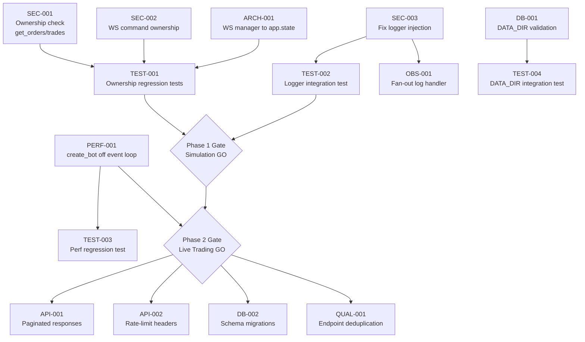

# API Implementation Roadmap

**Prompt ID:** 12-API-ROADMAP  
**Package:** `packages/api`  
**Output:** `docs/roadmap/12-api-implementation.md`  
**Source:** Prompts 01–11  
**Reviewed:** July 2025

---

## Executive Summary

This roadmap translates the 10-prompt review into 40 concrete action items across 4 phases spanning 12 weeks. The critical path is short: **6 items, ~12 hours of work**, unblock simulation-mode production deployment. Live-trading readiness requires completing Phase 1 and Phase 2 (~45 hours total). Phases 3 and 4 address technical debt, scalability, and long-term maintainability.

| Phase | Weeks | Items | Effort | Gate |
|---|---|---|---|---|
| 1 — Security & Correctness | 1–2 | 8 | ~20h | Simulation-mode GO |
| 2 — Reliability & Observability | 3–4 | 10 | ~25h | Live-trading GO |
| 3 — API Design & Quality | 5–8 | 13 | ~30h | Technical debt cleared |
| 4 — Scaling & Architecture | 9–12 | 9 | ~35h | Horizontal scaling ready |

---

## Phase Overview

```
Week:  1    2    3    4    5    6    7    8    9   10   11   12
       ├────────────┤
       Phase 1: Security & Correctness
                    ├────────────┤
                    Phase 2: Reliability & Observability
                                 ├──────────────────────┤
                                 Phase 3: API Design & Quality
                                                         ├──────────────────────┤
                                                         Phase 4: Scaling & Architecture
```

---

## Critical Path Analysis



**Items with no dependencies (can start immediately):**
- SEC-001, SEC-002, SEC-003, ARCH-001, DB-001, PERF-001

**Items that block the Phase 1 gate:**
- SEC-001, SEC-002, SEC-003, ARCH-001, DB-001 + their regression tests

**Items that block the Phase 2 gate:**
- PERF-001 + Phase 1 gate

---

## Action Item Inventory

### Priority Scoring

`Priority = (Business Impact × 2) − (Technical Difficulty × 0.5)`

| ID | Title | Impact | Difficulty | Effort | Priority Score | Phase |
|---|---|---|---|---|---|---|
| SEC-001 | Ownership check on `get_orders`/`get_trades` | 10 | 1 | 1h | 19.5 | 1 |
| SEC-002 | WS command ownership check | 10 | 2 | 2h | 19.0 | 1 |
| SEC-003 | Fix logger injection (WS log streaming) | 9 | 1 | 1h | 17.5 | 1 |
| PERF-001 | Move `create_bot()` off event loop | 9 | 5 | 4h | 15.5 | 1 |
| ARCH-001 | Move `WebSocketManager` into `app.state` | 8 | 3 | 2h | 14.5 | 1 |
| DB-001 | Fix `DATA_DIR` default + startup validation | 8 | 2 | 2h | 14.0 | 1 |
| TEST-001 | Ownership regression tests | 9 | 2 | 3h | 17.0 | 1 |
| TEST-002 | Logger integration test | 8 | 2 | 2h | 15.0 | 1 |
| SEC-004 | Hard startup failure when auth disabled in prod | 7 | 2 | 1h | 13.0 | 2 |
| SEC-005 | JWKS auto-refresh on key rotation | 7 | 3 | 1h | 12.5 | 2 |
| API-001 | Validate `from_ts`/`to_ts` format | 8 | 2 | 1h | 14.0 | 2 |
| OBS-001 | Fan-out log handler (replace per-client handlers) | 7 | 4 | 3h | 12.0 | 2 |
| OBS-002 | Machine-readable error codes | 6 | 2 | 2h | 11.0 | 2 |
| OBS-003 | Readiness probe (`GET /health/ready`) | 6 | 2 | 1h | 11.0 | 2 |
| DB-002 | Add `botid` column to `errors`/`balances` | 6 | 3 | 2h | 10.5 | 2 |
| DB-003 | Schema migration mechanism | 6 | 4 | 4h | 10.0 | 2 |
| TEST-003 | Load test suite (locust) | 7 | 3 | 4h | 12.5 | 2 |
| TEST-004 | `DATA_DIR` integration test | 6 | 2 | 1h | 11.0 | 2 |
| API-002 | Rate-limit headers (`X-RateLimit-*`) | 5 | 1 | 0.5h | 9.5 | 3 |
| API-003 | Paginated response envelope with `total` | 6 | 5 | 4h | 9.5 | 3 |
| API-004 | `Location` header on 201 bot creation | 4 | 1 | 0.5h | 7.5 | 3 |
| API-005 | `/defaults` endpoints on canonical routes | 5 | 2 | 1h | 9.0 | 3 |
| API-006 | `DELETE /bots/{botid}` return 204 | 3 | 1 | 0.5h | 5.5 | 3 |
| MOD-001 | Add `WsStopCommand` to TypeScript contract | 6 | 1 | 0.5h | 11.5 | 3 |
| MOD-002 | `TradeRecord` field bounds validation | 5 | 2 | 1h | 9.0 | 3 |
| MOD-003 | Use `WsLogEvent` model in `WsLogHandler.emit()` | 4 | 2 | 1h | 7.0 | 3 |
| MOD-004 | Centralise ticket TTL constant | 3 | 1 | 0.5h | 5.5 | 3 |
| QUAL-001 | Extract shared endpoint handlers | 5 | 4 | 4h | 8.0 | 3 |
| QUAL-002 | Consolidate `_SUNSET_DATE` / `_deprecation_headers` | 3 | 1 | 0.5h | 5.5 | 3 |
| QUAL-003 | Remove dead `except BotRunError` | 2 | 1 | 0.25h | 3.5 | 3 |
| TEST-005 | Per-module coverage thresholds in CI | 4 | 2 | 1h | 7.0 | 3 |
| TEST-006 | Move test helpers to `conftest.py` | 3 | 1 | 1h | 5.5 | 3 |
| TEST-007 | Coverage trend tracking (Codecov) | 3 | 2 | 1h | 5.0 | 3 |
| ARCH-002 | Bot restart recovery mechanism | 6 | 7 | 8h | 8.5 | 4 |
| ARCH-003 | Circuit breaker state endpoint | 5 | 3 | 2h | 8.5 | 4 |
| ARCH-004 | Remove legacy routes (post-sunset) | 4 | 3 | 2h | 6.5 | 4 |
| ARCH-005 | Redis for multi-worker scaling | 7 | 8 | 16h | 10.0 | 4 |
| DB-004 | Backup includes config + registry files | 5 | 3 | 2h | 8.5 | 4 |
| DB-005 | Evaluate PostgreSQL for high-frequency trading | 5 | 9 | 16h | 5.5 | 4 |
| PERF-002 | Replace `_db_purge` O(N) subquery | 3 | 3 | 1h | 4.5 | 4 |

---

## Phase 1 — Security & Correctness (Weeks 1–2)

**Gate:** All items complete → Simulation-mode production deployment approved.

---

### SEC-001 — Ownership check on `get_orders` and `get_trades`

- **Severity:** High | **Effort:** 1h | **Difficulty:** Easy
- **File:** `src/services/bot_service.py:72-85`
- **Current state:** Both methods accept `client_id` but pass only `botid` to `SonarftHelpers._async_query()`. Any authenticated client who knows a `botid` can read another client's full trade history.
- **Desired state:** Both methods call `_bot_owned_by(botid, client_id)` before querying, raising `BotNotFoundError` if the check fails.
- **Dependencies:** None
- **Success criteria:** A request with a valid token but a foreign `botid` returns 404, not 200.

```python
# bot_service.py
async def get_orders(self, botid: str, client_id: str, ...) -> list:
    if not self._bot_owned_by(botid, client_id):
        raise BotNotFoundError(botid)
    return await self._helpers._async_query("orders", botid, limit, offset, from_ts, to_ts)

async def get_trades(self, botid: str, client_id: str, ...) -> list:
    if not self._bot_owned_by(botid, client_id):
        raise BotNotFoundError(botid)
    return await self._helpers._async_query("trades", botid, limit, offset, from_ts, to_ts)
```

**Acceptance tests:** `test_foreign_botid_returns_404` in `test_endpoints.py` and `test_clients.py`.

---

### SEC-002 — WebSocket command ownership check

- **Severity:** High | **Effort:** 2h | **Difficulty:** Easy
- **File:** `src/websocket/manager.py:_receive_loop`
- **Current state:** `run`, `stop`, and `remove` commands validate `botid` format via `_BOTID_RE` but do not verify that `botid` belongs to `client_id`. An authenticated client can stop or remove another client's bot.
- **Desired state:** Each command handler checks `botid in bot_manager.get_botids(client_id)` before dispatching.
- **Dependencies:** None
- **Success criteria:** A WS `stop` command with a foreign `botid` returns an `error` event, not a `bot_stopped` event.

```python
# manager.py:_receive_loop — apply to run, stop, remove
elif key in ("run", "stop", "remove"):
    if not botid or not _BOTID_RE.match(str(botid)):
        await self._push_model(client_id, WsErrorEvent(
            message="Invalid or missing botid", ts=int(time.time()),
        ))
    elif botid not in bot_manager.get_botids(client_id):
        await self._push_model(client_id, WsErrorEvent(
            message="Bot not found", ts=int(time.time()),
        ))
    else:
        task = asyncio.create_task(self._handle_run/stop/remove(...))
        self._track_task(client_id, task)
```

**Acceptance tests:** `test_stop_foreign_botid_sends_error` in `test_websocket.py`.

---

### SEC-003 — Fix logger injection to restore WS log streaming

- **Severity:** High | **Effort:** 1h | **Difficulty:** Easy
- **File:** `src/services/bot_service.py:22`
- **Current state:** `BotManager` is initialised with `logger=_logger` where `_logger = logging.getLogger(__name__)` resolves to `src.services.bot_service`. The `WsLogHandler` filter checks `record.name.startswith("sonarft")` — this never matches, so zero bot logs reach the frontend.
- **Desired state:** Bot log records carry a `sonarft.*` logger name so the filter passes them through.
- **Dependencies:** None
- **Success criteria:** After connecting a WebSocket client and creating a bot, `log` events appear in the WS stream within one trading cycle.

```python
# bot_service.py — Option A (recommended): let bot use its own loggers
self._manager = BotManager(logger=None)

# Option B: inject a sonarft-namespaced logger
_bot_logger = logging.getLogger("sonarft.api_bridge")
self._manager = BotManager(logger=_bot_logger)
```

**Acceptance tests:** `test_bot_service_uses_sonarft_logger` in `tests/integration/test_bot_service_integration.py`.

---

### PERF-001 — Move `create_bot()` market load off the event loop

- **Severity:** High | **Effort:** 4h | **Difficulty:** Medium
- **Files:** `src/services/bot_service.py:42`, `packages/bot/sonarft_api_manager.py`
- **Current state:** `BotManager.create_bot()` calls `SonarftApiManager` which loads exchange markets via synchronous ccxt REST calls. The entire 1–15 second duration blocks the asyncio event loop, stalling all other requests.
- **Desired state:** Market loading runs in a thread pool worker; the event loop remains responsive during bot creation.
- **Dependencies:** None (can be done in parallel with SEC-001/002/003)
- **Success criteria:** `POST /clients/{id}/bots` returns within 500ms of the network call completing; other requests are not delayed during bot creation.

```python
# Preferred approach: refactor SonarftApiManager.load_markets()
# to use asyncio.to_thread for the ccxt REST calls internally.

# Interim approach if bot package refactor is out of scope:
# bot_service.py
async def create_bot(self, client_id: str) -> str:
    current = len(self.get_botids(client_id))
    if current >= self._settings.max_bots_per_client:
        raise BotLimitExceededError(self._settings.max_bots_per_client)
    loop = asyncio.get_event_loop()
    botid = await loop.run_in_executor(
        None,
        lambda: asyncio.run(self._manager.create_bot(client_id))
    )
    if not botid:
        raise BotCreationFailedError("BotManager.create_bot returned None")
    _logger.info("Bot created: %s for client: [redacted]", botid)
    return botid
```

**Acceptance tests:** Verify event loop lag < 100ms during `create_bot()` using an asyncio monitoring fixture.

---

### ARCH-001 — Move `WebSocketManager` into `app.state`

- **Severity:** High | **Effort:** 2h | **Difficulty:** Easy
- **Files:** `src/api/v1/endpoints/websocket.py:17`, `src/main.py:_lifespan`
- **Current state:** `_ws_manager = WebSocketManager()` is instantiated at module import time, bypassing the lifespan pattern and making it invisible to `app.state`.
- **Desired state:** `WebSocketManager` is created in `_lifespan` and stored on `app.state.ws_manager`.
- **Dependencies:** None
- **Success criteria:** `app.state.ws_manager` is accessible in tests; the module-level `_ws_manager` is removed.

```python
# main.py:_lifespan
from .websocket.manager import WebSocketManager
app.state.ws_manager = WebSocketManager()

# websocket.py — remove module-level singleton, read from app.state
async def websocket_endpoint(websocket: WebSocket, ...) -> None:
    ws_manager = websocket.app.state.ws_manager
    await ws_manager.handle_connection(websocket, client_id, resolved_token, bot_service._manager)
```

**Acceptance tests:** Verify `app.state.ws_manager` is set after lifespan startup in `test_smoke.py`.

---

### DB-001 — Fix `DATA_DIR` default and add startup validation

- **Severity:** High | **Effort:** 2h | **Difficulty:** Easy
- **Files:** `src/main.py:_lifespan`, `packages/api/.env.example`
- **Current state:** Default `DATA_DIR="sonarftdata"` resolves to `packages/api/sonarftdata/config/`. The bot reads from `packages/bot/sonarftdata/`. Config written by the API is invisible to the bot unless `DATA_DIR=../bot/sonarftdata` is explicitly set. No warning is emitted.
- **Desired state:** A startup warning is logged when `DATA_DIR` does not point to the bot's `sonarftdata/`. `.env.example` shows the correct value.
- **Dependencies:** None
- **Success criteria:** Starting the API with default `DATA_DIR` emits a `WARNING` log. `.env.example` shows `DATA_DIR=../bot/sonarftdata`.

```python
# main.py:_lifespan
from pathlib import Path
api_data = Path(settings.data_dir).resolve()
bot_data = (Path(__file__).parent.parent.parent / "bot" / "sonarftdata").resolve()
if api_data != bot_data:
    _logger.warning(
        "⚠️  DATA_DIR (%s) differs from bot sonarftdata (%s). "
        "Config written by the API will not be read by the bot. "
        "Set DATA_DIR=../bot/sonarftdata in packages/api/.env.",
        api_data, bot_data,
    )
```

**Acceptance tests:** `test_data_dir_warning_emitted_when_mismatched` in `test_smoke.py`.

---

### TEST-001 — Ownership regression tests

- **Severity:** High | **Effort:** 3h | **Difficulty:** Easy
- **Files:** `tests/unit/test_endpoints.py`, `tests/unit/test_clients.py`, `tests/unit/test_websocket.py`
- **Current state:** No test verifies that `get_orders`/`get_trades` reject a foreign `botid`, or that WS `stop`/`remove` reject a foreign `botid`.
- **Desired state:** Regression tests for SEC-001 and SEC-002 exist and pass in CI.
- **Dependencies:** SEC-001, SEC-002

```python
# test_endpoints.py — add to TestGetOrders
def test_foreign_botid_returns_404(self, client, mock_bot_service, auth_headers):
    mock_bot_service.get_orders = AsyncMock(side_effect=BotNotFoundError("bot-foreign"))
    r = client.get("/api/v1/bots/bot-foreign/orders?client_id=test", headers=auth_headers)
    assert r.status_code == 404

# test_websocket.py — add to TestWebSocketStopCommand
def test_stop_foreign_botid_sends_error(self, client, mock_bot_service):
    mock_bot_service._manager.get_botids = MagicMock(return_value=[])
    with client.websocket_connect(_ws_url()) as ws:
        ws.receive_json()
        ws.send_json({"key": "stop", "botid": "foreign-bot"})
        data = _drain_until(ws, "error")
    assert "not found" in data["message"].lower()
```

---

### TEST-002 — Logger integration test

- **Severity:** High | **Effort:** 2h | **Difficulty:** Easy
- **File:** `tests/integration/test_bot_service_integration.py` (new file)
- **Current state:** No test verifies that `BotManager` receives a logger whose name starts with `sonarft`. The logger name mismatch (SEC-003) is invisible to the test suite.
- **Desired state:** A test verifies the injected logger name, failing if the mismatch is reintroduced.
- **Dependencies:** SEC-003

```python
# tests/integration/test_bot_service_integration.py
@pytest.mark.asyncio
async def test_bot_manager_receives_sonarft_logger():
    from unittest.mock import patch
    from src.services.bot_service import BotService
    with patch("src.services.bot_service.BotManager") as MockBM, \
         patch("src.services.bot_service.SonarftHelpers"):
        MockBM.return_value = MagicMock()
        svc = BotService()
        call_kwargs = MockBM.call_args
        injected_logger = call_kwargs.kwargs.get("logger") or call_kwargs.args[0]
        if injected_logger is not None:
            assert injected_logger.name.startswith("sonarft"), (
                f"BotManager received logger '{injected_logger.name}'. "
                "WsLogHandler will not stream its records."
            )
```

---

## Phase 1 Resource Plan

| Role | Items | Estimated Hours |
|---|---|---|
| Senior Python/FastAPI | SEC-001, SEC-002, SEC-003, PERF-001, ARCH-001, DB-001 | ~12h |
| Backend (any level) | TEST-001, TEST-002 | ~5h |
| **Total Phase 1** | **8 items** | **~17h** |

**Phase 1 Exit Criteria:**
- [ ] All 8 items complete
- [ ] CI passing (ruff, mypy, pytest ≥ 75% coverage)
- [ ] Staging deployment verified
- [ ] WS log streaming confirmed working end-to-end
- [ ] `POST /clients/{id}/bots` returns within 500ms of network completion

---

## Phase 2 — Reliability & Observability (Weeks 3–4)

**Gate:** Phase 1 complete + all Phase 2 items complete → Live-trading deployment approved.

---

### SEC-004 — Hard startup failure when auth disabled in production

- **Severity:** Medium | **Effort:** 1h | **Difficulty:** Easy
- **File:** `src/main.py:_lifespan`
- **Current state:** When neither `NETLIFY_SITE_URL` nor `SONARFT_API_TOKEN` is set, all endpoints are publicly accessible. The only safeguard is a `WARNING` log line that is easy to miss in a containerised deployment.
- **Desired state:** In non-development environments, the API refuses to start if auth is not configured.

```python
# main.py:_lifespan
if not settings.netlify_site_url and not settings.sonarft_api_token:
    env = os.environ.get("SONARFT_ENV", "development")
    if env != "development":
        raise RuntimeError(
            "AUTH DISABLED in non-development environment. "
            "Set NETLIFY_SITE_URL or SONARFT_API_TOKEN."
        )
    _logger.warning("⚠️  AUTH DISABLED — all endpoints publicly accessible.")
```

---

### SEC-005 — JWKS auto-refresh on key rotation

- **Severity:** Medium | **Effort:** 1h | **Difficulty:** Easy
- **File:** `src/core/security.py:31-35`
- **Current state:** `PyJWKClient` is initialised once at import time. Netlify key rotation requires a process restart.
- **Desired state:** JWKS keys are refreshed automatically every 5 minutes.

```python
# core/security.py
_jwks_client_holder[0] = PyJWKClient(
    url,
    cache_jwk_set=True,
    lifespan=300,  # refresh every 5 minutes
)
```

---

### API-001 — Validate `from_ts`/`to_ts` format at API layer

- **Severity:** High | **Effort:** 1h | **Difficulty:** Easy
- **Files:** `src/api/v1/endpoints/clients.py:107,120`, `src/api/v1/endpoints/bots.py:75,100`
- **Current state:** Both timestamp filter parameters are `str | None` with no format check. Invalid values are passed directly to `SonarftHelpers._async_query()`.
- **Desired state:** Both parameters are validated as ISO 8601 before being forwarded.

```python
# Add to clients.py and bots.py
from datetime import datetime

def _parse_ts(value: str | None, param_name: str) -> str | None:
    if value is None:
        return None
    try:
        datetime.fromisoformat(value)
    except ValueError:
        raise HTTPException(
            status_code=422,
            detail=f"Invalid {param_name}: must be ISO 8601 (e.g. 2025-01-01T00:00:00)",
        )
    return value
```

---

### OBS-001 — Replace per-client log handlers with a single fan-out handler

- **Severity:** Medium | **Effort:** 3h | **Difficulty:** Medium
- **File:** `src/websocket/manager.py`
- **Current state:** One `WsLogHandler` is attached to `logging.root` per WebSocket client. With N clients, every bot log record triggers N format calls. Also depends on SEC-003 being fixed first.
- **Desired state:** A single `WsFanOutHandler` attached at startup fans out to all active client queues, formatting the record once.
- **Dependencies:** SEC-003 (logger name fix must be in place first)

```python
# websocket/manager.py
class WsFanOutHandler(logging.Handler):
    def __init__(self, manager: "WebSocketManager") -> None:
        super().__init__()
        self._manager = manager

    def emit(self, record: logging.LogRecord) -> None:
        if not _is_bot_record(record):
            return
        msg = self.format(record)  # format ONCE
        event = {"type": "log", "level": record.levelname,
                 "message": msg, "ts": int(record.created)}
        for queue in list(self._manager.queues.values()):
            try:
                queue.put_nowait(event)
            except asyncio.QueueFull:
                pass

# main.py:_lifespan — attach once at startup
from .websocket.manager import WsFanOutHandler
_fanout = WsFanOutHandler(app.state.ws_manager)
_fanout.setFormatter(logging.Formatter("%(levelname)s - %(message)s"))
_fanout.setLevel(logging.DEBUG)
logging.root.addHandler(_fanout)
```

Remove `_attach_log_handler` / `_detach_log_handler` from `WebSocketManager`.

---

### OBS-002 — Machine-readable error codes

- **Severity:** Medium | **Effort:** 2h | **Difficulty:** Easy
- **File:** `src/core/errors.py`
- **Current state:** Error responses contain only `detail` (string) and `request_id`. Clients must parse the `detail` string to distinguish error types.
- **Desired state:** All error responses include a `code` field with a stable machine-readable identifier.

```python
# errors.py
def _error_body(detail: str, request: Request, code: str = "INTERNAL_ERROR") -> dict:
    from .context import request_id_var
    return {"detail": detail, "code": code, "request_id": request_id_var.get("-")}

async def bot_not_found_handler(request, exc: BotNotFoundError) -> JSONResponse:
    return JSONResponse(404, content=_error_body(str(exc), request, "BOT_NOT_FOUND"))

async def bot_limit_handler(request, exc: BotLimitExceededError) -> JSONResponse:
    return JSONResponse(429, content=_error_body(str(exc), request, "BOT_LIMIT_EXCEEDED"))
```

Error code registry: `BOT_NOT_FOUND`, `BOT_LIMIT_EXCEEDED`, `BOT_CREATION_FAILED`, `CONFIG_NOT_FOUND`, `CONFIG_WRITE_ERROR`, `UNAUTHORIZED`, `VALIDATION_ERROR`, `INTERNAL_ERROR`, `RATE_LIMITED`.

---

### OBS-003 — Readiness probe

- **Severity:** Medium | **Effort:** 1h | **Difficulty:** Easy
- **File:** `src/api/v1/endpoints/health.py`
- **Current state:** `GET /health` always returns `{"status": "ok"}` regardless of whether services initialised successfully. Load balancers cannot distinguish a healthy instance from one where both services failed to start.
- **Desired state:** `GET /health/ready` returns 503 if either service failed to initialise.

```python
# health.py
@router.get("/health/ready", tags=["Health"])
async def ready(request: Request) -> dict:
    bot_ok = getattr(request.app.state, "bot_service", None) is not None
    cfg_ok = getattr(request.app.state, "config_service", None) is not None
    if not bot_ok or not cfg_ok:
        raise HTTPException(status_code=503, detail="Services not ready")
    return {"status": "ready"}
```

---

### DB-002 — Add `botid` column to `errors` and `balances` tables

- **Severity:** Medium | **Effort:** 2h | **Difficulty:** Easy
- **File:** `packages/bot/sonarft_helpers.py:_init_db`
- **Current state:** `errors` and `balances` tables have no `botid` column — errors cannot be queried per-bot.
- **Desired state:** Both tables include a `botid` column with an index.
- **Dependencies:** DB-003 (schema migration mechanism should be in place first)

```sql
ALTER TABLE errors ADD COLUMN botid TEXT;
ALTER TABLE balances ADD COLUMN botid TEXT;
CREATE INDEX IF NOT EXISTS idx_errors_botid ON errors(botid);
CREATE INDEX IF NOT EXISTS idx_balances_botid ON balances(botid);
```

---

### DB-003 — Schema migration mechanism

- **Severity:** Medium | **Effort:** 4h | **Difficulty:** Medium
- **File:** `packages/bot/sonarft_helpers.py:_init_db`
- **Current state:** `CREATE TABLE IF NOT EXISTS` cannot evolve existing schemas. Any column addition requires manual DDL with no rollback path.
- **Desired state:** A lightweight version table tracks applied migrations; new migrations run automatically at startup.

```python
# sonarft_helpers.py:_init_db — add after table creation
conn.execute("""
    CREATE TABLE IF NOT EXISTS schema_version (
        version INTEGER NOT NULL DEFAULT 0
    )
""")
row = conn.execute("SELECT version FROM schema_version").fetchone()
current = row[0] if row else 0
if current == 0:
    conn.execute("INSERT INTO schema_version VALUES (0)")

# Migration 1: add botid to errors and balances
if current < 1:
    conn.execute("ALTER TABLE errors ADD COLUMN botid TEXT")
    conn.execute("ALTER TABLE balances ADD COLUMN botid TEXT")
    conn.execute("CREATE INDEX IF NOT EXISTS idx_errors_botid ON errors(botid)")
    conn.execute("CREATE INDEX IF NOT EXISTS idx_balances_botid ON balances(botid)")
    conn.execute("UPDATE schema_version SET version = 1")

conn.commit()
```

---

### TEST-003 — Load test suite

- **Severity:** Medium | **Effort:** 4h | **Difficulty:** Medium
- **File:** `tests/load/locustfile.py` (new file)
- **Current state:** No load tests exist. No performance baseline. Regressions are undetectable.
- **Desired state:** A locust load test suite covers the main endpoint groups with documented pass criteria.

```python
# tests/load/locustfile.py
from locust import HttpUser, task, between

class ApiUser(HttpUser):
    wait_time = between(0.1, 0.5)
    headers = {"Authorization": "Bearer test-token"}

    @task(10)
    def health(self):
        self.client.get("/api/v1/health")

    @task(3)
    def list_bots(self):
        self.client.get("/api/v1/clients/test-client/bots", headers=self.headers)

    @task(1)
    def get_orders(self):
        self.client.get(
            "/api/v1/clients/test-client/bots/test-bot/orders?limit=100",
            headers=self.headers,
        )
```

**Pass criteria:** 50 concurrent users, p99 `GET /health` < 10ms, p99 `GET /orders` < 500ms, 0 errors.

---

### TEST-004 — `DATA_DIR` integration test

- **Severity:** Medium | **Effort:** 1h | **Difficulty:** Easy
- **File:** `tests/integration/test_bot_service_integration.py`
- **Current state:** No test verifies the `DATA_DIR` warning is emitted when the API and bot use different directories.
- **Desired state:** A test verifies the warning fires when `DATA_DIR` does not match the bot's `sonarftdata/`.
- **Dependencies:** DB-001

```python
def test_data_dir_mismatch_warning_emitted(caplog):
    import logging
    from unittest.mock import patch
    from src.core.config import get_settings
    get_settings.cache_clear()
    with patch.dict("os.environ", {"DATA_DIR": "/tmp/wrong_dir", "SONARFT_ENV": "production"}):
        get_settings.cache_clear()
        from src.main import create_app
        app = create_app()
        with caplog.at_level(logging.WARNING):
            with TestClient(app):
                pass
    assert any("DATA_DIR" in r.message for r in caplog.records if r.levelno == logging.WARNING)
    get_settings.cache_clear()
```

---

## Phase 2 Resource Plan

| Role | Items | Estimated Hours |
|---|---|---|
| Senior Python/FastAPI | SEC-004, SEC-005, API-001, OBS-001, OBS-002, OBS-003 | ~9h |
| Backend (any level) | DB-002, DB-003, TEST-003, TEST-004 | ~11h |
| **Total Phase 2** | **10 items** | **~20h** |

**Phase 2 Exit Criteria:**
- [ ] All 10 items complete
- [ ] CI passing
- [ ] Load test baseline documented (p50/p95/p99 for all endpoints)
- [ ] Live-trading deployment checklist reviewed
- [ ] `SONARFT_ALLOW_LIVE=true` + exchange keys configured in staging

---

## Phase 3 — API Design & Quality (Weeks 5–8)

**Gate:** Phase 2 complete. Items in this phase improve maintainability and API contract quality but do not block production.

| ID | Title | Effort | File(s) |
|---|---|---|---|
| API-002 | Enable `slowapi` rate-limit headers | 0.5h | `core/limiter.py` |
| API-003 | Paginated response envelope with `total` | 4h | `clients.py`, `bots.py`, `bot_service.py`, `sonarft_helpers.py` |
| API-004 | `Location` header on 201 bot creation | 0.5h | `clients.py`, `bots.py` |
| API-005 | `/defaults` endpoints on canonical routes | 1h | `clients.py` |
| API-006 | `DELETE /bots/{botid}` return 204 | 0.5h | `clients.py`, `bots.py` |
| MOD-001 | Add `WsStopCommand` to TypeScript contract | 0.5h | `shared/types/api.ts` |
| MOD-002 | `TradeRecord` field bounds validation | 1h | `models/schemas.py` |
| MOD-003 | Use `WsLogEvent` model in `WsLogHandler.emit()` | 1h | `websocket/manager.py` |
| MOD-004 | Centralise ticket TTL constant | 0.5h | `websocket/tickets.py`, `models/schemas.py`, `endpoints/ws_ticket.py` |
| QUAL-001 | Extract shared endpoint handlers | 4h | `api/v1/endpoints/bots.py`, `clients.py` |
| QUAL-002 | Consolidate `_SUNSET_DATE` / `_deprecation_headers` | 0.5h | `bots.py`, `config.py` |
| QUAL-003 | Remove dead `except BotRunError` | 0.25h | `packages/bot/sonarft_manager.py` |
| TEST-005 | Per-module coverage thresholds in CI | 1h | `.github/workflows/ci.yml` |
| TEST-006 | Move test helpers to `conftest.py` | 1h | `tests/conftest.py`, `test_endpoints.py`, `test_clients.py` |
| TEST-007 | Coverage trend tracking (Codecov) | 1h | `.github/workflows/ci.yml` |

**Key implementation notes:**

**API-002** — one-line change:
```python
# core/limiter.py
limiter = Limiter(key_func=get_remote_address, default_limits=["200/minute"], headers_enabled=True)
```

**API-003** — requires `SonarftHelpers._async_count()` classmethod and a `PaginatedResponse[T]` generic model:
```python
class PaginatedResponse(BaseModel, Generic[T]):
    items: list[T]
    total: int
    limit: int
    offset: int
```

**MOD-002** — add `Field` constraints to `TradeRecord`:
```python
buy_price: float = Field(gt=0)
sell_price: float = Field(gt=0)
buy_fee_rate: float = Field(ge=0, lt=1)
# ... etc
```

**QUAL-001** — extract to `src/api/v1/_bot_handlers.py`:
```python
async def handle_list_bots(client_id: str, service: BotService) -> BotListResponse:
    return BotListResponse(botids=service.get_botids(client_id))
# ... shared handlers called by both bots.py and clients.py
```

**Phase 3 estimated effort:** ~16h

---

## Phase 4 — Scaling & Architecture (Weeks 9–12)

**Gate:** Phase 3 complete. Items in this phase prepare the system for growth beyond the current single-process deployment.

| ID | Title | Effort | Notes |
|---|---|---|---|
| ARCH-002 | Bot restart recovery mechanism | 8h | Read bot registry files at startup; recreate bot instances |
| ARCH-003 | Circuit breaker state endpoint | 2h | `GET /clients/{id}/bots/{botid}/status` with circuit breaker state |
| ARCH-004 | Remove legacy routes (post-sunset) | 2h | Remove `bots.py` and `config.py` routers after Jan 2026 |
| ARCH-005 | Redis for multi-worker scaling | 16h | Move bot state, WS tickets, rate limit counters to Redis |
| DB-004 | Backup includes config + registry files | 2h | Extend `backup_db` to copy `sonarftdata/config/` and `sonarftdata/bots/` |
| DB-005 | Evaluate PostgreSQL for high-frequency trading | 16h | Spike: benchmark SQLite vs PostgreSQL at 1000 trades/min |
| PERF-002 | Replace `_db_purge` O(N) subquery | 1h | Use `MIN(id)` of top-N set instead of `NOT IN (SELECT ... LIMIT ?)` |

**Key implementation notes:**

**ARCH-002** — bot restart recovery:
```python
# main.py:_lifespan — after BotService init
import glob, json
from pathlib import Path
bots_dir = Path(settings.data_dir) / "bots"
for registry_file in bots_dir.glob("*.json"):
    data = json.loads(registry_file.read_text())
    botid = data.get("botid")
    if botid:
        _logger.info("Restoring bot %s from registry", botid)
        # Recreate bot instance — requires client_id to be stored in registry
```

Note: the current registry file only stores `{"botid": "..."}` — `client_id` must also be stored for recovery to work. This requires a registry format change.

**ARCH-005** — Redis scaling prerequisites:
- Move `TicketStore` to Redis with TTL keys
- Move `BotManager._bots`/`_clients` to Redis (requires bot serialisation)
- Move `slowapi` counters to Redis backend
- Use sticky sessions or pub/sub for WebSocket fan-out

**Phase 4 estimated effort:** ~47h (dominated by ARCH-005 and DB-005)

---

## Gantt Chart

```
ID          Week: 1    2    3    4    5    6    7    8    9   10   11   12
SEC-001           ██
SEC-002           ██
SEC-003           ██
PERF-001          ████
ARCH-001          ██
DB-001            ██
TEST-001             ████
TEST-002             ██
                  ├──────────────────────────────────────────────────────────
                  PHASE 1 GATE (end of week 2)
SEC-004                    ██
SEC-005                    ██
API-001                    ██
OBS-001                    ████
OBS-002                    ██
OBS-003                    ██
DB-002                        ██
DB-003                        ████
TEST-003                      ████
TEST-004                      ██
                              ├────────────────────────────────────────────
                              PHASE 2 GATE (end of week 4)
API-002                              ██
API-003                              ████████
API-004                              ██
API-005                              ██
API-006                              ██
MOD-001                              ██
MOD-002                              ██
MOD-003                                  ██
MOD-004                                  ██
QUAL-001                                 ████████
QUAL-002                                 ██
QUAL-003                                 ██
TEST-005                                     ██
TEST-006                                     ██
TEST-007                                     ██
                                             ├──────────────────────────────
                                             PHASE 3 GATE (end of week 8)
ARCH-002                                              ████████████████
ARCH-003                                              ████
ARCH-004                                              ████
ARCH-005                                                  ████████████████
DB-004                                                ████
DB-005                                                    ████████████████
PERF-002                                              ██
```

---

## Risk Assessment

### Phase 1 Risks

| Risk | Likelihood | Impact | Mitigation |
|---|---|---|---|
| `create_bot()` refactor breaks bot startup | Medium | High | Feature flag; keep old path as fallback; test in staging |
| Logger change breaks existing log routing | Low | Medium | Test WS log streaming end-to-end before merging |
| `app.state.ws_manager` migration breaks existing WS tests | Low | Low | Update test fixtures to use `app.state` |

### Phase 2 Risks

| Risk | Likelihood | Impact | Mitigation |
|---|---|---|---|
| Schema migration corrupts existing SQLite data | Low | High | Test migration on a copy of production DB; backup before running |
| Load tests reveal unexpected bottleneck | Medium | Medium | Run load tests in staging first; document findings before production |
| Fan-out handler introduces log ordering issues | Low | Low | Verify ordering in `test_log_streaming.py` |

### Phase 3 Risks

| Risk | Likelihood | Impact | Mitigation |
|---|---|---|---|
| Paginated response envelope breaks frontend | Medium | Medium | Coordinate with frontend team; version the change |
| Endpoint deduplication introduces regression | Low | Medium | Comprehensive test coverage before merging |

### Phase 4 Risks

| Risk | Likelihood | Impact | Mitigation |
|---|---|---|---|
| Redis dependency adds operational complexity | Medium | Medium | Start with Redis only for tickets; expand incrementally |
| Bot restart recovery has edge cases | High | Medium | Extensive testing; graceful degradation if recovery fails |

---

## Success Metrics

| Metric | Baseline | Phase 1 Target | Phase 2 Target | Phase 4 Target |
|---|---|---|---|---|
| High/Critical vulnerabilities | 6 | 0 | 0 | 0 |
| Test coverage | ~75% | 78% | 82% | 85% |
| Ownership test coverage | 0% | 100% | 100% | 100% |
| `create_bot()` p99 latency | 1–15s | < 500ms | < 500ms | < 200ms |
| WS log events delivered | 0 (broken) | 100% | 100% | 100% |
| Event loop max lag | Unknown | < 100ms | < 50ms | < 50ms |
| Load test p99 GET /health | Unknown | — | < 10ms | < 5ms |
| Load test p99 GET /orders | Unknown | — | < 500ms | < 200ms |
| Ruff lint errors | 0 | 0 | 0 | 0 |
| mypy errors | 0 | 0 | 0 | 0 |

---

## Assumptions & Constraints

1. **Single developer** — estimates assume one senior Python/FastAPI developer. Parallel execution of Phase 1 items is possible with two developers.
2. **Bot package is in scope** — SEC-003, PERF-001, DB-002/003, QUAL-003 require changes to `packages/bot`. If the bot package is frozen, use the interim workarounds documented in each item.
3. **Staging environment available** — Phase 1 exit criteria require a staging deployment with real exchange connectivity (simulation mode).
4. **Legacy routes sunset date** — ARCH-004 (remove legacy routes) is scheduled for Phase 4 but depends on the Jan 2026 sunset date. If the date changes, adjust accordingly.
5. **Redis not required for current scale** — ARCH-005 is Phase 4 and only needed if concurrent client count exceeds ~20 or multi-worker deployment is required.

---

## Approval & Sign-off

| Phase | Approver | Criteria | Status |
|---|---|---|---|
| Phase 1 | Tech Lead | All 8 items complete; CI green; staging verified | ⬜ Pending |
| Phase 2 | Tech Lead + Product | Phase 1 complete; load test baseline documented | ⬜ Pending |
| Phase 3 | Tech Lead | Phase 2 complete; no API contract regressions | ⬜ Pending |
| Phase 4 | Tech Lead + DevOps | Phase 3 complete; Redis spike evaluated | ⬜ Pending |

---

_Generated by Amazon Q Developer — SonarFT API Code Review Prompt Suite, Prompt 12_
