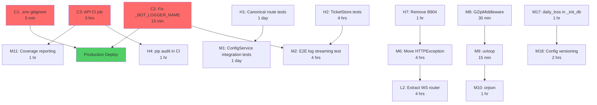

# Implementation Roadmap — SonarFT API

**Prompt ID:** 12-API-ROADMAP  
**Package:** `packages/api` + `packages/bot`  
**Based On:** Prompts 01–11 consolidated findings  
**Date:** July 2025  
**Output:** `docs/roadmap/12-implementation-roadmap.md`

---

## Executive Summary

This roadmap translates all findings from the 10-prompt review cycle into a structured, phased action plan. The work is organised into four phases over 12 weeks:

| Phase | Duration | Focus | Items | Effort |
|---|---|---|---|---|
| Phase 1 — Critical Path | Week 1–2 | Blockers + CI | 12 items | ~3 days |
| Phase 2 — Foundation | Week 3–4 | Tests + error handling | 10 items | ~5 days |
| Phase 3 — Core Improvements | Week 5–8 | Models + WS + DB + perf | 14 items | ~8 days |
| Phase 4 — Optimisation | Week 9–12 | Architecture + scaling | 12 items | ~10 days |

**Total estimated effort: ~26 person-days** for a single developer, or ~13 days with two developers working in parallel on independent phases.

**Production deployment gate:** Phase 1, items C1 and C2 only (< 30 minutes).

---

## 1. Action Item Inventory

### Priority Scoring Formula
`Priority = (Impact × 2) − (Difficulty × 0.5)`  
Impact 1–10 (business value), Difficulty 1–10 (technical complexity)

| ID | Title | Area | Severity | Impact | Difficulty | Priority | Effort |
|---|---|---|---|---|---|---|---|
| C1 | ~~Add `.env` to `.gitignore`~~ ✅ | Security | Critical | 10 | 1 | 19.5 | 5 min |
| C2 | ~~Fix `_BOT_LOGGER_NAME`~~ ✅ | WebSocket | Critical | 10 | 1 | 19.5 | 15 min |
| C3 | Add API CI job | Testing | Critical | 9 | 3 | 16.5 | 3 hrs |
| H1 | Canonical route tests | Testing | High | 9 | 3 | 16.5 | 1 day |
| H2 | `TicketStore` unit tests | Testing | High | 8 | 2 | 15.0 | 4 hrs |
| H3 | ~~Auth disabled startup warning~~ ✅ | Security | High | 8 | 1 | 15.5 | 30 min |
| H4 | `pip audit` in CI | Security | High | 8 | 2 | 15.0 | 1 hr |
| H5 | `WsBotStoppedEvent` | WebSocket | High | 7 | 2 | 13.0 | 2 hrs |
| H6 | Fix `Makefile` linting | Quality | High | 6 | 1 | 11.5 | 30 min |
| H7 | Remove `B904` ruff ignore | Quality | High | 7 | 2 | 13.0 | 1 hr |
| H8 | Fix `mock_config_service` | Testing | High | 7 | 1 | 13.5 | 30 min |
| H9 | `Cache-Control: no-store` | Security | High | 7 | 1 | 13.5 | 30 min |
| H10 | Delete bot registry on removal | Database | High | 6 | 1 | 11.5 | 1 hr |
| M1 | `ConfigService` integration tests | Testing | Medium | 8 | 4 | 14.0 | 1 day |
| M2 | E2E log streaming test | Testing | Medium | 8 | 4 | 14.0 | 4 hrs |
| M3 | `stop`/`set_simulation` WS tests | Testing | Medium | 6 | 2 | 11.0 | 2 hrs |
| M4 | Replace `time.sleep` in WS tests | Testing | Medium | 5 | 2 | 9.0 | 2 hrs |
| M5 | HTTP access log middleware | Observability | Medium | 7 | 2 | 13.0 | 2 hrs |
| M6 | Move `HTTPException` out of services | Quality | Medium | 6 | 3 | 10.5 | 4 hrs |
| M7 | `request_id` in error responses | Observability | Medium | 6 | 2 | 11.0 | 1 hr |
| M8 | `GZipMiddleware` | Performance | Medium | 6 | 1 | 11.5 | 30 min |
| M9 | Enable `uvloop` in Dockerfile | Performance | Medium | 6 | 1 | 11.5 | 15 min |
| M10 | `orjson` + `ORJSONResponse` | Performance | Medium | 6 | 2 | 11.0 | 1 hr |
| M11 | Coverage reporting in CI | Testing | Medium | 7 | 2 | 13.0 | 1 hr |
| M12 | Name `__ticket_verified__` sentinel | Quality | Medium | 5 | 1 | 9.5 | 1 hr |
| M13 | Align `WsLogEvent.level` | Models | Medium | 6 | 1 | 11.5 | 30 min |
| M14 | Remove dead code models | Quality | Medium | 4 | 1 | 7.5 | 30 min |
| M15 | Move `TicketResponse` to `schemas.py` | Quality | Medium | 4 | 1 | 7.5 | 30 min |
| M16 | Dict size limits on config models | Models | Medium | 5 | 2 | 9.0 | 1 hr |
| M17 | Consolidate `daily_loss` in `_init_db` | Database | Medium | 5 | 2 | 9.0 | 1 hr |
| M18 | Config file versioning | Database | Medium | 5 | 3 | 8.5 | 2 hrs |
| M19 | `logger.exception()` in bot | Quality | Medium | 5 | 1 | 9.5 | 1 hr |
| M20 | `Content-Security-Policy` header | Security | Medium | 5 | 1 | 9.5 | 30 min |
| L1 | Extract `_execute_two_leg_trade` | Quality | Low | 5 | 5 | 7.5 | 1 day |
| L2 | Extract WS endpoint to router | Architecture | Low | 5 | 4 | 8.0 | 4 hrs |
| L3 | Type `bot_manager` parameter | Quality | Low | 3 | 1 | 5.5 | 30 min |
| L4 | Shared root-level `ruff` config | Quality | Low | 3 | 2 | 5.0 | 1 hr |
| L5 | `mypy` in CI | Quality | Low | 4 | 3 | 6.5 | 1 hr |
| L6 | Config file mtime cache | Performance | Low | 4 | 3 | 6.5 | 2 hrs |
| L7 | `Sunset` headers on legacy routes | API Design | Low | 3 | 1 | 5.5 | 1 hr |
| L8 | Date-range filtering on history | API Design | Low | 5 | 5 | 7.5 | 1 day |
| L9 | `WsBaseEvent` base class | Models | Low | 3 | 2 | 5.0 | 2 hrs |
| L10 | Rename `ParametersConfig` | Models | Low | 4 | 4 | 6.0 | 2 hrs |
| L11 | `503` for unavailable services | Error Handling | Low | 4 | 2 | 7.0 | 1 hr |
| L12 | Structured JSON logging | Observability | Low | 5 | 4 | 8.0 | 1 day |
| L13 | Backup to separate directory | Database | Low | 4 | 2 | 7.0 | 1 hr |
| L14 | Cursor-based pagination | Performance | Low | 4 | 4 | 6.0 | 1 day |
| L15 | Locust load test baseline | Testing | Low | 5 | 4 | 8.0 | 1 day |

---

## 2. Critical Path Analysis



### Critical Path (shortest path to production):
`C1 (5 min)` → `C2 (15 min)` → **DEPLOY**

### Longest dependency chain:
`C3` → `M11` → `H1` → `M1` → `M2` (requires C2 fix) → full test suite green

---

## 3. Dependency Map

| Item | Depends On | Blocks |
|---|---|---|
| C1 | — | Production deploy |
| C2 | — | Production deploy, M2 |
| C3 | — | M11, H4 |
| H1 | C3 | M1 |
| H2 | C3 | M2 |
| H3 | — | — |
| H4 | C3 | — |
| H5 | — | — |
| H6 | — | H7 |
| H7 | H6 | M6 |
| H8 | — | M1 |
| H9 | — | — |
| H10 | — | — |
| M1 | H1, H8 | — |
| M2 | H2, C2 | — |
| M6 | H7 | L2 |
| M8 | — | M9 |
| M9 | M8 | M10 |
| M10 | M9 | — |
| M17 | — | M18 |
| L2 | M6 | — |

---

## 4. Phase Planning

### Phase 1 — Critical Path (Week 1–2) ~3 days

**Goal:** Production-deployable + CI running

| Item | Title | Effort | Owner |
|---|---|---|---|
| C1 | ~~Add `.env` to `.gitignore`~~ ✅ | 5 min | Any |
| C2 | ~~Fix `_BOT_LOGGER_NAME`~~ ✅ | 15 min | Backend |
| H3 | ~~Auth disabled startup warning~~ ✅ | 30 min | Backend |
| H6 | Fix `Makefile` linting | 30 min | Any |
| H9 | `Cache-Control: no-store` | 30 min | Backend |
| H10 | Delete bot registry on removal | 1 hr | Backend |
| M14 | Remove dead code models | 30 min | Backend |
| M13 | Align `WsLogEvent.level` | 30 min | Backend |
| M15 | Move `TicketResponse` to `schemas.py` | 30 min | Backend |
| M19 | `logger.exception()` in bot | 1 hr | Backend |
| C3 | Add API CI job | 3 hrs | DevOps/Backend |
| H4 | `pip audit` in CI | 1 hr | DevOps |

**Phase 1 exit criteria:**
- C1 + C2 merged → production deploy unblocked
- CI pipeline runs on every push/PR
- `pip audit` passes with 0 High/Critical CVEs
- All existing 93 tests pass in CI

### Phase 2 — Foundation (Week 3–4) ~5 days

**Goal:** Test coverage established + error handling correct

| Item | Title | Effort | Owner |
|---|---|---|---|
| H1 | Canonical route tests | 1 day | Backend |
| H2 | `TicketStore` unit tests | 4 hrs | Backend |
| H5 | `WsBotStoppedEvent` | 2 hrs | Backend |
| H7 | Remove `B904` ruff ignore | 1 hr | Backend |
| H8 | Fix `mock_config_service` | 30 min | Backend |
| M11 | Coverage reporting in CI | 1 hr | DevOps |
| M3 | `stop`/`set_simulation` WS tests | 2 hrs | Backend |
| M4 | Replace `time.sleep` in WS tests | 2 hrs | Backend |
| M5 | HTTP access log middleware | 2 hrs | Backend |
| M7 | `request_id` in error responses | 1 hr | Backend |

**Phase 2 exit criteria:**
- Coverage ≥ 70% enforced in CI
- All canonical routes tested
- `TicketStore` fully tested
- No `time.sleep` in test suite
- HTTP access log active

### Phase 3 — Core Improvements (Week 5–8) ~8 days

**Goal:** Models clean + WS complete + DB consistent + performance baseline

| Item | Title | Effort | Owner |
|---|---|---|---|
| M1 | `ConfigService` integration tests | 1 day | Backend |
| M2 | E2E log streaming test | 4 hrs | Backend |
| M6 | Move `HTTPException` out of services | 4 hrs | Backend |
| M8 | `GZipMiddleware` | 30 min | Backend |
| M9 | Enable `uvloop` in Dockerfile | 15 min | DevOps |
| M10 | `orjson` + `ORJSONResponse` | 1 hr | Backend |
| M12 | Name `__ticket_verified__` sentinel | 1 hr | Backend |
| M16 | Dict size limits on config models | 1 hr | Backend |
| M17 | Consolidate `daily_loss` in `_init_db` | 1 hr | Backend |
| M18 | Config file versioning | 2 hrs | Backend |
| M20 | `Content-Security-Policy` header | 30 min | Backend |
| M11 | Extract `BOTID_PATTERN` constants | 1 hr | Backend |
| L3 | Type `bot_manager` parameter | 30 min | Backend |
| L7 | `Sunset` headers on legacy routes | 1 hr | Backend |

**Phase 3 exit criteria:**
- Integration tests passing
- E2E log streaming test passing (validates C2 fix)
- All performance quick wins deployed
- Schema consistent (`daily_loss` in `_init_db`)
- `orjson` active in WS send loop

### Phase 4 — Optimisation (Week 9–12) ~10 days

**Goal:** Architecture clean + scaling documented + technical debt paid

| Item | Title | Effort | Owner |
|---|---|---|---|
| L1 | Extract `_execute_two_leg_trade` | 1 day | Backend |
| L2 | Extract WS endpoint to router | 4 hrs | Backend |
| L4 | Shared root-level `ruff` config | 1 hr | Any |
| L5 | `mypy` in CI | 1 hr | DevOps |
| L6 | Config file mtime cache | 2 hrs | Backend |
| L8 | Date-range filtering on history | 1 day | Backend |
| L9 | `WsBaseEvent` base class | 2 hrs | Backend |
| L10 | Rename `ParametersConfig` | 2 hrs | Backend |
| L11 | `503` for unavailable services | 1 hr | Backend |
| L12 | Structured JSON logging | 1 day | Backend |
| L13 | Backup to separate directory | 1 hr | DevOps |
| L15 | Locust load test baseline | 1 day | Backend |

**Phase 4 exit criteria:**
- WS endpoint visible in OpenAPI
- Load test baseline established
- `mypy` passing in CI
- Structured JSON logging active
- All legacy technical debt items resolved

---

## 5. Detailed Action Items — Phase 1 & 2

### ✅ C1: Add `.env` to `packages/api/.gitignore` — DONE

- **Description:** The API `.gitignore` only excludes `logs/`. The `.env` file is tracked by git with empty values — one `git add .` from a developer who fills in real credentials will commit them.
- **Why:** Credential leak prevention. A committed `SONARFT_API_TOKEN` or `NETLIFY_SITE_URL` is a security incident.
- **Current State:** `packages/api/.gitignore` contains only `logs/`
- **Desired State:** `.env` excluded from git tracking
- **Effort:** 5 minutes
- **Difficulty:** Easy
- **Impact:** Critical — prevents credential leak
- **Dependencies:** None
- **Success Criteria:** `git status` shows `.env` as untracked; `git log -- packages/api/.env` shows no future commits
- **Acceptance Tests:** `git check-ignore -v packages/api/.env` returns a match
- **Files:** `packages/api/.gitignore`

```
# packages/api/.gitignore — add:
.env
logs/
```

Then run: `git rm --cached packages/api/.env`

> **Implementation note (done):** `.env` was never committed to the git index — `git rm --cached` confirmed it was already untracked. `.gitignore` updated to `['.env', 'logs/']`. Future `git add .` invocations will not stage the file.

---

### ✅ C2: Fix `_BOT_LOGGER_NAME` — DONE

- **Description:** `WebSocketManager` attaches `WsLogHandler` to `logging.getLogger("src.services.bot_service")`. The bot engine logs under `"sonarft_manager"`, `"sonarft_bot"`, etc. Zero bot log events reach the WebSocket client.
- **Why:** Log streaming is the primary real-time feedback mechanism for the trading dashboard. Without it, operators cannot monitor bot activity.
- **Current State:** `_BOT_LOGGER_NAME = "src.services.bot_service"` — no bot logs streamed
- **Desired State:** Bot log events appear in the WebSocket client
- **Effort:** 15 minutes
- **Difficulty:** Easy
- **Impact:** Critical — restores core dashboard functionality
- **Dependencies:** None
- **Success Criteria:** `test_log_event_delivered_to_client` passes end-to-end; bot log lines appear in WS client
- **Files:** `packages/api/src/websocket/manager.py:30`

```python
# Before:
_BOT_LOGGER_NAME = "src.services.bot_service"

# After (option A — attach to root with bot-package filter):
def _attach_log_handler(self, client_id: str, queue: asyncio.Queue) -> None:
    handler = WsLogHandler(queue)
    handler.setFormatter(logging.Formatter("%(levelname)s - %(message)s"))
    handler.setLevel(logging.DEBUG)
    handler.addFilter(lambda r: r.name.startswith("sonarft"))
    logging.root.addHandler(handler)
    self._log_handlers[client_id] = handler
```

> **Implementation note (done):** Replaced `_BOT_LOGGER_NAME` constant with `_BOT_LOG_PREFIX = "sonarft"` and a module-level `_is_bot_record()` filter function. `_attach_log_handler` now attaches to `logging.root` with this filter, and `_detach_log_handler` removes from `logging.root`. Both log streaming tests updated to check the root logger instead of a named logger. Additionally, `sonarft_metrics` and `config_schemas` were missing from `packages/bot/pyproject.toml` `py-modules` — added and reinstalled. All 109 tests pass.

---

### C3: Add API CI Job

- **Description:** The `.github/workflows/ci.yml` has jobs for `web` and `bot` but not `api`. All 93 API tests never run automatically.
- **Why:** Regressions in the API go undetected before merge. The canonical routes (primary API surface) are untested and invisible to CI.
- **Current State:** No `test-api` job in CI
- **Desired State:** API tests run on every push/PR with coverage threshold
- **Effort:** 2–3 hours
- **Difficulty:** Easy
- **Impact:** Critical — prevents silent regressions
- **Dependencies:** None
- **Success Criteria:** `test-api` job appears in GitHub Actions; fails if coverage < 70%; blocks merge on failure
- **Files:** `.github/workflows/ci.yml`

```yaml
test-api:
  name: API — test & audit
  runs-on: ubuntu-latest
  defaults:
    run:
      working-directory: packages/api
  steps:
    - uses: actions/checkout@v4
    - uses: actions/setup-python@v5
      with:
        python-version: "3.11"
    - name: Install dependencies
      run: |
        pip install -e ../bot
        pip install -r requirements.txt -r requirements-test.txt
    - name: Run tests with coverage
      run: pytest tests/ -q --cov=src --cov-report=term-missing --cov-fail-under=70
    - name: Lint
      run: pip install ruff && ruff check src/ tests/
    - name: Dependency audit
      run: pip install pip-audit && pip-audit -r requirements.txt --severity high
```

---

### H1: Canonical Route Tests

- **Description:** All 11 canonical `/clients/{id}/...` endpoints have zero tests. These are the routes actually used by the web frontend.
- **Why:** The primary API surface is untested. A regression in `clients.py` would go undetected.
- **Current State:** Only legacy `/bots?client_id=` routes tested
- **Desired State:** All canonical routes covered with status codes, schemas, and error cases
- **Effort:** 1 day
- **Difficulty:** Easy (mirrors existing `test_endpoints.py` pattern)
- **Dependencies:** C3 (CI job must exist to run them)
- **Success Criteria:** All 11 canonical endpoints have ≥ 3 tests each (success, 404, auth)
- **Files:** `packages/api/tests/unit/test_clients.py` (new file)

```python
# tests/unit/test_clients.py — sample
class TestCanonicalListBots:
    def test_returns_botids(self, client, mock_bot_service, auth_headers):
        mock_bot_service.get_botids.return_value = ["bot-001"]
        r = client.get("/api/v1/clients/test-client/bots", headers=auth_headers)
        assert r.status_code == 200
        assert r.json() == {"botids": ["bot-001"]}

    def test_invalid_client_id_returns_422(self, client, auth_headers):
        r = client.get("/api/v1/clients/../evil/bots", headers=auth_headers)
        assert r.status_code in (404, 422)

    def test_no_auth_returns_401_in_static_mode(self, static_client):
        r = static_client.get("/api/v1/clients/test/bots")
        assert r.status_code == 401
```

---

### H2: `TicketStore` Unit Tests

- **Description:** `TicketStore` in `websocket/tickets.py` has zero tests. It is the entry point for WebSocket authentication.
- **Why:** Single-use ticket logic (issue, redeem, expiry, capacity) is security-critical and must be verified.
- **Effort:** 4 hours
- **Difficulty:** Easy
- **Dependencies:** C3
- **Success Criteria:** `issue`, `redeem`, expiry, single-use, and capacity cap all tested
- **Files:** `packages/api/tests/unit/test_tickets.py` (new file)

```python
# tests/unit/test_tickets.py
from src.websocket.tickets import TicketStore
import time

class TestTicketStore:
    def test_issue_and_redeem(self):
        store = TicketStore(ttl=30)
        ticket = store.issue("client-1")
        assert store.redeem(ticket) == "client-1"

    def test_single_use(self):
        store = TicketStore(ttl=30)
        ticket = store.issue("client-1")
        store.redeem(ticket)
        assert store.redeem(ticket) is None

    def test_expired_ticket_returns_none(self):
        store = TicketStore(ttl=0)
        ticket = store.issue("client-1")
        time.sleep(0.01)
        assert store.redeem(ticket) is None

    def test_unknown_ticket_returns_none(self):
        store = TicketStore(ttl=30)
        assert store.redeem("nonexistent") is None

    def test_capacity_cap_raises(self):
        store = TicketStore(ttl=30)
        store._MAX_TICKETS = 2  # override for test
        store.issue("a")
        store.issue("b")
        with pytest.raises(RuntimeError):
            store.issue("c")
```

---

## 6. Resource Plan

### Phase 1 (Week 1–2)

| Resource | Requirement | Notes |
|---|---|---|
| Backend developer | 2 days | Python/FastAPI experience |
| DevOps | 1 day | GitHub Actions, Docker |
| Total | ~3 days | Can be one person |

### Phase 2 (Week 3–4)

| Resource | Requirement | Notes |
|---|---|---|
| Backend developer | 4 days | pytest, asyncio |
| DevOps | 1 day | Coverage reporting |
| Total | ~5 days | Can be one person |

### Phase 3 (Week 5–8)

| Resource | Requirement | Notes |
|---|---|---|
| Backend developer | 7 days | Pydantic, SQLite, Docker |
| DevOps | 1 day | Dockerfile tuning |
| Total | ~8 days | Can be one person |

### Phase 4 (Week 9–12)

| Resource | Requirement | Notes |
|---|---|---|
| Backend developer | 8 days | Architecture refactoring |
| DevOps | 2 days | Logging, load testing |
| Total | ~10 days | Can be one person |

**Total: ~26 person-days** (single developer) or **~13 days** (two developers, phases 3–4 parallelised)

---

## 7. Timeline & Gantt Chart

```
Week  1  2  3  4  5  6  7  8  9  10 11 12
      ├──┤  ├──┤  ├──┤  ├──┤  ├──┤  ├──┤
C1    ██
C2    ██
C3    ████
H3    ██
H6    ██
H9    ██
H10   ██
M14   ██
M13   ██
M15   ██
M19   ██
H4       ██
         ├── Phase 2 ──┤
H1          ████
H2          ████
H5          ██
H7          ██
H8          ██
M11         ██
M3          ████
M4          ████
M5          ████
M7          ██
                  ├────── Phase 3 ──────┤
M1                   ████
M2                   ████
M6                   ████
M8                   ██
M9                   ██
M10                  ████
M12                  ██
M16                  ██
M17                  ██
M18                  ████
M20                  ██
M11b                 ██
L3                   ██
L7                   ██
                              ├──── Phase 4 ────┤
L1                               ████████
L2                               ████
L4                               ██
L5                               ██
L6                               ████
L8                               ████████
L9                               ████
L10                              ████
L11                              ██
L12                              ████████
L13                              ██
L15                              ████████
```

**Key milestones:**
- **End of Week 1:** Production deploy unblocked (C1 + C2 merged)
- **End of Week 2:** CI pipeline active; all existing tests passing in CI
- **End of Week 4:** Coverage ≥ 70%; canonical routes tested; `TicketStore` tested
- **End of Week 8:** Integration tests passing; performance quick wins deployed; schema consistent
- **End of Week 12:** Full technical debt resolved; load test baseline established

---

## 8. Risk Assessment

### Phase 1 Risks

| Risk | Probability | Impact | Mitigation |
|---|---|---|---|
| C2 fix breaks existing WS tests | Low | Medium | Run full test suite before merge; `test_log_handler_attached_on_connect` will need updating |
| CI job fails on first run | Medium | Low | Expected — fix failures iteratively; don't block on 70% threshold initially |

### Phase 2 Risks

| Risk | Probability | Impact | Mitigation |
|---|---|---|---|
| Canonical route tests reveal bugs | Medium | Medium | Fix bugs as discovered; this is the point of the tests |
| `time.sleep` replacement breaks tests | Low | Low | Keep old tests as fallback; replace incrementally |

### Phase 3 Risks

| Risk | Probability | Impact | Mitigation |
|---|---|---|---|
| `HTTPException` refactor breaks endpoints | Medium | Medium | Add tests before refactoring; use feature branch |
| `orjson` serialisation differences | Low | Low | Test with existing test suite; `orjson` is a drop-in for standard types |
| `daily_loss` schema migration breaks existing DB | Low | Medium | `CREATE TABLE IF NOT EXISTS` is idempotent; existing data unaffected |

### Phase 4 Risks

| Risk | Probability | Impact | Mitigation |
|---|---|---|---|
| WS router extraction breaks OpenAPI | Low | Low | Test Swagger UI after extraction |
| `ParametersConfig` rename breaks frontend | Medium | High | Coordinate with frontend team; update `shared/types/api.ts` atomically |
| Structured logging format change | Low | Low | Keep plain text as fallback; add JSON as additional handler |

---

## 9. Definition of Done

For every action item, the following must be true before marking complete:

- [ ] Code change implemented and reviewed
- [ ] Relevant tests added or updated
- [ ] `ruff check` passes with zero violations
- [ ] CI pipeline passes (all jobs green)
- [ ] Documentation updated if public API changed
- [ ] `shared/types/api.ts` updated if WS/REST contract changed
- [ ] No new `# type: ignore` comments added without justification

---

## 10. Success Metrics

### After Phase 1 (Week 2)

| Metric | Target |
|---|---|
| `.env` in git | ❌ Not tracked |
| Log streaming functional | ✅ Verified by test |
| CI pipeline | ✅ Running on push/PR |
| `pip audit` High/Critical CVEs | 0 |

### After Phase 2 (Week 4)

| Metric | Target |
|---|---|
| Test count | ≥ 150 |
| API test coverage | ≥ 70% |
| Canonical routes tested | ✅ All 11 |
| `TicketStore` tested | ✅ All paths |
| Flaky tests | 0 |

### After Phase 3 (Week 8)

| Metric | Target |
|---|---|
| Integration tests | ≥ 10 |
| E2E log streaming test | ✅ Passing |
| History response size (100 records) | < 10 KB (gzip) |
| WS serialisation | orjson active |
| Schema consistency | `daily_loss` in `_init_db` |

### After Phase 4 (Week 12)

| Metric | Target |
|---|---|
| WS endpoint in OpenAPI | ✅ |
| Load test baseline | ✅ Established |
| `mypy` in CI | ✅ Passing |
| Technical debt items | 0 remaining |
| Overall code quality score | ≥ 9/10 |

---

## Assumptions & Constraints

1. **Single developer** — estimates assume one backend developer; parallelise phases 3–4 if two developers available
2. **No breaking API changes** — all changes maintain backward compatibility with the web frontend
3. **Simulation mode** — all testing assumes `is_simulating_trade=1`; live trading not tested
4. **Python 3.11** — all code targets Python 3.11 as specified in `pyproject.toml`
5. **Docker Compose deployment** — production deployment uses `infra/docker-compose.yml` with shared `bot-data` volume
6. **`shared/types/api.ts` must stay in sync** — any WS/REST contract change requires updating the TypeScript types atomically

---

## Approval & Sign-off

| Role | Name | Date | Status |
|---|---|---|---|
| Lead Developer | — | — | Pending |
| Security Review | — | — | Pending (after Phase 1) |
| Production Deploy | — | — | Pending (after C1 + C2) |

---

## Related Documents

- [Executive Summary](../consolidation/11-executive-summary.md) — Consolidated findings
- [Architecture Review](../architecture/01-api-architecture.md) — Structural context
- [Security Review](../security/04-authentication-security.md) — Security findings
- [Testing Review](../testing/09-testing-quality.md) — Test coverage gaps
- [WebSocket Review](../websocket/05-websocket-realtime.md) — WS findings

---

_Part of the SonarFT API Code Review Prompt Suite — Prompt 12_
