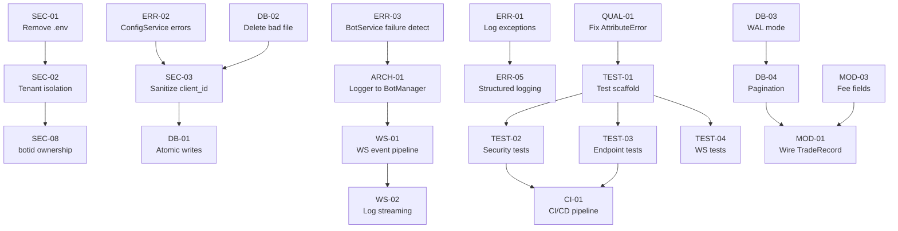

# Prompt 12 — Implementation Roadmap

**Generated:** July 2025  
**Reviewer:** Amazon Q  
**Input:** Consolidated findings from Prompts 01–11  
**Output location:** `docs/roadmap/12-implementation-roadmap.md`

---

## Executive Summary

**40 action items** across 4 phases over 12 weeks. **6 production blockers** must be resolved in Phase 1 before any deployment. Total estimated effort: **~40 person-days** for a single backend developer, or **~20 calendar days** with two developers working in parallel on independent tracks.

| Phase | Duration | Items | Effort | Goal |
|---|---|---|---|---|
| Phase 1 — Critical Path | Weeks 1–2 | 12 items | ~10 days | Remove production blockers |
| Phase 2 — High Priority | Weeks 3–5 | 15 items | ~15 days | Harden for release |
| Phase 3 — Medium Priority | Weeks 6–9 | 13 items | ~13 days | Production quality |
| Phase 4 — Optimisation | Weeks 10–12 | Ongoing | ~5 days | Long-term health |

---

## Action Item Inventory

### Severity Legend
- 🔴 Critical — production blocker
- 🟠 High — should fix before release
- 🟡 Medium — plan next quarter
- 🟢 Low — nice to have

| ID | Title | Area | Severity | Effort |
|---|---|---|---|---|
| SEC-01 | Remove `.env` from git, add to `.gitignore` | Security | 🔴 | 2h |
| SEC-02 | Implement tenant isolation via JWT `sub` claim | Security | 🔴 | 1d |
| SEC-03 | Apply `sanitize_client_id()` in `ConfigService` | Security | 🔴 | 2h |
| SEC-04 | `hmac.compare_digest` for static token | Security | 🟠 | 30min |
| SEC-05 | Add `SecurityHeadersMiddleware` | Security | 🟠 | 2h |
| SEC-06 | Add HTTP rate limiting (`slowapi`) | Security | 🟠 | 1d |
| SEC-07 | WebSocket one-time ticket (JWT out of URL) | Security | 🟡 | 2d |
| SEC-08 | Verify `botid` ownership before run/stop/delete | Security | 🟠 | 3h |
| ARCH-01 | Pass logger to `BotManager` in `BotService` | Architecture | 🔴 | 30min |
| ARCH-02 | Move `BotService` init to FastAPI `lifespan` | Architecture | 🟠 | 2h |
| ARCH-03 | Differentiate `stop_bot` from `remove_bot` | Architecture | 🟡 | 1d |
| ARCH-04 | Move `client_id` to path segment | Architecture | 🟡 | 2d |
| WS-01 | Wire bot lifecycle events into WS queues | WebSocket | 🔴 | 2d |
| WS-02 | Add `WsLogHandler` for log streaming | WebSocket | 🟠 | 2d |
| WS-03 | Wrap `create_task` calls — handle exceptions | WebSocket | 🟠 | 3h |
| WS-04 | Track and cancel tasks on disconnect | WebSocket | 🟠 | 2h |
| WS-05 | Add missing Python WS event models | WebSocket | 🟡 | 2h |
| WS-06 | Validate `botid` in inbound WS commands | WebSocket | 🟠 | 1h |
| ERR-01 | Log exceptions in `generic_error_handler` | Error Handling | 🔴 | 30min |
| ERR-02 | Add error handling to `ConfigService` (6 methods) | Error Handling | 🔴 | 3h |
| ERR-03 | Fix `BotService.create_bot` failure detection | Error Handling | 🔴 | 2h |
| ERR-04 | Apply `Settings.log_level` to `basicConfig` | Logging | 🟠 | 30min |
| ERR-05 | Add request ID middleware + structured logging | Logging | 🟠 | 1d |
| ERR-06 | Log auth failures with source IP | Logging | 🟠 | 1h |
| DB-01 | Atomic config file writes (`os.replace`) | Database | 🔴 | 2h |
| DB-02 | Delete `[object Object]_parameters.json` | Database | 🔴 | 5min |
| DB-03 | Enable SQLite WAL mode | Database | 🟠 | 2h |
| DB-04 | Add `LIMIT`/`OFFSET` to `_db_query` + endpoints | Database | 🟠 | 1d |
| DB-05 | Add `timestamp` composite index | Database | 🟡 | 1h |
| DB-06 | Persist daily loss accumulator to SQLite | Database | 🟡 | 1d |
| DB-07 | Implement data retention policy | Database | 🟡 | 1d |
| DB-08 | SQLite backup strategy | Database | 🟡 | 1d |
| MOD-01 | Wire `TradeRecord` as `response_model` on orders/trades | Models | 🟠 | 2h |
| MOD-02 | Add key validation to `ParametersConfig`/`IndicatorsConfig` | Models | 🟠 | 3h |
| MOD-03 | Add 5 missing fee fields to `TradeRecord` | Models | 🟠 | 1h |
| PERF-01 | Fix O(n²) spread calc → O(n) | Performance | 🟠 | 30min |
| PERF-02 | Cache `get_24h_high`/`get_24h_low` | Performance | 🟠 | 1h |
| QUAL-01 | Fix `self.volatility` AttributeError | Code Quality | 🔴 | 1h |
| QUAL-02 | Configure `ruff`, `mypy`, `black` | Code Quality | 🟡 | 1d |
| QUAL-03 | Switch bot f-string logs to `%s` format | Code Quality | 🟡 | 1d |
| TEST-01 | Scaffold API test infrastructure | Testing | 🔴 | 1d |
| TEST-02 | API security test suite | Testing | 🔴 | 2d |
| TEST-03 | API endpoint test suite (all 14 endpoints) | Testing | 🟠 | 3d |
| TEST-04 | API WebSocket test suite | Testing | 🟠 | 1d |
| TEST-05 | `BotManager` unit tests | Testing | 🟠 | 1d |
| TEST-06 | Fix incomplete timeout test in `test_sonarft_prices.py` | Testing | 🟡 | 2h |
| CI-01 | Add CI/CD pipeline (GitHub Actions) | CI/CD | 🟡 | 1d |

---

## Dependency Analysis



**Critical path:** `ARCH-01` → `WS-01` → `WS-02` (bot events to frontend)  
**Parallel track A:** `SEC-01` → `SEC-02` → `SEC-08` (security)  
**Parallel track B:** `TEST-01` → `TEST-02` → `TEST-03` → `CI-01` (testing)

---

## Phase 1 — Critical Path (Weeks 1–2)

**Goal:** Remove all production blockers. Nothing deploys until this phase is complete.

| # | ID | Action | File(s) | Effort | Success Criteria |
|---|---|---|---|---|---|
| 1 | SEC-01 | Remove `.env` from git tracking | `packages/api/.env` | 2h | `.env` in `.gitignore`, not in `git ls-files` |
| 2 | DB-02 | Delete `[object Object]_parameters.json` | `sonarftdata/config/` | 5min | File absent from directory |
| 3 | ARCH-01 | Pass logger to `BotManager` | `bot_service.py:24` | 30min | `BotManager(logger=_logger)` — no `AttributeError` on `create_bot` |
| 4 | QUAL-01 | Fix `self.volatility` AttributeError | `sonarft_validators.py:check_exchange_slippage` | 1h | Method runs without `AttributeError` in all volatility states |
| 5 | ERR-01 | Log in `generic_error_handler` | `core/errors.py:27` | 30min | 500 responses produce `ERROR` log entry with traceback |
| 6 | ERR-02 | Error handling in `ConfigService` | `services/config_service.py` | 3h | Missing file → 404; other errors → 500 with log |
| 7 | ERR-03 | Detect `BotManager` failure in `BotService` | `services/bot_service.py:36` | 2h | `create_bot` raises `HTTPException(500)` when `BotManager` returns `None` |
| 8 | SEC-03 | Sanitize `client_id` in `ConfigService` | `services/config_service.py` | 2h | `../../etc/passwd` as `client_id` returns 400, not 500 |
| 9 | DB-01 | Atomic config file writes | `services/config_service.py:_write_json` | 2h | Concurrent read during write never produces truncated JSON |
| 10 | WS-01 | Wire bot lifecycle events to WS queues | `websocket/manager.py`, `services/bot_service.py` | 2d | Frontend receives `bot_created`/`bot_removed` events |
| 11 | TEST-01 | Scaffold API test infrastructure | `packages/api/tests/` | 1d | `pytest` runs with `conftest.py`, `pytest.ini`, 0 failures |
| 12 | TEST-02 | API security test suite | `packages/api/tests/unit/test_security.py` | 2d | Auth bypass, path traversal, token validation all tested |

**Phase 1 exit criteria:** All 6 production blockers resolved, security tests passing, no `AttributeError` or `None` logger crashes.

---

## Phase 2 — High Priority (Weeks 3–5)

**Goal:** Harden the system for a controlled release.

| # | ID | Action | Effort |
|---|---|---|---|
| 13 | SEC-02 | Tenant isolation via JWT `sub` | 1d |
| 14 | SEC-04 | `hmac.compare_digest` for static token | 30min |
| 15 | SEC-05 | `SecurityHeadersMiddleware` | 2h |
| 16 | SEC-06 | Rate limiting (`slowapi`) | 1d |
| 17 | SEC-08 | Verify `botid` ownership | 3h |
| 18 | WS-02 | `WsLogHandler` for log streaming | 2d |
| 19 | WS-03 | Wrap `create_task` — handle exceptions | 3h |
| 20 | WS-04 | Track and cancel tasks on disconnect | 2h |
| 21 | WS-06 | Validate `botid` in WS commands | 1h |
| 22 | ERR-04 | Apply `Settings.log_level` | 30min |
| 23 | ERR-05 | Request ID middleware + structured logging | 1d |
| 24 | ERR-06 | Log auth failures with source IP | 1h |
| 25 | DB-03 | SQLite WAL mode | 2h |
| 26 | DB-04 | Pagination on `_db_query` + endpoints | 1d |
| 27 | MOD-01 | Wire `TradeRecord` as `response_model` | 2h |
| 28 | MOD-02 | Key validation on config models | 3h |
| 29 | MOD-03 | Add fee fields to `TradeRecord` | 1h |
| 30 | PERF-01 | Fix O(n²) spread calc | 30min |
| 31 | PERF-02 | Cache `get_24h_high`/`get_24h_low` | 1h |
| 32 | ARCH-02 | `BotService` init to `lifespan` | 2h |
| 33 | TEST-03 | API endpoint test suite | 3d |
| 34 | TEST-04 | API WebSocket test suite | 1d |
| 35 | TEST-05 | `BotManager` unit tests | 1d |

**Phase 2 exit criteria:** Tenant isolation active, all 14 endpoints tested, WebSocket log streaming working, rate limiting in place.

---

## Phase 3 — Medium Priority (Weeks 6–9)

**Goal:** Production quality — observability, data integrity, long-term maintainability.

| # | ID | Action | Effort |
|---|---|---|---|
| 36 | SEC-07 | WebSocket one-time ticket | 2d |
| 37 | ARCH-03 | Differentiate `stop_bot` from `remove_bot` | 1d |
| 38 | ARCH-04 | Move `client_id` to path segment | 2d |
| 39 | WS-05 | Add missing Python WS event models | 2h |
| 40 | DB-05 | `timestamp` composite index | 1h |
| 41 | DB-06 | Persist daily loss accumulator | 1d |
| 42 | DB-07 | Data retention policy | 1d |
| 43 | DB-08 | SQLite backup strategy | 1d |
| 44 | QUAL-02 | Configure `ruff`, `mypy`, `black` | 1d |
| 45 | QUAL-03 | Switch bot f-string logs to `%s` | 1d |
| 46 | TEST-06 | Fix incomplete timeout test | 2h |
| 47 | CI-01 | CI/CD pipeline (GitHub Actions) | 1d |

**Phase 3 exit criteria:** CI/CD running on every commit, linting configured, daily loss persisted, backup strategy in place.

---

## Phase 4 — Optimisation (Weeks 10–12, Ongoing)

Long-term architectural improvements that require more planning:

- Replace SQLite with PostgreSQL for multi-process support
- Replace in-memory `BotManager` state with Redis for horizontal scaling
- Move bot engine to separate process with async IPC
- Add `prometheus-fastapi-instrumentator` for metrics dashboard
- Implement `datamodel-code-generator` or CI check to enforce `api.ts` ↔ `schemas.py` sync

---

## Gantt Chart

```
Week:     1    2    3    4    5    6    7    8    9    10   11   12
          ├────┼────┼────┼────┼────┼────┼────┼────┼────┼────┼────┤

PHASE 1 — Critical Path
SEC-01    ████
DB-02     █
ARCH-01   █
QUAL-01   ██
ERR-01    █
ERR-02    ████
ERR-03    ███
SEC-03    ███
DB-01     ███
WS-01          ████████████
TEST-01        ████
TEST-02        ████████

PHASE 2 — High Priority (parallel tracks)
Track A: Security
SEC-02              ████████
SEC-04              █
SEC-05              ██
SEC-06              ████
SEC-08                   ███

Track B: WebSocket
WS-02               ████████████
WS-03                        ███
WS-04                        ██

Track C: API Quality
DB-03               ██
DB-04               ████
MOD-01                   ██
PERF-01             █
TEST-03                  ████████████
TEST-04                            ████

PHASE 3 — Medium Priority
QUAL-02                                  ████
CI-01                                        ████
DB-06                                    ████
DB-07                                        ████
ARCH-03                                  ████████
```

---

## Detailed Action Items — Phase 1 Critical Items

### ARCH-01: Pass Logger to BotManager

- **File:** `packages/api/src/services/bot_service.py:24`
- **Current:** `self._manager = BotManager()`
- **Fix:** `self._manager = BotManager(logger=_logger)`
- **Effort:** 30 minutes
- **Test:** `create_bot` no longer raises `AttributeError: 'NoneType' object has no attribute 'info'`

### SEC-03 + ERR-02: Sanitize `client_id` and Guard `ConfigService`

- **Files:** `packages/api/src/services/config_service.py`
- **Fix:**
```python
import re
from pathlib import Path

_SAFE_ID = re.compile(r'^[a-zA-Z0-9_-]{1,64}$')

def _validated_client_path(data_dir: str, client_id: str, suffix: str) -> str:
    if not _SAFE_ID.match(client_id):
        raise HTTPException(status_code=400, detail=f"Invalid client_id: {client_id!r}")
    return str(Path(data_dir) / "config" / f"{client_id}_{suffix}.json")

async def get_parameters(self, client_id: str) -> ParametersConfig:
    path = _validated_client_path(self._data_dir, client_id, "parameters")
    try:
        data = await asyncio.to_thread(_read_json, path)
    except FileNotFoundError:
        raise HTTPException(status_code=404, detail=f"Parameters not found for {client_id}")
    except Exception as exc:
        raise HTTPException(status_code=500, detail="Failed to read parameters") from exc
    return ParametersConfig(**data)
```
- **Effort:** 3 hours (apply to all 6 methods)

### DB-01: Atomic Config File Writes

- **File:** `packages/api/src/services/config_service.py:_write_json`
- **Fix:**
```python
import tempfile

def _write_json(path: str, data: dict) -> None:
    os.makedirs(os.path.dirname(path), exist_ok=True)
    dir_name = os.path.dirname(os.path.abspath(path))
    with tempfile.NamedTemporaryFile(
        mode="w", encoding="utf-8", dir=dir_name, delete=False, suffix=".tmp"
    ) as tmp:
        json.dump(data, tmp, ensure_ascii=False, indent=4)
        tmp_path = tmp.name
    os.replace(tmp_path, path)
```
- **Effort:** 2 hours

### WS-01: Wire Bot Lifecycle Events to WebSocket Queues

- **Files:** `packages/api/src/websocket/manager.py`, `packages/api/src/services/bot_service.py`
- **Approach:** Replace fire-and-forget `create_task` calls with awaited wrappers that push events on completion:
```python
# manager.py
async def _handle_create(self, client_id: str, bot_manager) -> None:
    try:
        botid = await bot_manager.create_bot(client_id)
        await self.push_event(client_id, {
            "type": "bot_created", "botid": botid, "ts": int(time.time())
        })
    except Exception as exc:
        _logger.error("create_bot failed for %s: %s", client_id, exc)
        await self.push_event(client_id, {
            "type": "error", "message": str(exc), "ts": int(time.time())
        })
```
- **Effort:** 2 days (includes `bot_created`, `bot_removed`, task tracking, disconnect cleanup)

---

## Risk Assessment

| Risk | Probability | Impact | Mitigation |
|---|---|---|---|
| Tenant isolation breaks existing frontend | Medium | High | Feature flag; test with staging frontend first |
| `client_id` path change breaks API consumers | High | Medium | Version bump to `/api/v2/` or maintain backward compat query param |
| WS event pipeline introduces new race conditions | Medium | High | Comprehensive WS test suite before enabling |
| SQLite WAL mode incompatible with existing deployment | Low | Low | WAL is backward compatible; test on staging |
| CI/CD pipeline reveals hidden test failures | High | Low | Expected — this is the point |

---

## Definition of Done (per item)

- [ ] Code change implemented and self-reviewed
- [ ] Unit/integration test added covering the change
- [ ] Existing tests still pass (`pytest` green)
- [ ] No new linting errors (once `ruff` is configured)
- [ ] Relevant documentation updated
- [ ] Change deployed to staging and smoke-tested
- [ ] Security-relevant changes reviewed by second developer

---

_Part of the SonarFT API Code Review Prompt Suite — Prompt 12_  
_Previous: [Prompt 11 — Executive Summary](../consolidation/11-executive-summary.md)_
