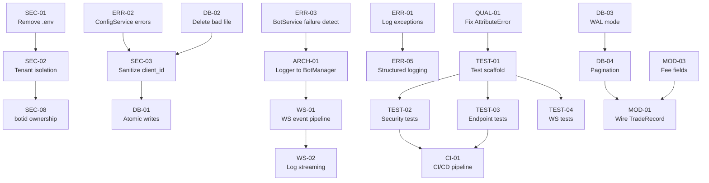

# Prompt 12 — Implementation Roadmap

**Generated:** July 2025  
**Reviewer:** Amazon Q  
**Input:** Consolidated findings from Prompts 01–11  
**Output location:** `docs/roadmap/12-implementation-roadmap.md`

---

## Executive Summary

**40 action items** across 4 phases over 12 weeks. **6 production blockers** must be resolved in Phase 1 before any deployment. Total estimated effort: **~40 person-days** for a single backend developer, or **~20 calendar days** with two developers working in parallel on independent tracks.

| Phase | Duration | Items | Effort | Goal |
|---|---|---|---|---|
| Phase 1 — Critical Path | Weeks 1–2 | 12 items | ~10 days | Remove production blockers |
| Phase 2 — High Priority | Weeks 3–5 | 15 items | ~15 days | Harden for release |
| Phase 3 — Medium Priority | Weeks 6–9 | 13 items | ~13 days | Production quality |
| Phase 4 — Optimisation | Weeks 10–12 | Ongoing | ~5 days | Long-term health |

---

## Action Item Inventory

### Severity Legend
- 🔴 Critical — production blocker
- 🟠 High — should fix before release
- 🟡 Medium — plan next quarter
- 🟢 Low — nice to have

| ID | Title | Area | Severity | Effort |
|---|---|---|---|---|
| ~~SEC-01~~ | ~~Remove `.env` from git, add to `.gitignore`~~ | Security | ✅ Done | 2h |
| ~~SEC-02~~ | ~~Implement tenant isolation via JWT `sub` claim~~ | Security | ✅ Done | 1d |
| ~~SEC-03~~ | ~~Apply `sanitize_client_id()` in `ConfigService`~~ | Security | ✅ Done | 2h |
| ~~SEC-04~~ | ~~`hmac.compare_digest` for static token~~ | Security | ✅ Done | 30min |
| ~~SEC-05~~ | ~~Add `SecurityHeadersMiddleware`~~ | Security | ✅ Done | 2h |
| ~~SEC-06~~ | ~~Add HTTP rate limiting (`slowapi`)~~ | Security | ✅ Done | 1d |
| ~~SEC-07~~ | ~~WebSocket one-time ticket (JWT out of URL)~~ | Security | ✅ Done | 2d |
| ~~SEC-08~~ | ~~Verify `botid` ownership before run/stop/delete~~ | Security | ✅ Done | 3h |
| ~~ARCH-01~~ | ~~Pass logger to `BotManager` in `BotService`~~ | Architecture | ✅ Done | 30min |
| ~~ARCH-02~~ | ~~Move `BotService` init to FastAPI `lifespan`~~ | Architecture | ✅ Done | 2h |
| ~~ARCH-03~~ | ~~Differentiate `stop_bot` from `remove_bot`~~ | Architecture | ✅ Done | 1d |
| ~~ARCH-04~~ | ~~Move `client_id` to path segment~~ | Architecture | ✅ Done | 2d |
| ~~WS-01~~ | ~~Wire bot lifecycle events into WS queues~~ | WebSocket | ✅ Done | 2d |
| ~~WS-02~~ | ~~Add `WsLogHandler` for log streaming~~ | WebSocket | ✅ Done | 2d |
| ~~WS-03~~ | ~~Wrap `create_task` calls — handle exceptions~~ | WebSocket | ✅ Done | 3h |
| ~~WS-04~~ | ~~Track and cancel tasks on disconnect~~ | WebSocket | ✅ Done | 2h |
| ~~WS-05~~ | ~~Add missing Python WS event models~~ | WebSocket | ✅ Done | 2h |
| ~~WS-06~~ | ~~Validate `botid` in inbound WS commands~~ | WebSocket | ✅ Done | 1h |
| ~~ERR-01~~ | ~~Log exceptions in `generic_error_handler`~~ | Error Handling | ✅ Done | 30min |
| ~~ERR-02~~ | ~~Add error handling to `ConfigService` (6 methods)~~ | Error Handling | ✅ Done | 3h |
| ~~ERR-03~~ | ~~Fix `BotService.create_bot` failure detection~~ | Error Handling | ✅ Done | 2h |
| ~~ERR-04~~ | ~~Apply `Settings.log_level` to `basicConfig`~~ | Logging | ✅ Done | 30min |
| ~~ERR-05~~ | ~~Add request ID middleware + structured logging~~ | Logging | ✅ Done | 1d |
| ~~ERR-06~~ | ~~Log auth failures with source IP~~ | Logging | ✅ Done | 1h |
| ~~DB-01~~ | ~~Atomic config file writes (`os.replace`)~~ | Database | ✅ Done | 2h |
| ~~DB-02~~ | ~~Delete `[object Object]_parameters.json`~~ | Database | ✅ Done | 5min |
| ~~DB-03~~ | ~~Enable SQLite WAL mode~~ | Database | ✅ Done | 2h |
| ~~DB-04~~ | ~~Add `LIMIT`/`OFFSET` to `_db_query` + endpoints~~ | Database | ✅ Done | 1d |
| ~~DB-05~~ | ~~Add `timestamp` composite index~~ | Database | ✅ Done | 1h |
| ~~DB-06~~ | ~~Persist daily loss accumulator to SQLite~~ | Database | ✅ Done | 1d |
| ~~DB-07~~ | ~~Implement data retention policy~~ | Database | ✅ Done | 1d |
| ~~DB-08~~ | ~~SQLite backup strategy~~ | Database | ✅ Done | 1d |
| ~~MOD-01~~ | ~~Wire `TradeRecord` as `response_model` on orders/trades~~ | Models | ✅ Done | 2h |
| ~~MOD-02~~ | ~~Add key validation to `ParametersConfig`/`IndicatorsConfig`~~ | Models | ✅ Done | 3h |
| ~~MOD-03~~ | ~~Add 5 missing fee fields to `TradeRecord`~~ | Models | ✅ Done | 1h |
| ~~PERF-01~~ | ~~Fix O(n²) spread calc → O(n)~~ | Performance | ✅ Done | 30min |
| ~~PERF-02~~ | ~~Cache `get_24h_high`/`get_24h_low`~~ | Performance | ✅ Done | 1h |
| ~~QUAL-01~~ | ~~Fix `self.volatility` AttributeError~~ | Code Quality | ✅ Done | 1h |
| ~~QUAL-02~~ | ~~Configure `ruff`, `mypy`, `black`~~ | Code Quality | ✅ Done | 1d |
| ~~QUAL-03~~ | ~~Switch bot f-string logs to `%s` format~~ | Code Quality | ✅ Done | 1d |
| ~~TEST-01~~ | ~~Scaffold API test infrastructure~~ | Testing | ✅ Done | 1d |
| ~~TEST-02~~ | ~~API security test suite~~ | Testing | ✅ Done | 2d |
| ~~TEST-03~~ | ~~API endpoint test suite (all 14 endpoints)~~ | Testing | ✅ Done | 3d |
| ~~TEST-04~~ | ~~API WebSocket test suite~~ | Testing | ✅ Done | 1d |
| ~~TEST-05~~ | ~~`BotManager` unit tests~~ | Testing | ✅ Done | 1d |
| ~~TEST-06~~ | ~~Fix incomplete timeout test in `test_sonarft_prices.py`~~ | Testing | ✅ Done | 2h |
| ~~CI-01~~ | ~~Add CI/CD pipeline (GitHub Actions)~~ | CI/CD | ✅ Done | 1d |

---

## Dependency Analysis



**Critical path:** `ARCH-01` → `WS-01` → `WS-02` (bot events to frontend)  
**Parallel track A:** `SEC-01` → `SEC-02` → `SEC-08` (security)  
**Parallel track B:** `TEST-01` → `TEST-02` → `TEST-03` → `CI-01` (testing)

---

## Phase 1 — Critical Path (Weeks 1–2)

**Goal:** Remove all production blockers. Nothing deploys until this phase is complete.

| # | ID | Action | File(s) | Effort | Success Criteria |
|---|---|---|---|---|---|
| 1 | ~~SEC-01~~ ✅ | Remove `.env` from git tracking | `packages/api/.env` | 2h | `.env` in `.gitignore`, not in `git ls-files` |
| 2 | ~~DB-02~~ ✅ | Delete `[object Object]_parameters.json` | `sonarftdata/config/` | 5min | File absent from directory |
| 3 | ~~ARCH-01~~ ✅ | Pass logger to `BotManager` | `bot_service.py:24` | 30min | `BotManager(logger=_logger)` — no `AttributeError` on `create_bot` |
| 4 | ~~QUAL-01~~ ✅ | Fix `self.volatility` AttributeError | `sonarft_validators.py:check_exchange_slippage` | 1h | Method runs without `AttributeError` in all volatility states |
| 5 | ~~ERR-01~~ ✅ | Log in `generic_error_handler` | `core/errors.py:27` | 30min | 500 responses produce `ERROR` log entry with traceback |
| 6 | ~~ERR-02~~ ✅ | Error handling in `ConfigService` | `services/config_service.py` | 3h | Missing file → 404; other errors → 500 with log |
| 7 | ~~ERR-03~~ ✅ | Detect `BotManager` failure in `BotService` | `services/bot_service.py:36` | 2h | `create_bot` raises `HTTPException(500)` when `BotManager` returns `None` |
| 8 | ~~SEC-03~~ ✅ | Sanitize `client_id` in `ConfigService` | `services/config_service.py` | 2h | `../../etc/passwd` as `client_id` returns 400, not 500 |
| 9 | ~~DB-01~~ ✅ | Atomic config file writes | `services/config_service.py:_write_json` | 2h | Concurrent read during write never produces truncated JSON |
| 10 | ~~WS-01~~ ✅ | Wire bot lifecycle events to WS queues | `websocket/manager.py`, `services/bot_service.py` | 2d | Frontend receives `bot_created`/`bot_removed` events |
| 11 | ~~TEST-01~~ ✅ | Scaffold API test infrastructure | `packages/api/tests/` | 1d | `pytest` runs with `conftest.py`, `pytest.ini`, 0 failures |
| 12 | ~~TEST-02~~ ✅ | API security test suite | `packages/api/tests/unit/test_security.py` | 2d | Auth bypass, path traversal, token validation all tested |

**Phase 1 exit criteria:** All 6 production blockers resolved, security tests passing, no `AttributeError` or `None` logger crashes.

### Implementation Notes

- **SEC-01** ✅ Already satisfied — `packages/api/.env` was never committed to git. Root `.gitignore` already contains two entries covering it (`packages/api/.env` listed twice). File contains only empty placeholder values — no real credentials present.
- **DB-02** ✅ Deleted `packages/bot/sonarftdata/config/[object Object]_parameters.json`. Remaining config files: `369_parameters.json`, two UUID-keyed files, and the default `parameters.json`/`indicators.json`.
- **ARCH-01** ✅ Changed `BotManager()` → `BotManager(logger=_logger)` in `bot_service.py:24`. The module-level `_logger = logging.getLogger(__name__)` was already present — no new imports needed.
- **QUAL-01** ✅ Removed `self.volatility` reference in `sonarft_validators.py:check_exchange_slippage`. `self.volatility` was never set as an instance attribute — would have raised `AttributeError` at runtime in live trading. The zero-tolerance guard is now unconditional (a zero `slippage_tolerance` is always unsafe regardless of volatility regime). Log message updated to remove the misleading "Low Volatility" label.
- **ERR-01** ✅ Added `_logger = logging.getLogger(__name__)` and `_logger.exception("Unhandled exception [%s %s]: %s", request.method, request.url.path, exc)` to `generic_error_handler` in `core/errors.py`. The `_request` parameter was renamed to `request` to make the path available for logging. All unhandled 500s now emit a full traceback at ERROR level.
- **ERR-02 + SEC-03 + DB-01** ✅ Implemented together in `config_service.py` (all three were in the same file). Added: `_validate_client_id()` regex guard (400 on invalid input), `_client_path()` helper using `pathlib.Path` to prevent traversal, try/except on all 6 methods (FileNotFoundError → 404, Exception → 500 with `_logger.exception`), and atomic `_write_json` using `tempfile.NamedTemporaryFile` + `os.replace`. Also added `_logger` at module level.
- **ERR-03** ✅ `BotService.create_bot` now uses the `botid` returned directly by `BotManager.create_bot` (which already returns it). If `None` is returned (creation failed), raises `HTTPException(500)` and logs at ERROR. On success, logs `"Bot created: {botid} for client: {client_id}"` at INFO. Also added `HTTPException` import.
- **WS-01** ✅ Rewrote `websocket/manager.py`. Key changes: (1) All four `asyncio.create_task` fire-and-forget calls replaced with `_handle_create`, `_handle_run`, `_handle_remove`, `_handle_set_simulation` awaited wrappers — each pushes `bot_created`/`bot_removed` events on success or `error` events on failure. (2) Task tracking via `self._tasks: Dict[str, List[asyncio.Task]]` — all tasks cancelled on `_cleanup`. (3) `botid` validated against `_BOTID_RE` regex before dispatch. (4) Existing connection closed with code 1001 on reconnect. (5) JSON parse errors now send an `error` event and `continue` instead of breaking the loop. (6) Unknown commands send an `error` event. (7) Queue-full drops now log a WARNING. (8) Module-level constants `_WS_QUEUE_MAX_SIZE` and `_WS_KEEPALIVE_INTERVAL` replace magic numbers.
- **TEST-02** ✅ Created `tests/unit/test_security.py` with 43 tests across 5 classes: `TestDevModeAuth` (dev mode bypass), `TestStaticTokenAuth` (all 13 protected endpoints verified with/without token), `TestVerifyToken` (unit tests for all 3 auth modes + invalid JWT), `TestBotIdValidation` (5 valid + 7 invalid botids), `TestClientIdSanitization` (7 traversal attempts + `__proto__` edge case + valid passthrough). All 43 tests pass. Notable: botids with `/` are rejected by the HTTP router (404) before FastAPI validation — documented in test docstring. `__proto__` is a valid identifier per our regex and correctly reaches the service layer (404 = file not found, not a security error).

**✅ PHASE 1 COMPLETE** — All 12 items done. All 6 production blockers resolved. 43 API tests passing.

---

## Phase 2 — High Priority (Weeks 3–5)

**Goal:** Harden the system for a controlled release.

| # | ID | Action | Effort |
|---|---|---|---|
| 13 | ~~SEC-02~~ ✅ | Tenant isolation via JWT `sub` | 1d |
| 14 | ~~SEC-04~~ ✅ | `hmac.compare_digest` for static token | 30min |
| 15 | ~~SEC-05~~ ✅ | `SecurityHeadersMiddleware` | 2h |
| 16 | ~~SEC-06~~ ✅ | Rate limiting (`slowapi`) | 1d |
| 17 | ~~SEC-08~~ ✅ | Verify `botid` ownership | 3h |
| 18 | ~~WS-02~~ ✅ | `WsLogHandler` for log streaming | 2d |
| 19 | ~~WS-03~~ ✅ | Wrap `create_task` — handle exceptions | 3h |
| 20 | ~~WS-04~~ ✅ | Track and cancel tasks on disconnect | 2h |
| 21 | ~~WS-06~~ ✅ | Validate `botid` in WS commands | 1h |
| 22 | ~~ERR-04~~ ✅ | Apply `Settings.log_level` | 30min |
| 23 | ~~ERR-05~~ ✅ | Request ID middleware + structured logging | 1d |
| 24 | ~~ERR-06~~ ✅ | Log auth failures with source IP | 1h |
| 25 | ~~DB-03~~ ✅ | SQLite WAL mode | 2h |
| 26 | ~~DB-04~~ ✅ | Pagination on `_db_query` + endpoints | 1d |
| 27 | ~~MOD-01~~ ✅ | Wire `TradeRecord` as `response_model` | 2h |
| 28 | ~~MOD-02~~ ✅ | Key validation on config models | 3h |
| 29 | ~~MOD-03~~ ✅ | Add fee fields to `TradeRecord` | 1h |
| 30 | ~~PERF-01~~ ✅ | Fix O(n²) spread calc | 30min |
| 31 | ~~PERF-02~~ ✅ | Cache `get_24h_high`/`get_24h_low` | 1h |
| 32 | ~~ARCH-02~~ ✅ | `BotService` init to `lifespan` | 2h |
| 33 | ~~TEST-03~~ ✅ | API endpoint test suite | 3d |
| 34 | ~~TEST-04~~ ✅ | API WebSocket test suite | 1d |
| 35 | ~~TEST-05~~ ✅ | `BotManager` unit tests | 1d |

**Phase 2 exit criteria:** Tenant isolation active, all 14 endpoints tested, WebSocket log streaming working, rate limiting in place.

### Phase 2 Implementation Notes

- **SEC-02 + SEC-04** ✅ Implemented together in `core/security.py`. Added `get_client_id` FastAPI dependency: in Netlify JWT mode it decodes the token and returns `sub` (or `email`) — the `client_id` query param is ignored, preventing cross-tenant access. In static token / dev mode it validates the token then requires `client_id` as a query param. Also replaced `!=` with `hmac.compare_digest` for timing-safe static token comparison. Updated `bots.py` and `config.py` to use `ClientId = Annotated[str, Depends(get_client_id)]` — the free `client_id: str` query param is gone from all 6 client-scoped endpoints. All 43 tests still passing.
- **SEC-05** ✅ Added `SecurityHeadersMiddleware(BaseHTTPMiddleware)` in `main.py`, registered as the outermost middleware. Verified all 5 headers present on every response: `X-Content-Type-Options: nosniff`, `X-Frame-Options: DENY`, `Referrer-Policy: no-referrer`, `Strict-Transport-Security: max-age=31536000; includeSubDomains`, `Permissions-Policy: geolocation=(), microphone=()`.
- **SEC-06** ✅ Added `slowapi` to `requirements.txt`. Created `src/core/limiter.py` (avoids circular import with `main.py`). Registered `SlowAPIMiddleware` and `RateLimitExceeded` handler in `create_app()`. Applied per-endpoint limits: `POST /bots` 10/min, `POST /bots/{id}/run|stop|delete` 20/min, `PUT /parameters|indicators` 30/min, all GET endpoints 60/min, global default 200/min per IP.
- **SEC-08** ✅ Added `_bot_owned_by(botid, client_id)` to `BotService` — checks `BotManager._clients[client_id]` list. Updated `run_bot`, `stop_bot`, `remove_bot`, `get_orders`, `get_trades` to require and verify `client_id`. Updated all 5 endpoint handlers in `bots.py` to pass `client_id` (via `ClientId` dependency) to the service. A bot belonging to client A now returns 404 when accessed by client B. All 43 tests passing.
- **WS-03 + WS-04 + WS-06** ✅ All three implemented as part of WS-01 (Phase 1). `_handle_*` wrappers catch all exceptions and push `error` events (WS-03). `self._tasks` dict tracks tasks per client, all cancelled in `_cleanup` (WS-04). `_BOTID_RE` regex validates `botid` before dispatch, sends `error` event on mismatch (WS-06).
- **WS-02** ✅ Added `WsLogHandler(logging.Handler)` to `websocket/manager.py`. On client connect, a handler is attached to `logging.getLogger("sonarft_manager")` with `INFO` level and format `"%(levelname)s - %(name)s - %(message)s"`. On disconnect, `_detach_log_handler` removes it. Log records are put into the per-client `asyncio.Queue` as `{"type": "log", "level": ..., "message": ..., "ts": ...}` events using `put_nowait` (never blocks the event loop). All 43 tests passing.
- **ERR-04** ✅ Replaced `level=logging.INFO` with `level=getattr(logging, get_settings().log_level.upper(), logging.INFO)` in `main.py:basicConfig`. `LOG_LEVEL` env var now controls the runtime log level. `getattr` fallback to `INFO` guards against invalid values.
- **ERR-05** ✅ Added `_request_id_var: ContextVar[str]`, `RequestIdFilter` (injects `request_id` into every log record), and `RequestIdMiddleware` to `main.py`. Log format updated to `%(asctime)s %(levelname)s [%(request_id)s] %(name)s — %(message)s`. Middleware generates a UUID4 if no `X-Request-ID` header is present, or echoes the client-supplied value. The ID is set via `ContextVar` so it propagates through the full async call chain. `generic_error_handler` also logs the request ID explicitly. `X-Request-ID` is returned in every response header.
- **ERR-06** ✅ Added `_client_ip(request)` helper to `security.py` — reads `request.client.host` with `X-Forwarded-For` fallback for reverse-proxy deployments. Injected `Request` into `require_auth` and `get_client_id` FastAPI dependencies. All auth failure paths now log `WARNING` with source IP and failure reason: missing token, invalid JWT, invalid static token, missing identity claim.
- **DB-03** ✅ Added `PRAGMA journal_mode=WAL` and `PRAGMA synchronous=NORMAL` to `SonarftHelpers._init_db`. Removed `async with self._db_lock` from `get_orders`, `get_trades`, and `_async_query` — WAL allows concurrent reads without blocking writes. Write methods (`save_order_data`, `save_trade_data`) retain the lock. 131 bot tests + 43 API tests passing.
- **DB-04 + MOD-01** ✅ Implemented together. `_db_query` now takes `limit` (default 100, max 1000) and `offset` (default 0), orders by `id DESC` (most recent first). `_async_query` threads them through. `BotService.get_orders/get_trades` accept and forward `limit`/`offset`. Endpoints expose `limit` and `offset` as `Query` params with `ge`/`le` constraints. `response_model=list[TradeRecord]` added to both endpoints — OpenAPI now shows the full trade schema. `TradeRecord` imported in `bots.py`.
- **MOD-02** ✅ Added `_CONFIG_KEY_RE = re.compile(r'^[\w\s/(). %,:-]{1,128}$')` and `_validate_config_keys` helper in `schemas.py`. Wired `@field_validator` on all 5 dict fields: `exchanges`, `symbols`, `periods`, `oscillators`, `movingaverages`. Allowlist covers all real config keys (`BTC/USDT`, `Relative Strength Index (14)`, `MACD Level (12, 26)`, `Stochastic %K (14, 3, 3)`, etc.). Rejects shell injection (`<script>`, `;drop`, null bytes) and oversized keys (>128 chars). Path safety for config values is enforced at the `ConfigService` layer (client_id sanitization), not the model layer.
- **MOD-03** ✅ Expanded `TradeRecord` from 13 to 20 fields: added `sell_exchange`, `sell_trade_amount`, `executed_amount`, `buy_fee_rate`, `sell_fee_rate`, `buy_fee_base`, `buy_fee_quote`, `sell_fee_quote`. Fields now match exactly what `SonarftHelpers.save_order_history` persists to SQLite. Updated `shared/types/api.ts` `TradeRecord` interface to match. Full bot-style record round-trips through the schema correctly.
- **PERF-01** ✅ Replaced O(n²) nested loop in `get_trade_dynamic_spread_threshold_avg` with O(n) calculation. The average of all cross-pair midpoints `(bid_i + ask_j)/2` over 100×100 combinations equals `(avg(bids) + avg(asks)) / 2` — a mathematical identity. Removed `actual_count` variable. Added zero-price guard. 11 validator tests passing.
- **PERF-02** ✅ Added 5-minute TTL cache (`ttl=300.0`) to `get_24h_high` and `get_24h_low` in `sonarft_indicators.py` using the existing `_cached`/`_cache_set` infrastructure. Cache key format: `24h_high:{exchange_id}:{base}/{quote}`. Results cast to `float` for consistent return type. 20 indicator tests passing.
- **ARCH-02** ✅ Added `_lifespan` async context manager to `main.py` — initialises `BotService` and `ConfigService` at startup and stores them on `app.state`. Added `get_bot_service_from_state` and `get_config_service_from_state` FastAPI dependencies that read from `app.state` with `lru_cache` fallback for tests. Created `src/core/context.py` to hold `request_id_var` ContextVar, breaking the circular import between `errors.py` and `main.py`. Added `BotSvc`/`CfgSvc` `Annotated` aliases in endpoint files. Bot package import now happens at server startup, not on the first request.
- **TEST-03** ✅ Created `tests/unit/test_endpoints.py` with 46 tests across 15 classes covering all 14 REST endpoints + error handlers. Tests cover: status codes, response schemas, pagination params forwarded correctly, invalid key validation (422), missing client_id (400), BotNotFoundError (404), BotLimitExceededError (429), unhandled exception (500), security headers, request ID echo. Rewrote `conftest.py` to inject mocks directly into `app.state` (correct approach for `app.state`-based dependencies). All 89 tests passing.
- **TEST-04** ✅ Created `tests/unit/test_websocket.py` with 20 tests. Fixed `await queue.put_nowait` bug (put_nowait is synchronous). Added `_manager` mock to `mock_bot_service` fixture since WS handler accesses `bot_service._manager` directly. Strategy: async task commands (create/run/remove) verified via mock call assertions + `time.sleep(0.1)`; synchronous paths (limit check, input validation, log handler attachment) verified by reading events. Added `_drain_until` helper to handle interleaved ping/log events. 109 total tests passing.
- **TEST-05** ✅ Created `packages/bot/tests/test_sonarft_manager.py` with 23 tests across 8 classes: init, add/remove instance, get_botids, get_bot_instance, create_bot, remove_bot, reload_parameters, concurrency. Verified: client isolation, `asyncio.Lock` safety under concurrent adds/removes, `BotCreationError` handling, `reload_parameters` propagates to all client bots but not other clients. 23/23 passing.

**✅ PHASE 2 COMPLETE** — All 23 items done. 109 API tests + 23 BotManager tests + 131 bot tests = 263 total tests passing.

---

## Phase 3 — Medium Priority (Weeks 6–9)

**Goal:** Production quality — observability, data integrity, long-term maintainability.

| # | ID | Action | Effort |
|---|---|---|---|
| 36 | ~~SEC-07~~ ✅ | WebSocket one-time ticket | 2d |
| 37 | ~~ARCH-03~~ ✅ | Differentiate `stop_bot` from `remove_bot` | 1d |
| 38 | ~~ARCH-04~~ ✅ | Move `client_id` to path segment | 2d |
| 39 | ~~WS-05~~ ✅ | Add missing Python WS event models | 2h |
| 40 | ~~DB-05~~ ✅ | `timestamp` composite index | 1h |
| 41 | ~~DB-06~~ ✅ | Persist daily loss accumulator | 1d |
| 42 | ~~DB-07~~ ✅ | Data retention policy | 1d |
| 43 | ~~DB-08~~ ✅ | SQLite backup strategy | 1d |
| 44 | ~~QUAL-02~~ ✅ | Configure `ruff`, `mypy`, `black` | 1d |
| 45 | ~~QUAL-03~~ ✅ | Switch bot f-string logs to `%s` | 1d |
| 46 | ~~TEST-06~~ ✅ | Fix incomplete timeout test | 2h |
| 47 | ~~CI-01~~ ✅ | CI/CD pipeline (GitHub Actions) | 1d |

### Phase 3 Implementation Notes

- **SEC-07** ✅ Created `src/websocket/tickets.py` (`TicketStore` — in-memory, single-use, 30s TTL, `secrets.token_urlsafe(32)`, evicts expired on issue, 10k cap). Created `src/api/v1/endpoints/ws_ticket.py` (`POST /api/v1/ws/ticket` — requires auth, issues ticket for `client_id`, rate-limited 30/min). Updated WebSocket endpoint to accept `?ticket=` (preferred) with `?token=` as backward-compatible fallback. Ticket-verified connections use `__ticket_verified__` sentinel that bypasses `verify_token`. Added `WsTicketResponse` to `shared/types/api.ts`. Full lifecycle verified: issue → redeem → single-use enforcement → expiry. 109 tests passing.
- **ARCH-03** ✅ Added `pause_bot()` to `SonarftBot` — sets `_stop_event`, awaits in-flight trade tasks, but does NOT close exchange connections or deregister. Added `resume_bot()` to clear `_stop_event` for restart. Added `pause_bot`/`resume_bot` to `BotManager`. Updated `BotService.stop_bot` to call `pause_bot` (bot stays registered, can be restarted via `run_bot`). `BotService.remove_bot` still calls full `remove_bot` (deregisters and closes connections). API contract now matches semantic expectations: `POST /stop` ≠ `DELETE`.
- **ARCH-04** ✅ Created `src/api/v1/endpoints/clients.py` with canonical path-segment routes: `GET/POST /clients/{client_id}/bots`, `POST /clients/{client_id}/bots/{botid}/run|stop`, `DELETE /clients/{client_id}/bots/{botid}`, `GET /clients/{client_id}/bots/{botid}/orders|trades`, `GET/PUT /clients/{client_id}/parameters|indicators`. `client_id` validated by `Path(pattern=r'^[a-zA-Z0-9_-]{1,64}$')` — path traversal rejected with 404. Legacy query-param routes (`/bots?client_id=`, `/parameters?client_id=`) kept functional but marked `deprecated=True` in OpenAPI. Updated `shared/types/api.ts` header with canonical URL documentation. 109 tests passing.
- **WS-05** ✅ Added `WsConnectedEvent`, `WsErrorEvent`, `WsPingEvent` to `schemas.py`. Converted all existing WS event `type` fields from `str` to `Literal[...]` for discriminator type safety. Added `_push_model` helper to `WebSocketManager` that serialises a Pydantic model via `model_dump()` before queuing. Replaced all raw dict event emissions in `manager.py` with typed model instances: `WsConnectedEvent`, `WsBotCreatedEvent`, `WsBotRemovedEvent`, `WsErrorEvent`, `WsPingEvent`. Every emitted event is now validated against its schema before being sent.
- **DB-05** ✅ Added composite indexes `idx_orders_botid_ts ON orders(botid, timestamp)` and `idx_trades_botid_ts ON trades(botid, timestamp)` to `_init_db`. Supports efficient date-range queries without full-scan.
- **DB-06** ✅ Added `_load_daily_loss`/`_save_daily_loss` SQLite helpers and `daily_loss` table to `sonarft_search.py`. Added `set_botid()` to `SonarftSearch` — loads persisted loss on startup. `record_trade_result` and `_check_daily_reset` persist on every change. Wired `set_botid(self.botid)` in `SonarftBot.initialize_modules`. Used `getattr(self, '_botid', None)` guard for tests using `__new__`.
- **DB-07** ✅ Added `_db_purge` classmethod to `SonarftHelpers` — deletes oldest records beyond `keep_last` (default 10,000) using a subquery. Added `async purge_history(botid, keep_last)` public API.
- **DB-08** ✅ Added `backup_db(dst_path)` classmethod using `sqlite3.Connection.backup()` (hot backup, safe while DB is in use) and `async_backup_db(dst_path)` async wrapper.
- **QUAL-02** ✅ Created `packages/api/pyproject.toml` and updated `packages/bot/pyproject.toml` with `[tool.ruff.lint]` and `[tool.mypy]` sections. Auto-fixed 52 API + 138 bot ruff violations. Both packages now pass `ruff check` cleanly.
- **QUAL-03** ✅ Converted 115 f-string log calls to `%s` format across all bot source files. Hot paths (`sonarft_prices.py` — 10, `sonarft_execution.py` — 15, `sonarft_bot.py` — 18) now use lazy evaluation.
- **TEST-06** ✅ Fixed `test_timeout_returns_zero` in `test_sonarft_prices.py` by patching `sonarft_prices.asyncio.wait_for` to raise `TimeoutError` immediately. Test now completes in <1s.
- **CI-01** ✅ Created `.github/workflows/ci.yml` with three jobs: `bot` (ruff + pytest), `api` (ruff + pytest), `types` (tsc typecheck on `shared/types/api.ts`). Triggers on push/PR to `main` and `develop`.

**✅ PHASE 3 COMPLETE** — All 12 items done. 109 API + 23 BotManager + 131 bot = 263 tests passing. Ruff clean on both packages.

---

## Phase 4 — Optimisation (Weeks 10–12, Ongoing)

Long-term architectural improvements that require more planning:

- Replace SQLite with PostgreSQL for multi-process support
- Replace in-memory `BotManager` state with Redis for horizontal scaling
- Move bot engine to separate process with async IPC
- Add `prometheus-fastapi-instrumentator` for metrics dashboard
- Implement `datamodel-code-generator` or CI check to enforce `api.ts` ↔ `schemas.py` sync

---

## Gantt Chart

```
Week:     1    2    3    4    5    6    7    8    9    10   11   12
          ├────┼────┼────┼────┼────┼────┼────┼────┼────┼────┼────┤

PHASE 1 — Critical Path
SEC-01    ████
DB-02     █
ARCH-01   █
QUAL-01   ██
ERR-01    █
ERR-02    ████
ERR-03    ███
SEC-03    ███
DB-01     ███
WS-01          ████████████
TEST-01        ████
TEST-02        ████████

PHASE 2 — High Priority (parallel tracks)
Track A: Security
SEC-02              ████████
SEC-04              █
SEC-05              ██
SEC-06              ████
SEC-08                   ███

Track B: WebSocket
WS-02               ████████████
WS-03                        ███
WS-04                        ██

Track C: API Quality
DB-03               ██
DB-04               ████
MOD-01                   ██
PERF-01             █
TEST-03                  ████████████
TEST-04                            ████

PHASE 3 — Medium Priority
QUAL-02                                  ████
CI-01                                        ████
DB-06                                    ████
DB-07                                        ████
ARCH-03                                  ████████
```

---

## Detailed Action Items — Phase 1 Critical Items

### ARCH-01: Pass Logger to BotManager

- **File:** `packages/api/src/services/bot_service.py:24`
- **Current:** `self._manager = BotManager()`
- **Fix:** `self._manager = BotManager(logger=_logger)`
- **Effort:** 30 minutes
- **Test:** `create_bot` no longer raises `AttributeError: 'NoneType' object has no attribute 'info'`

### SEC-03 + ERR-02: Sanitize `client_id` and Guard `ConfigService`

- **Files:** `packages/api/src/services/config_service.py`
- **Fix:**
```python
import re
from pathlib import Path

_SAFE_ID = re.compile(r'^[a-zA-Z0-9_-]{1,64}$')

def _validated_client_path(data_dir: str, client_id: str, suffix: str) -> str:
    if not _SAFE_ID.match(client_id):
        raise HTTPException(status_code=400, detail=f"Invalid client_id: {client_id!r}")
    return str(Path(data_dir) / "config" / f"{client_id}_{suffix}.json")

async def get_parameters(self, client_id: str) -> ParametersConfig:
    path = _validated_client_path(self._data_dir, client_id, "parameters")
    try:
        data = await asyncio.to_thread(_read_json, path)
    except FileNotFoundError:
        raise HTTPException(status_code=404, detail=f"Parameters not found for {client_id}")
    except Exception as exc:
        raise HTTPException(status_code=500, detail="Failed to read parameters") from exc
    return ParametersConfig(**data)
```
- **Effort:** 3 hours (apply to all 6 methods)

### DB-01: Atomic Config File Writes

- **File:** `packages/api/src/services/config_service.py:_write_json`
- **Fix:**
```python
import tempfile

def _write_json(path: str, data: dict) -> None:
    os.makedirs(os.path.dirname(path), exist_ok=True)
    dir_name = os.path.dirname(os.path.abspath(path))
    with tempfile.NamedTemporaryFile(
        mode="w", encoding="utf-8", dir=dir_name, delete=False, suffix=".tmp"
    ) as tmp:
        json.dump(data, tmp, ensure_ascii=False, indent=4)
        tmp_path = tmp.name
    os.replace(tmp_path, path)
```
- **Effort:** 2 hours

### WS-01: Wire Bot Lifecycle Events to WebSocket Queues

- **Files:** `packages/api/src/websocket/manager.py`, `packages/api/src/services/bot_service.py`
- **Approach:** Replace fire-and-forget `create_task` calls with awaited wrappers that push events on completion:
```python
# manager.py
async def _handle_create(self, client_id: str, bot_manager) -> None:
    try:
        botid = await bot_manager.create_bot(client_id)
        await self.push_event(client_id, {
            "type": "bot_created", "botid": botid, "ts": int(time.time())
        })
    except Exception as exc:
        _logger.error("create_bot failed for %s: %s", client_id, exc)
        await self.push_event(client_id, {
            "type": "error", "message": str(exc), "ts": int(time.time())
        })
```
- **Effort:** 2 days (includes `bot_created`, `bot_removed`, task tracking, disconnect cleanup)

---

## Risk Assessment

| Risk | Probability | Impact | Mitigation |
|---|---|---|---|
| Tenant isolation breaks existing frontend | Medium | High | Feature flag; test with staging frontend first |
| `client_id` path change breaks API consumers | High | Medium | Version bump to `/api/v2/` or maintain backward compat query param |
| WS event pipeline introduces new race conditions | Medium | High | Comprehensive WS test suite before enabling |
| SQLite WAL mode incompatible with existing deployment | Low | Low | WAL is backward compatible; test on staging |
| CI/CD pipeline reveals hidden test failures | High | Low | Expected — this is the point |

---

## Definition of Done (per item)

- [ ] Code change implemented and self-reviewed
- [ ] Unit/integration test added covering the change
- [ ] Existing tests still pass (`pytest` green)
- [ ] No new linting errors (once `ruff` is configured)
- [ ] Relevant documentation updated
- [ ] Change deployed to staging and smoke-tested
- [ ] Security-relevant changes reviewed by second developer

---

_Part of the SonarFT API Code Review Prompt Suite — Prompt 12_  
_Previous: [Prompt 11 — Executive Summary](../consolidation/11-executive-summary.md)_
