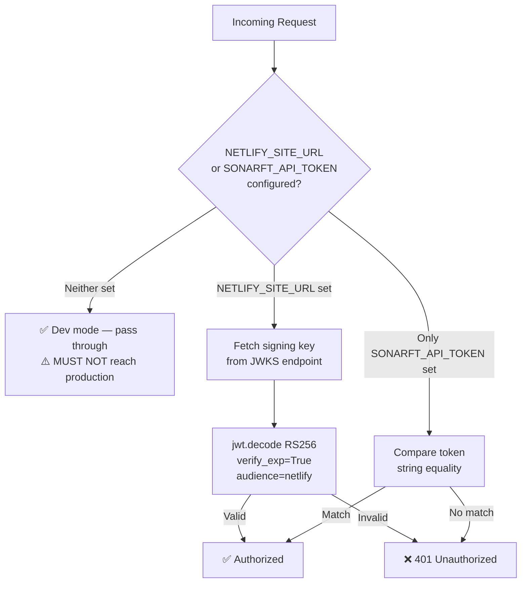

# Prompt 04 — Authentication, Security & Authorization Review

**Generated:** July 2025  
**Reviewer:** Amazon Q (Senior Security Auditor / FastAPI / JWT)  
**Source files inspected:**
- `packages/api/src/core/security.py`
- `packages/api/src/core/config.py`
- `packages/api/src/main.py`
- `packages/api/src/websocket/manager.py`
- `packages/api/src/services/config_service.py`
- `packages/api/src/services/bot_service.py`
- `packages/api/src/api/v1/endpoints/` (all three routers)
- `packages/api/.env`, `packages/api/.env.example`
- `packages/bot/sonarft_api_manager.py` (exchange key handling)

**Output location:** `docs/security/04-authentication-security.md`

---

## Executive Summary

The SonarFT API implements a pragmatic three-mode authentication strategy: Netlify Identity JWT (RS256 + JWKS), static bearer token fallback, and open dev mode. The JWT implementation is technically correct — RS256 algorithm, expiry enforcement, JWKS key rotation support. However, five security issues require immediate attention before production deployment: the `.env` file containing auth credentials is committed to the repository; there is no tenant isolation — any authenticated user can read or modify any other client's configuration by supplying a different `client_id` query parameter; `ConfigService` constructs file paths from unsanitized `client_id` input enabling path traversal; the WebSocket token is passed as a URL query parameter (logged by proxies and servers); and there are no security headers beyond CORS. Exchange API keys are handled entirely within the bot package and never transit the API layer, which is a significant security strength.

---

## Security Score Card

| Area | Status | Score |
|---|---|---|
| JWT algorithm (RS256) | ✅ Secure | 5/5 |
| JWT expiry enforcement | ✅ Enforced | 5/5 |
| JWKS key rotation support | ✅ Supported | 5/5 |
| Static token fallback | ⚠️ Acceptable for dev, weak for prod | 3/5 |
| Dev mode (no auth) | ⚠️ Intentional but must not reach prod | 2/5 |
| Tenant isolation (client_id) | ❌ Not enforced | 0/5 |
| Path traversal prevention | ❌ Not implemented in ConfigService | 0/5 |
| WebSocket token transport | ⚠️ URL query param — logged by proxies | 2/5 |
| `.env` in repository | ❌ Credentials file committed | 0/5 |
| Security headers (HSTS, CSP, etc.) | ❌ Not implemented | 0/5 |
| Rate limiting | ❌ Not implemented | 0/5 |
| Exchange key isolation | ✅ Keys never reach API layer | 5/5 |
| Input sanitization (botid) | ✅ Regex pattern on all path params | 5/5 |
| Error information disclosure | ✅ Generic 500 message | 4/5 |
| Dependency versions | ✅ Recent versions (FastAPI 0.135, PyJWT 2.7+) | 4/5 |

**Overall security posture: Medium — solid JWT foundation, critical gaps in authorization and input handling.**

---

## 1. Authentication Mechanism

### JWT Implementation (`core/security.py`)

```python
# security.py:20-27
_jwks_client: Optional[PyJWKClient] = None

def _get_jwks_client() -> Optional[PyJWKClient]:
    global _jwks_client
    if _jwks_client is None:
        settings = get_settings()
        if settings.netlify_site_url:
            url = f"{settings.netlify_site_url.rstrip('/')}/.netlify/identity/keys"
            _jwks_client = PyJWKClient(url)
```

| JWT Property | Implementation | Assessment |
|---|---|---|
| Algorithm | RS256 (asymmetric) | ✅ Secure — cannot be forged without private key |
| Expiry (`verify_exp`) | `options={"verify_exp": True}` | ✅ Enforced |
| Audience | `audience="netlify"` | ✅ Prevents token reuse from other services |
| JWKS rotation | `PyJWKClient` fetches keys dynamically | ✅ Supports key rotation |
| Token generation | ❌ Not implemented in API | ✅ Correct — Netlify Identity handles issuance |
| Token refresh | ❌ Not implemented | ✅ Correct — handled by Netlify Identity client |
| Token revocation | ❌ Not implemented | ⚠️ No blocklist — compromised tokens valid until expiry |

### Three-Mode Auth Flow



### Static Token Weakness

The `SONARFT_API_TOKEN` fallback uses direct string equality (`token != settings.sonarft_api_token`). This is vulnerable to timing attacks — an attacker can measure response time differences to guess the token character by character. For a trading system, `hmac.compare_digest` should be used:

```python
# security.py — current (vulnerable)
if settings.sonarft_api_token and token != settings.sonarft_api_token:
    raise HTTPException(status_code=401, detail="Unauthorized")

# Recommended
import hmac
if settings.sonarft_api_token and not hmac.compare_digest(
    token.encode(), settings.sonarft_api_token.encode()
):
    raise HTTPException(status_code=401, detail="Unauthorized")
```

---

## 2. Secret Management

### `.env` File Committed to Repository — CRITICAL

```
# packages/api/.env (committed file)
NETLIFY_SITE_URL=
SONARFT_API_TOKEN=
```

The `.env` file is present in the repository. Even though the values are currently empty, the file itself should not be committed — only `.env.example` should be tracked. If a developer adds real credentials to `.env` and commits, those secrets enter version history permanently.

**Immediate action required:**
1. Add `.env` to `.gitignore`
2. Verify `.env` is not in git history: `git log --all --full-history -- packages/api/.env`
3. If it was ever committed with real values, rotate all credentials immediately

### Exchange API Keys

Exchange API keys (`apiKey`, `secret`, `password`) are set via `SonarftApiManager.set_api_keys()` in `packages/bot/sonarft_api_manager.py:84-89`. These keys are loaded from the bot's config files (`sonarftdata/config_exchanges.json`) and never transit the API layer. The API has no endpoint that accepts or returns exchange credentials. This is a strong security design.

### Settings Isolation

`Settings` uses `pydantic-settings` with `env_file=".env"` and `extra="ignore"`. Secrets are never logged — `get_settings()` is called internally and the `Settings` object is not serialized to any response. This is correct.

---

## 3. Authorization & Access Control — CRITICAL GAP

### No Tenant Isolation

This is the most critical authorization vulnerability in the system. The API authenticates users (valid token = access granted) but does not authorize them to specific resources. Any authenticated user can access any other client's data by supplying a different `client_id`:

```python
# bots.py:18-21 — client_id is a free query parameter
@router.get("", response_model=BotListResponse)
async def list_bots(
    client_id: str,       # ← Any authenticated user can supply any client_id
    _: Auth,
    service: BotService = Depends(get_bot_service),
) -> BotListResponse:
```

The same gap exists on all six `client_id`-scoped endpoints:
- `GET /bots?client_id=` — list another user's bots
- `POST /bots?client_id=` — create bots under another user's account
- `GET /parameters?client_id=` — read another user's trading parameters
- `PUT /parameters?client_id=` — overwrite another user's trading parameters
- `GET /indicators?client_id=` — read another user's indicator settings
- `PUT /indicators?client_id=` — overwrite another user's indicator settings

**Impact:** A malicious authenticated user can modify another user's trading parameters mid-trade, potentially causing financial loss.

### Authorization Matrix (Current vs Required)

| Action | Current | Required |
|---|---|---|
| List own bots | ✅ Any auth token | ✅ Token's `sub` must match `client_id` |
| List other user's bots | ✅ Allowed (bug) | ❌ Must be denied |
| Modify own parameters | ✅ Any auth token | ✅ Token's `sub` must match `client_id` |
| Modify other user's parameters | ✅ Allowed (bug) | ❌ Must be denied |
| Run/stop/delete bot by ID | ✅ Any auth token | ⚠️ Should verify bot belongs to token's client |
| Read order/trade history | ✅ Any auth token | ⚠️ Should verify bot belongs to token's client |

### Remediation

Extract `client_id` from the JWT `sub` claim rather than accepting it as a parameter:

```python
# core/security.py — add claim extraction
def get_client_id(
    credentials: HTTPAuthorizationCredentials = Depends(_bearer),
) -> str:
    """Extract and return the client_id from the JWT sub claim."""
    settings = get_settings()
    if not settings.netlify_site_url and not settings.sonarft_api_token:
        # Dev mode — require explicit client_id header or use a default
        raise HTTPException(status_code=400, detail="client_id required in dev mode")
    token = credentials.credentials if credentials else None
    if not token:
        raise HTTPException(status_code=401, detail="Unauthorized")
    client = _get_jwks_client()
    if client:
        signing_key = client.get_signing_key_from_jwt(token)
        payload = jwt.decode(token, signing_key.key, algorithms=["RS256"], audience="netlify")
        return payload.get("sub") or payload.get("email")
    # Static token mode — client_id must come from a separate header
    raise HTTPException(status_code=400, detail="client_id cannot be derived from static token")
```

---

## 4. Path Traversal Vulnerability — HIGH

As identified in Prompt 03, `ConfigService` constructs file paths by interpolating `client_id` directly:

```python
# config_service.py:35
path = f"{self._data_dir}/config/{client_id}_parameters.json"
```

A `client_id` of `../../etc/passwd` (or `../config_exchanges`) would resolve to an arbitrary path on the filesystem. The bot package has `sanitize_client_id()` in `sonarft_helpers.py` that strips non-alphanumeric characters — this function must be applied in `ConfigService` before any path construction:

```python
# config_service.py — add at top
from pathlib import Path
import re

_SAFE_ID = re.compile(r'^[a-zA-Z0-9_-]{1,64}$')

def _safe_path(data_dir: str, *parts: str) -> Path:
    for part in parts:
        if not _SAFE_ID.match(part):
            raise ValueError(f"Invalid path component: {part!r}")
    return Path(data_dir).joinpath(*parts)
```

---

## 5. WebSocket Token Transport — MEDIUM

```python
# main.py:60-65
@app.websocket(f"{prefix}/ws/{{client_id}}")
async def websocket_endpoint(
    websocket: WebSocket,
    client_id: str,
    token: Optional[str] = None,   # ← Token in URL query string
) -> None:
```

The WebSocket token is passed as `?token=<jwt>` in the URL. This means:
- The full JWT appears in server access logs, proxy logs, and browser history
- Referrer headers may leak the token to third-party resources
- The token is visible in the browser's network inspector URL bar

WebSocket authentication cannot use the `Authorization` header during the initial handshake (browser WebSocket API limitation). The standard mitigation is a short-lived one-time ticket:

1. Client calls `POST /api/v1/ws/ticket` with their Bearer token → receives a single-use, short-lived (30s) opaque ticket
2. Client connects to `ws://.../{client_id}?ticket=<opaque-ticket>`
3. Server validates the ticket (checks it exists, hasn't been used, hasn't expired) and exchanges it for the client identity

This keeps the JWT out of URLs entirely.

---

## 6. HTTP Security Headers — MEDIUM

The API only sets CORS headers. No other security headers are configured:

| Header | Status | Risk |
|---|---|---|
| `Strict-Transport-Security` (HSTS) | ❌ Missing | Downgrade attacks if served over HTTP |
| `X-Content-Type-Options: nosniff` | ❌ Missing | MIME sniffing attacks |
| `X-Frame-Options: DENY` | ❌ Missing | Clickjacking (low risk for API) |
| `Content-Security-Policy` | ❌ Missing | Low risk for pure JSON API |
| `Referrer-Policy` | ❌ Missing | Token leakage via Referer header |
| `Permissions-Policy` | ❌ Missing | Low risk for API |

### CORS Configuration

```python
# main.py:40-47
app.add_middleware(
    CORSMiddleware,
    allow_origins=settings.allowed_origins,   # ✅ Explicit list, not "*"
    allow_credentials=True,
    allow_methods=["GET", "POST", "PUT", "DELETE"],  # ✅ Explicit methods
    allow_headers=["Authorization", "Content-Type"], # ✅ Explicit headers
)
```

CORS is correctly configured — no wildcard origins, explicit method and header allowlists. The default `cors_origins` in `Settings` includes `http://localhost:3000,http://localhost:5173` which is appropriate for development. Production deployment must override this via `CORS_ORIGINS` env var.

### Recommended Security Middleware

```python
# main.py — add after CORSMiddleware
from starlette.middleware.base import BaseHTTPMiddleware
from starlette.requests import Request

class SecurityHeadersMiddleware(BaseHTTPMiddleware):
    async def dispatch(self, request: Request, call_next):
        response = await call_next(request)
        response.headers["X-Content-Type-Options"] = "nosniff"
        response.headers["X-Frame-Options"] = "DENY"
        response.headers["Referrer-Policy"] = "no-referrer"
        response.headers["Strict-Transport-Security"] = "max-age=31536000; includeSubDomains"
        return response

app.add_middleware(SecurityHeadersMiddleware)
```

---

## 7. Rate Limiting — MEDIUM

No rate limiting is implemented at the HTTP layer. Critical endpoints that should be rate-limited:

| Endpoint | Risk | Recommended Limit |
|---|---|---|
| `POST /bots` | Bot spam creation | 10/minute per client |
| `POST /bots/{botid}/run` | Rapid start/stop cycling | 20/minute per client |
| `PUT /parameters` | Config flooding | 30/minute per client |
| `PUT /indicators` | Config flooding | 30/minute per client |
| All endpoints | DDoS | 100/minute per IP |

The bot-count cap (`max_bots_per_client`) provides some protection against bot creation spam but does not protect against rapid run/stop cycling or config flooding.

---

## 8. Input Validation Summary

| Input | Validation | Assessment |
|---|---|---|
| `botid` (path param) | ✅ `Path(pattern=r"^[a-zA-Z0-9_-]{1,64}$")` | Secure |
| `client_id` (query param) | ❌ No validation | Path traversal risk |
| `ParametersConfig` body | ❌ Dict keys unvalidated | Arbitrary key injection |
| `IndicatorsConfig` body | ❌ Dict keys unvalidated | Arbitrary key injection |
| WebSocket `key` field | ❌ No validation beyond string comparison | Low risk |
| WebSocket `botid` field | ❌ No pattern validation | Should match botid regex |
| WebSocket `value` field (`set_simulation`) | ⚠️ `event.get("value", True)` — any truthy value accepted | Low risk |

---

## 9. Error Information Disclosure

```python
# errors.py:27
async def generic_error_handler(_request: Request, exc: Exception) -> JSONResponse:
    return JSONResponse(status_code=500, content={"detail": "Internal server error"})
```

The generic handler correctly returns a static message without exposing stack traces or internal details. However, it does not log the exception, making production debugging difficult. The fix (add `_logger.exception(...)`) was noted in Prompt 01 and is repeated here as a security-relevant observation — silent errors can mask active exploitation.

Domain errors (`BotNotFoundError`, `BotLimitExceededError`) expose the `botid` and limit value in their messages:

```python
# errors.py:7
super().__init__(f"Bot not found: {botid}")   # botid exposed in 404 response
```

Exposing `botid` in error responses is low risk (the caller supplied it), but the limit value in `BotLimitExceededError` reveals internal configuration to unauthenticated callers if auth is misconfigured.

---

## 10. Dependency Security Assessment

| Package | Version | Known CVEs | Notes |
|---|---|---|---|
| `fastapi` | 0.135.3 | None known | Recent — secure |
| `uvicorn[standard]` | 0.44.0 | None known | Recent — secure |
| `PyJWT[crypto]` | >=2.7.0 | None known | `[crypto]` extra required for RS256 — correctly specified |
| `pydantic` | >=2.0.0 | None known | v2 — secure |
| `pydantic-settings` | >=2.0.0 | None known | Secure |
| `python-dotenv` | 1.0.0 | None known | Secure |
| `orjson` | unpinned | None known | ⚠️ Unpinned — should specify minimum version |
| `aiofiles` | unpinned | None known | ⚠️ Unpinned |

No known CVEs in current dependencies. The `PyJWT[crypto]` extra is correctly specified — without it, RS256 validation would fail at runtime. `orjson` and `aiofiles` should be pinned for reproducible builds.

---

## 11. Logging & Monitoring

| Security Event | Logged | Location |
|---|---|---|
| JWT validation failure | ✅ `_logger.warning("JWT validation failed: %s", exc)` | `security.py:46` |
| WebSocket client connected | ✅ `_logger.info("Client %s connected", client_id)` | `manager.py:57` |
| WebSocket client disconnected | ✅ `_logger.info("Client %s disconnected", client_id)` | `manager.py:116` |
| WebSocket auth failure | ❌ Not logged — connection silently closed with code 1008 | `manager.py:50-52` |
| Unauthorized HTTP request | ❌ Not logged — 401 returned silently | `security.py:35,52` |
| Bot limit exceeded | ❌ Not logged at service layer | `bot_service.py:33` |
| Unhandled exception | ❌ Not logged — swallowed by `generic_error_handler` | `errors.py:27` |

Authentication failures should always be logged with the source IP for intrusion detection. FastAPI's `Request` object is available in exception handlers and can provide `request.client.host`.

---

## Vulnerabilities Summary

| # | Vulnerability | Severity | Location |
|---|---|---|---|
| 1 | `.env` file committed to repository — credentials exposure risk | **Critical** | `packages/api/.env` |
| 2 | No tenant isolation — any authenticated user can access/modify any `client_id`'s data | **Critical** | `bots.py:19,28`, `config.py:27,36,54,63` |
| 3 | Path traversal in `ConfigService` via unsanitized `client_id` | **High** | `config_service.py:35,40,45,50,55` |
| 4 | Static token comparison uses `!=` instead of `hmac.compare_digest` — timing attack | **High** | `security.py:51` |
| 5 | WebSocket JWT passed as URL query parameter — logged by proxies | **Medium** | `main.py:60`, `manager.py:44` |
| 6 | No HTTP security headers (HSTS, X-Content-Type-Options, Referrer-Policy) | **Medium** | `main.py` |
| 7 | No rate limiting on any endpoint | **Medium** | `main.py` (missing) |
| 8 | WebSocket auth failures not logged — silent 1008 close | **Medium** | `manager.py:50-52` |
| 9 | Unauthorized HTTP requests not logged — no intrusion detection signal | **Medium** | `security.py:35,52` |
| 10 | `botid` ownership not verified — any authenticated user can run/stop/delete any bot | **Medium** | `bots.py:35,47,59` |
| 11 | `orjson` and `aiofiles` unpinned in `requirements.txt` | **Low** | `requirements.txt` |
| 12 | Dev mode (no auth) has no guard against accidental production deployment | **Low** | `security.py:32-33` |

---

## Security Hardening Checklist

- [ ] Remove `.env` from git tracking (`git rm --cached packages/api/.env`)
- [ ] Add `.env` to `.gitignore`
- [ ] Implement tenant isolation — derive `client_id` from JWT `sub` claim
- [ ] Apply `sanitize_client_id()` in `ConfigService` before all path construction
- [ ] Replace `!=` with `hmac.compare_digest` for static token comparison
- [ ] Implement WebSocket one-time ticket mechanism to remove JWT from URL
- [ ] Add `SecurityHeadersMiddleware` with HSTS, X-Content-Type-Options, Referrer-Policy
- [ ] Add rate limiting middleware (`slowapi` or equivalent)
- [ ] Log all authentication failures with source IP
- [ ] Log all unhandled exceptions in `generic_error_handler`
- [ ] Verify bot ownership before run/stop/delete operations
- [ ] Pin `orjson` and `aiofiles` versions in `requirements.txt`
- [ ] Add a startup check that warns (or refuses to start) if auth is disabled in non-debug mode

---

_Part of the SonarFT API Code Review Prompt Suite — Prompt 04_  
_Previous: [Prompt 03 — Data Models & Validation](../models/03-data-models-validation.md)_  
_Next: [Prompt 05 — WebSocket & Real-Time](../prompts/05-websocket-realtime.md)_
