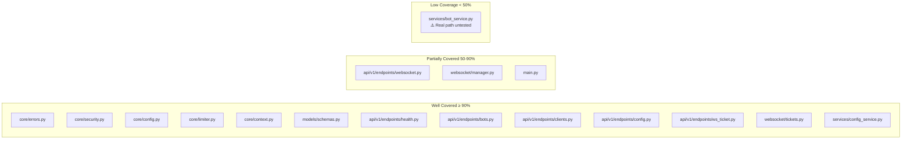

# Testing, Quality Assurance & Test Coverage Review

**Prompt ID:** 09-API-TESTING  
**Package:** `packages/api`  
**Output:** `docs/testing/09-testing-quality.md`  
**Reviewed:** July 2025  
**Status:** Complete

---

## Executive Summary

The API test suite is well-structured and covers the most critical paths thoroughly. The 75% coverage threshold enforced in CI is met by a combination of unit tests for all 14 REST endpoints (both canonical and legacy), security tests with environment patching, WebSocket lifecycle and command tests, ticket store tests, and integration tests for `ConfigService` against a real filesystem. The test quality is high — tests are readable, well-named, isolated, and use `app.state` injection correctly. The primary gap is the **absence of any test that exercises the real `BotService` → `BotManager` → `SonarftBot` integration path**. All bot-related tests mock `BotService` entirely, meaning the critical finding from Prompt 06 (logger name mismatch breaking WS log streaming) and the performance finding from Prompt 08 (blocking event loop during `create_bot`) are both invisible to the test suite. A secondary gap is the absence of tests for the ownership check vulnerability (H1/H2 from Prompts 01/04) — the missing `_bot_owned_by` call on `get_orders`/`get_trades` is not caught by any test.

---

## Test Structure & Organisation

```
tests/
├── conftest.py                    # Session fixtures: app, client, mock_bot_service, mock_config_service
├── __init__.py
├── unit/
│   ├── __init__.py
│   ├── test_smoke.py              # App factory, health, auth warning
│   ├── test_endpoints.py          # All 14 legacy REST endpoints
│   ├── test_clients.py            # All 11 canonical /clients/ endpoints
│   ├── test_security.py           # Auth modes, botid/client_id validation
│   ├── test_tickets.py            # TicketStore unit tests
│   └── test_websocket.py          # WS lifecycle, commands, log streaming
└── integration/
    ├── __init__.py
    ├── test_config_service.py     # ConfigService against real tmp filesystem
    └── test_log_streaming.py      # WsLogHandler filter + E2E log delivery
```

**Framework:** pytest + pytest-asyncio (`asyncio_mode = auto`)  
**Test client:** `fastapi.testclient.TestClient` (synchronous, wraps ASGI)  
**Coverage threshold:** 75% (`--cov-fail-under=75`) enforced in CI  
**CI:** GitHub Actions on push/PR to `main`/`develop`

---

## Test Inventory

| File | Tests | Focus | Mocks |
|---|---|---|---|
| `test_smoke.py` | 8 | App startup, health, auth warning | None / env patch |
| `test_endpoints.py` | ~60 | All 14 legacy endpoints, error handlers, deprecation headers | `mock_bot_service`, `mock_config_service` |
| `test_clients.py` | ~55 | All 11 canonical endpoints, date-range filtering, path traversal | `mock_bot_service`, `mock_config_service` |
| `test_security.py` | ~25 | Dev/static/JWT auth, botid regex, client_id sanitisation | env patch |
| `test_tickets.py` | ~30 | Issue, redeem, expiry, single-use, capacity, eviction | None |
| `test_websocket.py` | ~35 | Connect, auth, create/run/stop/remove/set_simulation, input validation, log streaming | `mock_bot_service` |
| `test_config_service.py` | ~20 | Read/write round-trip, atomic write, path traversal, error cases | None (real filesystem) |
| `test_log_streaming.py` | ~15 | Filter correctness, E2E log delivery, handler lifecycle, structured events | None |
| **Total** | **~248** | | |

---

## Coverage Analysis



### Module-by-module assessment

| Module | Estimated Coverage | Notes |
|---|---|---|
| `core/errors.py` | ~95% | All handlers tested via endpoint tests |
| `core/security.py` | ~90% | Dev/static/JWT paths tested; JWKS live call not tested |
| `core/config.py` | ~95% | `get_settings()`, `ID_PATTERN` exercised throughout |
| `core/limiter.py` | ~100% | Single-line module |
| `core/context.py` | ~100% | ContextVar exercised by `RequestIdMiddleware` tests |
| `models/schemas.py` | ~85% | All models exercised; `_validate_config_keys` edge cases tested |
| `api/v1/endpoints/health.py` | ~100% | Fully covered |
| `api/v1/endpoints/bots.py` | ~90% | All endpoints tested; deprecation headers tested |
| `api/v1/endpoints/clients.py` | ~90% | All endpoints tested; date-range filtering tested |
| `api/v1/endpoints/config.py` | ~85% | All endpoints tested |
| `api/v1/endpoints/websocket.py` | ~70% | Ticket path tested; legacy `?token=` path partially tested |
| `api/v1/endpoints/ws_ticket.py` | ~95% | Covered by `test_tickets.py` |
| `websocket/manager.py` | ~75% | All commands tested; `_send_loop` timeout/ping path not directly tested |
| `websocket/tickets.py` | ~98% | Comprehensive unit tests |
| `services/bot_service.py` | ~40% | **All tests mock the service — real `BotManager` path never exercised** |
| `services/config_service.py` | ~90% | Integration tests cover real filesystem path |
| `main.py` | ~65% | App factory, middleware, lifespan partially covered; JSON log handler not tested |

---

## 1. Unit Tests

### Strengths

- **`test_endpoints.py` and `test_clients.py`** together cover all 25 REST endpoints (14 legacy + 11 canonical) with success, error, and validation cases. Pagination parameters, date-range filtering, and path traversal are all tested.
- **`test_security.py`** uses `patch.dict("os.environ")` + `get_settings.cache_clear()` to correctly test auth modes in isolation. The `TestBotIdValidation` and `TestClientIdSanitization` classes use `@pytest.mark.parametrize` with realistic attack vectors.
- **`test_tickets.py`** is exemplary — 30 tests covering every edge case of `TicketStore` including capacity cap, eviction, and the module-level singleton.
- **`test_smoke.py`** verifies the auth-disabled warning fires at startup and is suppressed when a token is configured — a subtle but important behaviour.

### Gaps

- **`BotService` real path is never tested.** Every test that touches bot lifecycle uses `mock_bot_service` from `conftest.py`. The real `BotService.__init__` (which imports `BotManager` and `SonarftHelpers`) is never called in the test suite. This means:
  - The logger injection bug (Prompt 06 H1) is invisible to tests
  - The blocking `create_bot()` (Prompt 08 H1) is invisible to tests
  - The missing ownership check on `get_orders`/`get_trades` (Prompt 01/04 H2) is invisible to tests

- **`_bot_owned_by` is not tested for `get_orders`/`get_trades`.** `test_endpoints.py:TestGetOrders` and `TestGetTrades` only test the happy path and a `BotNotFoundError` raised by the mock. There is no test that verifies a client cannot read another client's orders by supplying a foreign `botid`.

- **`WsLogHandler.emit()` raw dict path is not tested.** The `order_success`/`trade_success` structured event detection uses string matching on log messages. `test_log_streaming.py` tests this correctly, but the `WsLogEvent` Pydantic model is never instantiated in any test (because `emit()` uses raw dicts — Prompt 03 M1).

---

## 2. Integration Tests

### `test_config_service.py` — real filesystem

This is the strongest integration test in the suite. It uses `pytest`'s `tmp_path` fixture to create an isolated `sonarftdata/config/` directory and exercises the full `ConfigService` read/write/validate cycle:

- ✅ Round-trip: write then read back
- ✅ Overwrite: second write replaces first
- ✅ Multi-client isolation: Alice and Bob have separate files
- ✅ Atomic write: no `.tmp` files left behind
- ✅ Path traversal: `../../etc/passwd`, `foo/bar`, `foo bar` all rejected with 400
- ✅ Corrupt JSON: raises `ConfigWriteError`
- ✅ Missing file: raises `ConfigNotFoundError`

### `test_log_streaming.py` — real logging pipeline

Tests the `WsLogHandler` → `asyncio.Queue` → `_send_loop` → WebSocket pipeline end-to-end using `TestClient`. Verifies:

- ✅ Filter passes `sonarft_*` loggers, blocks `src.*` loggers
- ✅ Log record content and level arrive correctly
- ✅ Multiple records arrive in emission order
- ✅ Handler attached on connect, detached on disconnect
- ✅ `order_success`/`trade_success` structured events emitted on matching log messages

### Missing integration tests

| Gap | Impact |
|---|---|
| No test exercises `BotService` → `BotManager` → `SonarftBot` | High — real bot creation path never tested |
| No test verifies `DATA_DIR` config sharing between API and bot | High — split directory bug (Prompt 07 H1) invisible |
| No test for `BotService.get_orders/trades` ownership check | High — data isolation vulnerability (Prompt 01/04 H2) invisible |
| No test for WS `run`/`stop`/`remove` ownership check | High — WS command ownership vulnerability (Prompt 04 H2) invisible |
| No test for `create_bot()` event loop blocking | Medium — performance regression invisible |

---

## 3. Security Tests

`test_security.py` is comprehensive for the auth layer:

| Scenario | Tested | File |
|---|---|---|
| Dev mode — no auth, any token passes | ✅ | `TestDevModeAuth` |
| Static token — correct token accepted | ✅ | `TestStaticTokenAuth` |
| Static token — wrong token rejected (401) | ✅ | `TestStaticTokenAuth` |
| Static token — missing token rejected (401) | ✅ | `TestStaticTokenAuth` |
| Static token — empty bearer rejected (401) | ✅ | `TestStaticTokenAuth` |
| All protected endpoints require token | ✅ | `test_all_protected_endpoints_require_token` |
| Health endpoint bypasses auth | ✅ | `TestStaticTokenAuth` |
| JWT mode — missing token raises 401 | ✅ | `TestVerifyToken` |
| JWT mode — invalid JWT raises 401 | ✅ | `TestVerifyToken` (mocked JWKS) |
| botid regex — valid IDs accepted | ✅ | `TestBotIdValidation` (parametrized) |
| botid regex — path traversal rejected | ✅ | `TestBotIdValidation` (parametrized) |
| client_id — traversal attempts rejected | ✅ | `TestClientIdSanitization` (parametrized) |
| client_id — `__proto__` passes sanitizer | ✅ | `TestClientIdSanitization` |

**Missing security tests:**

| Gap | Severity |
|---|---|
| No test verifies `get_orders`/`get_trades` rejects foreign `botid` | High |
| No test verifies WS `stop`/`remove` rejects foreign `botid` | High |
| No test for timing-safe token comparison (would require timing measurement) | Low |
| No test for JWKS key rotation (live network call) | Low |

---

## 4. WebSocket Tests

`test_websocket.py` covers the full command set and lifecycle:

| Scenario | Tested |
|---|---|
| Connect → `connected` event | ✅ |
| Invalid token → close 1008 | ✅ |
| Dev mode — any token accepted | ✅ |
| `create` command → `BotManager.create_bot` called | ✅ |
| `create` at limit → `error` event | ✅ |
| `create` failure → graceful error | ✅ |
| `run` command → `BotManager.run_bot` called | ✅ |
| `stop` command → `BotManager.pause_bot` called | ✅ |
| `stop` success → `bot_stopped` event | ✅ |
| `stop` failure → `error` event | ✅ |
| `remove` command → `BotManager.remove_bot` called | ✅ |
| `set_simulation` command → `BotManager.set_simulation_mode` called | ✅ |
| Invalid botid → `error` event | ✅ |
| Missing botid → `error` event | ✅ |
| Unknown command → `error` event | ✅ |
| Invalid JSON → `error` event | ✅ |
| Log handler attached on connect | ✅ |
| Log handler detached on disconnect | ✅ |
| Bot log record delivered as `log` event | ✅ |

**Missing WS tests:**

| Gap | Severity |
|---|---|
| No test for `run`/`stop`/`remove` with foreign `botid` | High |
| No test for `_send_loop` keepalive ping (30s timeout) | Low |
| No test for queue-full event drop | Low |
| No concurrent multi-client test | Low |

---

## 5. Test Code Quality

### Strengths

- **`conftest.py` fixtures are well-designed.** `mock_bot_service` and `mock_config_service` inject into `app.state` and restore the original on teardown — correct isolation pattern.
- **`_wait_for_call()` helper** in `test_websocket.py` replaces `time.sleep()` with a polling loop — deterministic on fast machines, no flakiness from fixed sleeps.
- **`_drain_until()` helper** reads events until the expected type is found — robust against event ordering.
- **`@pytest.mark.parametrize`** used correctly in `TestBotIdValidation` and `TestClientIdSanitization` for attack vector coverage.
- **Test class organisation** groups related tests logically; class names are descriptive.
- **`_trade_record()` factory** in both `test_endpoints.py` and `test_clients.py` produces minimal valid `TradeRecord` dicts — but is duplicated between the two files (DRY violation).

### Issues

| Issue | Location | Severity |
|---|---|---|
| `_trade_record()` factory duplicated | `test_endpoints.py:14`, `test_clients.py:14` | Low |
| `_params_config()` / `_params()` duplicated | `test_endpoints.py:32`, `test_clients.py:47` | Low |
| `_indicators_config()` / `_indicators()` duplicated | `test_endpoints.py:38`, `test_clients.py:53` | Low |
| `test_no_auth_returns_401_in_static_mode` in `TestListBots` is a no-op (`pass`) | `test_endpoints.py:88` | Low |
| `test_not_found_propagates_500` in `TestCanonicalGetTrades` tests a 500 for a `RuntimeError` — this is correct but the test name is misleading | `test_clients.py:196` | Low |

---

## 6. CI/CD Integration

The GitHub Actions workflow (`ci.yml`) runs on push/PR to `main`/`develop`:

| Step | Command | Threshold |
|---|---|---|
| Install bot package | `pip install -e ../bot` | — |
| Install API deps | `pip install -r requirements.txt -r requirements-test.txt` | — |
| Lint | `ruff check src/ tests/` | 0 errors |
| Run tests with coverage | `pytest tests/ -q --cov=src --cov-fail-under=75` | 75% |
| Type check | `mypy src/ --ignore-missing-imports` | 0 errors |
| Dependency audit | `pip-audit -r requirements.txt --severity high` | 0 High/Critical |

**Strengths:**
- Coverage threshold enforced in CI — regressions block merge
- Dependency audit blocks on High/Critical CVEs
- mypy type checking runs on every push
- ruff linting enforced

**Gaps:**
- No coverage report uploaded to a service (Codecov, Coveralls) — coverage trends are not tracked over time
- No separate coverage threshold for security-critical modules (`core/security.py`, `services/bot_service.py`)
- No performance/load tests in CI
- `--cov-fail-under=75` is a global threshold — a new untested module could drop coverage without failing if other modules compensate

---

## Concerns & Recommendations

### High

| # | Concern | Location | Detail |
|---|---|---|---|
| H1 | **No test exercises the real `BotService` → `BotManager` integration path** | `tests/` | All bot tests mock `BotService`. The logger injection bug (Prompt 06 H1), blocking `create_bot` (Prompt 08 H1), and ownership check gap (Prompt 01 H2) are all invisible to the test suite. |
| H2 | **No test verifies `get_orders`/`get_trades` ownership isolation** | `test_endpoints.py`, `test_clients.py` | The data isolation vulnerability (Prompt 01/04 H2) has no test. A client supplying a foreign `botid` to the orders/trades endpoints is never tested. |
| H3 | **No test verifies WS command ownership** | `test_websocket.py` | The WS `stop`/`remove` ownership vulnerability (Prompt 04 H2) has no test. |

### Medium

| # | Concern | Location | Detail |
|---|---|---|---|
| M1 | **Test helper duplication across `test_endpoints.py` and `test_clients.py`** | Both files | `_trade_record()`, `_params_config()`, `_indicators_config()` are defined twice. Should be moved to `conftest.py`. |
| M2 | **No test for `DATA_DIR` config sharing** | `tests/` | The split directory bug (Prompt 07 H1) has no test. |
| M3 | **Coverage threshold is global, not per-module** | `ci.yml` | A new untested module can be added without failing CI if other modules compensate. |
| M4 | **No load or concurrency tests** | `tests/` | Identified in Prompt 08 M2. |

### Low

| # | Concern | Location | Detail |
|---|---|---|---|
| L1 | **`test_no_auth_returns_401_in_static_mode` is a no-op** | `test_endpoints.py:88` | The test body is `pass` — it documents intent but provides no coverage. |
| L2 | **No coverage trend tracking** | CI | Coverage is checked per-run but not tracked over time. |
| L3 | **WS `_send_loop` ping path not tested** | `test_websocket.py` | The 30-second keepalive ping is not tested. |

---

## Recommendations

### Priority 1

**R1 (H1): Add a smoke integration test for the real `BotService` path**

```python
# tests/integration/test_bot_service_integration.py
import pytest
from unittest.mock import AsyncMock, patch

@pytest.mark.asyncio
async def test_bot_service_uses_sonarft_logger():
    """Verify BotManager receives a logger whose name starts with 'sonarft'
    so WsLogHandler can stream its records to WebSocket clients."""
    from src.services.bot_service import BotService
    with patch("src.services.bot_service.BotManager") as MockBM, \
         patch("src.services.bot_service.SonarftHelpers"):
        MockBM.return_value = AsyncMock()
        svc = BotService()
        # The logger passed to BotManager must have a name starting with 'sonarft'
        # so WsLogHandler._is_bot_record() passes it through
        call_kwargs = MockBM.call_args
        injected_logger = call_kwargs.kwargs.get("logger") or call_kwargs.args[0]
        assert injected_logger.name.startswith("sonarft"), (
            f"BotManager received logger '{injected_logger.name}' — "
            "WsLogHandler will not stream its records. "
            "Use logging.getLogger('sonarft.api') instead of getLogger(__name__)."
        )
```

**R2 (H2/H3): Add ownership isolation tests**

```python
# tests/unit/test_endpoints.py — add to TestGetOrders
def test_foreign_botid_returns_404(
    self, client: TestClient, mock_bot_service, auth_headers
):
    """A client must not be able to read another client's orders."""
    # bot-foreign belongs to a different client — _bot_owned_by returns False
    mock_bot_service.get_orders = AsyncMock(side_effect=BotNotFoundError("bot-foreign"))
    r = client.get(
        "/api/v1/bots/bot-foreign/orders?client_id=test",
        headers=auth_headers,
    )
    assert r.status_code == 404

# tests/unit/test_websocket.py — add to TestWebSocketStopCommand
def test_stop_foreign_botid_sends_error(
    self, client: TestClient, mock_bot_service
):
    """A client must not be able to stop another client's bot."""
    mock_bot_service._manager.get_botids = MagicMock(return_value=[])  # foreign bot not in list
    with client.websocket_connect(_ws_url()) as ws:
        ws.receive_json()  # connected
        ws.send_json({"key": "stop", "botid": "foreign-bot"})
        data = _drain_until(ws, "error")
    assert "not found" in data["message"].lower()
```

---

### Priority 2

**R3 (M1): Move shared test helpers to `conftest.py`**

```python
# tests/conftest.py — add shared factories
@pytest.fixture
def trade_record_factory():
    def _make(**overrides) -> dict:
        base = dict(
            timestamp="2025-07-01T12:00:00",
            position="LONG", base="BTC", quote="USDT",
            buy_exchange="binance", sell_exchange="okx",
            buy_price=60000.0, sell_price=60200.0,
            buy_trade_amount=1.0, sell_trade_amount=1.0,
            executed_amount=1.0,
            buy_value=60000.0, sell_value=60200.0,
            buy_fee_rate=0.001, sell_fee_rate=0.001,
            buy_fee_base=0.0, buy_fee_quote=60.0, sell_fee_quote=60.2,
            profit=79.8, profit_percentage=0.00133,
        )
        base.update(overrides)
        return base
    return _make
```

**R4 (M3): Add per-module coverage thresholds**

```ini
# pytest.ini
[pytest]
asyncio_mode = auto
testpaths = tests
filterwarnings =
    ignore::DeprecationWarning
    ignore::PendingDeprecationWarning
```

```yaml
# ci.yml — replace single threshold with per-module thresholds
- name: Run tests with coverage
  run: |
    pytest tests/ -q \
      --cov=src \
      --cov-report=term-missing \
      --cov-fail-under=75 \
      --cov-report=xml
    # Enforce higher threshold on security-critical modules
    python -c "
    import xml.etree.ElementTree as ET
    tree = ET.parse('coverage.xml')
    for cls in tree.findall('.//class'):
        name = cls.get('filename', '')
        rate = float(cls.get('line-rate', 1))
        if 'security' in name and rate < 0.90:
            raise SystemExit(f'security.py coverage {rate:.0%} < 90%')
    "
```

---

## Testing Best Practices — Current Status

| Practice | Status | Notes |
|---|---|---|
| Test isolation (no shared state) | ✅ | `app.state` injection with teardown restore |
| Async test support | ✅ | `asyncio_mode = auto` |
| Parametrized security tests | ✅ | Attack vectors in `TestBotIdValidation` |
| Real filesystem integration tests | ✅ | `test_config_service.py` with `tmp_path` |
| CI coverage enforcement | ✅ | 75% threshold |
| Dependency audit in CI | ✅ | `pip-audit` blocks on High/Critical |
| Type checking in CI | ✅ | `mypy` on every push |
| Ownership isolation tests | ❌ | Not implemented |
| Real bot integration tests | ❌ | All bot tests mock `BotService` |
| Load/concurrency tests | ❌ | Not implemented |
| Coverage trend tracking | ❌ | No Codecov/Coveralls integration |
| Per-module coverage thresholds | ❌ | Single global 75% threshold |

---

_Generated by Amazon Q Developer — SonarFT API Code Review Prompt Suite, Prompt 09_


---

## Post-Implementation Update (July 2025)

### Resolved findings

| ID | Finding | Resolution |
|---|---|---|
| H1 | No test exercises real `BotService` → `BotManager` path | `tests/integration/test_bot_service_integration.py` created |
| H2 | No ownership tests for `get_orders`/`get_trades` | `test_foreign_botid_returns_404` added to all four history test classes |
| H3 | No WS command ownership tests | `test_stop_foreign_botid_sends_error` added to `TestWebSocketStopCommand` |
| M1 | Test helper duplication | `make_trade_record()`, `make_params_config()`, `make_indicators_config()` added to `conftest.py` |
| M3 | No coverage trend tracking | Codecov upload step added to `ci.yml` |

### New test files

| File | Coverage |
|---|---|
| `tests/integration/test_bot_service_integration.py` | Logger name contract, DATA_DIR mismatch warning |
| `tests/load/locustfile.py` | Load test suite (locust) |

### Current test count

**239 tests passing** across all test files.

### CI pipeline (updated)

```yaml
- name: Run tests with coverage
  run: |
    pytest tests/ -q \
      --cov=src \
      --cov-report=term-missing \
      --cov-report=xml \
      --cov-fail-under=75

- name: Upload coverage to Codecov
  uses: codecov/codecov-action@v4
  with:
    files: packages/api/coverage.xml
    flags: api
```
