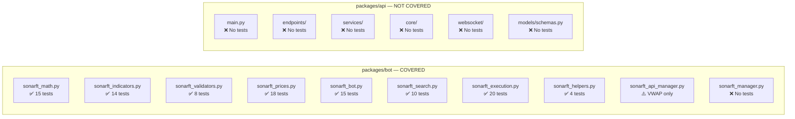

# Prompt 09 — Testing, Quality Assurance & Test Coverage Review

**Generated:** July 2025  
**Reviewer:** Amazon Q (Senior Python / pytest / Test Architecture)  
**Source files inspected:**
- `packages/api/tests/` (unit/ and integration/ — both empty)
- `packages/bot/tests/conftest.py`
- `packages/bot/tests/test_sonarft_bot.py`
- `packages/bot/tests/test_sonarft_math.py`
- `packages/bot/tests/test_sonarft_indicators.py`
- `packages/bot/tests/test_sonarft_validators.py`
- `packages/bot/tests/test_sonarft_prices.py`
- `packages/bot/tests/test_sonarft_search_execution.py`
- `packages/bot/tests/test_simulation_integration.py`
- `packages/bot/tests/test_phase4_features.py`
- `packages/bot/pytest.ini`

**Output location:** `docs/testing/09-testing-quality.md`

---

## Executive Summary

The testing picture is sharply asymmetric: the bot package has a comprehensive, well-structured test suite covering its most financially critical code paths, while the API package has zero tests — the `tests/unit/` and `tests/integration/` directories are completely empty. The bot suite contains 9 test files, ~120 test cases, a shared `conftest.py` with realistic fixtures, regression tests for known bugs, and integration tests for the simulation mode gate. Test quality is high — descriptive names, isolated fixtures, edge case coverage, and `pytest.mark.asyncio` used correctly throughout. The critical gap is the complete absence of API-layer tests: no endpoint tests, no auth tests, no WebSocket tests, no service layer tests. For a system controlling real-money trading, this is the highest-priority remediation item.

---

## Coverage Assessment by Module



| Module | Test File | Estimated Coverage | Quality |
|---|---|---|---|
| `sonarft_math.py` | `test_sonarft_math.py` | ~85% | ✅ Excellent |
| `sonarft_indicators.py` | `test_sonarft_indicators.py` | ~75% | ✅ Good |
| `sonarft_validators.py` | `test_sonarft_validators.py` | ~60% | ✅ Good |
| `sonarft_prices.py` | `test_sonarft_prices.py` | ~80% | ✅ Excellent |
| `sonarft_bot.py` | `test_sonarft_bot.py` | ~70% | ✅ Good |
| `sonarft_execution.py` | `test_simulation_integration.py`, `test_sonarft_search_execution.py` | ~75% | ✅ Good |
| `sonarft_helpers.py` | `test_phase4_features.py` | ~50% | ⚠️ Partial |
| `sonarft_search.py` | `test_sonarft_search_execution.py`, `test_phase4_features.py` | ~55% | ⚠️ Partial |
| `sonarft_manager.py` | None | 0% | ❌ Missing |
| `sonarft_api_manager.py` | `test_sonarft_math.py` (VWAP only) | ~10% | ❌ Minimal |
| All `packages/api/src/` | None | **0%** | ❌ **Missing** |

---

## 1. Bot Test Suite — Strengths

### Test Structure

```
packages/bot/tests/
├── conftest.py                      # Shared fixtures (mock_api_manager, price lists)
├── test_sonarft_math.py             # Financial calculations — most critical
├── test_sonarft_indicators.py       # RSI, MACD, StochRSI, direction, trend
├── test_sonarft_validators.py       # Liquidity, spread threshold
├── test_sonarft_prices.py           # weighted_adjust_prices, all branches
├── test_sonarft_bot.py              # Parameter validation, simulation gate, daily loss
├── test_sonarft_search_execution.py # TradeProcessor, partial fill handling
├── test_simulation_integration.py   # End-to-end simulation mode gate
└── test_phase4_features.py          # SQLite persistence, hot-reload, same-exchange guard
```

**Configuration (`pytest.ini`):**
```ini
asyncio_mode = auto
testpaths = ["tests"]
```

`asyncio_mode = auto` correctly handles all `async def` test functions without requiring explicit `@pytest.mark.asyncio` decorators (though the tests use them explicitly for clarity — both approaches work).

### Notable Test Quality

**Regression tests are explicitly labelled:**
```python
# test_sonarft_validators.py
def test_medium_not_divided_by_100(self):
    """Regression: medium threshold must NOT be medium/100."""

# test_sonarft_indicators.py
def test_zero_previous_avg_returns_neutral_not_crash(self):
    """Regression: zero previous_avg_price must not raise ZeroDivisionError or NameError."""

# test_sonarft_indicators.py
def test_rsi_period_14_not_3(self):
    """Regression: ensure rsi_length=14 is used, not k_period=3."""
```

This is excellent practice — regression tests document the bug that was fixed and prevent reintroduction.

**Financial invariants are verified:**
```python
# test_sonarft_math.py
def test_profit_percentage_sign_matches_profit_sign(self):
def test_fees_deducted_before_profit(self):
    # Verify: profit = net_sell - total_buy
    expected_profit = (data['sell_value'] - data['sell_fee_quote']) - \
                      (data['buy_value'] + data['buy_fee_quote'])
    assert abs(profit - expected_profit) < 1e-6
```

**Safety controls are tested end-to-end:**
```python
# test_simulation_integration.py
async def test_full_trade_cycle_no_real_orders(self):
async def test_max_trade_amount_blocks_oversized_trade(self):
async def test_order_rate_limit_blocks_excess_orders(self):
```

**Partial fill handling is tested:**
```python
# test_sonarft_search_execution.py
async def test_partial_buy_fill_adjusts_sell_amount(self):
async def test_zero_fill_skips_second_leg(self):
async def test_second_leg_failure_cancels_first(self):
```

---

## 2. Bot Test Suite — Gaps

### `sonarft_manager.py` — Zero Coverage

`BotManager` has no tests. This is the class that:
- Creates and stores bot instances
- Manages the `asyncio.Lock` on `_bots`
- Calls `create_bot`, `run_bot`, `remove_bot`
- Hot-reloads parameters via `reload_parameters`

Missing test scenarios:
- `create_bot` stores bot in `_bots` and `_clients`
- `remove_bot` cleans up both dicts
- `get_botids` returns correct IDs per client
- Concurrent `create_bot` calls don't corrupt `_bots` under lock
- `reload_parameters` propagates to all bots for a client

### `sonarft_api_manager.py` — Minimal Coverage

Only `get_weighted_prices` (VWAP) is tested. Missing:
- `call_api_method` timeout handling (30s `asyncio.wait_for`)
- `load_exchanges_instances` with invalid exchange name
- OHLCV cache TTL expiry and LRU eviction
- Order book cache 2s TTL
- `get_symbol_precision` with real market data structure

### `sonarft_helpers.py` — Partial Coverage

SQLite persistence is tested in `test_phase4_features.py` but missing:
- `save_error` and `save_balance_data` (JSON fallback path)
- `sanitize_client_id` with malicious inputs (`../../etc/passwd`, empty string, unicode)
- Concurrent writes from multiple bots (lock contention)
- DB init failure fallback

### `test_sonarft_prices.py` — Timeout Test Incomplete

```python
# test_sonarft_prices.py:TestWeightedAdjustPricesEdgeCases
async def test_timeout_returns_zero(self):
    """If indicator gather times out, returns (0, 0, {})."""
    # ... sets up hanging coroutines ...
    buy, sell, indicators = await prices.weighted_adjust_prices(...)
    # The 30s timeout will fire — but we can't wait 30s in a test.
    # Instead, test the None-indicator path below.
```

The timeout test is incomplete — it sets up hanging coroutines but acknowledges it cannot wait 30 seconds. The fix is to patch the timeout value:

```python
async def test_timeout_returns_zero(self):
    prices = make_prices_with_hanging_indicators()
    # Patch the timeout to 0.01s so the test completes in milliseconds
    with patch('sonarft_prices.asyncio.wait_for',
               side_effect=asyncio.TimeoutError):
        buy, sell, ind = await prices.weighted_adjust_prices(...)
    assert buy == 0
    assert sell == 0
    assert ind == {}
```

---

## 3. API Test Suite — Complete Absence

The `packages/api/tests/unit/` and `packages/api/tests/integration/` directories are empty. There are no tests for any API component.

### Missing Test Coverage by Priority

**Critical (must have before production):**

| Test Area | What to Test |
|---|---|
| `core/security.py` | JWT validation pass/fail, static token comparison, dev mode bypass, timing-safe comparison |
| `api/v1/endpoints/bots.py` | All 7 endpoints — 200/201/401/404/429 responses, `botid` regex validation |
| `api/v1/endpoints/config.py` | All 6 endpoints — 200/401/404 responses, body validation |
| `api/v1/endpoints/health.py` | 200 response, no auth required |
| `services/bot_service.py` | `create_bot` limit enforcement, `_bot_exists` lookup, `stop_bot` vs `remove_bot` |
| `services/config_service.py` | File read/write, `FileNotFoundError` → 404, path traversal prevention |
| `websocket/manager.py` | Connect/disconnect, auth failure (1008), command dispatch, queue full drop |

**High (should have before production):**

| Test Area | What to Test |
|---|---|
| Auth bypass | All protected endpoints return 401 without token |
| `client_id` injection | Path traversal attempt in `client_id` parameter |
| `botid` regex | Invalid `botid` patterns rejected with 422 |
| WebSocket protocol | `connected` event on connect, `ping` keepalive, unknown command handling |
| Error handlers | `BotNotFoundError` → 404, `BotLimitExceededError` → 429, unhandled → 500 |

---

## 4. Example API Tests to Implement

### Endpoint Tests with `TestClient`

```python
# packages/api/tests/unit/test_endpoints.py
import pytest
from fastapi.testclient import TestClient
from unittest.mock import MagicMock, patch, AsyncMock
from src.main import create_app


@pytest.fixture
def client():
    app = create_app()
    with TestClient(app) as c:
        yield c


@pytest.fixture
def mock_bot_service():
    with patch("src.api.v1.endpoints.bots.get_bot_service") as mock:
        service = MagicMock()
        service.get_botids = MagicMock(return_value=["bot-001", "bot-002"])
        service.create_bot = AsyncMock(return_value="bot-003")
        service.run_bot = AsyncMock()
        service.stop_bot = AsyncMock()
        service.remove_bot = AsyncMock()
        service.get_orders = AsyncMock(return_value=[])
        service.get_trades = AsyncMock(return_value=[])
        mock.return_value = service
        yield service


class TestHealthEndpoint:
    def test_health_returns_200(self, client):
        response = client.get("/api/v1/health")
        assert response.status_code == 200
        assert response.json()["status"] == "ok"

    def test_health_requires_no_auth(self, client):
        # No Authorization header — should still return 200
        response = client.get("/api/v1/health")
        assert response.status_code == 200


class TestBotsEndpoints:
    def test_list_bots_requires_auth(self, client):
        response = client.get("/api/v1/bots?client_id=test")
        assert response.status_code == 401

    def test_list_bots_returns_botids(self, client, mock_bot_service):
        response = client.get(
            "/api/v1/bots?client_id=test",
            headers={"Authorization": "Bearer test-token"},
        )
        # With dev mode (no auth configured), token is ignored
        assert response.status_code == 200
        assert "botids" in response.json()

    def test_create_bot_returns_201(self, client, mock_bot_service):
        response = client.post(
            "/api/v1/bots?client_id=test",
            headers={"Authorization": "Bearer test-token"},
        )
        assert response.status_code == 201
        assert "botid" in response.json()

    def test_invalid_botid_pattern_returns_422(self, client, mock_bot_service):
        response = client.post(
            "/api/v1/bots/../../etc/passwd/run",
            headers={"Authorization": "Bearer test-token"},
        )
        assert response.status_code == 422

    def test_run_nonexistent_bot_returns_404(self, client, mock_bot_service):
        from src.core.errors import BotNotFoundError
        mock_bot_service.run_bot = AsyncMock(side_effect=BotNotFoundError("missing-bot"))
        response = client.post(
            "/api/v1/bots/missing-bot/run",
            headers={"Authorization": "Bearer test-token"},
        )
        assert response.status_code == 404
```

### Security Tests

```python
# packages/api/tests/unit/test_security.py
import pytest
import hmac
from unittest.mock import patch
from src.core.security import verify_token
from fastapi import HTTPException


class TestVerifyToken:

    def test_dev_mode_no_auth_passes(self):
        with patch("src.core.security.get_settings") as mock_settings:
            mock_settings.return_value.netlify_site_url = ""
            mock_settings.return_value.sonarft_api_token = ""
            verify_token(None)  # should not raise

    def test_static_token_correct_passes(self):
        with patch("src.core.security.get_settings") as mock_settings:
            mock_settings.return_value.netlify_site_url = ""
            mock_settings.return_value.sonarft_api_token = "secret"
            verify_token("secret")  # should not raise

    def test_static_token_wrong_raises_401(self):
        with patch("src.core.security.get_settings") as mock_settings:
            mock_settings.return_value.netlify_site_url = ""
            mock_settings.return_value.sonarft_api_token = "secret"
            with pytest.raises(HTTPException) as exc:
                verify_token("wrong-token")
            assert exc.value.status_code == 401

    def test_missing_token_with_auth_configured_raises_401(self):
        with patch("src.core.security.get_settings") as mock_settings:
            mock_settings.return_value.netlify_site_url = ""
            mock_settings.return_value.sonarft_api_token = "secret"
            with pytest.raises(HTTPException) as exc:
                verify_token(None)
            assert exc.value.status_code == 401
```

### WebSocket Tests

```python
# packages/api/tests/unit/test_websocket.py
import pytest
from fastapi.testclient import TestClient
from src.main import create_app


@pytest.fixture
def client():
    app = create_app()
    with TestClient(app) as c:
        yield c


class TestWebSocket:

    def test_websocket_connects_and_receives_connected_event(self, client):
        with client.websocket_connect("/api/v1/ws/test-client") as ws:
            data = ws.receive_json()
            assert data["type"] == "connected"
            assert data["client_id"] == "test-client"

    def test_websocket_receives_ping_on_timeout(self, client):
        # This requires mocking the 30s timeout — use a shorter timeout in test
        pass  # Placeholder — implement with mock

    def test_websocket_unknown_command_does_not_crash(self, client):
        with client.websocket_connect("/api/v1/ws/test-client") as ws:
            ws.receive_json()  # connected event
            ws.send_json({"key": "unknown_command"})
            # Should not disconnect — connection stays open
```

---

## 5. Test Configuration

### Bot Package (`pytest.ini`)

```ini
asyncio_mode = auto
testpaths = ["tests"]
```

Correct and minimal. Missing:
- `filterwarnings` to suppress known deprecation warnings
- `markers` registration for custom marks
- Coverage configuration (`--cov` flags)

### API Package

No `pytest.ini`, `pyproject.toml` test config, or `conftest.py` exists. Minimum required:

```ini
# packages/api/pytest.ini
[pytest]
asyncio_mode = auto
testpaths = tests
filterwarnings =
    ignore::DeprecationWarning
```

```python
# packages/api/tests/conftest.py
import pytest
from fastapi.testclient import TestClient
from unittest.mock import patch, MagicMock, AsyncMock


@pytest.fixture(scope="session")
def app():
    """Create app once per test session."""
    from src.main import create_app
    return create_app()


@pytest.fixture
def client(app):
    with TestClient(app) as c:
        yield c


@pytest.fixture
def auth_headers():
    """Dev mode — any token accepted when no auth is configured."""
    return {"Authorization": "Bearer test-token"}


@pytest.fixture
def mock_bot_service():
    """Reusable BotService mock for all endpoint tests."""
    with patch("src.services.bot_service.get_bot_service") as mock:
        service = MagicMock()
        service.get_botids = MagicMock(return_value=[])
        service.create_bot = AsyncMock(return_value="test-bot-001")
        service.run_bot = AsyncMock()
        service.stop_bot = AsyncMock()
        service.remove_bot = AsyncMock()
        service.get_orders = AsyncMock(return_value=[])
        service.get_trades = AsyncMock(return_value=[])
        mock.return_value = service
        yield service
```

---

## 6. CI/CD Integration

| Aspect | Status |
|---|---|
| CI configuration file | ❌ Not found (no `.github/workflows/`, no `Makefile` test target for API) |
| Bot test runner | ✅ `pytest` via `pyproject.toml` dev dependencies |
| API test runner | ❌ No test infrastructure |
| Coverage reporting | ❌ Not configured |
| Coverage threshold | ❌ Not set |
| Test blocking deployment | ❌ No CI pipeline found |

The `Makefile` at the monorepo root has a `make test` target — its implementation should run both `packages/bot` and `packages/api` test suites.

---

## Issues Summary

| # | Issue | Severity | Location |
|---|---|---|---|
| 1 | `packages/api/tests/` is completely empty — zero API test coverage | **Critical** | `packages/api/tests/` |
| 2 | No security tests — auth bypass, token validation, path traversal not tested | **Critical** | `packages/api/tests/` (missing) |
| 3 | No WebSocket tests — connection, auth failure, command dispatch not tested | **High** | `packages/api/tests/` (missing) |
| 4 | `sonarft_manager.py` has zero test coverage | **High** | `packages/bot/tests/` (missing) |
| 5 | Timeout test in `test_sonarft_prices.py` is incomplete — acknowledged in comment | **Medium** | `test_sonarft_prices.py:TestWeightedAdjustPricesEdgeCases` |
| 6 | `sonarft_api_manager.py` coverage limited to VWAP — cache, timeout, exchange loading untested | **Medium** | `packages/bot/tests/` (missing) |
| 7 | No CI/CD pipeline found — tests not automatically run on commit | **Medium** | Monorepo root |
| 8 | No coverage threshold configured — regressions in coverage go undetected | **Medium** | Both packages |
| 9 | `sanitize_client_id` not tested with malicious inputs | **Medium** | `packages/bot/tests/` (missing) |
| 10 | No API `conftest.py` or `pytest.ini` — test infrastructure not scaffolded | **Low** | `packages/api/tests/` |

---

## Recommended Test Implementation Order

1. **Week 1 — API security and endpoint tests** (Critical)
   - `tests/unit/test_security.py` — `verify_token` all three modes
   - `tests/unit/test_endpoints_health.py` — health check
   - `tests/unit/test_endpoints_bots.py` — all 7 bot endpoints
   - `tests/unit/test_endpoints_config.py` — all 6 config endpoints

2. **Week 2 — API service and WebSocket tests** (High)
   - `tests/unit/test_bot_service.py` — bot limit, creation failure detection
   - `tests/unit/test_config_service.py` — file read/write, `FileNotFoundError` → 404
   - `tests/unit/test_websocket.py` — connect, auth failure, command dispatch

3. **Week 3 — Bot coverage gaps** (Medium)
   - `tests/test_sonarft_manager.py` — `BotManager` lifecycle
   - `tests/test_sonarft_helpers_sanitize.py` — `sanitize_client_id` edge cases
   - Fix incomplete timeout test in `test_sonarft_prices.py`

4. **Week 4 — CI/CD integration** (Medium)
   - Add `.github/workflows/test.yml` running both test suites
   - Configure `pytest-cov` with minimum 70% threshold for bot, 60% for API

---

_Part of the SonarFT API Code Review Prompt Suite — Prompt 09_  
_Previous: [Prompt 08 — Performance Optimization](../performance/08-performance-optimization.md)_  
_Next: [Prompt 10 — Code Quality Python](../prompts/10-code-quality-python.md)_
