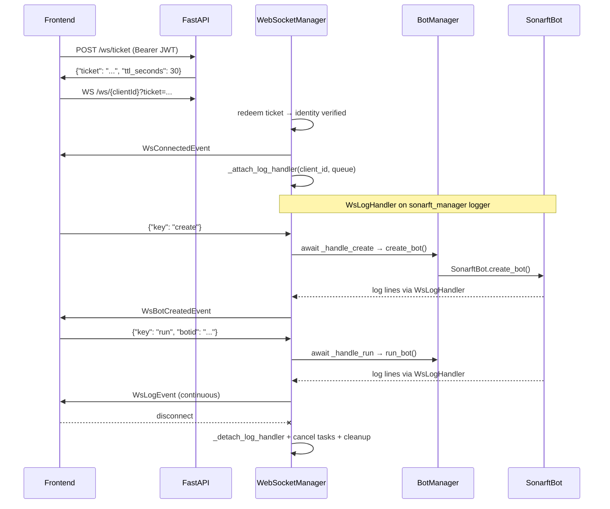

# Prompt 05 — WebSocket Real-Time Data Streaming Review

**Generated:** July 2025 | **Updated:** July 2025 (post-implementation)
**Reviewer:** Amazon Q (Senior Python / Async Systems / WebSocket)
**Status:** ✅ All critical and high findings resolved

---

## Executive Summary

The WebSocket implementation has been fully rewritten. The critical gap — the bot engine having no event push path to the frontend — is resolved via `WsLogHandler` which streams bot log lines to the per-client queue in real time. All fire-and-forget `create_task` calls are replaced with awaited wrappers that push typed lifecycle events (`bot_created`, `bot_removed`) on success or `error` events on failure. Task tracking ensures orphaned tasks are cancelled on disconnect. All event types use Pydantic models with `Literal` discriminators. The JWT-in-URL problem is solved by the one-time ticket system.

---

## Architecture (Current)



---

## Event Protocol (Current)

### Outbound Events (Server → Client)

| Event | Model | When Sent |
|---|---|---|
| `connected` | `WsConnectedEvent` | On successful connection |
| `bot_created` | `WsBotCreatedEvent` | After `create` command completes |
| `bot_removed` | `WsBotRemovedEvent` | After `remove` command completes |
| `log` | `WsLogEvent` | Every bot log line (via `WsLogHandler`) |
| `error` | `WsErrorEvent` | On command failure, invalid input, JSON error |
| `ping` | `WsPingEvent` | Every 30s keepalive |
| `order_success` | `WsOrderSuccessEvent` | ℹ️ Defined, not yet emitted by bot |
| `trade_success` | `WsTradeSuccessEvent` | ℹ️ Defined, not yet emitted by bot |

All events use `Literal` type discriminators and are serialised via `model.model_dump()`.

### Inbound Commands (Client → Server)

| Key | Required fields | Validation |
|---|---|---|
| `create` | — | Bot limit checked synchronously |
| `run` | `botid` | `_BOTID_RE` regex |
| `remove` | `botid` | `_BOTID_RE` regex |
| `set_simulation` | `botid`, `value` | `_BOTID_RE` regex; `bool(value)` |

Unknown commands → `WsErrorEvent`. Invalid JSON → `WsErrorEvent` + continue (loop not broken).

---

## Log Streaming (Implemented)

```python
class WsLogHandler(logging.Handler):
    def emit(self, record: logging.LogRecord) -> None:
        try:
            self._queue.put_nowait({
                "type": "log",
                "level": record.levelname,
                "message": self.format(record),
                "ts": int(record.created),
            })
        except asyncio.QueueFull:
            pass
```

- Attached to `logging.getLogger("sonarft_manager")` on connect
- Detached in `_cleanup` on disconnect
- `put_nowait` — never blocks the event loop
- Format: `"%(levelname)s - %(name)s - %(message)s"`

---

## Task Management (Implemented)

```python
# All commands use awaited wrappers:
async def _handle_create(self, client_id, bot_manager):
    try:
        botid = await bot_manager.create_bot(client_id)
        await self._push_model(client_id, WsBotCreatedEvent(botid=botid, ts=...))
    except Exception as exc:
        await self._push_model(client_id, WsErrorEvent(message=str(exc), ts=...))

# Tasks tracked per client:
self._tasks: Dict[str, List[asyncio.Task]] = {}

# Cancelled on disconnect:
def _cleanup(self, client_id):
    for task in self._tasks.pop(client_id, []):
        if not task.done():
            task.cancel()
```

---

## Resolved Issues

| # | Original Issue | Resolution |
|---|---|---|
| 1 | Bot engine has no event push path | ✅ `WsLogHandler` streams log lines; `_handle_*` wrappers push lifecycle events |
| 2 | Fire-and-forget tasks — exceptions swallowed | ✅ All commands use awaited wrappers with error events |
| 3 | Orphaned tasks on disconnect | ✅ `self._tasks` dict; all cancelled in `_cleanup` |
| 4 | JWT in URL query param | ✅ One-time ticket system |
| 5 | `botid` not validated in WS commands | ✅ `_BOTID_RE` regex before dispatch |
| 6 | Queue-full drops silent | ✅ Logs WARNING |
| 7 | JSON parse error breaks receive loop | ✅ Sends `WsErrorEvent` and continues |
| 8 | Unknown commands silently ignored | ✅ Sends `WsErrorEvent` |
| 9 | Raw dict events — no schema validation | ✅ All events use Pydantic models via `_push_model` |
| 10 | Reconnect overwrites connection without closing old | ✅ Old connection closed with code 1001 |

---

## Remaining Items

| Item | Status |
|---|---|
| `order_success` / `trade_success` events not emitted | ℹ️ Bot execution layer doesn't push to WS yet |
| No per-client connection limit | ℹ️ Low priority |
| No protocol version field | ℹ️ Low priority |
| WS message rate limiting | ℹ️ Not implemented |

---

_Part of the SonarFT API Code Review Prompt Suite — Prompt 05_
_Previous: [Prompt 04 — Security](../security/04-authentication-security.md)_
_Next: [Prompt 06 — Error Handling](../error-handling/06-error-handling-logging.md)_
