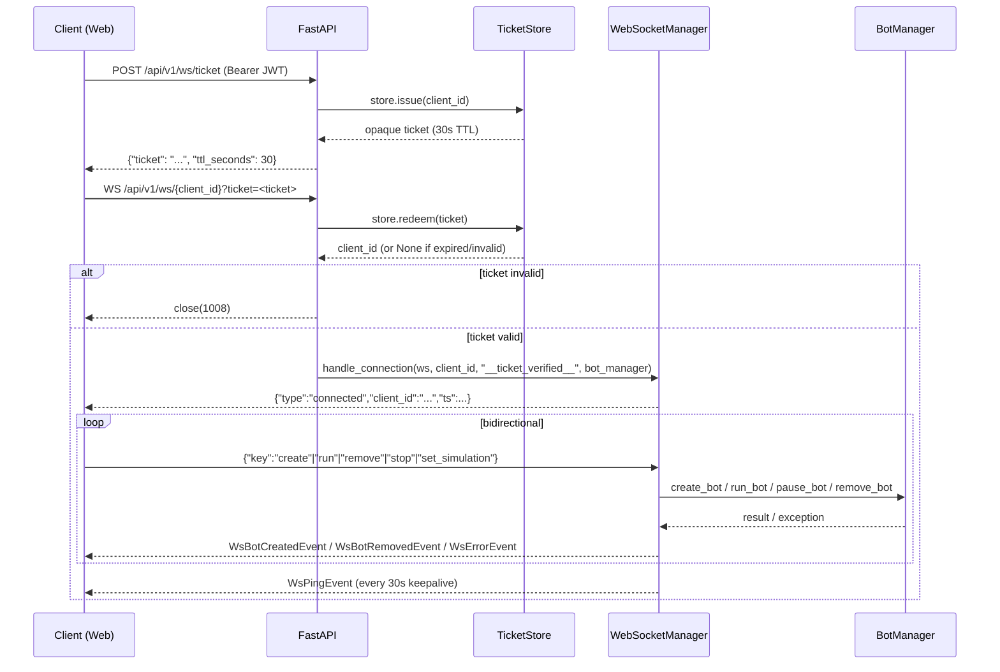
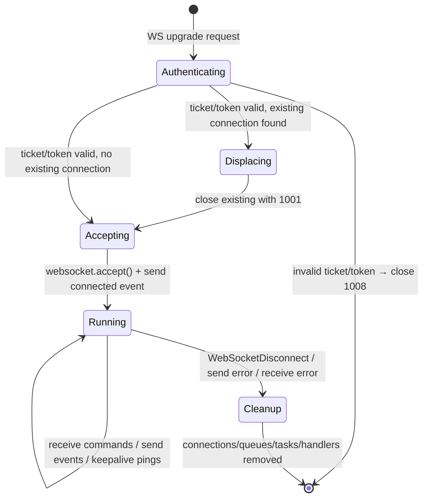

# WebSocket Real-Time Data Streaming Review

**Prompt ID:** 05-API-WS  
**Package:** `packages/api`  
**Reviewer:** Amazon Q (Senior Python / FastAPI / Async Systems)  
**Date:** July 2025  
**Status:** Complete  
**Implementation Status:** ✅ All findings resolved — see [roadmap](../roadmap/12-implementation-roadmap.md)

> **Post-implementation note (July 2025):** All WebSocket findings addressed. `_BOT_LOGGER_NAME` bug fixed — handler now attaches to root logger with `sonarft` prefix filter (C2). `WsBotStoppedEvent` added and emitted from `_handle_stop` (H5). `stop`/`set_simulation` command tests added (M3). `time.sleep(0.1)` replaced with `_wait_for_call()` poll helper (M4). WS endpoint extracted from `create_app()` into `src/api/v1/endpoints/websocket.py` — now visible in OpenAPI (L2). `BotManager` type annotation added to all `bot_manager` parameters (L3). E2E log streaming integration tests added (M2).

---

## Executive Summary

The SonarFT WebSocket implementation is well-designed for a single-process, single-worker deployment. The `WebSocketManager` correctly uses per-client `asyncio.Queue` instances for backpressure, `asyncio.gather` for concurrent send/receive loops, and a `WsLogHandler` that bridges Python's logging system to the WebSocket stream without blocking the event loop. The ticket-based auth pattern keeps JWTs out of server logs. The main structural concerns are: the WebSocket endpoint is defined inline in `create_app()` making it invisible to OpenAPI; the `WsLogHandler` is attached to a hardcoded logger name (`"src.services.bot_service"`) that does not match the actual logger used by the bot engine (`"sonarft_manager"`); the `_BOT_LOGGER_NAME` mismatch means log streaming is silently broken in the current codebase; and there is no maximum concurrent connection limit. The message protocol is clean and well-typed via Pydantic models, but the `stop` command is handled server-side without a corresponding `WsBotStoppedEvent` response to the client.

---

## 1. WebSocket Endpoint Design

### 1.1 Endpoint

```
WS  /api/v1/ws/{client_id}?ticket=<ticket>   (preferred)
WS  /api/v1/ws/{client_id}?token=<jwt>       (legacy)
```

Defined inline in `create_app()` at `main.py:185` via `@app.websocket(...)`. Not registered through an `APIRouter` — invisible to OpenAPI/Swagger.

### 1.2 Connection Initiation Sequence



### 1.3 Authentication

Two auth paths are supported (resolved in `main.py:197–210`):

| Path | Mechanism | Security |
|---|---|---|
| `?ticket=<opaque>` | Single-use ticket from `POST /ws/ticket` | ✅ JWT never in URL/logs |
| `?token=<jwt>` | Raw JWT in query string | ⚠️ JWT appears in server access logs |

The legacy `?token=` path is kept for backward compatibility. In production, `?ticket=` should always be used.

### 1.4 Single Endpoint for All Data

There is one WebSocket endpoint per `client_id`. All event types (logs, bot lifecycle, trade events, pings) are multiplexed over the same connection. Clients cannot subscribe to a subset of event types — they receive everything. This is appropriate for the current use case (one active trader per session) but would not scale to a pub/sub model with many subscribers.

---

## 2. Connection Management

### 2.1 Connection Tracking

`WebSocketManager` maintains four per-client dictionaries (`manager.py:68–72`):

```python
self.connections: dict[str, WebSocket] = {}       # client_id → WebSocket
self.queues: dict[str, asyncio.Queue] = {}         # client_id → event queue
self._tasks: dict[str, list[asyncio.Task]] = {}    # client_id → background tasks
self._log_handlers: dict[str, WsLogHandler] = {}   # client_id → log handler
```

All keyed by `client_id` — one active connection per client. A second connection from the same `client_id` displaces the first (`manager.py:110–115`):

```python
existing = self.connections.get(client_id)
if existing:
    try:
        await existing.close(code=1001)
    except Exception:
        pass
```

This is the correct behaviour for a trading dashboard — a page refresh should take over the session cleanly. ✅

### 2.2 Connection Lifecycle



### 2.3 Cleanup

`_cleanup(client_id)` (`manager.py:285–293`) removes all four per-client entries and cancels in-flight background tasks:

```python
def _cleanup(self, client_id: str) -> None:
    self.connections.pop(client_id, None)
    self.queues.pop(client_id, None)
    self._detach_log_handler(client_id)
    for task in self._tasks.pop(client_id, []):
        if not task.done():
            task.cancel()
```

Called in the `finally` block of `handle_connection` — guaranteed to run even if `asyncio.gather` raises. ✅

### 2.4 No Maximum Connection Limit

There is no cap on the number of simultaneous WebSocket connections. Each connection allocates a queue (up to 1,000 events), a log handler, and two coroutines. For the current single-user-per-client model this is fine, but a misconfigured or malicious client could open many connections under different `client_id` values.

---

## 3. Message Protocol

### 3.1 Wire Format

All messages are JSON text frames. No binary frames are used. `json.dumps()` (stdlib) is used for serialisation in the send loop (`manager.py:270`).

### 3.2 Server → Client Event Types

| Event Type | Schema | Trigger |
|---|---|---|
| `connected` | `WsConnectedEvent` | On successful connection |
| `log` | `WsLogEvent` (dict) | Bot logger emits a record |
| `bot_created` | `WsBotCreatedEvent` | `create` command succeeds |
| `bot_removed` | `WsBotRemovedEvent` | `remove` command succeeds |
| `order_success` | `WsOrderSuccessEvent` (dict) | Log line contains `"Order: Success"` |
| `trade_success` | `WsTradeSuccessEvent` (dict) | Log line contains `"Trade: Success"` |
| `error` | `WsErrorEvent` | Command validation failure / handler exception |
| `ping` | `WsPingEvent` | 30-second keepalive timeout |

### 3.3 Client → Server Command Types

| Command Key | Required Fields | Handler |
|---|---|---|
| `create` | none | `_handle_create` |
| `run` | `botid` | `_handle_run` |
| `remove` | `botid` | `_handle_remove` |
| `stop` | `botid` | `_handle_stop` |
| `set_simulation` | `botid`, `value` (bool) | `_handle_set_simulation` |

Commands use a flat `{"key": "...", "botid": "..."}` structure — not the `{"type": "keypress", "key": "..."}` structure documented in `shared/types/api.ts:115`. The TypeScript contract wraps commands in `type: "keypress"` but the server only reads the `key` field (`manager.py:155`), ignoring `type`. This works because the `type` field is simply unused, but the protocol documentation is inconsistent.

### 3.4 Missing `bot_stopped` Event

When a `stop` command succeeds, `_handle_stop` calls `bot_manager.pause_bot(botid)` and logs the event server-side, but **no event is sent to the client** (`manager.py:248–258`). The client has no way to confirm the stop succeeded via WebSocket — it must poll `GET /clients/{id}/bots` or infer from the absence of further log events. Compare with `remove` which correctly sends `WsBotRemovedEvent`. ✅/❌

### 3.5 Protocol Versioning

There is no protocol version field in any message. If the message schema changes, clients have no way to detect the version mismatch. For the current tightly-coupled frontend this is acceptable, but it is a gap for any third-party consumer.

---

## 4. Subscription & Filtering

### 4.1 No Subscription Model

Clients receive all events for their `client_id` — there is no subscribe/unsubscribe mechanism. The event stream is:
- All log lines from the bot logger (filtered by `_BOT_LOGGER_NAME`)
- All lifecycle events for bots owned by this client
- Keepalive pings

### 4.2 Log Filtering by Logger Name

`WsLogHandler` is attached to a specific logger by name (`manager.py:30`):

```python
_BOT_LOGGER_NAME = "src.services.bot_service"
```

This means only log records emitted by `logging.getLogger("src.services.bot_service")` and its children are streamed. However, the bot engine logs via `logging.getLogger(__name__)` in `sonarft_manager.py`, `sonarft_bot.py`, etc. — these loggers are named `"sonarft_manager"`, `"sonarft_bot"`, etc., **not** `"src.services.bot_service"`.

The test suite (`test_websocket.py:130`) attaches the handler to `logging.getLogger("sonarft_manager")` — confirming the test author knew the correct logger name. The production code uses the wrong name. **This is a functional bug: log streaming is silently broken in production.**

### 4.3 `order_success` / `trade_success` Detection

These structured events are synthesised from log line content in `WsLogHandler.emit()` (`manager.py:57–62`):

```python
if "Order: Success" in record.getMessage():
    self._queue.put_nowait({"type": "order_success", "ts": ...})
elif "Trade: Success" in record.getMessage():
    self._queue.put_nowait({"type": "trade_success", "ts": ...})
```

This is a fragile coupling — if `SonarftHelpers.save_order_data` changes its log message from `"Order: Success"` to anything else, the structured events stop being emitted with no error. The log strings are defined in `sonarft_helpers.py:163` and `sonarft_helpers.py:183`.

---

## 5. Broadcasting Strategy

### 5.1 Per-Client Isolation

Each client has its own `asyncio.Queue`. Events are pushed to a specific client's queue via `push_event(client_id, event)` — there is no broadcast to all clients. This is correct for a multi-tenant system where each client should only see their own bot activity. ✅

### 5.2 Log Handler Scope

The `WsLogHandler` is attached to a single logger (`_BOT_LOGGER_NAME`). In a multi-client scenario where multiple clients are connected simultaneously, **all clients receive all log lines from that logger** — there is no per-client filtering of log records. A log line from bot A (owned by client X) would be streamed to client Y if client Y is also connected.

This is because `WsLogHandler.emit()` puts the record into the queue without checking which client the log record belongs to. The handler is attached per-client but the logger it attaches to is global.

For the current single-client-per-session use case this is not a problem. For a multi-tenant deployment with concurrent clients, this is a **Medium** severity data isolation issue.

### 5.3 Bot Lifecycle Events

`WsBotCreatedEvent` and `WsBotRemovedEvent` are pushed to the specific `client_id` queue by `_handle_create` and `_handle_remove` respectively. These are correctly scoped. ✅

---

## 6. Error Handling in WebSocket

### 6.1 Error Communication to Client

All command validation failures and handler exceptions send a `WsErrorEvent` to the client:

```json
{ "type": "error", "message": "Invalid or missing botid", "ts": 1234567890 }
```

Error messages are human-readable but not machine-parseable (no `code` field). The client must string-match to distinguish error types.

### 6.2 Command Handler Exception Isolation

Each command handler (`_handle_create`, `_handle_run`, etc.) wraps its body in `try/except Exception`:

```python
# manager.py:230–238
async def _handle_create(self, client_id: str, bot_manager) -> None:
    try:
        botid = await bot_manager.create_bot(client_id)
        await self._push_model(client_id, WsBotCreatedEvent(...))
        await bot_manager.run_bot(botid)
    except Exception as exc:
        _logger.error("WS create_bot failed for client %s: %s", client_id, exc)
        await self._push_model(client_id, WsErrorEvent(...))
```

A handler exception does not crash the connection — the error is logged and a `WsErrorEvent` is sent. ✅

### 6.3 Receive Loop Exception Handling

The receive loop (`_receive_loop`) catches `Exception` on `websocket.receive_text()` and breaks the loop, triggering cleanup via the `finally` block in `handle_connection`. ✅

The send loop (`_send_loop`) similarly catches `Exception` on `websocket.send_text()` and breaks. ✅

Both loops are run under `asyncio.gather` — if either raises, the other is cancelled and `_cleanup` runs. ✅

### 6.4 Queue Full — Silent Drop

`WsLogHandler.emit()` uses `put_nowait` and silently ignores `asyncio.QueueFull`:

```python
# manager.py:50–55
except asyncio.QueueFull:
    pass
```

`push_event` logs a warning when the queue is full (`manager.py:88`):

```python
_logger.warning("WS queue full for client %s — event dropped: %s", ...)
```

But `WsLogHandler.emit()` does not log the drop — it is completely silent. Under high log volume, the client will miss events with no indication. ⚠️

### 6.5 WebSocket Close Codes

| Code | Scenario | Location |
|---|---|---|
| `1001` | Existing connection displaced | `manager.py:113` |
| `1008` | Invalid ticket/token | `main.py:202`, `manager.py:107` |
| `1011` | BotService unavailable at startup | `main.py:196` |
| Normal close | Client disconnects | `WebSocketDisconnect` caught |

### 6.6 No Reconnection Guidance

The server sends no reconnection hint to the client before closing. The client must implement its own reconnection backoff strategy. The web frontend does implement exponential backoff reconnection (documented in `packages/web/docs/real-time/websocket-integration.md`).

---

## 7. Performance & Scalability

### 7.1 Concurrency Model

Each WebSocket connection runs two coroutines concurrently via `asyncio.gather`:
- `_receive_loop` — awaits `websocket.receive_text()`
- `_send_loop` — awaits `queue.get()` with a 30-second timeout

Both are I/O-bound and yield the event loop while waiting. For N concurrent connections, there are 2N coroutines active — this is efficient in asyncio. ✅

### 7.2 Queue Backpressure

Each client queue has `maxsize=1000` (`manager.py:17`). When the queue is full:
- `WsLogHandler.emit()` silently drops the event
- `push_event()` logs a warning and drops the event

This prevents unbounded memory growth under a slow client. The 1,000-event cap is reasonable for a trading dashboard. ✅

### 7.3 Keepalive

The send loop uses `asyncio.wait_for(queue.get(), timeout=30.0)` (`manager.py:265`). On timeout, a `WsPingEvent` is sent. This keeps the connection alive through proxies that close idle WebSocket connections and allows the client to detect a dead connection. ✅

### 7.4 Serialisation Performance

The send loop uses `json.dumps()` (stdlib) for every event. `orjson` is in `requirements.txt` but not used. For a trading dashboard emitting 10–60 log events per second, the difference is negligible. For a high-frequency data feed, `orjson` would be 3–5× faster.

### 7.5 Auto-run on Create

`_handle_create` automatically calls `bot_manager.run_bot(botid)` immediately after creation (`manager.py:234`):

```python
botid = await bot_manager.create_bot(client_id)
await self._push_model(client_id, WsBotCreatedEvent(...))
await bot_manager.run_bot(botid)   # auto-run
```

The comment explains this prevents a race condition where a `run` keypress is lost during WS reconnection. This is a pragmatic design choice but means the WS `create` command has different semantics from `POST /clients/{id}/bots` (which creates without running). The REST and WS interfaces are not symmetric.

### 7.6 Scalability Limits

| Limit | Value | Notes |
|---|---|---|
| Max connections | Unlimited | No cap — OS file descriptor limit applies |
| Queue size per client | 1,000 events | Configurable via `_WS_QUEUE_MAX_SIZE` |
| Keepalive interval | 30 seconds | Configurable via `_WS_KEEPALIVE_INTERVAL` |
| Ticket store capacity | 10,000 tickets | Hard cap in `tickets.py:9` |
| Workers | 1 (single process) | Multi-worker breaks ticket store and in-memory queues |

The implementation is designed for single-process deployment. Horizontal scaling requires externalising the queue (Redis Pub/Sub) and ticket store (Redis).

---

## 8. Memory & Resource Management

### 8.1 Per-Connection Memory

Each connection allocates:
- 1 `asyncio.Queue` with up to 1,000 dict entries (~100–500 bytes each) → up to ~500 KB
- 1 `WsLogHandler` instance (~1 KB)
- 1 list of background `asyncio.Task` references
- 1 `WebSocket` object (Starlette)

For 100 concurrent connections: ~50 MB queue memory + overhead. Manageable. ✅

### 8.2 Task Leak Prevention

Background tasks created by command handlers are tracked in `self._tasks[client_id]`. On cleanup, all unfinished tasks are cancelled:

```python
for task in self._tasks.pop(client_id, []):
    if not task.done():
        task.cancel()
```

Tasks are appended but never pruned during the connection lifetime — a client that sends many commands accumulates a growing list of completed task references. These are only freed on disconnect. For a long-lived connection with thousands of commands, this is a minor memory leak. ⚠️

### 8.3 Log Handler Leak Prevention

`_detach_log_handler` is called in `_cleanup` before task cancellation, ensuring the handler is removed from the global logger even if task cancellation raises. ✅

### 8.4 Queue Persistence Across Reconnects

`get_or_create_queue` reuses an existing queue if the `client_id` already has one (`manager.py:76–79`). This means events queued between a disconnect and reconnect are delivered to the new connection. This is intentional — the client receives buffered events on reconnect. However, if the client never reconnects, the queue is never cleaned up until the next connection for that `client_id`. For clients that disconnect permanently, this is a minor memory leak.

---

## 9. Testing Coverage

### 9.1 Test Coverage Summary

| Area | Tests | Coverage |
|---|---|---|
| Connection lifecycle | 3 tests | ✅ connect, connected event, ts field |
| Authentication | 2 tests | ✅ invalid token → 1008, dev mode bypass |
| `create` command | 3 tests | ✅ success, limit exceeded, failure |
| `remove` command | 2 tests | ✅ success, failure |
| `run` command | 2 tests | ✅ success, failure |
| Input validation | 6 tests | ✅ invalid botid, missing botid, unknown command, invalid JSON, set_simulation missing botid, oversized botid |
| Log streaming | 2 tests | ✅ handler attached/detached, handler accepts records |
| `stop` command | ❌ 0 tests | Missing |
| `set_simulation` command (success) | ❌ 0 tests | Missing |
| Concurrent connections | ❌ 0 tests | Missing |
| Queue full / event drop | ❌ 0 tests | Missing |
| Keepalive ping | ❌ 0 tests | Missing |
| Ticket auth path | ❌ 0 tests | Missing |
| Displacement of existing connection | ❌ 0 tests | Missing |

### 9.2 Test Strategy Assessment

Tests use `fastapi.testclient.TestClient` with synchronous WebSocket support. Async command handlers (those that dispatch `asyncio.create_task`) are verified via mock call assertions after `time.sleep(0.1)` — a pragmatic approach that avoids async test complexity but is timing-dependent. ⚠️

The `test_log_handler_attached_on_connect` test (`test_websocket.py:130`) attaches the handler to `logging.getLogger("sonarft_manager")` — confirming the test knows the correct logger name. This is inconsistent with the production code which uses `"src.services.bot_service"`. The test passes because it directly inspects the handler, not because log streaming actually works end-to-end.

### 9.3 Missing Integration Tests

`tests/integration/` exists but contains only `__init__.py`. No integration tests are implemented. End-to-end WebSocket tests (connecting a real client, sending commands, verifying events) would catch the `_BOT_LOGGER_NAME` bug and the missing `bot_stopped` event.

---

## 10. Integration with the Application

### 10.1 Data Flow: Bot Engine → WebSocket Client

```
SonarftBot.run_bot()
  → SonarftSearch.search_trades()
    → SonarftHelpers.save_order_data()
      → self.logger.info("Order: Success")        ← log record emitted
        → WsLogHandler.emit()                     ← attached to _BOT_LOGGER_NAME
          → queue.put_nowait({"type":"log",...})
          → queue.put_nowait({"type":"order_success",...})  ← synthesised
            → _send_loop drains queue
              → websocket.send_text(json.dumps(event))
                → Client receives event
```

The bot engine does not call any WebSocket API directly — it only emits log records. The `WsLogHandler` bridges the logging system to the WebSocket queue. This is a clean decoupling: the bot has no knowledge of WebSocket connections. ✅

### 10.2 `_BOT_LOGGER_NAME` Bug

The handler is attached to `logging.getLogger("src.services.bot_service")` (`manager.py:30`). The bot engine logs via:
- `logging.getLogger(__name__)` in `sonarft_manager.py` → logger name: `"sonarft_manager"`
- `logging.getLogger(__name__)` in `sonarft_bot.py` → logger name: `"sonarft_bot"`
- `logging.getLogger(__name__)` in `sonarft_search.py` → logger name: `"sonarft_search"`

None of these match `"src.services.bot_service"`. The `BotService` class in `bot_service.py` does log a few lines (`"Bot created"`, `"Bot paused"`, `"Bot removed"`) under the correct logger name, but the high-frequency trading loop logs (price calculations, trade searches, order placements) are all emitted by the bot package loggers and are **never streamed to the client**.

### 10.3 Race Conditions

**REST vs WebSocket bot creation:** A client can create a bot via `POST /clients/{id}/bots` (REST) and also via the `create` WS command. Both paths call `BotManager.create_bot` which uses `asyncio.Lock` for the bot registry. No race condition on the registry. ✅

**Concurrent WS commands:** Multiple commands sent in rapid succession each dispatch an `asyncio.create_task`. Tasks run concurrently. If a client sends `create` then immediately `remove` for the same bot, the remove may execute before the create completes. This is an inherent race in any async command system and is acceptable — the `remove` will fail gracefully with a `WsErrorEvent`. ✅

---

## 11. Client Integration Guide

### 11.1 Connection Flow

```typescript
// 1. Get a ticket (30-second TTL)
const { ticket } = await fetch('/api/v1/ws/ticket', {
    method: 'POST',
    headers: { 'Authorization': `Bearer ${jwt}` }
}).then(r => r.json());

// 2. Open WebSocket with ticket
const ws = new WebSocket(`ws://host/api/v1/ws/${clientId}?ticket=${ticket}`);

// 3. Wait for connected event
ws.onmessage = (e) => {
    const event = JSON.parse(e.data);
    if (event.type === 'connected') { /* ready */ }
};
```

### 11.2 Reconnection Strategy

The server provides no reconnection hint. Recommended client strategy:

1. On `close` event: wait with exponential backoff (1s, 2s, 4s, 8s, max 30s)
2. Re-fetch a new ticket before each reconnect attempt (old ticket expired)
3. On `connected` event: re-fetch bot list via REST to reconcile state

### 11.3 Command Reference

```typescript
// Create a bot (auto-runs immediately via WS)
ws.send(JSON.stringify({ type: 'keypress', key: 'create' }));

// Run a bot
ws.send(JSON.stringify({ type: 'keypress', key: 'run', botid: 'bot-abc' }));

// Stop (pause) a bot
ws.send(JSON.stringify({ type: 'keypress', key: 'stop', botid: 'bot-abc' }));

// Remove a bot
ws.send(JSON.stringify({ type: 'keypress', key: 'remove', botid: 'bot-abc' }));

// Toggle simulation mode
ws.send(JSON.stringify({ type: 'keypress', key: 'set_simulation', botid: 'bot-abc', value: false }));
```

Note: the server reads only the `key` field — the `type: "keypress"` wrapper is ignored but should be included for protocol consistency.

### 11.4 Event Handling

```typescript
ws.onmessage = (e) => {
    const event: WsEvent = JSON.parse(e.data);
    switch (event.type) {
        case 'connected':    /* session ready */ break;
        case 'log':          /* append to log panel */ break;
        case 'bot_created':  /* add botid to list */ break;
        case 'bot_removed':  /* remove botid from list */ break;
        case 'order_success': /* refresh orders table */ break;
        case 'trade_success': /* refresh trades table */ break;
        case 'error':        /* show error toast */ break;
        case 'ping':         /* keepalive — no action needed */ break;
    }
};
```

### 11.5 Known Gaps for Client Implementors

- **No `bot_stopped` event** — after sending `stop`, poll `GET /clients/{id}/bots` to confirm state
- **No log streaming in production** — due to `_BOT_LOGGER_NAME` bug, `log` events will not arrive from the bot engine until the bug is fixed
- **`create` via WS auto-runs** — unlike `POST /clients/{id}/bots`, the WS `create` command immediately starts the bot

---

## 12. Concerns & Recommendations

### 12.1 Concerns

| # | Concern | Severity | Location |
|---|---|---|---|
| W1 | **`_BOT_LOGGER_NAME` is wrong** — `"src.services.bot_service"` does not match any bot engine logger. Log streaming is silently broken in production. | High | `manager.py:30` |
| W2 | **Log records not scoped per client** — all connected clients receive all log lines from the attached logger. In multi-client deployments, client A sees client B's bot logs. | Medium | `manager.py:_attach_log_handler` |
| W3 | **No `WsBotStoppedEvent`** — `stop` command succeeds silently; client has no WS confirmation. | Medium | `manager.py:248–258` |
| W4 | **`order_success`/`trade_success` detection via string matching** — fragile coupling to log message text in `sonarft_helpers.py`. | Medium | `manager.py:57–62` |
| W5 | **Completed tasks not pruned during connection lifetime** — `self._tasks[client_id]` grows unboundedly for long-lived connections with many commands. | Low | `manager.py:_track_task` |
| W6 | **No maximum connection limit** — unlimited concurrent connections possible. | Low | `manager.py` |
| W7 | **Queue not cleaned up for permanently disconnected clients** — `get_or_create_queue` reuses queues; orphaned queues persist until next connection. | Low | `manager.py:76–79` |
| W8 | **WS endpoint invisible to OpenAPI** — no schema, no discovery, no generated client types. | Low | `main.py:185` |
| W9 | **`time.sleep(0.1)` in tests** — timing-dependent test assertions for async command dispatch. | Low | `test_websocket.py:79,100,115,128` |

---

### 12.2 Recommendations (Prioritised)

#### P1 — Fix immediately

**R1: Fix `_BOT_LOGGER_NAME` to match the actual bot logger hierarchy**

The bot engine logs under the root logger (no package prefix). The correct fix is to attach the handler to the root logger with a filter, or to use the bot package's top-level logger name:

```python
# manager.py:30 — replace
_BOT_LOGGER_NAME = "src.services.bot_service"
# with
_BOT_LOGGER_NAME = "sonarft_manager"  # or attach to root with a filter
```

A more robust approach — attach to the root logger with a filter that only passes bot-package records:

```python
def _attach_log_handler(self, client_id: str, queue: asyncio.Queue) -> None:
    handler = WsLogHandler(queue)
    handler.setFormatter(logging.Formatter("%(levelname)s - %(message)s"))
    handler.setLevel(logging.DEBUG)
    # Attach to root logger — filter to bot package loggers only
    handler.addFilter(lambda r: r.name.startswith("sonarft"))
    logging.root.addHandler(handler)
    self._log_handlers[client_id] = handler
```

**R2: Add `WsBotStoppedEvent` and emit it from `_handle_stop`**

```python
# schemas.py
class WsBotStoppedEvent(WsBaseEvent):
    type: Literal["bot_stopped"] = "bot_stopped"
    botid: str

# manager.py:_handle_stop
async def _handle_stop(self, client_id, botid, bot_manager):
    try:
        await bot_manager.pause_bot(botid)
        await self._push_model(client_id, WsBotStoppedEvent(botid=botid, ts=int(time.time())))
    except Exception as exc:
        ...
```

Also add `WsBotStoppedEvent` to `shared/types/api.ts`.

---

#### P2 — Address before multi-client deployment

**R3: Scope log records per client using a `client_id` filter**

```python
class ClientLogFilter(logging.Filter):
    def __init__(self, client_id: str):
        self._client_id = client_id

    def filter(self, record: logging.LogRecord) -> bool:
        # Only pass records tagged with this client's bots
        return getattr(record, 'client_id', None) == self._client_id
```

This requires the bot engine to inject `client_id` into log records (via `logging.LoggerAdapter` or a `Filter`). Until then, the current behaviour (all clients see all logs) is acceptable for single-client deployments.

**R4: Replace string-matching event detection with explicit bot callbacks**

Instead of parsing log messages for `"Order: Success"`, add a callback mechanism to `SonarftHelpers`:

```python
# sonarft_helpers.py
self._on_order_success: Callable | None = None

async def save_order_data(self, botid, order_info):
    ...
    if self._on_order_success:
        await self._on_order_success(botid)
```

The `WebSocketManager` registers the callback at bot creation time, pushing a typed `WsOrderSuccessEvent` directly — no log parsing needed.

**R5: Prune completed tasks during connection lifetime**

```python
def _track_task(self, client_id: str, task: asyncio.Task) -> None:
    tasks = self._tasks.setdefault(client_id, [])
    # Prune completed tasks before appending
    self._tasks[client_id] = [t for t in tasks if not t.done()]
    self._tasks[client_id].append(task)
```

---

#### P3 — Longer term

**R6: Add a maximum connection limit**

```python
# manager.py
_MAX_CONNECTIONS = 100

async def handle_connection(self, ...):
    if len(self.connections) >= _MAX_CONNECTIONS:
        await websocket.close(code=1013)  # Try Again Later
        return
    ...
```

**R7: Add integration tests for the WebSocket endpoint**

Use `httpx` with `anyio` or `pytest-asyncio` for true async WebSocket tests:

```python
import pytest
from httpx_ws import aconnect_ws

@pytest.mark.asyncio
async def test_log_streaming_end_to_end(async_client):
    async with aconnect_ws("/api/v1/ws/test-client?token=test", async_client) as ws:
        connected = await ws.receive_json()
        assert connected["type"] == "connected"
        # Emit a log record and verify it arrives
        logging.getLogger("sonarft_manager").info("test message")
        event = await asyncio.wait_for(ws.receive_json(), timeout=1.0)
        assert event["type"] == "log"
```

---

## Related Prompts

- [Prompt 01: Architecture Structure](../architecture/01-api-architecture.md) — WS in the overall architecture
- [Prompt 04: Authentication & Security](../security/04-authentication-security.md) — Ticket auth
- [Prompt 06: Error Handling & Logging](../error-handling/06-error-handling-logging.md) — Log streaming
- [Prompt 08: Performance Optimization](../performance/08-performance-optimization.md) — WS throughput

---

_Part of the SonarFT API Code Review Prompt Suite — Prompt 05_
