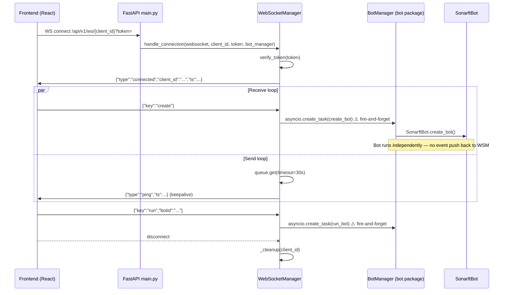
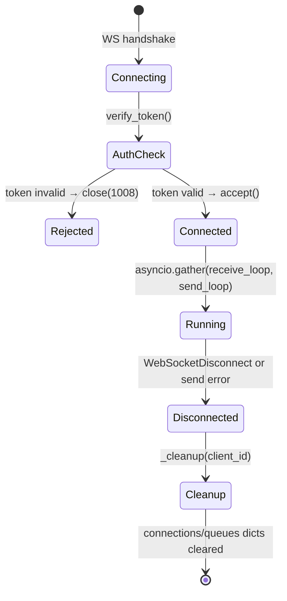

# Prompt 05 — WebSocket Real-Time Data Streaming Review

**Generated:** July 2025  
**Reviewer:** Amazon Q (Senior Python / Async Systems / WebSocket)  
**Source files inspected:**
- `packages/api/src/websocket/manager.py`
- `packages/api/src/main.py`
- `packages/api/src/services/bot_service.py`
- `packages/api/src/core/security.py`
- `packages/bot/sonarft_bot.py`
- `packages/bot/sonarft_manager.py`
- `shared/types/api.ts` (client-side contract)

**Output location:** `docs/websocket/05-websocket-realtime.md`

---

## Executive Summary

The SonarFT WebSocket implementation is architecturally sound: per-client `asyncio.Queue` isolation, a dual `asyncio.gather` loop for concurrent send/receive, 30-second keepalive pings, and graceful cleanup on disconnect. However, five significant issues require attention before production use. The most critical is a complete disconnect between the bot engine and the WebSocket manager — the bot has no mechanism to push events (trade success, order placed, log lines) into the WebSocket queues; the manager only receives commands and sends events it generates itself. This means the frontend receives no real-time trade or log data from running bots. Additionally: `asyncio.create_task` calls in `_receive_loop` are fire-and-forget with no error handling; the `bot_manager` reference bypasses the service layer; there is no per-client connection limit; and the message protocol is undocumented raw JSON with no versioning.

---

## WebSocket Architecture Diagram



---

## 1. WebSocket Endpoint Design

| Property | Value |
|---|---|
| URL pattern | `ws://host/api/v1/ws/{client_id}` |
| Auth mechanism | `?token=<jwt>` query parameter |
| Protocol | JSON text frames |
| Direction | Bidirectional (commands in, events out) |
| Registered in | `main.py:57` as inline closure |
| Handler class | `WebSocketManager.handle_connection` |

The endpoint is registered as an inline closure inside `create_app()` rather than as a router, which was flagged in Prompt 01. The `client_id` path parameter is not validated with a regex pattern (unlike `botid` on REST endpoints).

---

## 2. Connection Management

### Connection Tracking

```python
# manager.py:27-29
class WebSocketManager:
    def __init__(self) -> None:
        self.connections: Dict[str, WebSocket] = {}   # client_id → WebSocket
        self.queues: Dict[str, asyncio.Queue] = {}    # client_id → Queue(maxsize=1000)
```

Connections are tracked in two plain dicts keyed by `client_id`. This means:

- **One connection per `client_id`** — if the same client reconnects, the old `WebSocket` reference in `self.connections` is silently overwritten but the old connection is never explicitly closed. The old send loop will eventually fail with a `WebSocketDisconnect` and clean up, but there is a window where two send loops may be draining the same queue simultaneously.
- **No maximum connection limit** — any number of clients can connect concurrently. Under load, each connection holds an `asyncio.Queue` (up to 1000 items) and two coroutines.

### Connection Lifecycle



### Cleanup

```python
# manager.py:113-116
def _cleanup(self, client_id: str) -> None:
    self.connections.pop(client_id, None)
    self.queues.pop(client_id, None)
    _logger.info("Client %s disconnected", client_id)
```

Cleanup correctly removes both the connection and the queue. However, any `asyncio.create_task` calls dispatched during the session (bot create/run/remove) are not tracked or cancelled on disconnect — they continue running after the client has gone.

---

## 3. The Critical Gap — Bot Has No Event Push Path

This is the most significant architectural issue in the WebSocket implementation. The bot engine (`SonarftBot`, `SonarftSearch`, `SonarftExecution`) runs entirely independently and has no reference to `WebSocketManager` or its queues. There is no callback, event bus, or queue injection that would allow the bot to push events to the frontend.

**What the frontend expects to receive** (from `shared/types/api.ts`):

| Event Type | When | Bot-side source |
|---|---|---|
| `log` | Every bot log line | `SonarftBot.logger` |
| `bot_created` | After `create_bot` completes | `BotManager.create_bot` |
| `bot_removed` | After `remove_bot` completes | `BotManager.remove_bot` |
| `order_success` | After an order is placed | `SonarftExecution` |
| `trade_success` | After a trade completes | `SonarftSearch` / `TradeExecutor` |

**What actually happens:**

The `WebSocketManager` only pushes:
1. `{"type": "connected", ...}` — on connect
2. `{"type": "error", ...}` — if bot limit is exceeded during `create` command
3. `{"type": "ping", ...}` — keepalive every 30 seconds

Events 2–5 from the table above are never sent. The frontend will see a connection, a ping every 30 seconds, and nothing else — no trade results, no log lines, no bot lifecycle events.

**Root cause:** `BotManager.create_bot` and `run_bot` are called via `asyncio.create_task` with no reference to the WebSocket queue. The bot's logger writes to the Python logging system, not to the queue.

**Required fix:** Inject the `WebSocketManager` (or a per-client queue reference) into `BotManager` so it can push events after lifecycle operations complete:

```python
# In WebSocketManager._receive_loop — after create_task:
async def _handle_create(client_id: str):
    botid = await bot_manager.create_bot(client_id)
    await self.push_event(client_id, {
        "type": "bot_created",
        "botid": botid,
        "ts": int(time.time()),
    })

asyncio.create_task(_handle_create(client_id))
```

For log streaming, a custom `logging.Handler` that writes to the per-client queue (similar to the original `AsyncHandler` pattern described in the bot README) needs to be wired into the bot's logger at creation time.

---

## 4. Message Protocol

### Inbound Commands (Frontend → API)

| Field | Type | Values | Required |
|---|---|---|---|
| `key` | `str` | `"create"`, `"run"`, `"remove"`, `"set_simulation"` | ✅ |
| `botid` | `str` | Any bot ID | Required for `run`, `remove`, `set_simulation` |
| `value` | `any` | `true`/`false` for `set_simulation` | Required for `set_simulation` |

Issues:
- `botid` in inbound commands is not validated against the `^[a-zA-Z0-9_-]{1,64}$` pattern used on REST endpoints (`manager.py:88,91,95`)
- `value` for `set_simulation` uses `event.get("value", True)` — any truthy value is accepted, not just booleans
- Unknown `key` values are silently ignored with no error response to the client
- The TypeScript contract uses `type: "keypress"` as the outer field but the Python handler reads `key` directly — the `type` field is never checked

### Outbound Events (API → Frontend)

| Event | Fields | Sent When |
|---|---|---|
| `connected` | `type`, `client_id`, `ts` | On successful connection |
| `error` | `type`, `message`, `ts` | Bot limit exceeded |
| `ping` | `type`, `ts` | Every 30s (send loop timeout) |
| `bot_created` | ⚠️ Never sent | Should be sent after `create` completes |
| `bot_removed` | ⚠️ Never sent | Should be sent after `remove` completes |
| `log` | ⚠️ Never sent | Should stream bot log lines |
| `order_success` | ⚠️ Never sent | Should be sent after order placement |
| `trade_success` | ⚠️ Never sent | Should be sent after trade completion |

### Protocol Versioning

There is no protocol version field in any message. If the message format changes, all connected clients will break silently. A `version` field on the `connected` event would allow clients to detect incompatible protocol changes:

```json
{"type": "connected", "client_id": "abc", "protocol_version": 1, "ts": 1720000000}
```

---

## 5. Fire-and-Forget Tasks — HIGH

```python
# manager.py:86,91,95,99
asyncio.create_task(bot_manager.create_bot(client_id))
asyncio.create_task(bot_manager.run_bot(botid))
asyncio.create_task(bot_manager.remove_bot(botid))
asyncio.create_task(bot_manager.set_simulation_mode(botid, value))
```

All four bot operations are dispatched as fire-and-forget tasks. If any of them raise an exception:
- The exception is silently swallowed by the event loop (Python logs an "unhandled exception in task" warning to stderr but the client receives nothing)
- The client has no way to know the operation failed
- No cleanup is performed

The correct pattern wraps each task in a coroutine that catches exceptions and pushes an error event:

```python
async def _safe_task(coro, client_id: str, error_msg: str):
    try:
        await coro
    except Exception as exc:
        _logger.error("Task failed for client %s: %s", client_id, exc)
        await self.push_event(client_id, {
            "type": "error",
            "message": error_msg,
            "ts": int(time.time()),
        })

asyncio.create_task(_safe_task(
    bot_manager.create_bot(client_id),
    client_id,
    "Failed to create bot"
))
```

---

## 6. Error Handling

| Scenario | Current Handling | Assessment |
|---|---|---|
| Auth failure | `websocket.close(code=1008)` — not logged | ⚠️ Silent — no log, no error frame |
| JSON parse error | `break` — exits receive loop, triggers cleanup | ⚠️ Client gets no error message |
| Send failure | `break` — exits send loop, triggers cleanup | ✅ Acceptable |
| Bot task exception | Silently swallowed | ❌ Client never notified |
| Queue full (1000 items) | `pass` — event dropped silently | ⚠️ Client misses events with no indication |
| Receive loop `Exception` | `break` — same as JSON error | ⚠️ Overly broad catch |

The receive loop catch is too broad:

```python
# manager.py:76
except (json.JSONDecodeError, Exception):
    break
```

`json.JSONDecodeError` is a subclass of `ValueError` which is a subclass of `Exception` — the first clause is redundant. More importantly, catching all `Exception` types means a transient network hiccup (which should be retried) is treated the same as a malformed message (which should send an error and continue).

---

## 7. Performance & Scalability

| Dimension | Current | Limit / Risk |
|---|---|---|
| Concurrent connections | Unbounded | No `MAX_CONNECTIONS` guard |
| Queue size per client | 1000 events | Drop-on-full is silent |
| Keepalive interval | 30 seconds | ✅ Reasonable |
| Send loop timeout | 30 seconds | ✅ Prevents indefinite blocking |
| Bot tasks per connection | Unbounded | Each `create_task` is untracked |
| Memory per connection | ~1 Queue + 2 coroutines | ~8KB base + queue items |
| Multi-process scaling | ❌ Not supported | In-memory dicts — single process only |

At 100 concurrent clients each with a full queue: 100 × 1000 × ~500 bytes/event ≈ 50 MB queue memory. This is manageable. The real risk is unbounded `asyncio.create_task` calls — a client that rapidly sends `create` commands will spawn many concurrent `BotManager.create_bot` coroutines (the bot-count cap only prevents storage, not concurrent creation attempts).

---

## 8. Resource Management

### Orphaned Tasks on Disconnect

When a client disconnects, `_cleanup` removes the connection and queue but does not cancel any `asyncio.create_task` calls that were dispatched during the session. A `create_bot` task that was in-flight when the client disconnected will complete and store the bot in `BotManager._bots` — but the client will never receive the `bot_created` event and may not know the bot was created.

### Queue Leak on Reconnect

If a client reconnects with the same `client_id`, `get_or_create_queue` returns the existing queue (which was cleaned up by `_cleanup` on disconnect — actually the queue is deleted in `_cleanup`, so a new one is created). This is correct. However, the old `WebSocket` in `self.connections` is overwritten without closing it, leaving the old connection in an undefined state.

---

## 9. Integration with Bot Engine

### Current State

```
WebSocketManager ──(asyncio.create_task)──► BotManager
                                                │
                                                ▼
                                           SonarftBot
                                                │
                                                ▼
                                    [runs independently, no callback]
```

### Required State

```
WebSocketManager ──(asyncio.create_task)──► BotManager
        ▲                                       │
        │                                       ▼
        │                                  SonarftBot
        │                                       │
        └──(queue.put / log handler)────────────┘
```

The bot's logger is injected at construction time (`BotManager.create_bot` passes `self.logger` to `SonarftBot`). A custom `logging.Handler` subclass that writes structured log events to the per-client `asyncio.Queue` can be added to this logger without modifying the bot's internal logic:

```python
class WsLogHandler(logging.Handler):
    def __init__(self, queue: asyncio.Queue):
        super().__init__()
        self._queue = queue

    def emit(self, record: logging.LogRecord) -> None:
        try:
            self._queue.put_nowait({
                "type": "log",
                "level": record.levelname,
                "message": self.format(record),
                "ts": int(record.created),
            })
        except asyncio.QueueFull:
            pass
```

This handler would be added to the bot's logger in `WebSocketManager._receive_loop` before dispatching the `create` task, and removed in `_cleanup`.

---

## 10. Client Integration Guide

### Connection

```typescript
// shared/types/api.ts — WsCommand types already defined
const ws = new WebSocket(`${VITE_WS_URL}/${clientId}?token=${token}`);
```

### Reconnection Strategy

The API provides no reconnection guidance. Recommended client-side strategy:

```typescript
function connectWithBackoff(clientId: string, token: string) {
    let attempt = 0;
    const connect = () => {
        const ws = new WebSocket(`${WS_URL}/${clientId}?token=${token}`);
        ws.onclose = (e) => {
            if (e.code === 1008) return; // Auth failure — do not retry
            const delay = Math.min(1000 * 2 ** attempt, 30000);
            attempt++;
            setTimeout(connect, delay);
        };
        ws.onopen = () => { attempt = 0; };
    };
    connect();
}
```

### Expected Message Handling

```typescript
ws.onmessage = (e) => {
    const event: WsEvent = JSON.parse(e.data);
    switch (event.type) {
        case "connected": /* store client_id */ break;
        case "ping":      /* ignore or reset timeout */ break;
        case "log":       /* append to log panel */ break;
        case "bot_created": /* update bot list */ break;
        case "bot_removed": /* update bot list */ break;
        case "order_success": /* update order history */ break;
        case "trade_success": /* update trade history */ break;
        case "error":     /* show error notification */ break;
    }
};
```

Note: `bot_created`, `bot_removed`, `order_success`, `trade_success`, and `log` events are currently never sent by the server (see Section 3).

---

## Issues Summary

| # | Issue | Severity | Location |
|---|---|---|---|
| 1 | Bot engine has no event push path to WebSocket queues — `bot_created`, `trade_success`, `log` events never sent | **Critical** | `manager.py`, `sonarft_bot.py`, `sonarft_manager.py` |
| 2 | `asyncio.create_task` calls are fire-and-forget — exceptions silently swallowed, client never notified of failures | **High** | `manager.py:86,91,95,99` |
| 3 | Orphaned tasks not cancelled on client disconnect — bots may be created after client has gone | **High** | `manager.py:113-116` |
| 4 | No per-client connection limit — same `client_id` reconnect overwrites connection without closing old one | **Medium** | `manager.py:52` |
| 5 | `botid` in inbound WS commands not validated against regex pattern | **Medium** | `manager.py:88,91` |
| 6 | Queue-full events dropped silently — client has no indication it missed events | **Medium** | `manager.py:38-40` |
| 7 | Overly broad `except (json.JSONDecodeError, Exception): break` — transient errors terminate the receive loop | **Medium** | `manager.py:76` |
| 8 | No protocol version field — format changes will silently break clients | **Low** | `manager.py:62-65` |
| 9 | Unknown `key` values silently ignored — no error response to client | **Low** | `manager.py:84-100` |
| 10 | No maximum concurrent connection limit | **Low** | `manager.py:27` |

---

## Recommendations

### Priority 1 — Critical

**1. Wire bot lifecycle events into WebSocket queues**

Wrap each `create_task` in a coroutine that awaits the result and pushes the appropriate event:

```python
async def _handle_create(self, client_id: str, bot_manager) -> None:
    try:
        botid = await bot_manager.create_bot(client_id)
        await self.push_event(client_id, {
            "type": "bot_created", "botid": botid, "ts": int(time.time())
        })
    except Exception as exc:
        _logger.error("create_bot failed for %s: %s", client_id, exc)
        await self.push_event(client_id, {
            "type": "error", "message": str(exc), "ts": int(time.time())
        })
```

**2. Add log streaming via `WsLogHandler`**

Before dispatching `create_bot`, attach a `WsLogHandler` to the bot's logger. Remove it in `_cleanup`. This delivers real-time log lines to the frontend without modifying the bot's internal logic.

### Priority 2 — High

**3. Track and cancel tasks on disconnect**

```python
self._tasks: Dict[str, list[asyncio.Task]] = {}

# In _receive_loop:
task = asyncio.create_task(self._handle_create(client_id, bot_manager))
self._tasks.setdefault(client_id, []).append(task)

# In _cleanup:
for task in self._tasks.pop(client_id, []):
    if not task.done():
        task.cancel()
```

**4. Validate `botid` in inbound commands**

```python
import re
_BOTID_RE = re.compile(r'^[a-zA-Z0-9_-]{1,64}$')

elif key == "run" and botid:
    if not _BOTID_RE.match(str(botid)):
        await self.push_event(client_id, {"type": "error", "message": "Invalid botid", "ts": int(time.time())})
        continue
    asyncio.create_task(...)
```

### Priority 3 — Medium / Low

**5. Close existing connection on reconnect**

```python
existing = self.connections.get(client_id)
if existing:
    await existing.close(code=1001)  # Going Away
self.connections[client_id] = websocket
```

**6. Add protocol version to `connected` event**

```python
await queue.put_nowait({
    "type": "connected",
    "client_id": client_id,
    "protocol_version": 1,
    "ts": int(time.time()),
})
```

**7. Send error frame on unknown command**

```python
else:
    await self.push_event(client_id, {
        "type": "error",
        "message": f"Unknown command: {key!r}",
        "ts": int(time.time()),
    })
```

---

_Part of the SonarFT API Code Review Prompt Suite — Prompt 05_  
_Previous: [Prompt 04 — Authentication & Security](../security/04-authentication-security.md)_  
_Next: [Prompt 06 — Error Handling & Logging](../prompts/06-error-handling-logging.md)_
