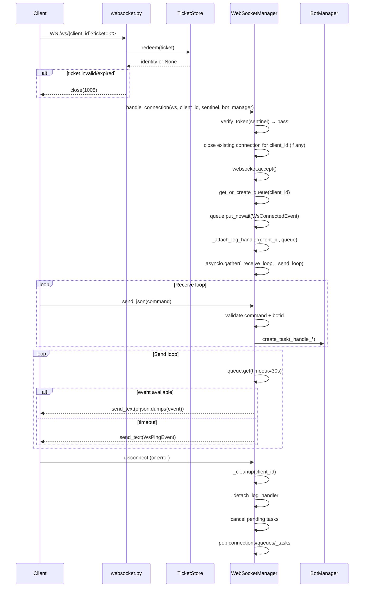

# WebSocket Real-Time Data Streaming Review

**Prompt ID:** 05-API-WS  
**Package:** `packages/api`  
**Output:** `docs/websocket/05-websocket-realtime.md`  
**Reviewed:** July 2025  
**Status:** Complete

---

## Executive Summary

The WebSocket implementation is well-structured and covers the full connection lifecycle correctly: ticket-based auth, per-client asyncio queues, concurrent send/receive loops via `asyncio.gather()`, keepalive pings, log handler attach/detach, and task cleanup on disconnect. The log-streaming bridge — attaching a `WsLogHandler` to `logging.root` per connection — is an elegant zero-coupling design that requires no changes to the bot engine. The primary architectural concern is that the `WebSocketManager` is a **module-level singleton** instantiated at import time (`websocket.py:17`), bypassing the lifespan pattern used for all other services. The main scalability concern is the **O(N) log handler overhead**: with N concurrent WebSocket clients, every `sonarft.*` log record is processed by N handlers. At low concurrency this is negligible; at 50+ concurrent clients on a high-frequency bot it becomes measurable. A secondary concern is that **background tasks spawned by WS commands are tracked but never awaited** — a task that raises an unhandled exception after the connection closes will be silently swallowed.

---

## WebSocket Architecture Diagram

```mermaid
graph TD
    subgraph "Client (packages/web)"
        FE[useWebSocket.tsx\nExponential backoff reconnect\nPing watchdog 60s timeout]
    end

    subgraph "packages/api — WebSocket Layer"
        EP[websocket.py\nWS /ws/{client_id}\nTicket or token auth]
        TK[tickets.py\nTicketStore\nSingle-use 30s TTL]
        WM[WebSocketManager\nmanager.py]

        subgraph "Per-Client State"
            Q[asyncio.Queue\nmaxsize=1000]
            LH[WsLogHandler\nattached to logging.root]
            TS[_tasks list\nbackground task refs]
        end

        subgraph "Concurrent Loops"
            RL[_receive_loop\ncommand dispatch]
            SL[_send_loop\nqueue drain + ping]
        end
    end

    subgraph "packages/bot"
        BM[BotManager]
        LOG[sonarft.* loggers\nlogging.root]
    end

    FE -->|WS connect ?ticket=| EP
    EP -->|redeem| TK
    EP -->|handle_connection| WM
    WM --> Q & LH & TS
    WM -->|asyncio.gather| RL & SL
    RL -->|create_task| TS
    TS -->|BotManager calls| BM
    LOG -->|emit via filter| LH
    LH -->|put_nowait| Q
    SL -->|drain| Q
    SL -->|send_text orjson| FE
    FE -->|send_json command| RL
```

---

## Message Protocol Specification

### Server → Client events

All events are JSON objects serialised with `orjson`. Every event has a `type` discriminator and a `ts` Unix timestamp (integer seconds).

| Event type | Fields | Trigger |
|---|---|---|
| `connected` | `type`, `ts`, `client_id` | Immediately after `websocket.accept()` |
| `log` | `type`, `ts`, `level`, `message` | Any `sonarft.*` log record |
| `bot_created` | `type`, `ts`, `botid` | After `BotManager.create_bot()` succeeds |
| `bot_removed` | `type`, `ts`, `botid` | After `BotManager.remove_bot()` succeeds |
| `bot_stopped` | `type`, `ts`, `botid` | After `BotManager.pause_bot()` succeeds |
| `order_success` | `type`, `ts` | When `"Order: Success"` appears in a log line |
| `trade_success` | `type`, `ts` | When `"Trade: Success"` appears in a log line |
| `error` | `type`, `ts`, `message` | Command validation failure or handler exception |
| `ping` | `type`, `ts` | Every 30 seconds when queue is idle |

### Client → Server commands

All commands are JSON objects. The `key` field is the discriminator.

| Command | Fields | Handler |
|---|---|---|
| `create` | `key` | `_handle_create` — creates and auto-runs a new bot |
| `run` | `key`, `botid` | `_handle_run` — starts a paused bot |
| `stop` | `key`, `botid` | `_handle_stop` — pauses a running bot |
| `remove` | `key`, `botid` | `_handle_remove` — removes a bot |
| `set_simulation` | `key`, `botid`, `value: bool` | `_handle_set_simulation` — toggles sim mode |

**Note:** The `stop` command is handled by the server but is absent from the TypeScript `WsCommand` union in `shared/types/api.ts` (identified in Prompt 03 as M2).

### Protocol versioning

There is no protocol version field in any event or command. A breaking change to the message schema (e.g. renaming a field) would silently break all connected clients. The `shared/types/api.ts` file serves as the de-facto contract but has no version identifier.

---

## Connection Lifecycle Diagram



---

## 1. Connection Management

### Connection tracking (`manager.py:WebSocketManager`)

```python
self.connections: dict[str, WebSocket] = {}   # client_id → WebSocket
self.queues: dict[str, asyncio.Queue] = {}     # client_id → Queue(maxsize=1000)
self._tasks: dict[str, list[asyncio.Task]] = {} # client_id → [Task, ...]
self._log_handlers: dict[str, WsLogHandler] = {} # client_id → Handler
```

All state is keyed by `client_id` (string). One connection per `client_id` is enforced — a new connection for an existing `client_id` closes the previous one with code `1001` before accepting the new one (`manager.py:handle_connection:120-125`).

### Cleanup on disconnect (`manager.py:_cleanup`)

`_cleanup()` is called in the `finally` block of `handle_connection`, guaranteeing execution even on unexpected disconnects:

1. `connections.pop(client_id)` — removes WebSocket reference
2. `queues.pop(client_id)` — releases the queue and all buffered events
3. `_detach_log_handler(client_id)` — removes `WsLogHandler` from `logging.root`
4. Cancels all pending background tasks for the client

This is correct and complete. No resource leaks were found in the cleanup path.

### Stale connection replacement

When a client reconnects (e.g. after a network drop), the existing `WebSocket` object is closed with code `1001` (Going Away). The `except Exception` around the close call (`manager.py:122`) ensures a failed close on a dead socket does not prevent the new connection from being accepted.

---

## 2. Log Streaming Bridge

The `WsLogHandler` is the most architecturally interesting component. It bridges the bot engine's Python logging system to the WebSocket layer with zero coupling:

```
sonarft_manager.logger.info("Bot started")
  → logging.root dispatches to all handlers
    → WsLogHandler.filter() checks record.name.startswith("sonarft")
      → WsLogHandler.emit() → queue.put_nowait({"type": "log", ...})
        → _send_loop drains queue → websocket.send_text(...)
```

**Filter correctness:** `_is_bot_record()` checks `record.name.startswith("sonarft")`. This correctly passes all bot module loggers (`sonarft_manager`, `sonarft_bot`, `sonarft_search`, etc.) and blocks API-internal loggers (`src.services.*`, `uvicorn`, `fastapi`).

**Structured event detection:** `WsLogHandler.emit()` scans the formatted message for `"Order: Success"` and `"Trade: Success"` strings and emits additional `order_success`/`trade_success` events. This is a string-matching heuristic — it depends on the exact log message format in `sonarft_helpers.py:save_order_data` and `save_trade_data`. If those log messages change, the structured events will silently stop being emitted.

**`put_nowait` on a full queue:** When the queue is full (1000 events), `put_nowait` raises `asyncio.QueueFull`, which is caught and silently ignored in `emit()`. A warning is emitted by `push_event()` when called directly, but not from `WsLogHandler.emit()`. A slow client or a high-frequency bot can cause silent event loss with no client-visible indication.

---

## 3. Background Task Management

Commands that trigger bot operations (`create`, `run`, `stop`, `remove`, `set_simulation`) are dispatched as `asyncio.create_task()` calls and tracked in `self._tasks[client_id]`. On disconnect, pending tasks are cancelled.

**Gap: tasks are tracked but never awaited.** If a task raises an unhandled exception after the connection closes (e.g. `_handle_create` fails after `_cleanup` has already run), the exception is logged as an "unhandled exception in task" by the asyncio event loop but is otherwise silently swallowed. There is no mechanism to notify the client of a post-disconnect failure.

**Gap: completed tasks accumulate in `_tasks[client_id]`.** The list is only cleared on disconnect. A long-lived connection that issues many commands will accumulate references to completed `Task` objects. Each completed task holds a small amount of memory, but over hours of operation this could grow. A periodic cleanup of done tasks would prevent this.

---

## 4. Performance & Scalability

### Queue backpressure

Each client has a `asyncio.Queue(maxsize=1000)`. This provides backpressure — a slow client cannot cause unbounded memory growth. However, the failure mode (silent event drop) is not communicated to the client.

### O(N) log handler overhead

With N concurrent WebSocket clients, `logging.root` has N `WsLogHandler` instances. Every log record from any `sonarft.*` logger is dispatched to all N handlers. Each handler:
1. Applies the `_is_bot_record` filter (fast — `str.startswith`)
2. Formats the record
3. Calls `queue.put_nowait()`

At low concurrency (< 10 clients) this is negligible. At 50 concurrent clients with a bot emitting 10 log records/second, this is 500 handler invocations/second on the event loop thread. The formatting step (`self.format(record)`) is the most expensive part — it is called once per handler per record, not once per record.

### Keepalive ping

`_send_loop` uses `asyncio.wait_for(queue.get(), timeout=30.0)` — if no event arrives within 30 seconds, a `WsPingEvent` is sent. The client-side `useWebSocket.tsx` has a 60-second ping watchdog (`PING_TIMEOUT_MS = 60_000`) — it closes the socket if no message is received within 60 seconds. The 30-second server ping interval is correctly within the 60-second client timeout window.

### Concurrent connection limit

There is no explicit limit on the number of concurrent WebSocket connections. The only implicit limit is the `max_bots_per_client` setting (default 5), which limits bots per client but not WebSocket connections per client or total connections.

---

## 5. Client Integration (Frontend)

`useWebSocket.tsx` implements:

- **Exponential backoff reconnect:** `delay = min(1000 * 2^attempt, 30000)` ms — correct
- **Ping watchdog:** closes socket if no message received in 60 seconds — correct
- **`addEventListener("message")` for ping reset** — uses `addEventListener` rather than `onmessage` assignment, allowing `useBots` to also set a message handler without overwriting the ping-reset listener — correct pattern

**Gap: no reconnect notification to the user.** When the socket closes and reconnect is in progress, `wsOpen` is `false` and `wsError` may be set, but there is no `reconnecting: boolean` state exposed. The UI cannot distinguish "disconnected permanently" from "reconnecting".

**Gap: no message ordering guarantee on reconnect.** Events emitted while the client is disconnected are lost — the queue is destroyed on `_cleanup()`. After reconnect, the client receives a fresh `connected` event but no replay of missed events.

---

## 6. Testing Coverage

| Test area | File | Coverage |
|---|---|---|
| Connection lifecycle | `test_websocket.py:TestWebSocketConnection` | ✅ connect, `connected` event, `ts` field |
| Auth — invalid token | `test_websocket.py:TestWebSocketAuth` | ✅ 1008 close code |
| Auth — dev mode | `test_websocket.py:TestWebSocketAuth` | ✅ any token accepted |
| Create command | `test_websocket.py:TestWebSocketCreateCommand` | ✅ success, limit, failure |
| Run command | `test_websocket.py:TestWebSocketRunCommand` | ✅ success, failure |
| Stop command | `test_websocket.py:TestWebSocketStopCommand` | ✅ success, `bot_stopped` event, failure, missing/invalid botid |
| Remove command | `test_websocket.py:TestWebSocketRemoveCommand` | ✅ success, failure |
| set_simulation command | `test_websocket.py:TestWebSocketSetSimulationCommand` | ✅ true/false, failure |
| Input validation | `test_websocket.py:TestWebSocketInputValidation` | ✅ invalid botid, missing botid, unknown command, invalid JSON, oversized botid |
| Log handler attach/detach | `test_websocket.py`, `test_log_streaming.py` | ✅ count before/during/after |
| Log filter correctness | `test_log_streaming.py:TestWsLogHandlerFilter` | ✅ all sonarft loggers pass; non-sonarft blocked |
| E2E log delivery | `test_log_streaming.py:TestLogStreamingE2E` | ✅ message content, level, ordering |
| `order_success`/`trade_success` events | `test_log_streaming.py:TestStructuredEvents` | ✅ both events emitted |
| Ticket store | `test_tickets.py` | ✅ issue, redeem, expiry, single-use, capacity, eviction |

**Not tested:**
- Queue full / event drop behaviour
- Concurrent connections from multiple clients simultaneously
- Task accumulation over a long-lived connection
- Reconnect behaviour (client-side only, not tested at API level)
- `set_simulation` ownership check (not implemented — see Prompt 04 H2)

---

## Concerns & Recommendations

### High

| # | Concern | Location | Detail |
|---|---|---|---|
| H1 | **`WebSocketManager` is a module-level singleton** | `websocket.py:17` | `_ws_manager = WebSocketManager()` is instantiated at import time, outside `app.state`. Carried forward from Prompt 01. Prevents testing isolation and bypasses the lifespan pattern. |
| H2 | **WS commands lack ownership verification** | `manager.py:_receive_loop` | `run`, `stop`, `remove` commands do not verify `botid` belongs to `client_id`. Carried forward from Prompt 04 H2. |

### Medium

| # | Concern | Location | Detail |
|---|---|---|---|
| M1 | **Silent event drop when queue is full** | `manager.py:WsLogHandler.emit:68` | `asyncio.QueueFull` is caught and silently ignored. The client receives no indication that events were dropped. |
| M2 | **Background tasks accumulate in `_tasks` list** | `manager.py:_track_task` | Completed tasks are never removed from the list until disconnect. A long-lived connection with many commands accumulates stale `Task` references. |
| M3 | **`order_success`/`trade_success` detection is a string-match heuristic** | `manager.py:WsLogHandler.emit:72-75` | Depends on exact log message strings `"Order: Success"` and `"Trade: Success"` in `sonarft_helpers.py`. A log message change silently breaks structured event emission. |
| M4 | **No protocol version field** | `schemas.py`, `shared/types/api.ts` | Breaking schema changes cannot be detected by clients. |
| M5 | **No explicit concurrent connection limit** | `manager.py` | No cap on total WebSocket connections. A single client can open multiple connections (each replaces the previous, so this is self-limiting per client, but there is no global cap). |

### Low

| # | Concern | Location | Detail |
|---|---|---|---|
| L1 | **O(N) log handler overhead** | `manager.py:_attach_log_handler` | Each concurrent client adds a handler to `logging.root`. Record formatting is repeated N times per log record. Acceptable at low concurrency; measurable at 50+ clients. |
| L2 | **No `reconnecting` state exposed by `useWebSocket`** | `useWebSocket.tsx` | UI cannot distinguish "disconnected" from "reconnecting in progress". |
| L3 | **Missed events on reconnect are not replayed** | `manager.py:_cleanup` | Queue is destroyed on disconnect. Events emitted during the reconnect window are permanently lost. |
| L4 | **`stop` command missing from TypeScript `WsCommand` union** | `shared/types/api.ts` | Carried forward from Prompt 03 M2. |

---

## Recommendations

### Priority 1

**R1 (H1): Move `WebSocketManager` into `app.state`**

```python
# main.py:_lifespan
from .websocket.manager import WebSocketManager
app.state.ws_manager = WebSocketManager()

# websocket.py — read from app.state
ws_manager = websocket.app.state.ws_manager
await ws_manager.handle_connection(websocket, client_id, resolved_token, bot_service._manager)
```

**R2 (H2): Add ownership check to WS command handlers**

```python
# manager.py:_receive_loop — for run/stop/remove
elif key in ("run", "stop", "remove"):
    if not botid or not _BOTID_RE.match(str(botid)):
        await self._push_model(client_id, WsErrorEvent(message="Invalid or missing botid", ...))
    elif botid not in bot_manager.get_botids(client_id):
        await self._push_model(client_id, WsErrorEvent(message="Bot not found", ...))
    else:
        task = asyncio.create_task(self._handle_run/stop/remove(...))
        self._track_task(client_id, task)
```

---

### Priority 2

**R3 (M1): Emit a `queue_full` error event to the client**

```python
# manager.py:WsLogHandler.emit
except asyncio.QueueFull:
    # Notify the client that events are being dropped
    try:
        self._queue.put_nowait({
            "type": "error",
            "ts": int(record.created),
            "message": "Event queue full — some log events were dropped",
        })
    except asyncio.QueueFull:
        pass  # queue is truly full — nothing more we can do
```

**R4 (M2): Prune completed tasks periodically**

```python
# manager.py:_track_task
def _track_task(self, client_id: str, task: asyncio.Task) -> None:
    tasks = self._tasks.setdefault(client_id, [])
    # Prune completed tasks before appending
    self._tasks[client_id] = [t for t in tasks if not t.done()]
    self._tasks[client_id].append(task)
```

**R5 (M3): Replace string-match heuristic with a structured event hook**

Instead of scanning log messages, add a callback mechanism to `SonarftHelpers`:

```python
# sonarft_helpers.py
async def save_order_data(self, botid, order_info: dict) -> None:
    ...
    self.logger.info("Order: Success")
    if self._on_order_success:
        await self._on_order_success(botid)
```

Or emit a dedicated `sonarft.events` logger record with a structured payload that `WsLogHandler` can detect by logger name rather than message content.

---

### Priority 3

**R6 (L1): Single fan-out handler instead of N per-client handlers**

Replace N per-client handlers with a single root handler that fans out to all active queues:

```python
class WsFanOutHandler(logging.Handler):
    def __init__(self, manager: WebSocketManager) -> None:
        super().__init__()
        self._manager = manager

    def emit(self, record: logging.LogRecord) -> None:
        if not _is_bot_record(record):
            return
        msg = self.format(record)  # format once
        event = {"type": "log", "level": record.levelname, "message": msg, "ts": int(record.created)}
        for queue in self._manager.queues.values():
            try:
                queue.put_nowait(event)
            except asyncio.QueueFull:
                pass
```

This reduces formatting from O(N) to O(1) per record.

**R7 (M4): Add a `version` field to the WebSocket protocol**

```typescript
// shared/types/api.ts
export interface WsBaseEvent {
    type: WsEventType;
    ts: number;
    v: 1;  // protocol version — increment on breaking changes
}
```

---

## Client Integration Guide

### Connection flow

```
1. GET /api/v1/health → confirm server is up
2. POST /api/v1/ws/ticket (Authorization: Bearer <jwt>) → {"ticket": "...", "ttl_seconds": 30}
3. WS /api/v1/ws/{client_id}?ticket=<ticket> → receive {"type": "connected", "client_id": "..."}
4. Send commands as JSON: {"key": "create"} / {"key": "run", "botid": "..."}
5. Receive events as JSON: {"type": "log"|"bot_created"|"order_success"|..., "ts": ...}
```

### Reconnect strategy (implemented in `useWebSocket.tsx`)

- Exponential backoff: `min(1000 * 2^attempt, 30000)` ms
- Ping watchdog: close socket if no message in 60 seconds (server pings every 30s)
- On reconnect: re-fetch a new ticket (old ticket is single-use and expired)
- Missed events during disconnect window are not replayed — UI should re-fetch REST history on reconnect

### Error handling

| Close code | Meaning | Client action |
|---|---|---|
| `1000` | Normal closure | Reconnect if `autoReconnect=true` |
| `1001` | Going Away (replaced by new connection) | Reconnect |
| `1008` | Policy Violation (invalid/expired ticket) | Re-authenticate, get new ticket, reconnect |
| `1011` | Internal Error (BotService unavailable) | Retry after delay |

---

_Generated by Amazon Q Developer — SonarFT API Code Review Prompt Suite, Prompt 05_
