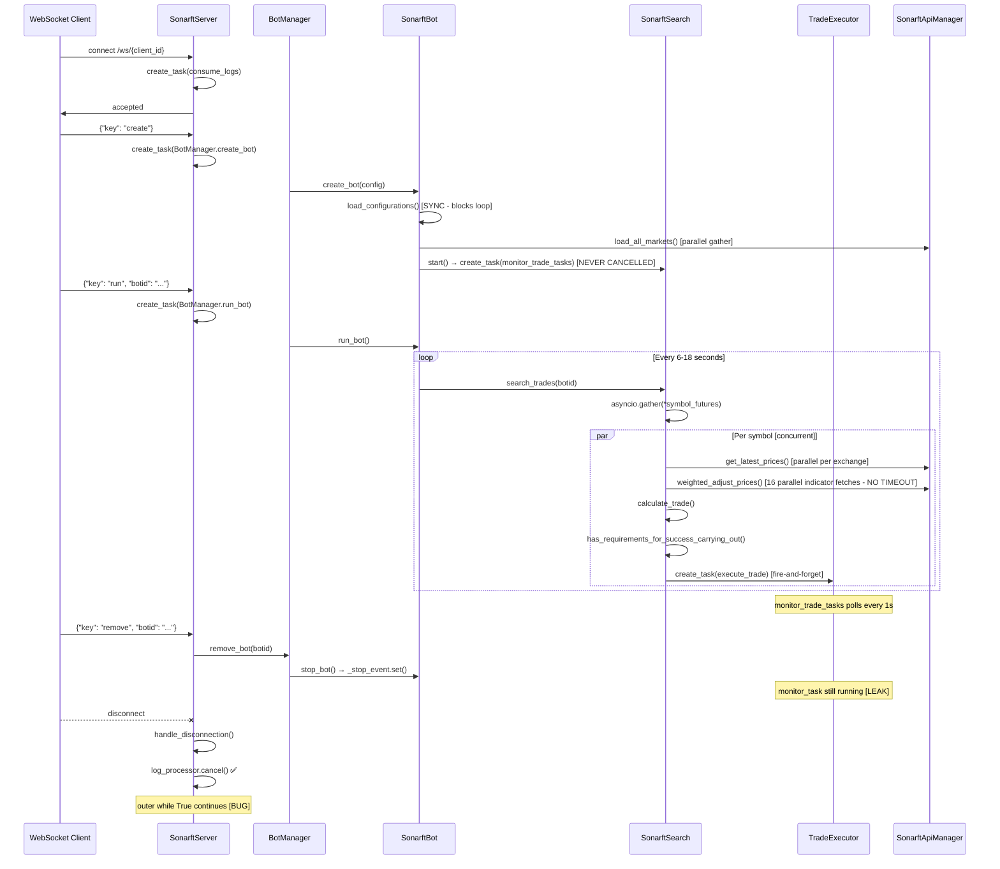

# SonarFT — Async Design & Concurrency Review

**Review Date:** July 2025
**Codebase Version:** 1.0.0
**Reviewer Role:** Senior Python Engineer / Async Systems Architect
**Scope:** All async/await patterns, task lifecycle, shared state, and concurrency safety across all Python source files
**Follows:** [Architecture & Project Structure Review](./overview.md)

---

## 1. Async/Await Correctness — Function Inventory

### 1.1 `sonarft_server.py`

| Function | What It Does | Awaited Calls | Blocking Ops | Risk |
|---|---|---|---|---|
| `websocket_endpoint` | Accepts WS connection, starts log processor, enters receive loop | `websocket.close`, `websocket.accept`, `asyncio.sleep`, `process_websocket_tasks` | None | **High** — `while True` with no break on disconnect |
| `process_websocket_tasks` | Races receive vs send tasks, dispatches winner | `asyncio.wait`, `process_received_task` | None | Medium |
| `process_received_task` | Decodes JSON, dispatches bot action | `perform_action` | None | Low |
| `perform_action` | Creates async task for bot action | `asyncio.create_task` (fire-and-forget) | None | **High** — task not tracked per-client |
| `send_logs` | Polls per-client log deque, sends over WS | `websocket.send_text`, `asyncio.sleep` | None | Medium — `while True` with no exit |
| `get_default_parameters` | Reads parameters.json | `open()` (sync) | **Blocking file I/O** | Medium |
| `get_default_indicators` | Reads indicators.json | `open()` (sync) | **Blocking file I/O** | Medium |
| `get_bot_parameters` | Reads `{client_id}_parameters.json` | `open()` (sync) | **Blocking file I/O** | Medium |
| `set_bot_parameters` | Writes `{client_id}_parameters.json` | `open()` (sync) | **Blocking file I/O** | Medium |
| `get_bot_indicators` | Reads `{client_id}_indicators.json` | `open()` (sync) | **Blocking file I/O** | Medium |
| `set_bot_indicators` | Writes `{client_id}_indicators.json` | `open()` (sync) | **Blocking file I/O** | Medium |
| `get_bot_orders` | Reads `{botid}_orders.json` | `open()` (sync) | **Blocking file I/O** | Medium |
| `get_bot_trades` | Reads `{botid}_trades.json` | `open()` (sync) | **Blocking file I/O** | Medium |
| `AsyncHandler.consume_logs` | Drains log queue per client | `logs_queue.get`, `async_emit` | None | Low — but no cancellation guard |
| `AsyncHandler.async_emit` | Formats and stores log record | None | None | Low |

**Critical Issue — `websocket_endpoint` disconnect loop:**
```python
# sonarft_server.py ~L238
while True:
    await self.process_websocket_tasks(websocket, client_id, log_processor)
# WebSocketDisconnect is caught inside process_received_task → handle_disconnection
# but the outer while True loop CONTINUES after handle_disconnection returns,
# attempting to receive from a closed socket on every iteration → infinite error loop
```

**Critical Issue — all HTTP endpoints use synchronous `open()` inside async handlers:**
```python
# sonarft_server.py ~L90
async def get_default_parameters(...):
    with open("sonarftdata/config/parameters.json", "r", encoding="utf-8") as read_file:
        data = json.load(read_file)  # blocks the event loop
```
This blocks the entire asyncio event loop during file reads, stalling all concurrent bots.

---

### 1.2 `sonarft_manager.py`

| Function | What It Does | Awaited Calls | Blocking Ops | Risk |
|---|---|---|---|---|
| `add_bot_instance` | Adds bot to registry under lock | `async with self._lock` | None | Low ✅ |
| `remove_bot_instance` | Stops and removes bot under lock | `async with self._lock`, `stop_bot()` | None | Low ✅ |
| `get_bot_instance` | Returns bot by ID under lock | `async with self._lock` | None | Low ✅ |
| `set_update` | Updates bot state under lock | `async with self._lock` | None | Low ✅ |
| `get_update` | Reads bot state under lock | `async with self._lock` | None | Low ✅ |
| `create_bot` | Creates, stores, and logs new bot | `sonarft.create_bot`, `add_bot_instance`, `remove_bot` | `argparse.parse_args()` reads `sys.argv` | **High** |
| `run_bot` | Retrieves and runs bot | `get_bot_instance`, `sonarft.run_bot` | None | Low |
| `remove_bot` | Removes bot if it exists | `get_bot_instance`, `remove_bot_instance` | None | Low |

**Issue — `parse_args()` in async context:**
`argparse.parse_args()` reads `sys.argv` synchronously on every `create_bot` call. In a server context where bots are created via WebSocket messages, this is incorrect — CLI args are parsed at server startup, not per-bot-creation. This is not a blocking I/O issue but a logical correctness issue.

---

### 1.3 `sonarft_bot.py`

| Function | What It Does | Awaited Calls | Blocking Ops | Risk |
|---|---|---|---|---|
| `create_bot` | Loads config, inits API, wires modules | `InitializeModules`, `load_all_markets` | `open()` (sync, 6× config loads) | Medium |
| `run_bot` | Main bot loop with circuit breaker | `search_trades`, `asyncio.wait_for(shield(...))` | None | Low ✅ |
| `stop_bot` | Sets stop event | `_stop_event.set()` | None | Low ✅ |
| `InitializeModules` | Wires all module dependencies | `sonarft_search.start()` | None | Low ✅ |

**Good pattern — interruptible sleep:**
```python
# sonarft_bot.py ~L126
await asyncio.wait_for(
    asyncio.shield(self._stop_event.wait()),
    timeout=timesleep_size
)
```
Using `asyncio.shield` + `wait_for` for interruptible sleep is correct — the bot responds to stop signals without waiting the full sleep interval. ✅

**Good pattern — circuit breaker:**
The `run_bot` loop tracks `consecutive_failures` and stops after 5 failures with exponential backoff. ✅

---

### 1.4 `sonarft_search.py`

| Function | What It Does | Awaited Calls | Blocking Ops | Risk |
|---|---|---|---|---|
| `TradeExecutor.start` | Creates monitor background task | `asyncio.create_task` | None | Medium — task never cancelled |
| `TradeExecutor.monitor_trade_tasks` | Polls done tasks, logs results | `asyncio.sleep(1)` | None | Medium — `while True`, no exit |
| `TradeProcessor.start` | Starts executor background task | `trade_executor.start()` | None | Low |
| `TradeProcessor.process_symbol` | Fetches prices, iterates combinations | `get_the_latest_prices`, `process_trade_combination` | None | Low |
| `TradeProcessor.process_trade_combination` | Adjusts prices, calculates profit, validates, executes | `weighted_adjust_prices`, `has_requirements_for_success_carrying_out` | None | **High** — None dereference risk |
| `TradeValidator.has_requirements_for_success_carrying_out` | Parallel liquidity + spread checks | `asyncio.gather` (2 tasks), `verify_spread_threshold` | None | Low ✅ |
| `SonarftSearch.start` | Starts processor background tasks | `trade_processor.start()` | None | Low |
| `SonarftSearch.search_trades` | Concurrent symbol processing | `asyncio.gather(*futures, return_exceptions=True)` | None | Low ✅ |

**Good pattern — `return_exceptions=True`:**
```python
# sonarft_search.py ~L311
results = await asyncio.gather(*futures, return_exceptions=True)
for result in results:
    if isinstance(result, Exception):
        self.logger.error(...)
```
Exceptions from individual symbol searches are caught and logged without crashing the whole gather. ✅

**Issue — fire-and-forget trade execution:**
```python
# sonarft_search.py ~L74
trade_task = asyncio.create_task(
    self.sonarft_execution.execute_trade(botid, trade_data)
)
trade_task.botid = botid
self.trade_tasks.append(trade_task)
```
Tasks are appended to `self.trade_tasks` but if `monitor_trade_tasks` is cancelled or crashes, these tasks become dangling with no cleanup.

---

### 1.5 `sonarft_prices.py`

| Function | What It Does | Awaited Calls | Blocking Ops | Risk |
|---|---|---|---|---|
| `weighted_adjust_prices` | Fetches 16 indicators in parallel, adjusts prices | `asyncio.gather` (16 tasks), `asyncio.gather` (2 vol tasks) | None | **High** — wrong return tuple on failure |
| `dynamic_volatility_adjustment` | Fetches MACD + RSI, returns adjustment factor | `get_macd`, `get_rsi` | None | Low |
| `get_the_latest_prices` | Fetches latest prices, splits buy/sell | `get_latest_prices` | None | Low |
| `get_latest_prices` | Delegates to API manager | `api_manager.get_latest_prices` | None | Low |

**Critical Issue — wrong return arity on failure:**
```python
# sonarft_prices.py ~L68
if stoch_buy is None or stoch_sell is None:
    return 0, 0  # 2-tuple

# sonarft_prices.py ~L74
if market_rsi_buy is None or market_rsi_sell is None:
    return 0, 0  # 2-tuple
```
Callers unpack 3 values:
```python
# sonarft_search.py ~L173
adjusted_buy_price, adjusted_sell_price, indicators = await self.sonarft_prices.weighted_adjust_prices(...)
# → ValueError: not enough values to unpack
```

---

### 1.6 `sonarft_execution.py`

| Function | What It Does | Awaited Calls | Blocking Ops | Risk |
|---|---|---|---|---|
| `execute_trade` | Entry point, wraps `_execute_single_trade` | `_execute_single_trade` | None | Low |
| `_execute_single_trade` | Determines position, executes LONG/SHORT | `asyncio.gather` (6 indicators), `execute_long/short_trade`, `handle_trade_results` | None | **Critical** — `trade_position` unbound |
| `execute_long_trade` | Sequential buy then sell | `check_balance`, `create_order` (×2) | None | High — no rollback |
| `execute_short_trade` | Sequential sell then buy | `check_balance`, `create_order` (×2) | None | High — no rollback |
| `handle_trade_results` | Checks order fill status | None | None | Low |
| `create_order` | Monitors price then places order | `monitor_price`, `execute_order` | None | Medium |
| `monitor_price` | Polls price until favorable | `asyncio.sleep(3)`, `get_last_price` | `asyncio.get_event_loop()` (deprecated) | Medium |
| `execute_order` | Places real or simulated order | `api_manager.create_order`, `monitor_order` | None | Low |
| `monitor_order` | Polls order status until filled/timeout | `asyncio.sleep(1)`, `watch_orders` | `asyncio.get_event_loop()` (deprecated) | Medium |
| `check_balance` | Verifies exchange balance | `asyncio.sleep(1)`, `get_balance` | None | Low |

**Critical Issue — `trade_position` unbound:**
```python
# sonarft_execution.py ~L100
if market_direction_buy == 'bull' and market_direction_sell == 'bull':
    ...
elif market_direction_buy == 'bear' and market_direction_sell == 'bear':
    ...
# No else branch — if direction is 'neutral'/'bull'+'bear'/'bear'+'bull':
if trade_position:  # ← UnboundLocalError
    self.sonarft_helpers.save_order_history(...)
```

**Issue — sequential order legs (no atomicity):**
`execute_long_trade` places buy first, then sell. If the sell leg fails (network error, insufficient balance), the bot holds an open buy position with no automated recovery.

---

### 1.7 `sonarft_api_manager.py`

| Function | What It Does | Awaited Calls | Blocking Ops | Risk |
|---|---|---|---|---|
| `call_api_method` | Dispatches to ccxt (sync) or ccxtpro (async) | `wait_for_rate_limit`, `run_in_executor` or `method_call` | ccxt path uses `run_in_executor` | Medium |
| `load_markets` | Loads and caches exchange markets | `call_api_method` | None | Low ✅ |
| `load_all_markets` | Loads all exchanges in parallel | `asyncio.gather` | None | Low ✅ |
| `get_balance` | Fetches exchange balance | `call_api_method` | None | Low |
| `create_order` | Places limit order | `call_api_method` | None | Low |
| `watch_orders` | Fetches/watches open orders | `call_api_method` | None | Low |
| `get_order_book` | Fetches/watches order book | `call_api_method` | None | Low |
| `get_trading_volume` | Fetches ticker for volume | `call_api_method` | None | Low |
| `get_last_price` | Fetches ticker for last price | `call_api_method` | None | Low |
| `get_ohlcv_history` | Fetches OHLCV with TTL cache | `call_api_method` | None | Low ✅ |
| `get_trades_history` | Fetches trade history | `call_api_method` | None | Low |
| `get_latest_prices` | Parallel price fetch across all exchanges | `asyncio.gather` | None | Low ✅ |
| `wait_for_rate_limit` | Async sleep for rate limiting | `exchange.sleep` | None | Low |

**Issue — `run_in_executor(None, lambda: ...)` for ccxt:**
```python
# sonarft_api_manager.py ~L67
loop = asyncio.get_event_loop()  # deprecated in 3.10
result = await loop.run_in_executor(None, lambda: method_call(*args, **kwargs))
```
Using the default executor (`None`) means ccxt blocking calls share the same thread pool as other executor tasks. Under high concurrency (many symbols × many exchanges), this can exhaust the default thread pool (default size = `min(32, os.cpu_count() + 4)`).

---

### 1.8 `sonarft_validators.py`

| Function | What It Does | Awaited Calls | Blocking Ops | Risk |
|---|---|---|---|---|
| `has_liquidity` | Checks trading volume threshold | `get_trading_volume` | None | Low |
| `deeper_verify_liquidity` | Multi-check order book depth + volume | `get_order_book`, `get_trading_volume` | None | Low |
| `get_trade_dynamic_spread_threshold_avg` | Parallel order book fetch, spread calc | `asyncio.gather` (2 order books) | None | **High** — sets `self.volatility` |
| `get_trade_spread_threshold` | Parallel historical data fetch | `asyncio.gather` (2 history fetches), `get_trade_dynamic_spread_threshold_avg` | None | Medium |
| `verify_spread_threshold` | Computes spread ratio, checks threshold | `get_trade_spread_threshold` | None | Medium |
| `check_slippage` | Sequential buy/sell slippage checks | `check_exchange_slippage` (×2) | None | Low |
| `check_exchange_slippage` | Calculates slippage vs tolerance | `get_trade_history`, `get_order_book` | None | **High** — reads `self.volatility` |
| `calculate_slippage_tolerance` | Statistical slippage from trade history | None | numpy computation | Low |

**Race condition — `self.volatility` shared instance state:**
```python
# sonarft_validators.py ~L143
self.volatility = "Low"  # set in get_trade_dynamic_spread_threshold_avg

# sonarft_validators.py ~L215
if self.volatility == 'Low' and slippage_tolerance == 0:  # read in check_exchange_slippage
```
When multiple symbols are processed concurrently via `asyncio.gather`, concurrent calls to `get_trade_dynamic_spread_threshold_avg` will overwrite `self.volatility`, causing `check_exchange_slippage` to read the wrong volatility classification.

---

### 1.9 `sonarft_indicators.py`

| Function | What It Does | Awaited Calls | Blocking Ops | Risk |
|---|---|---|---|---|
| `get_support_price` | Min low from OHLCV history | `get_history` | pandas computation | Low |
| `get_resistance_price` | Max high from OHLCV history | `get_history` | pandas computation | Low |
| `get_rsi` | RSI via pandas-ta | `get_history` | pandas-ta computation | Low |
| `get_stoch_rsi` | StochRSI via pandas-ta | `get_history` | pandas-ta computation | Low |
| `get_market_direction` | SMA/EMA direction | `get_history` | pandas-ta computation | Low |
| `get_short_term_market_trend` | Price change trend | `get_history` | None | Low |
| `get_macd` | MACD via pandas-ta | `get_history` | pandas-ta computation | Low |
| `get_price_change` | Percent price change | `get_history` | None | Low |
| `market_movement` | Order book spread rate | `get_order_book` | None | **High** — `self.previous_spread` race |
| `get_atr` | ATR via pandas-ta | `get_history` | pandas-ta computation | Low |
| `get_24h_high` / `get_24h_low` | 24h high/low from 1440 candles | `get_history` | numpy computation | Low |
| `get_historical_volume` | Volume from OHLCV | `get_history` | None | Low |
| `get_current_volume` | Bid/ask volume from order book | `get_order_book` | None | Low |
| `get_volatility` | Std dev of order book prices | `get_order_book` | numpy computation | Low |
| `get_past_performance` | Price change over lookback | `get_history` | None | Low |

**Race condition — `self.previous_spread`:**
```python
# sonarft_indicators.py ~L17
self.previous_spread = 1  # single instance variable

# sonarft_indicators.py ~L244
spread_rate = (spread - self.previous_spread) / self.previous_spread
self.previous_spread = spread  # overwritten by concurrent calls
```
`market_movement` is called twice per trade cycle (buy exchange + sell exchange) inside `asyncio.gather`. Both coroutines read and write `self.previous_spread` without any lock, producing incorrect spread rate calculations.

**Note — pandas-ta computations in async functions:**
All indicator calculations (RSI, MACD, StochRSI, SMA) run pandas-ta synchronously inside async functions. These are CPU-bound operations that block the event loop for the duration of the computation. Under high symbol/exchange load, this can cause measurable event loop latency.

---

### 1.10 `sonarft_helpers.py`

All methods in `SonarftHelpers` are **synchronous** and called from async contexts (`SonarftExecution._execute_single_trade`):

```python
# sonarft_execution.py ~L122
self.sonarft_helpers.save_order_history(botid, trade, trade_position)  # sync, blocking
self.sonarft_helpers.save_trade_history(...)  # sync, blocking
```

Each `save_*` method performs a read-modify-write on a JSON file:
```python
# sonarft_helpers.py ~L70
with open(file_name, 'r') as file:       # blocking read
    order_history = json.load(file)
order_history.append(order_info)
with open(file_name, 'w') as file:       # blocking write
    json.dump(order_history, file)
```

This blocks the event loop during every trade save. With multiple concurrent bots, this also creates a **data corruption risk** — two bots writing to the same file simultaneously will corrupt the JSON.


---

## 2. Task Management Analysis

### 2.1 Task Creation Inventory

| Task | Created In | Method | Tracked? | Cancelled on Shutdown? |
|---|---|---|---|---|
| `log_processor` (consume_logs) | `websocket_endpoint` | `asyncio.create_task` | Local var | ✅ Yes — `log_processor.cancel()` on disconnect |
| `receive_task` | `process_websocket_tasks` | `asyncio.create_task` | Local var | ✅ Yes — cancelled if send wins |
| `send_task` | `process_websocket_tasks` | `asyncio.create_task` | Local var | ✅ Yes — cancelled after wait |
| Bot action task (create/run/remove) | `perform_action` | `asyncio.create_task` | `self.tasks` list | ⚠️ Partial — cleaned up by `cleanup_done_tasks` only |
| `monitor_task` (trade monitor) | `TradeExecutor.start` | `asyncio.create_task` | `self.monitor_task` | ❌ Never cancelled |
| Trade execution tasks | `TradeExecutor.execute_trade` | `asyncio.create_task` | `self.trade_tasks` list | ⚠️ Partial — `cancel_trade(botid)` exists but is never called |

### 2.2 Task Cleanup Analysis

**`SonarftServer.tasks` (bot action tasks):**
```python
# sonarft_server.py ~L302
task = asyncio.create_task(action_method(botid or client_id))
self.tasks.append(task)
```
`cleanup_done_tasks()` removes completed tasks and logs exceptions. However:
- It is only called from `process_websocket_tasks` — tasks are only cleaned up when a new WebSocket message arrives
- If a client disconnects without sending more messages, completed tasks with exceptions sit in `self.tasks` indefinitely
- There is no shutdown hook to cancel all pending tasks when the server stops

**`TradeExecutor.monitor_task`:**
```python
# sonarft_search.py ~L71
self.monitor_task = asyncio.create_task(self.monitor_trade_tasks())
```
- Created in `TradeExecutor.start()`, stored in `self.monitor_task`
- `monitor_trade_tasks` runs `while True` with `asyncio.sleep(1)` — yields control correctly ✅
- **Never cancelled** — when `SonarftBot.stop_bot()` is called, `_stop_event` is set and `run_bot` exits, but `monitor_task` continues running indefinitely
- No `__del__` or cleanup method on `TradeExecutor`

**`TradeExecutor.trade_tasks`:**
- Individual trade execution tasks are appended to `self.trade_tasks`
- `monitor_trade_tasks` removes completed tasks and logs results ✅
- `cancel_trade(botid)` exists but is **never called** anywhere in the codebase
- If `monitor_task` itself crashes, all pending trade tasks become permanently dangling

### 2.3 Long-Running Loops

| Loop | Location | Yields Control? | Exit Condition | Risk |
|---|---|---|---|---|
| `while True` in `websocket_endpoint` | sonarft_server.py:238 | ✅ Yes — awaits `process_websocket_tasks` | ❌ None — no break on disconnect | High |
| `while True` in `send_logs` | sonarft_server.py:371 | ✅ Yes — `asyncio.sleep(1)` | ❌ None | Medium |
| `while True` in `consume_logs` | sonarft_server.py:436 | ✅ Yes — `await logs_queue.get()` | ❌ None (cancelled externally) | Low |
| `while not _stop_event.is_set()` in `run_bot` | sonarft_bot.py:88 | ✅ Yes — `wait_for(shield(...))` | ✅ `_stop_event` | Low ✅ |
| `while True` in `monitor_trade_tasks` | sonarft_search.py:81 | ✅ Yes — `asyncio.sleep(1)` | ❌ None | Medium |
| `while ... < deadline` in `monitor_price` | sonarft_execution.py:243 | ✅ Yes — `asyncio.sleep(3)` | ✅ Deadline timeout | Low ✅ |
| `while ... < deadline` in `monitor_order` | sonarft_execution.py:294 | ✅ Yes — `asyncio.sleep(1)` | ✅ Deadline timeout | Low ✅ |

---

## 3. Concurrency Synchronization

### 3.1 Shared Mutable State Inventory

| State | Location | Protected by Lock? | Concurrent Access Risk |
|---|---|---|---|
| `BotManager._bots` | sonarft_manager.py | ✅ `asyncio.Lock` | Low ✅ |
| `BotManager._clients` | sonarft_manager.py | ✅ `asyncio.Lock` | Low ✅ |
| `SonarftServer.connections` | sonarft_server.py | ❌ No lock | Medium — concurrent WS connects |
| `SonarftServer.tasks` | sonarft_server.py | ❌ No lock | Medium — concurrent task appends |
| `SonarftIndicators.previous_spread` | sonarft_indicators.py | ❌ No lock | **High** — concurrent symbol processing |
| `SonarftValidators.volatility` | sonarft_validators.py | ❌ No lock | **High** — concurrent symbol processing |
| `SonarftApiManager._ohlcv_cache` | sonarft_api_manager.py | ❌ No lock | Medium — concurrent cache writes |
| `SonarftApiManager.markets` | sonarft_api_manager.py | ❌ No lock | Low — written once at startup |
| `TradeExecutor.trade_tasks` | sonarft_search.py | ❌ No lock | Medium — concurrent appends/removals |
| `AsyncHandler.logs` | sonarft_server.py | ❌ No lock | Medium — concurrent log writes |

### 3.2 Lock Usage Assessment

Only `BotManager` uses `asyncio.Lock` correctly. All other shared state is unprotected.

**`BotManager` — correct lock usage:**
```python
# sonarft_manager.py
async with self._lock:
    self._bots[botid] = bot
    self._clients.setdefault(client_id, []).append(botid)
```
The `_get_bot_unsafe` helper is correctly documented as "only call while already holding self._lock". ✅

**`SonarftApiManager._ohlcv_cache` — unprotected dict:**
```python
# sonarft_api_manager.py ~L221
cached = self._ohlcv_cache.get(cache_key)   # read
if cached and now < cached[0]:
    return cached[1]
history = await self.call_api_method(...)    # await — context switch possible here
if history:
    self._ohlcv_cache[cache_key] = (...)     # write — may overwrite concurrent write
```
Between the cache read and the cache write, an `await` yields control. Two concurrent coroutines for the same cache key will both miss the cache, both fetch from the exchange, and both write — resulting in duplicate API calls. This is a classic TOCTOU (time-of-check-time-of-use) race.

### 3.3 Deadlock Risk Assessment

**No deadlock risks identified.** The single `asyncio.Lock` in `BotManager` is never held across an `await` that could itself try to acquire the same lock. The `_get_bot_unsafe` pattern correctly separates locking from the lookup. ✅

### 3.4 WebSocket Message Concurrency

```python
# sonarft_server.py ~L250
receive_task = asyncio.create_task(websocket.receive_text())
send_task = asyncio.create_task(self.send_logs(websocket, client_id))
done, pending = await asyncio.wait([receive_task, send_task], return_when=asyncio.FIRST_COMPLETED)
```

The `asyncio.wait(FIRST_COMPLETED)` pattern correctly races receive vs send. However:
- A new `receive_task` and `send_task` are created on **every loop iteration** — if messages arrive faster than they are processed, tasks accumulate
- The cancelled `send_task` from the previous iteration may still be running when the next iteration creates a new one — two `send_logs` coroutines could be active simultaneously, both sending to the same WebSocket

---

## 4. Async/Await Error Handling

### 4.1 Exception Propagation in Tasks

| Task | Exception Handling | Risk |
|---|---|---|
| Bot action tasks (`self.tasks`) | `cleanup_done_tasks` logs `task.exception()` | ⚠️ Only checked when new WS message arrives |
| Trade execution tasks | `monitor_trade_tasks` logs `task.result()` exception | ⚠️ Only if `monitor_task` is still running |
| `log_processor` (consume_logs) | No exception handling inside `consume_logs` | Medium — silent failure |
| `monitor_task` | No exception handling — if it crashes, all trade tasks become dangling | **High** |

**`consume_logs` has no exception guard:**
```python
# sonarft_server.py ~L436
async def consume_logs(self, client_id: str) -> None:
    while True:
        record = await self.logs_queue.get()  # if queue is closed or error occurs
        await self.async_emit(record, client_id)  # unhandled exception exits the loop silently
```
If `async_emit` raises (e.g., due to a malformed log record), the entire log streaming for that client stops silently.

**`monitor_trade_tasks` has no exception guard:**
```python
# sonarft_search.py ~L80
async def monitor_trade_tasks(self):
    while True:
        done_tasks = [t for t in self.trade_tasks if t.done()]
        ...
        for task in done_tasks:
            try:
                self.logger.info(f"Trade task result: {task.result()}")
            except Exception as e:
                self.logger.error(...)
        await asyncio.sleep(1)
```
Individual task result exceptions are caught ✅, but an exception in the list comprehension or task manipulation would crash the entire monitor loop, leaving all future trade tasks unmonitored.

### 4.2 Timeout Handling

| Operation | Timeout? | Timeout Value | Risk |
|---|---|---|---|
| `monitor_price` | ✅ Yes | 120 seconds | Low ✅ |
| `monitor_order` | ✅ Yes | 300 seconds | Low ✅ |
| `run_bot` backoff sleep | ✅ Yes | `30 × consecutive_failures` | Low ✅ |
| `run_bot` inter-cycle sleep | ✅ Yes | 6–18 seconds random | Low ✅ |
| `asyncio.gather` in `weighted_adjust_prices` | ❌ No | Unlimited | **High** — one slow exchange blocks all 16 indicator fetches |
| `asyncio.gather` in `search_trades` | ❌ No | Unlimited | Medium |
| `asyncio.gather` in `load_all_markets` | ❌ No | Unlimited | Medium |
| WebSocket `receive_text` | ❌ No | Unlimited | Medium |

**Missing timeout on `weighted_adjust_prices` gather:**
```python
# sonarft_prices.py ~L52
) = await asyncio.gather(
    self.sonarft_indicators.market_movement(buy_exchange, ...),
    self.sonarft_indicators.market_movement(sell_exchange, ...),
    # ... 14 more indicator calls
)
```
If any single exchange API call hangs (network issue, exchange maintenance), all 16 coroutines wait indefinitely, blocking the entire trade cycle for that symbol.

### 4.3 Connection Loss Handling

- **WebSocket disconnect:** Caught as `WebSocketDisconnect` in `process_received_task` → `handle_disconnection` removes the connection and cancels `log_processor`. However, the outer `while True` loop continues (see Section 1.1).
- **Exchange API errors:** `call_api_method` catches all exceptions and returns `None`. Callers check for `None` in most cases. ✅
- **Bot stop on repeated failures:** `run_bot` circuit breaker stops the bot after 5 consecutive `search_trades` failures. ✅

---

## 5. Concurrency Risk Table

| # | Location | Pattern | Risk Description | Severity | Remediation |
|---|---|---|---|---|---|
| 1 | `sonarft_server.py:238` | `while True` WS loop | No break on `WebSocketDisconnect` — infinite loop on dead socket | **High** | Add `return` or `break` in `handle_disconnection` |
| 2 | `sonarft_server.py:88–194` | Sync `open()` in async handlers | Blocks event loop during file reads/writes | **High** | Use `aiofiles` or `asyncio.to_thread` |
| 3 | `sonarft_prices.py:68,74` | Wrong return arity | Returns 2-tuple on failure, caller unpacks 3 → `ValueError` | **High** | Return `(0, 0, {})` on failure |
| 4 | `sonarft_execution.py:122` | Unbound variable | `trade_position` not set for neutral/mixed market direction → `UnboundLocalError` | **Critical** | Add `else` branch or initialize `trade_position = None` |
| 5 | `sonarft_indicators.py:17,244` | Shared mutable state | `self.previous_spread` overwritten by concurrent `market_movement` calls | **High** | Make `previous_spread` a per-call local variable |
| 6 | `sonarft_validators.py:143,215` | Shared mutable state | `self.volatility` overwritten by concurrent `get_trade_dynamic_spread_threshold_avg` calls | **High** | Return `volatility` as a value, not instance state |
| 7 | `sonarft_helpers.py:70–77` | Sync file I/O in async context | Blocks event loop; concurrent writes corrupt JSON | **High** | Use `aiofiles` + file locking or SQLite |
| 8 | `sonarft_api_manager.py:219–222` | TOCTOU cache race | Two coroutines for same key both miss cache, both fetch | Medium | Use `asyncio.Lock` per cache key or `asyncio.Event` |
| 9 | `sonarft_search.py:71` | Dangling task | `monitor_task` never cancelled on bot shutdown | Medium | Cancel in `SonarftBot.stop_bot` |
| 10 | `sonarft_execution.py:133–178` | No trade atomicity | Buy succeeds, sell fails → unhedged open position | **High** | Implement cancel/rollback on partial fill |
| 11 | `sonarft_prices.py:52` | No gather timeout | One slow exchange blocks all 16 indicator fetches indefinitely | **High** | Wrap gather with `asyncio.wait_for(..., timeout=30)` |
| 12 | `sonarft_api_manager.py:66` | Deprecated API | `asyncio.get_event_loop()` deprecated in Python 3.10 | Low | Use `asyncio.get_running_loop()` |
| 13 | `sonarft_execution.py:242,293` | Deprecated API | `asyncio.get_event_loop().time()` in async context | Low | Use `asyncio.get_running_loop().time()` |
| 14 | `sonarft_server.py:251` | Duplicate send tasks | New `send_logs` task created each loop iteration; previous may still run | Medium | Reuse or properly cancel previous send task |
| 15 | `sonarft_search.py:436` | No exception guard in `consume_logs` | Unhandled exception silently stops log streaming | Medium | Wrap loop body in `try/except` |
| 16 | `sonarft_indicators.py:71–200` | CPU-bound in async | pandas-ta computations block event loop | Medium | Offload to `asyncio.to_thread` for heavy indicators |
| 17 | `sonarft_manager.py:121` | `argparse` in server context | Re-parses `sys.argv` on every bot creation via WebSocket | Medium | Parse args once at startup, pass as config |

---

## 6. Task Lifecycle Summary

```
Bot Creation Flow:
  WebSocket message "create"
    → perform_action() → asyncio.create_task(BotManager.create_bot)
        → SonarftBot.create_bot()
            → load_configurations() [sync, blocks event loop]
            → SonarftApiManager.__init__()
            → InitializeModules()
                → SonarftSearch.start()
                    → TradeProcessor.start()
                        → TradeExecutor.start()
                            → asyncio.create_task(monitor_trade_tasks)  ← NEVER CANCELLED
            → load_all_markets() [async, parallel]

Bot Run Flow:
  WebSocket message "run"
    → perform_action() → asyncio.create_task(BotManager.run_bot)
        → SonarftBot.run_bot()  [long-running loop]
            → search_trades() [per cycle]
                → asyncio.gather(*symbol_futures)
                    → process_symbol() [per symbol]
                        → weighted_adjust_prices() [16 parallel indicator fetches]
                        → calculate_trade()
                        → has_requirements_for_success_carrying_out()
                        → execute_trade() → asyncio.create_task(...)  ← tracked in trade_tasks

Bot Stop Flow:
  WebSocket message "remove"
    → perform_action() → asyncio.create_task(BotManager.remove_bot)
        → remove_bot_instance()
            → SonarftBot.stop_bot()
                → _stop_event.set()  ← signals run_bot loop to exit
                ← monitor_task NOT cancelled  ← LEAK
                ← trade_tasks NOT cancelled   ← LEAK

Client Disconnect Flow:
  WebSocketDisconnect
    → handle_disconnection()
        → del self.connections[client_id]
        → log_processor.cancel()  ✅
        ← outer while True loop continues  ← BUG
```

---

## 7. Concurrency Flow Diagram



---

## 8. Recommendations

### Critical (fix before production)

1. **Fix `trade_position` unbound variable** (`sonarft_execution.py`):
   ```python
   trade_position = None  # initialize before the if/elif chain
   if market_direction_buy == 'bull' and market_direction_sell == 'bull':
       ...
   elif market_direction_buy == 'bear' and market_direction_sell == 'bear':
       ...
   else:
       self.logger.warning(f"Neutral/mixed market direction — skipping trade")
       return False, False, False
   ```

2. **Fix `weighted_adjust_prices` return arity** (`sonarft_prices.py`):
   ```python
   if stoch_buy is None or stoch_sell is None:
       return 0, 0, {}  # 3-tuple to match caller expectation
   ```

3. **Break out of WebSocket loop on disconnect** (`sonarft_server.py`):
   ```python
   except WebSocketDisconnect:
       self.handle_disconnection(client_id, log_processor)
       return  # exit websocket_endpoint coroutine
   ```

### High Priority

4. **Add timeout to `weighted_adjust_prices` gather** (`sonarft_prices.py`):
   ```python
   results = await asyncio.wait_for(
       asyncio.gather(...all 16 indicator calls...),
       timeout=30.0
   )
   ```

5. **Fix shared mutable state** (`sonarft_indicators.py`, `sonarft_validators.py`):
   - Remove `self.previous_spread` — pass as parameter or return from `market_movement`
   - Remove `self.volatility` — return volatility string from `get_trade_dynamic_spread_threshold_avg` (it already does — just stop storing it as instance state)

6. **Replace sync file I/O with async** (`sonarft_server.py`, `sonarft_helpers.py`):
   ```python
   import aiofiles
   async with aiofiles.open(path, 'r') as f:
       data = json.loads(await f.read())
   ```
   Or use `asyncio.to_thread(open_and_read, path)` for a lighter dependency.

7. **Cancel `monitor_task` on bot shutdown** (`sonarft_bot.py`):
   ```python
   async def stop_bot(self):
       self._stop_event.set()
       if self.sonarft_search.trade_processor.trade_executor.monitor_task:
           self.sonarft_search.trade_processor.trade_executor.monitor_task.cancel()
   ```

8. **Implement trade rollback** (`sonarft_execution.py`):
   If the sell leg fails after a successful buy, cancel the buy order:
   ```python
   if result_buy_order and not result_sell_order:
       await self.api_manager.cancel_order(buy_exchange_id, buy_order_id, ...)
   ```

### Medium Priority

9. **Add `asyncio.Lock` to `_ohlcv_cache`** (`sonarft_api_manager.py`) to prevent duplicate API calls on cache miss.

10. **Wrap `monitor_trade_tasks` and `consume_logs` loop bodies in `try/except`** to prevent silent task death.

11. **Offload pandas-ta computations** to `asyncio.to_thread` for RSI, MACD, StochRSI to avoid blocking the event loop.

12. **Parse CLI args once at startup** in `sonarft.py` and pass the config to `BotManager`, removing `argparse` from `create_bot`.

13. **Replace `asyncio.get_event_loop()`** with `asyncio.get_running_loop()` in `sonarft_api_manager.py` and `sonarft_execution.py`.

---

*Generated as part of the SonarFT code review suite — Prompt 02: Async Design & Concurrency Review*
*Previous: [overview.md](./overview.md)*
*Next: [03-trading-engine-logic.md](../prompts/03-trading-engine-logic.md)*
