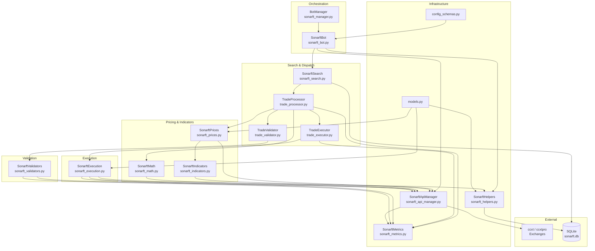

# Bot Package — Architecture & Project Structure Review

**Prompt ID:** 01-BOT-ARCH  
**Generated:** July 2025  
**Source:** `packages/bot/` — full static analysis  
**Output File:** `docs/architecture/bot-overview.md`

---

## 1. Technology Stack Inventory

| Category | Technology | Version | Notes |
|---|---|---|---|
| Python runtime | CPython | ≥ 3.10 (pyproject.toml), 3.11 in practice | Uses `X \| Y` union syntax (3.10+) |
| Async framework | `asyncio` (stdlib) | — | No third-party async framework |
| Exchange integration | `ccxt` | 4.5.48 | REST mode |
| Exchange integration | `ccxt.pro` | 4.5.48 | WebSocket mode (same package, `ccxt[pro]`) |
| Financial data | `pandas` | 3.0.2 | DataFrame for indicator computation |
| Technical indicators | `pandas-ta` | 0.4.71b0 | RSI, MACD, StochRSI, SMA, EMA |
| Numerical computation | `numpy` | (transitive via pandas-ta) | Used in validators and indicators |
| Financial precision | `decimal` (stdlib) | — | `getcontext().prec = 28` |
| Persistence | `sqlite3` (stdlib) | — | WAL mode; trade/order/position history |
| Config validation | `pydantic` v2 | ≥ 2.0 | `ParametersConfig`, `SymbolConfig`, `FeeConfig` |
| Config format | JSON | — | All config files under `sonarftdata/` |
| Logging | `logging` (stdlib) | — | Structured JSON via `sonarft_metrics.py` |
| Alerting | `urllib.request` (stdlib) | — | Webhook POST (Slack/Discord/Teams) |
| HTTP/API framework | `fastapi` + `uvicorn` | 0.135.3 / 0.44.0 | Listed in `requirements.txt`; **not used inside bot package** — belongs to `packages/api` |
| Auth | `PyJWT[crypto]` | ≥ 2.7.0 | Listed in `requirements.txt`; **not used inside bot package** |
| Container | Docker | — | `Dockerfile` present; base image not inspected here |
| Testing | `pytest` + `pytest-asyncio` + `hypothesis` | — | `asyncio_mode = "auto"` |

> ⚠️ `fastapi`, `uvicorn`, `simple-websocket`, and `PyJWT` appear in `requirements.txt` but are **not imported by any bot module**. They are API-layer dependencies that leaked into the bot's requirements file. The canonical bot dependencies are correctly listed in `pyproject.toml`.

---

## 2. Project Structure & Module Responsibilities

### Flat-file layout (no sub-packages)

All 16 Python modules live at the package root. There is no sub-package hierarchy.

```
packages/bot/
├── models.py               # Domain data classes + pure math helpers
├── config_schemas.py       # Pydantic config validators
├── sonarft_manager.py      # BotManager — lifecycle orchestration
├── sonarft_bot.py          # SonarftBot — per-bot wiring + config loading
├── sonarft_api_manager.py  # Exchange API abstraction (ccxt/ccxtpro)
├── sonarft_search.py       # Trade search loop + daily risk controls
├── trade_processor.py      # Per-symbol price fetch + profit check
├── trade_executor.py       # Async task dispatch + monitoring
├── trade_validator.py      # Pre-execution liquidity/spread validation
├── sonarft_execution.py    # Order placement + position management
├── sonarft_prices.py       # VWAP pricing + indicator-driven adjustment
├── sonarft_indicators.py   # Technical indicators (RSI, MACD, StochRSI…)
├── sonarft_math.py         # Decimal profit/fee calculation
├── sonarft_validators.py   # Liquidity depth + slippage validation
├── sonarft_helpers.py      # SQLite persistence + utility functions
├── sonarft_metrics.py      # Structured JSON observability events
└── __main__.py             # CLI entry point
```

---

### Module-by-module breakdown

#### `models.py` (73 lines)
- **Responsibility:** Single source of truth for shared domain types and pure math.
- **Key exports:** `Trade` dataclass, `vwap()`, `percentage_difference()`, `RSI_OVERBOUGHT`, `RSI_OVERSOLD`, OHLCV index constants.
- **Dependencies:** stdlib only (`dataclasses`).
- **Boundaries:** No I/O, no async, no exchange calls. Pure data + math.
- **Concern:** `Trade` has 19 fields as a flat dataclass with no grouping. Indicator fields (`market_direction_buy`, etc.) are optional with `None` defaults — callers must guard against `None` at every use site.

#### `config_schemas.py` (69 lines)
- **Responsibility:** Pydantic v2 models for all JSON config sections.
- **Key exports:** `ParametersConfig`, `SymbolConfig`, `FeeConfig`.
- **Dependencies:** `pydantic`.
- **Boundaries:** Validation only — no file I/O, no trading logic.
- **Concern:** `FeeConfig.maker_buy_fee` / `maker_sell_fee` default to `None` but are typed `float = Field(default=None, ge=0)` — this is a Pydantic v2 type annotation inconsistency (`Optional[float]` would be more accurate).

#### `sonarft_manager.py` (244 lines) — `BotManager`
- **Responsibility:** Multi-bot lifecycle management: create, run, pause, resume, remove, hot-reload parameters.
- **Key classes:** `BotManager`, `BotRunError` (deprecated).
- **Dependencies:** `sonarft_bot.SonarftBot`, `sonarft_helpers.sanitize_client_id`, `asyncio`.
- **Boundaries:** Does NOT load config, place orders, or compute indicators. Delegates all trading to `SonarftBot`.
- **Concern:** `BotRunError` is kept for backward compatibility but is never raised internally — dead code that adds noise.

#### `sonarft_bot.py` (782 lines) — `SonarftBot`
- **Responsibility:** Per-bot wiring: config loading, module initialization, run loop, graceful shutdown, hot-reload, periodic tasks.
- **Key classes:** `SonarftBot`, `BotCreationError`.
- **Dependencies:** All other modules except `sonarft_manager` and `sonarft_metrics`.
- **Boundaries:** Does NOT execute trades directly — delegates to `SonarftSearch`.
- **Concern:** This is the largest orchestration file and mixes several concerns:
  - Config loading (`load_configurations`, `_load_config_section`)
  - Module wiring (`initialize_modules`)
  - Run loop + circuit breaker (`run_bot`)
  - Periodic background tasks (`_periodic_fee_refresh`, `_periodic_db_backup`)
  - Reconciliation (`_reconcile_open_orders`, `_reconcile_open_positions`)
  - Hot-reload (`apply_parameters`)
  - Alert dispatch (`_send_alert`)
  
  At 782 lines it is a **God Object** candidate. The config loading and module wiring could be extracted into a `BotFactory` or `BotConfig` class.

#### `sonarft_api_manager.py` (597 lines) — `SonarftApiManager`
- **Responsibility:** Exchange API abstraction: ccxt/ccxtpro dispatch, caching (OHLCV, order book, ticker), market loading, fee refresh, VWAP calculation.
- **Key classes:** `SonarftApiManager`.
- **Dependencies:** `ccxt`, `ccxt.pro`, `models.vwap`, `sonarft_metrics`.
- **Boundaries:** Does NOT compute indicators or make trading decisions.
- **Concern:** Dual-mode dispatch (`__ccxt__` / `__ccxtpro__` boolean flags) adds branching throughout. The REST fallback in `call_api_method` creates a new `ccxt` REST instance per call — no connection reuse.

#### `sonarft_search.py` (204 lines) — `SonarftSearch`
- **Responsibility:** Top-level trade search loop: daily risk controls (loss limit, trade count), pause/resume, per-symbol dispatch.
- **Key classes:** `SonarftSearch`.
- **Dependencies:** `TradeProcessor`, `sonarft_execution`, `sonarft_math`, `sonarft_prices`, `sonarft_validators`, `sqlite3`.
- **Boundaries:** Does NOT compute prices or execute orders — delegates to `TradeProcessor`.
- **Concern:** `daily_loss` SQLite helpers (`_load_daily_loss_sync`, `_save_daily_loss_sync`) are module-level functions rather than methods on `SonarftHelpers`, creating a second SQLite access path that duplicates schema creation logic already in `SonarftHelpers._init_db`.

#### `trade_processor.py` (226 lines) — `TradeProcessor`
- **Responsibility:** Per-symbol price fetching, indicator-driven price adjustment, profit calculation, pre-execution validation, trade dispatch.
- **Key classes:** `TradeProcessor`.
- **Dependencies:** `SonarftPrices`, `SonarftMath`, `TradeValidator`, `TradeExecutor`, `sonarft_metrics`.
- **Boundaries:** Does NOT place orders — delegates to `TradeExecutor`.

#### `trade_executor.py` (125 lines) — `TradeExecutor`
- **Responsibility:** Async task dispatch for trade execution, concurrent task limit enforcement, background monitor, session P&L tracking.
- **Key classes:** `TradeExecutor`.
- **Dependencies:** `SonarftExecution`, `sonarft_metrics`.
- **Concern:** `execute_trade` is a **fire-and-forget** call (no `await`) — the task is appended to `self.trade_tasks` and monitored by a background loop. This is intentional for concurrency but means errors surface only in the monitor, not at the call site.

#### `trade_validator.py` (45 lines) — `TradeValidator`
- **Responsibility:** Pre-execution gate: liquidity depth check + spread threshold check.
- **Key classes:** `TradeValidator`.
- **Dependencies:** `SonarftValidators`.
- **Boundaries:** Thin delegation layer — all logic lives in `SonarftValidators`.

#### `sonarft_execution.py` (824 lines) — `SonarftExecution`
- **Responsibility:** Order placement (real and simulated), price monitoring, balance checking, position tracking, partial fill handling, flash crash protection.
- **Key classes:** `SonarftExecution`.
- **Dependencies:** `SonarftApiManager`, `SonarftHelpers`, `sonarft_metrics`, `models`.
- **Concern:** Largest file at 824 lines. Mixes:
  - Risk checks (size limit, exposure, rate limit)
  - Two-leg trade execution (`_execute_two_leg_trade`)
  - Price monitoring (`monitor_price` — up to 120s blocking loop)
  - Order monitoring (`monitor_order` — up to 300s blocking loop)
  - Balance checking
  - Simulation mode branching throughout
  
  The `monitor_price` and `monitor_order` loops run for up to 120s and 300s respectively inside async tasks — these are long-running coroutines that hold event loop time between `await asyncio.sleep()` calls.

#### `sonarft_prices.py` (277 lines) — `SonarftPrices`
- **Responsibility:** VWAP-based price fetching, indicator-driven price adjustment, strategy dispatch (arbitrage vs market-making), support/resistance clamping.
- **Key classes:** `SonarftPrices`.
- **Dependencies:** `SonarftApiManager`, `SonarftIndicators`, `models`.
- **Concern:** `weighted_adjust_prices` fetches 14 indicators concurrently via `asyncio.gather` with individual 10s timeouts and a 30s outer timeout. The `_adjust_market_making` method applies `spread_decrease_factor` to the buy price in **all three branches** (overbought, oversold, neutral) — the RSI/StochRSI conditions differentiate the branches but the outcome is identical, making the branching logic dead code.

#### `sonarft_indicators.py` (443 lines) — `SonarftIndicators`
- **Responsibility:** Technical indicator computation: RSI, MACD, StochRSI, SMA/EMA market direction, short-term trend, volatility, liquidity, support/resistance.
- **Key classes:** `SonarftIndicators`.
- **Dependencies:** `SonarftApiManager`, `pandas`, `pandas-ta`, `numpy`, `models`.
- **Concern:** Each indicator method fetches OHLCV data independently. While `SonarftApiManager` caches OHLCV responses, multiple indicators for the same symbol/exchange in the same cycle will still hit the cache lookup overhead. No batch-fetch path exists.

#### `sonarft_math.py` (139 lines) — `SonarftMath`
- **Responsibility:** Decimal-precision profit and fee calculation; exchange precision rules.
- **Key classes:** `SonarftMath`.
- **Dependencies:** `SonarftApiManager`, `decimal` (stdlib).
- **Concern:** `EXCHANGE_RULES` hardcodes precision for only 3 exchanges (`okx`, `bitfinex`, `binance`). Any other exchange returns `None` from `calculate_trade`, silently skipping the trade. The live precision lookup via `api_manager.get_symbol_precision` is preferred but falls back to these hardcoded values with a warning.

#### `sonarft_validators.py` (339 lines) — `SonarftValidators`
- **Responsibility:** Liquidity depth validation, spread threshold calculation, slippage tolerance, stop-loss check.
- **Key classes:** `SonarftValidators`.
- **Dependencies:** `SonarftApiManager`, `numpy`, `sonarft_metrics`.
- **Concern:** `get_trade_dynamic_spread_threshold_avg` has an O(n²) inner loop comment that was fixed to O(n), but the fix computes `avg_bid` and `avg_ask` separately from the `trade_spread_sum` loop — the two loops still iterate the same data twice.

#### `sonarft_helpers.py` (464 lines) — `SonarftHelpers`
- **Responsibility:** SQLite persistence (orders, trades, positions, daily_loss), async-safe file I/O, database backup, utility functions.
- **Key classes:** `SonarftHelpers`.
- **Dependencies:** `sqlite3`, `asyncio`, `models.Trade`, `models.percentage_difference`.
- **Concern:** `_db_lock` is an instance-level `asyncio.Lock` but `_db_insert` and `_db_query` are `@classmethod` methods that open new SQLite connections per call. The lock protects the Python-level call but SQLite WAL mode already handles concurrent writes — the lock is redundant for reads and adds unnecessary serialization.

#### `sonarft_metrics.py` (236 lines)
- **Responsibility:** Structured JSON observability: signals, orders, trades, risk events, liquidity checks, API calls, cycle stats, session P&L.
- **Dependencies:** `logging`, `json`, `time` (stdlib only).
- **Boundaries:** Pure emission — no state, no I/O beyond the logger. Fully decoupled.
- **Assessment:** Well-designed. No concerns.

---

## 3. Dependency Design Analysis

### Dependency injection vs hardcoding

Dependencies are **constructor-injected** throughout. `SonarftBot.initialize_modules()` wires all modules and passes them down. No module uses global singletons or module-level state (except `sonarft_metrics._metrics_logger` which is intentional).

### Circular dependencies

No circular imports detected. The dependency graph is a strict DAG:

```
sonarft_manager → sonarft_bot → {all modules}
sonarft_bot → sonarft_search → trade_processor → {execution, math, prices, validators}
sonarft_bot → sonarft_api_manager ← {indicators, prices, math, validators}
```

`sonarft_api_manager` is the only module imported by multiple layers — it is the shared infrastructure dependency.

### Tight coupling

| Coupling | Location | Severity |
|---|---|---|
| `SonarftBot` directly sets attributes on child modules after construction (`sonarft_prices.strategy`, `sonarft_execution._alert_callback`) | `sonarft_bot.py` lines 490–530 | Medium |
| `TradeExecutor._search_ref` is set via back-reference after construction | `sonarft_search.py` line 113 | Medium |
| `sonarft_search.py` duplicates SQLite schema creation already in `SonarftHelpers._init_db` | `sonarft_search.py` lines 26–40 | Low |
| `sonarft_execution.py` calls `sonarft_helpers.open_position` / `close_position` with `first_exchange_id` as `botid` | `sonarft_execution.py` line 310 | **High** — wrong value passed as botid |

### Reusable modules

`sonarft_metrics`, `models`, `config_schemas`, and `sonarft_math` could be extracted as standalone libraries with no changes. `sonarft_indicators` and `sonarft_api_manager` are reusable with minor interface changes.

### Implicit dependencies

- `sonarft_search.py` and `sonarft_helpers.py` both hardcode `_DB_PATH` pointing to `sonarftdata/history/sonarft.db` — if the path ever changes, it must be updated in two places.
- `sonarft_bot.py` reads environment variables (`SONARFT_ALLOW_LIVE`, `SONARFT_MAX_FAILURES`, etc.) directly via `os.environ.get` — no central env config object.

---

## 4. System Architecture Diagram



---

## 5. Module Responsibility Matrix

| Module | Primary Responsibility | Key Dependencies | Coupling Level | Lines |
|---|---|---|---|---|
| `models.py` | Domain types + pure math | stdlib only | None | 73 |
| `config_schemas.py` | Config validation | pydantic | None | 69 |
| `sonarft_metrics.py` | Structured observability | stdlib only | None | 236 |
| `sonarft_math.py` | Decimal profit/fee calc | `SonarftApiManager` | Low | 139 |
| `trade_validator.py` | Pre-execution gate | `SonarftValidators` | Low | 45 |
| `trade_executor.py` | Async task dispatch | `SonarftExecution` | Low | 125 |
| `sonarft_search.py` | Trade search + risk controls | `TradeProcessor`, SQLite | Medium | 204 |
| `trade_processor.py` | Symbol processing + profit check | `SonarftPrices`, `SonarftMath`, `TradeValidator`, `TradeExecutor` | Medium | 226 |
| `sonarft_indicators.py` | Technical indicators | `SonarftApiManager`, pandas, numpy | Medium | 443 |
| `sonarft_validators.py` | Liquidity + spread validation | `SonarftApiManager`, numpy | Medium | 339 |
| `sonarft_helpers.py` | SQLite persistence + utilities | sqlite3, asyncio | Medium | 464 |
| `sonarft_prices.py` | VWAP pricing + strategy dispatch | `SonarftApiManager`, `SonarftIndicators` | Medium | 277 |
| `sonarft_manager.py` | Multi-bot lifecycle | `SonarftBot` | Medium | 244 |
| `sonarft_api_manager.py` | Exchange API abstraction + caching | ccxt/ccxtpro | High | 597 |
| `sonarft_execution.py` | Order placement + position mgmt | `SonarftApiManager`, `SonarftHelpers` | High | 824 |
| `sonarft_bot.py` | Per-bot wiring + config loading | All modules | **Very High** | 782 |

---

## 6. Code Complexity Hotspots

### By line count

| File | Lines | Primary Complexity Driver |
|---|---|---|
| `sonarft_execution.py` | 824 | Two-leg trade logic, price/order monitoring loops, simulation branching |
| `sonarft_bot.py` | 782 | God Object: config loading + module wiring + run loop + periodic tasks + hot-reload |
| `sonarft_api_manager.py` | 597 | Dual-mode dispatch, REST fallback, 3 independent caches |
| `sonarft_helpers.py` | 464 | SQLite schema + CRUD + position tracker + file I/O fallback |
| `sonarft_indicators.py` | 443 | 10+ indicator methods, each with independent OHLCV fetch |

### By nested logic depth

- **`sonarft_execution._execute_two_leg_trade`** (lines ~280–370): 4-level nesting — balance check → first leg → partial fill handling → second leg → imbalance handling.
- **`sonarft_bot.apply_parameters`** (lines ~200–280): 9 sequential `if key in parameters` blocks with old-value save + rollback + propagation.
- **`sonarft_validators.get_trade_dynamic_spread_threshold_avg`**: nested list comprehensions for spread calculation.

### By concurrent operations

- **`sonarft_prices.weighted_adjust_prices`**: 14 concurrent indicator fetches via `asyncio.gather` with per-indicator 10s timeouts and a 30s outer timeout.
- **`sonarft_bot._reconcile_open_orders`**: concurrent `asyncio.gather` across all exchange × symbol combinations at startup.
- **`sonarft_search.search_trades`**: concurrent `asyncio.gather` across all symbols per cycle.

---

## 7. Conclusion

### Overall architectural clarity

The architecture follows a clear **layered pipeline**:

```
BotManager → SonarftBot → SonarftSearch → TradeProcessor → TradeExecutor → SonarftExecution
                                                         ↓
                                              SonarftPrices + SonarftIndicators + SonarftMath
                                                         ↓
                                              SonarftValidators + TradeValidator
                                                         ↓
                                              SonarftApiManager → Exchanges
```

The separation of concerns is generally good. The recent split of `SonarftSearch` into `TradeProcessor`, `TradeExecutor`, and `TradeValidator` improved modularity. `models.py` as a shared domain layer is a sound pattern.

### Design patterns present

- **Dependency Injection** — all modules receive dependencies via constructor.
- **Strategy Pattern** — `sonarft_prices.py` dispatches to `_adjust_market_making` or arbitrage path based on `self.strategy`.
- **Template Method** — `SonarftValidators.validate()` is a no-op base intended for subclassing (though no subclasses exist).
- **Observer (partial)** — `TradeExecutor._search_ref` back-reference for P&L notification.
- **Circuit Breaker** — `sonarft_bot.run_bot` halts after `max_failures` consecutive errors.

### Mixing of concerns

| Issue | Location | Severity |
|---|---|---|
| `SonarftBot` is a God Object (config loading + wiring + run loop + periodic tasks + hot-reload + reconciliation + alerting) | `sonarft_bot.py` | Medium |
| `sonarft_execution.py` passes `first_exchange_id` as `botid` to `open_position` | line ~310 | **High** — data integrity bug |
| `sonarft_search.py` duplicates SQLite schema creation from `SonarftHelpers` | lines 26–40 | Low |
| `requirements.txt` includes API-layer deps (`fastapi`, `uvicorn`, `PyJWT`) not used by bot | `requirements.txt` | Low |
| `_adjust_market_making` has three branches that all apply the same factor — dead branching logic | `sonarft_prices.py` lines ~170–200 | Medium |

### Modularity strengths

- Clean dependency direction: no upward imports (lower layers never import higher layers).
- `models.py` as a zero-dependency shared domain layer is excellent.
- `sonarft_metrics.py` is fully decoupled — pure emission with no state.
- Pydantic config validation at load time (`config_schemas.py`) prevents runtime surprises.
- SQLite WAL mode with `asyncio.to_thread` is the correct pattern for async-safe persistence.

### Recommendations

| Priority | Recommendation |
|---|---|
| **High** | Fix `sonarft_execution.py` line ~310: `open_position(botid=first_exchange_id, ...)` — `botid` should be the actual bot ID, not the exchange ID. |
| **High** | Extract config loading from `SonarftBot` into a `BotConfig` dataclass or factory function to reduce the God Object. |
| **Medium** | Consolidate `daily_loss` SQLite helpers into `SonarftHelpers` — remove the duplicate schema creation in `sonarft_search.py`. |
| **Medium** | Fix `_adjust_market_making` dead branching — all three branches apply the same factor; either differentiate them or collapse to a single expression. |
| **Medium** | Replace the `__ccxt__` / `__ccxtpro__` boolean flags in `SonarftApiManager` with a strategy object or single `_mode` enum to reduce branching. |
| **Low** | Remove `fastapi`, `uvicorn`, `simple-websocket`, and `PyJWT` from `requirements.txt` — they are not bot dependencies. |
| **Low** | Add `Optional[float]` type annotation to `FeeConfig.maker_buy_fee` / `maker_sell_fee` in `config_schemas.py`. |
| **Low** | Centralise `_DB_PATH` into a single location (currently defined in both `sonarft_helpers.py` and `sonarft_search.py`). |
