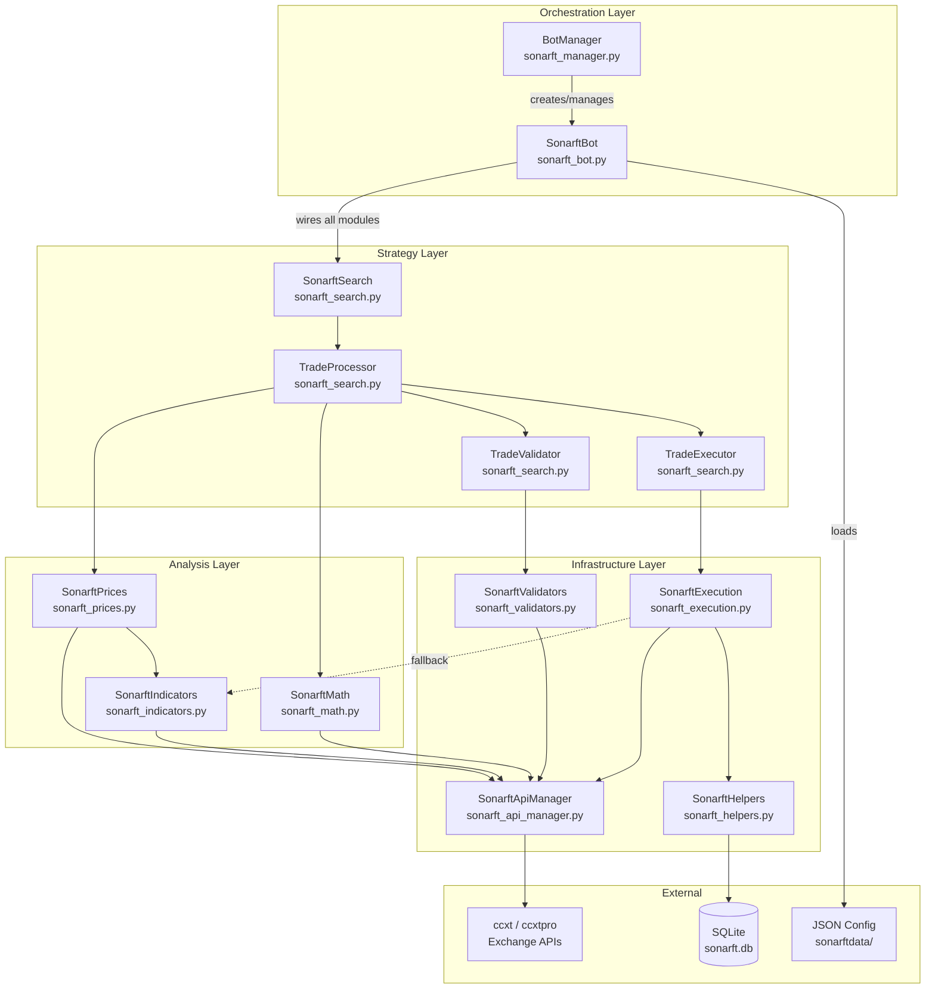
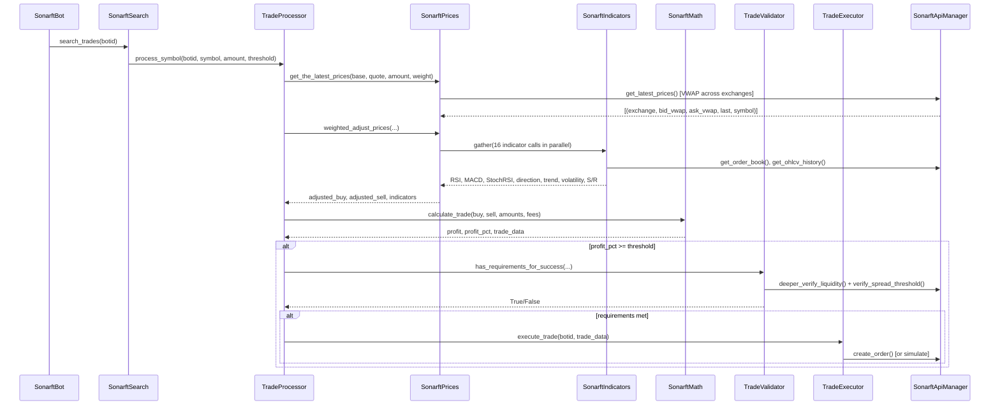

# SonarFT Bot — Architecture & Project Structure Review

**Prompt:** 01-BOT-ARCH  
**Reviewer:** Senior Python Engineer / Async Systems Architect / Quantitative Trading Reviewer  
**Date:** July 2025  
**Codebase:** `packages/bot` (10 Python modules, ~3,099 LOC)

---

## 1. Technology Stack Inventory

| Technology | Version / Detail | Purpose |
|---|---|---|
| **Python** | 3.11-slim (Dockerfile) / ≥3.10 (pyproject.toml) | Runtime |
| **asyncio** | stdlib | All I/O, concurrency, task management |
| **FastAPI** | 0.135.3 | HTTP REST + WebSocket server (listed in requirements.txt; server lives in `packages/api`) |
| **uvicorn** | 0.44.0 (standard extras) | ASGI server |
| **pandas** | 3.0.2 | Time-series data manipulation for indicators |
| **pandas-ta** | latest (unpinned) | Technical analysis: RSI, MACD, StochRSI, SMA, ATR |
| **numpy** | transitive via pandas | Statistical calculations (std, percentile, min/max) |
| **ccxt** | 4.5.48 | Multi-exchange REST + WebSocket (ccxtpro) trading library |
| **simple-websocket** | 1.1.0 | WebSocket client support |
| **orjson** | latest | Fast JSON serialization (declared, not yet used in core modules) |
| **coincurve** | latest | Cryptographic operations (declared dependency) |
| **aiofiles** | latest | Async file I/O (declared, SQLite path used instead) |
| **PyJWT[crypto]** | ≥2.7.0 | JWT authentication (in requirements.txt for API layer) |
| **SQLite** | stdlib `sqlite3` | Trade/order history persistence |
| **Docker** | python:3.11-slim base | Container deployment |
| **setuptools** | ≥68 | Build system (pyproject.toml) |
| **pytest / pytest-asyncio** | dev dependency | Testing framework |

### Observations

- **pandas-ta is unpinned** — risk of breaking changes on install. Severity: **Medium**.
- **orjson and aiofiles are declared but not imported** in any core module. Dead dependencies. Severity: **Low**.
- **coincurve** is declared but no cryptographic signing is visible in the bot package. Severity: **Low**.
- **Decimal precision** is set to `28` in `sonarft_math.py` but the guidelines document says `8`. The math module uses `Decimal` with `ROUND_HALF_UP` — this is the correct approach for financial calculations. Severity: **Info**.

---

## 2. Project Structure & Module Responsibilities

### 2.1 `sonarft_bot.py` — Bot Lifecycle & Configuration (400 LOC, 14 functions)

- **Responsibility:** Bot instance creation, JSON config loading, module wiring (dependency graph), main run loop with circuit breaker, parameter hot-reload, API key loading.
- **Key classes:** `SonarftBot`, `BotCreationError`
- **Dependencies:** All other sonarft modules (imports 8 internal modules)
- **Boundary:** Does NOT perform trading logic, price calculation, or exchange API calls directly. Delegates everything to wired modules.
- **Concern mixing:** None — clean orchestrator role.

### 2.2 `sonarft_manager.py` — Multi-Bot Management (215 LOC, 14 functions)

- **Responsibility:** Create/run/stop/remove bot instances, client-to-bot mapping, async-safe bot registry, CLI argument parsing, parameter hot-reload dispatch.
- **Key classes:** `BotManager`, `BotRunError`
- **Dependencies:** `sonarft_bot.SonarftBot`, `sonarft_bot.BotCreationError`
- **Boundary:** Does NOT access exchange APIs or trading logic. Pure lifecycle management.
- **Concern mixing:** `parse_args()` (CLI parsing) lives here — minor concern mix, but acceptable for an orchestrator.

### 2.3 `sonarft_search.py` — Trade Search Orchestration (332 LOC, 16 functions)

- **Responsibility:** Orchestrates trade search across symbols concurrently, processes buy/sell combinations, validates trades, dispatches execution, tracks daily loss.
- **Key classes:** `SonarftSearch`, `TradeProcessor`, `TradeValidator`, `TradeExecutor`
- **Dependencies:** `SonarftMath`, `SonarftPrices`, `SonarftValidators`, `SonarftExecution`
- **Boundary:** Does NOT calculate prices or indicators directly — delegates to `SonarftPrices` and `SonarftMath`.
- **Concern mixing:** Four classes in one file. Each has a clear responsibility, but the file is becoming a "strategy mega-module." Severity: **Low**.

### 2.4 `sonarft_prices.py` — Price Calculation & Adjustment (238 LOC, 8 functions)

- **Responsibility:** VWAP calculation, weighted price adjustment using indicators (RSI, MACD, StochRSI, volatility, support/resistance), spread factor application.
- **Key classes:** `SonarftPrices`
- **Dependencies:** `SonarftApiManager`, `SonarftIndicators`
- **Boundary:** Does NOT execute trades or validate liquidity.
- **Concern mixing:** None — focused price logic.

### 2.5 `sonarft_indicators.py` — Technical Indicators (464 LOC, 26 functions)

- **Responsibility:** RSI, MACD, StochRSI, SMA/EMA market direction, short-term trend, ATR, volatility, support/resistance, liquidity score, order book analysis, indicator caching.
- **Key classes:** `SonarftIndicators`
- **Dependencies:** `SonarftApiManager`, `pandas`, `pandas_ta`, `numpy`
- **Boundary:** Does NOT make trading decisions — pure signal computation.
- **Concern mixing:** `market_movement()` uses a shared `self.previous_spread` instance variable that creates a race condition under concurrent symbol processing. Severity: **Medium**.

### 2.6 `sonarft_math.py` — Financial Calculations (123 LOC, 3 functions)

- **Responsibility:** Trade profit/fee calculation with Decimal precision, per-exchange precision rules (`EXCHANGE_RULES`), dynamic symbol precision from market data.
- **Key classes:** `SonarftMath`
- **Dependencies:** `SonarftApiManager` (for fee rates and symbol precision)
- **Boundary:** Pure calculation — no I/O, no side effects.
- **Concern mixing:** None — cleanest module in the codebase.

### 2.7 `sonarft_execution.py` — Order Execution (412 LOC, 11 functions)

- **Responsibility:** Long/short trade execution, order placement (real + simulated), price monitoring, order monitoring, balance checking, position size limits, order rate limiting.
- **Key classes:** `SonarftExecution`
- **Dependencies:** `SonarftApiManager`, `SonarftHelpers`, `SonarftIndicators`
- **Boundary:** Does NOT search for trades — only executes what it's given.
- **Concern mixing:** Re-fetches indicators (direction, RSI, StochRSI) as a fallback when not passed through `trade_data`. This duplicates logic from `sonarft_prices.py`. Severity: **Medium**.

### 2.8 `sonarft_validators.py` — Trade Validation (298 LOC, 18 functions)

- **Responsibility:** Liquidity depth verification, spread threshold validation, slippage tolerance calculation, historical spread analysis.
- **Key classes:** `SonarftValidators`
- **Dependencies:** `SonarftApiManager`, `SonarftHelpers` (Trade dataclass), `numpy`
- **Boundary:** Does NOT execute trades — validation only.
- **Concern mixing:** None.

### 2.9 `sonarft_api_manager.py` — Exchange API Abstraction (354 LOC, 27 functions)

- **Responsibility:** Exchange instance management, ccxt/ccxtpro dispatch, order book/OHLCV/ticker fetching with caching, order creation/cancellation, VWAP calculation, market loading, API key management.
- **Key classes:** `SonarftApiManager`
- **Dependencies:** `ccxt` / `ccxt.pro` (dynamic import), `asyncio`
- **Boundary:** Does NOT contain trading logic or indicator calculations.
- **Concern mixing:** `get_weighted_prices()` (VWAP) is a financial calculation that arguably belongs in `SonarftPrices`. Severity: **Low**.

### 2.10 `sonarft_helpers.py` — Utilities & Persistence (263 LOC, 18 functions)

- **Responsibility:** `Trade` dataclass, SQLite-based trade/order history persistence, async-safe file I/O, JSON read/write helpers.
- **Key classes:** `SonarftHelpers`, `Trade` (dataclass)
- **Dependencies:** `sqlite3`, `asyncio`, `json`, `os`
- **Boundary:** Does NOT contain trading logic.
- **Concern mixing:** `Trade` dataclass is defined here but used everywhere — could be its own `models.py`. Severity: **Low**.

---

## 3. Dependency Design Analysis

### 3.1 Injection Pattern

All modules use **constructor injection**. Dependencies are wired in a single location: `SonarftBot.InitializeModules()` (lines 283–330 of `sonarft_bot.py`). This is a clean, centralized wiring point.

```python
# Wiring order in InitializeModules():
SonarftHelpers(is_simulation_mode, logger)
SonarftValidators(api_manager, logger)
SonarftIndicators(api_manager, logger)
SonarftMath(api_manager)
SonarftPrices(api_manager, sonarft_indicators, logger)
SonarftExecution(api_manager, sonarft_helpers, sonarft_indicators, is_simulation_mode, logger)
SonarftSearch(sonarft_math, sonarft_prices, sonarft_validators, sonarft_execution, ..., logger)
```

### 3.2 Circular Dependencies

**No circular import dependencies exist.** The dependency graph is a clean DAG (directed acyclic graph). All arrows point downward from orchestration → strategy → analysis → infrastructure.

### 3.3 Coupling Assessment

| Coupling Pair | Level | Notes |
|---|---|---|
| `SonarftBot` → all modules | **High** (expected) | Orchestrator — this is by design |
| `SonarftPrices` → `SonarftIndicators` | **Medium** | Prices depend on indicators for adjustment — correct |
| `SonarftExecution` → `SonarftIndicators` | **Medium** | Re-fetches indicators as fallback — could be eliminated |
| `SonarftSearch` → 4 modules | **Medium** | Strategy layer depends on math, prices, validators, execution |
| `SonarftApiManager` → none (internal) | **Low** | Leaf dependency — only depends on ccxt |
| `SonarftMath` → `SonarftApiManager` | **Low** | Only for fee rates and precision rules |
| `SonarftHelpers` → none (internal) | **Low** | Leaf dependency — pure utility |

### 3.4 Reusability Assessment

| Module | Independently Reusable? | Notes |
|---|---|---|
| `SonarftApiManager` | ✅ Yes | Generic exchange abstraction |
| `SonarftIndicators` | ✅ Yes | Needs only an api_manager |
| `SonarftMath` | ✅ Yes | Needs only fee/precision data |
| `SonarftHelpers` | ✅ Yes | Pure utility + persistence |
| `SonarftValidators` | ✅ Yes | Needs only an api_manager |
| `SonarftPrices` | ⚠️ Partially | Needs api_manager + indicators |
| `SonarftExecution` | ⚠️ Partially | Needs api_manager + helpers + indicators |
| `SonarftSearch` | ❌ No | Tightly coupled to the full module graph |

### 3.5 Implicit Dependencies

- `SonarftExecution` accesses `self.sonarft_indicators` for fallback indicator fetching — this creates an implicit coupling that isn't obvious from the constructor signature alone.
- `TradeExecutor._search_ref` is set post-construction by `SonarftSearch.start()` — a mutable back-reference that creates a bidirectional dependency between search and execution. Severity: **Medium**.
- `SonarftPrices` reads `self.spread_increase_factor` and `self.spread_decrease_factor` via `getattr` with defaults — these are set externally by `SonarftBot.InitializeModules()` after construction. Severity: **Low**.

---

## 4. System Architecture Diagram



### Data Flow (Single Trade Cycle)



---

## 5. Module Responsibility Matrix

| Module | Primary Responsibility | Key Dependencies | Coupling Level | LOC | Functions | Complexity |
|---|---|---|---|---|---|---|
| `sonarft_bot.py` | Bot lifecycle, config, wiring | All 8 modules | High (orchestrator) | 400 | 14 | Medium |
| `sonarft_manager.py` | Multi-bot management | `sonarft_bot` | Low | 215 | 14 | Low |
| `sonarft_search.py` | Trade search orchestration | math, prices, validators, execution | Medium | 332 | 16 | High |
| `sonarft_prices.py` | VWAP, price adjustment | api_manager, indicators | Medium | 238 | 8 | High |
| `sonarft_indicators.py` | Technical indicators + caching | api_manager, pandas, pandas_ta | Low | 464 | 26 | High |
| `sonarft_math.py` | Profit/fee calculation | api_manager | Low | 123 | 3 | Low |
| `sonarft_execution.py` | Order execution + monitoring | api_manager, helpers, indicators | Medium | 412 | 11 | High |
| `sonarft_validators.py` | Liquidity + spread validation | api_manager | Low | 298 | 18 | Medium |
| `sonarft_api_manager.py` | Exchange API abstraction | ccxt/ccxtpro | Low (leaf) | 354 | 27 | Medium |
| `sonarft_helpers.py` | Persistence + utilities | sqlite3 | Low (leaf) | 263 | 18 | Low |

---

## 6. Code Complexity Hotspots

### By Line Count

| Rank | File | LOC | Functions | Assessment |
|---|---|---|---|---|
| 1 | `sonarft_indicators.py` | 464 | 26 | Largest file. Many small indicator methods — acceptable, but could benefit from grouping into sub-modules (e.g., oscillators, volume, order-book). |
| 2 | `sonarft_execution.py` | 412 | 11 | High complexity per function. `_execute_single_trade` has deeply nested conditional logic (direction × RSI × StochRSI). |
| 3 | `sonarft_bot.py` | 400 | 14 | Moderate. `load_configurations` is a long sequential method but straightforward. |
| 4 | `sonarft_api_manager.py` | 354 | 27 | Many small methods — low per-function complexity. |
| 5 | `sonarft_search.py` | 332 | 16 | `process_trade_combination` is the most complex single method — nested loops, multiple async calls, conditional execution. |

### Highest Complexity Functions

| Function | File | Lines | Complexity Reason |
|---|---|---|---|
| `weighted_adjust_prices` | `sonarft_prices.py` | ~120 | 16 parallel indicator fetches, multiple conditional branches (bull/bear × RSI × StochRSI), spread factor logic |
| `_execute_single_trade` | `sonarft_execution.py` | ~80 | Nested if/elif on market direction, RSI thresholds, StochRSI crossovers — 4 major branches |
| `process_trade_combination` | `sonarft_search.py` | ~60 | Sequential async pipeline: price adjustment → math → validation → execution |
| `deeper_verify_liquidity` | `sonarft_validators.py` | ~40 | Multiple sequential validation checks with early returns |
| `get_trade_dynamic_spread_threshold_avg` | `sonarft_validators.py` | ~40 | Nested loops over order book bids × asks |

### Most Concurrent Operations

| File | Concurrent Pattern | Gather Calls |
|---|---|---|
| `sonarft_prices.py` | `asyncio.gather` of 16 indicator fetches + 2 volatility adjustments | 2 |
| `sonarft_search.py` | `asyncio.gather` over all symbols per cycle | 1 |
| `sonarft_execution.py` | `asyncio.gather` of 6 indicator fetches (fallback path) | 1 |
| `sonarft_validators.py` | `asyncio.gather` of 2 liquidity checks, 2 history fetches, 2 order books | 3 |

---

## 7. Conclusion

### Overall Architectural Clarity: **Good**

The codebase follows a well-defined layered architecture with clear separation of concerns across four layers: Orchestration → Strategy → Analysis → Infrastructure. The dependency graph is acyclic, and constructor injection is used consistently.

### Design Patterns Identified

| Pattern | Where | Quality |
|---|---|---|
| **Dependency Injection** | `SonarftBot.InitializeModules()` | ✅ Clean, centralized |
| **Strategy Pattern** | `SonarftSearch` → `TradeProcessor` → `TradeValidator` / `TradeExecutor` | ✅ Well-separated |
| **Facade Pattern** | `SonarftApiManager` wraps ccxt/ccxtpro | ✅ Good abstraction |
| **Circuit Breaker** | `SonarftBot.run_bot()` with exponential backoff | ✅ Production-ready |
| **Cache-Aside** | Indicator cache in `SonarftIndicators`, OHLCV/order book cache in `SonarftApiManager` | ✅ Effective |
| **Simulation Mode** | `is_simulation_mode` flag gates real execution | ✅ Clean separation |

### Confirmed Issues

| # | Issue | Severity | Location | Recommendation |
|---|---|---|---|---|
| 1 | `SonarftIndicators.previous_spread` is shared mutable state — race condition under concurrent symbol processing | **Medium** | `sonarft_indicators.py:market_movement()` | Make `previous_spread` per-symbol or pass as parameter |
| 2 | `SonarftExecution` re-fetches indicators as fallback, duplicating logic from `sonarft_prices.py` | **Medium** | `sonarft_execution.py:_execute_single_trade()` | Always pass indicators through `trade_data`; remove fallback fetch |
| 3 | `TradeExecutor._search_ref` creates a bidirectional dependency (search ↔ executor) | **Medium** | `sonarft_search.py` | Use a callback function instead of a back-reference |
| 4 | `pandas-ta` is unpinned in both `requirements.txt` and `pyproject.toml` | **Medium** | `requirements.txt`, `pyproject.toml` | Pin to a specific version (e.g., `pandas-ta==0.3.14b0`) |
| 5 | `EXCHANGE_RULES` in `SonarftMath` is hardcoded for 3 exchanges only | **Low** | `sonarft_math.py` | Fall back to dynamic precision from `get_symbol_precision()` (already partially implemented) |
| 6 | `orjson`, `aiofiles`, `coincurve` are declared but unused | **Low** | `requirements.txt`, `pyproject.toml` | Remove or document intended future use |
| 7 | `Trade` dataclass in `sonarft_helpers.py` is a cross-cutting concern | **Low** | `sonarft_helpers.py` | Extract to a dedicated `models.py` |
| 8 | `get_weighted_prices()` (VWAP) exists in both `SonarftApiManager` and `SonarftPrices` | **Low** | `sonarft_api_manager.py`, `sonarft_prices.py` | Consolidate into `SonarftPrices` |
| 9 | Bot ID generated via `random.randint(10001, 99999)` — collision risk with multiple bots | **Low** | `sonarft_bot.py:create_botid()` | Use `uuid.uuid4()` or check for existing IDs |

### Modularity Strengths

- ✅ Clean DAG dependency graph — no circular imports
- ✅ Single wiring point (`InitializeModules`) — easy to understand and modify
- ✅ Each module has a clear, documented responsibility
- ✅ `SonarftApiManager` is a well-designed facade over ccxt/ccxtpro
- ✅ Indicator caching with TTL reduces redundant API calls
- ✅ `Decimal` arithmetic in `SonarftMath` for financial precision
- ✅ Circuit breaker with exponential backoff in the run loop
- ✅ Async-first design throughout — no blocking I/O in the event loop

### Modularity Weaknesses

- ⚠️ `sonarft_search.py` contains 4 classes — could be split into separate files
- ⚠️ `sonarft_execution.py` has indicator-fetching logic that belongs in the analysis layer
- ⚠️ Post-construction mutation of `SonarftPrices` attributes (spread factors, active indicators) breaks the "fully initialized at construction" principle
- ⚠️ No interface/protocol definitions — modules depend on concrete classes rather than abstractions

### Recommendations for Structural Improvement

1. **Extract `Trade` dataclass** to `models.py` — it's imported by 3+ modules and is a core domain object.
2. **Pin `pandas-ta`** to avoid silent breakage on dependency updates.
3. **Eliminate indicator re-fetch in execution** — always pass indicators through `trade_data` (already partially implemented).
4. **Replace `_search_ref` back-reference** with a callback or event emitter pattern.
5. **Make `previous_spread` per-symbol** in `SonarftIndicators.market_movement()` to eliminate the race condition.
6. **Consider splitting `sonarft_search.py`** into `trade_processor.py`, `trade_validator.py`, `trade_executor.py` for better file-level isolation.
7. **Use `uuid.uuid4()`** for bot IDs to eliminate collision risk.

---

*Generated by Prompt 01-BOT-ARCH. Next: [02-async-concurrency.md](../prompts/02-async-concurrency.md)*


---

## Remediation Status (Post-Implementation Update — July 2025)

| # | Issue | Original Severity | Status | Task |
|---|---|---|---|---|
| 1 | `previous_spread` race condition | Medium | ✅ **FIXED** — Changed to per-symbol dict | T22 |
| 2 | Indicator re-fetch in execution | Medium | ⚠️ Open — fallback path still exists | — |
| 3 | `_search_ref` bidirectional dependency | Medium | ⚠️ Open — functional, not refactored | — |
| 4 | `pandas-ta` unpinned | Medium | ✅ **FIXED** — Pinned to `0.4.71b0` | T18 |
| 5 | `EXCHANGE_RULES` hardcoded | Low | ⚠️ Open — dynamic precision preferred at runtime | — |
| 6 | Unused deps (`orjson`, `aiofiles`, `coincurve`) | Low | ✅ **FIXED** — Removed | T18 |
| 7 | `Trade` dataclass in `sonarft_helpers.py` | Low | ✅ **FIXED** — Extracted to `models.py` | T29 |
| 8 | Duplicate VWAP implementation | Low | ⚠️ Open — deferred (T31) | — |
| 9 | Bot ID collision risk | Low | ⚠️ Open — low priority | — |

**Additionally:** All modules now have module-level docstrings (T36). `sonarft_api_manager.py` now has a module docstring, ticker cache, and 30s API timeout.
