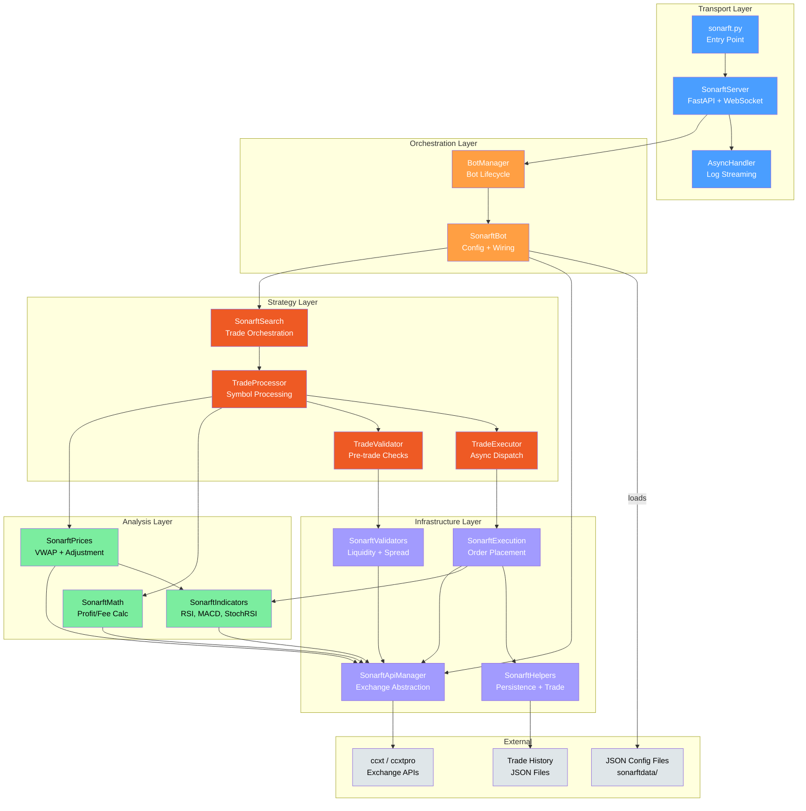

# SonarFT — Architecture & Project Structure Review

**Review Date:** July 2025
**Codebase Version:** 1.0.0
**Reviewer Role:** Senior Python Engineer / Async Systems Architect / Trading Systems Auditor
**Scope:** Full architecture analysis of all Python source files, configuration, and infrastructure

---

## 1. Technology Stack Inventory

| Technology | Version / Detail | Purpose |
|---|---|---|
| **Python** | 3.10.6 (pinned in Dockerfile) | Runtime language |
| **asyncio** | stdlib | Core async framework for all I/O |
| **FastAPI** | 0.100.0 | HTTP REST API + WebSocket server |
| **uvicorn** | 0.22.0 | ASGI server |
| **ccxt** | 3.0.24 | REST-based multi-exchange trading library (fallback) |
| **ccxt.pro** | (bundled with ccxt 3.x) | WebSocket-based exchange connectivity (default) |
| **pandas** | 1.5.3 | Time-series data manipulation |
| **pandas-ta** | 0.3.14b0 | Technical analysis indicators (RSI, MACD, StochRSI, SMA, ATR) |
| **numpy** | (transitive via pandas) | Numerical computation (std, percentile, min/max) |
| **python-dotenv** | 1.0.0 | `.env` file loading |
| **python-decouple** | 3.8 | Environment variable management |
| **simple-websocket** | 0.10.1 | WebSocket client support |
| **Docker** | python:3.10.6 base | Container runtime |
| **Traefik** | v2.5 | Reverse proxy with ACME TLS |
| **Logging** | stdlib `logging` + custom `AsyncHandler` | Per-client async log streaming over WebSocket |
| **Configuration** | JSON files in `sonarftdata/` | All trading parameters, exchanges, symbols, fees |
| **Financial Precision** | `decimal.getcontext().prec = 28` (sonarft_math.py) | Decimal arithmetic for fee/profit calculations |

### Notable Observations

- **pandas 1.5.3** is end-of-life; current stable is 2.x. Upgrade recommended for security patches.
- **ccxt 3.0.24** — ccxt moves fast; pinning is correct but periodic updates are needed for exchange compatibility.
- **No schema validation library** (e.g., Pydantic models for config) — JSON configs are loaded with raw `json.load()` and accessed by key without validation.
- **python-decouple** is listed in requirements.txt but **not imported anywhere** in the source code.

---

## 2. Project Structure & Module Responsibilities

### 2.1 Entry Point — `sonarft.py` (18 lines)

| Attribute | Detail |
|---|---|
| **Responsibility** | Bootstrap the uvicorn/FastAPI server |
| **Key Functions** | `start_app()` |
| **Dependencies** | `uvicorn`, `SonarftServer` |
| **Boundaries** | Does NOT contain any business logic; pure entry point |

**Assessment:** Clean, minimal. ✅

---

### 2.2 Transport Layer — `sonarft_server.py` (485 lines)

| Attribute | Detail |
|---|---|
| **Responsibility** | HTTP endpoints, WebSocket handler, per-client logging, client communication |
| **Key Classes** | `SonarftServer`, `AsyncHandler`, `ClientIdFilter`, `TaskManager` |
| **Dependencies** | `BotManager`, `FastAPI`, `asyncio`, `logging` |
| **Boundaries** | Does NOT perform trading logic; delegates to `BotManager` |

**Concern Mixing:** Moderate — this file contains 4 classes. The `AsyncHandler`, `ClientIdFilter`, and `TaskManager` support classes are tightly coupled to the server but could be extracted for testability.

**Issues Identified:**

| # | Issue | Severity |
|---|---|---|
| 1 | `TaskManager` is a sync context manager (`__enter__`/`__exit__`) but manages async tasks — should be `async with` compatible | Medium |
| 2 | `handle_disconnection` is called inside `except WebSocketDisconnect` but the outer `while True` loop in `websocket_endpoint` has no break/return after disconnect, causing an infinite loop attempt on a dead socket | High |
| 3 | `setup_error_handlings()` is defined but **never called** in `__init__` | Low |
| 4 | CORS `allow_origins` is hardcoded — should be configurable | Low |

---

### 2.3 Orchestration Layer — `sonarft_manager.py` (207 lines)

| Attribute | Detail |
|---|---|
| **Responsibility** | Bot lifecycle management: create, run, remove bots; client-to-bot mapping |
| **Key Classes** | `BotManager`, `BotCreationError`, `BotRunError` |
| **Dependencies** | `SonarftBot`, `asyncio`, `argparse` |
| **Boundaries** | Does NOT perform trading; delegates to `SonarftBot` |

**Issues Identified:**

| # | Issue | Severity |
|---|---|---|
| 1 | `BotCreationError` is defined in **both** `sonarft_manager.py` and `sonarft_bot.py` — duplicate class definitions | Medium |
| 2 | `parse_args()` uses `argparse` which reads `sys.argv` — this is called on every `create_bot` invocation, meaning WebSocket-triggered bot creation re-parses CLI args, which is incorrect for a server context | High |
| 3 | `remove_bot_instance` iterates `self._clients` incorrectly: `for _client, client_id in self._clients.items()` — variable naming is swapped (`_client` is the key/client_id, `client_id` is the value/list) | Medium |

---

### 2.4 Bot Control — `sonarft_bot.py` (354 lines)

| Attribute | Detail |
|---|---|
| **Responsibility** | Config loading, module initialization (dependency wiring), main run loop |
| **Key Classes** | `SonarftBot`, `BotCreationError` (duplicate) |
| **Dependencies** | All 8 module classes, `json`, `asyncio`, `random` |
| **Boundaries** | Single wiring point for the entire dependency graph via `InitializeModules()` |

**Design Pattern:** This is the **Composition Root** — all dependency injection happens here. This is a strong architectural choice. ✅

**Issues Identified:**

| # | Issue | Severity |
|---|---|---|
| 1 | `create_botid()` uses `random.randint(10001, 99999)` — only ~90K possible IDs, collision risk with concurrent bots | Medium |
| 2 | `_validate_parameters()` has very tight ranges (e.g., `spread_increase_factor` must be between 1.0 and 1.01) — may reject valid configurations | Low |
| 3 | `config_indicators.json` is loaded via config but **never used** — the indicators config is not wired into any module | Medium |

---

### 2.5 Strategy Layer — `sonarft_search.py` (316 lines)

| Attribute | Detail |
|---|---|
| **Responsibility** | Trade search orchestration, validation dispatch, execution dispatch |
| **Key Classes** | `SonarftSearch`, `TradeProcessor`, `TradeValidator`, `TradeExecutor` |
| **Dependencies** | `SonarftMath`, `SonarftPrices`, `SonarftValidators`, `SonarftExecution` |
| **Boundaries** | Does NOT calculate prices or indicators directly; delegates to support classes |

**Design Pattern:** Strategy pattern with clear separation into Processor → Validator → Executor pipeline. ✅

**Issues Identified:**

| # | Issue | Severity |
|---|---|---|
| 1 | `TradeProcessor.process_trade_combination` accesses `trade_data['buy_price']` before checking if `trade_data is not None` — will raise `TypeError` if `calculate_trade` returns `None` for `trade_data` | High |
| 2 | `SonarftSearch.record_trade_result()` is defined but **never called** anywhere — daily loss tracking is dead code | Medium |
| 3 | `TradeExecutor.monitor_trade_tasks()` runs an infinite `while True` loop with `await asyncio.sleep(1)` — no cancellation mechanism on shutdown | Medium |

---

### 2.6 Price Calculation — `sonarft_prices.py` (220 lines)

| Attribute | Detail |
|---|---|
| **Responsibility** | VWAP calculation, weighted price adjustment, dynamic volatility, support/resistance |
| **Key Classes** | `SonarftPrices` |
| **Dependencies** | `SonarftApiManager`, `SonarftIndicators` |
| **Boundaries** | Does NOT execute trades; provides adjusted prices to the strategy layer |

**Issues Identified:**

| # | Issue | Severity |
|---|---|---|
| 1 | `weighted_adjust_prices` returns `0, 0` (2-tuple) on indicator failure but callers expect a 3-tuple `(buy, sell, indicators)` — will cause unpacking error | High |
| 2 | No module-level docstring (minor convention violation) | Low |

---

### 2.7 Technical Indicators — `sonarft_indicators.py` (420 lines)

| Attribute | Detail |
|---|---|
| **Responsibility** | RSI, MACD, StochRSI, SMA/EMA, ATR, volatility, market direction/trend/movement |
| **Key Classes** | `SonarftIndicators` |
| **Dependencies** | `SonarftApiManager`, `pandas`, `pandas_ta`, `numpy` |
| **Boundaries** | Pure analysis — does NOT make trading decisions |

**Issues Identified:**

| # | Issue | Severity |
|---|---|---|
| 1 | `previous_spread` is an instance variable initialized to `1` — shared across all concurrent calls to `market_movement()`, causing race conditions in multi-symbol processing | High |
| 2 | `get_historical_volume` returns only the first candle's volume (`ohlcv[0][5]`) instead of aggregating — likely a bug | Medium |
| 3 | `get_past_performance` compares `current_price = historical_data[0][4]` (oldest) vs `past_price = historical_data[-1][4]` (newest) — naming is inverted | Medium |
| 4 | No module-level docstring | Low |

---

### 2.8 Trade Math — `sonarft_math.py` (123 lines)

| Attribute | Detail |
|---|---|
| **Responsibility** | Profit/fee calculation with Decimal precision, exchange-specific rounding rules |
| **Key Classes** | `SonarftMath` |
| **Dependencies** | `SonarftApiManager`, `decimal` |
| **Boundaries** | Pure calculation — no side effects |

**Assessment:** Clean, well-structured. Uses `Decimal` with `ROUND_HALF_UP` and `getcontext().prec = 28`. ✅

**Issues Identified:**

| # | Issue | Severity |
|---|---|---|
| 1 | `EXCHANGE_RULES` is hardcoded as a fallback — `get_symbol_precision` from loaded markets is preferred but may silently fall back to stale hardcoded values | Low |

---

### 2.9 Order Execution — `sonarft_execution.py` (345 lines)

| Attribute | Detail |
|---|---|
| **Responsibility** | Buy/sell order placement, position determination (LONG/SHORT), balance checks, order monitoring |
| **Key Classes** | `SonarftExecution` |
| **Dependencies** | `SonarftApiManager`, `SonarftHelpers`, `SonarftIndicators` |
| **Boundaries** | Handles order lifecycle; does NOT decide whether to trade |

**Issues Identified:**

| # | Issue | Severity |
|---|---|---|
| 1 | `_execute_single_trade`: if `market_direction` is `'neutral'` (neither bull+bull nor bear+bear), `trade_position` is **never assigned** — `UnboundLocalError` will crash the method | Critical |
| 2 | One-legged trade risk: if buy order succeeds but sell order fails, there is no rollback/cancel mechanism — the bot holds an unhedged position | High |
| 3 | `monitor_price` uses `asyncio.get_event_loop().time()` — deprecated pattern; should use `asyncio.get_running_loop().time()` | Low |

---

### 2.10 Validation — `sonarft_validators.py` (282 lines)

| Attribute | Detail |
|---|---|
| **Responsibility** | Liquidity depth checks, spread threshold validation, slippage analysis |
| **Key Classes** | `SonarftValidators` |
| **Dependencies** | `SonarftApiManager`, `numpy`, `Trade` dataclass |
| **Boundaries** | Read-only validation — does NOT modify state |

**Issues Identified:**

| # | Issue | Severity |
|---|---|---|
| 1 | `self.volatility` is set as instance state in `get_trade_dynamic_spread_threshold_avg` and read in `check_exchange_slippage` — shared mutable state across concurrent calls | High |
| 2 | `validate()` method raises `NotImplementedError` — appears to be an abstract method stub that was never completed | Low |

---

### 2.11 API Management — `sonarft_api_manager.py` (333 lines)

| Attribute | Detail |
|---|---|
| **Responsibility** | Exchange API abstraction (WebSocket/REST), OHLCV caching, market loading, VWAP |
| **Key Classes** | `SonarftApiManager` |
| **Dependencies** | `ccxt` / `ccxt.pro`, `asyncio`, `time` |
| **Boundaries** | All exchange communication flows through this class |

**Design Pattern:** Adapter pattern — abstracts ccxt vs ccxtpro behind a unified `call_api_method` interface. ✅

**Issues Identified:**

| # | Issue | Severity |
|---|---|---|
| 1 | `_ohlcv_cache` is a plain dict with no size limit — unbounded memory growth over time | Medium |
| 2 | `call_api_method` for ccxt (sync) uses `run_in_executor(None, lambda: ...)` — this blocks the default thread pool; should use a dedicated executor for exchange calls | Medium |
| 3 | `get_exchange_by_id` does a linear scan of `exchanges_instances` on every call — should use a dict lookup | Low |

---

### 2.12 Helpers — `sonarft_helpers.py` (222 lines)

| Attribute | Detail |
|---|---|
| **Responsibility** | File I/O for trade/order history, `Trade` dataclass, utility functions |
| **Key Classes** | `SonarftHelpers`, `Trade` (dataclass) |
| **Dependencies** | `json`, `os`, `time`, `logging` |
| **Boundaries** | No trading logic; pure persistence and formatting |

**Issues Identified:**

| # | Issue | Severity |
|---|---|---|
| 1 | `save_order_data` / `save_trade_data` perform read-modify-write on JSON files without file locking — concurrent writes from multiple bots will corrupt data | High |
| 2 | `save_error` and `save_balance_data` write to hardcoded filenames in the working directory (not under `sonarftdata/`) | Low |

---

## 3. Dependency Design Analysis

### 3.1 Dependency Injection

All modules receive their dependencies via constructor injection. `SonarftBot.InitializeModules()` is the single composition root. **This is a strong pattern.** ✅

```
SonarftBot creates:
  → SonarftApiManager (library, exchanges, fees, logger)
  → SonarftHelpers (is_simulation_mode, logger)
  → SonarftValidators (api_manager, logger)
  → SonarftIndicators (api_manager, logger)
  → SonarftMath (api_manager)
  → SonarftPrices (api_manager, indicators, logger)
  → SonarftExecution (api_manager, helpers, indicators, is_simulation_mode, logger)
  → SonarftSearch (math, prices, validators, execution, ..., logger)
```

### 3.2 Circular Dependencies

**No circular import dependencies detected.** The dependency graph is a clean DAG (directed acyclic graph). ✅

### 3.3 Coupling Assessment

| Coupling Type | Present? | Detail |
|---|---|---|
| Circular imports | ❌ No | Clean DAG |
| Shared mutable state | ⚠️ Yes | `SonarftIndicators.previous_spread`, `SonarftValidators.volatility` |
| Hardcoded paths | ⚠️ Yes | `sonarftdata/` paths in `sonarft_bot.py`, `sonarft_server.py`, `sonarft_helpers.py` |
| Global state | ⚠️ Yes | `decimal.getcontext().prec` set at module level in `sonarft_math.py` |
| Tight coupling | ⚠️ Moderate | `SonarftExecution` depends on `SonarftIndicators` for position determination — mixes execution with analysis |

### 3.4 Modules That Could Be Reused Independently

| Module | Reusable? | Notes |
|---|---|---|
| `SonarftMath` | ✅ Yes | Pure calculation, only needs API manager for fee lookup |
| `SonarftIndicators` | ✅ Yes | Generic technical analysis, only needs API manager |
| `SonarftHelpers` / `Trade` | ✅ Yes | Generic persistence utilities |
| `SonarftApiManager` | ✅ Yes | Generic exchange abstraction |
| `SonarftPrices` | ⚠️ Partially | Depends on both API manager and indicators |
| `SonarftExecution` | ❌ No | Tightly coupled to indicators for position logic |

---

## 4. System Architecture Diagram



---

## 5. Module Responsibility Matrix

| Module | Primary Responsibility | Key Dependencies | Coupling Level | Lines | Complexity |
|---|---|---|---|---|---|
| `sonarft.py` | Entry point | uvicorn, SonarftServer | None | 18 | Trivial |
| `sonarft_server.py` | HTTP/WS transport, logging | BotManager, FastAPI | Low | 485 | Moderate |
| `sonarft_manager.py` | Bot lifecycle management | SonarftBot, asyncio | Low | 207 | Low |
| `sonarft_bot.py` | Config loading, DI wiring | All 8 modules | High (composition root) | 354 | Moderate |
| `sonarft_search.py` | Trade search orchestration | Math, Prices, Validators, Execution | Moderate | 316 | High |
| `sonarft_prices.py` | VWAP, price adjustment | ApiManager, Indicators | Moderate | 220 | High |
| `sonarft_indicators.py` | Technical indicators | ApiManager, pandas, pandas-ta | Low | 420 | Moderate |
| `sonarft_math.py` | Profit/fee calculation | ApiManager, Decimal | Low | 123 | Low |
| `sonarft_execution.py` | Order execution | ApiManager, Helpers, Indicators | High | 345 | High |
| `sonarft_validators.py` | Liquidity/spread validation | ApiManager, numpy | Moderate | 282 | Moderate |
| `sonarft_api_manager.py` | Exchange API abstraction | ccxt/ccxtpro | Low | 333 | Moderate |
| `sonarft_helpers.py` | Persistence, Trade dataclass | json, os | None | 222 | Low |

---

## 6. Code Complexity Hotspots

| Rank | File | Lines | Complexity Drivers |
|---|---|---|---|
| 1 | `sonarft_server.py` | 485 | 4 classes, WebSocket lifecycle, async task management, HTTP endpoints |
| 2 | `sonarft_indicators.py` | 420 | 18+ methods, pandas-ta integration, multiple indicator calculations |
| 3 | `sonarft_bot.py` | 354 | Config loading (6 loaders), module wiring, run loop with circuit breaker |
| 4 | `sonarft_execution.py` | 345 | Complex branching (LONG/SHORT × bull/bear), order monitoring, balance checks |
| 5 | `sonarft_api_manager.py` | 333 | Dual-library abstraction, caching, market loading, VWAP |
| 6 | `sonarft_search.py` | 316 | 4 classes, nested iteration (buy × sell price lists), concurrent symbol processing |
| 7 | `sonarft_validators.py` | 282 | Dynamic threshold calculation, slippage analysis, order book depth checks |
| 8 | `sonarft_prices.py` | 220 | 16 parallel indicator fetches, complex adjustment logic with multiple market signals |

### Highest Complexity Methods

| Method | File | Approx. Lines | Why Complex |
|---|---|---|---|
| `weighted_adjust_prices` | sonarft_prices.py | ~120 | 16 parallel async calls, multi-signal adjustment logic, support/resistance clamping |
| `_execute_single_trade` | sonarft_execution.py | ~80 | Indicator fallback logic, LONG/SHORT branching, order result handling |
| `process_trade_combination` | sonarft_search.py | ~60 | Price adjustment → math → validation → execution pipeline |
| `deeper_verify_liquidity` | sonarft_validators.py | ~30 | Multiple order book checks with early returns |

---

## 7. Conclusion

### Overall Architectural Clarity: **Good** ⭐⭐⭐⭐

The codebase follows a clear layered architecture with well-defined module boundaries. The dependency injection pattern via `SonarftBot.InitializeModules()` is a strong design choice that makes the system testable and modular.

### Design Patterns Identified

| Pattern | Where | Quality |
|---|---|---|
| Dependency Injection | `SonarftBot.InitializeModules()` | ✅ Strong |
| Adapter | `SonarftApiManager` (ccxt/ccxtpro) | ✅ Strong |
| Strategy Pipeline | `Search → Processor → Validator → Executor` | ✅ Strong |
| Composition Root | `SonarftBot` | ✅ Strong |
| Observer (logging) | `AsyncHandler` + WebSocket streaming | ⚠️ Functional but fragile |

### Strengths

1. **Clean dependency graph** — no circular dependencies, clear DAG
2. **Async-first design** — all I/O is async with `asyncio.gather` for parallelism
3. **Modular separation** — each class has a focused responsibility
4. **Configuration-driven** — all trading parameters externalized to JSON
5. **Simulation mode** — clean gating of real vs simulated execution throughout the stack
6. **Decimal precision** — `SonarftMath` uses proper `Decimal` arithmetic with `ROUND_HALF_UP`

### Weaknesses

1. **Shared mutable state** — `SonarftIndicators.previous_spread` and `SonarftValidators.volatility` are race-condition-prone under concurrent symbol processing
2. **No config validation** — JSON configs are loaded without schema validation; invalid values propagate silently
3. **One-legged trade risk** — no rollback mechanism if one side of a trade fails
4. **Execution mixed with analysis** — `SonarftExecution` depends on `SonarftIndicators` for position determination; this should be decided in the strategy layer
5. **Dead code** — `record_trade_result()`, `setup_error_handlings()`, `validate()` are defined but never called
6. **File I/O without locking** — concurrent JSON writes will corrupt trade/order history

### Consolidated Risk Summary

| Severity | Count | Key Items |
|---|---|---|
| **Critical** | 1 | `UnboundLocalError` in `_execute_single_trade` when market direction is neutral |
| **High** | 6 | WebSocket disconnect loop, `parse_args` in server context, `trade_data` None access, shared mutable state (×2), one-legged trade risk |
| **Medium** | 7 | Duplicate `BotCreationError`, botid collision, dead daily-loss code, unbounded cache, variable naming bugs, `run_in_executor` blocking |
| **Low** | 7 | Unused method stubs, hardcoded CORS, deprecated API patterns, convention violations |

### Recommendations for Structural Improvement

1. **Extract position determination** from `SonarftExecution` into the strategy layer (`TradeProcessor` or a new `PositionDecider` class) — execution should only place orders, not decide direction
2. **Add config schema validation** using Pydantic models or JSON Schema — fail fast on invalid configurations
3. **Replace shared mutable state** (`previous_spread`, `volatility`) with per-call parameters or per-symbol state objects
4. **Add file locking** (e.g., `fcntl.flock`) or switch to a database (SQLite) for trade/order history persistence
5. **Wire `record_trade_result()`** into the execution callback to activate daily loss tracking
6. **Replace `argparse` in `BotManager.create_bot`** with explicit parameter passing from the WebSocket/HTTP layer
7. **Add an LRU bound** to `_ohlcv_cache` (e.g., `maxsize=1000`) to prevent unbounded memory growth
8. **Fix the neutral market direction gap** in `_execute_single_trade` — either skip execution or default to a safe position

---

*Generated as part of the SonarFT code review suite — Prompt 01: Architecture & Project Structure*
*Next: [02-async-concurrency.md](../prompts/02-async-concurrency.md)*
