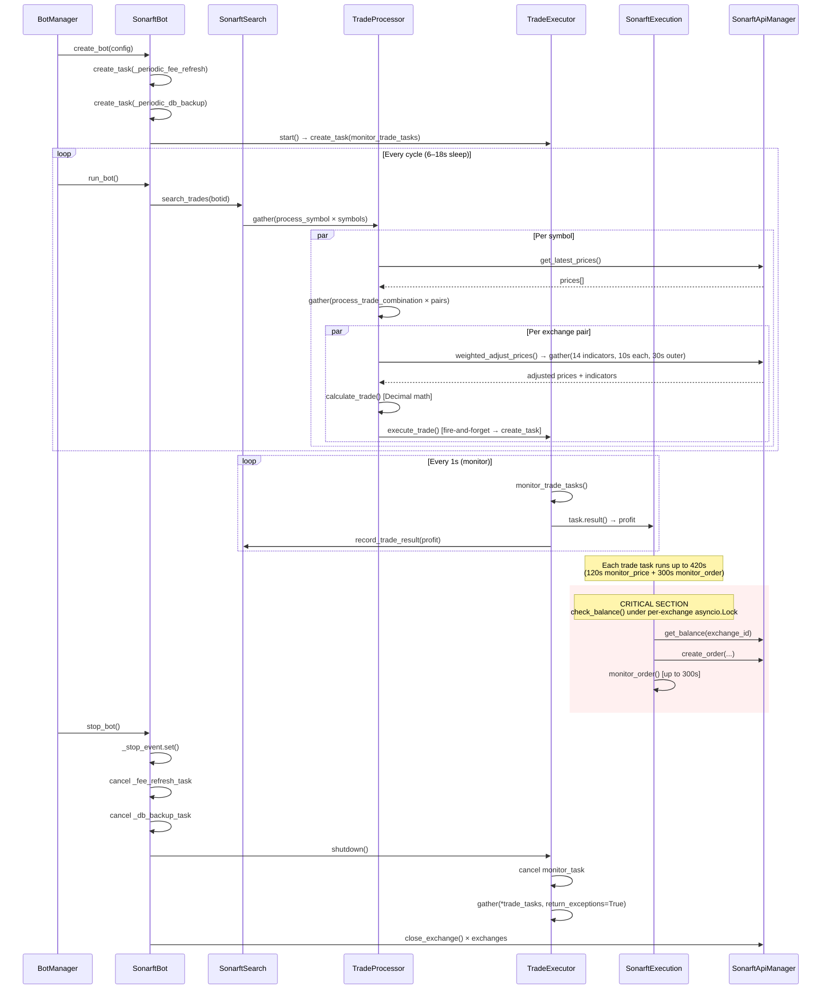

# Bot Package — Async Design & Concurrency Review

**Prompt ID:** 02-BOT-ASYNC  
**Generated:** July 2025  
**Source:** `packages/bot/` — full static analysis  
**Output File:** `docs/async/bot-concurrency.md`  
**Depends On:** `docs/architecture/bot-overview.md` (Prompt 01)

---

## 1. Async/Await Correctness

All async functions are inventoried below. Risk levels follow the master instruction scale: None / Low / Medium / High / Critical.

### `sonarft_manager.py` — BotManager

| Function | What it does | Blocking ops | Risk |
|---|---|---|---|
| `add_bot_instance` | Adds bot to `_bots` dict under lock | None | None |
| `remove_bot_instance` | Pops bot from dict, calls `stop_bot()`, removes registry file | `os.remove` called directly (not in thread) | Low |
| `get_bot_instance` | Dict lookup under lock | None | None |
| `set_update` / `get_update` | Read/write bot update under lock | None | None |
| `create_bot` | Creates `SonarftBot`, calls `create_bot()`, stores instance | None | None |
| `run_bot` | Calls `sonarft.run_bot()` | None | None |
| `pause_bot` / `resume_bot` | Delegates to `SonarftBot` | None | None |
| `reload_parameters` | Applies new params to all bots under lock | None | None |
| `remove_bot` | Calls `remove_bot_instance` | See above | Low |

**Finding — `remove_bot_instance`:** `os.remove(registry_file)` is called directly on the event loop (line ~68). For a small JSON file this is negligible in practice, but it is a blocking syscall inside an async function. Should be `await asyncio.to_thread(os.remove, registry_file)`.

---

### `sonarft_bot.py` — SonarftBot

| Function | What it does | Blocking ops | Risk |
|---|---|---|---|
| `create_bot` | Full bot initialisation sequence | `_write_botid_file` via `asyncio.to_thread` ✅ | Low |
| `run_bot` | Main trading loop with circuit breaker | None — all sleeps use `asyncio.wait_for` ✅ | None |
| `stop_bot` | Graceful shutdown: signal, cancel tasks, close exchanges | None | None |
| `pause_bot` | Sets stop event, cancels monitor task | None | None |
| `_send_alert` | POSTs webhook via `urllib.request` | `urllib.request.urlopen` via `asyncio.to_thread` ✅ | None |
| `_periodic_fee_refresh` | 24h background loop, calls `refresh_fees` | None | None |
| `_periodic_db_backup` | 24h background loop, calls `async_backup_db` | `import time as _t` inside loop (trivial) | None |
| `_reconcile_open_orders` | Concurrent order fetch+cancel at startup | None | None |
| `_reconcile_open_positions` | Queries open positions, sends alert | None | None |
| `initialize_modules` | Constructs all child modules | None | None |
| `load_configurations` | Reads JSON config files | `open()` / `json.load()` called directly — **blocking file I/O on event loop** | **Medium** |

**Finding — `load_configurations`:** Called from `create_bot` which is async. All `_load_config_section` calls use `open()` + `json.load()` synchronously on the event loop. For small config files this is fast, but it is technically a blocking operation. Should be wrapped in `asyncio.to_thread` or called before entering the async context.

**Finding — `_periodic_db_backup`:** `import time as _t` and `_t.strftime(...)` are called inside the async loop body. These are CPU-only and non-blocking, so risk is None in practice.

---

### `sonarft_api_manager.py` — SonarftApiManager

| Function | What it does | Blocking ops | Risk |
|---|---|---|---|
| `call_api_method` | Dispatches ccxt/ccxtpro call with 30s timeout | ccxt REST calls via `run_in_executor` ✅; ccxtpro calls awaited directly ✅ | None |
| `load_markets` | Loads exchange markets with 30s timeout | `exchange.load_markets()` awaited directly ✅ | None |
| `load_all_markets` | Concurrent market load via `asyncio.gather` | None | None |
| `refresh_fees` | Fetches live fee rates per exchange | `fetch_trading_fees()` via `run_in_executor` ✅ | None |
| `get_order_book` | Cached order book fetch (2s TTL) | None | None |
| `_get_ticker` | Cached ticker fetch (2s TTL) | None | None |
| `get_ohlcv_history` | Cached OHLCV fetch (per-timeframe TTL) | None | None |
| `get_latest_prices` | Concurrent price fetch across all exchanges | None | None |
| `create_order` | Places limit order on exchange | None | None |
| `cancel_order` | Cancels order on exchange | None | None |
| `close_exchange` | Closes WebSocket connection | None | None |

**Finding — REST fallback in `call_api_method`:** When ccxtpro fails and falls back to REST, a **new ccxt REST exchange instance is created per call** (lines ~95–115). This instance is never cached or closed — it leaks a connection object on every fallback invocation. Under sustained WebSocket failures this accumulates unclosed sockets.

---

### `sonarft_search.py` — SonarftSearch

| Function | What it does | Blocking ops | Risk |
|---|---|---|---|
| `set_botid` | Sets botid, loads persisted daily loss | `_load_daily_loss` via `asyncio.to_thread` ✅ | None |
| `start` | Starts `TradeProcessor` background tasks | None | None |
| `record_trade_result` | Accumulates P&L, persists to SQLite | `_save_daily_loss` via `asyncio.to_thread` ✅ | None |
| `_check_daily_reset` | Resets daily counters on date change | `_save_daily_loss` via `asyncio.to_thread` ✅ | None |
| `is_halted` | Checks daily loss/trade limits | None | None |
| `search_trades` | Dispatches per-symbol processing concurrently | None | None |

No issues found in this module.

---

### `trade_processor.py` — TradeProcessor

| Function | What it does | Blocking ops | Risk |
|---|---|---|---|
| `start` | Starts `TradeExecutor` background monitor | None | None |
| `process_symbol` | Fetches prices, iterates quote/exchange combos | None | None |
| `process_trade_combination` | Price adjustment → profit calc → validation → dispatch | None | None |

**Finding — fire-and-forget dispatch:** `self.trade_executor.execute_trade(botid, trade_data)` on line ~185 is a **synchronous call** that internally calls `asyncio.create_task(...)`. The task is not awaited at the call site — this is intentional by design (concurrent execution) but means any exception in the task is only surfaced in `monitor_trade_tasks`, not at the dispatch point. This is documented behaviour but worth noting.

---

### `trade_executor.py` — TradeExecutor

| Function | What it does | Blocking ops | Risk |
|---|---|---|---|
| `start` | Creates background monitor task | None | None |
| `execute_trade` | Creates async task for trade execution | None | None |
| `monitor_trade_tasks` | Polls done tasks every 1s, collects results | `asyncio.sleep(1)` ✅ | None |
| `shutdown` | Cancels monitor + all trade tasks | None | None |
| `cancel_trade` | Cancels tasks for a specific botid | None | None |

**Finding — `trade_tasks` list growth:** Completed tasks are pruned in `monitor_trade_tasks` every 1 second. Between pruning cycles, done tasks accumulate in the list. Under very high trade frequency (many tasks completing between 1s polls) the list can grow temporarily. The `_MAX_CONCURRENT_TRADES` cap on active tasks mitigates this.

**Finding — `monitor_trade_tasks` exception swallowing:** The inner `except Exception` block (line ~75) logs the exception but does not re-raise or propagate it. A task that raises an unexpected exception is silently consumed after logging. This is acceptable for a monitor loop but means no circuit-breaker logic triggers on repeated task failures.

---

### `sonarft_execution.py` — SonarftExecution

| Function | What it does | Blocking ops | Risk |
|---|---|---|---|
| `execute_trade` | Entry point: risk checks → `_execute_single_trade` | None | None |
| `_execute_single_trade` | Determines position, dispatches to `_execute_position` | None | None |
| `_determine_position` | Pure indicator logic, returns LONG/SHORT/None | None | None |
| `_execute_position` | Dispatches to long/short trade, saves history | None | None |
| `execute_long_trade` / `execute_short_trade` | Delegates to `_execute_two_leg_trade` | None | None |
| `_execute_two_leg_trade` | Two-leg order placement with partial fill handling | None | None |
| `_cancel_order_with_retry` | Cancels order with exponential backoff | `asyncio.sleep` ✅ | None |
| `create_order` | Validates, monitors price, places order | None | None |
| `monitor_price` | Polls price until favourable, up to 120s | `asyncio.sleep(3)` ✅ | **Medium** |
| `execute_order` | Places real or simulated order | None | None |
| `monitor_order` | Polls order status until filled, up to 300s | `asyncio.sleep(1)` ✅ | **Medium** |
| `check_balance` | Checks exchange balance under per-exchange lock | None | None |

**Finding — `monitor_price` (120s) + `monitor_order` (300s) chained:** In live mode, `create_order` calls `monitor_price` (up to 120s) then `execute_order` which calls `monitor_order` (up to 300s). A single trade leg can hold an async task for up to **420 seconds**. With `_MAX_CONCURRENT_TRADES=10`, up to 10 such tasks can run simultaneously. This is by design but has significant implications for event loop saturation and the daily trade limit counter (trades are only counted after completion).

**Finding — `monitor_order` `finally` block always cancels:** The `finally` block in `monitor_order` calls `_cancel_order_with_retry` on **every exit path**, including successful fills and normal cancellations. For a successfully filled order, the exchange will reject the cancel gracefully, but this generates unnecessary API calls and log noise on every successful trade.

---

### `sonarft_prices.py` — SonarftPrices

| Function | What it does | Blocking ops | Risk |
|---|---|---|---|
| `weighted_adjust_prices` | 14 concurrent indicator fetches, strategy dispatch | None | None |
| `dynamic_volatility_adjustment` | Concurrent MACD + RSI fetch | None | None |
| `get_the_latest_prices` | Fetches and sorts prices | None | None |
| `get_latest_prices` | Delegates to `api_manager` | None | None |

**Finding — outer timeout masks inner timeouts:** `weighted_adjust_prices` wraps the entire `asyncio.gather` of 14 indicators in a 30s outer `asyncio.wait_for`. Each indicator also has an individual 10s `_with_timeout`. If the outer timeout fires, the function returns `(0, 0, {})` and the calling `process_trade_combination` skips the combination. This is correct behaviour but the outer timeout silently discards all 14 in-flight indicator coroutines — they are not explicitly cancelled, relying on `asyncio.wait_for` to cancel them. This is correct per Python docs but worth confirming the inner `_with_timeout` wrappers don't suppress `CancelledError`.

**Finding — `_with_timeout` swallows all exceptions:** The helper catches both `asyncio.TimeoutError` and bare `Exception`, returning `default`. This means a programming error inside an indicator (e.g. `AttributeError`) is silently swallowed and treated as a missing indicator. Should distinguish `TimeoutError` from other exceptions.

---

### `sonarft_indicators.py` — SonarftIndicators

| Function | What it does | Blocking ops | Risk |
|---|---|---|---|
| All `get_*` methods | Fetch OHLCV/order book, compute indicator | `pandas-ta` computation is CPU-bound, runs on event loop | **Medium** |

**Finding — CPU-bound pandas-ta on event loop:** All indicator computations (`pta.rsi`, `pta.macd`, `pta.stochrsi`, `pta.sma`, `pta.ema`) run synchronously on the event loop inside async functions. For small datasets (14–45 candles) this is fast (sub-millisecond), but under high concurrency (many bots, many symbols) these CPU operations accumulate and can delay other coroutines. Should be wrapped in `asyncio.to_thread` for production scale.

---

### `sonarft_helpers.py` — SonarftHelpers

| Function | What it does | Blocking ops | Risk |
|---|---|---|---|
| `save_order_data` / `save_trade_data` | SQLite insert under `_db_lock` via `to_thread` ✅ | None | None |
| `save_order_history` / `save_trade_history` | Builds dict, calls `save_order_data` | None | None |
| `get_orders` / `get_trades` | SQLite query via `to_thread` ✅ | None | None |
| `purge_history` | SQLite delete via `to_thread` ✅ | None | None |
| `async_backup_db` | SQLite backup via `to_thread` ✅ | None | None |
| `open_position` / `close_position` | SQLite upsert under `_db_lock` via `to_thread` ✅ | None | None |
| `get_open_positions` | SQLite query via `to_thread` ✅ | None | None |
| `save_error` / `save_balance_data` | JSON append under per-file lock via `to_thread` ✅ | None | None |

**Finding — `_db_lock` redundancy:** `_db_lock` is an instance-level `asyncio.Lock` acquired before every `to_thread` SQLite call. SQLite in WAL mode already serialises concurrent writers at the database level. The Python-level lock serialises all writes through a single coroutine, preventing any write concurrency benefit from `to_thread`. For reads (which don't acquire the lock), this is fine. For writes, the lock is redundant but harmless.

**Finding — `_init_db` called synchronously in `__init__`:** `SonarftHelpers.__init__` calls `self._init_db()` synchronously. This is a blocking SQLite operation (schema creation) called from a constructor that may be invoked inside an async context. For a one-time startup operation this is acceptable, but it violates the principle of no blocking I/O in async contexts.


---

## 2. Task Management Analysis

### Task creation inventory

| Task | Created in | Type | Lifecycle |
|---|---|---|---|
| `_fee_refresh_task` | `SonarftBot.create_bot` | `asyncio.create_task` | Cancelled in `stop_bot` ✅ |
| `_db_backup_task` | `SonarftBot.create_bot` | `asyncio.create_task` | Cancelled in `stop_bot` ✅ |
| `monitor_task` | `TradeExecutor.start` | `asyncio.create_task` | Cancelled in `TradeExecutor.shutdown` ✅ |
| Per-trade tasks | `TradeExecutor.execute_trade` | `asyncio.create_task` | Cancelled in `TradeExecutor.shutdown` ✅ |

### Task cleanup on shutdown

`SonarftBot.stop_bot` follows a correct shutdown sequence:

1. Sets `_stop_event` — signals run loop and periodic tasks to exit.
2. Cancels and awaits `_fee_refresh_task`.
3. Cancels and awaits `_db_backup_task`.
4. Calls `executor.shutdown()` — cancels monitor task, then cancels and gathers all trade tasks.
5. Closes all exchange connections.

All tasks are explicitly cancelled and awaited. No dangling tasks on clean shutdown.

### Dangling task risk

**Finding — `pause_bot` partial shutdown:** `SonarftBot.pause_bot` cancels the `monitor_task` but does **not** cancel `_fee_refresh_task` or `_db_backup_task`. These periodic tasks continue running while the bot is paused. This is arguably correct (fees should still refresh), but it is an undocumented asymmetry between `pause_bot` and `stop_bot`.

**Finding — `__main__.py` creates `BotManager` but never uses it:** Line 28 of `__main__.py` instantiates `BotManager(logger=logger)` and discards the reference. The bot is then created and run directly via `SonarftBot`. The `BotManager` instance is immediately garbage-collected. This is dead code.

### Long-running loops

| Loop | Location | Yield mechanism | Max duration |
|---|---|---|---|
| `run_bot` main loop | `sonarft_bot.py` | `asyncio.wait_for(_stop_event.wait(), timeout=N)` ✅ | Unbounded (by design) |
| `_periodic_fee_refresh` | `sonarft_bot.py` | `asyncio.wait_for(_stop_event.wait(), timeout=86400)` ✅ | 24h per iteration |
| `_periodic_db_backup` | `sonarft_bot.py` | `asyncio.wait_for(_stop_event.wait(), timeout=86400)` ✅ | 24h per iteration |
| `monitor_trade_tasks` | `trade_executor.py` | `asyncio.sleep(1)` ✅ | Unbounded (by design) |
| `monitor_price` | `sonarft_execution.py` | `asyncio.sleep(3)` ✅ | 120s max |
| `monitor_order` | `sonarft_execution.py` | `asyncio.sleep(1)` ✅ | 300s max |

All loops yield control correctly. No `while True` loops with blocking sleeps.

### CancelledError handling

| Location | Handling |
|---|---|
| `_periodic_fee_refresh` | `except asyncio.CancelledError: pass` ✅ |
| `_periodic_db_backup` | `except asyncio.CancelledError: pass` ✅ |
| `monitor_trade_tasks` | `except asyncio.CancelledError:` logs and exits ✅ |
| `monitor_order` `finally` | `CancelledError` propagates through `finally` correctly ✅ |
| `TradeExecutor.shutdown` | `await asyncio.gather(*tasks, return_exceptions=True)` ✅ |

`CancelledError` is handled correctly throughout. No cases where it is swallowed as a bare `Exception`.

---

## 3. Concurrency Synchronization

### Shared mutable state inventory

| State | Owner | Shared across | Protection |
|---|---|---|---|
| `BotManager._bots` | `BotManager` | Multiple API request coroutines | `asyncio.Lock` ✅ |
| `BotManager._clients` | `BotManager` | Multiple API request coroutines | `asyncio.Lock` ✅ |
| `SonarftApiManager._ohlcv_cache` | `SonarftApiManager` | All concurrent indicator fetches | **No lock** ⚠️ |
| `SonarftApiManager._order_book_cache` | `SonarftApiManager` | All concurrent price/validator fetches | **No lock** ⚠️ |
| `SonarftApiManager._ticker_cache` | `SonarftApiManager` | All concurrent price fetches | **No lock** ⚠️ |
| `SonarftApiManager.markets` | `SonarftApiManager` | All modules | Written once at startup, read-only after ✅ |
| `SonarftIndicators._indicator_cache` | `SonarftIndicators` | All concurrent indicator calls | **No lock** ⚠️ |
| `SonarftIndicators.previous_spread` | `SonarftIndicators` | Concurrent symbol processing | **No lock** ⚠️ |
| `TradeExecutor.trade_tasks` | `TradeExecutor` | `execute_trade` + `monitor_trade_tasks` | **No lock** ⚠️ |
| `TradeExecutor._session_trades` / `_session_profit` | `TradeExecutor` | `monitor_trade_tasks` only | Single coroutine ✅ |
| `SonarftExecution._order_timestamps` | `SonarftExecution` | Concurrent trade tasks | **No lock** ⚠️ |
| `SonarftExecution._current_exposure` | `SonarftExecution` | Concurrent trade tasks | **No lock** ⚠️ |
| `SonarftExecution._exchange_locks` | `SonarftExecution` | Concurrent trade tasks | Dict written lazily, race on creation ⚠️ |
| `SonarftSearch.daily_loss_accumulated` | `SonarftSearch` | `record_trade_result` + `is_halted` | **No lock** ⚠️ |
| `SonarftSearch._daily_trades_count` | `SonarftSearch` | `record_trade_result` + `is_halted` | **No lock** ⚠️ |
| `SonarftHelpers._db_lock` | `SonarftHelpers` | All write operations | `asyncio.Lock` ✅ |
| `SonarftHelpers._file_locks` | `SonarftHelpers` | Per-file write operations | Per-file `asyncio.Lock` ✅ |

### Race condition analysis

#### Cache dictionaries (Medium risk)

`_ohlcv_cache`, `_order_book_cache`, `_ticker_cache`, and `_indicator_cache` are plain Python dicts mutated from concurrent coroutines without locks. In CPython, dict operations are protected by the GIL at the bytecode level, so individual `dict[key] = value` assignments are atomic. However, the **read-check-write** pattern used for LRU eviction is not atomic:

```python
if len(self._ohlcv_cache) >= 500:          # read
    oldest_key = next(iter(self._ohlcv_cache))  # read
    del self._ohlcv_cache[oldest_key]           # write
self._ohlcv_cache[cache_key] = (...)            # write
```

Two concurrent coroutines can both pass the `len >= 500` check and both attempt to delete the same `oldest_key`, raising `KeyError`. This is a real race condition under concurrent symbol processing.

#### `TradeExecutor.trade_tasks` list (Medium risk)

`execute_trade` appends to `self.trade_tasks` and `monitor_trade_tasks` reads and replaces it concurrently. In CPython, list `append` is atomic (GIL), but the list comprehension replacement in `monitor_trade_tasks`:

```python
self.trade_tasks = [t for t in self.trade_tasks if not t.done()]
```

...creates a new list and rebinds the name. A concurrent `append` between the comprehension read and the rebind will lose the appended task — it will not appear in the new list and will never be monitored or cleaned up. This is a **task leak** under concurrent execution.

#### `SonarftExecution._order_timestamps` (Medium risk)

```python
self._order_timestamps = [t for t in self._order_timestamps if now - t < 60]
if len(self._order_timestamps) >= self.max_orders_per_minute:
    ...
self._order_timestamps.append(now)
```

Two concurrent trade tasks can both pass the rate limit check before either appends, allowing `2 × max_orders_per_minute` orders to be placed in a burst. The per-exchange `_exchange_locks` protect balance checks but not the rate limit counter.

#### `SonarftExecution._exchange_locks` dict (Low risk)

```python
if exchange_id not in self._exchange_locks:
    self._exchange_locks[exchange_id] = asyncio.Lock()
async with self._exchange_locks[exchange_id]:
```

Two concurrent coroutines for the same exchange can both pass the `not in` check and both create a new `Lock`. The second creation overwrites the first — any coroutine already waiting on the first lock will never be released. In practice this is unlikely (exchanges are loaded at startup) but is a TOCTOU race.

#### `SonarftSearch` daily counters (Low risk)

`daily_loss_accumulated` and `_daily_trades_count` are incremented in `record_trade_result`, which is called from `monitor_trade_tasks` — a single coroutine. There is no concurrent write path, so these are safe in the current architecture. However, if `record_trade_result` were ever called from multiple coroutines, the lack of a lock would be a problem.

### Deadlock analysis

No deadlock risks identified. All locks are `asyncio.Lock` (not reentrant), and no code acquires two locks simultaneously. The `BotManager._lock` is never held while awaiting I/O.

One near-miss: `BotManager.reload_parameters` acquires `_lock` and calls `bot.apply_parameters(new_parameters)` while holding it. `apply_parameters` is synchronous and does not await anything, so no deadlock. If it were ever made async, this would be a deadlock risk.


---

## 4. Async/Await Error Handling

### Exception propagation in tasks

| Scenario | Handling | Gap |
|---|---|---|
| Exception in a trade task | Caught in `monitor_trade_tasks` `except Exception` block, logged | Not re-raised; no circuit breaker on repeated task failures |
| Exception in `run_bot` search loop | Caught, consecutive failure counter incremented, circuit breaker trips at `max_failures` ✅ | None |
| Exception in `_periodic_fee_refresh` | Not caught inside the loop body — propagates to `asyncio.CancelledError` handler only | An unexpected exception (e.g. network error) in `refresh_fees` will **silently kill the fee refresh task** |
| Exception in `_periodic_db_backup` | Same pattern as fee refresh | Same gap |
| Exception in `monitor_trade_tasks` outer loop | `except asyncio.CancelledError` only — any other exception kills the monitor | If monitor dies, completed trade tasks are never cleaned up and `record_trade_result` is never called |

**Finding — periodic tasks lack inner exception handling:** Both `_periodic_fee_refresh` and `_periodic_db_backup` have the structure:

```python
try:
    while not self._stop_event.is_set():
        await asyncio.wait_for(...)   # sleep
        await self.api_manager.refresh_fees()  # can raise
except asyncio.CancelledError:
    pass
```

If `refresh_fees()` raises an unexpected exception, it propagates out of the `while` loop, is not caught by `except asyncio.CancelledError`, and kills the task silently. The task handle (`_fee_refresh_task`) will be in a failed state but nothing checks it. Fee rates will be stale for the rest of the session.

### Timeout handling

| Timeout | Location | On expiry |
|---|---|---|
| 30s per API call | `call_api_method` | Logs error, returns `None`; caller must handle `None` |
| 30s market load | `load_markets` | Logs error, returns `{}` |
| 30s fee refresh | `refresh_fees` | Logs warning, keeps existing rates ✅ |
| 10s per indicator | `_with_timeout` in `weighted_adjust_prices` | Returns `default` (None or 0.0) |
| 30s outer indicator gather | `weighted_adjust_prices` | Returns `(0, 0, {})`, trade skipped ✅ |
| 120s price monitor | `monitor_price` | Returns `None`, order skipped ✅ |
| 300s order monitor | `monitor_order` | Returns `(0, target_amount)`, `finally` cancels order ✅ |

Timeout handling is generally thorough. The main gap is that `None` returns from `call_api_method` propagate silently — callers must check for `None` but not all do consistently.

### Connection loss recovery

- ccxtpro WebSocket disconnections: ccxtpro handles reconnection internally. The REST fallback in `call_api_method` provides an additional safety net.
- No explicit reconnection logic in the bot layer — relies entirely on ccxt/ccxtpro internals.
- Exchange `close()` is called on shutdown but not on reconnect — this is correct.

---

## 5. Concurrency Risk Table

| Location | Pattern | Risk Description | Severity | Remediation |
|---|---|---|---|---|
| `SonarftApiManager._ohlcv_cache` LRU eviction | Read-check-write without lock | Concurrent eviction can raise `KeyError` | Medium | Use `asyncio.Lock` around eviction block, or switch to `functools.lru_cache` / `cachetools.TTLCache` |
| `SonarftApiManager._order_book_cache` LRU eviction | Same pattern | Same risk | Medium | Same remediation |
| `SonarftApiManager._ticker_cache` LRU eviction | Same pattern | Same risk | Medium | Same remediation |
| `SonarftIndicators._indicator_cache` LRU eviction | Same pattern | Same risk | Medium | Same remediation |
| `TradeExecutor.trade_tasks` list replacement | List comprehension rebind races with `append` | Task leak — appended task lost between read and rebind | **High** | Use `asyncio.Queue` or protect list with `asyncio.Lock` |
| `SonarftExecution._order_timestamps` rate limit | Read-check-append without lock | Rate limit bypass under concurrent tasks | Medium | Protect with `asyncio.Lock` |
| `SonarftExecution._exchange_locks` lazy creation | TOCTOU on dict write | Lock overwritten, waiting coroutine never released | Low | Pre-populate locks at `__init__` from known exchange list |
| `_periodic_fee_refresh` / `_periodic_db_backup` | No inner exception handler | Unexpected exception kills task silently | Medium | Wrap loop body in `try/except Exception` with logging |
| `monitor_order` `finally` block | Always cancels, including on success | Unnecessary cancel API call on every successful fill | Low | Only cancel in `finally` if order was not confirmed filled |
| `sonarft_bot.load_configurations` | Blocking file I/O on event loop | Blocks event loop during config load | Low | Wrap in `asyncio.to_thread` or call before `asyncio.run` |
| `BotManager.remove_bot_instance` | `os.remove` on event loop | Blocking syscall in async function | Low | `await asyncio.to_thread(os.remove, path)` |
| `SonarftHelpers._init_db` in `__init__` | Blocking SQLite in constructor | Blocks event loop if constructed in async context | Low | Move to an async `async_init` classmethod |
| `call_api_method` REST fallback | New exchange instance per call, never closed | Connection/socket leak under sustained WS failures | Medium | Cache REST fallback instances per exchange |
| `SonarftIndicators` pandas-ta on event loop | CPU-bound computation in async function | Blocks event loop under high concurrency | Medium | Wrap in `asyncio.to_thread` for production scale |
| `__main__.py` BotManager instantiation | Instance created and discarded | Dead code, misleading | Low | Remove unused `BotManager` instantiation |

---

## 6. Task Lifecycle Summary

```
Bot startup
    │
    ├─ create_bot()
    │       ├─ asyncio.create_task(_periodic_fee_refresh)   ──► runs every 24h
    │       └─ asyncio.create_task(_periodic_db_backup)     ──► runs every 24h
    │
    ├─ run_bot()  [main loop]
    │       └─ search_trades() per cycle
    │               └─ process_symbol() per symbol  [asyncio.gather]
    │                       └─ process_trade_combination() per exchange pair
    │                               └─ trade_executor.execute_trade()
    │                                       └─ asyncio.create_task(execute_trade)  ──► trade task
    │
    ├─ TradeExecutor.start()
    │       └─ asyncio.create_task(monitor_trade_tasks)  ──► polls every 1s
    │               └─ on task done: result() → record_trade_result() → log_session_pnl()
    │
    └─ stop_bot() / pause_bot()
            ├─ _stop_event.set()                    stops run_bot loop
            ├─ _fee_refresh_task.cancel() + await   (stop_bot only)
            ├─ _db_backup_task.cancel() + await     (stop_bot only)
            ├─ executor.shutdown()
            │       ├─ monitor_task.cancel() + await
            │       └─ asyncio.gather(*trade_tasks, return_exceptions=True)
            └─ api_manager.close_exchange() per exchange
```

**Edge cases:**

- If `create_bot` fails after creating periodic tasks but before returning `botid`, the tasks are created but `stop_bot` is never called — they run until the process exits. The `_stop_event` is never set for them.
- If a trade task raises `CancelledError` during `executor.shutdown`, it is caught by `return_exceptions=True` and not re-raised. ✅
- If `monitor_trade_tasks` dies unexpectedly (non-CancelledError exception), trade tasks continue running but their results are never collected and `record_trade_result` is never called — daily P&L tracking silently stops.

---

## 7. Concurrency Flow Diagram



---

## 8. Recommendations

### Critical

| # | Finding | Action |
|---|---|---|
| C1 | `TradeExecutor.trade_tasks` list replacement races with concurrent `append` — tasks can be silently lost | Replace `trade_tasks: list` with `asyncio.Queue` or protect with `asyncio.Lock` |

### High

| # | Finding | Action |
|---|---|---|
| H1 | All four LRU cache dicts (`_ohlcv_cache`, `_order_book_cache`, `_ticker_cache`, `_indicator_cache`) have a read-check-write race on eviction | Wrap eviction block in `asyncio.Lock`, or replace with `cachetools.TTLCache` (thread-safe) |
| H2 | `_order_timestamps` rate limit check is not atomic under concurrent trade tasks | Protect the check-and-append with `asyncio.Lock` |

### Medium

| # | Finding | Action |
|---|---|---|
| M1 | `_periodic_fee_refresh` and `_periodic_db_backup` have no inner exception handler — any error kills the task silently | Wrap loop body in `try/except Exception as e: self.logger.error(...)` |
| M2 | `call_api_method` REST fallback creates a new exchange instance per call, never closed | Cache one REST instance per exchange in a `_rest_fallback_instances` dict |
| M3 | pandas-ta indicator computations run on the event loop | Wrap in `asyncio.to_thread` for deployments with many concurrent bots/symbols |
| M4 | `create_bot` creates periodic tasks before returning `botid` — on failure, tasks are orphaned | Create periodic tasks only after `botid` is confirmed |

### Low

| # | Finding | Action |
|---|---|---|
| L1 | `monitor_order` `finally` always cancels, including on successful fills | Add a `_filled` flag; only cancel in `finally` if not filled |
| L2 | `_exchange_locks` dict populated lazily with TOCTOU race | Pre-populate in `__init__` from `api_manager.exchanges_list` |
| L3 | `load_configurations` does blocking file I/O on the event loop | Wrap in `asyncio.to_thread` or call before `asyncio.run` |
| L4 | `BotManager.remove_bot_instance` calls `os.remove` on event loop | `await asyncio.to_thread(os.remove, path)` |
| L5 | `SonarftHelpers._init_db` blocks in constructor | Move to `async_init` classmethod called from `SonarftBot.initialize_modules` |
| L6 | `__main__.py` creates `BotManager` and discards it | Remove the unused instantiation |
