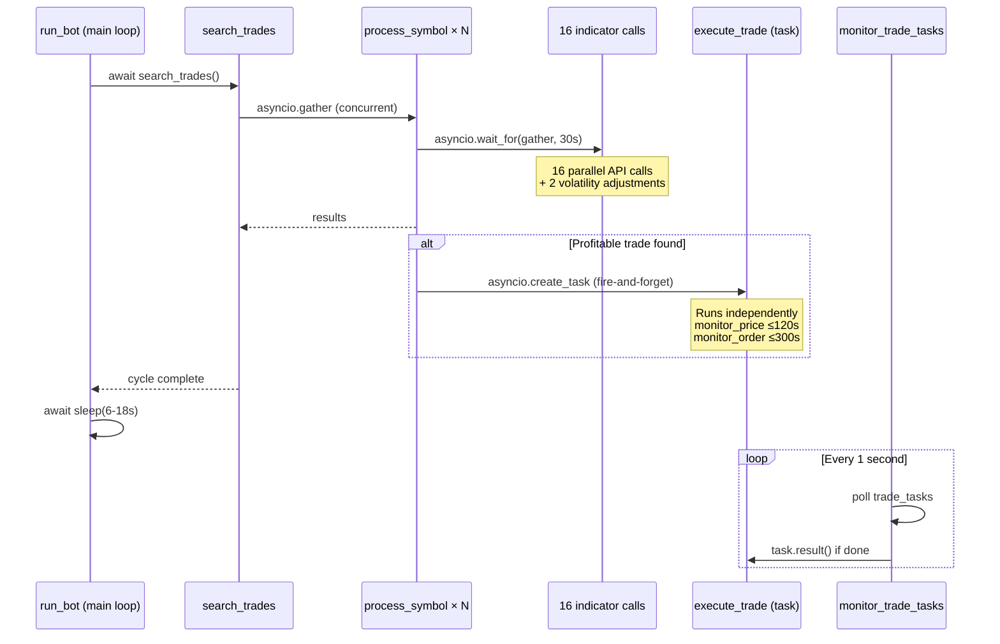

# SonarFT Bot — Async Design & Concurrency Review

**Prompt:** 02-BOT-ASYNC  
**Reviewer:** Senior Python Engineer / Async Systems Architect  
**Date:** July 2025  
**Codebase:** `packages/bot` (10 Python modules, 75 async functions, ~3,099 LOC)

---

## 1. Async/Await Correctness

### 1.1 `sonarft_bot.py` — Bot Lifecycle (5 async functions)

| Function | What It Does | Awaited Calls | Blocking Ops | Risk |
|---|---|---|---|---|
| `create_bot` | Creates bot instance, loads config, wires modules, loads markets | `asyncio.to_thread(json.dump)`, `InitializeModules()`, `api_manager.load_all_markets()` | `load_configurations()` — sync `open()`/`json.load()` on config files (6 reads) | **Medium** |
| `run_bot` | Main loop: search → sleep → repeat with circuit breaker | `search_trades()`, `_send_alert()`, `asyncio.wait_for(asyncio.shield(_stop_event.wait()))` | None | **Low** |
| `_send_alert` | Sends webhook alert via HTTP POST | `asyncio.to_thread(urllib.request.urlopen)` | None — correctly offloaded to thread | **None** |
| `stop_bot` | Signals stop event, closes exchange connections | `api_manager.close_exchange()` per exchange | None | **None** |
| `InitializeModules` | Wires all module dependencies | `sonarft_search.start()` | None | **None** |

**Findings:**

- ⚠️ **Blocking file I/O in `load_configurations()`** — `_load_config_section()` calls `open()` and `json.load()` synchronously inside `create_bot()` (an async function). This blocks the event loop for 6 sequential file reads. Severity: **Medium**. The files are small JSON configs so the actual block time is minimal (~ms), but it violates async-first principles.
- ✅ `asyncio.to_thread(json.dump(...))` is correctly used for the botid file write in `create_bot()`.
- ✅ `run_bot()` uses `asyncio.wait_for(asyncio.shield(_stop_event.wait()))` for interruptible sleep — correct pattern.
- ⚠️ **`open(botid_path, "w")` inside lambda** (line 57) — the file handle is opened inside `asyncio.to_thread` which is correct, but the `open()` call is not wrapped in a `with` statement, so the file handle is never explicitly closed. Relies on garbage collection. Severity: **Low**.

### 1.2 `sonarft_manager.py` — Bot Management (9 async functions)

| Function | What It Does | Awaited Calls | Blocking Ops | Risk |
|---|---|---|---|---|
| `add_bot_instance` | Registers bot under lock | None (dict mutation only) | None | **None** |
| `remove_bot_instance` | Stops and deregisters bot under lock | `_bots[botid].stop_bot()` | None | **Low** |
| `get_bot_instance` | Returns bot reference under lock | None | None | **None** |
| `set_update` | Updates bot state under lock | None | None | **None** |
| `get_update` | Reads bot state under lock | None | None | **None** |
| `create_bot` | Creates SonarftBot, stores instance | `sonarft.create_bot()`, `add_bot_instance()`, `remove_bot()` | `parse_args()` — sync but trivial | **None** |
| `run_bot` | Runs a created bot | `get_bot_instance()`, `sonarft.run_bot()` | None | **None** |
| `reload_parameters` | Hot-reloads params into all client bots | None (sync `apply_parameters()` under lock) | None | **None** |
| `remove_bot` | Removes a bot | `get_bot_instance()`, `remove_bot_instance()` | None | **None** |

**Findings:**

- ⚠️ **`stop_bot()` awaited inside `self._lock`** in `remove_bot_instance()` — `stop_bot()` calls `close_exchange()` which performs network I/O. Holding the lock during network I/O means all other bot management operations (create, remove, get) are blocked until exchange connections close. Severity: **Medium**.
- ⚠️ **`get_botids()` is sync and reads `self._clients` without the lock** (line 98). Since Python dicts are thread-safe for reads in CPython and this is single-threaded asyncio, this is safe in practice, but inconsistent with the locking pattern used everywhere else. Severity: **Low**.

### 1.3 `sonarft_search.py` — Trade Search (7 async functions)

| Function | What It Does | Awaited Calls | Blocking Ops | Risk |
|---|---|---|---|---|
| `TradeValidator.has_requirements_for_success_carrying_out` | Validates liquidity + spread | `asyncio.gather(deeper_verify_liquidity × 2)`, `verify_spread_threshold()` | None | **None** |
| `TradeExecutor.start` | Starts background monitor task | `asyncio.create_task(monitor_trade_tasks)` | None | **None** |
| `TradeExecutor.monitor_trade_tasks` | Polls completed trade tasks in `while True` loop | `asyncio.sleep(1)` | None | **Low** |
| `TradeProcessor.start` | Starts executor background tasks | `trade_executor.start()` | None | **None** |
| `TradeProcessor.process_symbol` | Fetches prices, iterates buy/sell combos | `get_the_latest_prices()`, `process_trade_combination()` | None | **None** |
| `TradeProcessor.process_trade_combination` | Adjusts prices, calculates profit, validates, executes | `weighted_adjust_prices()`, `has_requirements_for_success_carrying_out()` | None | **None** |
| `SonarftSearch.search_trades` | Gathers all symbol processing concurrently | `asyncio.gather(*futures, return_exceptions=True)` | None | **None** |

**Findings:**

- ⚠️ **`monitor_trade_tasks` is a `while True` loop with no exit condition** — it runs forever via `asyncio.create_task()`. When the bot stops, this task is never cancelled. It will keep running until the process exits or the event loop closes. Severity: **High**.
- ⚠️ **`execute_trade()` (sync method) calls `asyncio.create_task()`** — `TradeExecutor.execute_trade()` is a sync method that creates an async task. This works only if called from within a running event loop, which it always is in this codebase. However, the fire-and-forget pattern means trade execution exceptions are only caught by the monitor task 1+ seconds later. Severity: **Low**.
- ✅ `search_trades` uses `return_exceptions=True` — exceptions from individual symbols don't crash the entire search cycle.

### 1.4 `sonarft_prices.py` — Price Calculation (4 async functions)

| Function | What It Does | Awaited Calls | Blocking Ops | Risk |
|---|---|---|---|---|
| `weighted_adjust_prices` | Fetches 16 indicators in parallel, adjusts prices | `asyncio.wait_for(asyncio.gather(16 calls), timeout=30)`, `asyncio.gather(2 volatility adjustments)` | None | **None** |
| `dynamic_volatility_adjustment` | Fetches MACD + RSI for volatility factor | `get_macd()`, `get_rsi()` | None | **None** |
| `get_the_latest_prices` | Gets and sorts latest prices | `get_latest_prices()` | None | **None** |
| `get_latest_prices` | Delegates to api_manager | `api_manager.get_latest_prices()` | None | **None** |

**Findings:**

- ✅ **30-second timeout on indicator gather** — `asyncio.wait_for(..., timeout=30.0)` prevents indefinite hangs. Returns `(0, 0, {})` on timeout. Good pattern.
- ⚠️ **`dynamic_volatility_adjustment` calls `get_macd()` and `get_rsi()` sequentially** (lines 192-193) instead of using `asyncio.gather()`. These are independent calls that could run in parallel. Severity: **Low** (mitigated by indicator cache — likely cache hits from the earlier gather).

### 1.5 `sonarft_indicators.py` — Technical Indicators (20 async functions)

| Function | What It Does | Awaited Calls | Blocking Ops | Risk |
|---|---|---|---|---|
| `get_rsi` | Calculates RSI from OHLCV | `get_history()` | `pd.Series()`, `pta.rsi()` — CPU-bound | **Low** |
| `get_stoch_rsi` | Calculates Stochastic RSI | `get_history()` | `pd.Series()`, `pta.stochrsi()` — CPU-bound | **Low** |
| `get_market_direction` | SMA/EMA direction | `get_history()` | `pd.Series()`, `pta.sma()`/`pta.ema()` | **Low** |
| `get_short_term_market_trend` | Recent price trend | `get_history()` | Arithmetic only | **None** |
| `get_macd` | Calculates MACD | `get_history()` | `pd.Series()`, `pta.macd()` — CPU-bound | **Low** |
| `market_movement` | Order book spread direction | `get_order_book()` | Arithmetic only | **Medium** |
| `get_volatility` | Order book volatility | `get_order_book()` | `np.std()` — trivial | **None** |
| `get_support_price` | Historical low | `get_history()` | `min()` | **None** |
| `get_resistance_price` | Historical high | `get_history()` | `max()` | **None** |
| `get_atr` | Average True Range | `get_history()` | `pta.atr()` | **Low** |
| `get_24h_high` | 24h high price | `get_history()` | `np.max()` | **None** |
| `get_24h_low` | 24h low price | `get_history()` | `np.min()` | **None** |
| `get_historical_volume` | Latest candle volume | `get_history()` | None | **None** |
| `get_current_volume` | Order book bid/ask volume | `get_order_book()` | Arithmetic | **None** |
| `get_liquidity` | Normalized liquidity score | `get_order_book()` | Arithmetic | **None** |
| `get_past_performance` | Price change over lookback | `get_history()` | Arithmetic | **None** |
| `get_price_change` | Percent price change | `get_history()` | Arithmetic | **None** |
| `get_order_book` | Delegates to api_manager | `api_manager.get_order_book()` | None | **None** |
| `get_trading_volume` | Delegates to api_manager | `api_manager.get_trading_volume()` | None | **None** |
| `get_history` | Delegates to api_manager | `api_manager.get_ohlcv_history()` | None | **None** |

**Findings:**

- ⚠️ **CPU-bound pandas-ta calculations run on the event loop** — `pta.rsi()`, `pta.macd()`, `pta.stochrsi()`, `pta.sma()` are synchronous CPU-bound operations executed inside async functions. For small datasets (14-45 candles), this is negligible (~µs). For larger datasets or under heavy concurrency, this could block the event loop. Severity: **Low**.
- ⚠️ **`market_movement()` mutates `self.previous_spread`** without synchronization — confirmed race condition under concurrent symbol processing (16 parallel calls in `weighted_adjust_prices`). Severity: **Medium** (identified in Prompt 01, confirmed here).

### 1.6 `sonarft_math.py` — Financial Calculations (0 async functions)

All methods are synchronous. `calculate_trade()` uses `Decimal` arithmetic — CPU-bound but fast (~µs). **No async concerns.**

### 1.7 `sonarft_execution.py` — Order Execution (10 async functions)

| Function | What It Does | Awaited Calls | Blocking Ops | Risk |
|---|---|---|---|---|
| `execute_trade` | Entry point: validates limits, delegates | `_execute_single_trade()` | `time.monotonic()` — trivial | **None** |
| `_execute_single_trade` | Position logic, order placement | `asyncio.gather(6 indicators)` (fallback), `execute_long/short_trade()`, `save_order/trade_history()` | None | **None** |
| `execute_long_trade` | Buy first, then sell | `check_balance()`, `create_order()` × 2, `cancel_order()` | None | **None** |
| `execute_short_trade` | Sell first, then buy | `check_balance()`, `create_order()` × 2, `cancel_order()` | None | **None** |
| `handle_trade_results` | Evaluates order success | None | None | **None** |
| `create_order` | Places order with price monitoring | `monitor_price()`, `execute_order()` | None | **None** |
| `monitor_price` | Polls price until favorable | `asyncio.sleep(3)`, `get_last_price()` in loop | None | **Low** |
| `execute_order` | Places order via API or simulates | `api_manager.create_order()`, `monitor_order()` | None | **None** |
| `monitor_order` | Polls order status until filled/timeout | `asyncio.sleep(1)`, `watch_orders()` in loop | None | **Low** |
| `check_balance` | Verifies sufficient balance | `asyncio.sleep(1)`, `api_manager.get_balance()` | None | **None** |

**Findings:**

- ⚠️ **`monitor_price` can block for up to 120 seconds** — polls every 3s with a 120s deadline. During this time, the trade execution task is occupied. Since trades are dispatched via `asyncio.create_task`, this doesn't block the main search loop, but it does mean a single trade can hold resources for 2+ minutes. Severity: **Low**.
- ⚠️ **`monitor_order` can block for up to 300 seconds** — polls every 1s with a 300s deadline. Combined with `monitor_price`, a single trade execution can take up to 420 seconds (7 minutes). Severity: **Low** (by design for limit orders).
- ⚠️ **`check_balance` has a hardcoded `asyncio.sleep(1)`** (line 393) before every balance check. This adds 1 second of latency to every trade leg. Severity: **Low**.
- ✅ Long/short trade execution correctly handles partial fills — uses `buy_executed_amount` for the sell leg.
- ✅ Failed second leg triggers cancellation of the first leg — good hedging safety.

### 1.8 `sonarft_validators.py` — Validation (10 async functions)

| Function | What It Does | Awaited Calls | Blocking Ops | Risk |
|---|---|---|---|---|
| `has_liquidity` | Checks trading volume | `get_trading_volume()` | None | **None** |
| `deeper_verify_liquidity` | Deep order book check | `get_order_book()`, `get_trading_volume()` | None | **None** |
| `get_trade_dynamic_spread_threshold_avg` | Computes spread thresholds | `asyncio.gather(get_order_book × 2)` | `np.mean()`, `np.std()` — trivial | **None** |
| `get_trade_spread_threshold` | Fetches history + computes thresholds | `asyncio.gather(get_history × 2)`, `get_trade_dynamic_spread_threshold_avg()` | None | **None** |
| `verify_spread_threshold` | Validates spread ratio | `get_trade_spread_threshold()` | Arithmetic | **None** |
| `check_slippage` | Checks slippage on both exchanges | `check_exchange_slippage()` × 2 | None | **None** |
| `check_exchange_slippage` | Per-exchange slippage check | `get_trade_history()`, `calculate_slippage_tolerance()`, `get_order_book()` | `preprocess_trade_data()` — sync, trivial | **None** |
| `calculate_slippage_tolerance` | Statistical slippage calc | None (sync despite being async) | `np.median()`, `np.percentile()`, `np.std()` | **Low** |
| `get_order_book` | Delegates to api_manager | `api_manager.get_order_book()` | None | **None** |
| `get_history` | Delegates to api_manager | `api_manager.get_ohlcv_history()` | None | **None** |

**Findings:**

- ⚠️ **`calculate_slippage_tolerance` is `async` but contains no `await`** — it's a pure CPU-bound function marked as async unnecessarily. Severity: **Low** (no harm, but misleading).
- ⚠️ **`check_slippage` calls `check_exchange_slippage` sequentially** for buy and sell exchanges instead of using `asyncio.gather()`. Severity: **Low** (method is currently commented out in `TradeValidator`).

### 1.9 `sonarft_api_manager.py` — Exchange API (17 async functions)

| Function | What It Does | Awaited Calls | Blocking Ops | Risk |
|---|---|---|---|---|
| `call_api_method` | Central dispatch: ccxt (thread) or ccxtpro (async) | `loop.run_in_executor()` or `await method_call()` | None — ccxt REST correctly offloaded to executor | **None** |
| `load_markets` | Loads exchange markets | `call_api_method()` | None | **None** |
| `load_all_markets` | Loads all exchange markets in parallel | `asyncio.gather()` | None | **None** |
| `get_balance` | Fetches balance | `call_api_method()` | None | **None** |
| `create_order` | Places order | `call_api_method()` | None | **None** |
| `create_futures_order` | Places futures order | `call_api_method()` | None | **None** |
| `cancel_order` | Cancels order | `call_api_method()` | None | **None** |
| `close_exchange` | Closes exchange connection | `exchange.close()` | None | **None** |
| `watch_orders` | Fetches/watches orders | `call_api_method()` | None | **None** |
| `get_order_book` | Fetches order book (cached 2s) | `call_api_method()` | None | **None** |
| `get_trading_volume` | Fetches ticker volume | `call_api_method()` | None | **None** |
| `get_last_price` | Fetches last price | `call_api_method()` | None | **None** |
| `get_ohlcv_history` | Fetches OHLCV (cached per-candle TTL) | `call_api_method()` | None | **None** |
| `get_trades_history` | Fetches trade history | `call_api_method()` | None | **None** |
| `get_latest_prices` | Fetches prices across all exchanges | `asyncio.gather(_fetch_exchange × N)` | None | **None** |
| `_fetch_exchange` | Per-exchange price fetch | `asyncio.gather(order_book, ticker)` | None | **None** |
| `wait_for_rate_limit` | Legacy rate limit helper | `exchange.sleep()` | None | **None** |

**Findings:**

- ✅ **`call_api_method` correctly handles both API modes** — ccxt REST calls are offloaded to `run_in_executor(None, ...)` (thread pool), ccxtpro WebSocket calls are awaited directly. This is the correct pattern.
- ✅ **Order book and OHLCV caching** prevents redundant API calls within the same cycle.
- ⚠️ **Cache dict mutation is not synchronized** — `_ohlcv_cache` and `_order_book_cache` are plain dicts mutated from concurrent coroutines. In single-threaded asyncio this is safe (no preemption between dict operations), but if `run_in_executor` callbacks ever write to these dicts, it would be a race. Currently safe. Severity: **Info**.

### 1.10 `sonarft_helpers.py` — Persistence (10 async functions)

| Function | What It Does | Awaited Calls | Blocking Ops | Risk |
|---|---|---|---|---|
| `save_botid` | Writes botid JSON file | `asyncio.to_thread(_write_json)` | None — offloaded | **None** |
| `save_order_data` | Inserts order into SQLite | `asyncio.to_thread(_db_insert)` under `_db_lock` | None — offloaded | **None** |
| `save_order_history` | Builds order dict, saves | `save_order_data()` | None | **None** |
| `save_trade_data` | Inserts trade into SQLite | `asyncio.to_thread(_db_insert)` under `_db_lock` | None — offloaded | **None** |
| `save_trade_history` | Builds trade dict, saves | `save_trade_data()` | None | **None** |
| `get_orders` | Queries orders from SQLite | `asyncio.to_thread(_db_query)` under `_db_lock` | None — offloaded | **None** |
| `get_trades` | Queries trades from SQLite | `asyncio.to_thread(_db_query)` under `_db_lock` | None — offloaded | **None** |
| `_async_query` | Classmethod async query | `asyncio.to_thread(_db_query)` | None — offloaded | **None** |
| `save_error` | Appends error to JSON file | `asyncio.to_thread(_append_json)` under per-file lock | None — offloaded | **None** |
| `save_balance_data` | Appends balance to JSON file | `asyncio.to_thread(_append_json)` under per-file lock | None — offloaded | **None** |

**Findings:**

- ✅ **All blocking I/O correctly offloaded** — every SQLite and file operation uses `asyncio.to_thread()`. This is the gold standard for async file/DB access.
- ✅ **`_db_lock` protects all SQLite operations** — prevents concurrent writes from corrupting the database.
- ✅ **Per-file locks for JSON operations** — `_get_lock()` creates per-path `asyncio.Lock` instances.
- ⚠️ **`_get_lock()` creates locks lazily without synchronization** (line 119) — if two coroutines call `_get_lock("same_file")` simultaneously, they could both see the key as missing and create two different locks. In practice, this is safe in single-threaded asyncio (no preemption between `if` check and `dict[key] = ...`), but it's a subtle correctness assumption. Severity: **Info**.


---

## 2. Task Management Analysis

### 2.1 Task Creation Inventory

| Location | Creation Pattern | Task Purpose | Tracked? | Cancelled on Shutdown? |
|---|---|---|---|---|
| `TradeExecutor.start()` | `asyncio.create_task(monitor_trade_tasks)` | Background loop polling completed trade tasks | Stored as `self.monitor_task` | ❌ **No** |
| `TradeExecutor.execute_trade()` | `asyncio.create_task(sonarft_execution.execute_trade)` | Fire-and-forget trade execution | Appended to `self.trade_tasks` list | ❌ **No** |
| `SonarftSearch.search_trades()` | `asyncio.gather(*futures, return_exceptions=True)` | Concurrent symbol processing | Managed by gather (auto-cleanup) | ✅ Yes (gather completes) |
| `SonarftApiManager.load_all_markets()` | `asyncio.gather(...)` | Parallel market loading | Managed by gather | ✅ Yes |
| `SonarftApiManager.get_latest_prices()` | `asyncio.gather(*[_fetch_exchange(ex) ...])` | Parallel price fetching | Managed by gather | ✅ Yes |
| `SonarftPrices.weighted_adjust_prices()` | `asyncio.wait_for(asyncio.gather(16 calls), timeout=30)` | Parallel indicator fetching | Managed by gather + timeout | ✅ Yes |

### 2.2 Task Cleanup Analysis

**`TradeExecutor.monitor_trade_tasks`** — the only long-running background task:

```python
async def monitor_trade_tasks(self):
    while True:                          # ← never exits
        done_tasks = [t for t in self.trade_tasks if t.done()]
        self.trade_tasks = [t for t in self.trade_tasks if not t.done()]
        for task in done_tasks:
            try:
                result = task.result()   # ← retrieves result / re-raises exception
                ...
            except Exception as e:
                self.logger.error(...)
        await asyncio.sleep(1)
```

**Problems:**

1. **No exit condition** — the `while True` loop has no check for a stop signal. When `SonarftBot.stop_bot()` is called, the `_stop_event` is set and the `run_bot()` loop exits, but `monitor_trade_tasks` keeps running as an orphaned task.
2. **No `CancelledError` handling** — if the task is externally cancelled (e.g., event loop shutdown), `CancelledError` is not caught, which is actually correct behavior (it should propagate). But the task is never explicitly cancelled.
3. **Trade tasks in flight are not awaited on shutdown** — when a bot stops, any `trade_tasks` still running continue executing. Orders could be placed after the bot is "stopped."

**`SonarftBot.stop_bot()`** — shutdown sequence:

```python
async def stop_bot(self):
    self._stop_event.set()
    self.stop_bot_flag = True
    # Closes exchange connections...
    for exchange in self.api_manager.exchanges_instances:
        await self.api_manager.close_exchange(exchange.id)
```

**Problems:**

1. **Does not cancel `monitor_trade_tasks`** — the background task continues running.
2. **Does not await in-flight trade tasks** — trades dispatched via `create_task` may still be executing.
3. **Closes exchange connections while trades may be in progress** — a trade in `monitor_price` or `monitor_order` could fail mid-execution because the exchange connection was closed underneath it.

### 2.3 Dangling Task Assessment

| Task | Can It Dangle? | Impact | Severity |
|---|---|---|---|
| `monitor_trade_tasks` | ✅ **Yes** — never cancelled | Runs forever after bot stop, consuming CPU | **High** |
| Individual `trade_tasks` | ✅ **Yes** — not awaited on shutdown | Orders may be placed after bot "stops" | **High** |
| `asyncio.gather` in `search_trades` | ❌ No — awaited inline | Clean | **None** |
| `asyncio.gather` in `weighted_adjust_prices` | ❌ No — awaited with timeout | Clean | **None** |

### 2.4 Long-Running Loops

| Loop | Location | Yields Control? | Exit Condition | Risk |
|---|---|---|---|---|
| `run_bot` main loop | `sonarft_bot.py:93` | ✅ Yes — `await search_trades()` + `await wait_for(sleep)` | `_stop_event.is_set()` | **None** |
| `monitor_trade_tasks` | `sonarft_search.py:81` | ✅ Yes — `await asyncio.sleep(1)` | ❌ **None** | **High** |
| `monitor_price` | `sonarft_execution.py:291` | ✅ Yes — `await asyncio.sleep(3)` | Deadline (120s) or price match | **None** |
| `monitor_order` | `sonarft_execution.py:343` | ✅ Yes — `await asyncio.sleep(1)` | Deadline (300s) or order filled/canceled | **None** |


---

## 3. Concurrency Synchronization

### 3.1 Shared Mutable State Inventory

| State | Location | Mutated By | Protected? | Risk |
|---|---|---|---|---|
| `BotManager._bots` | `sonarft_manager.py:24` | `add_bot_instance`, `remove_bot_instance` | ✅ `asyncio.Lock` | **None** |
| `BotManager._clients` | `sonarft_manager.py:25` | `add_bot_instance`, `remove_bot_instance` | ✅ `asyncio.Lock` | **None** |
| `BotManager._clients` (read) | `sonarft_manager.py:98` | `get_botids` (sync read) | ❌ No lock | **Low** |
| `SonarftIndicators.previous_spread` | `sonarft_indicators.py:21` | `market_movement()` | ❌ **No lock** | **Medium** |
| `SonarftIndicators._indicator_cache` | `sonarft_indicators.py:22` | `_cached()`, `_cache_set()` | ❌ No lock | **Info** |
| `SonarftApiManager._ohlcv_cache` | `sonarft_api_manager.py:35` | `get_ohlcv_history()` | ❌ No lock | **Info** |
| `SonarftApiManager._order_book_cache` | `sonarft_api_manager.py:36` | `get_order_book()` | ❌ No lock | **Info** |
| `TradeExecutor.trade_tasks` | `sonarft_search.py:73` | `execute_trade()`, `monitor_trade_tasks()`, `cancel_trade()` | ❌ **No lock** | **Medium** |
| `SonarftExecution._order_timestamps` | `sonarft_execution.py:34` | `execute_trade()` | ❌ No lock | **Low** |
| `SonarftSearch.daily_loss_accumulated` | `sonarft_search.py:280` | `record_trade_result()` | ❌ No lock | **Low** |
| `SonarftHelpers._file_locks` | `sonarft_helpers.py:62` | `_get_lock()` | ❌ No lock (safe in single-threaded asyncio) | **Info** |
| `SonarftHelpers._db_lock` | `sonarft_helpers.py:63` | All DB operations | ✅ `asyncio.Lock` | **None** |

### 3.2 Lock Usage Analysis

| Lock | Location | Protects | Held During I/O? | Deadlock Risk? |
|---|---|---|---|---|
| `BotManager._lock` | `sonarft_manager.py:26` | `_bots`, `_clients` dicts | ⚠️ **Yes** — `stop_bot()` in `remove_bot_instance()` | **Medium** |
| `SonarftHelpers._db_lock` | `sonarft_helpers.py:63` | SQLite operations | ✅ Yes — but offloaded to thread | **None** |
| `SonarftHelpers._file_locks[path]` | `sonarft_helpers.py:120` | Per-file JSON operations | ✅ Yes — but offloaded to thread | **None** |

**Deadlock Risk Assessment:**

- `BotManager._lock` is the only lock that could cause issues. It's held during `stop_bot()` which calls `close_exchange()` — a network operation. If `close_exchange()` hangs (e.g., exchange is unreachable), all bot management operations are blocked indefinitely.
- No nested lock acquisition exists — no deadlock from lock ordering.
- `_db_lock` and `_file_locks` are never held simultaneously — no deadlock risk.

### 3.3 Race Conditions — Confirmed

**Race 1: `SonarftIndicators.previous_spread`**

```python
# sonarft_indicators.py:294-295 — inside market_movement()
previous = self.previous_spread      # read
self.previous_spread = spread         # write
spread_rate = (spread - previous) / previous
```

This is called concurrently for buy and sell exchanges in `weighted_adjust_prices()` via `asyncio.gather()`. The read-then-write is not atomic. Two concurrent calls can interleave:

1. Call A reads `previous_spread = 1`
2. Call B reads `previous_spread = 1` (same stale value)
3. Call A writes `previous_spread = 100`
4. Call B writes `previous_spread = 200` (overwrites A's value)

Both calls compute `spread_rate` using the same stale `previous` value. The next cycle's `previous_spread` is whichever call wrote last.

**Impact:** Incorrect `spread_rate` calculation → incorrect "fast"/"slow" market movement classification. Severity: **Medium**.

**Race 2: `TradeExecutor.trade_tasks` list**

```python
# execute_trade() — sync method, appends to list
self.trade_tasks.append(trade_task)

# monitor_trade_tasks() — async, reads and rebuilds list
done_tasks = [t for t in self.trade_tasks if t.done()]
self.trade_tasks = [t for t in self.trade_tasks if not t.done()]

# cancel_trade() — sync, iterates and removes
for task in self.trade_tasks:
    if task.botid == botid:
        task.cancel()
        self.trade_tasks.remove(task)
```

In single-threaded asyncio, `append` and list comprehension are not preempted between each other (no `await` between them), so this is **safe in practice**. However, `cancel_trade()` modifies the list while iterating — this is a Python anti-pattern that can skip elements. Severity: **Low**.

**Race 3: `SonarftSearch.daily_loss_accumulated`**

```python
# record_trade_result() — called from monitor_trade_tasks
if profit < 0:
    self.daily_loss_accumulated += abs(profit)
```

This is called from `monitor_trade_tasks` which processes completed trade tasks. Since it's a single background task, concurrent mutation is unlikely. However, `is_halted()` reads this value from `search_trades()` which runs in the main bot loop — a different coroutine. In single-threaded asyncio, this is safe (no preemption during `+=`). Severity: **Info**.

### 3.4 Cache Concurrency Safety

All caches (`_indicator_cache`, `_ohlcv_cache`, `_order_book_cache`) are plain Python dicts mutated without locks. In single-threaded asyncio, dict operations are atomic (no `await` between read and write), so this is **safe**. The only risk would be if `run_in_executor` callbacks wrote to these dicts, which they don't — all cache writes happen in the main coroutine after `await`ing the API call.

**Verdict:** Cache concurrency is safe by design. No changes needed.


---

## 4. Async/Await Error Handling

### 4.1 Exception Propagation in Tasks

| Task | Exception Handling | Exceptions Lost? | Severity |
|---|---|---|---|
| `monitor_trade_tasks` (background) | Catches exceptions from completed `trade_tasks` via `task.result()` | ❌ No — logged | **None** |
| Individual `trade_tasks` (fire-and-forget) | Exceptions retrieved by `monitor_trade_tasks` | ⚠️ **Delayed** — up to 1s delay before exception is logged | **Low** |
| `search_trades` gather | `return_exceptions=True` — exceptions returned as results | ❌ No — logged in loop | **None** |
| `weighted_adjust_prices` gather | No `return_exceptions` — first exception cancels all | ⚠️ Wrapped in `asyncio.wait_for` with timeout handling | **Low** |

**Key finding:** If `monitor_trade_tasks` itself crashes (unhandled exception in the `while True` loop), all subsequent trade task results are silently lost — no one is polling `trade_tasks` anymore. The `task.result()` call inside the loop can raise `CancelledError` which is not caught, causing the monitor to exit silently. Severity: **Medium**.

### 4.2 Timeout Handling

| Location | Timeout | Handling | Quality |
|---|---|---|---|
| `weighted_adjust_prices` | 30s | Returns `(0, 0, {})` — caller skips adjustment | ✅ Good |
| `monitor_price` | 120s (configurable) | Returns `None` — caller skips order | ✅ Good |
| `monitor_order` | 300s (configurable) | Returns `(0, target_amount)` — order treated as unfilled | ✅ Good |
| `run_bot` backoff sleep | Exponential (30s × failures) | `asyncio.wait_for` with `TimeoutError` catch | ✅ Good |
| Exchange API calls | ❌ **No timeout** | Relies on ccxt's internal timeout | ⚠️ **Medium** |

**Key finding:** `call_api_method` has no explicit timeout. If an exchange API hangs indefinitely (network partition, DNS failure), the calling coroutine blocks forever. ccxt has a default timeout (~30s), but this is not explicitly configured or documented. Severity: **Medium**.

### 4.3 Connection Loss Recovery

| Scenario | Handling | Quality |
|---|---|---|
| Exchange API call fails | `call_api_method` catches `Exception`, logs, returns `None` | ✅ Callers check for `None` |
| Exchange WebSocket disconnects | ccxtpro handles reconnection internally | ✅ Transparent |
| Bot search cycle fails | `run_bot` circuit breaker: 5 consecutive failures → stop + alert | ✅ Good |
| Single symbol fails in search | `return_exceptions=True` in gather — other symbols continue | ✅ Good |
| Order placement fails | Returns `None` → caller skips trade or cancels first leg | ✅ Good |
| Balance check fails | Returns `False` → trade skipped | ✅ Good |
| SQLite write fails | `asyncio.to_thread` propagates exception → logged | ✅ Acceptable |

### 4.4 Recovery Patterns Summary

The codebase has a **layered recovery strategy**:

1. **Method level:** Every async method wraps its body in `try/except`, logs the error, returns `None`/`False`
2. **Trade level:** Failed validation → skip trade. Failed second leg → cancel first leg.
3. **Cycle level:** Failed symbol → continue with other symbols (`return_exceptions=True`)
4. **Bot level:** Circuit breaker with exponential backoff (5 failures → stop + webhook alert)

**Weakness:** The "return None on error" pattern means callers must always check for `None`. If a caller forgets, it gets a `TypeError` or `AttributeError` instead of a meaningful error. This is a systemic pattern — not a single bug, but a design trade-off.


---

## 5. Concurrency Risk Table

| # | Location | Pattern | Risk | Severity | Remediation |
|---|---|---|---|---|---|
| 1 | `sonarft_search.py:81` `monitor_trade_tasks` | `while True` loop with no exit condition | Orphaned background task after bot stop | **High** | Add `self._stop_event` check or accept cancellation via `CancelledError` |
| 2 | `sonarft_bot.py:250` `stop_bot` | Does not cancel `monitor_trade_tasks` or await in-flight `trade_tasks` | Orders placed after bot "stops"; resource leak | **High** | Cancel monitor task, await/cancel all `trade_tasks`, then close exchanges |
| 3 | `sonarft_bot.py:260` `stop_bot` | Closes exchange connections while trades may be in progress | Trade execution fails mid-flight with connection errors | **High** | Wait for in-flight trades to complete or cancel them before closing connections |
| 4 | `sonarft_indicators.py:294` `market_movement` | `self.previous_spread` read-then-write without lock | Stale spread rate under concurrent symbol processing | **Medium** | Make `previous_spread` per-symbol (dict keyed by `exchange:base/quote`) |
| 5 | `sonarft_manager.py:50` `remove_bot_instance` | `stop_bot()` awaited while holding `self._lock` | All bot management blocked during exchange close (network I/O) | **Medium** | Release lock before `stop_bot()`, or move `stop_bot()` outside the lock |
| 6 | `sonarft_search.py:81` `monitor_trade_tasks` | `CancelledError` from `task.result()` not caught | Monitor task exits silently if a trade task is cancelled | **Medium** | Catch `asyncio.CancelledError` separately from `Exception` |
| 7 | `sonarft_api_manager.py:56` `call_api_method` | No explicit timeout on exchange API calls | Coroutine blocks indefinitely on network hang | **Medium** | Wrap in `asyncio.wait_for(..., timeout=30)` |
| 8 | `sonarft_bot.py:267` `_load_config_section` | Sync `open()`/`json.load()` in async context | Blocks event loop during config loading (~ms) | **Medium** | Use `asyncio.to_thread()` or accept as startup-only cost |
| 9 | `sonarft_search.py:100` `cancel_trade` | Modifies list while iterating | Can skip elements; Python anti-pattern | **Low** | Build removal list first, then remove |
| 10 | `sonarft_execution.py:393` `check_balance` | Hardcoded `asyncio.sleep(1)` before every balance check | Adds 1s latency per trade leg | **Low** | Remove or make configurable |
| 11 | `sonarft_prices.py:192-193` `dynamic_volatility_adjustment` | Sequential `get_macd()` + `get_rsi()` instead of `gather()` | Missed parallelism opportunity (~60ms wasted) | **Low** | Use `asyncio.gather()` (likely cache hits mitigate this) |
| 12 | `sonarft_validators.py:240` `calculate_slippage_tolerance` | `async def` with no `await` | Misleading — appears async but is pure CPU | **Low** | Make it a regular `def` |
| 13 | `sonarft_bot.py:57` `create_bot` | `open()` without `with` statement inside lambda | File handle not explicitly closed | **Low** | Use `with open(...) as f: json.dump(...)` |
| 14 | `sonarft_manager.py:98` `get_botids` | Reads `_clients` dict without lock | Inconsistent with locking pattern | **Low** | Add `async with self._lock` or document as intentional |

---

## 6. Task Lifecycle Summary

### 6.1 Task Creation

```
Bot Start
  └─ BotManager.create_bot()
       └─ SonarftBot.create_bot()
            └─ InitializeModules()
                 └─ SonarftSearch.start()
                      └─ TradeProcessor.start()
                           └─ TradeExecutor.start()
                                └─ asyncio.create_task(monitor_trade_tasks)  ← BACKGROUND TASK CREATED
  └─ BotManager.run_bot()
       └─ SonarftBot.run_bot()  ← MAIN LOOP STARTS
            └─ search_trades() loop
                 └─ asyncio.gather(process_symbol × N)
                      └─ TradeExecutor.execute_trade()
                           └─ asyncio.create_task(execute_trade)  ← TRADE TASK CREATED (fire-and-forget)
```

### 6.2 Task Monitoring

- **`monitor_trade_tasks`** polls `trade_tasks` list every 1 second
- Completed tasks: result retrieved, logged, removed from list
- Failed tasks: exception logged, removed from list
- Trade profit/loss reported back to `SonarftSearch` via `_search_ref.record_trade_result()`

### 6.3 Task Cancellation (Current State)

```
Bot Stop
  └─ BotManager.remove_bot() or stop signal
       └─ SonarftBot.stop_bot()
            └─ _stop_event.set()           ← run_bot loop exits
            └─ close_exchange() × N        ← connections closed
            └─ (nothing else)              ← monitor_trade_tasks still running!
                                           ← in-flight trade_tasks still running!
```

### 6.4 Recommended Task Lifecycle

```
Bot Stop (PROPOSED)
  └─ SonarftBot.stop_bot()
       └─ _stop_event.set()                    ← run_bot loop exits
       └─ monitor_task.cancel()                 ← stop the monitor
       └─ await monitor_task (catch CancelledError)
       └─ for task in trade_tasks:
            task.cancel()                       ← cancel in-flight trades
       └─ await asyncio.gather(*trade_tasks, return_exceptions=True)
       └─ close_exchange() × N                  ← NOW safe to close connections
```

---

## 7. Concurrency Flow Diagram

### 7.1 Main Execution Flow

```mermaid
graph TD
    subgraph "Bot Lifecycle"
        START[BotManager.create_bot] --> CREATE[SonarftBot.create_bot]
        CREATE --> INIT[InitializeModules]
        INIT --> MONITOR_START["asyncio.create_task(monitor_trade_tasks)"]
        CREATE --> RUN[BotManager.run_bot]
        RUN --> LOOP{run_bot loop}
    end

    subgraph "Search Cycle (per iteration)"
        LOOP -->|"await"| SEARCH[search_trades]
        SEARCH -->|"asyncio.gather"| SYM1[process_symbol 1]
        SEARCH -->|"asyncio.gather"| SYM2[process_symbol 2]
        SEARCH -->|"asyncio.gather"| SYMN[process_symbol N]
    end

    subgraph "Per-Symbol Processing"
        SYM1 --> PRICES["get_the_latest_prices()"]
        PRICES --> ADJUST["weighted_adjust_prices()"]
        ADJUST -->|"asyncio.wait_for(gather, 30s)"| IND["16 indicator calls in parallel"]
        ADJUST --> CALC["calculate_trade()"]
        CALC --> VALIDATE["has_requirements_for_success()"]
        VALIDATE -->|"asyncio.gather"| LIQ1["deeper_verify_liquidity (buy)"]
        VALIDATE -->|"asyncio.gather"| LIQ2["deeper_verify_liquidity (sell)"]
        VALIDATE --> SPREAD["verify_spread_threshold()"]
    end

    subgraph "Trade Execution (fire-and-forget)"
        SPREAD -->|profitable + valid| FIRE["asyncio.create_task(execute_trade)"]
        FIRE --> EXEC["_execute_single_trade"]
        EXEC --> LONG["execute_long_trade"]
        EXEC --> SHORT["execute_short_trade"]
        LONG --> BUY_ORD["create_order (buy)"]
        LONG --> SELL_ORD["create_order (sell)"]
        BUY_ORD --> MON_P["monitor_price (≤120s)"]
        BUY_ORD --> MON_O["monitor_order (≤300s)"]
    end

    subgraph "Background Monitor"
        MONITOR_START --> POLL{"while True (1s poll)"}
        POLL -->|task.done()| RESULT["task.result() → log"]
        RESULT --> DAILY["record_trade_result()"]
        POLL -->|"await sleep(1)"| POLL
    end

    subgraph "Shutdown"
        STOP[stop_bot] -->|"_stop_event.set()"| LOOP
        STOP --> CLOSE["close_exchange() × N"]
        STOP -.->|"❌ NOT cancelled"| POLL
        STOP -.->|"❌ NOT awaited"| FIRE
    end

    style POLL fill:#ff9999
    style FIRE fill:#ff9999
    style STOP fill:#ffcc99
```

### 7.2 Concurrency Points Summary



---

## 8. Recommendations

### 8.1 Critical — Must Fix Before Production

| # | Issue | Fix | Effort |
|---|---|---|---|
| **C1** | `monitor_trade_tasks` never cancelled on shutdown | Add stop event check to loop; cancel task in `stop_bot()` | Small |
| **C2** | In-flight trade tasks not awaited on shutdown | Cancel and await all `trade_tasks` before closing exchanges | Small |
| **C3** | Exchange connections closed while trades in progress | Reorder shutdown: cancel trades → await → close connections | Small |

**Proposed `stop_bot()` fix:**

```python
async def stop_bot(self):
    self._stop_event.set()
    self.stop_bot_flag = True
    self.logger.info(f"Bot {self.botid} stop signal sent.")
    
    # 1. Cancel the background monitor
    if hasattr(self, 'sonarft_search') and self.sonarft_search:
        executor = self.sonarft_search.trade_processor.trade_executor
        if executor.monitor_task and not executor.monitor_task.done():
            executor.monitor_task.cancel()
            try:
                await executor.monitor_task
            except asyncio.CancelledError:
                pass
        
        # 2. Cancel and await in-flight trade tasks
        for task in executor.trade_tasks:
            task.cancel()
        if executor.trade_tasks:
            await asyncio.gather(*executor.trade_tasks, return_exceptions=True)
        executor.trade_tasks.clear()
    
    # 3. NOW safe to close exchange connections
    if self.api_manager:
        for exchange in self.api_manager.exchanges_instances:
            try:
                await self.api_manager.close_exchange(exchange.id)
            except Exception as e:
                self.logger.warning(f"Error closing exchange {exchange.id}: {e}")
```

### 8.2 High Priority — Should Fix

| # | Issue | Fix | Effort |
|---|---|---|---|
| **H1** | `previous_spread` race condition | Change to `dict` keyed by `f"{exchange_id}:{base}/{quote}"` | Small |
| **H2** | `BotManager._lock` held during `stop_bot()` network I/O | Extract bot ref under lock, release lock, then call `stop_bot()` | Small |
| **H3** | No timeout on `call_api_method` | Wrap in `asyncio.wait_for(..., timeout=30)` | Small |

**Proposed `remove_bot_instance` fix:**

```python
async def remove_bot_instance(self, botid):
    async with self._lock:
        bot = self._bots.pop(botid, None)
        for client_id, bot_list in self._clients.items():
            if botid in bot_list:
                bot_list.remove(botid)
    # stop_bot() called OUTSIDE the lock
    if bot:
        await bot.stop_bot()
```

### 8.3 Medium Priority — Improvements

| # | Issue | Fix | Effort |
|---|---|---|---|
| **M1** | `monitor_trade_tasks` doesn't catch `CancelledError` from `task.result()` | Add `except asyncio.CancelledError: pass` | Trivial |
| **M2** | Blocking config file reads in `create_bot()` | Wrap `_load_config_section` in `asyncio.to_thread()` | Small |
| **M3** | `check_balance` hardcoded 1s sleep | Remove or make configurable | Trivial |

### 8.4 Low Priority — Nice to Have

| # | Issue | Fix | Effort |
|---|---|---|---|
| **L1** | `dynamic_volatility_adjustment` sequential calls | Use `asyncio.gather(get_macd(), get_rsi())` | Trivial |
| **L2** | `calculate_slippage_tolerance` is async with no await | Change to sync `def` | Trivial |
| **L3** | `cancel_trade` modifies list while iterating | Build removal list first | Trivial |
| **L4** | File handle leak in `create_bot` lambda | Use `with` statement | Trivial |

---

## Summary

### Async Correctness Score: **Good with Critical Gaps**

| Area | Assessment |
|---|---|
| **Await correctness** | ✅ All coroutines properly awaited. No missing awaits found. |
| **Blocking operations** | ⚠️ Config file reads block event loop (startup only). All runtime I/O is async. |
| **Task creation** | ✅ `asyncio.gather` and `create_task` used correctly. |
| **Task cleanup** | ❌ **Critical gap** — background tasks and in-flight trades not cleaned up on shutdown. |
| **Synchronization** | ⚠️ `BotManager._lock` is well-used. `previous_spread` race condition confirmed. Caches are safe by design. |
| **Error handling** | ✅ Layered recovery: method → trade → cycle → bot. Circuit breaker with alerting. |
| **Timeouts** | ⚠️ Good in prices/execution. Missing on raw API calls. |

### Risk Distribution

- **Critical:** 0 (but 3 High-severity issues that are critical for production)
- **High:** 3 (all related to shutdown/task lifecycle)
- **Medium:** 5 (race conditions, lock contention, missing timeouts)
- **Low:** 5 (minor inefficiencies, style issues)
- **Info:** 4 (safe by design, documented for awareness)

---

*Generated by Prompt 02-BOT-ASYNC. Next: [03-trading-engine-logic.md](../prompts/03-trading-engine-logic.md)*


---

## Remediation Status (Post-Implementation Update — July 2025)

| # | Issue | Original Severity | Status | Task |
|---|---|---|---|---|
| C1 | `monitor_trade_tasks` never cancelled on shutdown | High | ✅ **FIXED** — `TradeExecutor.shutdown()` cancels it; `CancelledError` handled | T01, T06 |
| C2 | In-flight trade tasks not awaited on shutdown | High | ✅ **FIXED** — `shutdown()` cancels and awaits all trade tasks | T01 |
| C3 | Exchange connections closed while trades in progress | High | ✅ **FIXED** — Connections closed only after `shutdown()` completes | T01 |
| H1 | `previous_spread` race condition | Medium | ✅ **FIXED** — Per-symbol dict | T22 |
| H2 | `BotManager._lock` held during `stop_bot()` | Medium | ✅ **FIXED** — Bot extracted under lock, `stop_bot()` called outside | T07 |
| H3 | No timeout on `call_api_method` | Medium | ✅ **FIXED** — 30s `asyncio.wait_for` timeout | T13 |
| M1 | `CancelledError` not caught in `monitor_trade_tasks` | Medium | ✅ **FIXED** — Both inner `task.result()` and outer loop handle it | T01 |
| M2 | Blocking config file reads in `create_bot()` | Medium | ⚠️ Open — startup-only, minimal impact | — |
| M3 | `check_balance` hardcoded 1s sleep | Low | ✅ **FIXED** — Sleep removed | T25 |
| L1 | `dynamic_volatility_adjustment` sequential calls | Low | ✅ **Already parallel** — uses `asyncio.gather` (E5) | — |
| L2 | `calculate_slippage_tolerance` async with no await | Low | ✅ **FIXED** — Changed to sync `def` | C5 |
| L3 | `cancel_trade` modifies list while iterating | Low | ✅ **FIXED** — Builds removal list first | T01 |
| L4 | File handle leak in `create_bot` lambda | Low | ✅ **FIXED** — Uses `with` statement via `_write_botid_file()` | C6 |

**All 3 High-severity async issues are resolved.** The shutdown sequence is now: signal stop → cancel monitor → await trade tasks → close connections. Additionally: `InitializeModules` renamed to `initialize_modules` (G1), file handle leak fixed (C6), `calculate_slippage_tolerance` made sync (C5).
