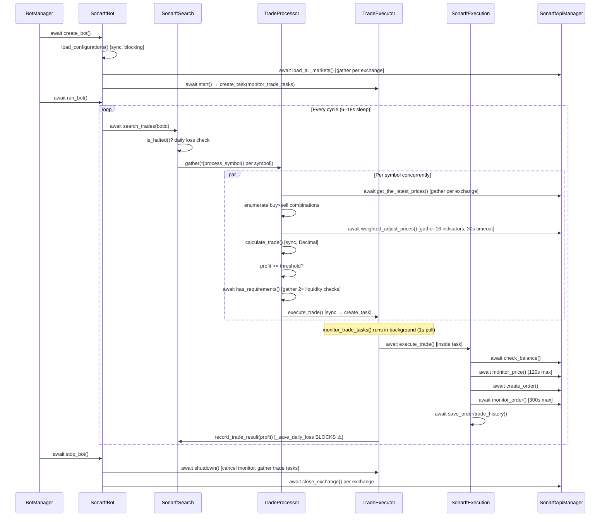

# SonarFT Bot — Async Design & Concurrency Review

**Prompt:** 02-BOT-ASYNC  
**Reviewer role:** Senior Python engineer / async systems architect  
**Date:** July 2025  
**Status:** Complete  
**Prerequisite:** [01-BOT-ARCH](../architecture/bot-overview.md)

---

## 1. Async/Await Correctness

Every async function is reviewed below. Risk levels: None / Low / Medium / High / Critical.

### `sonarft_bot.py` — `SonarftBot`

| Method | What it does | Awaited calls | Blocking ops | Risk |
|---|---|---|---|---|
| `create_bot()` | Loads config, wires modules, reconciles orders | `asyncio.to_thread`, `initialize_modules()`, `load_all_markets()`, `_reconcile_open_orders()` | `_write_botid_file` wrapped in `to_thread` ✅ | Low |
| `run_bot()` | Main trading loop with circuit breaker | `search_trades()`, `asyncio.wait_for(shield(...))` | None | Low |
| `stop_bot()` | Graceful shutdown — signals stop, awaits tasks, closes exchanges | `executor.shutdown()`, `close_exchange()` | None | Low |
| `pause_bot()` | Pauses loop, awaits monitor task cancellation | `monitor_task` cancel + await | None | Low |
| `initialize_modules()` | Wires all modules, starts search background tasks | `sonarft_search.start()` | None | None |
| `_reconcile_open_orders()` | Cancels stale open orders at startup | `call_api_method()`, `cancel_order()` | None | Low |
| `_send_alert()` | POSTs alert to webhook | `asyncio.to_thread(urllib.request.urlopen, req)` | `urlopen` wrapped in `to_thread` ✅ | Low |

**Finding B-01 (Low):** `_write_botid_file` is correctly offloaded via `asyncio.to_thread`. However, `load_configurations()` calls `open()` synchronously inside `create_bot()` — this is a startup-only call so the impact is minimal, but it is a blocking file read on the event loop.

---

### `sonarft_manager.py` — `BotManager`

| Method | What it does | Awaited calls | Blocking ops | Risk |
|---|---|---|---|---|
| `create_bot()` | Creates and registers a bot | `sonarft.create_bot()`, `add_bot_instance()` | None | None |
| `run_bot()` | Runs a registered bot | `get_bot_instance()`, `sonarft.run_bot()` | None | None |
| `remove_bot()` | Removes and stops a bot | `get_bot_instance()`, `remove_bot_instance()` | None | None |
| `pause_bot()` | Pauses a running bot | `get_bot_instance()`, `sonarft.pause_bot()` | None | None |
| `resume_bot()` | Resets stop event and restarts run loop | `get_bot_instance()`, `sonarft.run_bot()` | None | None |
| `reload_parameters()` | Hot-reloads parameters into all client bots | `bot.apply_parameters()` (sync) under lock | None | Medium |
| `add_bot_instance()` | Adds bot to registry under lock | `async with self._lock` | None | None |
| `remove_bot_instance()` | Removes bot from registry, calls stop outside lock | `bot.stop_bot()` outside lock ✅ | None | None |

**Finding B-02 (Medium):** `reload_parameters()` acquires `self._lock` and calls `bot.apply_parameters()` synchronously inside the lock. `apply_parameters()` is a pure in-memory operation so it does not block I/O, but it does call `self._validate_parameters()` which could raise. If it raises, the lock is released correctly (context manager), but the partial application of parameters to some bots and not others is not rolled back at the manager level.

---

### `sonarft_search.py` — `SonarftSearch`

| Method | What it does | Awaited calls | Blocking ops | Risk |
|---|---|---|---|---|
| `start()` | Starts background tasks | `trade_processor.start()` | None | None |
| `search_trades()` | Gathers per-symbol futures | `asyncio.gather(*futures)` | None | None |
| `record_trade_result()` | Accumulates daily loss | `_save_daily_loss()` (sync) | `sqlite3.connect()` on event loop ⚠️ | High |
| `_check_daily_reset()` | Resets daily loss counter | `_save_daily_loss()` (sync) | `sqlite3.connect()` on event loop ⚠️ | High |

**Finding B-03 (High):** `_save_daily_loss()` and `_load_daily_loss()` are **synchronous** functions that call `sqlite3.connect()` directly. They are called from async context (`record_trade_result()`, `set_botid()`) **without** `asyncio.to_thread`. This blocks the event loop on every trade result and on bot startup. Under high trade frequency this will cause measurable latency spikes.

---

### `trade_processor.py` — `TradeProcessor`

| Method | What it does | Awaited calls | Blocking ops | Risk |
|---|---|---|---|---|
| `start()` | Starts executor background task | `trade_executor.start()` | None | None |
| `process_symbol()` | Fetches prices, enumerates combinations | `get_the_latest_prices()`, `asyncio.gather(*futures)` | None | None |
| `process_trade_combination()` | Adjusts prices, calculates profit, dispatches | `weighted_adjust_prices()`, `has_requirements_for_success_carrying_out()` | None | Low |

**Finding B-04 (Low):** `self.trade_executor.execute_trade(botid, trade_data)` is called **without `await`** — this is intentional (fire-and-forget via `asyncio.create_task` inside `TradeExecutor.execute_trade()`). The method is synchronous and creates the task internally. This is correct but the naming is misleading — a sync method named `execute_trade` that creates an async task is easy to misread.

---

### `trade_executor.py` — `TradeExecutor`

| Method | What it does | Awaited calls | Blocking ops | Risk |
|---|---|---|---|---|
| `start()` | Creates monitor background task | `asyncio.create_task(monitor_trade_tasks())` | None | None |
| `execute_trade()` | Creates a trade task (sync, fire-and-forget) | None — creates task | None | Low |
| `monitor_trade_tasks()` | Polls done tasks, logs results, updates P&L | `asyncio.sleep(1)` | None | Medium |
| `shutdown()` | Cancels monitor + awaits all trade tasks | `monitor_task.cancel()`, `asyncio.gather(*trade_tasks)` | None | Low |

**Finding B-05 (Medium):** `monitor_trade_tasks()` polls with `asyncio.sleep(1)` — a 1-second polling interval means trade results are acknowledged up to 1 second late. This is acceptable for logging/P&L tracking but means the daily loss limit check (`record_trade_result`) is also delayed by up to 1 second after a loss.

**Finding B-06 (Low):** `self.trade_tasks` is a plain `list` mutated from both `execute_trade()` (append) and `monitor_trade_tasks()` (filter). Both run in the same event loop thread so there is no true race condition, but the list is rebuilt via list comprehension inside the monitor loop — if `execute_trade()` appends during the comprehension, the new task is included in the next iteration. This is safe in CPython's single-threaded event loop but worth documenting.

---

### `sonarft_prices.py` — `SonarftPrices`

| Method | What it does | Awaited calls | Blocking ops | Risk |
|---|---|---|---|---|
| `weighted_adjust_prices()` | Fetches 16 indicators concurrently, blends prices | `asyncio.wait_for(asyncio.gather(...), timeout=30.0)` | None | Medium |
| `dynamic_volatility_adjustment()` | Fetches MACD + RSI for volatility scaling | `get_macd()`, `get_rsi()` | None | Low |
| `get_the_latest_prices()` | Fetches latest prices across exchanges | `get_latest_prices()` | None | None |
| `get_latest_prices()` | Delegates to api_manager | `api_manager.get_latest_prices()` | None | None |

**Finding B-07 (Medium):** `weighted_adjust_prices()` wraps all 16 indicator fetches in a single `asyncio.wait_for(..., timeout=30.0)`. If any one indicator is slow, all 16 are cancelled together. There is no per-indicator timeout or partial result fallback — a single slow exchange call causes the entire price adjustment to return `(0, 0, {})` and the trade opportunity is skipped. This is safe but potentially over-conservative.

**Finding B-08 (Low):** `dynamic_volatility_adjustment()` calls `get_macd()` and `get_rsi()` sequentially with `await` rather than concurrently with `asyncio.gather`. These are independent calls to the same exchange — gathering them would halve the latency of this method.

---

### `sonarft_indicators.py` — `SonarftIndicators`

| Method | Blocking ops | Risk |
|---|---|---|
| All `get_*` methods | None — all delegate to `api_manager` | None |
| `get_rsi()`, `get_macd()`, `get_stoch_rsi()`, `get_market_direction()` | pandas-ta computation on `pd.Series` — synchronous CPU work | Low |
| `get_24h_high()`, `get_24h_low()` | Fetches 1440 candles — large payload | Low |

**Finding B-09 (Low):** pandas-ta indicator calculations (`pta.rsi()`, `pta.macd()`, `pta.stochrsi()`) are synchronous CPU operations executed directly on the event loop. For typical period lengths (14–26 candles) this is negligible. For `get_24h_high/low()` with 1440 candles, the numpy array operation is still fast but the 1440-candle OHLCV fetch is the real cost.

---

### `sonarft_execution.py` — `SonarftExecution`

| Method | What it does | Awaited calls | Blocking ops | Risk |
|---|---|---|---|---|
| `execute_trade()` | Entry point — size/rate checks, dispatches | `_execute_single_trade()` | None | Low |
| `_execute_single_trade()` | Determines position, places orders, saves history | `execute_long/short_trade()`, `handle_trade_results()`, `save_order/trade_history()` | None | Low |
| `execute_long_trade()` | Places buy then sell | `check_balance()`, `create_order()`, `_cancel_order_with_retry()` | None | Low |
| `execute_short_trade()` | Places sell then buy | Same as above | None | Low |
| `create_order()` | Validates, monitors price, places order | `monitor_price()`, `execute_order()` | None | Low |
| `monitor_price()` | Polls last price until condition met | `asyncio.sleep(3)`, `get_last_price()` | None | Low |
| `monitor_order()` | Polls order status until filled/cancelled/timeout | `asyncio.sleep(1)`, `watch_orders()` | None | Low |
| `_cancel_order_with_retry()` | Cancels with exponential backoff | `cancel_order()`, `asyncio.sleep()` | None | Low |
| `check_balance()` | Checks exchange balance | `get_balance()` | None | None |

**Finding B-10 (Medium):** `monitor_price()` has a `max_wait_seconds=120` polling loop with `asyncio.sleep(3)`. During this 120-second window, the trade task is alive and holding a reference to the exchange connection. If `stop_bot()` is called, `executor.shutdown()` cancels all trade tasks — `CancelledError` will propagate into `monitor_price()` at the next `await asyncio.sleep(3)`. This is handled correctly by the `try/except Exception` in `create_order()` — but `CancelledError` is a `BaseException`, not `Exception`, so it will **not** be caught and will propagate up correctly. ✅ This is actually correct behavior.

**Finding B-11 (Medium):** `monitor_order()` polls `watch_orders()` every 1 second for up to 300 seconds (5 minutes). For ccxtpro (WebSocket), `watch_orders` is a streaming call that may block until a new order update arrives rather than returning immediately. This means the 1-second `asyncio.sleep(1)` may not be the actual polling interval — the effective interval is `max(1s, time_to_next_ws_message)`. Under low activity this could mean the monitor loop stalls waiting for a WebSocket message.

---

### `sonarft_validators.py` — `SonarftValidators`

| Method | Blocking ops | Risk |
|---|---|---|
| `deeper_verify_liquidity()` | None | None |
| `verify_spread_threshold()` | Calls `get_trade_spread_threshold()` which calls `get_history()` twice + `get_trade_dynamic_spread_threshold_avg()` | Low |
| `check_slippage()` | Calls `get_trade_history()` — exchange REST call | Low |

**Finding B-12 (Low):** `verify_spread_threshold()` makes 4 async calls sequentially inside it (2× `get_history`, 2× `get_order_book` inside `get_trade_dynamic_spread_threshold_avg`). The two `get_history` calls are already gathered in `get_trade_spread_threshold()` ✅. The two `get_order_book` calls inside `get_trade_dynamic_spread_threshold_avg` are also gathered ✅. No issue.

---

### `sonarft_api_manager.py` — `SonarftApiManager`

| Method | Blocking ops | Risk |
|---|---|---|
| `call_api_method()` | ccxt (REST): `loop.run_in_executor(None, lambda: method_call(...))` ✅ | None |
| `call_api_method()` | ccxtpro (WS): direct `await method_call(...)` ✅ | None |
| `load_markets()` | `asyncio.wait_for(exchange.load_markets(), timeout=30.0)` ✅ | None |
| `get_ohlcv_history()` | Cache check is synchronous dict lookup — fine | None |

**Finding B-13 (Low):** The OHLCV cache, order book cache, and ticker cache are plain `dict` objects mutated from async context. Under single-bot operation this is safe. Under multi-bot operation where multiple `SonarftBot` instances share the same `SonarftApiManager` instance — **they do not**: each bot creates its own `SonarftApiManager` in `create_bot()`. So cache mutation is per-bot and safe. ✅

---

### `sonarft_helpers.py` — `SonarftHelpers`

| Method | Blocking ops | Risk |
|---|---|---|
| `save_order_data()` | `asyncio.to_thread(self._db_insert, ...)` ✅ | None |
| `save_trade_data()` | `asyncio.to_thread(self._db_insert, ...)` ✅ | None |
| `get_orders()` / `get_trades()` | `asyncio.to_thread(self._db_query, ...)` ✅ | None |
| `_init_db()` | Called synchronously in `__init__` — blocks event loop once at startup | Low |

**Finding B-14 (Low):** `_init_db()` is called synchronously in `__init__`. Since `SonarftHelpers` is constructed inside `initialize_modules()` which is `await`ed, the `__init__` runs on the event loop thread. The SQLite schema creation is a fast one-time operation, but it is technically a blocking call. Wrapping in `asyncio.to_thread` at construction time is not straightforward — acceptable as-is given it's startup-only.


---

## 2. Task Management Analysis

### Task creation inventory

| Task | Created in | Method | Type | Cleanup |
|---|---|---|---|---|
| `monitor_trade_tasks` | `TradeExecutor.start()` | `asyncio.create_task()` | Long-running background loop | Cancelled in `TradeExecutor.shutdown()` ✅ |
| Per-trade execution task | `TradeExecutor.execute_trade()` | `asyncio.create_task()` | Short-lived per-trade | Tracked in `self.trade_tasks`, awaited in `shutdown()` ✅ |
| Per-symbol search future | `SonarftSearch.search_trades()` | `asyncio.gather(*futures)` | Short-lived per-cycle | Awaited inline ✅ |
| Per-exchange price fetch | `SonarftApiManager.get_latest_prices()` | `asyncio.gather(*[_fetch_exchange(...)])` | Short-lived | Awaited inline ✅ |
| Indicator gather | `SonarftPrices.weighted_adjust_prices()` | `asyncio.wait_for(asyncio.gather(...))` | Short-lived | Awaited with timeout ✅ |
| Dual liquidity check | `TradeValidator.has_requirements_for_success_carrying_out()` | `asyncio.gather(...)` | Short-lived | Awaited inline ✅ |
| Dual history fetch | `SonarftValidators.get_trade_spread_threshold()` | `asyncio.gather(...)` | Short-lived | Awaited inline ✅ |
| Market load | `SonarftApiManager.load_all_markets()` | `asyncio.gather(...)` | Startup one-shot | Awaited inline ✅ |

### Task cleanup on shutdown

The shutdown sequence in `SonarftBot.stop_bot()` is:

```
1. _stop_event.set()           — signals run_bot() loop to exit
2. executor.shutdown()         — cancels monitor_task, awaits all trade_tasks
3. close_exchange() for each   — closes ccxt/ccxtpro connections
```

**Finding B-15 (Medium):** `executor.shutdown()` cancels all in-flight trade tasks with `task.cancel()` then `asyncio.gather(*trade_tasks, return_exceptions=True)`. This is correct. However, if a trade task is inside `execute_long_trade()` between the buy order being placed and the sell order being placed, cancellation will leave an **open buy position with no corresponding sell**. The `_cancel_order_with_retry()` call that guards against this is inside `execute_long_trade()` — but if the task is cancelled at the `await create_order(sell...)` line, the cancellation propagates before the cancel-order logic runs.

This is a known hard problem in async trading systems. The current code does not have a "position reconciliation on restart" mechanism beyond `_reconcile_open_orders()` which only cancels open orders, not open positions.

**Severity: Medium** — only affects live mode; simulation mode is unaffected.

### Dangling tasks

**Finding B-16 (Low):** `asyncio.create_task()` in `TradeExecutor.execute_trade()` attaches `task.botid` as a dynamic attribute. If the task raises an unhandled exception before `monitor_trade_tasks()` polls it, the exception is stored in the task object and retrieved via `task.result()` in the monitor loop. This is correct. However, if `monitor_trade_tasks()` itself is cancelled before processing a done task, that task's exception is silently lost. The `shutdown()` method cancels the monitor first, then gathers trade tasks — so exceptions from trade tasks cancelled during shutdown are caught by `return_exceptions=True`. ✅

### Long-running loops

| Loop | Location | Yields control? | Exit condition |
|---|---|---|---|
| `run_bot()` while loop | `sonarft_bot.py` | ✅ `asyncio.wait_for(shield(...))` | `_stop_event.is_set()` |
| `monitor_trade_tasks()` while loop | `trade_executor.py` | ✅ `asyncio.sleep(1)` | `asyncio.CancelledError` |
| `monitor_price()` while loop | `sonarft_execution.py` | ✅ `asyncio.sleep(3)` | deadline or condition met |
| `monitor_order()` while loop | `sonarft_execution.py` | ✅ `asyncio.sleep(1)` | deadline, filled, or cancelled |

All long-running loops yield control at every iteration. ✅

### CancelledError handling

**Finding B-17 (Low):** `monitor_trade_tasks()` catches `asyncio.CancelledError` at the outer level and logs "monitor_trade_tasks cancelled — exiting". The inner `except Exception` for individual task results does not catch `CancelledError` (which is `BaseException`) — cancelled tasks are handled by the separate `except asyncio.CancelledError` branch. ✅

**Finding B-18 (Low):** `run_bot()` uses `asyncio.shield(self._stop_event.wait())` inside `asyncio.wait_for()`. This is the correct pattern to allow the stop event to be awaited without cancelling it when the timeout fires. ✅

---

## 3. Concurrency Synchronization

### Shared mutable state inventory

| State | Owner | Shared across | Protected by | Risk |
|---|---|---|---|---|
| `_bots` dict | `BotManager` | All API requests + WebSocket handlers | `asyncio.Lock` ✅ | None |
| `_clients` dict | `BotManager` | Same as above | `asyncio.Lock` ✅ | None |
| `trade_tasks` list | `TradeExecutor` (per-bot) | `execute_trade()` (append) + `monitor_trade_tasks()` (filter) | Single event loop thread | None |
| `_order_timestamps` list | `SonarftExecution` (per-bot) | `execute_trade()` rate limiter | Single event loop thread | None |
| `daily_loss_accumulated` float | `SonarftSearch` (per-bot) | `record_trade_result()` + `is_halted()` | Single event loop thread | None |
| `previous_spread` dict | `SonarftIndicators` (per-bot) | `market_movement()` — called concurrently per symbol | No lock ⚠️ | Medium |
| `_indicator_cache` dict | `SonarftIndicators` (per-bot) | All `get_*` methods — called concurrently | No lock | Low |
| `_ohlcv_cache` dict | `SonarftApiManager` (per-bot) | All concurrent indicator fetches | No lock | Low |
| `_order_book_cache` dict | `SonarftApiManager` (per-bot) | All concurrent order book fetches | No lock | Low |
| `_ticker_cache` dict | `SonarftApiManager` (per-bot) | All concurrent ticker fetches | No lock | Low |
| SQLite `sonarft.db` | `SonarftHelpers` + `SonarftSearch` | All bots (shared file) | WAL mode + `_db_lock` per instance | Low |

### Lock usage analysis

**`BotManager._lock` (asyncio.Lock)** — correctly protects `_bots` and `_clients` for all read/write operations. `stop_bot()` is correctly called outside the lock to avoid holding it during network I/O. ✅

**`SonarftHelpers._db_lock` (asyncio.Lock)** — protects SQLite writes (`save_order_data`, `save_trade_data`). Reads (`get_orders`, `get_trades`) bypass the lock, relying on SQLite WAL mode for concurrent read safety. ✅

### Race condition findings

**Finding B-19 (Medium) — `previous_spread` dict in `SonarftIndicators`:**

`market_movement()` reads and writes `self.previous_spread[spread_key]` without any lock. This method is called concurrently for multiple symbols inside `weighted_adjust_prices()` via `asyncio.gather`. In CPython's single-threaded event loop, dict reads and writes are atomic at the bytecode level, so there is no data corruption risk. However, the read-modify-write sequence:

```python
previous = self.previous_spread.get(spread_key, spread)
self.previous_spread[spread_key] = spread
```

...can interleave between two concurrent calls for the **same** `spread_key` (same symbol on same exchange). The second call may read the value written by the first call rather than the value from the previous cycle. This produces an incorrect `spread_rate` calculation for that symbol on that iteration. The impact is a spurious "fast"/"slow" market movement signal — a minor accuracy issue, not a safety issue.

**Finding B-20 (Low) — Cache dicts without locks:**

`_indicator_cache`, `_ohlcv_cache`, `_order_book_cache`, and `_ticker_cache` are plain dicts mutated from concurrent async tasks. In CPython, individual dict `__setitem__` and `__getitem__` operations are GIL-protected and effectively atomic. The LRU eviction pattern (`del self._ohlcv_cache[oldest_key]`) is also a single dict operation. No corruption risk in CPython. However, this is an implementation detail — not guaranteed by the language spec. Documented as Low.

### Deadlock analysis

No deadlock risk identified. Reasons:

1. `BotManager._lock` is the only `asyncio.Lock` used for cross-request state. It is never held while awaiting another lock.
2. `SonarftHelpers._db_lock` is only held during `asyncio.to_thread` calls — it is released as soon as the thread completes.
3. No nested lock acquisition exists anywhere in the codebase.

### SQLite concurrency

Multiple `SonarftBot` instances (different bots for different clients) share the same `sonarft.db` file. Each bot has its own `SonarftHelpers` instance with its own `_db_lock`. The shared SQLite file is protected by WAL mode which allows concurrent reads and serialises writes at the database level. This is correct and safe. ✅

**Finding B-21 (Low):** `_save_daily_loss()` in `sonarft_search.py` opens its own `sqlite3.connect(_DB_PATH)` connection independently of `SonarftHelpers`. This means two separate connection pools write to the same database. WAL mode handles this correctly, but it creates two separate connection management paths for the same file — a maintenance concern.

---

## 4. Async/Await Error Handling

### Exception propagation in tasks

**`run_bot()` circuit breaker** — catches `Exception` from `search_trades()`, increments a failure counter, applies exponential backoff, and trips a circuit breaker after `SONARFT_MAX_FAILURES` (default 5) consecutive failures. Sends an alert via `_send_alert()`. ✅ Well-designed.

**`search_trades()` gather** — uses `return_exceptions=True` in `asyncio.gather(*futures)`. Exceptions from individual symbol processing are caught and logged. ✅

**`monitor_trade_tasks()` task result handling** — calls `task.result()` inside `try/except Exception` to catch task exceptions. `asyncio.CancelledError` is caught separately. ✅

**Finding B-22 (Medium) — `execute_trade()` exception swallowing:**

`SonarftExecution.execute_trade()` wraps its entire body in `try/except Exception` and returns `{"success": False, "profit": 0.0}` on any error. This means exceptions from `_execute_single_trade()` — including exchange API errors, authentication failures, and network errors — are logged but not re-raised. The trade task completes "successfully" (no exception) with a failure result. The `monitor_trade_tasks()` loop sees a dict result, not an exception, so the circuit breaker in `run_bot()` is **not triggered** by execution failures. Only `search_trades()` exceptions trip the circuit breaker — execution failures are silently absorbed.

**Finding B-23 (Low) — `_send_alert()` exception swallowing:**

`_send_alert()` catches all exceptions from the webhook POST and logs them. This is correct — alert delivery failure should not crash the bot. ✅

### Timeout handling

| Location | Timeout | What happens on timeout |
|---|---|---|
| `call_api_method()` | 30s via `asyncio.wait_for` | Logs error, returns `None` |
| `load_markets()` | 30s via `asyncio.wait_for` | Logs error, returns `{}` |
| `weighted_adjust_prices()` | 30s via `asyncio.wait_for` | Logs warning, returns `(0, 0, {})` |
| `monitor_price()` | 120s deadline loop | Logs warning, returns `None` → order skipped |
| `monitor_order()` | 300s deadline loop | Logs warning, cancels order with retry |

**Finding B-24 (Low):** `call_api_method()` catches `asyncio.TimeoutError` and returns `None`. All callers must handle `None` returns. Most do — `get_order_book()`, `get_ohlcv_history()`, `get_latest_prices()` all check for `None` or empty results. However, `watch_orders()` in `sonarft_api_manager.py` does not check for `None` before returning, and `monitor_order()` checks `if not orders` which handles `None` correctly. ✅

### Connection loss handling

**Finding B-25 (Medium):** There is no explicit reconnection logic for ccxtpro WebSocket connections. If the WebSocket connection drops mid-session, `call_api_method()` will raise an exception which is caught and logged, returning `None`. The bot will continue cycling but all API calls will return `None` until the connection is re-established. ccxtpro handles reconnection internally for most exchanges, but this is exchange-dependent and not guaranteed.

The circuit breaker in `run_bot()` will eventually trip after 5 consecutive `search_trades()` failures caused by persistent `None` returns from the API layer. This is the correct fallback but the 5-failure threshold means up to 5 failed cycles before the bot halts.

### Recovery from failed async operations

- **API call failure** → returns `None` → caller skips the trade opportunity → next cycle retries. ✅
- **Price adjustment timeout** → returns `(0, 0, {})` → `TradeProcessor` skips combination. ✅
- **Liquidity check failure** → returns `False` → trade not dispatched. ✅
- **Order placement failure** → returns `None` → `execute_long/short_trade()` attempts cancel of first leg. ✅
- **Cancel failure** → `_cancel_order_with_retry()` retries 3× with backoff, alerts on final failure. ✅
- **Monitor order timeout** → cancels order, returns `(0, target_amount)` → trade marked as failed. ✅

---

## 5. Concurrency Risk Table

| ID | Location | Pattern | Risk | Severity | Remediation |
|---|---|---|---|---|---|
| B-03 | `sonarft_search.py` — `record_trade_result()`, `set_botid()` | `_save_daily_loss()` / `_load_daily_loss()` call `sqlite3.connect()` synchronously on event loop | Blocks event loop on every trade result | **High** | Wrap in `asyncio.to_thread()` or move to `SonarftHelpers` async API |
| B-15 | `trade_executor.py` — `shutdown()` | Task cancellation between buy and sell leg placement leaves open position | Unhedged position in live mode | **Medium** | Add position state flag; on `CancelledError` in `execute_long/short_trade()`, attempt cancel of first leg before re-raising |
| B-02 | `sonarft_manager.py` — `reload_parameters()` | Partial parameter application across bots if one raises `ValueError` | Inconsistent bot state | **Medium** | Collect all errors, apply all-or-nothing, or document partial-apply as acceptable |
| B-07 | `sonarft_prices.py` — `weighted_adjust_prices()` | Single 30s timeout wraps all 16 indicator fetches — one slow call cancels all | Over-conservative trade skipping | **Medium** | Add per-indicator timeout; use partial results with fallback defaults |
| B-11 | `sonarft_execution.py` — `monitor_order()` | `watch_orders()` (ccxtpro) may block until next WS message, making 1s sleep ineffective | Order monitoring latency under low activity | **Medium** | Use `asyncio.wait_for(watch_orders(...), timeout=5.0)` per poll iteration |
| B-19 | `sonarft_indicators.py` — `market_movement()` | `previous_spread` read-modify-write without lock, called concurrently per symbol | Spurious market movement signal | **Medium** | Use per-symbol local variable; pass previous spread as parameter or use `asyncio.Lock` per key |
| B-22 | `sonarft_execution.py` — `execute_trade()` | All execution exceptions caught and returned as `{"success": False}` — circuit breaker not triggered | Execution failures invisible to circuit breaker | **Medium** | Distinguish retriable errors (network) from fatal errors (auth); re-raise fatal errors |
| B-25 | `sonarft_api_manager.py` — `call_api_method()` | No explicit WebSocket reconnection logic beyond ccxtpro internals | Silent degradation on WS disconnect | **Medium** | Add connection health check; log reconnection events; consider explicit reconnect on repeated `None` returns |
| B-01 | `sonarft_bot.py` — `create_bot()` | `load_configurations()` calls `open()` synchronously | Blocks event loop at startup | **Low** | Wrap config file reads in `asyncio.to_thread()` |
| B-04 | `trade_processor.py` — `process_trade_combination()` | Sync `execute_trade()` creates task — naming implies async | Readability / misuse risk | **Low** | Rename to `dispatch_trade()` or `schedule_trade()` |
| B-05 | `trade_executor.py` — `monitor_trade_tasks()` | 1s polling interval delays daily loss update | Loss limit enforcement lag | **Low** | Use `asyncio.Event` signalled by `execute_trade()` completion instead of polling |
| B-06 | `trade_executor.py` | `trade_tasks` list mutated from `execute_trade()` and `monitor_trade_tasks()` | Safe in CPython event loop but not spec-guaranteed | **Low** | Document explicitly; consider `asyncio.Queue` for task handoff |
| B-08 | `sonarft_prices.py` — `dynamic_volatility_adjustment()` | `get_macd()` and `get_rsi()` awaited sequentially | Unnecessary latency | **Low** | Use `asyncio.gather(get_macd(...), get_rsi(...))` |
| B-09 | `sonarft_indicators.py` | pandas-ta CPU computation on event loop | Negligible for typical periods | **Low** | Acceptable as-is; wrap in `to_thread` only if profiling shows impact |
| B-10 | `sonarft_execution.py` — `monitor_price()` | `CancelledError` propagates through `try/except Exception` correctly | Correct behavior, documented for clarity | **Low** | No action needed ✅ |
| B-13 | `sonarft_api_manager.py` | Cache dicts mutated concurrently — safe in CPython | Not spec-guaranteed | **Low** | Document; consider `dict` replacement with thread-safe alternative if porting |
| B-14 | `sonarft_helpers.py` — `__init__` | `_init_db()` blocks event loop once at startup | Startup-only, fast | **Low** | Acceptable as-is |
| B-20 | Multiple caches | Dict LRU eviction without lock | Safe in CPython | **Low** | Document |
| B-21 | `sonarft_search.py` | Separate `sqlite3.connect()` path for daily loss, independent of `SonarftHelpers` | Two connection pools to same DB | **Low** | Route daily loss persistence through `SonarftHelpers` async API |
| B-24 | `sonarft_api_manager.py` — `call_api_method()` | `None` return on timeout — callers must handle | Handled correctly throughout | **Low** | No action needed ✅ |

---

## 6. Task Lifecycle Summary

### Background tasks (long-lived)

**`monitor_trade_tasks` task**

| Phase | Action |
|---|---|
| Created | `TradeExecutor.start()` → `asyncio.create_task(monitor_trade_tasks())` |
| Running | Polls `trade_tasks` list every 1s; processes done tasks; logs results; updates session P&L |
| Cancelled | `TradeExecutor.shutdown()` → `monitor_task.cancel()` → `await monitor_task` |
| Edge case | If cancelled while iterating done tasks, remaining done-task results are lost (acceptable) |

### Per-trade tasks (short-lived)

**Trade execution task**

| Phase | Action |
|---|---|
| Created | `TradeExecutor.execute_trade()` → `asyncio.create_task(sonarft_execution.execute_trade(...))` |
| Running | Balance check → price monitor → order placement → order monitor → history save |
| Completed | Result dict `{"success": bool, "profit": float}` stored in task; picked up by monitor loop |
| Cancelled | `TradeExecutor.shutdown()` → `task.cancel()` → `asyncio.gather(*trade_tasks, return_exceptions=True)` |
| Edge case | Cancellation between buy and sell leg may leave open position (B-15) |

### Inline gather futures (ephemeral)

These are not tracked tasks — they are awaited inline and complete before the calling method returns:

- `search_trades()` → per-symbol `process_symbol()` futures
- `weighted_adjust_prices()` → 16 indicator fetch coroutines
- `get_latest_prices()` → per-exchange `_fetch_exchange()` coroutines
- `has_requirements_for_success_carrying_out()` → 2× `deeper_verify_liquidity()` coroutines
- `load_all_markets()` → per-exchange `load_markets()` coroutines

All are awaited with `asyncio.gather` and complete or raise before the caller proceeds. ✅

---

## 7. Concurrency Flow Diagram



---

## 8. Recommendations

### Critical / High priority

**R-01 — Fix blocking SQLite calls in `sonarft_search.py` (B-03)**

`_save_daily_loss()` and `_load_daily_loss()` block the event loop. Route them through `SonarftHelpers` or wrap directly:

```python
# sonarft_search.py — record_trade_result()
async def record_trade_result(self, profit: float):
    self._check_daily_reset()
    if profit < 0:
        self.daily_loss_accumulated += abs(profit)
        if self._botid:
            await asyncio.to_thread(
                _save_daily_loss, self._botid, self._loss_reset_date, self.daily_loss_accumulated
            )
```

Note: `set_botid()` is called from sync context — `_load_daily_loss()` there must remain sync or be deferred to an async `initialize()` call.

---

**R-02 — Guard against unhedged position on task cancellation (B-15)**

Wrap the inter-leg window in a shield or use a non-cancellable context:

```python
# In execute_long_trade(), after buy order placed:
try:
    result_sell_order = await asyncio.shield(
        self.create_order(sell_exchange_id, ...)
    )
except asyncio.CancelledError:
    # Buy leg placed, sell leg not — attempt cancel of buy
    await self._cancel_order_with_retry(buy_exchange_id, buy_order_id, base, quote)
    raise
```

---

### Medium priority

**R-03 — Per-indicator timeout in `weighted_adjust_prices()` (B-07)**

Replace the single outer timeout with per-indicator timeouts using `asyncio.wait_for` on each coroutine, or split into two gather phases (fast indicators vs. slow ones) with independent timeouts.

**R-04 — Fix `monitor_order()` WS blocking (B-11)**

```python
# Add per-poll timeout to prevent indefinite blocking on watch_orders
orders = await asyncio.wait_for(
    self.api_manager.watch_orders(exchange_id, base, quote),
    timeout=5.0
)
```

**R-05 — Fix `previous_spread` race in `market_movement()` (B-19)**

Use a per-call local variable for the previous spread, passing it in or storing it keyed by `(exchange_id, base, quote)` with a copy taken before the gather:

```python
# Take snapshot before concurrent calls
spread_key = f"{exchange_id}:{base}/{quote}"
previous = self.previous_spread.get(spread_key, None)
# ... compute spread ...
self.previous_spread[spread_key] = spread
spread_rate = (spread - previous) / previous if previous is not None and previous != 0 else 0
```

**R-06 — Distinguish fatal vs. retriable execution errors (B-22)**

```python
except ccxt.AuthenticationError:
    raise  # fatal — propagate to circuit breaker
except ccxt.NetworkError as e:
    self.logger.error(f"Retriable network error: {e}")
    return {"success": False, "profit": 0.0}
except Exception as e:
    self.logger.error(f"Error executing trade: {e}")
    return {"success": False, "profit": 0.0}
```

**R-07 — Gather MACD + RSI in `dynamic_volatility_adjustment()` (B-08)**

```python
macd_result, rsi = await asyncio.gather(
    self.sonarft_indicators.get_macd(exchange, base, quote) if self._indicator_active('macd') else asyncio.sleep(0, result=None),
    self.sonarft_indicators.get_rsi(exchange, base, quote) if self._indicator_active('rsi') else asyncio.sleep(0, result=None),
)
```

---

### Low priority

**R-08 — Rename `TradeExecutor.execute_trade()` to `dispatch_trade()` (B-04)** — clarifies that it is a sync fire-and-forget dispatcher, not an async executor.

**R-09 — Route daily loss SQLite writes through `SonarftHelpers` (B-21)** — eliminates the second independent connection pool to `sonarft.db`.

**R-10 — Document CPython dict atomicity assumptions (B-20, B-13)** — add a comment in `sonarft_api_manager.py` and `sonarft_indicators.py` noting that cache mutation safety relies on CPython's GIL and single-threaded event loop.

---

## Summary

| Category | Findings | Critical | High | Medium | Low |
|---|---|---|---|---|---|
| Blocking calls on event loop | 3 | 0 | 1 | 0 | 2 |
| Task lifecycle / cancellation | 5 | 0 | 0 | 2 | 3 |
| Race conditions / shared state | 4 | 0 | 0 | 2 | 2 |
| Error handling gaps | 4 | 0 | 0 | 3 | 1 |
| Timeout / connection handling | 4 | 0 | 0 | 2 | 2 |
| **Total** | **20** | **0** | **1** | **9** | **10** |

**Overall async quality: 7.5/10.** The architecture is fundamentally sound — all I/O is async, tasks are tracked and cleaned up, locks are used correctly, and the circuit breaker provides resilience. The primary gaps are the blocking SQLite calls in `sonarft_search.py` (High), the unhedged position risk on task cancellation (Medium), and the single-timeout wrapping of 16 indicator fetches (Medium).
