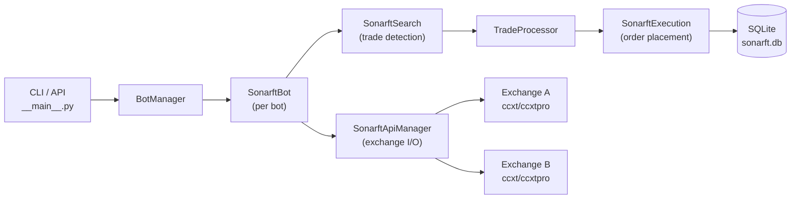

# SonarFT Bot — Setup, Execution & Operations Guide

**Prompt:** 13-BOT-SETUP  
**Reviewer role:** Senior DevOps engineer / trading operations specialist  
**Date:** July 2025  
**Status:** Complete  
**Prerequisites:** [07-BOT-CONFIG](bot-config.md), [11-BOT-FINAL](../review/final-audit-report.md), [12-BOT-ROADMAP](../roadmap/implementation-roadmap.md)

---

## 1. System Overview

### What is SonarFT?

SonarFT (System Oscillator for Navigation and Ranging in Financial Trade) is an async-first, multi-exchange cryptocurrency trading bot. It monitors market oscillations across exchanges, identifies arbitrage and market-making opportunities, and executes limit orders when profitability thresholds are met.

### Main capabilities

- **Cross-exchange arbitrage** — buys on the cheaper exchange, sells on the more expensive one
- **Market-making** — places bid/ask orders to capture the spread
- **Multi-symbol** — trades multiple base/quote pairs concurrently
- **Multi-bot** — multiple independent bot instances per server
- **Simulation mode** — full trade cycle with synthetic orders (no real funds)
- **Hot-reload** — update trading parameters without restarting

### Supported exchanges

Any exchange supported by ccxt (300+). Pre-configured with precision rules for: **Binance**, **OKX**, **Bitfinex**. Other exchanges work via live precision from market data.

### System architecture summary



### Typical execution workflow

```
1. Load config (config.json → parameters, exchanges, symbols, fees, indicators)
2. Initialise exchange connections (ccxtpro WebSocket or ccxt REST)
3. Load market data (precision rules, minimums)
4. Start trading loop:
   a. Fetch prices across exchanges (VWAP)
   b. Adjust prices using indicators (RSI, MACD, StochRSI, SMA)
   c. Calculate net profit after fees
   d. Validate liquidity and spread
   e. Place limit orders (or simulate)
   f. Monitor fills, handle partial fills
   g. Record trade history to SQLite
   h. Sleep 6–18 seconds, repeat
```

---

## 2. Prerequisites & Requirements

### Hardware requirements

| Resource | Minimum | Recommended |
|---|---|---|
| CPU | 1 core | 2+ cores |
| RAM | 512MB | 2GB+ (for multi-bot) |
| Storage | 1GB | 5GB (trade history) |
| Network | 10Mbps stable | 100Mbps low-latency |
| Uptime | — | 99.9% (VPS recommended for live) |

### Software requirements

| Dependency | Version | Notes |
|---|---|---|
| Python | 3.10+ | 3.11 recommended (matches Dockerfile) |
| pip | 23+ | `pip install --upgrade pip` |
| Docker | 20+ | Optional — for containerised deployment |
| Docker Compose | 2.0+ | Optional |

### Python packages

All declared in `requirements.txt`:
```
fastapi==0.135.3
uvicorn[standard]==0.44.0
pandas==3.0.2
pandas-ta==0.4.71b0
simple-websocket==1.1.0
ccxt==4.5.48
ccxt[pro]==4.5.48    ← add this (T-03)
pytest
pytest-asyncio
PyJWT[crypto]>=2.7.0
```

### Exchange API requirements

For **simulation mode**: No API keys required.  
For **paper trading**: Read-only API keys (market data only).  
For **live trading**: Full trading API keys with spot trading permissions.

### Verification commands

```bash
python --version          # Python 3.10+
pip --version             # pip 23+
docker --version          # Docker 20+ (optional)
python -c "import ccxt; print(ccxt.__version__)"   # 4.5.48
python -c "import ccxt.pro; print('ccxtpro OK')"   # must not raise
python -c "import pandas; print(pandas.__version__)"  # 3.0.2
```

---

## 3. Installation Guide

### Option A — Local Python installation (recommended for development)

```bash
# 1. Clone the repository
git clone <repository-url>
cd sonarft-monorepo

# 2. Create virtual environment
python -m venv .venv
source .venv/bin/activate          # Linux/macOS
# .venv\Scripts\activate           # Windows

# 3. Install bot dependencies
cd packages/bot
pip install --upgrade pip
pip install -r requirements.txt
pip install -e .                   # install sonarft-bot package

# 4. Verify installation
python -c "from sonarft_bot import SonarftBot; print('OK')"
python -m pytest tests/ -v --tb=short   # all tests should pass

# 5. Run in simulation mode
python -m sonarft_bot -c config_1
```

### Option B — Docker installation

```bash
# 1. Build the image
cd packages/bot
docker build -t sonarft-bot:latest .

# 2. Verify the image
docker run --rm sonarft-bot:latest python -c "from sonarft_bot import SonarftBot; print('OK')"

# 3. Run in simulation mode
docker run --rm \
  -v $(pwd)/sonarftdata:/app/sonarftdata \
  sonarft-bot:latest

# 4. Run with Docker Compose (from monorepo root)
cd ../..
make dev
```

### Option C — Via the API server (recommended for production)

The bot is typically managed through the FastAPI server in `packages/api`, which provides REST endpoints and WebSocket control. See the monorepo `README.md` for full API server setup.

```bash
# From monorepo root
make setup      # first-time setup
make dev-api    # start API server (manages bots via REST)
```

### Verifying a successful installation

```bash
cd packages/bot
python -m pytest tests/ -v

# Expected output:
# ==================== 165 passed in X.XXs ====================
```

---

## 4. Configuration Guide

### Configuration file structure

All configuration lives under `packages/bot/sonarftdata/`:

```
sonarftdata/
├── config.json              ← named config sets (start here)
├── config_parameters.json   ← trading parameters
├── config_exchanges.json    ← exchange lists
├── config_symbols.json      ← trading pairs
├── config_fees.json         ← fee rates per exchange
├── config_indicators.json   ← active indicators
├── config_markets.json      ← market type
├── config/                  ← per-client runtime overrides (API-managed)
├── bots/                    ← bot registry (runtime, do not edit)
└── history/                 ← SQLite trade history (runtime)
```

### Step 1 — Choose or create a config set

`config.json` maps named sets to their component files:

```json
{
    "config_1": [{
        "markets_pathname":    "sonarftdata/config_markets.json",
        "markets_setup":       1,
        "exchanges_pathname":  "sonarftdata/config_exchanges.json",
        "exchanges_setup":     1,
        "symbols_pathname":    "sonarftdata/config_symbols.json",
        "symbols_setup":       2,
        "indicators_pathname": "sonarftdata/config_indicators.json",
        "indicators_setup":    1,
        "parameters_pathname": "sonarftdata/config_parameters.json",
        "parameters_setup":    2,
        "fees_pathname":       "sonarftdata/config_fees.json",
        "fees_setup":          1
    }]
}
```

To create a new config, add a new key (e.g. `"config_3"`) pointing to your chosen setup numbers.

### Step 2 — Configure trading parameters

Edit `config_parameters.json`. Key parameters:

```json
{
    "parameters_1": [{
        "strategy":                    "arbitrage",
        "profit_percentage_threshold": 0.0001,
        "trade_amount":                0.01,
        "is_simulating_trade":         1,
        "max_daily_loss":              100.0,
        "max_trade_amount":            0.1,
        "max_orders_per_minute":       10,
        "spread_increase_factor":      1.00020,
        "spread_decrease_factor":      0.99980
    }]
}
```

| Parameter | Safe starting value | Description |
|---|---|---|
| `strategy` | `"arbitrage"` | `"arbitrage"` or `"market_making"` |
| `profit_percentage_threshold` | `0.0003` | Minimum net profit after fees (0.03%) |
| `trade_amount` | `0.001` | Order size in base currency (start small) |
| `is_simulating_trade` | `1` | **Always start with 1 (simulation)** |
| `max_daily_loss` | `50.0` | Daily loss halt in quote currency |
| `max_trade_amount` | `0.01` | Maximum single order size |
| `max_orders_per_minute` | `2` | Rate limit (start conservative) |

### Step 3 — Configure exchanges

Edit `config_exchanges.json`:

```json
{
    "exchanges_1": ["okx", "binance"]
}
```

Use ccxt exchange IDs (lowercase). Verify with: `python -c "import ccxt; print([e for e in dir(ccxt) if not e.startswith('_')][:10])"`

### Step 4 — Configure trading pairs

Edit `config_symbols.json`:

```json
{
    "symbols_1": [
        { "base": "BTC", "quotes": ["USDT"] },
        { "base": "ETH", "quotes": ["USDT"] }
    ]
}
```

### Step 5 — Configure fee rates

Edit `config_fees.json`. Verify rates against your exchange account tier:

```json
{
    "exchanges_fees_1": [
        { "exchange": "binance", "buy_fee": 0.001, "sell_fee": 0.001 },
        { "exchange": "okx",     "buy_fee": 0.0008, "sell_fee": 0.001 }
    ]
}
```

⚠️ **Fee accuracy is critical.** Incorrect fees cause the bot to execute unprofitable trades. Verify against your exchange account's actual fee tier.

### Step 6 — Configure environment variables

Create a `.env` file (never commit this):

```bash
# Exchange API keys (required for live trading only)
BINANCE_API_KEY=your_api_key_here
BINANCE_SECRET=your_secret_here
OKX_API_KEY=your_api_key_here
OKX_SECRET=your_secret_here
OKX_PASSWORD=your_passphrase_here

# Safety controls
# SONARFT_ALLOW_LIVE=true        ← ONLY set this for live trading

# Optional tuning
SONARFT_MAX_FAILURES=5
SONARFT_BACKOFF_BASE=30
SONARFT_CYCLE_SLEEP_MIN=6
SONARFT_CYCLE_SLEEP_MAX=18
SONARFT_MAX_CONCURRENT_TRADES=10
SONARFT_ALERT_WEBHOOK=https://hooks.slack.com/...
```

Load with: `source .env` or use `python-dotenv`.

---

## 5. Execution Guide

### Standard execution (simulation mode)

```bash
cd packages/bot
source .venv/bin/activate

# Default: config_1, ccxtpro (WebSocket)
python -m sonarft_bot

# Custom config
python -m sonarft_bot -c config_2

# REST mode (broader exchange compatibility)
python -m sonarft_bot -c config_1 -l ccxt
```

### Expected startup log output

```
INFO - ********
INFO - SonarFT
INFO - ********
INFO - Library: ccxtpro
INFO - Configuration: config_1
INFO - Parameters loaded: strategy: arbitrage, profit_percentage_threshold: 0.0001, ...
INFO - Symbols loaded: [{'base': 'ETH', 'quotes': ['USDT']}]
INFO - Exchanges loaded: ['okx', 'binance']
INFO - Initializing API Manager module...
INFO - Initializing API Manager module OK
INFO - No API keys found for exchange 'okx'. Set OKX_API_KEY and OKX_SECRET ...
INFO - Initializing Bot modules...
INFO - Initializing Helpers module OK
INFO - Initializing Validators module OK
INFO - Initializing Indicators module OK
INFO - Initializing Math module OK
INFO - Initializing Prices module OK
INFO - Initializing Execution module OK
INFO - Initializing Search module OK
INFO - Loading markets...
INFO - Markets loaded for okx: 847 symbols
INFO - Markets loaded for binance: 2341 symbols
INFO - Bot <uuid> has been created!
INFO - Bot <uuid> start running
INFO - Next trade for bot <uuid> in 12 secs...
```

### Via the API server (recommended for production)

```bash
# Start API server
make dev-api

# Create a bot via REST
curl -X POST http://localhost:8000/api/v1/clients/my-client/bots \
  -H "Content-Type: application/json"

# Run the bot
curl -X POST http://localhost:8000/api/v1/clients/my-client/bots/<botid>/run

# Stop the bot
curl -X POST http://localhost:8000/api/v1/clients/my-client/bots/<botid>/stop
```

### Docker execution

```bash
# Simulation mode (no API keys needed)
docker run --rm \
  -v $(pwd)/sonarftdata:/app/sonarftdata \
  sonarft-bot:latest

# Live mode (with API keys)
docker run --rm \
  -v $(pwd)/sonarftdata:/app/sonarftdata \
  -e BINANCE_API_KEY=xxx \
  -e BINANCE_SECRET=xxx \
  -e SONARFT_ALLOW_LIVE=true \
  sonarft-bot:latest python -m sonarft_bot -c config_live
```

---

## 6. Operational Modes Guide

---

### Mode 1 — Simulation Mode ✅ SAFE — Start here

**Purpose:** Validate strategy logic, indicator signals, and profitability calculations without any financial risk.

**How it works:**
- All order placement is synthetic — no real exchange orders are placed
- Simulated orders receive random IDs (`buy_123456`, `sell_789012`)
- Simulated fills are always 100% (no partial fills modelled)
- Simulated slippage: 0–0.1% random
- Balance checks are bypassed — no real funds required
- Trade history is recorded to SQLite exactly as in live mode

**Configuration:**
```json
"is_simulating_trade": 1
```

**No environment variables required.** API keys are optional (used for market data only if provided).

**Advantages:**
- Zero financial risk
- Full trade cycle exercised (indicators, validation, execution logic)
- Trade history accumulates for analysis
- Identical code path to live mode (only `execute_order()` differs)

**Limitations:**
- Always 100% fill — does not model partial fills or order rejection
- No real price impact — simulated slippage is random, not market-driven
- Balance constraints not enforced — may simulate trades that would fail in live mode

**Recommended use cases:**
- Initial setup and configuration validation
- Strategy parameter tuning
- Regression testing after code changes
- Demonstrating the system to stakeholders

**Evaluating simulation results:**
```bash
# Query trade history from SQLite
sqlite3 sonarftdata/history/sonarft.db \
  "SELECT timestamp, profit, profit_percentage FROM trades WHERE botid='<botid>' ORDER BY id DESC LIMIT 20;"
```

---

### Mode 2 — Paper Trading Mode ✅ SAFE — Use for validation

**Purpose:** Connect to live exchange APIs and process real market data, but place no real orders. Validates that indicators and price adjustments work correctly on live data.

**How it works:**
- `is_simulating_trade = 1` (simulation gate active — no real orders)
- Exchange API keys configured for market data access
- Real order books, OHLCV, and ticker data used for all calculations
- All other behaviour identical to simulation mode

**Configuration:**
```bash
# .env
BINANCE_API_KEY=your_read_only_key
BINANCE_SECRET=your_read_only_secret
# Do NOT set SONARFT_ALLOW_LIVE
```

```json
"is_simulating_trade": 1
```

**Risk profile:** Zero financial risk. Read-only API keys cannot place orders even if the simulation gate fails.

**Safe testing workflow:**
1. Run for at least 24 hours to capture different market conditions
2. Verify indicators produce sensible signals (RSI 0–100, MACD reasonable values)
3. Verify profit calculations are positive for executed simulated trades
4. Verify daily loss limit triggers correctly
5. Verify circuit breaker trips on simulated API failures

**Validation before moving to real trading:**
- [ ] At least 100 simulated trades recorded
- [ ] Profitable trade rate > 50% in simulation
- [ ] No unexpected crashes or circuit breaker trips
- [ ] Indicators warm up correctly (first 45 candles)
- [ ] Daily loss limit tested and confirmed working

---

### Mode 3 — Real Trading Mode ⚠️ FINANCIAL RISK — Read carefully

> **⚠️ WARNING: Real trading mode places actual orders on exchanges using real funds. Losses are real and irreversible. Only proceed after completing all simulation and paper trading validation.**

**How to enable:**

Real trading requires **two explicit actions**:

1. Set `is_simulating_trade: 0` in `config_parameters.json`
2. Set `SONARFT_ALLOW_LIVE=true` environment variable

Both must be present. Either alone is insufficient.

```bash
# .env — ONLY for live trading
BINANCE_API_KEY=your_live_trading_key
BINANCE_SECRET=your_live_trading_secret
SONARFT_ALLOW_LIVE=true              # ← explicit opt-in required
```

```json
"is_simulating_trade": 0
```

**⚠️ SAFETY RISKS:**

| Risk | Description | Mitigation |
|---|---|---|
| Accidental live trading | Misconfigured `is_simulating_trade=0` | `SONARFT_ALLOW_LIVE` guard (after T-01 fix) |
| Unhedged position | Buy fills, sell fails | Alert sent; manual intervention required |
| Stale fee rates | Exchange changes fees | Verify fees before each session |
| Slippage | Price moves during monitoring | Start with conservative `profit_percentage_threshold` |
| Exchange downtime | API unavailable | Circuit breaker halts bot |
| Network interruption | Lost order confirmation | `_reconcile_open_orders()` on restart |

**Recommended safeguards for first live session:**
- `trade_amount`: 0.001 (minimum viable)
- `max_daily_loss`: 10.0 (stop after $10 loss)
- `max_trade_amount`: 0.005 (hard position size cap)
- `max_orders_per_minute`: 1 (very conservative rate)
- `profit_percentage_threshold`: 0.0005 (0.05% — above typical slippage)
- Monitor manually for the first 2 hours
- Have exchange web interface open to verify orders

**Minimal safe starting capital:**
- Enough to cover `trade_amount × buy_price` on the buy exchange
- Plus `trade_amount × sell_price` on the sell exchange (for SHORT trades)
- Plus a buffer for fees (typically 0.2% of trade value per side)
- Example: `trade_amount = 0.001 BTC` at $60,000 = $60 per leg + fees

---

## 7. Safe Deployment Workflow

Follow this progression strictly. Do not skip stages.

```
Stage 1: Simulation Testing
        ↓ (after 100+ simulated trades, no crashes)
Stage 2: Paper Trading Validation
        ↓ (after 24h+ on live data, indicators validated)
Stage 3: Limited Real Trading
        ↓ (after 1 week, profitable, no incidents)
Stage 4: Full Production Operation
```

### Stage 1 — Simulation Testing

**Goal:** Verify the system runs correctly end-to-end.

```bash
python -m sonarft_bot -c config_1
# Run for at least 1 hour
```

**Exit criteria:**
- [ ] 50+ simulated trades recorded in SQLite
- [ ] No Python exceptions in logs
- [ ] Indicators warm up within first 2 minutes
- [ ] Daily loss limit triggers when manually set to a low value
- [ ] Bot stops cleanly on Ctrl+C

### Stage 2 — Paper Trading Validation

**Goal:** Verify indicators and price adjustments work on live market data.

```bash
# Set API keys (read-only), keep is_simulating_trade=1
source .env
python -m sonarft_bot -c config_1
# Run for 24+ hours
```

**Exit criteria:**
- [ ] 100+ simulated trades recorded
- [ ] RSI values in 0–100 range in logs
- [ ] MACD values reasonable (not NaN)
- [ ] Profitable trade rate > 50%
- [ ] No circuit breaker trips
- [ ] Fee calculations match expected values

### Stage 3 — Limited Real Trading ✅ READY

**Goal:** Validate live order placement with minimal capital.

```bash
# Set SONARFT_ALLOW_LIVE=true, set is_simulating_trade=0
# Use minimum trade_amount, conservative limits
source .env
python -m sonarft_bot -c config_live_minimal
```

**All blockers resolved:**
- T-01 ✅ Startup live mode guard
- T-02 ✅ Concurrent task limit
- T-03 ✅ ccxt.pro in requirements
- T-06 ✅ Persistent position tracker
- T-07 ✅ WS→REST fallback

**Exit criteria (after 1 week):**
- [ ] Real orders placed and confirmed on exchange
- [ ] P&L matches simulation estimates (within 20%)
- [ ] No unhedged positions after any restart
- [ ] Daily loss limit never triggered
- [ ] All orders cancelled cleanly on bot stop

### Stage 4 — Full Production Operation

**Goal:** Operate with normal trade amounts and full monitoring.

**Exit criteria:**
- [ ] All Phase 0 + Phase 1 roadmap tasks complete
- [ ] Automated fee refresh operational
- [ ] Alert webhook configured and tested
- [ ] Backup automation in place
- [ ] Runbook documented and tested

---

## 8. Logging & Monitoring Guide

### Log structure

The bot emits two log streams:

**1. Operational logs** — `sonarft` logger (stdout)
```
INFO  - Bot <uuid> start running
INFO  - Next trade for bot <uuid> in 12 secs...
DEBUG - (v1009) - Bot <uuid>: NEW TRADE SEARCHING...
DEBUG - ETH/USDT: Target Buy: 3001.23 - Target Sell: 3015.67
DEBUG - ETH/USDT: Profit 8.45 - Percentage: 0.00281
INFO  - (v1009) - Bot <uuid>: A NEW TRADE HAS BEEN FOUND!
INFO  - Creating buy order on binance for 0.01 ETH at 3001.23 USDT...
INFO  - buy order on binance for 0.01 ETH at 3001.23 USDT executed.
WARNING - Bot <uuid>: AUDIT parameter change: {...}
ERROR - Bot <uuid>: search error (1/5): ...
```

**2. Structured metrics** — `sonarft.metrics` logger (JSON)
```json
{"timestamp":"2025-07-01T10:00:00","component":"bot.strategy","event_type":"signal","botid":"...","symbol":"ETH/USDT","signal_type":"entry","expected_profit":8.45,"expected_profit_pct":0.00281,...}
{"timestamp":"2025-07-01T10:00:01","component":"bot.execution","event_type":"order_execution","order_id":"buy_123456","side":"buy","fill_status":"full","slippage_pct":0.0,...}
{"timestamp":"2025-07-01T10:00:02","component":"bot.execution","event_type":"trade_result","realized_profit":8.45,"success":true,...}
{"timestamp":"2025-07-01T10:00:03","component":"bot.search","event_type":"cycle","cycle_duration_ms":342.5,"trades_found":1,"trades_skipped":4}
```

### Configuring log level

```bash
# Show all logs including DEBUG (indicator values, price details)
LOG_LEVEL=DEBUG python -m sonarft_bot

# Production: INFO only
LOG_LEVEL=INFO python -m sonarft_bot
```

### Monitoring execution

**Real-time log tailing:**
```bash
python -m sonarft_bot 2>&1 | tee sonarft.log
tail -f sonarft.log | grep -E "(TRADE|ERROR|WARNING|circuit)"
```

**Trade history queries:**
```bash
# Recent trades
sqlite3 sonarftdata/history/sonarft.db \
  "SELECT timestamp, base||'/'||quote, buy_exchange, sell_exchange, profit, profit_percentage FROM trades ORDER BY id DESC LIMIT 10;"

# Daily P&L
sqlite3 sonarftdata/history/sonarft.db \
  "SELECT substr(timestamp,1,10) as date, COUNT(*) as trades, SUM(profit) as total_profit FROM trades GROUP BY date ORDER BY date DESC;"

# Open positions (after T-06 position tracker is implemented)
sqlite3 sonarftdata/history/sonarft.db \
  "SELECT * FROM positions WHERE status='open';"
```

**Detecting failures:**
```bash
# Circuit breaker trips
grep "circuit breaker tripped" sonarft.log

# Unhedged positions
grep "IMBALANCE\|UNHEDGED" sonarft.log

# API failures
grep "Timeout\|Error calling method" sonarft.log | tail -20

# Daily loss limit
grep "Daily loss limit reached" sonarft.log
```

### Alert webhook

Configure `SONARFT_ALERT_WEBHOOK` to receive critical alerts (circuit breaker, unhedged positions, cancel failures) via Slack, Discord, or any webhook endpoint:

```bash
# Slack example
SONARFT_ALERT_WEBHOOK=https://hooks.slack.com/services/T.../B.../...
```

---

## 9. Troubleshooting Guide

### `ImportError: No module named 'ccxt.pro'`

**Cause:** `ccxt.pro` not installed (T-03 not yet applied).

```bash
pip install "ccxt[pro]==4.5.48"
# Or switch to REST mode:
python -m sonarft_bot -l ccxt
```

### `BotCreationError: Configuration file not found`

**Cause:** Config file path in `config.json` is wrong, or bot started from wrong directory.

```bash
# Always run from packages/bot directory
cd packages/bot
python -m sonarft_bot

# Or verify paths in config.json are relative to packages/bot/
```

### `BotCreationError: Live trading requires SONARFT_ALLOW_LIVE=true`

**Cause:** `is_simulating_trade: 0` in config but `SONARFT_ALLOW_LIVE` not set. This is the safety guard working correctly.

```bash
# Option 1: Use simulation mode (recommended)
# Set is_simulating_trade: 1 in config_parameters.json

# Option 2: Enable live trading explicitly
export SONARFT_ALLOW_LIVE=true
python -m sonarft_bot
```

### `WARNING - No API keys found for exchange 'binance'`

**Cause:** Exchange API keys not set in environment. In simulation mode this is non-blocking — market data will still be fetched if the exchange allows unauthenticated access.

```bash
export BINANCE_API_KEY=your_key
export BINANCE_SECRET=your_secret
```

### `ERROR - Timeout (30s) calling watch_order_book on binance`

**Cause:** Exchange WebSocket connection slow or unavailable.

```bash
# Switch to REST mode
python -m sonarft_bot -l ccxt

# Or check exchange status
curl https://api.binance.com/api/v3/ping
```

### `WARNING - weighted_adjust_prices timed out after 30s`

**Cause:** One or more indicator fetches exceeded 30 seconds. Trade opportunity skipped.

**Actions:**
- Check exchange API latency: `ping api.binance.com`
- Reduce number of symbols or exchanges
- Switch to REST mode (`-l ccxt`) for more predictable latency
- Check if exchange is under maintenance

### `ERROR - Bot <uuid>: circuit breaker tripped after 5 consecutive failures`

**Cause:** 5 consecutive `search_trades()` failures. Bot has halted.

```bash
# Check what caused the failures
grep "search error" sonarft.log | tail -10

# Common causes:
# - Exchange API down
# - Network connectivity issue
# - Invalid config (wrong symbol format)
# - Rate limit exceeded

# Restart after fixing the root cause
python -m sonarft_bot -c config_1
```

### `WARNING - IMBALANCE: Sell order partially filled`

**Cause:** Second leg of a trade partially filled. An imbalanced position exists.

**Immediate action:**
1. Check exchange for open positions
2. Manually close the imbalanced position on the exchange
3. Record the loss in your P&L tracking

**Prevention:** Reduce `trade_amount` to improve fill probability on illiquid pairs.

### `WARNING - Not enough buy balance`

**Cause:** Insufficient funds on the buy exchange.

```bash
# Check balance
sqlite3 sonarftdata/history/sonarft.db \
  "SELECT * FROM orders WHERE botid='<botid>' ORDER BY id DESC LIMIT 5;"

# Deposit funds to the exchange or reduce trade_amount
```

### Performance slowdown (cycle > 5 seconds)

**Cause:** Cold cache on first cycle, or slow exchange API.

```bash
# Check cycle duration in metrics
grep "cycle_duration_ms" sonarft.log | tail -10

# If consistently > 2000ms:
# - Reduce number of symbols (fewer combinations)
# - Reduce number of exchanges
# - Switch to ccxt REST for more predictable latency
# - Check network latency to exchange APIs
```

---

## 10. Testing Workflow Guide

### Unit tests

```bash
cd packages/bot

# Run all tests
pytest tests/ -v

# Run specific test file
pytest tests/test_sonarft_math.py -v

# Run with coverage
pytest tests/ --cov=. --cov-report=term-missing

# Run async tests only
pytest tests/ -v -k "async"
```

### Integration tests (simulation mode)

```bash
# Full simulation cycle test
pytest tests/test_simulation_integration.py -v

# Phase 4 feature tests (SQLite, hot-reload)
pytest tests/test_phase4_features.py -v
```

### Strategy validation

To validate that the strategy produces profitable signals on historical data:

```bash
# 1. Run simulation for 24 hours
python -m sonarft_bot -c config_1 2>&1 | tee simulation.log

# 2. Analyse results
sqlite3 sonarftdata/history/sonarft.db << 'EOF'
SELECT
  COUNT(*) as total_trades,
  SUM(CASE WHEN profit > 0 THEN 1 ELSE 0 END) as profitable,
  ROUND(AVG(profit), 4) as avg_profit,
  ROUND(SUM(profit), 4) as total_profit,
  ROUND(MIN(profit), 4) as worst_trade,
  ROUND(MAX(profit), 4) as best_trade
FROM trades;
EOF
```

### Signal verification

```bash
# Check that indicators are producing valid values
grep -E "RSI buy=|Direction buy=" simulation.log | head -20

# Verify profit calculations
grep "Profit.*Percentage" simulation.log | head -20

# Check for any NaN or zero-price issues
grep -E "NaN|zero.*price|Zero.*volume" simulation.log
```

### Profitability logic testing

```bash
# Run the financial math tests specifically
pytest tests/test_sonarft_math.py -v

# Test with specific fee rates
python -c "
from sonarft_math import SonarftMath
from unittest.mock import MagicMock
api = MagicMock()
api.get_buy_fee.return_value = 0.001
api.get_sell_fee.return_value = 0.001
api.get_symbol_precision.return_value = None
math = SonarftMath(api)
profit, pct, data = math.calculate_trade(
    60000.0, 60200.0,
    ('binance', 60000.0, 60010.0, 60005.0, 'BTC/USDT'),
    ('okx', 59990.0, 60200.0, 60100.0, 'BTC/USDT'),
    0.001, 'BTC', 'USDT'
)
print(f'Profit: {profit:.6f}, Pct: {pct:.6f}')
"
```

---

## 11. Performance & Scaling Guide

### Running multiple bots

Each bot instance is independent. Run multiple bots via the API server:

```bash
# Via API (recommended)
curl -X POST http://localhost:8000/api/v1/clients/client-1/bots
curl -X POST http://localhost:8000/api/v1/clients/client-2/bots

# Or programmatically
from sonarft_manager import BotManager
manager = BotManager(logger=logger)
botid1 = await manager.create_bot("client-1", config="config_1")
botid2 = await manager.create_bot("client-2", config="config_2")
```

**Practical limits:**
- 3–5 bots per process (event loop contention)
- 2–3 exchanges per bot (O(n²) combination explosion)
- 2–3 symbols per bot (same reason)

### Scaling across symbols

Adding symbols increases combinations quadratically. With 3 exchanges:
- 1 symbol → 6 combinations
- 3 symbols → 18 combinations
- 5 symbols → 30 combinations

Each combination triggers `weighted_adjust_prices()` with 16 concurrent API calls on cold cache. Start with 1 symbol and expand gradually.

### CPU and memory optimisation

```bash
# Monitor memory usage
watch -n 5 "ps aux | grep sonarft_bot | awk '{print \$6/1024 \" MB\"}'"

# Monitor event loop health (asyncio debug mode)
PYTHONASYNCIODEBUG=1 python -m sonarft_bot 2>&1 | grep "slow"

# Limit concurrent trades (reduces memory)
export SONARFT_MAX_CONCURRENT_TRADES=5
```

### Performance tuning

| Tuning | Config | Effect |
|---|---|---|
| Reduce cycle sleep | `SONARFT_CYCLE_SLEEP_MIN=3` | More frequent checks (more API calls) |
| Increase cycle sleep | `SONARFT_CYCLE_SLEEP_MAX=30` | Fewer API calls, less CPU |
| Reduce symbols | `symbols_setup: 1` (1 symbol) | Fewer combinations, faster cycles |
| Use REST mode | `-l ccxt` | More predictable latency, higher overhead |
| Reduce order book depth | Hardcoded 12 (T-28 will make configurable) | Fewer data points, faster VWAP |

---

## 12. Security Best Practices

### API key storage

```bash
# ✅ CORRECT — environment variables
export BINANCE_API_KEY=xxx
export BINANCE_SECRET=xxx

# ✅ CORRECT — .env file (never commit)
echo "BINANCE_API_KEY=xxx" >> .env
echo ".env" >> .gitignore

# ❌ WRONG — never put keys in config files
# ❌ WRONG — never put keys in source code
# ❌ WRONG — never log keys (the bot never does this)
```

### API key permissions

Create exchange API keys with **minimum required permissions**:

| Mode | Required permissions |
|---|---|
| Simulation | None (or read-only) |
| Paper trading | Read-only (market data) |
| Live trading | Spot trading only — NO withdrawals, NO futures |

### Environment variable security

```bash
# Verify no secrets in environment before sharing logs
env | grep -E "KEY|SECRET|PASSWORD|TOKEN" | sed 's/=.*/=***REDACTED***/'

# Use Docker secrets for production
docker secret create binance_api_key ./binance_api_key.txt
```

### File permissions

```bash
# Restrict .env file permissions
chmod 600 .env

# Restrict sonarftdata directory
chmod 700 sonarftdata/
chmod 600 sonarftdata/history/sonarft.db
```

### Network security

- Run on a dedicated VPS with firewall rules
- Use VPN or private network for exchange API connections where possible
- Do not expose the bot's management port to the public internet
- Use the API server's JWT authentication for all management operations

### ⚠️ Critical warnings

> **Never share your API keys.** Exchange API keys with trading permissions can drain your account.

> **Never commit `.env` files.** Verify `.gitignore` includes `.env` before every commit.

> **Never enable `SONARFT_ALLOW_LIVE=true` in shared environments.** This flag enables real money trading.

---

## 13. Backup & Recovery Guide

### Backing up configuration

```bash
# Backup all config files
tar -czf sonarft-config-$(date +%Y%m%d).tar.gz \
  sonarftdata/config*.json

# Restore
tar -xzf sonarft-config-20250701.tar.gz
```

### Backing up trade history

```bash
# Hot backup (safe while bot is running — WAL mode)
python -c "
from sonarft_helpers import SonarftHelpers
import asyncio
asyncio.run(SonarftHelpers(False).async_backup_db('backup/sonarft-$(date +%Y%m%d).db'))
"

# Or direct SQLite backup
sqlite3 sonarftdata/history/sonarft.db ".backup backup/sonarft-$(date +%Y%m%d).db"

# Schedule daily backup (cron)
0 2 * * * cd /app && sqlite3 sonarftdata/history/sonarft.db ".backup backup/sonarft-$(date +\%Y\%m\%d).db"
```

### Recovering system state

```bash
# 1. Stop the bot
# Ctrl+C or: curl -X POST http://localhost:8000/api/v1/clients/<id>/bots/<botid>/stop

# 2. Check for open positions on exchange (manual)
# Log into exchange web interface and verify no open orders

# 3. Restore config if needed
tar -xzf sonarft-config-20250701.tar.gz

# 4. Restore trade history if needed
cp backup/sonarft-20250701.db sonarftdata/history/sonarft.db

# 5. Restart
python -m sonarft_bot -c config_1
# Bot will run _reconcile_open_orders() at startup (live mode only)
```

### Recovering from OOM kill

If the bot is killed by the OS OOM killer:

```bash
# 1. Check for open orders on exchange (manual)
# 2. Check SQLite for last recorded trade
sqlite3 sonarftdata/history/sonarft.db \
  "SELECT timestamp, base, quote, buy_exchange, sell_exchange FROM orders ORDER BY id DESC LIMIT 5;"

# 3. Restart with lower concurrent task limit
export SONARFT_MAX_CONCURRENT_TRADES=3
python -m sonarft_bot -c config_1
```

---

## 14. Upgrade & Maintenance Guide

### Updating dependencies

```bash
# 1. Stop the bot
# 2. Backup trade history
sqlite3 sonarftdata/history/sonarft.db ".backup backup/pre-upgrade.db"

# 3. Check for vulnerabilities before upgrading
pip install pip-audit
pip-audit -r requirements.txt

# 4. Update dependencies
pip install --upgrade -r requirements.txt

# 5. Run tests to verify compatibility
pytest tests/ -v

# 6. Restart
python -m sonarft_bot -c config_1
```

### Safe upgrade procedure

```bash
# 1. Pull latest code
git pull origin main

# 2. Review CHANGELOG for breaking changes

# 3. Run tests on new code
pytest tests/ -v

# 4. Test in simulation mode for 1 hour
python -m sonarft_bot -c config_1

# 5. If tests pass and simulation is clean, deploy to production
```

### Maintaining exchange compatibility

Exchange APIs change. If an exchange starts returning errors:

```bash
# Update ccxt to latest
pip install "ccxt==<latest_version>"

# Verify exchange still works
python -c "
import ccxt
exchange = ccxt.binance({'enableRateLimit': True})
import asyncio
ob = asyncio.run(exchange.fetch_order_book('BTC/USDT'))
print(f'Order book OK: {len(ob[\"bids\"])} bids')
"
```

### Verifying fee rates after exchange updates

```bash
# Check current fee rates in config
python -c "
import json
with open('sonarftdata/config_fees.json') as f:
    fees = json.load(f)
for fee in fees['exchanges_fees_1']:
    print(f\"{fee['exchange']}: buy={fee['buy_fee']}, sell={fee['sell_fee']}\")
"

# Compare against exchange fee schedule (manual verification)
# Update config_fees.json if rates have changed
```

---

## 15. Real Trading Readiness Checklist

Complete **every item** before enabling `SONARFT_ALLOW_LIVE=true`. This checklist is non-negotiable.

### Phase 0 — Code safety (must be complete)

- [ ] **T-01 applied** — `SONARFT_ALLOW_LIVE` startup guard implemented and tested
- [ ] **T-02 applied** — `MAX_CONCURRENT_TRADES` limit implemented
- [ ] **T-03 applied** — `ccxt[pro]` declared in `requirements.txt`
- [ ] **T-04 applied** — StochRSI `(0.0, 0.0)` truthiness fix applied
- [ ] **T-06 applied** — Persistent position tracker implemented and tested
- [ ] All 165+ unit tests passing: `pytest tests/ -v`

### Phase 1 — Simulation validation

- [ ] Simulation run for **at least 24 hours** without crashes
- [ ] **100+ simulated trades** recorded in SQLite
- [ ] **Profitable trade rate > 50%** in simulation
- [ ] No circuit breaker trips during simulation
- [ ] Daily loss limit tested: manually set `max_daily_loss: 0.01`, verify bot halts
- [ ] Bot stops cleanly on Ctrl+C with no open orders

### Phase 2 — Paper trading validation

- [ ] Paper trading run for **at least 24 hours** on live market data
- [ ] Indicators producing valid values (RSI 0–100, MACD non-NaN)
- [ ] Price adjustments reasonable (within 1% of market price)
- [ ] Profit calculations match expected values for known spreads
- [ ] No unexpected API errors in logs

### Phase 3 — Configuration verification

- [ ] `is_simulating_trade: 0` set in config
- [ ] `SONARFT_ALLOW_LIVE=true` set in environment (not in any config file)
- [ ] Exchange API keys configured with **spot trading only** permissions
- [ ] API keys tested: `python -c "import ccxt; e=ccxt.binance({'apiKey':'...','secret':'...'}); print(e.fetch_balance()['free'])"` 
- [ ] Fee rates verified against current exchange fee schedule
- [ ] `trade_amount` set to minimum viable (e.g. `0.001` BTC)
- [ ] `max_daily_loss` set to conservative value (e.g. `10.0`)
- [ ] `max_trade_amount` set (e.g. `0.005`)
- [ ] `max_orders_per_minute` set to `1` or `2`
- [ ] `profit_percentage_threshold` set to `0.0005` or higher

### Phase 4 — Infrastructure verification

- [ ] Alert webhook configured and tested: `SONARFT_ALERT_WEBHOOK` set
- [ ] Trade history backup scheduled
- [ ] Exchange web interface accessible for manual monitoring
- [ ] Runbook printed or bookmarked
- [ ] Emergency stop procedure tested: bot stops cleanly via API or Ctrl+C
- [ ] Open order reconciliation tested: start bot, place manual order on exchange, restart bot, verify order is cancelled

### Phase 5 — Operator readiness

- [ ] Operator understands how to read trade history from SQLite
- [ ] Operator understands how to manually close a position on the exchange
- [ ] Operator has exchange customer support contact information
- [ ] Operator has reviewed `docs/security/bot-risks.md` completely
- [ ] Operator has reviewed `docs/trading/execution-review.md` §12 (failure scenarios)
- [ ] Operator is available to monitor the first 2 hours of live trading

### Final sign-off

```
Date: _______________
Operator: _______________
Config used: _______________
Trade amount: _______________
Max daily loss: _______________
Exchange(s): _______________

I confirm all checklist items above are complete.
I understand that real trading involves financial risk.
I accept responsibility for monitoring and managing this deployment.

Signature: _______________
```

---

*This guide covers installation, configuration, all operational modes, safe deployment workflow, monitoring, troubleshooting, security, backup, and the complete real trading readiness checklist. Always start in simulation mode and follow the staged deployment workflow.*
