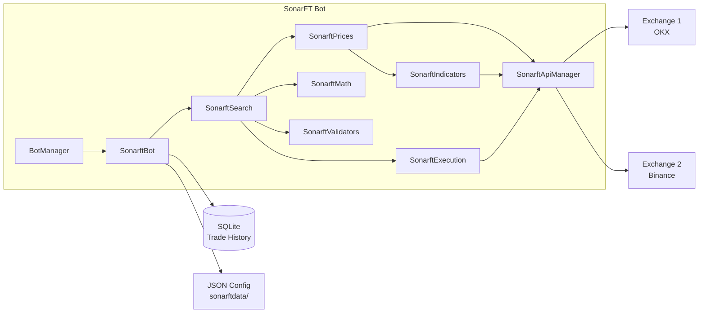
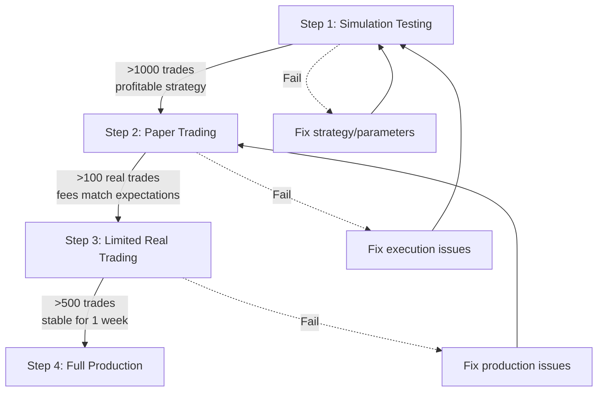

# SonarFT Bot — Setup, Execution & Operations Guide

**Prompt:** 13-BOT-SETUP  
**Author:** Senior DevOps / Trading Operations Specialist  
**Date:** July 2025  
**Codebase:** `packages/bot`

---

## 1. System Overview

### What Is SonarFT?

SonarFT (System Oscillator for Navigation and Ranging in Financial Trade) is an automated cryptocurrency arbitrage trading bot. It monitors price differentials across multiple exchanges and executes buy/sell pairs when the spread exceeds fees and a configurable profit threshold.

### Capabilities

- Cross-exchange arbitrage (buy low on Exchange A, sell high on Exchange B)
- Technical indicator-driven price adjustment (RSI, MACD, StochRSI, SMA)
- Multi-bot concurrency (multiple independent bots per server)
- Simulation mode (paper trading without real orders)
- Real-time WebSocket data streaming (via ccxtpro)
- REST API fallback (via ccxt)
- JSON-based configuration with hot-reload
- SQLite trade/order history persistence
- Circuit breaker with webhook alerting

### Supported Exchanges

Default: OKX, Binance. Also configured: Bitfinex, Binance US, Bitget, Bybit, Kraken, KuCoin, and 10+ others (see `config_fees.json`).

### Architecture



### Typical Execution Workflow

```
1. Bot loads configuration (exchanges, symbols, parameters, indicators)
2. Bot initializes exchange connections and loads market data
3. Search cycle begins:
   a. Fetch VWAP prices across all exchanges
   b. Adjust prices using 16 parallel indicator signals
   c. Calculate profit after fees (Decimal arithmetic)
   d. Validate liquidity and spread thresholds
   e. If profitable: dispatch trade execution (fire-and-forget)
4. Sleep 6-18 seconds, repeat from step 3
5. Trade execution (async):
   a. Determine LONG/SHORT position
   b. Monitor price until favorable (≤120s)
   c. Place limit order, monitor until filled (≤300s)
   d. Place second leg using actual filled amount
   e. If second leg fails: cancel first leg
```

---

## 2. Prerequisites & Requirements

### Hardware

| Requirement | Minimum | Recommended |
|---|---|---|
| CPU | 1 core | 2+ cores |
| RAM | 256MB | 512MB per bot |
| Storage | 100MB | 1GB (for trade history) |
| Network | Stable internet | Low-latency connection to exchanges |

### Software

| Requirement | Version | Verification |
|---|---|---|
| Python | ≥3.10 (3.11 recommended) | `python3 --version` |
| pip | Latest | `pip --version` |
| Docker (optional) | 20+ | `docker --version` |
| Docker Compose (optional) | 2.0+ | `docker compose version` |
| Git | Any | `git --version` |

### Exchange Requirements

| Requirement | Details |
|---|---|
| Exchange accounts | Active accounts on configured exchanges |
| API keys | Read + Trade permissions (not Withdraw) |
| IP whitelisting | Recommended for production |
| 2FA | Required on exchange accounts |

---

## 3. Installation Guide

### Local Installation (Python)

```bash
# Clone the repository
git clone <repository-url>
cd sonarft-monorepo/packages/bot

# Create virtual environment (recommended)
python3 -m venv .venv
source .venv/bin/activate

# Install dependencies
pip install -r requirements.txt
pip install -e .

# Verify installation
python -c "from sonarft_bot import SonarftBot; print('OK')"

# Run tests
pytest -v
```

### Docker Installation

```bash
cd sonarft-monorepo/packages/bot

# Build image
docker build -t sonarft-bot:latest .

# Run in simulation mode (default)
docker run -d \
  --name sonarft-bot \
  -v $(pwd)/sonarftdata:/app/sonarftdata \
  sonarft-bot:latest

# Verify
docker logs sonarft-bot

# Run with custom config
docker run -d \
  --name sonarft-bot \
  -v $(pwd)/sonarftdata:/app/sonarftdata \
  -e OKX_API_KEY=<your-key> \
  -e OKX_SECRET=<your-secret> \
  sonarft-bot:latest python sonarft_bot.py -c config_2 -l ccxtpro
```

### Monorepo Installation (via Makefile)

```bash
cd sonarft-monorepo
make install    # Installs all packages (bot, api, web)
make dev        # Starts all services with Docker (hot reload)
make dev-api    # Starts API only
```

---

## 4. Configuration Guide

### 4.1 Configuration File Structure

```
sonarftdata/
├── config.json              # Named config sets (config_1, config_2, ...)
├── config_parameters.json   # Trading parameters per setup
├── config_exchanges.json    # Exchange list per setup
├── config_symbols.json      # Trading pairs per setup
├── config_fees.json         # Fee rates per exchange
├── config_indicators.json   # Active indicators per setup
├── config_markets.json      # Market type (crypto, forex)
└── config/                  # Per-client runtime overrides
    ├── {client_id}_parameters.json
    └── {client_id}_indicators.json
```

### 4.2 Key Parameters

**`config_parameters.json`:**

```json
{
    "parameters_1": [{
        "profit_percentage_threshold": 0.003,
        "trade_amount": 1,
        "is_simulating_trade": 1,
        "max_daily_loss": 100.0,
        "max_trade_amount": 0.0,
        "max_orders_per_minute": 0,
        "spread_increase_factor": 1.00072,
        "spread_decrease_factor": 0.99936
    }]
}
```

| Parameter | Description | Safe Default | ⚠️ Danger Zone |
|---|---|---|---|
| `profit_percentage_threshold` | Minimum profit % to execute | `0.003` (0.3%) | `< 0.001` — may execute marginal trades |
| `trade_amount` | Base currency units per trade | `1` | High values = high capital exposure |
| `is_simulating_trade` | `1` = simulation, `0` = live | `1` | **`0` = REAL MONEY** |
| `max_daily_loss` | Halt trading after this loss | `100.0` | `0` = disabled (no loss limit) |
| `max_trade_amount` | Max single trade size | `0.0` (disabled) | `0` = no limit |
| `max_orders_per_minute` | Order rate limit | `0` (disabled) | `0` = no limit |

### 4.3 Exchange Configuration

**`config_exchanges.json`:**
```json
{
    "exchanges_1": ["okx", "binance"],
    "exchanges_2": ["okx", "bitfinex"]
}
```

Exchange IDs must match ccxt exchange names exactly (lowercase).

### 4.4 Symbol Configuration

**`config_symbols.json`:**
```json
{
    "symbols_1": [
        { "base": "BTC", "quotes": ["USDT"] },
        { "base": "ETH", "quotes": ["USDT"] }
    ]
}
```

### 4.5 Environment Variables

```bash
# Exchange API keys (required for live trading)
export OKX_API_KEY=<your-api-key>
export OKX_SECRET=<your-secret-key>
export OKX_PASSWORD=<your-passphrase>    # OKX requires this

export BINANCE_API_KEY=<your-api-key>
export BINANCE_SECRET=<your-secret-key>

# Optional: webhook alerting
export SONARFT_ALERT_WEBHOOK=https://hooks.slack.com/services/...
```

⚠️ **Never commit API keys to version control.** Use `.env` files (gitignored) or a secrets manager.


---

## 5. Execution Guide

### Standard Execution (Simulation Mode)

```bash
# Default: config_1, ccxtpro library, simulation mode ON
python sonarft_bot.py
```

The bot will:
1. Load `config_1` from `sonarftdata/config.json`
2. Initialize exchange connections (no API keys needed for simulation)
3. Start searching for arbitrage opportunities
4. Log all activity to stdout
5. Record simulated trades to SQLite (`sonarftdata/history/sonarft.db`)

### Custom Configuration

```bash
# Use config_2 with REST API (ccxt)
python sonarft_bot.py -c config_2 -l ccxt

# Use config_1 with WebSocket API (default, faster)
python sonarft_bot.py -c config_1 -l ccxtpro
```

| Flag | Purpose | Default |
|---|---|---|
| `-c` / `--config` | Config set name from `config.json` | `config_1` |
| `-l` / `--library` | API library: `ccxt` (REST) or `ccxtpro` (WebSocket) | `ccxtpro` |

### Via API Layer

When running through the API (`packages/api`), bots are managed via HTTP/WebSocket:

```
POST /api/v1/bots?client_id=<uuid>     → Creates bot
POST /api/v1/bots/{botId}/run          → Starts bot
POST /api/v1/bots/{botId}/stop         → Stops bot
DELETE /api/v1/bots/{botId}            → Removes bot
```

---

## 6. Operational Modes Guide

### ⚠️ CRITICAL: Read This Section Completely Before Operating

---

### Mode 1 — Simulation Mode (Default)

**Purpose:** Test trading logic without any real exchange interaction for order placement.

**How it works:**
- `is_simulating_trade: 1` in config (default)
- Exchange market data is fetched (real prices, real order books)
- Indicators are calculated from real data
- Trade decisions are made using real market conditions
- **Orders are NOT placed** — synthetic order IDs generated
- **Balance is NOT checked** — always returns sufficient
- **All fills are instant and complete** — no partial fills, no slippage

**What gets recorded:**
- All trade decisions logged
- Simulated orders saved to SQLite with synthetic IDs
- Trade history includes profit/loss calculations

**Limitations:**
- No slippage modeling — real fills may differ
- No partial fill simulation — real orders may partially fill
- No order rejection — real exchanges may reject orders
- Results are optimistic compared to real trading

**When to use:**
- Initial strategy testing
- Parameter tuning
- Indicator evaluation
- Development and debugging

---

### Mode 2 — Paper Trading Mode

**Purpose:** Test with real market data and real exchange interaction, but with minimal capital.

**How to enable:**
```json
{
    "is_simulating_trade": 0,
    "trade_amount": 0.001,
    "max_trade_amount": 0.01,
    "max_daily_loss": 5.0
}
```

**How it works:**
- `is_simulating_trade: 0` — real orders are placed
- Very small `trade_amount` (e.g., 0.001 BTC ≈ $30)
- Tight `max_trade_amount` and `max_daily_loss` limits
- Real balance checks, real order placement, real fills
- API keys required

**Risk profile:**
- ⚠️ Real money is at risk (small amounts)
- ⚠️ Exchange fees are real
- ⚠️ Orders may partially fill
- ⚠️ Network issues can cause unhedged positions

**When to use:**
- After simulation testing is satisfactory
- Validating real exchange interaction
- Testing order placement and monitoring
- Verifying fee calculations match reality

---

### Mode 3 — Real Trading Mode

**⚠️ WARNING: REAL MONEY AT RISK. READ COMPLETELY BEFORE ENABLING.**

**How to enable:**
```json
{
    "is_simulating_trade": 0,
    "trade_amount": 1.0,
    "max_trade_amount": 5.0,
    "max_daily_loss": 500.0,
    "max_orders_per_minute": 10
}
```

**Prerequisites (ALL required):**
- ✅ Simulation testing completed (>1000 simulated trades)
- ✅ Paper trading completed (>100 real trades with small amounts)
- ✅ All Phase 0 roadmap items completed (shutdown, cancel retry, timeout)
- ✅ API keys configured with trade-only permissions (NO withdraw)
- ✅ IP whitelisting enabled on exchange accounts
- ✅ `SONARFT_ALERT_WEBHOOK` configured for real-time alerts
- ✅ Operator available to monitor during initial hours
- ✅ Manual stop procedure tested and documented

**⚠️ Capital exposure risks:**
- Default `trade_amount: 1` BTC ≈ $30,000 per trade
- With 2 symbols and 2 exchanges, multiple trades can execute per cycle
- `max_daily_loss` is the only automatic loss limit
- Orphaned orders (if shutdown fixes not applied) can fill at any price

**Recommended safeguards:**
- Set `max_trade_amount` to limit single-trade exposure
- Set `max_orders_per_minute` to prevent runaway trading
- Set `max_daily_loss` to an amount you can afford to lose
- Monitor logs continuously during first 24 hours
- Have exchange web UI open to manually cancel orders if needed

---

## 7. Safe Deployment Workflow



### Step 1 → Step 2 Criteria

| Criteria | Threshold |
|---|---|
| Simulated trades completed | >1,000 |
| Simulated profit positive | Yes |
| No unhandled exceptions in 24h | Yes |
| All unit tests passing | Yes |

### Step 2 → Step 3 Criteria

| Criteria | Threshold |
|---|---|
| Real trades completed | >100 |
| Real profit positive (after fees) | Yes |
| No orphaned orders observed | Yes |
| Fee calculations match exchange statements | Within 1% |
| Phase 0 + Phase 1 roadmap items complete | Yes |

### Step 3 → Step 4 Criteria

| Criteria | Threshold |
|---|---|
| Real trades completed | >500 |
| Stable operation for | >1 week |
| No unhedged positions | Yes |
| Alert system tested and working | Yes |
| Phase 2 + Phase 3 roadmap items complete | Yes |
| Backup and recovery tested | Yes |

---

## 8. Logging & Monitoring Guide

### Log Output

All logs go to stdout (captured by Docker or terminal). Format:

```
INFO - <client_id> - Bot 12345 has been created!
INFO - <client_id> - (v1009) - Bot 12345: NEW TRADE SEARCHING...
INFO - <client_id> - BTC/USDT: Trade Amount 1
INFO - <client_id> - BTC/USDT: Target Buy: 60000.1 - Target Sell: 60200.5
INFO - <client_id> - BTC/USDT: Profit 45.90 - Percentage: 0.00153
WARNING - <client_id> - BTC/USDT: Invalid spread: binance -> okx
ERROR - <client_id> - Error get_rsi: Not enough data for RSI
```

### Key Log Patterns to Monitor

| Pattern | Meaning | Action |
|---|---|---|
| `A NEW TRADE HAS BEEN FOUND!` | Trade passed all validations | Normal — trade being executed |
| `circuit breaker tripped` | 5 consecutive search failures | ⚠️ Investigate immediately |
| `ALERT (no webhook configured)` | Alert fired but no webhook | Configure `SONARFT_ALERT_WEBHOOK` |
| `Not enough buy balance` | Insufficient funds | Check exchange balance |
| `Order placement returned None` | Order may be untracked | ⚠️ Check exchange for open orders |
| `attempting to cancel buy order` | Second leg failed | ⚠️ Verify cancel succeeded |
| `Error calling method` | Exchange API failure | Check exchange status |
| `Daily loss limit reached` | Trading halted | Review losses; restart bot to reset |

### Trade History

Query trade history from SQLite:

```bash
sqlite3 sonarftdata/history/sonarft.db \
  "SELECT * FROM trades WHERE botid='12345' ORDER BY id DESC LIMIT 10;"
```

Or via API:
```
GET /api/v1/bots/12345/trades
GET /api/v1/bots/12345/orders
```


---

## 9. Troubleshooting Guide

### Common Issues

| Problem | Cause | Solution |
|---|---|---|
| `ModuleNotFoundError: No module named 'sonarft_bot'` | Package not installed | Run `pip install -e .` from `packages/bot/` |
| `FileNotFoundError: sonarftdata/config.json` | Wrong working directory | `cd` to `packages/bot/` before running |
| `KeyError: 'config_1'` | Config set doesn't exist | Check `sonarftdata/config.json` for available sets |
| `ccxt.AuthenticationError` | Invalid or missing API keys | Verify `{EXCHANGE}_API_KEY` and `{EXCHANGE}_SECRET` env vars |
| `ccxt.ExchangeNotAvailable` | Exchange in maintenance | Wait and retry; check exchange status page |
| `ccxt.RateLimitExceeded` | Too many API calls | Reduce number of symbols/exchanges; `enableRateLimit` should handle this |
| `TypeError: 'NoneType' object is not subscriptable` | API returned None | Known issue — add null checks (Roadmap T05) |
| `ValueError: profit_percentage_threshold must be between 0 and 1` | Invalid config parameter | Fix value in `config_parameters.json` |
| Bot stops after 5 failures | Circuit breaker tripped | Check logs for root cause; fix issue; restart bot |
| `sqlite3.OperationalError: database is locked` | Concurrent SQLite access | Should not happen with `_db_lock`; check for external DB access |
| WebSocket disconnects frequently | Network instability | ccxtpro reconnects automatically; check network |
| `No API keys found for exchange` | Missing env vars in live mode | Set `{EXCHANGE}_API_KEY` and `{EXCHANGE}_SECRET` |
| Bot runs but no trades found | Spread below threshold | Normal — arbitrage opportunities are rare; lower `profit_percentage_threshold` cautiously |

### Emergency Procedures

**Stop a specific bot:**
```
POST /api/v1/bots/{botId}/stop
```

**Stop all bots (manual):**
```bash
# Kill the process
kill -SIGTERM <pid>

# Or via Docker
docker stop sonarft-bot
```

**⚠️ After emergency stop:** Check exchanges for open orders and cancel them manually via exchange web UI.

---

## 10. Testing Workflow Guide

### Running Tests

```bash
cd packages/bot

# Run all tests
pytest -v

# Run specific test file
pytest tests/test_sonarft_math.py -v

# Run specific test class
pytest tests/test_sonarft_math.py::TestCalculateTradeProfitability -v

# Run with coverage (if pytest-cov installed)
pytest --cov=. --cov-report=term-missing
```

### Test Categories

| Category | Files | What's Tested |
|---|---|---|
| Financial math | `test_sonarft_math.py` | Profit calculation, fees, VWAP, precision |
| Indicators | `test_sonarft_indicators.py` | RSI, MACD, StochRSI, direction, trend |
| Validators | `test_sonarft_validators.py` | Spread thresholds, liquidity checks |
| Bot lifecycle | `test_sonarft_bot.py` | Parameter validation, sim mode, daily loss |
| Execution | `test_simulation_integration.py` | Sim/live mode gate, safety controls |
| Features | `test_phase4_features.py` | SQLite persistence, hot-reload, same-exchange guard |

### Strategy Validation Workflow

1. **Configure parameters** in `config_parameters.json`
2. **Run in simulation** for >1000 trades
3. **Query trade history:**
   ```bash
   sqlite3 sonarftdata/history/sonarft.db \
     "SELECT COUNT(*), SUM(json_extract(data,'$.profit')) FROM trades WHERE botid='<id>';"
   ```
4. **Analyze results:** Total profit should be positive after fees
5. **Adjust parameters** and repeat until satisfactory

---

## 11. Performance & Scaling Guide

### Single Bot Performance

| Metric | Typical Value |
|---|---|
| Memory | ~110MB |
| CPU | ~1-2% per cycle |
| Cycle time | 3-8 seconds |
| API calls/cycle | ~32 |
| Sleep between cycles | 6-18 seconds (random) |

### Multi-Bot Scaling

| Bots | Memory | API Calls/min | Assessment |
|---|---|---|---|
| 1 | 110MB | ~130 | ✅ Comfortable |
| 5 | 550MB | ~650 | ✅ Feasible |
| 10 | 1.1GB | ~1300 | ⚠️ Approaching exchange rate limits |
| 20+ | 2.2GB+ | ~2600+ | ❌ Requires shared exchange instances |

### Optimization Tips

- Use `ccxtpro` (WebSocket) instead of `ccxt` (REST) for lower latency
- Reduce number of symbols per bot to reduce API calls
- Use 2 exchanges (not 3+) to keep combinations manageable
- Set `max_orders_per_minute` to prevent API flooding
- Monitor memory with `docker stats` or `ps aux`

---

## 12. Security Best Practices

### API Key Management

| Practice | Status | Recommendation |
|---|---|---|
| Store keys in environment variables | ✅ | Use `.env` file (gitignored) or secrets manager |
| Never commit keys to git | ✅ | `.env` in `.gitignore` |
| Use trade-only permissions | ⚠️ Manual | **Never grant withdraw permissions** |
| Enable IP whitelisting | ⚠️ Manual | Whitelist server IP on exchange |
| Enable 2FA on exchange accounts | ⚠️ Manual | Required for all accounts |
| Rotate keys periodically | ⚠️ Manual | Requires bot restart |

### File Permissions

```bash
# Config files: readable by bot user only
chmod 600 sonarftdata/config*.json
chmod 600 .env

# Data directories: writable by bot user only
chmod 700 sonarftdata/history/
chmod 700 sonarftdata/bots/
chmod 700 sonarftdata/config/
```

### Network Security

- Run behind a firewall — bot does not need inbound connections
- Use TLS for all exchange connections (ccxt/ccxtpro use `https://` and `wss://` by default)
- If running the API layer, use HTTPS with proper certificates
- Restrict API access to trusted networks

### Docker Security

```dockerfile
# Recommended additions to Dockerfile:
RUN adduser --disabled-password --gecos '' sonarft
USER sonarft
HEALTHCHECK --interval=30s --timeout=5s CMD python -c "print('ok')"
```


---

## 13. Backup & Recovery Guide

### What to Back Up

| Item | Location | Frequency | Method |
|---|---|---|---|
| Configuration files | `sonarftdata/config*.json` | Before any change | `cp` or version control |
| Per-client config | `sonarftdata/config/` | Daily | `cp -r` or rsync |
| Trade history DB | `sonarftdata/history/sonarft.db` | Daily | `sqlite3 .backup` |
| Bot registry | `sonarftdata/bots/` | After bot creation | `cp -r` |
| Environment variables | `.env` file | Before any change | Secure copy |

### Backup Commands

```bash
# Daily backup script
DATE=$(date +%Y%m%d)
BACKUP_DIR="backups/$DATE"
mkdir -p "$BACKUP_DIR"

# Config files
cp -r sonarftdata/config*.json "$BACKUP_DIR/"
cp -r sonarftdata/config/ "$BACKUP_DIR/config/"

# Trade history (SQLite online backup)
sqlite3 sonarftdata/history/sonarft.db ".backup '$BACKUP_DIR/sonarft.db'"

# Bot registry
cp -r sonarftdata/bots/ "$BACKUP_DIR/bots/"

echo "Backup completed: $BACKUP_DIR"
```

### Recovery Procedure

1. **Stop the bot** (if running)
2. **Restore config files:**
   ```bash
   cp backups/YYYYMMDD/config*.json sonarftdata/
   cp -r backups/YYYYMMDD/config/ sonarftdata/config/
   ```
3. **Restore trade history** (optional — only if DB is corrupted):
   ```bash
   cp backups/YYYYMMDD/sonarft.db sonarftdata/history/sonarft.db
   ```
4. **Verify configuration:**
   ```bash
   python -c "import json; json.load(open('sonarftdata/config.json')); print('Config OK')"
   ```
5. **Restart the bot**

### Disaster Recovery

If the server is lost:
1. Provision new server with same OS and Python version
2. Clone repository and install dependencies
3. Restore `.env` file with API keys
4. Restore `sonarftdata/` from backup
5. Start bot in simulation mode first to verify
6. Switch to previous operational mode after verification

---

## 14. Upgrade & Maintenance Guide

### Updating Dependencies

```bash
# Check for outdated packages
pip list --outdated

# Update specific package (test first!)
pip install ccxt==<new-version>

# Run tests after any update
pytest -v

# If tests fail, rollback
pip install ccxt==4.5.48  # previous version
```

### Upgrading SonarFT

```bash
# 1. Stop the bot
# 2. Back up everything (Section 13)

# 3. Pull latest code
git pull origin main

# 4. Update dependencies
pip install -r requirements.txt

# 5. Run tests
pytest -v

# 6. Start in simulation mode first
python sonarft_bot.py

# 7. Verify behavior matches expectations
# 8. Switch to previous operational mode
```

### Maintenance Tasks

| Task | Frequency | Command |
|---|---|---|
| Check disk usage | Weekly | `du -sh sonarftdata/` |
| Archive old trade history | Monthly | SQLite export + delete old records |
| Rotate log files | Weekly | Configure log rotation in deployment |
| Update exchange fee rates | Monthly | Edit `config_fees.json` to match current tier |
| Review alert webhook | Monthly | Send test alert |
| Check exchange API key expiry | Monthly | Verify keys still work |
| Run `pip audit` | Weekly | `pip audit` (if installed) |

---

## 15. Real Trading Readiness Checklist

### ⚠️ Complete ALL items before enabling `is_simulating_trade: 0` with real capital

**Strategy Validation:**
- [ ] >1,000 simulated trades completed
- [ ] Simulated profit is positive after fees
- [ ] >100 paper trades completed (small amounts)
- [ ] Paper trading profit matches simulation expectations (within 20%)
- [ ] Fee calculations match exchange statements

**System Stability:**
- [ ] No unhandled exceptions in 24h simulation run
- [ ] No unhandled exceptions in 24h paper trading run
- [ ] All 96+ unit tests passing
- [ ] Circuit breaker tested (manually trigger 5 failures)
- [ ] Bot stop/restart tested without data loss

**Safety Controls:**
- [ ] `max_trade_amount` set to acceptable limit
- [ ] `max_daily_loss` set to affordable amount
- [ ] `max_orders_per_minute` set to reasonable limit
- [ ] `profit_percentage_threshold` reviewed and appropriate
- [ ] Simulation mode gate verified (test that sim=1 prevents real orders)

**Order Lifecycle (Roadmap Phase 0):**
- [ ] Shutdown cancels all open orders (T01)
- [ ] Failed cancel retries 3× with alerting (T02)
- [ ] Timed-out orders cancelled (T03)
- [ ] No orphaned orders observed in paper trading

**Security:**
- [ ] API keys have trade-only permissions (NO withdraw)
- [ ] IP whitelisting enabled on exchange accounts
- [ ] 2FA enabled on all exchange accounts
- [ ] `.env` file permissions set to 600
- [ ] `client_id` sanitization applied (T14)
- [ ] Hot-reload validation active (T15)

**Monitoring:**
- [ ] `SONARFT_ALERT_WEBHOOK` configured and tested
- [ ] Log monitoring in place
- [ ] Operator available for first 24 hours
- [ ] Emergency stop procedure documented and tested
- [ ] Exchange web UI bookmarked for manual order cancellation

**Operational:**
- [ ] Backup procedure tested
- [ ] Recovery procedure tested
- [ ] Sufficient capital deposited on exchanges
- [ ] Exchange rate limits understood and within bounds
- [ ] Network connectivity stable (test for 24h)

**Sign-off:**
- [ ] Developer sign-off: code reviewed and tested
- [ ] Operator sign-off: procedures understood
- [ ] Risk acknowledgment: understand potential for loss

---

*Generated by Prompt 13-BOT-SETUP. Complete operational guide for SonarFT bot package.*


---

## Post-Implementation Update (July 2025)

The following improvements have been implemented since this guide was written:

- **Docker hardening** (T32): Container now runs as non-root user `sonarft` with HEALTHCHECK and `.dockerignore`
- **Sim→live gate** (T16): Switching to live mode via hot-reload requires `SONARFT_ALLOW_LIVE=true` environment variable
- **Parameter validation** (T15): Hot-reload validates all parameters and rolls back on failure
- **Audit logging** (T17): All parameter changes logged at WARNING level with old→new values
- **Client ID sanitization** (T14): `sanitize_client_id()` prevents path traversal
- **Daily loss auto-reset** (T34): Accumulated loss resets automatically at midnight
- **Simulation slippage** (T35): Simulation mode now models 0-0.1% random slippage
- **Order lifecycle** (T01-T03): Proper shutdown sequence, cancel retry with alerting, timeout cancellation
- **API timeout** (T13): All exchange API calls have 30s timeout

These changes affect the Real Trading Readiness Checklist — several items are now automatically enforced by the system rather than requiring manual verification.

**Additional improvements (remaining-issues roadmap):**
- **Order reconciliation** (A1/T33): Bot queries open orders on startup and cancels stale ones
- **pip audit in CI** (A2/T19): Python dependency vulnerability scanning on every PR
- **Partial fill handling** (B1/B2): First leg remaining cancelled; second leg imbalance alerted
- **Docker entrypoint** (B3): `__main__.py` created — `python -m sonarft_bot` works
- **Safer defaults** (B4): trade_amount 0.01 BTC, max_trade_amount 0.1, rate limit 10/min
- **Search module split** (C1): sonarft_search.py split into 3 focused modules
- **Indicator coupling removed** (C2): SonarftExecution no longer depends on SonarftIndicators
- **VWAP consolidated** (C3): Shared vwap() function in models.py
- **UUID bot IDs** (C4): No more collision risk
- **Flash crash protection** (D1): Skip execution if price deviation > 2%
- **RSI hysteresis** (D2): 72/28 thresholds reduce boundary noise
- **Maker/taker fees** (D3): Backward-compatible config extension
- **Banker's rounding** (D4): ROUND_HALF_EVEN for fees eliminates systematic bias
- **Parallel combinations** (E2): Buy/sell combinations processed concurrently
- **Configurable constants** (F4): Circuit breaker, backoff, sleep via env vars
- **Pause/resume** (F6): Trading can be paused without stopping the bot
- **Naming cleanup** (G1/G2): InitializeModules → initialize_modules, setAPIKeys → set_api_keys
