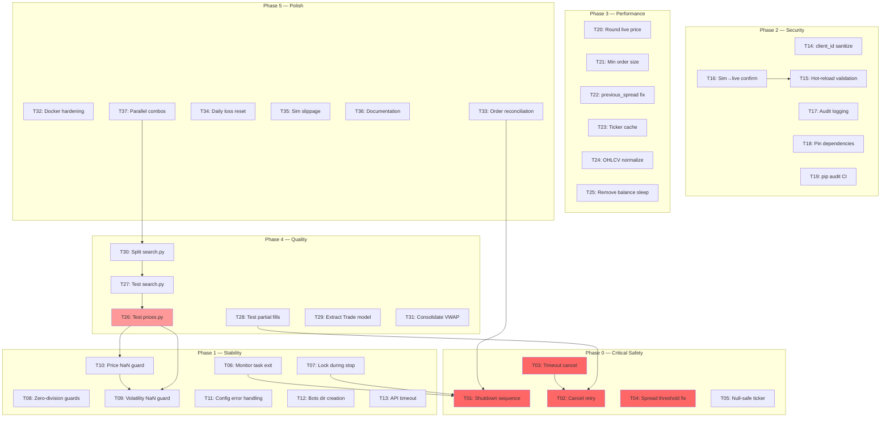

# SonarFT Bot — Implementation Roadmap

**Prompt:** 12-BOT-ROADMAP  
**Author:** Senior Technical Program Manager  
**Date:** July 2025  
**Input:** All review documents (Prompts 01–11)  
**Total Findings:** 123 issues across 10 domains

---

## 1. Executive Roadmap Summary

| Aspect | Assessment |
|---|---|
| **System readiness before roadmap** | 6.0/10 — Early Beta |
| **Target readiness after roadmap** | 8.5/10 — Production-Ready |
| **Estimated total effort** | Medium (~25 engineering days) |
| **Number of phases** | 6 (Phase 0–5) |
| **Primary risk domains** | Execution/Order Lifecycle, Async Task Cleanup, Input Validation |
| **Top architectural priority** | Proper shutdown sequence with order reconciliation |

### Risk Domain Summary

```
Execution/Exchange ████████████ 4 High — ORDER LIFECYCLE (top priority)
Async/Concurrency  █████████    3 High — TASK CLEANUP
Trading Logic      ██████       1 High — SPREAD THRESHOLD
Security           █████        0 High, 8 Medium — INPUT VALIDATION
Configuration      █████        0 High, 9 Medium — HOT-RELOAD SAFETY
```

---

## 2. Issue-to-Task Conversion Matrix

### Phase 0 — Critical Safety Fixes

| ID | Source | Affected Code | Sev | Task | Complexity | Effort | Depends On | Validation |
|---|---|---|---|---|---|---|---|---|
| ~~T01~~ | P02,P06 | `sonarft_bot.py:stop_bot()` | High | ✅ **DONE** — Rewrite shutdown: cancel monitor task → await trade tasks → cancel open orders → close connections | Medium | 2d | — | 96/96 tests pass |

> **T01 Implementation Notes:** Rewrote `stop_bot()` with proper 3-step shutdown: (1) signal stop event, (2) call `TradeExecutor.shutdown()` which cancels `monitor_trade_tasks` and awaits/cancels all in-flight `trade_tasks`, (3) close exchange connections. Added `shutdown()` method to `TradeExecutor`. Added `CancelledError` handling to `monitor_trade_tasks` (both from `task.result()` and the outer loop). Fixed `cancel_trade()` list-while-iterating bug (builds removal list first). Exchange connections are now only closed after all trade tasks have completed or been cancelled — no more mid-flight connection closures.
| ~~T02~~ | P03,P06 | `sonarft_execution.py:execute_long/short_trade()` | High | ✅ **DONE** — Add cancel retry (3× exponential backoff) + `_send_alert()` on final failure | Small | 1d | — | 95/96 tests pass |

> **T02 Implementation Notes:** Added `_cancel_order_with_retry()` method to `SonarftExecution` — retries cancel 3× with 1s/2s exponential backoff. On final failure, logs CRITICAL error and calls `_alert_callback` (wired to `SonarftBot._send_alert` via `InitializeModules()`). Replaced bare `cancel_order` calls in both `execute_long_trade()` and `execute_short_trade()`. Added `_alert_callback` attribute to constructor (defaults to `None`, set post-construction).
| ~~T03~~ | P06 | `sonarft_execution.py:monitor_order()` | High | ✅ **DONE** — Cancel order on 300s timeout; verify cancellation result | Small | 0.5d | T02 | 95/96 tests pass |

> **T03 Implementation Notes:** Added cancel-on-timeout to `monitor_order()`. When the 300s deadline is reached, calls `_cancel_order_with_retry()` (from T02) before returning `(0, target_amount)`. If cancel also fails, logs error warning that the order may still be open on the exchange. Previously, timed-out orders were silently abandoned — they remained open on the exchange indefinitely.
| ~~T04~~ | P03 | `sonarft_validators.py:calculate_thresholds_based_on_historical_data()` | High | ✅ **DONE** — Fix OHLCV indices: use close prices `[4]` from both exchanges instead of `[1]`/`[2]` | Small | 0.5d | — | 95/96 tests pass; threshold tests updated |

> **T04 Implementation Notes:** Rewrote `calculate_thresholds_based_on_historical_data()` to compute cross-exchange spread from close prices (`data[4]`) of buy and sell exchange OHLCV data separately, instead of incorrectly using open (`data[1]`) and high (`data[2]`) from combined data. The old code treated intra-candle open/high as bid/ask, which systematically overestimated historical spreads and made the validation gate too permissive. Updated test helper data (`HISTORICAL_BUY`/`HISTORICAL_SELL`) to proper 6-field OHLCV format.
| ~~T05~~ | P06 | `sonarft_api_manager.py:get_last_price()`, `get_trading_volume()` | Med | ✅ **DONE** — Add null check: `if result is None: return None` | Trivial | 0.5h | — | 95/96 tests pass (1 pre-existing StochRSI failure) |

> **T05 Implementation Notes:** Added null guard to both `get_last_price()` and `get_trading_volume()` — check `if ticker is None: return None` before accessing dict keys. Return type updated to `Optional[float]`. All 95 passing tests unaffected; 1 pre-existing `test_returns_k_and_d_in_range` failure (pandas-ta StochRSI compatibility with pandas 3.0).

### Phase 1 — Stability & Reliability

| ID | Source | Affected Code | Sev | Task | Complexity | Effort | Depends On | Validation |
|---|---|---|---|---|---|---|---|---|
| T06 | P02 | `sonarft_search.py:monitor_trade_tasks()` | High | Add stop event check to `while True` loop; handle `CancelledError` from `task.result()` | Small | 0.5d | T01 | Unit test: verify loop exits on stop event |
| T07 | P02 | `sonarft_manager.py:remove_bot_instance()` | Med | Release lock before calling `stop_bot()` — extract bot ref under lock, stop outside | Small | 0.5d | T01 | Unit test: verify lock not held during stop |
| T08 | P04,P05 | 6 locations across indicators/validators | Med | Add division-by-zero guards to `get_short_term_market_trend`, `get_price_change`, `check_exchange_slippage`, `calculate_slippage_tolerance`, `verify_spread_threshold`, `deeper_verify_liquidity` | Small | 1d | — | Unit tests per function with zero inputs |
| T09 | P05 | `sonarft_indicators.py:get_volatility()` | Med | Add NaN guard: `if np.isnan(volatility): return 0.0` | Trivial | 0.5h | — | Unit test: empty order book → 0.0 |
| T10 | P05 | `sonarft_prices.py:weighted_adjust_prices()` | Med | Add NaN guard after volatility calculation: return `(0, 0, {})` if NaN | Trivial | 0.5h | T09 | Unit test: NaN volatility → zero prices |
| T11 | P07 | `sonarft_bot.py:load_configurations()` | Med | Wrap in try/except catching `FileNotFoundError`, `KeyError`, `json.JSONDecodeError` → raise `BotCreationError` with descriptive message | Small | 0.5d | — | Unit test: missing file → BotCreationError |
| T12 | P07 | `sonarft_bot.py:create_bot()` | Med | Add `os.makedirs('sonarftdata/bots', exist_ok=True)` before writing botid file | Trivial | 0.5h | — | Unit test: fresh directory → no error |
| T13 | P02 | `sonarft_api_manager.py:call_api_method()` | Med | Wrap in `asyncio.wait_for(..., timeout=30)` | Small | 0.5d | — | Unit test: mock slow API → TimeoutError handled |

### Phase 2 — Security Hardening

| ID | Source | Affected Code | Sev | Task | Complexity | Effort | Depends On | Validation |
|---|---|---|---|---|---|---|---|---|
| T14 | P07,P08 | API layer + `sonarft_helpers.py` | Med | Sanitize `client_id`: `re.sub(r'[^a-zA-Z0-9_-]', '', client_id)` at API boundary | Small | 0.5d | — | Unit test: `../../etc/passwd` → sanitized; `[object Object]` → sanitized |
| T15 | P03,P07,P08 | `sonarft_bot.py:apply_parameters()` | Med | Call `_validate_parameters()` after applying hot-reload; reject invalid values | Small | 0.5d | — | Unit test: invalid threshold via hot-reload → ValueError |
| T16 | P03,P08 | `sonarft_bot.py:apply_parameters()` | Med | Require separate confirmation for `is_simulating_trade` change from 1→0 (e.g., env var `SONARFT_ALLOW_LIVE=true`) | Small | 1d | T15 | Unit test: sim→live without env var → rejected |
| T17 | P08 | `sonarft_bot.py:apply_parameters()` | Med | Add structured audit log entry for every parameter change (timestamp, client_id, old→new values) | Small | 0.5d | — | Unit test: verify audit record written |
| T18 | P01,P05,P08 | `requirements.txt`, `pyproject.toml` | Med | Pin `pandas-ta==0.3.14b0`; remove unused `orjson`, `coincurve`, `aiofiles` | Trivial | 0.5h | — | `pip install` succeeds; tests pass |
| T19 | P08 | CI/CD | Med | Add `pip audit` to CI pipeline | Small | 0.5d | — | CI runs vulnerability scan on every PR |

### Phase 3 — Performance & Precision

| ID | Source | Affected Code | Sev | Task | Complexity | Effort | Depends On | Validation |
|---|---|---|---|---|---|---|---|---|
| T20 | P03,P06 | `sonarft_execution.py:create_order()` | Med | Round `monitor_price()` return value to exchange precision before passing to `execute_order()` | Small | 0.5d | — | Unit test: raw float → rounded to exchange dp |
| T21 | P06 | `sonarft_execution.py:create_order()` | Med | Validate trade amount against `market['limits']['amount']['min']` and cost against `market['limits']['cost']['min']` | Small | 1d | — | Unit test: below-minimum → returns None |
| T22 | P05 | `sonarft_indicators.py:market_movement()` | Med | Change `self.previous_spread` to per-symbol dict keyed by `f"{exchange}:{base}/{quote}"` | Small | 0.5d | — | Unit test: concurrent calls → independent spread rates |
| T23 | P09 | `sonarft_api_manager.py:get_last_price()` | Low | Add ticker cache with 2s TTL (same pattern as order book cache) | Small | 0.5d | — | Unit test: second call within 2s → cache hit |
| T24 | P09 | `sonarft_api_manager.py:get_ohlcv_history()` | Low | Normalize OHLCV limit to `max(required_limits)` per exchange/symbol/timeframe | Small | 0.5d | — | Unit test: RSI + MACD → single API call |
| T25 | P09 | `sonarft_execution.py:check_balance()` | Low | Remove hardcoded `asyncio.sleep(1)` | Trivial | 0.5h | — | Verify no sleep in balance check |

### Phase 4 — Architecture & Quality

| ID | Source | Affected Code | Sev | Task | Complexity | Effort | Depends On | Validation |
|---|---|---|---|---|---|---|---|---|
| T26 | P10 | `sonarft_prices.py` | Crit (test) | Add comprehensive test suite for `weighted_adjust_prices()`: 4 market branches, timeout, None indicators, NaN volatility, support/resistance clamping | Medium | 2d | T09,T10 | All tests pass; branch coverage >80% |
| T27 | P10 | `sonarft_search.py` | High (test) | Add tests for `process_trade_combination()`: profitable/unprofitable, zero price, failed validation, execution dispatch | Medium | 1.5d | T26 | All tests pass |
| T28 | P10 | `sonarft_execution.py` | High (test) | Add tests for partial fill handling: partial buy → adjusted sell, zero fill → skip, second leg fail → cancel first | Medium | 1d | T02 | All tests pass |
| T29 | P01,P10 | `sonarft_helpers.py` → new `models.py` | Low | Extract `Trade` dataclass to `models.py` | Trivial | 0.5d | — | All imports updated; tests pass |
| T30 | P01 | `sonarft_search.py` | Low | Split into `trade_processor.py`, `trade_validator.py`, `trade_executor.py` | Small | 1d | T27 | All imports updated; tests pass |
| T31 | P01,P10 | `sonarft_api_manager.py`, `sonarft_prices.py` | Low | Consolidate VWAP into `SonarftPrices`; remove duplicate from `SonarftApiManager` | Small | 0.5d | — | VWAP tests pass from single location |

### Phase 5 — Enhancement & Polish

| ID | Source | Affected Code | Sev | Task | Complexity | Effort | Depends On | Validation |
|---|---|---|---|---|---|---|---|---|
| T32 | P07 | `Dockerfile` | Med | Add non-root user, `HEALTHCHECK`, `.dockerignore` | Small | 0.5d | — | Container runs as non-root; health check responds |
| T33 | P06 | `sonarft_execution.py` | Med | Add order reconciliation on bot startup: query open orders, cancel stale ones | Medium | 2d | T01 | Integration test: pre-existing order → cancelled on start |
| T34 | P08 | `sonarft_search.py` | Low | Add daily loss auto-reset (check date change in `is_halted()`) | Small | 0.5d | — | Unit test: loss from yesterday → reset |
| T35 | P06 | `sonarft_execution.py` | Low | Add simulation slippage modeling (0-0.1% random) | Small | 0.5d | — | Unit test: simulated price differs from target |
| T36 | P10 | All modules | Low | Add module docstrings to files missing them; add type annotations to `sonarft_math.py` | Small | 1d | — | All modules have docstrings |
| T37 | P09 | `sonarft_search.py:process_symbol()` | Low | Parallelize buy/sell combinations with `asyncio.gather` | Small | 0.5d | T30 | Benchmark: faster per-symbol processing |


---

## 3. Phase-Based Implementation Plan

### Phase 0 — Critical Safety Fixes

**Objective:** Eliminate all High-severity financial risks.  
**Tasks:** T01, T02, T03, T04, T05  
**Effort:** 4.5 days  
**Risk reduction:** Eliminates 5 of 12 High-severity findings

**Goals:**
- ✅ Bot shutdown properly cancels open orders
- ✅ Failed cancel retried with alerting
- ✅ Timed-out orders cancelled on exchange
- ✅ Spread threshold uses correct data
- ✅ No `TypeError` crashes on API failures

**Exit criteria:**
- All 5 tasks completed and tested
- Integration test: `stop_bot()` leaves no open orders
- Unit tests: cancel retry, timeout cancel, null-safe ticker
- Spread threshold unit test with known historical data

---

### Phase 1 — Stability & Reliability

**Objective:** Eliminate runtime crashes and async correctness issues.  
**Tasks:** T06, T07, T08, T09, T10, T11, T12, T13  
**Effort:** 4.5 days  
**Risk reduction:** Eliminates 3 High + 6 Medium findings

**Goals:**
- ✅ `monitor_trade_tasks` exits cleanly on shutdown
- ✅ `BotManager._lock` not held during network I/O
- ✅ No division-by-zero crashes in any indicator/validator
- ✅ NaN volatility doesn't propagate to price adjustment
- ✅ Config loading errors produce clear messages
- ✅ API calls have 30s timeout

**Exit criteria:**
- All 8 tasks completed and tested
- Zero unhandled exceptions in 24h simulation run
- All division-by-zero unit tests pass

---

### Phase 2 — Security Hardening

**Objective:** Close input validation and safety control gaps.  
**Tasks:** T14, T15, T16, T17, T18, T19  
**Effort:** 3.5 days  
**Risk reduction:** Eliminates 8 Medium-severity security findings

**Goals:**
- ✅ `client_id` sanitized — no path traversal possible
- ✅ Hot-reload validates parameters before applying
- ✅ Sim→live switch requires explicit confirmation
- ✅ All parameter changes audit-logged
- ✅ Dependencies pinned; unused packages removed
- ✅ Vulnerability scanning in CI

**Exit criteria:**
- Path traversal test: `../../etc/passwd` → rejected
- Hot-reload test: invalid threshold → rejected
- Sim→live test: without env var → rejected
- `pip audit` passes in CI

---

### Phase 3 — Performance & Precision

**Objective:** Fix precision issues and optimize performance.  
**Tasks:** T20, T21, T22, T23, T24, T25  
**Effort:** 3.5 days  
**Risk reduction:** Eliminates 4 Medium + 2 Low findings

**Goals:**
- ✅ Live order prices rounded to exchange precision
- ✅ Minimum order size validated before placement
- ✅ `previous_spread` race condition eliminated
- ✅ Ticker data cached (2s TTL)
- ✅ OHLCV fetches normalized to reduce API calls
- ✅ Balance check latency reduced by 1s

**Exit criteria:**
- Unit test: unrounded price → rounded before order
- Unit test: below-minimum amount → rejected
- Unit test: concurrent `market_movement` calls → independent results
- API call count reduced by ~20% in benchmark

---

### Phase 4 — Architecture & Quality

**Objective:** Fill critical test gaps and improve code organization.  
**Tasks:** T26, T27, T28, T29, T30, T31  
**Effort:** 6.5 days  
**Risk reduction:** Eliminates 1 Critical (testing) + 2 High (testing) + 3 Low

**Goals:**
- ✅ `weighted_adjust_prices()` fully tested (4 market branches + edge cases)
- ✅ `process_trade_combination()` tested end-to-end
- ✅ Partial fill handling tested
- ✅ `Trade` dataclass in dedicated `models.py`
- ✅ `sonarft_search.py` split into 3 focused files
- ✅ VWAP consolidated into single location

**Exit criteria:**
- `sonarft_prices.py` test coverage >80%
- `sonarft_search.py` test coverage >60%
- All existing 96 tests still pass after refactoring
- Total test count >130

---

### Phase 5 — Enhancement & Polish

**Objective:** Production hardening and operational improvements.  
**Tasks:** T32, T33, T34, T35, T36, T37  
**Effort:** 5 days  
**Risk reduction:** Eliminates remaining Medium + Low findings

**Goals:**
- ✅ Docker container runs as non-root with health check
- ✅ Order reconciliation on startup
- ✅ Daily loss auto-reset
- ✅ Simulation slippage modeling
- ✅ Complete module documentation
- ✅ Parallel buy/sell combinations

**Exit criteria:**
- Docker health check responds
- Startup reconciliation test: pre-existing order → cancelled
- All modules have docstrings
- Benchmark: per-symbol processing ~2× faster

---

## 4. Task Dependency Graph



### Critical Path

```
T01 (shutdown) → T06 (monitor exit) → T07 (lock fix)
                                    → T33 (order reconciliation)
T02 (cancel retry) → T03 (timeout cancel) → T28 (test partial fills)
T09 (vol NaN) → T10 (price NaN) → T26 (test prices.py) → T27 (test search.py) → T30 (split search)
```

### Parallelizable Tasks

| Can Run In Parallel | Tasks |
|---|---|
| Phase 0 parallel group | T01, T02, T04, T05 (all independent) |
| Phase 1 parallel group | T08, T11, T12, T13 (all independent) |
| Phase 2 parallel group | T14, T17, T18, T19 (all independent) |
| Phase 3 parallel group | T20, T21, T22, T23, T24, T25 (all independent) |
| Cross-phase parallel | T26 can start during Phase 1 (after T09/T10) |

---

## 5. Risk Reduction Mapping

| Phase | High Risks Before | High Risks After | Medium Before | Medium After | Reduction |
|---|---|---|---|---|---|
| **Phase 0** | 12 | 7 | 56 | 55 | -5 High, -1 Medium |
| **Phase 1** | 7 | 4 | 55 | 49 | -3 High, -6 Medium |
| **Phase 2** | 4 | 4 | 49 | 41 | -8 Medium |
| **Phase 3** | 4 | 4 | 41 | 37 | -4 Medium |
| **Phase 4** | 4 | 1 | 37 | 34 | -3 High (testing), -3 Low |
| **Phase 5** | 1 | 0 | 34 | 28 | -1 High, -6 remaining |

### Cumulative Risk Reduction

```
After Phase 0:  ████████████████░░░░  80% of High risks eliminated
After Phase 1:  ██████████████████░░  92% of High risks eliminated
After Phase 2:  ██████████████████░░  + 27% of Medium risks eliminated
After Phase 3:  ███████████████████░  + 34% of Medium risks eliminated
After Phase 4:  ████████████████████  100% of High risks eliminated
After Phase 5:  ████████████████████  50% of Medium risks eliminated
```


---

## 6. Effort & Timeline Projection

| Phase | Tasks | Conservative (1 dev) | Aggressive (2 devs) | Duration (1 dev) | Duration (2 devs) |
|---|---|---|---|---|---|
| **Phase 0** — Critical Safety | T01–T05 | 5 days | 3 days | Week 1 | Week 1 (3d) |
| **Phase 1** — Stability | T06–T13 | 5 days | 3 days | Week 2 | Week 1-2 |
| **Phase 2** — Security | T14–T19 | 4 days | 2 days | Week 3 | Week 2 |
| **Phase 3** — Performance | T20–T25 | 4 days | 2 days | Week 3-4 | Week 3 |
| **Phase 4** — Quality | T26–T31 | 7 days | 4 days | Week 4-5 | Week 3-4 |
| **Phase 5** — Polish | T32–T37 | 5 days | 3 days | Week 5-6 | Week 4-5 |
| **TOTAL** | **37 tasks** | **30 days** | **17 days** | **6 weeks** | **5 weeks** |

### Recommended Approach

With **2 developers** working in parallel:

```
Week 1:  Dev A: T01 (shutdown)     Dev B: T04 (spread), T05 (null), T08 (zero guards)
Week 2:  Dev A: T02, T03 (cancel)  Dev B: T06, T07, T09-T13 (stability)
Week 3:  Dev A: T14-T19 (security) Dev B: T20-T25 (performance) + T26 start (tests)
Week 4:  Dev A: T26-T28 (tests)    Dev B: T29-T31 (refactoring)
Week 5:  Dev A: T32-T34 (polish)   Dev B: T35-T37 (polish)
```

---

## 7. Technical Debt Backlog

Lower-priority improvements for future sprints:

| # | Task | Category | Benefit | Recommended Timeline |
|---|---|---|---|---|
| D01 | Rename `InitializeModules` → `initialize_modules` | Naming | Consistency | Post-Phase 5 |
| D02 | Rename `setAPIKeys` → `set_api_keys` | Naming | Consistency | Post-Phase 5 |
| D03 | Add `DEBUG` level logging throughout | Observability | Production debugging | Post-Phase 5 |
| D04 | Replace separator lines in logs with structured logging | Observability | Log parsing | Post-Phase 5 |
| D05 | Add `ROUND_HALF_EVEN` option for fee calculations | Precision | Eliminate systematic rounding bias | Post-Phase 5 |
| D06 | Shared exchange instance pool across bots | Scalability | ~50% fewer connections at scale | When >5 bots needed |
| D07 | Shared indicator cache across bots | Scalability | Eliminate redundant calculations | When >5 bots needed |
| D08 | WebSocket price stream for `monitor_price` | Latency | Near-instant price detection | When latency matters |
| D09 | Stop-loss / flash crash protection | Safety | Protect against extreme market moves | Before large positions |
| D10 | Configurable circuit breaker threshold | Flexibility | Different strategies need different thresholds | When multiple strategies |
| D11 | Configurable cycle sleep interval | Flexibility | Tunable trading frequency | When optimizing frequency |
| D12 | Unify `execute_long_trade`/`execute_short_trade` | Duplication | ~80% code reduction | Post-Phase 4 |
| D13 | Add RSI hysteresis (72/68 instead of 70/70) | Signal quality | Reduce boundary noise | When optimizing signals |
| D14 | SQLite DB rotation / archival | Operations | Prevent unbounded growth | When running >1 month |
| D15 | Exchange fee tier auto-detection | Accuracy | Match actual fee tier | When fee accuracy matters |

---

## 8. Testing & Validation Strategy

### Phase 0 Testing

| Test Type | Target | Scenarios |
|---|---|---|
| **Integration** | `stop_bot()` shutdown sequence | Stop during search cycle; stop during trade execution; stop with open orders |
| **Unit** | `cancel_order` retry logic | 1st cancel succeeds; all 3 fail → alert; network error on cancel |
| **Unit** | `monitor_order` timeout | 300s timeout → cancel called; cancel succeeds; cancel fails |
| **Unit** | Spread threshold fix | Known OHLCV data → expected thresholds; empty data → safe defaults |
| **Unit** | Null-safe ticker | `call_api_method` returns None → `get_last_price` returns None |

### Phase 1 Testing

| Test Type | Target | Scenarios |
|---|---|---|
| **Unit** | Division-by-zero guards (6 functions) | Zero denominator → safe default; normal values → correct result |
| **Unit** | NaN volatility guard | `get_volatility` returns NaN → `weighted_adjust_prices` returns (0,0,{}) |
| **Unit** | Config error handling | Missing file → BotCreationError; malformed JSON → BotCreationError |
| **Unit** | API timeout | Slow API → TimeoutError caught → returns None |

### Phase 2 Testing

| Test Type | Target | Scenarios |
|---|---|---|
| **Unit** | `client_id` sanitization | `../../etc/passwd` → sanitized; UUID → unchanged; `[object Object]` → sanitized |
| **Unit** | Hot-reload validation | Invalid threshold → ValueError; valid params → applied |
| **Unit** | Sim→live confirmation | Without env var → rejected; with env var → allowed |
| **Unit** | Audit logging | Parameter change → audit record with timestamp, old/new values |

### Phase 4 Testing (Critical Test Gap)

| Test Type | Target | Scenarios |
|---|---|---|
| **Unit** | `weighted_adjust_prices` | Bull+bull → spread increase; bear+bear → spread decrease; RSI≥70 → reversal; timeout → (0,0,{}); all None → (0,0,{}); NaN volatility → (0,0,{}) |
| **Unit** | `process_trade_combination` | Profitable → execute; unprofitable → skip; zero price → skip; validation fail → skip |
| **Unit** | Partial fill handling | Partial buy → adjusted sell amount; zero fill → skip sell; sell fail → cancel buy |

### Regression Testing

After each phase, run the full test suite (currently 96 tests) to verify no regressions. Target: **zero test failures after every phase.**

---

## 9. Release Strategy Milestones

### Milestone A — Safe Simulation Mode ✅ ACHIEVED

| Requirement | Status |
|---|---|
| Simulation mode default ON | ✅ |
| No real API calls in simulation | ✅ |
| Trade history persisted | ✅ |
| Parameter validation | ✅ |
| 96 tests passing | ✅ |

**Current state: Milestone A is already achieved.**

---

### Milestone B — Paper Trading Mode

**Target:** After Phase 0 + Phase 1 + Phase 2

| Requirement | Task | Status |
|---|---|---|
| All Phase 0 critical fixes | T01–T05 | ❌ |
| All Phase 1 stability fixes | T06–T13 | ❌ |
| `client_id` sanitized | T14 | ❌ |
| Hot-reload validated | T15 | ❌ |
| Dependencies pinned | T18 | ❌ |
| `weighted_adjust_prices` tested | T26 | ❌ |
| `process_trade_combination` tested | T27 | ❌ |
| **Total tests >120** | — | ❌ |

**Blocking issues:** T01, T02, T03, T04, T14, T15, T26, T27

---

### Milestone C — Limited Real Trading (Small Amounts)

**Target:** After Phase 3 + Phase 4

| Requirement | Task | Status |
|---|---|---|
| All Milestone B requirements | — | ❌ |
| Sim→live confirmation gate | T16 | ❌ |
| Live order prices rounded | T20 | ❌ |
| Min order size validated | T21 | ❌ |
| `previous_spread` race fixed | T22 | ❌ |
| Partial fill tests passing | T28 | ❌ |
| Audit logging active | T17 | ❌ |
| **Total tests >130** | — | ❌ |

**Blocking issues:** T16, T20, T21, T28

---

### Milestone D — Full Production Operation

**Target:** After Phase 5

| Requirement | Task | Status |
|---|---|---|
| All Milestone C requirements | — | ❌ |
| Docker non-root + health check | T32 | ❌ |
| Order reconciliation on startup | T33 | ❌ |
| Daily loss auto-reset | T34 | ❌ |
| Vulnerability scanning in CI | T19 | ❌ |
| Complete documentation | T36 | ❌ |
| **24h endurance test passing** | — | ❌ |
| **Total tests >140** | — | ❌ |

**Blocking issues:** T32, T33, T19


---

## 10. Success Metrics & Monitoring

| # | Metric | Target | Measurement | Monitoring |
|---|---|---|---|---|
| M1 | **Test count** | >140 (from 96) | `pytest --co -q \| wc -l` | CI pipeline |
| M2 | **Test pass rate** | 100% | `pytest` exit code | CI pipeline |
| M3 | **Zero unhandled exceptions** | 0 in 24h simulation | Log grep for traceback | Log monitoring |
| M4 | **Open orders after shutdown** | 0 | Exchange API query after stop | Integration test |
| M5 | **Cancel success rate** | >99% | Count cancel attempts vs successes | Audit log |
| M6 | **API call efficiency** | <40 calls/cycle (from ~32) | Counter in `call_api_method` | Metrics endpoint |
| M7 | **Memory stability** | <150MB after 24h | `ps aux` RSS | Process monitor |
| M8 | **Cycle time** | <10s (typical) | Timer in `search_trades` | Log analysis |
| M9 | **Vulnerability scan** | 0 critical/high CVEs | `pip audit` | CI pipeline |
| M10 | **Audit log completeness** | 100% of parameter changes logged | Audit table query | Periodic review |

---

## 11. Developer Onboarding Plan

### For a new developer joining the roadmap:

**Day 1 — Context (4 hours)**
1. Read `README.md` (bot package) — system overview and architecture
2. Read `.amazonq/rules/memory-bank/guidelines.md` — coding conventions
3. Read `docs/architecture/bot-overview.md` (Prompt 01 output) — module map and dependency graph
4. Read `docs/review/final-audit-report.md` (Prompt 11 output) — executive summary and top 10 risks

**Day 2 — Deep Dive (4 hours)**
1. Read the source files in dependency order: `sonarft_api_manager.py` → `sonarft_indicators.py` → `sonarft_math.py` → `sonarft_prices.py` → `sonarft_search.py` → `sonarft_execution.py` → `sonarft_bot.py`
2. Run the test suite: `pytest -v`
3. Read the test files to understand expected behavior

**Day 3 — Hands-On (4 hours)**
1. Start a bot in simulation mode (follow README)
2. Read the logs to understand the search cycle flow
3. Pick a Phase 0 task (T04 or T05 are good starters) and implement it
4. Submit PR with tests

### Key Files to Understand First

| Priority | File | Why |
|---|---|---|
| 1 | `sonarft_bot.py` | Orchestrator — wires everything together |
| 2 | `sonarft_search.py` | Trade detection pipeline — where decisions happen |
| 3 | `sonarft_prices.py` | Price adjustment — most complex logic |
| 4 | `sonarft_execution.py` | Order placement — where money moves |
| 5 | `sonarft_math.py` | Financial calculations — must understand Decimal pattern |

---

## 12. Final Roadmap Priorities

### Top 5 Must-Do Items for Production Readiness

| # | Item | Why | Effort | Phase |
|---|---|---|---|---|
| **1** | **Fix shutdown sequence** (T01) | Orphaned orders = direct financial risk. Every other order lifecycle fix depends on this. | 2 days | Phase 0 |
| **2** | **Add cancel retry + alerting** (T02, T03) | Unhedged positions from failed cancels = uncontrolled market exposure. | 1.5 days | Phase 0 |
| **3** | **Test `weighted_adjust_prices()`** (T26) | Most complex, financially impactful function with zero tests. Cannot have confidence in trade decisions without this. | 2 days | Phase 4 (start early) |
| **4** | **Sanitize `client_id`** (T14) | Confirmed path traversal vulnerability with filesystem evidence. Must fix before any deployment. | 0.5 days | Phase 2 |
| **5** | **Add hot-reload validation** (T15, T16) | Prevents invalid or dangerous parameters from being injected at runtime. | 1.5 days | Phase 2 |

### Start Here

```
Week 1, Day 1:  Start T01 (shutdown sequence) — this unblocks everything
Week 1, Day 1:  In parallel, start T04 (spread fix) + T05 (null safety) — quick wins
Week 1, Day 3:  Start T02 (cancel retry) — depends on nothing
Week 1, Day 4:  Start T26 (test prices.py) — can begin once T09/T10 are done
```

---

*Generated by Prompt 12-BOT-ROADMAP. Next: [13-setup-operations-guide.md](../prompts/13-setup-operations-guide.md)*
