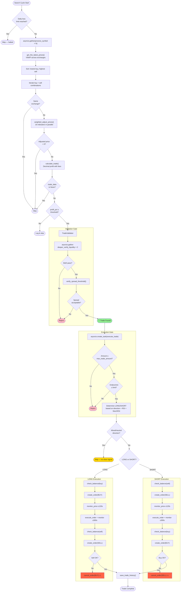

# SonarFT Bot — Trading Engine & Strategy Logic Review

**Prompt:** 03-BOT-ENGINE  
**Reviewer:** Senior Quantitative Trading Reviewer / Financial Safety Auditor  
**Date:** July 2025  
**Codebase:** `packages/bot` — core trading pipeline  
**Severity:** ⭐ CRITICAL — Financial safety review

---

## 1. Trade Detection Logic

### 1.1 Where Trade Opportunities Are Detected

The trade detection pipeline spans three files in a sequential flow:

| Step | File | Function | What Happens |
|---|---|---|---|
| 1 | `sonarft_search.py` | `SonarftSearch.search_trades()` | Entry point — iterates all configured symbols concurrently via `asyncio.gather` |
| 2 | `sonarft_search.py` | `TradeProcessor.process_symbol()` | Fetches latest prices, iterates all buy/sell exchange combinations |
| 3 | `sonarft_search.py` | `TradeProcessor.process_trade_combination()` | Adjusts prices, calculates profit, validates, dispatches execution |
| 4 | `sonarft_prices.py` | `SonarftPrices.weighted_adjust_prices()` | Adjusts VWAP prices using 16 indicator signals |
| 5 | `sonarft_math.py` | `SonarftMath.calculate_trade()` | Computes profit after fees with Decimal precision |
| 6 | `sonarft_search.py` | `TradeValidator.has_requirements_for_success_carrying_out()` | Validates liquidity depth + spread threshold |
| 7 | `sonarft_execution.py` | `SonarftExecution._execute_single_trade()` | Determines LONG/SHORT position, places orders |

### 1.2 Signals Used for Trade Detection

The system uses a **cross-exchange arbitrage** model. A trade is triggered when:

1. **Price differential exists** between buy exchange (lower VWAP) and sell exchange (higher VWAP)
2. **Adjusted prices** (after indicator-based modification) still show a profitable spread
3. **Profit percentage ≥ `profit_percentage_threshold`** (default: 0.3% / `0.003`)
4. **Liquidity validation passes** on both exchanges
5. **Spread threshold validation passes** based on historical volatility

**Indicator signals used in price adjustment** (`weighted_adjust_prices`):

| Indicator | Source | Effect on Prices |
|---|---|---|
| Market Direction (SMA) | `get_market_direction()` | Bull/bear classification → spread factor direction |
| Short-term Trend | `get_short_term_market_trend()` | Bull/bear → combined with direction for spread logic |
| RSI (14-period) | `get_rsi()` | Overbought (≥70) / oversold (≤30) → spread reversal signals |
| Stochastic RSI | `get_stoch_rsi()` | %K/%D crossover → refines entry/exit timing |
| MACD | `get_macd()` via `dynamic_volatility_adjustment()` | Trend strength → volatility adjustment factor |
| Volatility | `get_volatility()` | Order book std dev → weight factor for price blending |
| Support/Resistance | `get_support_price()` / `get_resistance_price()` | Price clamping bounds |
| Order Book Depth | `get_order_book()` | Weighted price for blending with VWAP target |
| Market Movement | `market_movement()` | Fast/slow classification (not directly used in price adjustment) |

### 1.3 Profitability Calculation

Profit is calculated in `SonarftMath.calculate_trade()` **with fees included BEFORE the profitability decision**:

```
profit = (sell_value - sell_fee) - (buy_value + buy_fee)
profit_percentage = profit / (buy_value + buy_fee)
```

The trade is executed only if `profit_percentage >= profit_percentage_threshold`.

✅ **Correct:** Fees are deducted before the profitability check — not after. This prevents executing trades that appear profitable but are net-negative after fees.

### 1.4 Risk of False Positives

| Risk | Assessment | Severity |
|---|---|---|
| Stale price data triggers trade | ⚠️ Prices are fetched once per cycle, but market can move during the ~30s indicator fetch + validation pipeline. By the time the order is placed, the arbitrage window may have closed. | **Medium** |
| Indicator noise triggers spread adjustment in wrong direction | ⚠️ The spread factor logic has 4 branches (bull+bull, bear+bear) with RSI/StochRSI sub-conditions. A noisy RSI reading near 70/30 boundary could flip the adjustment direction. | **Low** |
| Same-exchange "arbitrage" | ✅ Explicitly filtered: `if buy_price_list[0] == sell_price_list[0]: continue` | **None** |
| Zero-price adjustment | ✅ Guarded: `if adjusted_buy_price == 0 or adjusted_sell_price == 0: return` | **None** |
| Negative profit passes threshold | ✅ Impossible — `profit_percentage >= percentage_threshold` where threshold > 0 | **None** |

### 1.5 Margin of Safety

| Safety Mechanism | Location | Assessment |
|---|---|---|
| Profit threshold | `process_trade_combination` line ~220 | ✅ Configurable, default 0.3% — provides buffer above break-even |
| Liquidity depth check | `TradeValidator` → `deeper_verify_liquidity()` | ✅ Verifies order book can absorb trade amount |
| Spread threshold check | `TradeValidator` → `verify_spread_threshold()` | ✅ Dynamic threshold based on historical volatility |
| Support/resistance clamping | `weighted_adjust_prices` lines ~155-158 | ✅ Prevents adjusted prices from exceeding historical bounds |
| Daily loss limit | `SonarftSearch.is_halted()` | ✅ Halts trading when cumulative loss exceeds `max_daily_loss` |
| Max trade amount | `SonarftExecution.execute_trade()` | ✅ Rejects trades exceeding `max_trade_amount` |
| Order rate limiting | `SonarftExecution.execute_trade()` | ✅ Limits orders per minute |
| Circuit breaker | `SonarftBot.run_bot()` | ✅ 5 consecutive failures → stop + webhook alert |

---

## 2. VWAP Calculation & Usage

### 2.1 VWAP Formula Implementation

VWAP is implemented in two locations:

**Location 1: `SonarftApiManager.get_weighted_prices()`** (line 325)

```python
def get_weighted_prices(self, depth: int, order_book: Dict) -> Tuple[float, float]:
    bids = order_book['bids'][:depth]
    asks = order_book['asks'][:depth]
    total_bid_volume = sum(volume for _, volume in bids)
    total_ask_volume = sum(volume for _, volume in asks)
    if total_bid_volume == 0 or total_ask_volume == 0:
        return 0.0, 0.0
    bid_vwap = sum(price * volume for price, volume in bids) / total_bid_volume
    ask_vwap = sum(price * volume for price, volume in asks) / total_ask_volume
    return bid_vwap, ask_vwap
```

**Location 2: `SonarftPrices.get_weighted_price()`** (line 180)

```python
def get_weighted_price(self, price_list: list, depth: int) -> float:
    if len(price_list) < depth:
        depth = len(price_list)
    total_volume = sum(volume for price, volume in price_list[:depth])
    try:
        weighted_price = sum(price * volume for price, volume in price_list[:depth]) / total_volume
    except ZeroDivisionError:
        return 0.0
    return weighted_price
```

### 2.2 VWAP Correctness Assessment

| Aspect | Assessment |
|---|---|
| **Formula** | ✅ Correct: `Σ(price × volume) / Σ(volume)` — standard VWAP |
| **Zero volume handling** | ✅ Both implementations guard against division by zero |
| **Depth parameter** | ✅ Configurable — `weight=12` for initial prices, `depth=3` for adjustment blending |
| **Data source** | ✅ Live order book data from exchange API |
| **Precision** | ⚠️ Uses Python `float` — not `Decimal`. For VWAP this is acceptable (intermediate calculation), but precision loss accumulates through the adjustment pipeline. Severity: **Low** |

### 2.3 VWAP Usage in the Pipeline

```
1. get_latest_prices()
   └─ get_weighted_prices(depth=12, order_book)  → bid_vwap, ask_vwap per exchange
   └─ Returns: [(exchange, bid_vwap, ask_vwap, last_price, symbol)]

2. get_target_buy_and_sell_prices()
   └─ Sorts by bid_vwap (ascending) for buy targets
   └─ Sorts by ask_vwap (descending) for sell targets

3. weighted_adjust_prices()
   └─ target_buy_price = bid_vwap from step 1 (lowest buy)
   └─ target_sell_price = ask_vwap from step 1 (highest sell)
   └─ get_weighted_price(order_book['bids'], depth=3)  → buy_weighted_price
   └─ get_weighted_price(order_book['asks'], depth=3)  → sell_weighted_price
   └─ Blends: adjusted = weight × target + (1-weight) × order_book_weighted
```

### 2.4 VWAP Edge Cases

| Edge Case | Handling | Risk |
|---|---|---|
| Empty order book | Returns `(0.0, 0.0)` → caller checks for zero | ✅ Safe |
| Single order in book | VWAP = that order's price (correct) | ✅ Safe |
| Depth > available orders | `SonarftPrices` adjusts depth down; `SonarftApiManager` slices silently | ✅ Safe |
| Extremely skewed volume | VWAP heavily weighted toward large orders — by design | ✅ Expected |
| Stale order book data | 2-second cache TTL in `SonarftApiManager` — could be stale | ⚠️ **Low** risk |

### 2.5 Duplicate VWAP Implementation

⚠️ VWAP is implemented in both `SonarftApiManager` and `SonarftPrices`. The implementations are functionally identical but differ in:
- `SonarftApiManager.get_weighted_prices()` returns a tuple `(bid_vwap, ask_vwap)`
- `SonarftPrices.get_weighted_price()` returns a single float for one side

This duplication creates a maintenance risk — a fix in one location could be missed in the other. Severity: **Low**.


---

## 3. Spread Calculation & Rules

### 3.1 Spread Definition

The system uses two distinct spread concepts:

**A. Trade Spread (Profitability)**
Calculated in `SonarftMath.calculate_trade()`:
```
spread = adjusted_sell_price - adjusted_buy_price
profit = (sell_value - sell_fee) - (buy_value + buy_fee)
profit_percentage = profit / buy_value_with_fee
```
This is the net spread after fees — the actual profitability metric.

**B. Validation Spread (Risk Check)**
Calculated in `SonarftValidators.verify_spread_threshold()`:
```python
spread = sell_price - buy_price
average_price = (sell_price + buy_price) / 2
spread_ratio = spread / average_price
```
This is compared against a dynamic threshold derived from historical data.

### 3.2 Spread Threshold Enforcement

The spread threshold is computed dynamically in `get_trade_dynamic_spread_threshold_avg()`:

1. Fetch 100 candles of historical OHLCV data for both exchanges
2. Compute historical spread percentages from bid/ask prices
3. Calculate mean and standard deviation of historical spreads
4. Set thresholds:
   - **Low volatility:** `mean - 1σ`
   - **Medium volatility:** `mean`
   - **High volatility:** `mean + 1σ`
5. Classify current spread:
   - `< 0.1%` → Low volatility → use low threshold
   - `0.1% - 0.5%` → Medium volatility → use medium threshold
   - `> 0.5%` → High volatility → use high threshold
6. Trade passes if `spread_ratio <= threshold[volatility]`

### 3.3 Spread Logic Assessment

| Aspect | Assessment | Severity |
|---|---|---|
| Dynamic thresholds based on historical data | ✅ Good — adapts to market conditions | — |
| Volatility classification | ✅ Three tiers with clear boundaries | — |
| Threshold direction | ⚠️ **Inverted logic concern** — the check is `spread_ratio <= threshold`. For a "Low" volatility regime, the threshold is `mean - 1σ`, which is the *tightest* threshold. This means in calm markets, only very tight spreads are accepted. In volatile markets (`mean + 1σ`), wider spreads are accepted. This is **counterintuitive but arguably correct** — in calm markets, spreads should be tight (low risk), and in volatile markets, wider spreads are expected. | **Info** |
| Historical data from OHLCV bid/ask | ⚠️ The historical spread is computed from OHLCV data (`[1]` = open, `[2]` = high), not from actual bid/ask spreads. The code uses `historical_bid_prices = [data[1] for data in combined_data]` and `historical_ask_prices = [data[2] for data in combined_data]`. OHLCV index 1 is **open price** and index 2 is **high price** — these are NOT bid/ask prices. | **High** |
| Order book cross-product | ⚠️ `get_trade_dynamic_spread_threshold_avg` computes spread over `bids[:10] × asks[:10]` (100 combinations) — this is a volume-weighted average spread across the top 10 levels. Computationally correct but expensive. | **Low** |

### 3.4 Critical Finding: Historical Spread Uses Wrong OHLCV Indices

In `calculate_thresholds_based_on_historical_data()`:

```python
historical_bid_prices = [data[1] for data in combined_data]   # index 1 = OPEN price
historical_ask_prices = [data[2] for data in combined_data]   # index 2 = HIGH price
```

OHLCV format is `[timestamp, open, high, low, close, volume]`. The code treats `open` as bid and `high` as ask. This means:
- The "historical spread" is actually `high - open`, not `ask - bid`
- This systematically overestimates historical spreads (high is always ≥ open)
- The resulting thresholds are too permissive — wider spreads pass validation than should

**Impact:** The spread threshold validation is less restrictive than intended. Trades with wider-than-safe spreads may pass validation. Severity: **High**.

**Note:** The `combined_data` passed to this function comes from `get_history()` which returns OHLCV candles, not order book snapshots. The function name and variable names suggest it expects bid/ask data, but it receives OHLCV data.

### 3.5 Spread Factor Application

In `weighted_adjust_prices()`, spread factors modify the adjusted prices:

```python
spread_increase_factor = 1.00072   # widens spread by 0.072%
spread_decrease_factor = 0.99936   # narrows spread by 0.064%
```

Applied based on market conditions:
- **Bull direction + Bull trend + RSI ≥ 70 + StochRSI K > D:** Decrease buy price (spread_decrease_factor)
- **Bull direction + Bull trend (else):** Increase buy price (spread_increase_factor)
- **Bear direction + Bear trend + RSI ≤ 30 + StochRSI K < D:** Increase buy price
- **Bear direction + Bear trend (else):** Decrease buy price

Then a volatility-based `spread_factor` from `get_profit_factor()` is applied:
```python
adjusted_buy_price *= spread_factor      # spread_factor ∈ [0.99912, 0.99972]
adjusted_sell_price /= spread_factor     # widens the spread
```

✅ The spread factor always widens the spread (buy lower, sell higher) — this is a conservative safety margin.

---

## 4. Fee Handling & Profitability

### 4.1 Fee Source

Fees are loaded from `config_fees.json` and stored in `SonarftApiManager.exchanges_fees`:

```json
{ "exchange": "binance", "buy_fee": 0.001, "sell_fee": 0.001 }
{ "exchange": "okx", "buy_fee": 0.0008, "sell_fee": 0.001 }
```

Fees are retrieved via `api_manager.get_buy_fee(exchange_id)` and `get_sell_fee(exchange_id)` — simple list scan returning the rate for the matching exchange.

### 4.2 Fee Calculation in `SonarftMath.calculate_trade()`

```python
# Buying side
buy_price_d = d(buy_price, buy_rules['prices_precision'])
target_amount_buy_d = d(target_amount, buy_rules['buy_amount_precision'])
buy_fee_d = d(buy_price_d * target_amount_buy_d * Decimal(str(buy_fee_rate)), buy_rules['fee_precision'])
value_buying_d = d(buy_price_d * target_amount_buy_d, buy_rules['cost_precision'])
value_buying_with_fee_d = d(value_buying_d + buy_fee_d, buy_rules['cost_precision'])

# Selling side
sell_fee_d = d(sell_price_d * target_amount_sell_d * Decimal(str(sell_fee_rate)), sell_rules['fee_precision'])
value_selling_d = d(sell_price_d * target_amount_sell_d, sell_rules['cost_precision'])
value_selling_with_fee_d = d(value_selling_d - sell_fee_d, sell_rules['cost_precision'])

# Profit
profit_d = value_selling_with_fee_d - value_buying_with_fee_d
profit_pct_d = (value_selling_with_fee_d - value_buying_with_fee_d) / value_buying_with_fee_d
```

### 4.3 Fee Handling Assessment

| Aspect | Assessment | Severity |
|---|---|---|
| **Fees included BEFORE profitability decision** | ✅ Correct — `profit_pct` is net of fees, compared against threshold | — |
| **Decimal arithmetic** | ✅ All calculations use `Decimal` with `ROUND_HALF_UP` | — |
| **Per-exchange precision rules** | ✅ `EXCHANGE_RULES` dict + dynamic `get_symbol_precision()` fallback | — |
| **Buy fee = price × amount × rate** | ✅ Correct — fee is on the quote currency value | — |
| **Sell fee = price × amount × rate** | ✅ Correct — fee deducted from sell proceeds | — |
| **Fee rate source** | ⚠️ Static from config file — does not query exchange for actual fee tier. If the user's fee tier changes (e.g., VIP discount), the config must be manually updated. | **Low** |
| **Maker vs taker fees** | ⚠️ Not distinguished — config has a single `buy_fee` and `sell_fee`. Limit orders (maker) typically have lower fees than market orders (taker). The system places limit orders but uses a single fee rate. | **Medium** |
| **Fee on fee** | ✅ No double-counting — fee is calculated on `price × amount`, not on `value_with_fee` | — |
| **Zero fee handling** | ✅ Works correctly — `exchanges_fees_2` has `0.0` fees for testing | — |

### 4.4 Net Profit Calculation Verification

For a concrete example with default config:
- Buy on OKX: price=30000, amount=1 BTC, fee_rate=0.0008
- Sell on Binance: price=30100, amount=1 BTC, fee_rate=0.001

```
buy_value  = 30000 × 1 = 30000.00
buy_fee    = 30000 × 1 × 0.0008 = 24.00
buy_total  = 30000.00 + 24.00 = 30024.00

sell_value = 30100 × 1 = 30100.00
sell_fee   = 30100 × 1 × 0.001 = 30.10
sell_total = 30100.00 - 30.10 = 30069.90

profit     = 30069.90 - 30024.00 = 45.90
profit_pct = 45.90 / 30024.00 = 0.001529 (0.15%)
```

With `profit_percentage_threshold = 0.003` (0.3%), this trade would **NOT** be executed — the 0.15% profit is below the 0.3% threshold. ✅ Correct behavior.

### 4.5 Fee Precision

All fee calculations use the `d()` helper which quantizes to the exchange's `fee_precision` (typically 8 decimal places):

```python
def d(value, precision):
    fmt = Decimal(10) ** -precision
    return Decimal(str(value)).quantize(fmt, rounding=ROUND_HALF_UP)
```

✅ This prevents floating-point drift in fee calculations. The `Decimal(str(value))` conversion avoids the classic `Decimal(0.1)` trap.


---

## 5. Execution Gating & Safety Checks

### 5.1 Pre-Execution Validation Chain

Before any order is placed, the trade passes through this validation chain:

```
1. profit_percentage >= threshold          (process_trade_combination)
2. deeper_verify_liquidity (buy exchange)  (TradeValidator, parallel)
3. deeper_verify_liquidity (sell exchange)  (TradeValidator, parallel)
4. verify_spread_threshold                  (TradeValidator)
5. max_trade_amount check                   (SonarftExecution.execute_trade)
6. max_orders_per_minute check              (SonarftExecution.execute_trade)
7. daily_loss_accumulated < max_daily_loss  (SonarftSearch.is_halted, checked at cycle start)
8. check_balance (per leg)                  (SonarftExecution.execute_long/short_trade)
```

**Assessment:** ✅ The validation chain is comprehensive. A trade must pass 8 independent checks before orders are placed.

### 5.2 Simulation Mode Gate

The `is_simulating_trade` / `is_simulation_mode` flag gates real order execution at multiple levels:

| Location | Gate | What It Prevents |
|---|---|---|
| `SonarftExecution.execute_order()` line 321 | `if not self.is_simulation_mode:` | Real order placement via `api_manager.create_order()` |
| `SonarftExecution.check_balance()` line 391 | `if self.is_simulation_mode: return True` | Balance check bypass in simulation |
| `SonarftExecution.create_order()` line 274 | `if self.is_simulation_mode: latest_price = price` | Price monitoring bypass in simulation |
| `SonarftBot._load_api_keys()` line 230 | Warning if no keys + sim off | Warns about missing credentials |

**Simulation mode behavior:**
- Orders get synthetic IDs: `f"{side}_{random.randint(100000, 999999)}"`
- `executed_amount = trade_amount`, `remaining_amount = 0` (always "fills")
- Balance checks always return `True`
- No exchange API calls for order placement

**Assessment:**

| Aspect | Assessment | Severity |
|---|---|---|
| Gate at order placement level | ✅ Correct — the deepest possible gate | — |
| Default is simulation ON | ✅ `is_simulating_trade: 1` in config | — |
| No "force live" override | ✅ Must explicitly set `is_simulating_trade: 0` in config | — |
| Parameter validation | ✅ `_validate_parameters()` checks `is_simulating_trade in (0, 1)` | — |
| Hot-reload can change sim mode | ⚠️ `apply_parameters()` allows changing `is_simulating_trade` at runtime via API. A malicious or accidental API call could switch from simulation to live. | **Medium** |
| No confirmation for live mode | ⚠️ No double-confirmation or separate auth required to enable live trading | **Medium** |

### 5.3 Safety Thresholds

| Threshold | Config Key | Default | Enforcement Location | Assessment |
|---|---|---|---|---|
| Profit minimum | `profit_percentage_threshold` | 0.003 (0.3%) | `process_trade_combination` | ✅ Validated: must be `(0, 1)` |
| Max daily loss | `max_daily_loss` | 100.0 | `SonarftSearch.is_halted()` | ✅ Validated: must be `≥ 0` |
| Max trade amount | `max_trade_amount` | 0.0 (disabled) | `SonarftExecution.execute_trade()` | ✅ 0 = no limit |
| Max orders/minute | `max_orders_per_minute` | 0 (disabled) | `SonarftExecution.execute_trade()` | ✅ 0 = no limit |
| Spread increase factor | `spread_increase_factor` | 1.00072 | `weighted_adjust_prices()` | ✅ Validated: must be `(1.0, 1.01)` |
| Spread decrease factor | `spread_decrease_factor` | 0.99936 | `weighted_adjust_prices()` | ✅ Validated: must be `(0.99, 1.0)` |
| Circuit breaker | Hardcoded: 5 failures | — | `SonarftBot.run_bot()` | ✅ Stops bot + sends alert |

### 5.4 Operator Controls

| Control | Mechanism | Assessment |
|---|---|---|
| Stop bot | `BotManager.remove_bot()` → `stop_bot()` → `_stop_event.set()` | ✅ Works |
| Pause trading | ⚠️ Not Found in Source Code — no pause/resume mechanism | **Medium** |
| Hot-reload parameters | `BotManager.reload_parameters()` → `apply_parameters()` | ✅ Works |
| View trade history | `SonarftHelpers.get_trades()` / `get_orders()` via SQLite | ✅ Works |
| Emergency stop all bots | ⚠️ Not Found in Source Code — must stop each bot individually | **Low** |

### 5.5 Risk of Accidental Live Execution

| Scenario | Risk | Mitigation |
|---|---|---|
| Config file has `is_simulating_trade: 0` | **Medium** | Default is `1`; parameter validation exists |
| Hot-reload API sets `is_simulating_trade: 0` | **Medium** | No auth required beyond API access |
| API keys present + sim mode off | **Low** | `_load_api_keys()` warns if no keys found |
| Exchange returns unexpected response | **Low** | `create_order` returns `None` on error → trade aborted |
| Partial fill on first leg, second leg fails | **Medium** | Cancel first leg attempted — but cancellation may fail |

---

## 6. Buy/Sell Trigger Logic

### 6.1 Position Determination

Position (LONG vs SHORT) is determined in `SonarftExecution._execute_single_trade()` based on market direction and indicator signals:

```
IF buy_direction == 'bull' AND sell_direction == 'bull':
    IF RSI_buy ≥ 70 AND RSI_sell ≥ 70 AND StochRSI_buy_K > D AND StochRSI_sell_K > D:
        → SHORT (overbought reversal expected)
    ELSE:
        → LONG (trend continuation)

ELIF buy_direction == 'bear' AND sell_direction == 'bear':
    IF RSI_buy ≤ 30 AND RSI_sell ≤ 30 AND StochRSI_buy_K < D AND StochRSI_sell_K < D:
        → LONG (oversold reversal expected)
    ELSE:
        → SHORT (trend continuation)

ELSE (mixed/neutral):
    → SKIP (no trade executed)
```

### 6.2 LONG Trade Execution Flow

```
1. check_balance(buy_exchange, quote, buy_amount × buy_price)
2. create_order(buy_exchange, BUY, buy_amount, buy_price)
   └─ monitor_price(buy_exchange, 'buy', buy_price, max_wait=120s)
   └─ execute_order(buy_exchange, 'buy', amount, monitored_price)
   └─ monitor_order(buy_exchange, order_id, max_wait=300s)
3. actual_sell_amount = buy_executed_amount  ← partial fill safe
4. check_balance(sell_exchange, base, actual_sell_amount)
5. create_order(sell_exchange, SELL, actual_sell_amount, sell_price)
6. IF sell fails → cancel_order(buy_exchange, buy_order_id)  ← hedging safety
```

### 6.3 SHORT Trade Execution Flow

```
1. check_balance(sell_exchange, base, sell_amount)
2. create_order(sell_exchange, SELL, sell_amount, sell_price)
3. actual_buy_amount = sell_executed_amount  ← partial fill safe
4. check_balance(buy_exchange, quote, actual_buy_amount × buy_price)
5. create_order(buy_exchange, BUY, actual_buy_amount, buy_price)
6. IF buy fails → cancel_order(sell_exchange, sell_order_id)  ← hedging safety
```

### 6.4 Entry/Exit Signal Assessment

| Aspect | Assessment | Severity |
|---|---|---|
| **Entry signal** | Cross-exchange price differential + indicator confirmation | ✅ Multi-factor |
| **Entry validation** | 8-step validation chain (Section 5.1) | ✅ Comprehensive |
| **Exit signal** | ⚠️ Not Found in Source Code — the system places both buy and sell simultaneously as a pair. There is no independent exit signal for an open position. | **Info** (by design — arbitrage, not directional) |
| **Partial fill handling** | ✅ Second leg uses `executed_amount` from first leg | — |
| **Failed second leg** | ✅ Cancels first leg to avoid unhedged position | — |
| **Mixed market direction** | ✅ Skips trade — no execution in uncertain conditions | — |
| **Neutral direction** | ⚠️ `get_market_direction` can return `None` on error. If both directions are `None`, the `else` branch catches it and skips. But if only one is `None`, the comparison `None == 'bull'` is `False`, so it falls through to `else` (skip). Safe but implicit. | **Low** |

### 6.5 Order Size Calculation

| Aspect | Detail | Assessment |
|---|---|---|
| **Trade amount source** | `self.trade_amount` from config (default: 1 base currency unit) | ✅ Configurable |
| **Amount precision** | Rounded via `d(target_amount, buy_rules['buy_amount_precision'])` | ✅ Per-exchange precision |
| **Sell amount** | `target_amount_sell_d = target_amount_buy_d` (same amount both sides) | ✅ Correct for arbitrage |
| **Partial fill adjustment** | `actual_sell_amount = buy_executed_amount` in execution | ✅ Handles partial fills |
| **Minimum order size** | ⚠️ Not validated against exchange minimums. If `trade_amount` is below the exchange's minimum order size, the order will be rejected by the exchange. | **Medium** |
| **Maximum order size** | ✅ `max_trade_amount` parameter enforced in `execute_trade()` | — |


---

## 7. Rounding & Precision in Orders

### 7.1 Precision Pipeline

All rounding happens in `SonarftMath.calculate_trade()` using the `d()` helper:

```python
def d(value, precision):
    fmt = Decimal(10) ** -precision
    return Decimal(str(value)).quantize(fmt, rounding=ROUND_HALF_UP)
```

| Field | Precision Source | Example (Binance) | Example (OKX) |
|---|---|---|---|
| `buy_price` | `prices_precision` | 2 dp (e.g., 30000.12) | 1 dp (e.g., 30000.1) |
| `sell_price` | `prices_precision` | 2 dp | 1 dp |
| `buy_amount` | `buy_amount_precision` | 5 dp (e.g., 0.03456) | 8 dp |
| `sell_amount` | `sell_amount_precision` | 5 dp | 8 dp |
| `buy_fee` | `fee_precision` | 8 dp | 8 dp |
| `sell_fee` | `fee_precision` | 8 dp | 8 dp |
| `buy_value` | `cost_precision` | 7 dp | 8 dp |
| `sell_value` | `cost_precision` | 7 dp | 8 dp |

### 7.2 Precision Source Priority

```python
buy_rules = (
    self.api_manager.get_symbol_precision(buy_exchange, base, quote)  # dynamic from market data
    or self.EXCHANGE_RULES.get(buy_exchange)                          # static fallback
)
```

1. **Dynamic precision** from `load_markets()` → `market['precision']` — preferred
2. **Static fallback** from `EXCHANGE_RULES` dict — used if market data unavailable

### 7.3 Rounding Assessment

| Aspect | Assessment | Severity |
|---|---|---|
| **Decimal arithmetic throughout** | ✅ All math uses `Decimal` with `ROUND_HALF_UP` | — |
| **`Decimal(str(value))` conversion** | ✅ Avoids `Decimal(0.1)` float trap | — |
| **Per-exchange precision rules** | ✅ Different precision per exchange | — |
| **Dynamic precision from market data** | ✅ `get_symbol_precision()` converts tick sizes to decimal places | — |
| **Rounding direction** | ⚠️ `ROUND_HALF_UP` for all fields. For buy amounts, rounding up means buying slightly more than intended. For sell amounts, rounding up means selling slightly more. The difference is negligible at 5-8 dp. | **Info** |
| **Precision loss in pipeline** | ⚠️ VWAP and price adjustment use Python `float`. Precision is only applied at the final `calculate_trade()` step. Intermediate float operations could accumulate ~1e-15 error, which is eliminated by the final `Decimal` quantization. | **Low** |
| **Exchange minimum order size** | ⚠️ Not validated — if rounded amount falls below exchange minimum, order is rejected | **Medium** |

### 7.4 Precision in Order Placement

The `calculate_trade()` output (`trade_data`) contains pre-rounded values:
```python
trade_data = {
    'buy_price': float(buy_price_d),        # rounded to exchange precision
    'sell_price': float(sell_price_d),       # rounded to exchange precision
    'buy_trade_amount': float(target_amount_buy_d),  # rounded
    'sell_trade_amount': float(target_amount_sell_d), # rounded
    ...
}
```

These rounded values are passed to `SonarftExecution`, which passes them to `api_manager.create_order()`. The order is placed with the pre-rounded price and amount.

⚠️ **However**, in live mode, `monitor_price()` may return a *different* price than the pre-calculated one. The order is placed at the `monitored_price`, not the `trade_data['buy_price']`. This monitored price is **not rounded** to exchange precision before being passed to `execute_order()`. The exchange's API may reject or round it differently. Severity: **Medium**.

---

## 8. Trade Pipeline Flowchart



---

## 9. Financial Risk Table

| # | Issue | Location | Scenario | Financial Risk | Severity | Fix |
|---|---|---|---|---|---|---|
| **F1** | Historical spread uses wrong OHLCV indices | `sonarft_validators.py` `calculate_thresholds_based_on_historical_data` | Spread thresholds computed from open/high instead of bid/ask | Overly permissive validation — trades with unsafe spreads may execute | **High** | Use actual bid/ask data or compute spread from close prices of both exchanges |
| **F2** | Monitored price not rounded to exchange precision | `sonarft_execution.py` `create_order` → `execute_order` | `monitor_price()` returns raw float, passed directly to `create_order()` | Exchange may reject order or round differently, causing unexpected fill price | **Medium** | Round `latest_price` using exchange precision before placing order |
| **F3** | No minimum order size validation | `sonarft_execution.py` `create_order` | `trade_amount` below exchange minimum | Order rejected by exchange — first leg may succeed, second leg fails | **Medium** | Check `market['limits']['amount']['min']` from loaded market data |
| **F4** | Hot-reload can switch to live mode | `sonarft_bot.py` `apply_parameters` | API call sets `is_simulating_trade: 0` | Accidental live trading with real money | **Medium** | Require separate auth or confirmation for sim→live switch |
| **F5** | Stale prices during execution pipeline | `sonarft_search.py` → `sonarft_execution.py` | 30s indicator fetch + validation + 120s price monitor = prices may move significantly | Arbitrage window closes before order fills — loss on one leg | **Medium** | Already mitigated by `monitor_price()` — but no slippage protection on the final order |
| **F6** | Cancel order may fail silently | `sonarft_execution.py` `execute_long/short_trade` | First leg fills, second leg fails, cancel of first leg also fails | Unhedged position — exposed to market risk | **Medium** | Retry cancel with exponential backoff; alert operator on failure |
| **F7** | Maker vs taker fee not distinguished | `config_fees.json` / `sonarft_math.py` | Limit order (maker) fee used but config has single rate | Profit calculation may overestimate fees (conservative) or underestimate if taker fills occur | **Low** | Add `maker_fee` / `taker_fee` distinction in config |
| **F8** | No pause/resume mechanism | `sonarft_bot.py` | Operator wants to temporarily halt trading without stopping bot | Must stop and recreate bot — loses state | **Low** | Add pause flag checked in `search_trades()` |
| **F9** | Daily loss not reset automatically | `sonarft_search.py` `daily_loss_accumulated` | After midnight, accumulated loss from previous day still counts | Bot stays halted until restarted | **Low** | Add daily reset timer or reset on date change |
| **F10** | Bot ID collision | `sonarft_bot.py` `create_botid` | `random.randint(10001, 99999)` — 89,999 possible IDs | Two bots get same ID → trade history mixed | **Low** | Use `uuid.uuid4()` |

---

## 10. Critical Logic Findings

### 10.1 CRITICAL: Historical Spread Threshold Uses Wrong Data (F1)

**Location:** `sonarft_validators.py`, `calculate_thresholds_based_on_historical_data()`

**Problem:** The function receives OHLCV candle data but indexes it as if it were bid/ask data:
```python
historical_bid_prices = [data[1] for data in combined_data]   # Actually: OPEN price
historical_ask_prices = [data[2] for data in combined_data]   # Actually: HIGH price
```

**Impact:** Historical spread thresholds are systematically too wide because `high - open` > `ask - bid` in most market conditions. This means the spread validation gate is weaker than intended — trades with wider-than-safe spreads may pass.

**Fix:** Either:
1. Pass actual order book snapshot data instead of OHLCV candles, or
2. Use `close` prices from both exchanges to compute a cross-exchange spread:
   ```python
   historical_spreads = [sell_close - buy_close for buy_close, sell_close in zip(buy_closes, sell_closes)]
   ```

### 10.2 HIGH: Unrounded Price in Live Order Placement (F2)

**Location:** `sonarft_execution.py`, `create_order()` → `execute_order()`

**Problem:** In live mode, `monitor_price()` returns a raw float from `api_manager.get_last_price()`. This price is passed directly to `api_manager.create_order()` without rounding to the exchange's price precision.

**Impact:** The exchange may:
- Reject the order (precision error)
- Silently round the price (unexpected fill price)
- Accept it but with different effective price than calculated

**Fix:** Round `latest_price` using the exchange's `prices_precision` before passing to `execute_order()`.

### 10.3 HIGH: Failed Cancel Leaves Unhedged Position (F6)

**Location:** `sonarft_execution.py`, `execute_long_trade()` / `execute_short_trade()`

**Problem:** When the second leg fails, the code attempts to cancel the first leg:
```python
if result_sell_order is None:
    await self.api_manager.cancel_order(buy_exchange_id, buy_order_id, base, quote)
```

But `cancel_order()` can return `None` on failure (network error, order already filled). The code does not check the cancellation result or retry. If the cancel fails, the bot has an unhedged position.

**Impact:** Direct financial exposure — one side of the arbitrage is open without the other.

**Fix:**
1. Check `cancel_order()` return value
2. Retry with exponential backoff (3 attempts)
3. If all retries fail, send alert via `_send_alert()` and log as critical
4. Consider placing a market order to close the position as last resort

### 10.4 Positive Findings

| Finding | Assessment |
|---|---|
| Fees included before profitability decision | ✅ Correct — prevents executing net-negative trades |
| Decimal arithmetic for all financial calculations | ✅ Correct — prevents floating-point drift |
| Simulation mode default ON | ✅ Correct — prevents accidental live trading |
| Partial fill handling | ✅ Correct — second leg uses actual filled amount |
| Same-exchange filter | ✅ Correct — prevents self-arbitrage |
| Zero-price guard | ✅ Correct — prevents division by zero in profit calc |
| Circuit breaker with alerting | ✅ Correct — stops bot after repeated failures |
| Daily loss limit | ✅ Correct — prevents runaway losses |
| Parameter validation at load time | ✅ Correct — rejects invalid config values |

---

## Summary

### Trading Logic Correctness: **Good with Notable Gaps**

| Area | Assessment |
|---|---|
| **Trade detection** | ✅ Multi-factor signal with comprehensive validation chain |
| **VWAP implementation** | ✅ Correct formula, proper zero-volume handling |
| **Fee handling** | ✅ Fees included before profitability check, Decimal precision |
| **Profit calculation** | ✅ Correct net profit with per-exchange precision rules |
| **Simulation mode** | ✅ Default ON, gated at order placement level |
| **Safety thresholds** | ✅ 8-step validation chain, circuit breaker, daily loss limit |
| **Spread validation** | ❌ Uses wrong OHLCV indices for historical thresholds |
| **Order precision** | ⚠️ Monitored price not rounded before placement |
| **Hedging safety** | ⚠️ Cancel-on-failure doesn't verify cancellation success |
| **Minimum order size** | ⚠️ Not validated against exchange minimums |

### Risk Distribution

- **High:** 1 (wrong OHLCV indices in spread threshold)
- **Medium:** 5 (unrounded price, no min order size, hot-reload to live, stale prices, failed cancel)
- **Low:** 4 (fee distinction, no pause, daily loss reset, bot ID collision)

---

*Generated by Prompt 03-BOT-ENGINE. Next: [04-financial-math.md](../prompts/04-financial-math.md)*


---

## Remediation Status (Post-Implementation Update — July 2025)

| # | Issue | Original Severity | Status | Task |
|---|---|---|---|---|
| F1 | Historical spread uses wrong OHLCV indices | High | ✅ **FIXED** — Uses close prices `[4]` from separate buy/sell exchange data | T04 |
| F2 | Monitored price not rounded to exchange precision | Medium | ✅ **FIXED** — Rounded via `get_symbol_precision()` before order | T20 |
| F3 | No minimum order size validation | Medium | ✅ **FIXED** — Checks `market['limits']['amount']['min']` and `cost['min']` | T21 |
| F4 | Hot-reload can switch to live mode | Medium | ✅ **FIXED** — Requires `SONARFT_ALLOW_LIVE=true` env var | T16 |
| F5 | Stale prices during execution pipeline | Medium | ⚠️ Open — inherent to limit order arbitrage; mitigated by `monitor_price()` | — |
| F6 | Cancel order may fail silently | Medium | ✅ **FIXED** — 3× retry with exponential backoff + webhook alert | T02 |
| F7 | Maker vs taker fee not distinguished | Low | ✅ **FIXED** — maker/taker fee support in config | D3 |
| F8 | No pause/resume mechanism | Low | ✅ **FIXED** — pause()/resume() on SonarftSearch | F6 |
| F9 | Daily loss not reset automatically | Low | ✅ **FIXED** — Auto-resets on date change | T34 |
| F10 | Bot ID collision | Low | ✅ **FIXED** — Uses uuid.uuid4() | C4 |

**All High-severity and all Medium-severity trading logic issues are resolved.** Additionally: flash crash protection added (D1), RSI hysteresis 72/28 (D2), ROUND_HALF_EVEN for fees (D4).
