# Bot Package — Trading Engine & Strategy Logic Review

**Prompt ID:** 03-BOT-ENGINE  
**Generated:** July 2025  
**Source:** `packages/bot/` — full static analysis  
**Output File:** `docs/trading/engine-review.md`  
**Depends On:** `docs/architecture/bot-overview.md` (01), `docs/async/bot-concurrency.md` (02)

---

## 1. Trade Detection Logic

### Where opportunities are detected

The full detection pipeline spans four modules:

| Step | Module / Function | What happens |
|---|---|---|
| 1 | `SonarftSearch.search_trades` | Checks pause + daily halt gates, dispatches per-symbol |
| 2 | `TradeProcessor.process_symbol` | Fetches latest prices across all exchanges, iterates quote/exchange pairs |
| 3 | `TradeProcessor.process_trade_combination` | Adjusts prices with indicators, calculates profit, validates, dispatches |
| 4 | `TradeValidator.has_requirements_for_success_carrying_out` | Liquidity depth + spread threshold gate |
| 5 | `TradeExecutor.execute_trade` | Fire-and-forget async task dispatch |
| 6 | `SonarftExecution.execute_trade` | Risk checks (size, exposure, rate limit), position determination, order placement |

### Signals used to trigger trades

A trade is dispatched when **all** of the following are true:

1. `profit_percentage >= profit_percentage_threshold + slippage_buffer` — net profit after fees clears the threshold.
2. `deeper_verify_liquidity` passes for both buy and sell exchanges — sufficient order book depth.
3. `verify_spread_threshold` passes — current spread is above the historical volatility-adjusted threshold.
4. `_determine_position` returns `LONG` or `SHORT` (not `None`) — indicator conditions are met.
5. Flash crash check passes — price deviation between buy and sell is below `flash_crash_threshold` (default 2%).

### Indicator-driven position determination (`_determine_position`)

```
bull + bull market direction:
    if RSI_buy ≥ 70 AND RSI_sell ≥ 70 AND StochRSI_buy_k > buy_d AND StochRSI_sell_k > sell_d
        → SHORT (overbought with momentum)
    else
        → LONG

bear + bear market direction:
    if RSI_buy ≤ 30 AND RSI_sell ≤ 30 AND StochRSI_buy_k < buy_d AND StochRSI_sell_k < sell_d
        → LONG (oversold with momentum)
    else
        → SHORT

bull + bear OR bear + bull (mixed):
    → None (skip)
```

**Finding — MACD not used in position determination:** `config_indicators.json` `indicators_1` lists only `["rsi", "stoch rsi"]`. MACD is fetched in `dynamic_volatility_adjustment` (used for price weighting) but is **never used as a trade entry signal**. The `active_indicators` list controls which indicators are fetched but the position logic in `_determine_position` only reads RSI and StochRSI regardless of the active set.

**Finding — mixed market direction always skips:** When `buy_exchange` is `bull` and `sell_exchange` is `bear` (or vice versa), the trade is unconditionally skipped. This is a conservative safety choice but means cross-directional arbitrage opportunities (which are common) are never taken.

**Finding — no warm-up enforcement:** The warm-up log message in `search_trades` notes that MACD needs ~45 candles before producing valid signals. However, there is no hard gate — if RSI and StochRSI return valid values before MACD is ready, trades will execute. Since MACD is not used in `_determine_position`, this is not a current risk, but it would become one if MACD were added to the entry logic.

### Profitability calculation

```
profit_percentage = (sell_value_after_fee - buy_value_with_fee) / buy_value_with_fee
```

Fees are included **before** the threshold comparison. This is correct — the bot only trades when net-of-fee profit clears the threshold.

The effective threshold applied is:
```python
effective_threshold = percentage_threshold + slippage_buffer
```

With default config (`profit_percentage_threshold=0.0001`, `slippage_buffer=0.0002`), the effective threshold is **0.03%**. Given typical exchange fees of 0.1–0.2% per leg (0.2–0.4% round-trip), a 0.03% threshold is extremely tight. The bot will find very few opportunities in practice unless fees are near zero.

**Finding — threshold vs fee mismatch:** With Binance taker fees at 0.1% per leg, a round-trip costs ~0.2%. The `profit_percentage_threshold` of 0.0001 (0.01%) is far below the fee cost. The bot relies on the fee calculation in `calculate_trade` to produce a negative profit for unprofitable trades, which will then fail the threshold check. This is correct but means the threshold itself provides no meaningful safety margin — it is effectively `profit > 0` with a tiny buffer.

### Risk of false positives

- **Liquidity gate** (`deeper_verify_liquidity`) prevents execution when order book depth is insufficient.
- **Spread threshold gate** (`verify_spread_threshold`) prevents execution when the spread is below historical norms.
- **Flash crash gate** prevents execution when buy/sell prices diverge by more than 2%.
- **Indicator gate** (`_determine_position`) prevents execution on mixed or neutral market signals.
- **Balance check** prevents execution when funds are insufficient.

The multi-gate design is sound. The main false-positive risk is stale indicator data — if the OHLCV cache returns data from a previous cycle, indicators may reflect an outdated market state.

---

## 2. VWAP Calculation & Usage

### Implementation

```python
# models.py
def vwap(price_volume_list: list, depth: int) -> float:
    if not price_volume_list:
        return 0.0
    if len(price_volume_list) < depth:
        depth = len(price_volume_list)
    entries = price_volume_list[:depth]
    total_volume = sum(volume for _, volume in entries)
    if total_volume == 0:
        return 0.0
    return sum(price * volume for price, volume in entries) / total_volume
```

The formula is mathematically correct: `Σ(price × volume) / Σ(volume)` over the top `depth` order book levels.

### Usage in pricing

VWAP is used in two places:

| Location | Usage | Depth |
|---|---|---|
| `SonarftApiManager.get_weighted_prices` | Computes `bid_vwap` and `ask_vwap` from order book for initial price list | `weight=12` (passed from `TradeProcessor`) |
| `SonarftPrices.get_weighted_price` | Computes weighted price for indicator-driven adjustment blend | `depth=3` |

**Finding — inconsistent depth:** The initial price fetch uses `weight=12` (top 12 order book levels) while the indicator adjustment uses `depth=3` (top 3 levels). The adjustment blend formula is:

```python
adjusted_buy_price = weight * target_buy_price + (1 - weight) * buy_weighted_price
```

Here `weight` is a float between 0 and 1 computed from volatility, not the integer depth. The variable name `weight` is reused for two different concepts — the order book depth integer (12) and the volatility-derived blend factor (0–1). This is a naming collision that makes the code misleading.

### Edge cases

- Zero total volume → returns `0.0` ✅
- Empty list → returns `0.0` ✅
- List shorter than depth → clips to available length ✅
- Zero-price entries → included in calculation (could distort VWAP if exchange returns zero-price levels)

**Finding — zero-price order book entries not filtered:** If an exchange returns order book entries with `price=0` (malformed data), they are included in the VWAP calculation, pulling the result toward zero. A guard `if price > 0` should be added inside the VWAP function.

### Precision

VWAP uses native Python `float` arithmetic. The result feeds into the indicator blend formula (also float). Only at the final `calculate_trade` step is `Decimal` used. This means VWAP-derived prices carry floating-point rounding errors into the profit calculation, which then converts them to `Decimal` via `Decimal(str(value))`. The `str()` conversion is the correct way to avoid float-to-Decimal precision loss. ✅

---

## 3. Spread Calculation & Rules

### Spread definition

Two separate spread concepts exist in the codebase:

| Concept | Location | Formula |
|---|---|---|
| **Cross-exchange spread** | `verify_spread_threshold` | `(sell_price - buy_price) / avg_price × 100` |
| **Order book spread** | `deeper_verify_liquidity` | `(ask[0] - bid[0]) / bid[0]` |
| **Market movement spread** | `market_movement` | `depth_asks - depth_bids` (price sum, not ratio) |

**Finding — `market_movement` spread is dimensionally incorrect:** In `SonarftIndicators.market_movement`, the spread is computed as:

```python
depth_bids = sum([float(bid[0]) for bid in order_book['bids'][:order_book_depth]])
depth_asks = sum([float(ask[0]) for ask in order_book['asks'][:order_book_depth]])
spread = depth_asks - depth_bids
```

This sums **prices** (not volumes) and subtracts them. The result is a price-sum difference, not a meaningful spread metric. A correct implementation would sum volumes or compute a weighted mid-price spread. However, `market_movement` is not called anywhere in the current trade pipeline — it exists in `SonarftIndicators` but is never invoked by `TradeProcessor` or `SonarftPrices`. It is dead code with a logic error.

### Spread threshold enforcement

`verify_spread_threshold` computes a dynamic threshold from 100 candles of historical OHLCV data:

```
threshold_low    = mean(historical_spread%) - std(historical_spread%)
threshold_medium = mean(historical_spread%)
threshold_high   = mean(historical_spread%) + std(historical_spread%)
```

The current spread is then compared against the threshold selected by volatility bucket (Low/Medium/High). A trade proceeds only if `current_spread% >= threshold[volatility]`.

**Finding — threshold can be negative:** If historical spreads are consistently small and `std > mean`, `threshold_low` becomes negative. A negative threshold means any positive spread passes, making the low-volatility gate effectively disabled.

**Finding — spread threshold uses OHLCV close prices, not order book:** `calculate_thresholds_based_on_historical_data` uses close prices from OHLCV candles to compute cross-exchange spread. Close prices are sampled once per candle and may not reflect the actual bid/ask spread available for execution. The threshold is therefore an approximation.

### Profitability threshold vs spread

The `profit_percentage_threshold` (0.0001) is applied to net-of-fee profit, while the spread threshold is applied to gross price spread. These are independent checks — a trade can pass the spread threshold but fail the profit threshold (after fees), or vice versa. The profit threshold is the binding constraint for most trades.

---

## 4. Fee Handling & Profitability

### Fee inclusion in profit calculation

Fees are included **before** the profitability decision. The full calculation in `SonarftMath.calculate_trade`:

```
buy_cost  = buy_price × amount                          (Decimal)
buy_fee   = buy_cost × buy_fee_rate                     (Decimal, ROUND_HALF_EVEN)
total_buy = buy_cost + buy_fee

sell_revenue = sell_price × amount                      (Decimal)
sell_fee     = sell_revenue × sell_fee_rate             (Decimal, ROUND_HALF_EVEN)
net_sell     = sell_revenue - sell_fee

profit     = net_sell - total_buy
profit_pct = profit / total_buy
```

This is the correct formula. Fees are deducted on both legs before computing profit. ✅

### Fee type selection

`SonarftApiManager.get_buy_fee` / `get_sell_fee` return `maker_buy_fee` for limit orders, falling back to `buy_fee` for market orders. The bot places limit orders exclusively, so maker fees are used. This is correct — limit orders are typically charged maker fees on most exchanges.

**Finding — fee refresh uses minimum maker fee across all symbols:** `refresh_fees` in `SonarftApiManager` sets the exchange-level fee to `min(maker_fees)` across all symbols. Some symbols have higher fees (e.g. leveraged tokens, new listings). Using the minimum understates fees for those symbols, causing the bot to overestimate profit on them.

**Finding — `exchanges_fees_2` has zero fees:** `config_fees.json` contains `exchanges_fees_2` with all fees set to `0.0` for Binance. If a config accidentally references `fees_setup: 2`, the bot will calculate profit without any fee deduction, making every trade appear profitable. This is a dangerous configuration that should be removed or clearly marked as test-only.

### Fee accuracy vs exchange reality

| Exchange | Config taker fee | Actual Binance taker (BNB discount off) | Match |
|---|---|---|---|
| binance | 0.001 (0.1%) | 0.001 (0.1%) | ✅ |
| okx | 0.001 (0.1%) | 0.001 (0.1%) | ✅ |
| bitfinex | 0.002 (0.2%) | 0.002 (0.2%) | ✅ |
| binanceus | 0.006 (0.6%) | ~0.004–0.006 | ✅ approximate |

Config fees are reasonable approximations. The live `refresh_fees` mechanism will override these with actual rates at startup and every 24 hours.

### Net profit correctness

The profit calculation correctly accounts for:
- Buy fee added to cost ✅
- Sell fee subtracted from revenue ✅
- Decimal precision (28 significant figures) ✅
- Banker's rounding (ROUND_HALF_EVEN) for fees ✅
- Conversion back to float for trade dispatch ✅

**Finding — float conversion at output:** `calculate_trade` returns `float(profit_d)` and `float(profit_pct_d)`. The Decimal precision is lost at this point. The returned floats are used for the threshold comparison and stored in the trade dict. For the threshold comparison this is acceptable (the values are small and float precision is sufficient). For storage in SQLite, float is also acceptable.


---

## 5. Execution Gating & Safety Checks

### Pre-execution validation chain

```
search_trades()
  │
  ├─ [GATE 1] is_halted()
  │     ├─ max_daily_loss exceeded?  → halt
  │     └─ max_daily_trades exceeded? → halt
  │
  └─ process_trade_combination()
        │
        ├─ [GATE 2] profit_percentage >= effective_threshold?
        │     └─ No → skip (log signal as "skipped")
        │
        ├─ [GATE 3] has_requirements_for_success_carrying_out()
        │     ├─ deeper_verify_liquidity (buy exchange)
        │     ├─ deeper_verify_liquidity (sell exchange)
        │     └─ verify_spread_threshold
        │
        └─ execute_trade() [async task]
              │
              ├─ [GATE 4] max_trade_amount check
              ├─ [GATE 5] max_total_exposure check
              ├─ [GATE 6] max_orders_per_minute check
              │
              └─ _determine_position()
                    │
                    ├─ [GATE 7] missing indicators → skip
                    ├─ [GATE 8] flash_crash_threshold → skip
                    └─ indicator logic → LONG / SHORT / None
                          │
                          └─ _execute_two_leg_trade()
                                ├─ [GATE 9] check_balance (first leg)
                                ├─ [GATE 10] min order size / min cost
                                ├─ [GATE 11] monitor_price slippage buffer
                                └─ [GATE 12] check_balance (second leg)
```

Twelve distinct gates before an order reaches the exchange. The layered defence is thorough.

### Simulation mode gate

**Live trading requires two independent opt-ins:**

1. `is_simulating_trade = 0` in the config file.
2. `SONARFT_ALLOW_LIVE=true` environment variable set at runtime.

Both are checked in `_check_live_mode_guard` at bot creation. Switching from simulation to live via hot-reload also requires `SONARFT_ALLOW_LIVE`. This is a strong safeguard. ✅

In simulation mode, `SonarftExecution.execute_order` generates a synthetic order ID and models random slippage (0–0.1%). Balance checks are bypassed (`check_balance` returns `True` immediately). No real API calls are made for order placement. ✅

**Finding — simulation mode is an integer (0/1), not a boolean:** `is_simulating_trade` is stored as `int` in config and on `SonarftBot`, but `SonarftExecution` receives it as `bool` (`is_simulation_mode`). The conversion happens in `initialize_modules`:

```python
self.sonarft_execution = SonarftExecution(..., self.is_simulating_trade, ...)
```

Python's implicit `int → bool` coercion means `0 → False` and `1 → True`, which is correct. However, `apply_parameters` sets `sonarft_execution.is_simulation_mode = bool(self.is_simulating_trade)` explicitly, while the initial construction passes the raw int. This inconsistency is harmless but should be unified.

### Safety thresholds (default config)

| Parameter | Default | Effect |
|---|---|---|
| `profit_percentage_threshold` | 0.0001 (0.01%) | Minimum net profit to trade |
| `slippage_buffer` | 0.0002 (0.02%) | Added to threshold; also used for price drift check |
| `flash_crash_threshold` | 0.02 (2%) | Max price deviation between buy/sell exchanges |
| `max_trade_amount` | 0.1 | Max single trade size in base currency |
| `max_orders_per_minute` | 10 | Order rate cap |
| `max_daily_loss` | 100.0 | Daily loss halt in quote currency |
| `max_daily_trades` | 0 (disabled) | Daily trade count cap |
| `max_total_exposure` | 0.0 (disabled) | Aggregate open position cap |

**Finding — `max_total_exposure` and `max_daily_trades` are disabled by default:** Both are set to `0` which disables them. In live trading, leaving these disabled means there is no cap on total open exposure or total daily trade count beyond the daily loss limit. These should have non-zero defaults for live mode.

**Finding — `max_total_exposure` tracking is incomplete:** In `execute_trade`, the exposure tracking block is present but the increment/decrement logic is commented out as "conservative":

```python
# Exposure is only held during the execution window (synchronous here)
# For a more accurate tracker, increment before and decrement after
# the two-leg execution. Current implementation is conservative.
```

The `_current_exposure` field is never actually incremented or decremented. The exposure check compares `_current_exposure + trade_value > max_total_exposure`, but since `_current_exposure` is always `0.0`, the check only prevents a single trade from exceeding `max_total_exposure` — it does not accumulate across concurrent trades. With `max_total_exposure=0` (disabled) this has no effect, but if enabled it would not work as intended.

### Operator controls

| Control | Mechanism |
|---|---|
| Stop bot | `BotManager.remove_bot` → `SonarftBot.stop_bot` → `_stop_event.set()` |
| Pause bot | `BotManager.pause_bot` → `SonarftBot.pause_bot` → `_stop_event.set()` |
| Resume bot | `BotManager.resume_bot` → `SonarftBot.resume_bot` → `_stop_event.clear()` + `run_bot()` |
| Hot-reload params | `BotManager.reload_parameters` → `SonarftBot.apply_parameters` with rollback |
| Circuit breaker | Automatic after `SONARFT_MAX_FAILURES` (default 5) consecutive search errors |
| Webhook alert | `_send_alert` on circuit breaker trip, fatal error, imbalanced position |

All operator controls are implemented and functional. ✅

---

## 6. Buy/Sell Trigger Logic

### Entry signal

A trade entry is triggered when:

```
profit_percentage_after_fees >= profit_percentage_threshold + slippage_buffer
AND liquidity_depth_ok (both exchanges)
AND spread_above_historical_threshold
AND market_direction is not mixed/neutral
AND indicators not missing
AND price_deviation < flash_crash_threshold
AND balance sufficient
AND order size within limits
```

### LONG trade (buy first, sell second)

Triggered when:
- Both exchanges show `bull` direction AND RSI/StochRSI conditions are NOT overbought-with-momentum, OR
- Both exchanges show `bear` direction AND RSI/StochRSI confirm oversold-with-downward-momentum.

Execution:
1. Check balance on buy exchange (quote currency ≥ `amount × price`).
2. Monitor price on buy exchange until `last_price ≤ buy_price` (up to 120s).
3. Place limit buy order.
4. Monitor buy order until filled (up to 300s).
5. Check balance on sell exchange (base currency ≥ `filled_amount`).
6. Place limit sell order.
7. Monitor sell order until filled (up to 300s).

### SHORT trade (sell first, buy second)

Triggered when:
- Both exchanges show `bull` direction AND RSI/StochRSI confirm overbought-with-momentum, OR
- Both exchanges show `bear` direction AND RSI/StochRSI conditions are NOT oversold-with-downward-momentum.

Execution: same as LONG but with sell leg first, buy leg second.

**Finding — SHORT trade requires pre-existing base currency balance:** For a SHORT trade, the first leg is a sell. `check_balance` verifies `balance['free'][base] >= sell_amount`. If the bot does not hold the base currency, the SHORT trade is skipped. This is correct for spot trading (no short-selling without holdings) but means SHORT signals are only actionable if the bot already holds the asset. The bot has no mechanism to acquire the base currency for a SHORT entry.

**Finding — order size is not adjusted for partial fills on second leg:** When the first leg partially fills, `actual_second_amount = first_executed_amount` (the actually filled amount). This is correct. However, the second leg's price is not re-evaluated after the partial fill — it uses the original `adjusted_sell_price` computed before the first leg was placed. If the market moved during the first leg's fill time (up to 300s), the second leg price may no longer be profitable.

### Exit signal

There is no explicit exit signal or stop-loss mechanism in the current pipeline. Each trade is a complete round-trip (buy + sell) executed atomically. The bot does not hold open positions between cycles — each cycle is independent.

**Finding — no stop-loss on second leg failure:** If the second leg fails (balance insufficient, order rejected), the first leg order is cancelled via `_cancel_order_with_retry`. If the cancel also fails, the position remains open and an alert is sent. There is no automated stop-loss to close the position at a loss — it requires manual intervention. This is documented behaviour but is a financial risk in live trading.

### Order size calculation

Order size is `trade_amount` from config (default 0.01 base currency units). It is not dynamically sized based on available balance, volatility, or Kelly criterion. The same fixed amount is used for every trade.

**Finding — fixed trade amount ignores available balance:** The bot does not check whether `trade_amount` is a reasonable fraction of available balance before trading. A bot configured with `trade_amount=1.0 BTC` on an account with 0.1 BTC will fail at the balance check, but there is no pre-flight warning or dynamic sizing.

---

## 7. Rounding & Precision in Orders

### Price rounding

In live mode, `create_order` rounds the monitored price to exchange precision:

```python
precision = self.api_manager.get_symbol_precision(exchange_id, base, quote)
if precision:
    latest_price = round(latest_price, precision["prices_precision"])
```

This uses Python's built-in `round()` (banker's rounding for `.5` cases). The precision comes from live market data via `get_symbol_precision`, falling back to `EXCHANGE_RULES` hardcoded values.

**Finding — price rounding uses `float.round()`, not `Decimal`:** The monitored price is a float. `round(float, n)` uses IEEE 754 binary rounding, which can introduce small errors for decimal fractions. For example, `round(0.005, 2)` may return `0.0` or `0.01` depending on the float representation. For exchange price precision (typically 1–8 decimal places), this is unlikely to cause rejected orders but is not strictly correct. Should use `Decimal` quantization.

### Amount rounding

Amount rounding happens inside `calculate_trade` using `Decimal`:

```python
target_amount_buy_d = d(target_amount, buy_rules['buy_amount_precision'])
```

where `d()` uses `ROUND_HALF_UP`. The rounded amount is returned as `float` in `trade_data['buy_trade_amount']`. This float is then passed to `execute_order` and on to `api_manager.create_order`. No further rounding is applied at the order placement stage.

**Finding — amount precision applied in `calculate_trade` but not re-applied at order placement:** The amount is rounded to exchange precision in `calculate_trade` (profit calculation), but the same rounded float is passed through to `create_order` without re-quantization. If any arithmetic is applied to the amount between `calculate_trade` and `create_order` (e.g. partial fill adjustment), the precision guarantee is lost.

### Exchange minimums

Minimum order size and minimum cost are checked in `create_order`:

```python
min_amount = ((limits.get("amount") or {}).get("min")) or 0
min_cost   = ((limits.get("cost") or {}).get("min")) or 0
if min_amount and trade_amount < min_amount: return None
if min_cost and trade_amount * price < min_cost: return None
```

This uses live market data from `api_manager.markets`. ✅

**Finding — minimum checks use `or 0` which treats `None` and `0` identically:** If an exchange returns `min_amount=0` (explicitly zero), the check `if min_amount and ...` evaluates to `False` and the minimum is not enforced. This is correct behaviour (zero minimum = no minimum), but if the exchange returns `None` for a field that should have a value, it is silently treated as no minimum.

### Precision loss path

```
config trade_amount (float)
    → calculate_trade: Decimal quantization → float output
    → trade_data dict (float)
    → execute_trade: Trade dataclass (float)
    → create_order: float passed to api_manager
    → api_manager.create_order: float passed to ccxt
    → ccxt: formats to string for exchange API
```

The main precision risk is the `Decimal → float` conversion at `calculate_trade` output. For amounts like `0.01` BTC this is safe. For very small amounts (e.g. SHIB with 8 decimal places), float representation may differ from the Decimal-rounded value by 1 ULP.


---

## 8. Trade Pipeline Flowchart

```mermaid
flowchart TD
    A([search_trades called]) --> B{Bot paused?}
    B -- Yes --> Z1([Skip cycle])
    B -- No --> C{Daily loss limit\nor trade limit hit?}
    C -- Yes --> Z2([Halt — log warning])
    C -- No --> D[get_latest_prices\nacross all exchanges]

    D --> E{Prices available?}
    E -- No --> Z3([Skip symbol])
    E -- Yes --> F[For each buy/sell\nexchange pair]

    F --> G{Same exchange?}
    G -- Yes --> F
    G -- No --> H{natural_sell > natural_buy?}
    H -- No --> F
    H -- Yes --> I[weighted_adjust_prices\n14 indicators, 30s timeout]

    I --> J{Prices returned\nnon-zero?}
    J -- No --> F
    J -- Yes --> K[calculate_trade\nDecimal profit + fees]

    K --> L{profit_pct ≥\nthreshold + slippage_buffer?}
    L -- No --> M[log signal: skipped]
    M --> F
    L -- Yes --> N[deeper_verify_liquidity\nboth exchanges]

    N --> O{Liquidity OK?}
    O -- No --> F
    O -- Yes --> P[verify_spread_threshold\nvs historical baseline]

    P --> Q{Spread above\nthreshold?}
    Q -- No --> F
    Q -- Yes --> R[execute_trade task\ndispatched async]

    R --> S{max_trade_amount\nexceeded?}
    S -- Yes --> Z4([Skip — log risk event])
    S -- No --> T{max_total_exposure\nexceeded?}
    T -- Yes --> Z5([Skip — log risk event])
    T -- No --> U{max_orders_per_minute\nexceeded?}
    U -- Yes --> Z6([Skip — log risk event])
    U -- No --> V[_determine_position\nRSI + StochRSI]

    V --> W{Indicators\nmissing?}
    W -- Yes --> Z7([Skip])
    W -- No --> X{Flash crash\ndetected?}
    X -- Yes --> Z8([Skip])
    X -- No --> Y{Market direction?}

    Y -- Mixed/Neutral --> Z9([Skip])
    Y -- bull+bull or bear+bear --> AA[LONG or SHORT\ndetermined]

    AA --> AB[check_balance\nfirst leg exchange]
    AB --> AC{Balance OK?}
    AC -- No --> Z10([Skip])
    AC -- Yes --> AD[monitor_price\nup to 120s]

    AD --> AE{Price favourable\nor timeout?}
    AE -- Timeout/None --> Z11([Skip order])
    AE -- OK --> AF[place limit order\nfirst leg]

    AF --> AG[monitor_order\nup to 300s]
    AG --> AH{Order filled?}
    AH -- Partial --> AI[cancel remainder\nuse filled amount]
    AH -- Filled --> AJ[open_position recorded]
    AI --> AJ

    AJ --> AK[check_balance\nsecond leg exchange]
    AK --> AL{Balance OK?}
    AL -- No --> AM[cancel first leg\nalert sent]
    AL -- Yes --> AN[place limit order\nsecond leg]

    AN --> AO[monitor_order\nup to 300s]
    AO --> AP{Second leg filled?}
    AP -- Failed --> AQ[cancel first leg\nalert: UNHEDGED RISK]
    AP -- Partial --> AR[cancel remainder\nalert: IMBALANCE]
    AP -- Filled --> AS[close_position\nsave trade history\nlog metrics]

    AS --> AT([Trade complete\nrecord_trade_result])
```



---

## 9. Financial Risk Table

| Issue | Location | Scenario | Financial Risk | Severity | Fix |
|---|---|---|---|---|---|
| `max_total_exposure` never incremented | `sonarft_execution.py` ~line 155 | Exposure cap enabled but `_current_exposure` stays 0 — cap is never enforced across concurrent trades | Unlimited concurrent exposure in live mode | **High** | Increment `_current_exposure` before first leg, decrement after second leg completes |
| `exchanges_fees_2` has zero fees | `config_fees.json` | If `fees_setup: 2` is used, all trades appear profitable regardless of actual fees | All trades executed at a loss | **High** | Remove or clearly mark as test-only; add Pydantic validator rejecting zero fees in non-test configs |
| SHORT trade requires pre-existing base balance | `sonarft_execution.py` | SHORT signal fires but bot holds no base currency — trade skipped silently | Missed SHORT opportunities; no financial loss but strategy is incomplete | Medium | Document clearly; consider adding a balance pre-check before SHORT signal dispatch |
| Second leg price not re-evaluated after partial fill | `sonarft_execution.py` | First leg takes 300s to partially fill; market moves; second leg placed at stale price | Second leg executed at unprofitable price | Medium | Re-fetch price before second leg placement; re-validate profit |
| `market_movement` spread is dimensionally wrong | `sonarft_indicators.py` | Sums prices instead of volumes — produces meaningless spread value | No current impact (function not called in pipeline) | Medium | Fix formula or remove dead function |
| Spread threshold can be negative | `sonarft_validators.py` | Low-volatility market with small std — `threshold_low` goes negative | Any positive spread passes low-volatility gate | Medium | Clamp threshold to `max(0, threshold_low)` |
| Fixed trade amount ignores account balance | `sonarft_bot.py` config | `trade_amount` set larger than available balance — every trade fails at balance check | No financial loss but bot is effectively non-functional | Medium | Add pre-flight balance check at startup; warn if `trade_amount > available_balance × 0.5` |
| `profit_percentage_threshold` (0.01%) below round-trip fee cost | `config_parameters.json` | Threshold provides no safety margin — relies entirely on fee calculation correctness | If fee calculation has a bug, unprofitable trades execute | Medium | Set threshold to at least `2 × max_fee_rate` (e.g. 0.003 for 0.1% per leg) |
| Fee refresh uses minimum fee across all symbols | `sonarft_api_manager.py` | High-fee symbols (leveraged tokens) use understated fee rate | Profit overestimated for high-fee symbols | Low | Use per-symbol fee lookup where available |
| Price rounding uses `float.round()` not `Decimal` | `sonarft_execution.py` | Rounding of monitored price may differ from exchange expectation | Order rejected by exchange for invalid price tick | Low | Use `Decimal` quantization with exchange precision |
| Amount precision not re-applied after partial fill | `sonarft_execution.py` | `actual_second_amount = first_executed_amount` — raw float from exchange, not re-quantized | Order rejected for invalid amount precision | Low | Re-quantize `actual_second_amount` using `get_symbol_precision` before second leg |
| `monitor_order` always cancels in `finally` | `sonarft_execution.py` | Successful fill triggers unnecessary cancel API call | Wasted API call; potential rate limit consumption | Low | Only cancel in `finally` if order not confirmed filled |
| `max_daily_trades=0` (disabled) by default | `config_parameters.json` | No cap on daily trade count in live mode | Runaway trading if circuit breaker fails | Low | Set a non-zero default for live deployments |

---

## 10. Critical Logic Findings

### Finding CL-1 — `max_total_exposure` is non-functional (High)

**Location:** `sonarft_execution.py`, `execute_trade`, lines ~155–165.

The exposure tracking block exists but `_current_exposure` is never modified:

```python
# Exposure is only held during the execution window (synchronous here)
# For a more accurate tracker, increment before and decrement after
# the two-leg execution. Current implementation is conservative.
```

With `max_total_exposure=0` (default), this has no effect. If an operator enables it in live mode expecting it to cap concurrent exposure, it will not work. Ten concurrent trades of 1 BTC each would all pass the check because `_current_exposure` is always `0.0`.

**Fix:** Before first leg placement, `self._current_exposure += trade_value`. After second leg completes (or fails), `self._current_exposure -= trade_value`. Protect with `asyncio.Lock`.

---

### Finding CL-2 — Zero-fee config is a live trading trap (High)

**Location:** `sonarftdata/config_fees.json`, `exchanges_fees_2`.

```json
"exchanges_fees_2": [
    { "exchange": "binance", "buy_fee": 0.0, "sell_fee": 0.0, ... }
]
```

If `config.json` is accidentally set to `fees_setup: 2`, every trade on Binance will appear profitable (no fees deducted). In simulation mode this produces misleading results. In live mode this causes real financial losses on every trade.

**Fix:** Add a Pydantic validator in `FeeConfig` that raises `ValueError` if `buy_fee == 0 and sell_fee == 0` unless an explicit `allow_zero_fees: bool = False` flag is set. Remove `exchanges_fees_2` from production config files.

---

### Finding CL-3 — Mixed market direction always skips (Medium)

**Location:** `sonarft_execution.py`, `_determine_position`.

When `buy_exchange` direction is `bull` and `sell_exchange` direction is `bear` (or vice versa), the trade is unconditionally skipped. Cross-directional arbitrage — buying on a bearish exchange and selling on a bullish one — is a valid and common arbitrage pattern. The current logic discards these opportunities entirely.

**Fix:** Define explicit logic for mixed-direction cases, or at minimum document this as an intentional conservative choice.

---

### Finding CL-4 — No second-leg price re-validation (Medium)

**Location:** `sonarft_execution.py`, `_execute_two_leg_trade`.

The second leg is placed at `second_price` computed before the first leg was placed. In live mode, the first leg can take up to 300 seconds to fill. During that time the market can move significantly. The second leg is placed at a price that may no longer be profitable.

**Fix:** After the first leg fills, re-fetch the current price for the second leg and re-run `calculate_trade` to verify the trade is still profitable before placing the second order. If not profitable, cancel the first leg.

---

### Finding CL-5 — `market_movement` spread formula is wrong (Medium)

**Location:** `sonarft_indicators.py`, `market_movement`, lines ~195–210.

```python
depth_bids = sum([float(bid[0]) for bid in order_book['bids'][:order_book_depth]])
depth_asks = sum([float(ask[0]) for ask in order_book['asks'][:order_book_depth]])
spread = depth_asks - depth_bids
```

`bid[0]` is the price, not the volume. Summing prices produces a dimensionally meaningless number. The function is not called anywhere in the current pipeline, so this has no current financial impact, but it would produce incorrect results if ever used.

**Fix:** Either sum volumes (`bid[1]`) to get depth imbalance, or compute a proper mid-price spread. Remove if not needed.
