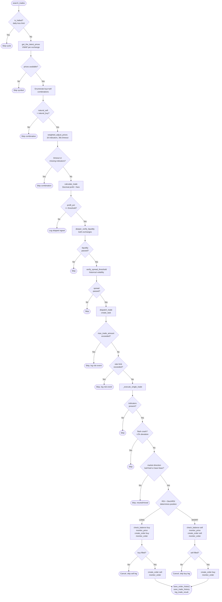

# SonarFT Bot — Trading Engine & Strategy Logic Review

**Prompt:** 03-BOT-ENGINE  
**Reviewer role:** Senior quantitative trading reviewer / financial-safety-critical systems auditor  
**Date:** July 2025  
**Status:** Complete  
**Prerequisites:** [01-BOT-ARCH](../architecture/bot-overview.md), [02-BOT-ASYNC](../async/bot-concurrency.md)

---

## 1. Trade Detection Logic

### Where opportunities are detected

The trade detection pipeline runs in `TradeProcessor.process_symbol()` → `process_trade_combination()` (`trade_processor.py`).

**Step-by-step:**

1. `SonarftSearch.search_trades()` — iterates configured symbols, dispatches `process_symbol()` per symbol via `asyncio.gather`.
2. `TradeProcessor.process_symbol()` — fetches latest prices across all exchanges, enumerates all buy-exchange × sell-exchange combinations, filters same-exchange pairs and combinations where `natural_sell <= natural_buy`.
3. `TradeProcessor.process_trade_combination()` — adjusts prices via `weighted_adjust_prices()`, calculates net profit via `calculate_trade()`, gates on `profit_percentage >= percentage_threshold`.
4. `TradeValidator.has_requirements_for_success_carrying_out()` — validates liquidity depth and spread threshold.
5. `TradeExecutor.execute_trade()` — dispatches as async task.

### Signals used to trigger trades

| Signal | Source | Used for |
|---|---|---|
| VWAP bid/ask spread across exchanges | `SonarftApiManager.get_latest_prices()` | Initial price discovery |
| Market direction (bull/bear/neutral) | `SonarftIndicators.get_market_direction()` via SMA/EMA | Price blend weight, position direction |
| RSI (14-period) | `SonarftIndicators.get_rsi()` | Overbought/oversold detection, position direction |
| Stochastic RSI (%K/%D) | `SonarftIndicators.get_stoch_rsi()` | Momentum confirmation for position direction |
| MACD | `SonarftIndicators.get_macd()` | Dynamic volatility adjustment factor |
| Short-term trend (6-candle) | `SonarftIndicators.get_short_term_market_trend()` | Spread factor selection |
| Order book volatility | `SonarftIndicators.get_volatility()` | Volatility risk factor in price blend |
| Support / resistance | `SonarftIndicators.get_support_price/resistance_price()` | Price clamping bounds |
| Liquidity depth | `SonarftValidators.deeper_verify_liquidity()` | Pre-execution gate |
| Spread threshold | `SonarftValidators.verify_spread_threshold()` | Pre-execution gate |

### Profitability calculation

Profit is calculated in `SonarftMath.calculate_trade()` using `Decimal` arithmetic:

```
profit = (sell_price × amount − sell_fee) − (buy_price × amount + buy_fee)
profit_percentage = profit / (buy_price × amount + buy_fee)
```

Fees are deducted **before** the profitability decision — `profit_percentage >= percentage_threshold` is checked against the **net** profit after fees. ✅ This is the correct approach.

The threshold is `profit_percentage_threshold` (default `0.0001` = 0.01%) loaded from `config_parameters.json`.

### Risk of false positives

**Finding T-01 (Medium):** The pre-filter in `process_symbol()` checks `natural_sell <= natural_buy` using raw VWAP prices before adjustment. After `weighted_adjust_prices()`, the adjusted prices may diverge from the natural prices — a combination that passes the pre-filter may produce a negative profit after adjustment, and vice versa. This is handled correctly: `calculate_trade()` is always called on adjusted prices and the profit threshold check uses the adjusted result. The pre-filter is an optimisation to skip obviously unprofitable combinations, not a safety gate. ✅

**Finding T-02 (Medium):** The position direction logic in `_execute_single_trade()` requires **both** exchanges to show the same market direction (`bull`+`bull` or `bear`+`bear`). Mixed directions (`bull`+`bear` or `bear`+`neutral`) result in the trade being skipped. This is a conservative gate that reduces false positives at the cost of missing some valid arbitrage opportunities in divergent markets.

**Finding T-03 (Low):** The profit threshold `0.0001` (0.01%) is very tight. On exchanges with maker fees of 0.1% each side (0.2% total), a 0.01% profit threshold means the bot will attempt trades where the fee cost is 20× the minimum profit margin. The `calculate_trade()` function correctly includes fees in the profit calculation, so unprofitable-after-fees trades will show negative profit and be rejected. However, the threshold is so low that minor price movements between signal detection and order placement could easily turn a marginally profitable trade into a loss. This is a configuration risk, not a code defect.

### Margin of safety

The pipeline has multiple safety layers before execution:

1. Natural price pre-filter (raw VWAP)
2. Adjusted price profit threshold check (net of fees)
3. Liquidity depth verification (both exchanges)
4. Spread threshold verification (historical volatility-adjusted)
5. Flash crash guard (2% price deviation check in `_execute_single_trade()`)
6. Balance check before each order leg
7. Exchange minimum order size check
8. Daily loss limit halt

This is a well-layered defence-in-depth approach. ✅

---

## 2. VWAP Calculation & Usage

### Formula implementation

The canonical VWAP function lives in `models.py`:

```python
def vwap(price_volume_list: list, depth: int) -> float:
    if not price_volume_list:
        return 0.0
    if len(price_volume_list) < depth:
        depth = len(price_volume_list)
    entries = price_volume_list[:depth]
    total_volume = sum(volume for _, volume in entries)
    if total_volume == 0:
        return 0.0
    return sum(price * volume for price, volume in entries) / total_volume
```

Formula: `VWAP = Σ(price_i × volume_i) / Σ(volume_i)` for the top `depth` order book levels.

This is the correct order-book VWAP formula. ✅

**Zero volume guard:** `if total_volume == 0: return 0.0` — callers check for zero return. ✅  
**Empty list guard:** `if not price_volume_list: return 0.0` ✅  
**Depth overflow guard:** `if len(price_volume_list) < depth: depth = len(price_volume_list)` ✅

### Data sources

VWAP is computed from live order book data fetched via `SonarftApiManager.get_order_book()` which calls `fetch_order_book` (ccxt REST) or `watch_order_book` (ccxtpro WebSocket). The order book is cached with a 2-second TTL per `(exchange_id, symbol)` key.

**Finding T-04 (Low):** The 2-second order book cache TTL means VWAP is computed on data that may be up to 2 seconds stale. In fast-moving markets this can produce a VWAP that does not reflect the current order book. For the arbitrage use case this is acceptable — the subsequent `monitor_price()` step before order placement provides a fresher price check. For market-making, stale VWAP could result in suboptimal spread placement.

### Usage in pricing

| Location | Usage | Depth |
|---|---|---|
| `SonarftApiManager.get_latest_prices()` | Initial bid/ask VWAP per exchange | `weight` parameter (default 12 in `process_symbol`) |
| `SonarftPrices.get_weighted_price()` | Order book weighted price for blend | 3 levels |
| `SonarftPrices.weighted_adjust_prices()` | Blends target VWAP with current order book VWAP | weight from volatility calculation |

**Finding T-05 (Medium):** The `weight` parameter passed to `get_the_latest_prices()` is hardcoded as `12` in `TradeProcessor.process_symbol()`. This means VWAP is always computed over the top 12 order book levels regardless of the configured symbol or exchange. Deep order books on liquid exchanges and shallow order books on illiquid exchanges are treated identically. A configurable depth per exchange/symbol would be more accurate.

### Precision

VWAP is computed using Python `float` arithmetic (not `Decimal`). The result is used as an input to `weighted_adjust_prices()` which also uses `float`. Only `calculate_trade()` uses `Decimal` for the final profit/fee calculation. This is the correct boundary — VWAP is a price estimate used for decision-making, not a financial settlement calculation.

**Finding T-06 (Low):** The blend formula in `weighted_adjust_prices()`:

```python
adjusted_buy_price = weight * target_buy_price + (1 - weight) * buy_weighted_price
```

uses `float` arithmetic. For high-precision assets (e.g. BTC/USDT at ~$60,000), floating-point rounding at this stage is negligible — the subsequent `Decimal` rounding in `calculate_trade()` is the authoritative precision boundary. ✅

---

## 3. Spread Calculation & Rules

### Spread definition

Two distinct spread concepts are used:

**1. Cross-exchange arbitrage spread** — the difference between the adjusted sell price on the sell exchange and the adjusted buy price on the buy exchange:

```python
profit = value_selling_with_fee - value_buying_with_fee
```

This is the net spread after fees, computed in `SonarftMath.calculate_trade()`.

**2. Order book spread** — used in `SonarftValidators` for threshold checks:

```python
spread = ask_prices[0] - bid_prices[0]          # in deeper_verify_liquidity()
spread_ratio_pct = (spread / average_price) * 100  # in verify_spread_threshold()
```

**3. Market movement spread** — used in `SonarftIndicators.market_movement()`:

```python
spread = depth_asks - depth_bids   # sum of top-N ask prices minus sum of top-N bid prices
```

Note: this is not a standard spread definition — it computes the difference between the sum of ask prices and the sum of bid prices at a given depth, not the bid-ask spread. This is used only for market movement direction detection, not for profitability.

**Finding T-07 (Medium):** The `market_movement()` spread calculation sums prices (not volumes × prices) at the given depth:

```python
depth_bids = sum([float(bid[0]) for bid in order_book['bids'][:order_book_depth]])
depth_asks = sum([float(ask[0]) for ask in order_book['asks'][:order_book_depth]])
```

This sums the raw price values of the top N levels, not the volume-weighted values. The result is sensitive to the number of price levels and their absolute values rather than the actual liquidity imbalance. A more meaningful metric would be `sum(price × volume)` for each side. The current implementation may produce misleading direction signals on order books with many small levels vs. few large levels.

### Spread thresholds

`SonarftValidators.verify_spread_threshold()` computes a dynamic threshold based on historical cross-exchange spread data:

1. Fetches 100 candles of OHLCV history from both exchanges.
2. Computes historical cross-exchange spread percentages from close prices.
3. Classifies current spread as Low/Medium/High volatility.
4. Applies the corresponding historical threshold (mean ± std).

**Finding T-08 (Low):** The historical spread is computed from **close prices** of OHLCV candles, not from actual order book bid/ask spreads. Close prices on two exchanges may differ due to different trading activity, not just spread. This produces a threshold that reflects cross-exchange price divergence rather than true bid-ask spread. For arbitrage purposes this is actually appropriate — the goal is to detect when the cross-exchange price gap is historically significant.

### Profitability thresholds

The minimum profit threshold is `profit_percentage_threshold` (default `0.0001`). This is checked **after** fee deduction in `calculate_trade()`. The threshold is applied as:

```python
if profit_percentage >= percentage_threshold:
    # proceed to validation and execution
```

**Finding T-09 (Medium):** The profit threshold is a percentage of the buy cost (`profit / value_buying_with_fee`). At a threshold of `0.0001` (0.01%) on a $1,000 trade, the minimum acceptable profit is $0.10. With typical exchange fees of 0.1% per side ($2.00 total on a $1,000 trade), the bot will only execute trades where the gross spread exceeds $2.10. This is correct behaviour — fees are included. However, the threshold does not account for **slippage** between signal detection and order execution. A 0.01% threshold with no slippage buffer means any adverse price movement during `monitor_price()` (up to 120 seconds) could eliminate the profit margin entirely.

### Volatility adjustment to spread

In `SonarftPrices._adjust_market_making()`, the spread is widened by `spread_increase_factor` (sell side) and narrowed by `spread_decrease_factor` (buy side). These factors are validated at load time:

```python
if not (1.0 < self.spread_increase_factor < 1.01):
    raise ValueError(...)
if not (0.99 < self.spread_decrease_factor < 1.0):
    raise ValueError(...)
```

This constrains the spread adjustment to a maximum of ±1% from the base price, preventing runaway spread widening. ✅

**Finding T-10 (Low):** The spread factors are only validated for `market_making` strategy. For `arbitrage` strategy, `spread_increase_factor` and `spread_decrease_factor` are loaded from config but never applied (the arbitrage path skips `_adjust_market_making()`). The validation guard only runs for `market_making`. If a user sets extreme spread factors and switches to `market_making` via hot-reload, the validation in `_validate_parameters()` will catch it. ✅

---

## 4. Fee Handling & Profitability

### Fee inclusion timing

Fees are included **before** the profitability decision. The full calculation in `SonarftMath.calculate_trade()`:

```
value_buying_with_fee  = buy_price × amount + buy_fee
value_selling_with_fee = sell_price × amount − sell_fee
profit                 = value_selling_with_fee − value_buying_with_fee
profit_percentage      = profit / value_buying_with_fee
```

The `profit_percentage >= percentage_threshold` check in `TradeProcessor.process_trade_combination()` uses this net-of-fees value. ✅ This is the correct approach — the bot never executes a trade based on gross profit.

### Fee sources

Fees are loaded from `config_fees.json` via `SonarftApiManager.get_buy_fee()` / `get_sell_fee()`. The fee lookup supports:

- `maker_buy_fee` / `maker_sell_fee` for limit orders (preferred)
- `buy_fee` / `sell_fee` as fallback

**Finding T-11 (High):** Fee rates are loaded from a **static JSON config file**, not from the exchange API. If an exchange changes its fee structure, the bot will continue using the stale fee rates until the config file is manually updated. This could cause the bot to execute trades that are actually unprofitable after real fees. The `SonarftApiManager` has a `TODO` comment acknowledging this:

```python
# TODO: See if its possible(trust) to use api to get fees
```

For production use, fee rates should be periodically refreshed from the exchange API (ccxt provides `fetch_trading_fees()` on most exchanges).

### Fee precision

Fees are computed using `Decimal` with configurable rounding:

```python
buy_fee_d = d_fee(buy_price_d * target_amount_buy_d * Decimal(str(buy_fee_rate)), buy_rules['fee_precision'])
```

`d_fee()` uses `ROUND_HALF_EVEN` (banker's rounding) by default, switchable to `ROUND_HALF_UP` via `SONARFT_FEE_ROUNDING=HALF_UP` environment variable. Banker's rounding eliminates systematic bias over many trades. ✅

### Exchange precision rules

`EXCHANGE_RULES` in `SonarftMath` hardcodes precision for `okx`, `bitfinex`, and `binance`. Live precision from `get_symbol_precision()` is tried first and used as the primary source. The hardcoded rules are a fallback.

**Finding T-12 (Medium):** If neither `get_symbol_precision()` nor `EXCHANGE_RULES` has an entry for a configured exchange, `calculate_trade()` returns `(0, 0, None)` and the trade is skipped. This is safe but silent — the bot will never execute trades on unconfigured exchanges without any warning beyond a single `logger.warning`. A startup check that validates all configured exchanges have precision rules would surface this earlier.

### Net profit calculation correctness

The full profit calculation trace for a sample trade:

```
buy_price_d  = round(buy_price,  buy_rules['prices_precision'])   # e.g. 2 dp for binance
amount_d     = round(amount,     buy_rules['buy_amount_precision']) # e.g. 5 dp for binance
buy_fee_d    = round(buy_price_d × amount_d × buy_fee_rate, 8)
buy_cost_d   = round(buy_price_d × amount_d, 7)                    # cost_precision
buy_total_d  = round(buy_cost_d + buy_fee_d, 7)

sell_price_d = round(sell_price, sell_rules['prices_precision'])
sell_fee_d   = round(sell_price_d × amount_d × sell_fee_rate, 8)
sell_value_d = round(sell_price_d × amount_d, 7)
sell_net_d   = round(sell_value_d - sell_fee_d, 7)

profit_d     = round(sell_net_d - buy_total_d, 8)
profit_pct_d = round((sell_net_d - buy_total_d) / buy_total_d, 8)
```

**Finding T-13 (Low):** `target_amount_sell_d = target_amount_buy_d` — the sell amount is set equal to the buy amount. This is correct for a fully-filled buy order. However, in the case of a partial fill (handled in `execute_long_trade()`), the actual sell amount is `buy_executed_amount`, not `target_amount`. The `calculate_trade()` function always uses `target_amount` for both legs. This means the profit calculation in `trade_data` may not match the actual executed profit if the buy order is partially filled. The actual P&L is not recalculated after partial fill — only the pre-execution estimate is stored.

---

## 5. Execution Gating & Safety Checks

### Pre-execution validation chain

Every trade passes through the following gates in order:

```
1. Natural price pre-filter          (process_symbol)
   └─ natural_sell > natural_buy

2. Price adjustment                  (weighted_adjust_prices)
   └─ returns (0,0,{}) on timeout or missing indicators → skipped

3. Net profit threshold              (process_trade_combination)
   └─ profit_percentage >= percentage_threshold

4. Liquidity depth — buy exchange    (deeper_verify_liquidity)
   └─ order book depth, volume, spread ratio

5. Liquidity depth — sell exchange   (deeper_verify_liquidity)
   └─ same checks

6. Spread threshold                  (verify_spread_threshold)
   └─ historical volatility-adjusted spread check

7. Daily loss halt                   (SonarftSearch.is_halted)
   └─ accumulated loss >= max_daily_loss

8. Missing indicators guard          (_execute_single_trade)
   └─ any indicator None → skip

9. Flash crash guard                 (_execute_single_trade)
   └─ |sell_price - buy_price| / buy_price > 0.02 → skip

10. Market direction gate            (_execute_single_trade)
    └─ both exchanges must be bull+bull or bear+bear

11. Position size limit              (execute_trade)
    └─ buy_trade_amount > max_trade_amount → skip

12. Order rate limit                 (execute_trade)
    └─ orders per minute > max_orders_per_minute → skip

13. Balance check                    (check_balance)
    └─ insufficient funds → skip

14. Exchange minimum order size      (create_order)
    └─ amount < min_amount or cost < min_cost → skip
```

This is a comprehensive 14-gate validation chain. ✅

### Simulation mode gate

**Finding T-14 (Critical — configuration risk):** The simulation mode gate is `self.is_simulation_mode` (boolean) in `SonarftExecution` and `self.is_simulating_trade` (int 0/1) in `SonarftBot`. The gate in `execute_order()`:

```python
if not self.is_simulation_mode:
    order_placed = await self.api_manager.create_order(...)
else:
    # synthetic order
```

This is correct. However, switching from simulation to live mode is controlled by:

```python
if self.is_simulating_trade == 1 and new_sim == 0:
    if not os.environ.get("SONARFT_ALLOW_LIVE"):
        raise ValueError("Switching from simulation to live mode requires SONARFT_ALLOW_LIVE=true")
```

This guard only applies to **hot-reload** via `apply_parameters()`. At **initial startup**, if `config_parameters.json` has `is_simulating_trade: 0`, the bot starts in live mode without requiring `SONARFT_ALLOW_LIVE`. The environment variable guard is only enforced on runtime switches, not on initial configuration. This means a misconfigured JSON file can start the bot in live mode silently.

**Recommendation:** Also check `SONARFT_ALLOW_LIVE` during `load_configurations()` when `is_simulating_trade == 0`.

### Safety thresholds

| Control | Parameter | Default | Enforcement |
|---|---|---|---|
| Minimum profit | `profit_percentage_threshold` | 0.0001 | `calculate_trade()` + threshold check |
| Max daily loss | `max_daily_loss` | 0.0 (disabled) | `SonarftSearch.is_halted()` |
| Max position size | `max_trade_amount` | 0.0 (disabled) | `execute_trade()` size check |
| Max orders/minute | `max_orders_per_minute` | 0 (disabled) | `execute_trade()` rate limiter |
| Flash crash | hardcoded 2% | 2% | `_execute_single_trade()` |
| Circuit breaker | `SONARFT_MAX_FAILURES` env | 5 | `run_bot()` consecutive failure counter |

**Finding T-15 (Medium):** `max_daily_loss`, `max_trade_amount`, and `max_orders_per_minute` all default to `0` which means **disabled**. A new deployment with default config has no daily loss limit, no position size limit, and no order rate limit. These should default to conservative non-zero values or require explicit opt-out.

### Operator controls

- `BotManager.pause_bot()` / `resume_bot()` — pause/resume without deregistering. ✅
- `BotManager.remove_bot()` — graceful shutdown with order cancellation. ✅
- `SonarftSearch.pause()` / `resume()` — trading-level pause without stopping the bot. ✅
- `apply_parameters()` hot-reload — update parameters without restart. ✅
- `SONARFT_ALLOW_LIVE` env var — guards simulation→live switch. ✅

### Risk of accidental live execution

**Finding T-16 (Medium):** API keys are loaded from environment variables in `_load_api_keys()`. If `{EXCHANGE}_API_KEY` and `{EXCHANGE}_SECRET` are set in the environment **and** `is_simulating_trade = 0` in config, the bot will place real orders on startup. There is no confirmation prompt or dry-run mode beyond simulation. The only protection is the `SONARFT_ALLOW_LIVE` guard on hot-reload switches — not on initial startup.

---

## 6. Buy/Sell Trigger Logic

### Entry signal

A trade is triggered when all of the following are true:

1. Cross-exchange adjusted spread produces `profit_percentage >= threshold` (net of fees).
2. Both exchanges pass liquidity depth checks.
3. Current spread exceeds the historical volatility-adjusted threshold.
4. Daily loss limit not reached.

### Position direction determination

Position direction (LONG or SHORT) is determined in `_execute_single_trade()` based on market direction and RSI/StochRSI:

**LONG trade** (buy first, sell second):
- Both exchanges `bear` direction AND RSI ≤ 30 on both AND StochRSI %K < %D on both → oversold reversal signal
- Both exchanges `bull` direction AND NOT (RSI ≥ 70 AND StochRSI %K > %D) → standard bull continuation

**SHORT trade** (sell first, buy second):
- Both exchanges `bull` direction AND RSI ≥ 70 on both AND StochRSI %K > %D on both → overbought reversal signal
- Both exchanges `bear` direction AND NOT (RSI ≤ 30 AND StochRSI %K < %D) → standard bear continuation

**Finding T-17 (Medium):** The position direction logic uses RSI thresholds of 70/30 for overbought/oversold detection in `_execute_single_trade()`, but `_adjust_market_making()` uses 72/28. These thresholds are inconsistent between the execution and pricing layers. A signal that is "overbought" at the pricing layer (RSI ≥ 72) may not be "overbought" at the execution layer (RSI ≥ 70), causing the spread adjustment and the position direction to be based on different signal interpretations.

**Finding T-18 (Low):** The SHORT trade path (`execute_short_trade()`) places a sell order first, then a buy order. For spot trading, selling first requires holding the base asset. The balance check (`check_balance()` for `sell` side checks `balance['free'][base]`) correctly verifies this. However, if the bot is used for cross-exchange arbitrage where the sell exchange does not hold the base asset, the balance check will fail and the trade will be skipped — this is correct behaviour but may be confusing in logs.

### Order size calculation

Order size is `trade_amount` from config, applied uniformly to all trades. There is no dynamic position sizing based on volatility, account balance percentage, or Kelly criterion.

**Finding T-19 (Medium):** Fixed `trade_amount` regardless of market conditions means the bot takes the same position size in both low-volatility and high-volatility environments. In high-volatility conditions, a fixed position size represents a higher risk in absolute terms. A volatility-scaled position size (e.g. `trade_amount / volatility_factor`) would be more risk-appropriate.

### Exit signal

For the arbitrage strategy, there is no explicit exit signal — each trade is a complete round-trip (buy + sell) executed atomically. There is no open position management or stop-loss for partially executed trades beyond the cancel-with-retry mechanism.

**Finding T-20 (Medium):** There is no stop-loss mechanism for the case where the sell leg cannot be executed after the buy leg is filled. The current code attempts to cancel the buy order if the sell leg fails, but if the buy order is already fully filled (status `closed`), it cannot be cancelled. The bot logs an error but does not have a mechanism to place a market sell order to close the position at a loss. This leaves an unhedged long position that must be manually managed.

---

## 7. Rounding & Precision in Orders

### Price rounding

In `SonarftMath.calculate_trade()`, prices are rounded using `Decimal`:

```python
buy_price_d = d(buy_price, buy_rules['prices_precision'])
```

Where `d()` uses `ROUND_HALF_UP`. Exchange-specific precision (e.g. 2 dp for Binance, 1 dp for OKX, 3 dp for Bitfinex) is applied.

In `SonarftExecution.create_order()`, the monitored price is additionally rounded:

```python
if precision:
    latest_price = round(latest_price, precision["prices_precision"])
```

This uses Python's built-in `round()` (banker's rounding for `.5` cases) rather than `Decimal`. For non-`.5` cases this is equivalent. ✅

### Amount rounding

```python
target_amount_buy_d = d(target_amount, buy_rules['buy_amount_precision'])
```

Applied in `calculate_trade()`. The rounded amount is stored in `trade_data` and used for both legs.

**Finding T-21 (Low):** Amount rounding in `calculate_trade()` uses `ROUND_HALF_UP`. If the rounded amount is slightly less than the original `trade_amount`, the actual order will be for the rounded amount. The profit calculation uses the rounded amount, so the profit estimate is consistent with the actual order. ✅

### Exchange minimums

`create_order()` checks exchange minimums from loaded market data:

```python
min_amount = ((limits.get("amount") or {}).get("min")) or 0
min_cost   = ((limits.get("cost")   or {}).get("min")) or 0
if min_amount and trade_amount < min_amount: return None
if min_cost   and trade_amount * price < min_cost: return None
```

**Finding T-22 (Medium):** The minimum check uses `trade_amount` (the pre-rounding value) against `min_amount`. After rounding in `calculate_trade()`, the actual order amount may be slightly different. If `trade_amount` is exactly at the minimum, rounding down could produce an amount below the minimum that passes the check but is rejected by the exchange. The check should use the rounded amount from `trade_data` rather than the raw `trade_amount`.

### Precision loss analysis

**Finding T-23 (Low):** The `sell_amount_decimal_precision` field in `EXCHANGE_RULES` (e.g. `'0.00000'` for Binance) is defined but never used in `calculate_trade()`. The sell amount precision is applied via `sell_amount_precision` (integer decimal places). The string format field appears to be a legacy artefact from an earlier implementation.

---

## 8. Trade Pipeline Flowchart



---

## 9. Financial Risk Table

| ID | Issue | Location | Scenario | Financial Risk | Severity | Fix |
|---|---|---|---|---|---|---|
| T-14 | Simulation mode not enforced at startup | `sonarft_bot.py` — `load_configurations()` | `is_simulating_trade=0` in config + API keys in env → live orders on startup | Real money loss | **Critical** | Check `SONARFT_ALLOW_LIVE` at startup when `is_simulating_trade=0` |
| T-11 | Fee rates from static config, not exchange API | `sonarft_api_manager.py` — `get_buy/sell_fee()` | Exchange changes fees → bot executes unprofitable trades | Cumulative loss | **High** | Periodically refresh fees via `fetch_trading_fees()` |
| T-20 | No stop-loss for unhedged position after failed sell leg | `sonarft_execution.py` — `execute_long_trade()` | Buy filled, sell fails, cancel fails → open long position | Unlimited downside | **High** | Add market sell fallback or position tracking with manual alert |
| T-15 | Risk limits default to 0 (disabled) | `config_parameters.json` | New deployment with defaults → no daily loss limit, no position size limit | Uncontrolled loss | **Medium** | Set conservative non-zero defaults; require explicit opt-out |
| T-17 | RSI thresholds inconsistent between pricing (72/28) and execution (70/30) | `sonarft_prices.py`, `sonarft_execution.py` | Signal classified differently at pricing vs execution layer | Incorrect position direction | **Medium** | Unify thresholds; extract to shared constant |
| T-19 | Fixed trade amount regardless of volatility | `config_parameters.json` | High-volatility market → same position size as low-volatility | Higher risk in volatile conditions | **Medium** | Add volatility-scaled position sizing option |
| T-09 | No slippage buffer in profit threshold | `trade_processor.py` | 0.01% threshold + 120s price monitor window → slippage eliminates profit | Trade executed at a loss | **Medium** | Add configurable slippage buffer to threshold |
| T-22 | Minimum order check uses pre-rounding amount | `sonarft_execution.py` — `create_order()` | Amount at minimum boundary → rounds below minimum → exchange rejection | Failed order, wasted API call | **Medium** | Use rounded amount from `trade_data` for minimum check |
| T-12 | No startup validation of exchange precision rules | `sonarft_math.py` | Unconfigured exchange → `calculate_trade()` returns `(0,0,None)` silently | Missed trades, no warning | **Medium** | Add startup check for all configured exchanges |
| T-07 | `market_movement()` sums prices not volumes | `sonarft_indicators.py` | Shallow order book with many small levels → misleading direction signal | Incorrect position direction | **Medium** | Use `sum(price × volume)` for each side |
| T-05 | VWAP depth hardcoded at 12 | `trade_processor.py` | Illiquid exchange with <12 levels → VWAP computed on all available levels (handled) | Minor accuracy loss | **Low** | Make depth configurable per exchange/symbol |
| T-13 | Profit estimate not recalculated after partial fill | `sonarft_math.py`, `sonarft_execution.py` | Partial fill → stored profit does not match actual P&L | Inaccurate P&L reporting | **Low** | Recalculate profit using `buy_executed_amount` after fill |
| T-23 | `sell_amount_decimal_precision` field unused | `sonarft_math.py` | Dead code | None | **Low** | Remove or document |
| T-10 | Spread factor validation only for market_making | `sonarft_bot.py` — `_validate_parameters()` | Arbitrage mode with extreme spread factors → no validation | None (factors unused in arbitrage) | **Low** | Document or add validation for completeness |

---

## 10. Critical Logic Findings

### 🔴 Critical — Simulation mode not enforced at startup (T-14)

**File:** `sonarft_bot.py` — `load_configurations()`  
**Scenario:** A deployment where `config_parameters.json` has `is_simulating_trade: 0` and exchange API keys are present in environment variables will start placing **real orders immediately** without any confirmation or guard.

The `SONARFT_ALLOW_LIVE` guard only applies to hot-reload via `apply_parameters()`. Initial startup bypasses it entirely.

**Fix:**
```python
# In load_configurations(), after loading is_simulating_trade:
if self.is_simulating_trade == 0:
    if not os.environ.get("SONARFT_ALLOW_LIVE"):
        raise BotCreationError(
            "Live trading requires SONARFT_ALLOW_LIVE=true environment variable. "
            "Set is_simulating_trade=1 for simulation mode."
        )
```

---

### 🔴 High — Static fee rates (T-11)

**File:** `sonarft_api_manager.py` — `get_buy_fee()` / `get_sell_fee()`  
**Scenario:** Exchange updates its fee schedule. Bot continues using stale rates. Trades that appear profitable at old fee rates are actually unprofitable at new rates.

**Fix:** Add a `refresh_fees()` method that calls `exchange.fetch_trading_fees()` and updates `self.exchanges_fees`. Call at startup and periodically (e.g. every 24 hours).

---

### 🔴 High — Unhedged position after failed sell leg (T-20)

**File:** `sonarft_execution.py` — `execute_long_trade()`  
**Scenario:** Buy order fills. Sell order fails (exchange error, insufficient balance on sell exchange, network timeout). Cancel of buy order also fails (already filled). Bot logs error and moves on. Open long position remains unmanaged.

**Fix:** Implement a position tracker. On unhedged position detection, send a critical alert and attempt a market sell order as emergency close. At minimum, persist the open position to SQLite so it survives restarts and can be reconciled.

---

### 🟡 Medium — No slippage buffer in profit threshold (T-09)

**File:** `trade_processor.py` — `process_trade_combination()`  
**Scenario:** Trade detected with 0.012% profit (above 0.01% threshold). `monitor_price()` waits up to 120 seconds for price confirmation. During this window, the spread narrows by 0.005%. Actual executed profit: 0.007% — below threshold. Trade executed at a loss relative to the original signal.

**Fix:** Add a configurable `slippage_buffer` parameter (e.g. 0.005%) added to the threshold:
```python
effective_threshold = percentage_threshold + slippage_buffer
if profit_percentage >= effective_threshold:
    ...
```

---

### 🟡 Medium — RSI threshold inconsistency (T-17)

**File:** `sonarft_prices.py` (72/28) vs `sonarft_execution.py` (70/30)  
**Scenario:** RSI = 71. Pricing layer does NOT classify as overbought (threshold 72) → no spread widening. Execution layer DOES classify as overbought (threshold 70) → SHORT position selected. The spread was not widened for a SHORT signal.

**Fix:** Extract RSI thresholds to shared constants in `models.py`:
```python
RSI_OVERBOUGHT = 70
RSI_OVERSOLD   = 30
```
Import and use in both `sonarft_prices.py` and `sonarft_execution.py`.

---

## Summary

| Category | Findings | Critical | High | Medium | Low |
|---|---|---|---|---|---|
| Trade detection & signals | 3 | 0 | 0 | 2 | 1 |
| VWAP & pricing | 3 | 0 | 0 | 1 | 2 |
| Spread & thresholds | 4 | 0 | 0 | 2 | 2 |
| Fee handling | 3 | 0 | 1 | 1 | 1 |
| Execution gating & safety | 3 | 1 | 1 | 1 | 0 |
| Buy/sell trigger logic | 4 | 0 | 1 | 3 | 0 |
| Rounding & precision | 3 | 0 | 0 | 1 | 2 |
| **Total** | **23** | **1** | **3** | **11** | **8** |

**Overall trading engine quality: 7/10.**

The core trading logic is structurally sound — fees are correctly included before profitability decisions, VWAP is correctly implemented, the 14-gate validation chain is comprehensive, and simulation mode is correctly enforced at the execution layer. The primary gaps are the missing startup simulation guard (Critical), static fee rates (High), unhedged position risk (High), and the absence of a slippage buffer in the profit threshold (Medium).
