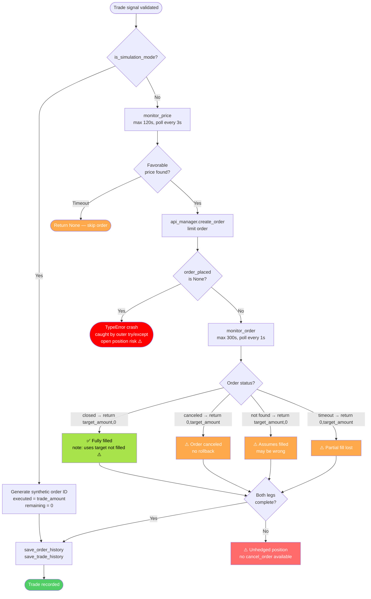

# SonarFT — Execution & Exchange Integration Review

**Review Date:** July 2025
**Codebase Version:** 1.0.0
**Reviewer Role:** Senior Python Engineer / Exchange Integration Specialist
**Scope:** API abstraction layer, transport options, market data fetching, order placement, simulation accuracy, error handling, and exchange-specific assumptions
**Follows:** [Indicator Pipeline Review](./indicator-analysis.md)

---

## 1. API Abstraction Layer

### 1.1 Overview

`SonarftApiManager` is the single gateway for all exchange communication. It abstracts two underlying libraries behind a unified interface:

| Mode | Library | Transport | Selected by |
|---|---|---|---|
| Default | `ccxt.pro` | WebSocket | `-l ccxtpro` (default) |
| Fallback | `ccxt` | REST (HTTP) | `-l ccxt` |

### 1.2 Exchange Instance Creation

```python
# sonarft_api_manager.py:81
self.exchanges_instances = [
    getattr(self.apilib, exchange)({'enableRateLimit': True})
    for exchange in exchanges
]
```

- Exchange instances are created at startup from the configured exchange list
- `enableRateLimit: True` activates ccxt's built-in rate limiter ✅
- No API keys are set at creation — keys must be set separately via `setAPIKeys()`
- **Issue:** No validation that the exchange name is a valid ccxt exchange ID — an invalid name raises `AttributeError` at startup with no friendly error message

### 1.3 Method Routing

```python
# sonarft_api_manager.py:53-70
async def call_api_method(self, exchange_id, ccxt_method, ccxtpro_method, *args, **kwargs):
    exchange = self.get_exchange_by_id(exchange_id)
    method = ccxt_method if self.__ccxt__ else ccxtpro_method
    method_call = getattr(exchange, method)

    if self.__ccxt__:
        await self.wait_for_rate_limit(exchange)
        loop = asyncio.get_event_loop()
        result = await loop.run_in_executor(None, lambda: method_call(*args, **kwargs))
    else:
        await self.wait_for_rate_limit(exchange)
        result = await method_call(*args, **kwargs)
```

**Assessment:** Clean adapter pattern — callers specify both method names and the dispatcher selects the correct one. ✅

**Issues:**

| Issue | Description | Severity |
|---|---|---|
| `get_exchange_by_id` returns `None` silently | If exchange not found, `getattr(None, method)` raises `AttributeError` — not caught | **High** |
| `asyncio.get_event_loop()` deprecated | Should be `asyncio.get_running_loop()` in Python 3.10+ | Low |
| `run_in_executor(None, ...)` uses default thread pool | Shared with all other executor tasks; can exhaust under high concurrency | Medium |
| No timeout on individual API calls | A hanging exchange call blocks indefinitely | **High** |

### 1.4 Error Handling

```python
# sonarft_api_manager.py:72-74
except Exception as e:
    self.logger.error(f"Error calling method {method}: {e}")
return result  # result is None if exception occurred
```

All API errors are caught, logged, and `None` is returned. Callers must check for `None`. This is a fail-safe pattern — no exception propagates up. ✅

**Issue — `result` may be uninitialized on exception:**
```python
result = None  # initialized at top of function ✅
...
except Exception as e:
    self.logger.error(...)
return result  # returns None on error ✅
```
`result` is initialized to `None` before the try block. ✅

**Issue — all exceptions treated equally:**
Rate limit errors (`ccxt.RateLimitExceeded`), authentication errors (`ccxt.AuthenticationError`), and network errors (`ccxt.NetworkError`) all produce the same log message and `None` return. There is no differentiated handling — a rate limit error should trigger a backoff, an auth error should stop the bot.

---

## 2. Transport Layer Options

### 2.1 WebSocket (ccxtpro — Default)

| Operation | ccxtpro Method | Behavior |
|---|---|---|
| Order book | `watch_order_book` | Streaming subscription, updates pushed |
| Ticker | `watch_ticker` | Streaming subscription |
| Orders | `watch_orders` | Streaming subscription |
| Balance | `watch_balance` | Streaming subscription |
| OHLCV | `fetch_ohlcv` | REST (ccxtpro uses REST for OHLCV) |
| Create order | `create_order` | REST (order placement is always REST) |
| Load markets | `load_markets` | REST |

**Note:** Even in ccxtpro mode, OHLCV and order creation use REST. WebSocket is used for real-time market data subscriptions only.

### 2.2 REST (ccxt — Fallback)

| Operation | ccxt Method | Behavior |
|---|---|---|
| Order book | `fetch_order_book` | Single REST request per call |
| Ticker | `fetch_ticker` | Single REST request per call |
| Orders | `fetch_orders` | Single REST request per call |
| Balance | `fetch_balance` | Single REST request per call |
| OHLCV | `fetch_ohlcv` | Single REST request per call |
| Create order | `create_order` | Single REST request per call |

### 2.3 Automatic Failover

**⚠️ Not Found in Source Code** — There is no automatic failover from WebSocket to REST. The library is selected once at startup via the `-l` flag and never changes. If a WebSocket connection drops mid-session, ccxtpro handles reconnection internally (it maintains persistent connections), but there is no application-level fallback to REST if ccxtpro fails entirely.

### 2.4 Reconnection Logic

ccxtpro manages WebSocket reconnection internally. The application has no explicit reconnection logic — it relies entirely on ccxtpro's built-in reconnection behavior. If ccxtpro fails to reconnect, `call_api_method` will return `None`, the bot's circuit breaker will accumulate failures, and the bot will stop after 5 consecutive failures.

### 2.5 Rate Limiting

```python
# sonarft_api_manager.py:331-333
async def wait_for_rate_limit(self, exchange):
    rate_limit = exchange.rateLimit / 1000   # convert ms to seconds
    await exchange.sleep(rate_limit)
```

**Issue — rate limit applied on every call, not adaptively:**
`exchange.rateLimit` is the exchange's stated minimum delay between requests (e.g., Binance = 50ms). Sleeping for the full rate limit on every call is overly conservative — it serializes all requests to a single exchange even when the exchange allows burst requests. For 18 parallel indicator fetches per cycle, this adds `18 × 50ms = 900ms` of artificial delay.

**Issue — `enableRateLimit: True` + manual `wait_for_rate_limit` = double rate limiting:**
ccxt's `enableRateLimit: True` already handles rate limiting internally. Adding a manual `wait_for_rate_limit` call on top doubles the delay. One of the two should be removed.

---

## 3. Market Data Fetching

### 3.1 Order Book

```python
# sonarft_api_manager.py:188-193
async def get_order_book(self, exchange_id, base, quote):
    symbol = f"{base}/{quote}"
    order_book = await self.call_api_method(
        exchange_id, 'fetch_order_book', 'watch_order_book', symbol
    )
    return order_book
```

- No depth parameter — fetches default depth (exchange-dependent, typically 20–100 levels)
- No caching — fetched fresh on every call
- Called 3× per exchange per trade cycle (market_movement, get_volatility, get_order_book in prices)

### 3.2 Ticker Data

```python
# sonarft_api_manager.py:204-210
async def get_last_price(self, exchange_id, base, quote):
    last_price = await self.call_api_method(
        exchange_id, 'fetch_ticker', 'watch_ticker', symbol
    )
    return last_price['last']
```

**Issue — no guard on `last_price` being `None`:**
If `call_api_method` returns `None` (API error), `None['last']` raises `TypeError`. This is called in `monitor_price` during live order execution — a crash here leaves an open order unmonitored.

### 3.3 Data Staleness

| Data | Freshness | Staleness Risk |
|---|---|---|
| OHLCV | Cached up to 60s (1m candles) | Low — 1m candle TTL matches candle duration |
| Order book | Live (no cache) | Low — fetched fresh each time |
| Ticker | Live (no cache) | Low |
| Exchange markets | Cached indefinitely after startup | Medium — market precision rules may change |

**Issue — markets cached indefinitely:**
`load_all_markets` is called once at bot startup. Exchange market data (precision rules, minimum amounts, available symbols) is never refreshed. If an exchange updates its precision rules or adds/removes symbols, the bot uses stale data until restarted.

### 3.4 API Rate Limits

With `enableRateLimit: True` and manual `wait_for_rate_limit`, rate limits are respected but overly conservatively. For a 2-exchange, 2-symbol configuration, each trade cycle makes approximately:

```
Per symbol per cycle:
  18 indicator calls × 2 exchanges = 36 API calls
  + 2 price fetch calls (order book + ticker per exchange) = 4 calls
  Total: ~40 API calls per symbol

For 2 symbols: ~80 API calls per cycle
With 50ms delay each: 80 × 50ms = 4 seconds of rate-limit sleep per cycle
Plus actual network time: ~2-5 seconds
Total cycle time: ~6-9 seconds (within the 6-18s inter-cycle sleep)
```

This is borderline — at higher symbol counts, the cycle time could exceed the inter-cycle sleep, causing cycles to overlap.

---

## 4. Order Placement Logic

### 4.1 Order Parameters

```python
# sonarft_api_manager.py:125
order = await self.call_api_method(
    exchange_id, 'create_order', 'create_order',
    symbol, 'limit', side, amount, price
)
```

All orders are placed as **limit orders**. Parameters:
- `symbol`: `f"{base}/{quote}"` ✅
- `type`: `'limit'` (hardcoded) ✅
- `side`: `'buy'` or `'sell'` ✅
- `amount`: float (from `calculate_trade`, rounded to exchange precision) ✅
- `price`: float (from `calculate_trade`, rounded to exchange precision) ✅

**Issue — no pre-flight validation:**
Before calling `create_order`, there is no check that:
- `amount > 0`
- `price > 0`
- `amount` meets exchange minimum
- `price × amount` meets minimum notional value

A zero or negative amount/price would be sent directly to the exchange, which would reject it with an error.

### 4.2 Order Confirmation

```python
# sonarft_execution.py:260-266
order_placed = await self.api_manager.create_order(...)
order_placed_id = order_placed['id']   # ← KeyError if order_placed is None
if monitor_order:
    executed_amount, remaining_amount = await self.monitor_order(
        exchange_id, order_placed['id'], ...
    )
```

**Critical Issue — `order_placed` not checked for `None`:**
If `api_manager.create_order` returns `None` (API error), `order_placed['id']` raises `TypeError`. This is caught by the outer `try/except` in `_execute_single_trade`, which returns `False, False, False`. However, the error is logged only as `str(e)` — the operator sees a generic error with no context about which exchange or order failed.

### 4.3 Order Monitoring

```python
# sonarft_execution.py:293-316
deadline = asyncio.get_event_loop().time() + max_wait_seconds  # 300s
while asyncio.get_event_loop().time() < deadline:
    await asyncio.sleep(1)
    orders = await self.api_manager.watch_orders(exchange_id, base, quote)

    if not orders:
        return target_amount, 0   # assumes filled if no orders returned

    desired_order = next((o for o in orders if o["id"] == order_id), None)

    if desired_order is None:
        return target_amount, 0   # assumes filled if order not in list

    if desired_order['status'] == 'closed':
        return target_amount, 0   # filled ✅

    if desired_order['status'] == 'canceled':
        return 0, target_amount   # canceled ✅
```

**Issue — assumes filled when order not found:**
If `watch_orders` returns an empty list or the order is not in the list, the code assumes the order was filled (`return target_amount, 0`). This is incorrect — the order may have been rejected, may not have been submitted yet, or the API call may have failed. A missing order should trigger a direct `fetch_order` call to confirm status.

**Issue — `watch_orders` fetches ALL orders for the symbol:**
`fetch_orders` / `watch_orders` returns all orders (open, closed, canceled) for the symbol. On an active account with many orders, this list could be large and the linear search `next((o for o in orders if o["id"] == order_id))` is O(n).

**Issue — partial fill not detected:**
`monitor_order` only checks for `'closed'` (fully filled) or `'canceled'`. It does not check for `'open'` with a partial fill (`filled > 0` and `remaining > 0`). When the timeout expires, it returns `(0, target_amount)` — treating a partially filled order as completely unfilled, which is incorrect.


---

## 5. Simulated Order Execution

### 5.1 Simulation Implementation

```python
# sonarft_execution.py:259-271
if not self.is_simulation_mode:
    order_placed = await self.api_manager.create_order(...)
    order_placed_id = order_placed['id']
    if monitor_order:
        executed_amount, remaining_amount = await self.monitor_order(...)
    else:
        executed_amount = trade_amount
        remaining_amount = 0
else:
    executed_amount = trade_amount      # always fully filled
    remaining_amount = 0                # no remainder
    order_placed_id = f"{side}_{random.randint(100000, 999999)}"
```

### 5.2 Simulation Accuracy Assessment

| Aspect | Simulated? | Realistic? | Risk |
|---|---|---|---|
| Order placement | ✅ Synthetic ID generated | N/A | Low |
| Full fill | ✅ Always assumed | ❌ Real orders may partially fill | Medium |
| Partial fills | ❌ Not simulated | — | Medium |
| Slippage | ❌ Not simulated | — | **High** |
| Price movement between signal and fill | ❌ Not simulated | — | **High** |
| Order rejection | ❌ Not simulated | — | Medium |
| Exchange latency | ❌ Not simulated | — | Low |
| Fee deduction from balance | ❌ Not simulated | — | Medium |
| Balance check | ❌ Bypassed in simulation | — | Low (intentional) |

**Critical gap — slippage not modeled:**
In simulation mode, the bot assumes it buys at exactly `buy_price` and sells at exactly `sell_price`. In live trading, limit orders may not fill at the target price if the market moves. The simulation will show profits that are systematically higher than live trading results.

**Critical gap — always full fill:**
Simulation always sets `executed_amount = trade_amount`. In live trading, limit orders may partially fill (especially for large amounts or thin markets). The simulation overstates execution reliability.

**Recommendation:** Add a configurable slippage model and partial fill probability to simulation mode to produce more realistic backtesting results.

---

## 6. Partial Fill Handling

### 6.1 Detection

```python
# sonarft_execution.py:144-148
buy_order_id, buy_executed_amount, buy_remaining_amount = result_buy_order

# Use the actually filled amount for the sell leg (partial fill safe ✅)
actual_sell_amount = buy_executed_amount
if actual_sell_amount <= 0:
    self.logger.warning(f"Buy order {buy_order_id} filled 0 — skipping sell leg")
    return result_buy_order, None
```

The sell leg uses `buy_executed_amount` (the actually filled amount) rather than the requested amount. This correctly handles partial fills on the buy side. ✅

### 6.2 Partial Fill in `monitor_order`

```python
# sonarft_execution.py:293-316
while ... < deadline:
    await asyncio.sleep(1)
    orders = await self.api_manager.watch_orders(...)
    desired_order = next((o for o in orders if o["id"] == order_id), None)

    if desired_order['status'] == 'closed':
        return target_amount, 0   # ← always returns target_amount, not actual filled
```

**Issue — returns `target_amount` instead of `desired_order['filled']`:**
When an order is `'closed'`, the code returns `target_amount` (the requested amount) rather than `desired_order.get('filled', target_amount)` (the actual filled amount). For a fully filled order these are equal, but if the exchange closes an order with a partial fill (e.g., due to minimum fill requirements), the returned amount will be wrong.

**Correct implementation:**
```python
if desired_order['status'] == 'closed':
    filled = desired_order.get('filled', target_amount)
    remaining = desired_order.get('remaining', 0)
    return filled, remaining
```

### 6.3 Timeout Partial Fill

When `monitor_order` times out (300 seconds), it returns `(0, target_amount)` — treating the order as completely unfilled. If the order was partially filled before the timeout, the partial fill is lost from tracking. The bot will not attempt to sell the partially acquired position.

---

## 7. Error Handling & Retries

### 7.1 API Error Handling

| Error Type | Current Handling | Risk |
|---|---|---|
| Network timeout | Caught by `except Exception` → `None` returned | Medium — silent failure |
| Rate limit exceeded | Caught by `except Exception` → `None` returned | **High** — no backoff, next call immediately retried |
| Authentication error | Caught by `except Exception` → `None` returned | **High** — bot continues without valid auth |
| Invalid order params | Caught by `except Exception` → `None` returned | Medium — order silently not placed |
| Exchange maintenance | Caught by `except Exception` → `None` returned | Medium — bot continues cycling |
| Insufficient funds | Caught by `check_balance` before order | Low ✅ |

**No retry logic:**
There is no retry mechanism for transient errors (network blip, temporary rate limit). Each API call is attempted once. If it fails, `None` is returned and the trade is skipped. For a production trading system, at least 2–3 retries with exponential backoff should be implemented for transient errors.

### 7.2 Silent Failures

The most dangerous failure mode is a silent failure where the bot believes a trade was not executed but it actually was (or vice versa):

| Scenario | Outcome | Risk |
|---|---|---|
| `create_order` returns `None` | Trade skipped, no order placed | Low — safe |
| `create_order` succeeds but response lost | Order placed, bot thinks it failed | **Critical** — untracked open position |
| `watch_orders` returns `None` | `monitor_order` assumes order filled | **High** — incorrect fill tracking |
| `watch_orders` returns empty list | `monitor_order` assumes order filled | **High** — incorrect fill tracking |

**The most critical scenario:** If the exchange accepts the order but the network drops before the response is received, `call_api_method` catches the exception and returns `None`. The bot treats this as a failed order placement, but the order is live on the exchange. This creates an untracked open position.

### 7.3 Error Logging Quality

```python
# sonarft_execution.py:129
except Exception as e:
    self.logger.error(str(e))
    return False, False, False
```

The error is logged as `str(e)` — the exception message only. No context about which exchange, symbol, or order was involved. For debugging production issues, structured logging with full context is essential.

---

## 8. Order Cancellation & Cleanup

### 8.1 Cancel Order Implementation

**⚠️ Not Found in Source Code** — `cancel_order` is not implemented in `SonarftApiManager`. There is no method to cancel an open order on any exchange.

This means:
- If the buy leg succeeds but the sell leg fails, the buy order cannot be cancelled programmatically
- If the bot is stopped while an order is open, the order remains open on the exchange indefinitely
- There is no cleanup of stale orders on startup

### 8.2 Shutdown Behavior

```python
# sonarft_bot.py:150-153
async def stop_bot(self):
    self._stop_event.set()
    self.stop_bot_flag = True
    self.logger.info(f"Bot {self.botid} stop signal sent.")
```

`stop_bot` sets the stop event and returns immediately. It does not:
- Wait for in-flight trades to complete
- Cancel open orders on exchanges
- Close WebSocket connections (`close_exchange` exists but is never called)

**Risk:** If the bot is stopped mid-trade, open orders remain on the exchange. The operator must manually cancel them via the exchange's web interface.

### 8.3 WebSocket Connection Cleanup

```python
# sonarft_api_manager.py:154-159
async def close_exchange(self, exchange_id: str):
    exchange = self.get_exchange_by_id(exchange_id)
    await exchange.close()
```

`close_exchange` exists but is **never called** anywhere in the codebase. WebSocket connections are never explicitly closed on bot shutdown, relying on garbage collection or OS-level connection termination.

---

## 9. Exchange-Specific Assumptions

### 9.1 Supported Exchanges

The codebase explicitly supports three exchanges in `EXCHANGE_RULES`:

| Exchange | Price Precision | Amount Precision | Fee (buy/sell) | Notes |
|---|---|---|---|---|
| Binance | 2 dp | 5 dp | 0.1% / 0.1% | Most liquid; 1200 req/min |
| OKX | 1 dp | 8 dp | 0.08% / 0.1% | 1dp price is too coarse for most symbols |
| Bitfinex | 3 dp | 8 dp | 0.1% / 0.2% | Lower liquidity; higher sell fee |

### 9.2 Exchange Minimum Enforcement

**⚠️ Not Found in Source Code** — No minimum order size or minimum notional value checks. Exchange minimums:

| Exchange | Min Amount (BTC) | Min Notional |
|---|---|---|
| Binance | 0.00001 BTC | $10 USDT |
| OKX | 0.00001 BTC | — |
| Bitfinex | 0.00006 BTC | — |

With default `trade_amount = 1`, all minimums are satisfied for BTC/USDT. For other symbols or smaller amounts, orders may be silently rejected.

### 9.3 Concurrent Connection Limits

ccxtpro maintains one WebSocket connection per exchange per instance. With multiple bots running concurrently, each bot creates its own exchange instances — `N bots × M exchanges` WebSocket connections. Exchange connection limits (typically 5–10 concurrent WebSocket connections per IP) are not checked or enforced.

---

## 10. API Abstraction Matrix

| Operation | ccxt Method | ccxtpro Method | Error Handling | Cancel Available |
|---|---|---|---|---|
| Fetch order book | `fetch_order_book` | `watch_order_book` | ✅ Returns `None` | N/A |
| Fetch ticker | `fetch_ticker` | `watch_ticker` | ✅ Returns `None` | N/A |
| Fetch OHLCV | `fetch_ohlcv` | `fetch_ohlcv` | ✅ Returns `None` | N/A |
| Place order | `create_order` | `create_order` | ✅ Returns `None` | ❌ No cancel |
| Cancel order | ⚠️ Not implemented | ⚠️ Not implemented | — | ❌ Missing |
| Fetch balance | `fetch_balance` | `watch_balance` | ✅ Returns `None` | N/A |
| Fetch order status | `fetch_orders` | `watch_orders` | ✅ Returns `None` | N/A |
| Load markets | `load_markets` | `load_markets` | ✅ Returns `None` | N/A |
| Close connection | — | `close` | ✅ Exists | Never called |

---

## 11. Execution Flow Diagram



---

## 12. Failures & Edge Cases Table

| # | Scenario | Current Handling | Risk | Severity |
|---|---|---|---|---|
| 1 | Exchange API returns `None` for `create_order` | `order_placed['id']` → `TypeError` → caught → `False,False,False` | Untracked if order was actually placed | **Critical** |
| 2 | Network drops after order sent, before response | Exception caught → `None` returned → bot thinks order failed | Live untracked open position | **Critical** |
| 3 | `watch_orders` returns empty list | `monitor_order` assumes order filled | Incorrect fill tracking | **High** |
| 4 | Order partially filled at timeout | Returns `(0, target_amount)` — partial fill lost | Untracked partial position | **High** |
| 5 | Bot stopped mid-trade | Stop event set, no order cancellation | Open orders remain on exchange | **High** |
| 6 | Exchange rate limit hit | Caught as generic exception, no backoff | Next call immediately retried, may worsen rate limit | **High** |
| 7 | Authentication error | Caught as generic exception, bot continues | All subsequent orders fail silently | **High** |
| 8 | `get_last_price` returns `None` | `None['last']` → `TypeError` in `monitor_price` | Order monitoring crashes | **High** |
| 9 | Exchange down / maintenance | `None` returned, trade skipped | Bot continues cycling, no alert | Medium |
| 10 | Invalid exchange name in config | `AttributeError` at startup | Bot fails to start | Medium |
| 11 | Multiple bots exceed WS connection limit | Exchange drops connections | All bots lose market data | Medium |
| 12 | Market data cache stale after exchange update | Old precision rules used | Wrong order amounts/prices | Medium |
| 13 | `close_exchange` never called on shutdown | WebSocket connections leak | Resource leak | Low |
| 14 | Double rate limiting (ccxt + manual) | All calls delayed 2× | Reduced throughput | Low |

---

## 13. Conclusion

### Exchange Integration Safety: **Needs Work** ⭐⭐

The API abstraction layer is well-designed — the adapter pattern cleanly separates ccxt/ccxtpro differences, and all API errors are caught and logged. However, several critical gaps make the system unsafe for live trading:

### Critical Issues (must fix before live trading)

1. **`cancel_order` not implemented** — No way to cancel open orders programmatically. Any trade failure leaves an unhedged position with no automated recovery.

2. **`order_placed` not checked for `None`** (`sonarft_execution.py:261`) — If `create_order` returns `None`, the next line crashes. Fix:
   ```python
   if order_placed is None:
       self.logger.error(f"Order placement failed on {exchange_id}")
       return None
   ```

3. **`get_last_price` result not checked for `None`** (`sonarft_execution.py:245`) — Fix:
   ```python
   price = await self.api_manager.get_last_price(...)
   if price is None:
       return None
   ```

4. **`monitor_order` assumes filled when order not found** — Fix: call `fetch_order` directly to confirm status before assuming fill.

### High Priority Fixes

5. **Implement `cancel_order`** in `SonarftApiManager`:
   ```python
   async def cancel_order(self, exchange_id, order_id, base, quote):
       symbol = f"{base}/{quote}"
       return await self.call_api_method(exchange_id, 'cancel_order', 'cancel_order', order_id, symbol)
   ```

6. **Call `close_exchange` on bot shutdown** to properly close WebSocket connections.

7. **Differentiate error types** in `call_api_method` — handle `RateLimitExceeded` with backoff, `AuthenticationError` with bot stop.

8. **Add timeout to individual API calls** using `asyncio.wait_for(..., timeout=10)` inside `call_api_method`.

9. **Fix `monitor_order` partial fill detection** — use `desired_order.get('filled')` instead of `target_amount`.

10. **Add slippage and partial fill modeling** to simulation mode for realistic backtesting.

### Production Readiness Assessment

| Area | Status |
|---|---|
| API abstraction | ✅ Well-designed adapter pattern |
| Rate limiting | ⚠️ Double rate limiting, no adaptive backoff |
| Order placement | ❌ Missing None check, no pre-flight validation |
| Order monitoring | ❌ Incorrect fill assumption, partial fill lost |
| Order cancellation | ❌ Not implemented |
| Error differentiation | ❌ All errors treated equally |
| Shutdown cleanup | ❌ No order cancellation, no WS close |
| Simulation accuracy | ⚠️ No slippage, always full fill |

---

*Generated as part of the SonarFT code review suite — Prompt 06: Execution & Exchange Integration Review*
*Previous: [indicator-analysis.md](./indicator-analysis.md)*
*Next: [07-configuration-runtime.md](../prompts/07-configuration-runtime.md)*
