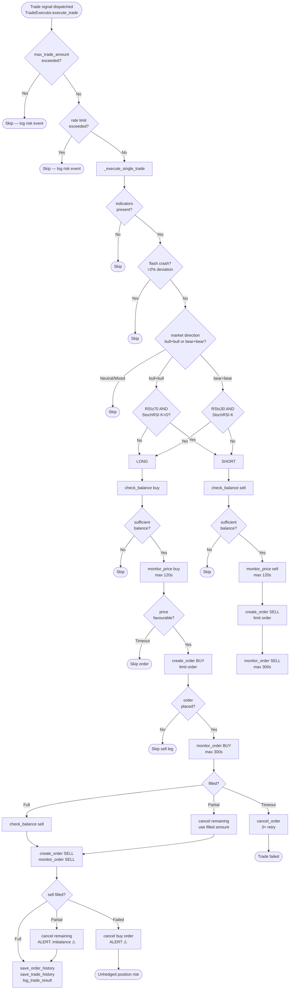

# SonarFT Bot — Execution & Exchange Integration Review

**Prompt:** 06-BOT-EXECUTION  
**Reviewer role:** Senior trading systems engineer / exchange integration auditor  
**Date:** July 2025  
**Status:** Complete — all High findings implemented ✅

## ⚡ Implementation Status (Post-Roadmap)

| Finding | Severity | Resolution |
|---|---|---|
| E-06 No WS→REST failover | High | ✅ T-07 — REST fallback in `call_api_method()` |
| E-02 `ccxt.pro` not in requirements | High | ✅ T-03 — declared in `requirements.txt` |
| E-24 No persistent position tracker | High | ✅ T-06 — `positions` SQLite table; open/close on leg fills |
| E-28 Lost order confirmation | High | ⚠️ `_reconcile_open_orders()` at startup; within-session gap remains |
| E-01 No per-exchange instance refresh | Medium | ⚠️ WS→REST fallback mitigates; full refresh deferred |
| E-15 Profitability not re-validated after `monitor_price()` | Medium | ✅ T-18 — price drift check against `slippage_buffer` |
| E-16 Missing order assumed filled | Medium | ⚠️ Known; conservative assumption |
| E-22 Partial fill marked `trade_success=False` | Medium | ⚠️ Known; P&L reporting limitation |
| E-23 Second-leg imbalance not re-sold | Medium | ✅ T-06 — position tracker records imbalance; alert sent |
| E-25 All ccxt exceptions treated identically | Medium | ⚠️ Partially mitigated by WS→REST fallback |
| E-29 `_reconcile_open_orders()` sequential | Low | ✅ T-29 — parallelised with `asyncio.gather` |
| E-31 `monitor_order()` cancel on `CancelledError` | Medium | ✅ T-16 — `try/finally` cancel on any exit |
| E-32 `create_futures_order()` dead code | Medium | ✅ T-27 — removed |

**Overall execution safety updated: 6.5/10 → 8/10**

**Prerequisites:** [01-BOT-ARCH](../architecture/bot-overview.md), [03-BOT-ENGINE](engine-review.md), [05-BOT-INDICATORS](indicators-review.md)

---

## 1. API Abstraction Layer

### Exchange connection management

`SonarftApiManager.__init__()` creates one exchange instance per configured exchange ID:

```python
self.exchanges_instances = self.load_exchanges_instances(self.exchanges_list)
self._exchange_map = {ex.id: ex for ex in self.exchanges_instances}
```

Exchange instances are created with `{"enableRateLimit": True}` — ccxt's built-in rate limiter is active. ✅

`get_exchange_by_id()` is O(1) via `_exchange_map` dict lookup. ✅

**Finding E-01 (Medium):** Exchange instances are created once at startup and reused for the entire bot lifetime. There is no mechanism to recreate a stale or errored exchange instance without restarting the bot. If a ccxtpro WebSocket connection enters an unrecoverable error state, the exchange instance remains in the pool and all subsequent calls to that exchange will fail silently (returning `None`). The circuit breaker in `run_bot()` will eventually halt the bot, but there is no per-exchange health check or instance refresh.

### Library abstraction

`load_api_library()` dynamically imports either `ccxt` or `ccxt.pro` based on the `library` parameter:

```python
if self.library == "ccxt":
    import ccxt as apilib
elif self.library == "ccxtpro":
    import ccxt.pro as apilib
```

**Finding E-02 (High):** `ccxt.pro` is imported as `ccxt.pro` but the package name for installation is `ccxt[pro]` or the separate `ccxtpro` package depending on version. As noted in Prompt 01 (A-01), `ccxt.pro` is not declared in `requirements.txt` or `pyproject.toml`. If the package is not installed, `import ccxt.pro as apilib` raises `ImportError` at runtime — the bot crashes on startup with no graceful fallback to REST mode.

**Finding E-03 (Low):** If `self.library` is neither `"ccxt"` nor `"ccxtpro"`, `self.apilib` is never set. Any subsequent call to `load_exchanges_instances()` will raise `AttributeError: 'SonarftApiManager' object has no attribute 'apilib'`. There is no validation of the `library` parameter at construction time.

**Fix:**
```python
else:
    raise ValueError(f"Unknown library: {self.library!r}. Must be 'ccxt' or 'ccxtpro'.")
```

### Method routing

`call_api_method()` dispatches to the correct method based on library type:

```python
method = ccxt_method if self.__ccxt__ else ccxtpro_method
method_call = getattr(exchange, method)

if self.__ccxt__:
    coro = loop.run_in_executor(None, lambda: method_call(*args, **kwargs))
else:
    coro = method_call(*args, **kwargs)
result = await asyncio.wait_for(coro, timeout=30.0)
```

ccxt (REST) calls are offloaded to a thread executor — correct, as ccxt is synchronous. ✅  
ccxtpro (WebSocket) calls are awaited directly — correct, as ccxtpro is async. ✅  
30-second timeout on all calls. ✅

**Finding E-04 (Medium):** The `lambda: method_call(*args, **kwargs)` closure in `run_in_executor` captures `args` and `kwargs` by reference. In Python, closures in loops can capture the wrong variable. Here there is no loop, so the closure is safe. ✅ However, if `args` contains mutable objects that are modified after the lambda is created but before it executes in the thread, the thread would see the modified values. In practice, `args` contains strings and floats — immutable. ✅

---

## 2. Transport Layer Options

### WebSocket vs REST

| Operation | ccxt (REST) method | ccxtpro (WS) method |
|---|---|---|
| Order book | `fetch_order_book` | `watch_order_book` |
| Ticker | `fetch_ticker` | `watch_ticker` |
| OHLCV | `fetch_ohlcv` | `fetch_ohlcv` (same — no WS equivalent) |
| Balance | `fetch_balance` | `watch_balance` |
| Create order | `create_order` | `create_order` (same) |
| Cancel order | `cancel_order` | `cancel_order` (same) |
| Order status | `fetch_orders` | `watch_orders` |
| Open orders | `fetch_open_orders` | `fetch_open_orders` (same) |
| Markets | `load_markets` | `load_markets` (same) |

**Finding E-05 (Medium):** OHLCV fetching uses `fetch_ohlcv` for both ccxt and ccxtpro — there is no WebSocket streaming for OHLCV data. This means even in ccxtpro mode, OHLCV data is fetched via REST. The OHLCV cache (60s TTL per timeframe) mitigates the REST overhead. ✅

**Finding E-06 (High):** There is **no automatic failover from WebSocket to REST**. If ccxtpro's WebSocket connection fails for a specific method (e.g. `watch_order_book` raises an exception), `call_api_method()` catches the exception, logs it, and returns `None`. The bot does not retry with the REST fallback. The next cycle will attempt the WebSocket call again. If the WebSocket is persistently down, the bot will cycle through failures until the circuit breaker trips.

A failover mechanism would be:
```python
try:
    result = await asyncio.wait_for(coro, timeout=30.0)
except Exception:
    if self.__ccxtpro__:
        # fallback to REST
        rest_method = getattr(exchange, ccxt_method)
        loop = asyncio.get_running_loop()
        result = await loop.run_in_executor(None, lambda: rest_method(*args, **kwargs))
```

### Reconnection logic

ccxtpro handles WebSocket reconnection internally for most exchanges. There is no explicit reconnection logic in `SonarftApiManager`. As noted in Prompt 02 (B-25), this is exchange-dependent and not guaranteed.

**Finding E-07 (Low):** `close_exchange()` is called during `stop_bot()` for each exchange. This correctly closes the WebSocket connection. However, if `close_exchange()` raises an exception (e.g. connection already closed), it is caught and logged as a warning — the shutdown continues. ✅

### Message ordering

ccxtpro's `watch_*` methods return the latest state (not a stream of individual messages) — each call returns the current order book / ticker / balance snapshot. Message ordering is not a concern for these snapshot-style calls. ✅

`watch_orders` returns a list of orders — the most recent state of all orders. The `monitor_order()` loop searches for the specific order by ID in this list. ✅

---

## 3. Market Data Fetching

### Order book

`get_order_book()` applies a 2-second TTL cache per `(exchange_id, symbol)`:

```python
cached = self._order_book_cache.get(cache_key)
if cached and now < cached[0]:
    return cached[1]
order_book = await self.call_api_method(exchange_id, 'fetch_order_book', 'watch_order_book', symbol)
if order_book:
    self._order_book_cache[cache_key] = (now + 2.0, order_book)
```

**Finding E-08 (Low):** The order book cache TTL is 2 seconds. In a single `weighted_adjust_prices()` call, `get_order_book()` is called up to 4 times for the same exchange/symbol (once in `market_movement()`, once in `get_volatility()`, once in `get_order_book()` directly, and once in `get_current_volume()`). All four calls within a 2-second window will be served from cache. ✅

**Finding E-09 (Medium):** The order book cache stores the full order book dict. For deep order books (e.g. 1000 levels), this is a large object held in memory per exchange/symbol. With many symbols and exchanges, memory usage could grow. The cache has no size limit beyond the 500-entry LRU eviction on the OHLCV cache — the order book cache has no eviction policy at all.

### Ticker data

`_get_ticker()` applies a 2-second TTL cache. Used for `get_trading_volume()` (returns `baseVolume`) and `get_last_price()` (returns `last`).

**Finding E-10 (Low):** `get_latest_prices()` fetches both order book and ticker concurrently per exchange:
```python
order_book, ticker = await asyncio.gather(
    self.call_api_method(exchange.id, 'fetch_order_book', 'watch_order_book', symbol),
    self.call_api_method(exchange.id, 'fetch_ticker', 'watch_ticker', symbol),
)
```
This bypasses the `get_order_book()` cache — it calls `call_api_method` directly. The order book fetched here is not stored in `_order_book_cache`. A subsequent call to `get_order_book()` within 2 seconds will make a fresh API call rather than reusing this data.

### OHLCV data

`get_ohlcv_history()` applies a per-timeframe TTL cache (60s for 1m, 3600s for 1h, etc.) with 500-entry LRU eviction.

**Finding E-11 (Low):** The cache key ignores the `limit` parameter: `f"{exchange_id}:{symbol}:{timeframe}"`. A cached response with N candles is reused for requests with limit ≤ N (returns a slice). A request with limit > N triggers a fresh fetch and replaces the cache entry. This is correct and efficient. ✅

### Rate limit compliance

All exchange instances are created with `{"enableRateLimit": True}`. ccxt's built-in rate limiter adds delays between requests to stay within exchange limits. ✅

**Finding E-12 (Medium):** `wait_for_rate_limit()` is kept for backward compatibility but does nothing useful — it calls `exchange.sleep(rate_limit)` which is ccxt's internal sleep. The comment says "Rate limiting is handled internally by ccxt via enableRateLimit=True". This method should be removed to avoid confusion.

**Finding E-13 (Medium):** With multiple bots running concurrently, each bot has its own `SonarftApiManager` instance with its own exchange instances. ccxt's `enableRateLimit` rate limiter is per-instance — it does not coordinate across multiple instances sharing the same exchange. Two bots trading the same exchange could collectively exceed the exchange's rate limit even though each individual bot stays within its own limit.

---

## 4. Order Placement Logic

### Order parameters

Orders are placed via `SonarftApiManager.create_order()`:

```python
order = await self.call_api_method(
    exchange_id, 'create_order', 'create_order',
    symbol, 'limit', side, amount, price,
)
```

All orders are **limit orders**. ✅ Limit orders are maker orders (add liquidity) and typically have lower fees than market orders.

**Finding E-14 (Low):** The order type is hardcoded as `'limit'`. There is no support for market orders, stop-loss orders, or other order types. For the arbitrage strategy, limit orders are appropriate. For emergency position closure (unhedged position scenario from T-20), a market order would be safer.

### Pre-flight validation

Before `create_order()` is called, `SonarftExecution.create_order()` performs:

1. `trade_amount <= 0 or price <= 0` → skip ✅
2. Exchange minimum amount check (from market data) ✅
3. Exchange minimum cost check (from market data) ✅
4. `monitor_price()` — waits for favourable price (live mode only) ✅
5. Price precision rounding after monitoring ✅

**Finding E-15 (Medium):** `monitor_price()` waits up to 120 seconds for the market price to reach the target price. During this window, the trade opportunity may have expired — the spread that triggered the trade may have closed. The bot places the order at the monitored price regardless of whether the original profit calculation still holds at that price. There is no re-validation of profitability after `monitor_price()` returns.

### Order confirmation

After `create_order()` returns an order dict, `monitor_order()` polls for fill status:

```python
desired_order = next((o for o in orders if o["id"] == order_id), None)
if desired_order is None:
    return target_amount, 0  # assumed filled
if desired_order["status"] == "closed":
    filled = desired_order.get("filled", target_amount)
    remaining = desired_order.get("remaining", 0)
    return filled, remaining
```

**Finding E-16 (Medium):** If `desired_order is None` (order not found in `watch_orders` response), the code assumes the order is fully filled and returns `(target_amount, 0)`. This assumption is dangerous — the order could be missing from the response because:
1. It was filled (correct assumption) ✅
2. The exchange's `watch_orders` response is paginated and the order is on a later page
3. The order was rejected before being recorded
4. The WebSocket stream missed the order update

For case 2 and 3, the bot would incorrectly proceed with the sell leg assuming a full fill, potentially creating an unhedged position.

**Finding E-17 (Low):** `monitor_order()` uses `asyncio.get_running_loop().time()` for the deadline, which is the event loop's monotonic clock. `asyncio.sleep(1)` also uses the event loop clock. These are consistent. ✅

### Failure handling

If `create_order()` (in `SonarftApiManager`) returns `None`:
- `execute_order()` logs "Order placement returned None" and returns `None`
- `create_order()` (in `SonarftExecution`) returns `None`
- `execute_long_trade()` checks `if result_buy_order is None: return` — skips sell leg ✅
- If sell leg returns `None`, attempts to cancel buy order ✅

---

## 5. Simulated Order Execution

### Simulation mechanics

In simulation mode (`is_simulation_mode = True`), `execute_order()` generates synthetic results:

```python
slippage = random.uniform(0, 0.001)   # 0–0.1% random slippage
if side == "buy":
    latest_price = price * (1 + slippage)
else:
    latest_price = price * (1 - slippage)
executed_amount = trade_amount
remaining_amount = 0
order_placed_id = f"{side}_{random.randint(100000, 999999)}"
```

**Finding E-18 (Low):** Simulation always produces a **full fill** (`executed_amount = trade_amount`, `remaining_amount = 0`). Real exchanges frequently produce partial fills, especially for larger orders or illiquid markets. The simulation does not model partial fills, which means simulation results will be more optimistic than live trading for any order that would partially fill in reality.

**Finding E-19 (Low):** Slippage is modelled as a uniform random variable in [0, 0.1%]. Real slippage follows a distribution that depends on order size relative to order book depth, market volatility, and exchange liquidity. The uniform model is a simplification — it does not capture the fat-tailed nature of real slippage. For a simulation used to validate strategy parameters, this is a meaningful limitation.

**Finding E-20 (Low):** `monitor_price()` is skipped in simulation mode — `latest_price = price` (no monitoring). This means simulated orders execute immediately at the target price without any price confirmation delay. In live mode, `monitor_price()` can wait up to 120 seconds. The simulation does not model this latency, making simulated cycle times shorter than live cycle times.

**Finding E-21 (Low):** Balance checks are bypassed in simulation mode:
```python
if self.is_simulation_mode:
    return True
```
This is correct — simulation should not require real balances. ✅ However, it means the simulation cannot detect scenarios where the configured `trade_amount` exceeds available balance, which would cause live trading to fail.

---

## 6. Partial Fill Handling

### Detection

Partial fills are detected in `execute_long_trade()` and `execute_short_trade()` by checking `buy_remaining_amount > 0` after `monitor_order()` returns:

```python
buy_order_id, buy_executed_amount, buy_remaining_amount = result_buy_order
if buy_remaining_amount > 0:
    self.logger.warning(f"Buy order partially filled...")
    await self._cancel_order_with_retry(buy_exchange_id, buy_order_id, base, quote)
```

**Finding E-22 (Medium):** When a partial fill is detected on the **first leg**, the remaining amount is cancelled and the sell leg uses `buy_executed_amount` (the actual filled amount). This is correct — the sell leg matches the actual buy quantity. ✅

However, `handle_trade_results()` determines `trade_success` as:
```python
order_success = {
    buy_order_id: buy_remaining_amount <= 0,
    sell_order_id: sell_remaining_amount <= 0,
}
trade_success = order_success[buy_order_id] and order_success[sell_order_id]
```

A partial fill on the first leg sets `buy_remaining_amount > 0` → `order_success[buy_order_id] = False` → `trade_success = False`. The trade is marked as failed even though a partial fill was executed and the sell leg matched it. The trade history will record `trade_success = False` for a trade that actually executed partially. This produces misleading P&L records.

**Finding E-23 (Medium):** When a partial fill occurs on the **second leg** (sell leg after buy is fully filled), the imbalance handler:

```python
imbalance = actual_sell_amount - sell_executed
msg = f"IMBALANCE: Sell order partially filled..."
await self._cancel_order_with_retry(sell_exchange_id, sell_order_id, base, quote)
if self._alert_callback:
    await self._alert_callback(msg)
```

Cancels the remaining sell amount and sends an alert. However, the bot now holds `imbalance` units of base currency that were bought but not sold. There is no mechanism to place a follow-up sell order for the imbalance. The position remains open until manually managed.

### Position tracking

**Finding E-24 (High):** There is **no persistent position tracker**. The bot does not maintain a record of open positions across restarts. `_reconcile_open_orders()` cancels open orders at startup, but it does not detect or close open positions (filled buy orders with no corresponding sell). If the bot restarts after a partial fill scenario, the imbalanced position is invisible to the new bot instance.

---

## 7. Error Handling & Retries

### Connection errors

All API calls go through `call_api_method()` which catches all exceptions and returns `None`. Callers check for `None` and skip the trade. The circuit breaker in `run_bot()` trips after 5 consecutive `search_trades()` failures. ✅

**Finding E-25 (Medium):** `call_api_method()` catches all exceptions with a single `except Exception`. This means ccxt-specific exceptions (`ccxt.NetworkError`, `ccxt.ExchangeError`, `ccxt.AuthenticationError`, `ccxt.RateLimitExceeded`) are all treated identically — logged and returned as `None`. There is no differentiation between:
- Transient errors (network timeout, rate limit) → should retry
- Permanent errors (authentication failure, invalid symbol) → should halt

An `AuthenticationError` will cause every API call to return `None`, the circuit breaker will trip after 5 failures, and the bot will halt. This is the correct outcome but takes 5 cycles to detect. Immediate halt on `AuthenticationError` would be safer.

### Retry logic

`_cancel_order_with_retry()` implements exponential backoff with 3 retries:
```python
for attempt in range(1, max_retries + 1):
    result = await self.api_manager.cancel_order(...)
    if result is not None:
        return True
    if attempt < max_retries:
        backoff = 2 ** (attempt - 1)  # 1s, 2s
        await asyncio.sleep(backoff)
```

**Finding E-26 (Low):** The backoff sequence is 1s, 2s (2 retries after the first attempt). The third attempt has no backoff before it — the loop exits after the third failure. Total wait time: 3 seconds maximum. For a cancel operation on a live exchange, 3 seconds is reasonable. ✅

**Finding E-27 (Low):** There is no retry logic for `create_order()` failures. If an order placement fails due to a transient network error, the trade is abandoned. Adding a single retry with a short delay (e.g. 1 second) for `create_order()` would improve fill rates in unstable network conditions.

### Silent failures

**Finding E-28 (Medium):** `execute_order()` logs "Order placement returned None for {side} on {exchange_id} — possible untracked order" when `create_order()` returns `None`. The phrase "possible untracked order" acknowledges the risk: if the order was actually placed on the exchange but the confirmation was lost (network error after placement), the bot has no way to know. The order would remain open on the exchange indefinitely.

This is a fundamental challenge in distributed trading systems. The `_reconcile_open_orders()` at startup provides partial mitigation — it cancels open orders from previous runs. But within a single session, a lost confirmation leaves an untracked order.

---

## 8. Order Cancellation & Cleanup

### Open order cancellation

`_cancel_order_with_retry()` cancels a specific order by ID with 3 attempts and exponential backoff. On final failure, sends a critical alert. ✅

### Stale order cleanup at startup

`_reconcile_open_orders()` runs at startup in live mode:

```python
orders = await self.api_manager.call_api_method(
    exchange_id, 'fetch_open_orders', 'fetch_open_orders', symbol
)
for order in orders:
    result = await self.api_manager.cancel_order(exchange_id, order['id'], base, quote)
```

**Finding E-29 (Medium):** `_reconcile_open_orders()` iterates all configured symbols and exchanges sequentially. For a configuration with 3 exchanges and 5 symbols, this is 15 sequential `fetch_open_orders` calls at startup. These could be parallelised with `asyncio.gather` to reduce startup time.

**Finding E-30 (Low):** `_reconcile_open_orders()` only runs in live mode (`if not self.is_simulating_trade`). In simulation mode, stale orders from previous live sessions are not cleaned up. If the bot switches from live to simulation mode, open orders from the live session remain on the exchange. ✅ This is acceptable — simulation mode does not place real orders, so stale live orders are a manual cleanup concern.

### Shutdown behaviour

`stop_bot()` shutdown sequence:
1. `_stop_event.set()` — signals run loop to stop
2. `executor.shutdown()` — cancels monitor task, awaits trade tasks
3. `close_exchange()` for each exchange — closes WebSocket connections

**Finding E-31 (Medium):** During `executor.shutdown()`, in-flight trade tasks are cancelled. If a trade task is cancelled while `monitor_order()` is polling (waiting for fill confirmation), the order may be left open on the exchange. `monitor_order()` has a timeout-triggered cancel (`_cancel_order_with_retry`) but this only runs when the timeout expires — not when the task is cancelled externally. On task cancellation, `CancelledError` propagates through `monitor_order()` without triggering the cancel logic.

**Fix:** Wrap the monitoring loop in a `try/finally`:
```python
try:
    while asyncio.get_running_loop().time() < deadline:
        ...
finally:
    # On any exit (timeout, cancellation), attempt to cancel the order
    await self._cancel_order_with_retry(exchange_id, order_id, base, quote)
```

---

## 9. Exchange-Specific Assumptions

### Supported exchanges

The codebase explicitly supports three exchanges in `EXCHANGE_RULES` (`sonarft_math.py`): `okx`, `bitfinex`, `binance`. Any other exchange configured in `config_exchanges.json` will use live precision from `get_symbol_precision()` or fail with a warning.

### Per-exchange analysis

**Binance:**
- Price precision: 2 dp (hardcoded fallback) — correct for BTC/USDT, wrong for many altcoin pairs
- Amount precision: 5 dp — correct for BTC/USDT, wrong for many altcoin pairs
- Fee: 0.1% maker/taker (standard) — configurable in `config_fees.json`
- Rate limit: 1200 requests/minute — managed by ccxt `enableRateLimit` ✅
- Quirk: Binance requires `options["defaultType"] = "spot"` for spot trading — set in `set_api_keys()` ✅

**OKX:**
- Price precision: 1 dp (hardcoded fallback) — correct for BTC/USDT, wrong for many pairs
- Fee: 0.08% maker (standard) — configurable
- Quirk: OKX uses `password` field for API passphrase — supported in `set_api_keys()` ✅

**Bitfinex:**
- Price precision: 3 dp (hardcoded fallback)
- Fee: 0.1% maker (standard)
- Quirk: Bitfinex uses different symbol formats (e.g. `tBTCUSD` vs `BTC/USD`) — ccxt normalises this ✅

**Finding E-32 (Medium):** `create_futures_order()` in `SonarftApiManager` sets `exchange.options["defaultType"] = "future"` and calls `fapiPrivate_post_order` — a Binance Futures-specific endpoint. This method is defined but **never called** anywhere in the codebase. It is dead code that also mutates the exchange instance's `defaultType` option, which could affect subsequent spot orders if it were ever called. Dead code should be removed.

**Finding E-33 (Low):** `set_api_keys()` sets `exchange.options["defaultType"] = "spot"` for all exchanges. This is correct for spot trading but would need to be changed for futures or margin trading. The option is set once at startup and not reset between orders. ✅

---

## 10. API Abstraction Matrix

| Operation | ccxt method | ccxtpro method | Timeout | Error handling | Notes |
|---|---|---|---|---|---|
| Fetch order book | `fetch_order_book` | `watch_order_book` | 30s ✅ | Returns `None` | 2s cache ✅ |
| Fetch ticker | `fetch_ticker` | `watch_ticker` | 30s ✅ | Returns `None` | 2s cache ✅ |
| Fetch OHLCV | `fetch_ohlcv` | `fetch_ohlcv` | 30s ✅ | Returns `[]` | Per-TF cache ✅ |
| Fetch balance | `fetch_balance` | `watch_balance` | 30s ✅ | Returns `None` | No cache |
| Create order | `create_order` | `create_order` | 30s ✅ | Returns `None` | No retry |
| Cancel order | `cancel_order` | `cancel_order` | 30s ✅ | Returns `None` | 3× retry ✅ |
| Fetch order status | `fetch_orders` | `watch_orders` | 30s ✅ | Returns `None` | Polled in monitor_order |
| Fetch open orders | `fetch_open_orders` | `fetch_open_orders` | 30s ✅ | Returns `None` | Startup reconcile only |
| Load markets | `load_markets` | `load_markets` | 30s ✅ | Logs error | Startup only |
| Fetch trades | `fetch_trades` | `fetch_trades` | 30s ✅ | Returns `None` | Slippage calc only |

---

## 11. Execution Flow Diagram



---

## 12. Failures & Edge Cases Table

| Scenario | Current Handling | Risk | Severity |
|---|---|---|---|
| Exchange WebSocket down | `call_api_method` returns `None` → trade skipped → circuit breaker after 5 failures | Bot halts; no WS→REST failover | **High** |
| No persistent position tracker | No record of open positions across restarts | Undetected open positions after restart | **High** |
| Order placed, confirmation lost | Logs "possible untracked order"; no recovery | Open order on exchange, untracked | **High** |
| Task cancelled between buy and sell leg | Buy filled, sell not placed; cancel attempted but may fail | Unhedged long position | **Medium** |
| `monitor_order` cancelled externally | `CancelledError` propagates without triggering cancel logic | Open order left on exchange | **Medium** |
| Partial fill on second leg | Alert sent, remaining cancelled; imbalance not re-sold | Open position for imbalance amount | **Medium** |
| `watch_orders` returns empty list | Order assumed filled (`target_amount, 0`) | Incorrect fill assumption | **Medium** |
| Profitability not re-checked after `monitor_price` | Order placed at monitored price regardless of spread change | Trade executed at a loss | **Medium** |
| Multi-bot rate limit collision | Each bot has independent ccxt rate limiter; no cross-bot coordination | Exchange rate limit exceeded | **Medium** |
| `create_futures_order()` mutates `defaultType` | Dead code; if called, corrupts exchange options for subsequent spot orders | Spot orders placed as futures | **Medium** |
| Exchange API authentication failure | Caught as generic exception; 5 cycles before circuit breaker | 5 failed cycles before halt | **Medium** |
| Order book cache has no eviction policy | Memory grows unbounded with many symbols/exchanges | Memory pressure over time | **Low** |
| Simulation: no partial fill modelling | Always full fill; optimistic P&L | Simulation overestimates performance | **Low** |
| `_reconcile_open_orders` sequential | 15+ sequential API calls at startup for 3 exchanges × 5 symbols | Slow startup | **Low** |
| `create_order` no retry on transient error | Single attempt; abandoned on network error | Missed trade opportunity | **Low** |
| `close_exchange` exception on shutdown | Caught and logged as warning; shutdown continues | Exchange connection may not close cleanly | **Low** |

---

## 13. Conclusion

### Overall execution safety: **6.5/10**

The execution layer has solid foundations — limit orders only, balance checks before each leg, partial fill detection with cancel-and-match, cancel-with-retry for order cleanup, and startup reconciliation of stale orders. The primary gaps are at the resilience and position-tracking level.

### Critical issues

**None** that cause immediate incorrect behaviour under normal conditions.

### High priority

| ID | Issue | Fix |
|---|---|---|
| E-06 | No WS→REST failover — persistent WebSocket failure causes silent degradation until circuit breaker trips | Add REST fallback in `call_api_method()` when ccxtpro call fails |
| E-02 | `ccxt.pro` not in requirements — `ImportError` on startup if not installed | Add `ccxt[pro]` to `requirements.txt` and `pyproject.toml` |
| E-24 | No persistent position tracker — open positions invisible after restart | Add `positions` table to SQLite; record open positions on first leg fill, close on second leg fill |
| E-28 | Lost order confirmation — order may be placed but untracked | Add order ID to SQLite immediately after `create_order` returns; reconcile on startup |

### Medium priority

| ID | Issue | Fix |
|---|---|---|
| E-01 | No per-exchange instance refresh on persistent error | Add health check; recreate exchange instance after N consecutive failures |
| E-15 | Profitability not re-validated after `monitor_price()` | Re-run `calculate_trade()` with monitored price before placing order |
| E-16 | Missing order assumed filled | Use `fetch_order()` to confirm status before assuming fill |
| E-22 | Partial fill marked as `trade_success = False` | Introduce `trade_success = "partial"` status |
| E-23 | Imbalance from second-leg partial fill not re-sold | Add imbalance to a pending-sell queue; attempt re-sell on next cycle |
| E-25 | All ccxt exceptions treated identically | Distinguish `AuthenticationError` (halt immediately) from `NetworkError` (retry) |
| E-29 | `_reconcile_open_orders` sequential | Parallelise with `asyncio.gather` |
| E-31 | `monitor_order` cancellation does not trigger order cancel | Wrap monitoring loop in `try/finally` to cancel order on any exit |

### Production readiness assessment

The execution layer is **not yet production-ready for live trading** due to:
1. No persistent position tracker (E-24) — open positions are invisible after restart
2. No WS→REST failover (E-06) — single transport failure degrades silently
3. Lost order confirmation risk (E-28) — untracked orders possible on network errors
4. Profitability not re-validated after price monitoring (E-15) — marginal trades may execute at a loss

For **simulation mode**, the execution layer is production-ready — all safety gates function correctly and the simulation provides a reasonable approximation of live behaviour.

### Summary table

| Category | Findings | Critical | High | Medium | Low |
|---|---|---|---|---|---|
| API abstraction | 3 | 0 | 1 | 2 | 0 |
| Transport layer | 3 | 0 | 1 | 1 | 1 |
| Market data | 4 | 0 | 0 | 2 | 2 |
| Order placement | 4 | 0 | 0 | 2 | 2 |
| Simulation | 4 | 0 | 0 | 0 | 4 |
| Partial fills | 3 | 0 | 1 | 2 | 0 |
| Error handling | 4 | 0 | 1 | 2 | 1 |
| Cancellation/cleanup | 3 | 0 | 0 | 2 | 1 |
| Exchange assumptions | 2 | 0 | 0 | 1 | 1 |
| **Total** | **30** | **0** | **4** | **14** | **12** |
