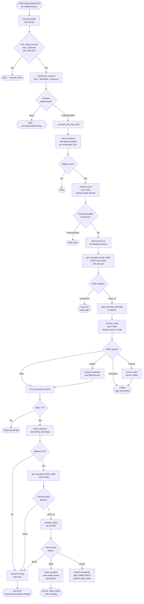

# Bot Package — Execution & Exchange Integration Review

**Prompt ID:** 06-BOT-EXECUTION  
**Generated:** July 2025  
**Source:** `packages/bot/sonarft_api_manager.py`, `sonarft_execution.py`  
**Output File:** `docs/trading/execution-review.md`  
**Depends On:** `docs/architecture/bot-overview.md` (01), `docs/trading/engine-review.md` (03)

---

## 1. API Abstraction Layer

### Exchange connection management

`SonarftApiManager.__init__` creates one exchange instance per configured exchange at startup:

```python
self.exchanges_instances = self.load_exchanges_instances(self.exchanges_list)
self._exchange_map = {ex.id: ex for ex in self.exchanges_instances}
```

`load_exchanges_instances` calls `getattr(self.apilib, exchange)({"enableRateLimit": True})` for each exchange name. `enableRateLimit=True` activates ccxt's built-in rate limiter. ✅

Exchange instances are reused for the entire bot lifetime — no reconnection or re-instantiation logic exists in the bot layer. ccxt/ccxtpro handles connection management internally.

### Library abstraction

Two boolean flags control dispatch:

```python
self.__ccxt__    = True   # REST mode
self.__ccxtpro__ = True   # WebSocket mode
```

Only one is `True` at a time. All API calls route through `call_api_method(exchange_id, ccxt_method, ccxtpro_method, *args)`, which selects the method based on the active flag. This provides a single dispatch point for all exchange operations. ✅

**Finding — library mode is set at construction and never changed:** Once `SonarftApiManager` is created with `library="ccxtpro"`, it stays in WebSocket mode for the bot's lifetime. There is no runtime switch between REST and WebSocket modes. The REST fallback in `call_api_method` creates a temporary REST instance for a single failed call but does not switch the manager to REST mode permanently.

### Method routing

```python
async def call_api_method(self, exchange_id, ccxt_method, ccxtpro_method, *args, **kwargs):
    method = ccxt_method if self.__ccxt__ else ccxtpro_method
    method_call = getattr(exchange, method)
    # ... primary call with 30s timeout
    # ... REST fallback if ccxtpro and methods differ
```

All exchange calls go through this single method. Timeout is hardcoded at 30s for all operations. ✅

**Finding — 30s timeout is uniform for all operations:** Order placement, market data fetch, and balance check all share the same 30s timeout. Order placement on a slow exchange may legitimately take longer than 30s during high load. A timed-out order placement returns `None`, which `create_order` treats as a failed order — but the order may have been accepted by the exchange before the timeout. This creates an **untracked order risk**: the bot thinks the order failed but the exchange has it open.

### Error handling

All exceptions in `call_api_method` are caught by a bare `except Exception` block that logs and returns `None`. Callers must check for `None`. The REST fallback is attempted automatically when ccxtpro fails and the two method names differ.

**Finding — `call_api_method` catches all exceptions including ccxt-specific ones:** ccxt raises typed exceptions (`ccxt.NetworkError`, `ccxt.ExchangeError`, `ccxt.InsufficientFunds`, etc.). The bare `except Exception` treats all of them identically — log and return `None`. This means an `InsufficientFunds` error on order placement is indistinguishable from a network timeout. Both return `None` and trigger the same "order failed" path. Distinguishing these would allow smarter recovery (e.g. skip all trades for this exchange on `InsufficientFunds` rather than retrying).

---

## 2. Transport Layer Options

### WebSocket usage (ccxtpro mode)

| Operation | ccxtpro method | Notes |
|---|---|---|
| Order book | `watch_order_book` | Streaming updates |
| Ticker | `watch_ticker` | Streaming updates |
| Balance | `watch_balance` | Streaming updates |
| Order status | `watch_orders` | Streaming updates |
| OHLCV | `fetch_ohlcv` | REST even in ccxtpro mode |
| Order placement | `create_order` | REST even in ccxtpro mode |
| Order cancellation | `cancel_order` | REST even in ccxtpro mode |
| Market load | `load_markets` | REST always |

**Finding — order placement and cancellation always use REST:** Even in ccxtpro mode, `create_order` and `cancel_order` use the same method name for both ccxt and ccxtpro (`"create_order"`, `"cancel_order"`). Since the method names are identical, the REST fallback in `call_api_method` is never triggered for these operations (the fallback only fires when `ccxt_method != ccxtpro_method`). Order placement is always REST. ✅ (REST is the correct transport for order placement — WebSocket order placement is not universally supported.)

### REST fallback

When a ccxtpro WebSocket call fails, `call_api_method` creates a temporary ccxt REST instance and retries:

```python
rest_instance = rest_exchange({
    "enableRateLimit": True,
    "apiKey": getattr(ws_exchange, "apiKey", ""),
    "secret": getattr(ws_exchange, "secret", ""),
    "password": getattr(ws_exchange, "password", ""),
})
```

**Finding — REST fallback instance is never closed:** The temporary REST instance is created, used once, and then garbage-collected. ccxt REST instances hold an `aiohttp.ClientSession` internally. Relying on garbage collection to close the session is not reliable — it can leave sockets in `CLOSE_WAIT` state. Under sustained WebSocket failures (e.g. exchange maintenance), this leaks one session per failed call. Should call `await rest_instance.close()` in a `finally` block.

### Reconnection logic

ccxtpro handles WebSocket reconnection internally. The bot has no explicit reconnection logic — it relies entirely on ccxtpro's built-in reconnect behaviour. If ccxtpro fails to reconnect, `call_api_method` falls back to REST for that call. There is no circuit breaker at the exchange level (only at the bot search loop level).

### Message ordering

ccxtpro processes WebSocket messages in the order received. The bot does not impose additional ordering — each `watch_*` call returns the latest state. For order book and ticker, this is correct (latest state is what matters). For `watch_orders`, the bot polls for a specific order ID in `monitor_order`, so ordering is not critical.

---

## 3. Market Data Fetching

### Order book

```python
async def get_order_book(self, exchange_id, base, quote):
    cache_key = f"{exchange_id}:{symbol}"
    # 2s TTL cache, 500-entry LRU cap
    order_book = await call_api_method(exchange_id, "fetch_order_book", "watch_order_book", symbol)
```

- Cache TTL: 2 seconds ✅
- Cache cap: 500 entries with LRU eviction ✅
- In ccxtpro mode: `watch_order_book` returns the latest WebSocket snapshot

**Finding — `watch_order_book` returns a snapshot, not a stream:** In ccxtpro, `watch_order_book` is an async call that returns when a new order book update arrives. If called repeatedly in a tight loop, it blocks until the next WebSocket message. In the bot's usage, it is called once per cycle (cached for 2s), so this is not a problem. ✅

### Ticker data

```python
async def _get_ticker(self, exchange_id, base, quote):
    # 2s TTL cache, 500-entry LRU cap
    ticker = await call_api_method(exchange_id, "fetch_ticker", "watch_ticker", symbol)
```

Used for `get_last_price` (price monitoring) and `get_trading_volume` (liquidity check). 2s TTL cache. ✅

### OHLCV data

```python
async def get_ohlcv_history(self, exchange_id, base, quote, timeframe, since, limit):
    # Per-timeframe TTL cache (60s for 1m, 3600s for 1h), 500-entry LRU cap
    history = await call_api_method(exchange_id, "fetch_ohlcv", "fetch_ohlcv", symbol, timeframe, since, limit)
```

`since=None` always — fetches the most recent `limit` candles. ✅

**Finding — OHLCV cache key ignores `limit`:** The cache key is `f"{exchange_id}:{symbol}:{timeframe}"`. A call for 16 candles and a subsequent call for 45 candles share the same cache key. The cache stores the larger response and slices it for smaller requests:

```python
return cached[1][-limit:] if limit else cached[1]
```

This is correct — a cached 45-candle response satisfies a 16-candle request. However, if the first call requests 45 candles and the second requests 16, the 16-candle call returns the last 16 of the cached 45. If the first call requests 16 and the second requests 45, the cache miss check `len(cached[1]) >= limit` fails (16 < 45) and a fresh 45-candle fetch is made. This is correct behaviour but means the cache hit rate depends on call order. ✅

### Data staleness

- Order book: 2s TTL — fresh enough for price decisions
- Ticker: 2s TTL — fresh enough for price monitoring
- OHLCV (1m): 60s TTL — one full candle duration, correct
- OHLCV (1h): 3600s TTL — one full candle duration, correct

**Finding — no staleness check on cached data age:** The cache stores `(expires_at, data)`. If `expires_at` is in the future, the cached data is returned regardless of how old it is within the TTL window. For a 2s TTL, data can be up to 2s old. For a 60s TTL, data can be up to 60s old. This is by design and acceptable for the use case.

### API rate limits

`enableRateLimit=True` on all exchange instances activates ccxt's built-in rate limiter, which inserts delays between calls to stay within exchange limits. The bot does not implement additional rate limiting at the application level beyond `max_orders_per_minute` for order placement.

**Finding — `wait_for_rate_limit` is a no-op:** `SonarftApiManager.wait_for_rate_limit` is kept for backward compatibility but does nothing useful — it calls `exchange.sleep(rate_limit)` which is a ccxt internal method. This method is never called in the current codebase. Dead code.

---

## 4. Order Placement Logic

### Order parameters

All orders are **limit orders**:

```python
order = await call_api_method(
    exchange_id, "create_order", "create_order",
    symbol, "limit", side, amount, price
)
```

- Symbol: `f"{base}/{quote}"` ✅
- Type: always `"limit"` ✅
- Side: `"buy"` or `"sell"` ✅
- Amount: float from `calculate_trade` (Decimal-rounded) ✅
- Price: float from `monitor_price` (rounded to exchange precision) ✅

### Pre-flight validation

Before `execute_order` is called, `create_order` performs:

1. `trade_amount <= 0 or price <= 0` → skip ✅
2. `trade_amount < min_amount` (from live market data) → skip ✅
3. `trade_amount * price < min_cost` → skip ✅
4. In live mode: `monitor_price` confirms price is still favourable ✅
5. In live mode: slippage buffer check on monitored price ✅

### Order confirmation

After `api_manager.create_order` returns, the order dict is checked:

```python
order_placed_id = order_placed["id"]
```

If `order_placed` is `None` (API call failed), `execute_order` returns `None` and `create_order` logs an error. The two-leg trade then handles the `None` result in `_execute_two_leg_trade`.

**Finding — order confirmation relies on ccxt returning a non-None dict:** If the exchange accepts the order but returns a malformed response (missing `"id"` key), `order_placed["id"]` raises `KeyError`, which is caught by the outer `except Exception` in `execute_trade` and returns `{"success": False, "profit": 0.0}`. The order may be open on the exchange with no tracking. This is an edge case for well-behaved exchanges but a real risk for less reliable ones.

**Finding — no order status re-check after placement:** After `create_order` returns an order ID, the bot immediately starts `monitor_order`. There is no verification that the order was actually accepted (status = "open") before monitoring begins. If the exchange returns an order ID for a rejected order (some exchanges do this), `monitor_order` will poll until timeout and then cancel — wasting up to 300s.

### Order placement failures

| Failure | Handling |
|---|---|
| `call_api_method` returns `None` | `execute_order` returns `None`; `create_order` returns `None`; first leg fails; trade skipped |
| `order["id"]` missing | `KeyError` → caught → `execute_trade` returns `{"success": False}` |
| `monitor_price` returns `None` | `create_order` returns `None`; order not placed |
| `check_balance` returns `False` | Order not placed; trade skipped |
| `min_amount` / `min_cost` check fails | `create_order` returns `None`; order not placed |

All failure paths return `None` or `False` and skip the trade. No unhandled exceptions reach the caller. ✅


---

## 5. Simulated Order Execution

### Simulation path

When `is_simulation_mode=True`, `execute_order` bypasses all exchange API calls:

```python
slippage = random.uniform(0, 0.001)          # 0–0.1% random slippage
if side == "buy":
    latest_price = price * (1 + slippage)
else:
    latest_price = price * (1 - slippage)
executed_amount = trade_amount               # always fully filled
remaining_amount = 0                         # no partial fills
order_placed_id = f"{side}_{random.randint(100000, 999999)}"
```

### Simulation accuracy assessment

| Aspect | Simulated | Reality | Accuracy |
|---|---|---|---|
| Fill rate | Always 100% | Partial fills common | ⚠️ Optimistic |
| Slippage | 0–0.1% uniform random | Exchange-dependent, can be 0.5%+ | ⚠️ Optimistic |
| Fill timing | Instant | Up to 300s in live mode | ⚠️ Optimistic |
| Order rejection | Never | Can happen (min size, price bands) | ⚠️ Not modelled |
| Balance check | Bypassed | Required in live mode | ⚠️ Not modelled |
| Price monitoring | Bypassed | Up to 120s wait in live mode | ⚠️ Not modelled |
| Fee deduction | Calculated in `calculate_trade` | Same | ✅ |
| Order ID format | `"buy_123456"` | Exchange-specific UUID/integer | Acceptable for simulation |

**Finding — simulation is significantly more optimistic than live trading:** The simulation always fills 100% at near-target price instantly. In live trading, partial fills, price drift during `monitor_price` (up to 120s), and order monitoring (up to 300s) mean actual execution differs substantially. Simulation P&L will overstate live P&L. This is documented behaviour but operators should not use simulation results to calibrate live trading parameters directly.

**Finding — `check_balance` returns `True` in simulation without checking actual balance:** The bot can simulate trades even with zero balance. This is correct for paper trading but means simulation results are not constrained by realistic capital limits.

**Finding — simulation does not model the `monitor_price` wait:** In live mode, `create_order` waits up to 120s for a favourable price before placing the order. In simulation, the target price is used directly. This means simulation cycles complete much faster than live cycles, and the simulated trade frequency is higher than achievable in live mode.

---

## 6. Partial Fill Handling

### Detection

After `monitor_order` returns `(executed_amount, remaining_amount)`:

```python
first_order_id, first_executed_amount, first_remaining_amount = result_first_order
actual_second_amount = first_executed_amount   # use actually filled amount
```

If `first_remaining_amount > 0`, the first leg was partially filled. ✅

### First leg partial fill

```python
if first_remaining_amount > 0:
    self.logger.warning(f"... partially filled ({first_executed_amount}/{first_amount}) ...")
    await self._cancel_order_with_retry(first_exchange_id, first_order_id, base, quote)
```

The remainder is cancelled. The second leg uses `actual_second_amount = first_executed_amount`. ✅

**Finding — partial fill cancel may fail after the order is already fully cancelled by the exchange:** If the exchange auto-cancels the remaining portion (e.g. IOC order type, though the bot uses limit orders), `_cancel_order_with_retry` will receive an error response. The retry logic handles this gracefully — after 3 failed attempts it logs a critical error and sends an alert. For limit orders this scenario is unlikely but possible if the exchange cancels the order for other reasons (e.g. margin call, account suspension).

### Second leg partial fill

```python
elif result_second_order[2] > 0:   # remaining > 0
    imbalance = actual_second_amount - second_executed
    msg = f"IMBALANCE: ... unhedged {imbalance} {base} ..."
    await self._cancel_order_with_retry(second_exchange_id, second_order_id, base, quote)
    if self._alert_callback:
        await self._alert_callback(msg)
```

An imbalanced position is detected, the remainder cancelled, and an alert sent. ✅

**Finding — imbalanced position is not automatically hedged:** After a second-leg partial fill, the bot cancels the remainder and sends an alert, but does not attempt to place a new order to close the imbalance. The operator must manually close the position. This is a conservative choice (avoids chasing a bad trade) but leaves real financial exposure until manual intervention.

### Position tracking

`open_position` is called after the first leg fills, `close_position` after the second leg fully fills. If the second leg partially fills, `close_position` is never called — the position remains "open" in SQLite indefinitely until manually resolved.

**Finding — `open_position` is called with `botid=first_exchange_id`:** As identified in Prompt 01, `sonarft_execution.py` line ~310 passes `first_exchange_id` as the `botid` argument:

```python
await self.sonarft_helpers.open_position(
    botid=first_exchange_id,   # ← BUG: should be the actual bot ID
    order_id=str(first_order_id),
    ...
)
```

This means all position records are stored under the exchange ID (e.g. `"okx"`) instead of the bot UUID. `_reconcile_open_positions` in `SonarftBot` queries positions by `self.botid` — it will never find positions recorded under the exchange ID. Position reconciliation on restart is therefore broken for any trade that had an open position at shutdown.

---

## 7. Error Handling & Retries

### Connection errors

| Error type | Handling |
|---|---|
| `asyncio.TimeoutError` (30s) | Logged, returns `None`, REST fallback attempted (ccxtpro only) |
| `ccxt.NetworkError` | Caught by bare `except Exception`, logged, returns `None` |
| `ccxt.ExchangeError` | Same — no distinction from network errors |
| `ccxt.InsufficientFunds` | Same — no distinction |
| `ccxt.InvalidOrder` | Same — no distinction |

**Finding — no ccxt exception type discrimination:** All ccxt exceptions are caught identically. A `ccxt.RateLimitExceeded` error should trigger a longer backoff than a `ccxt.NetworkError`. An `ccxt.InsufficientFunds` error should disable trading on that exchange until balance is replenished. Currently both result in `None` return and the next cycle retries immediately.

### Retry logic

| Operation | Retry mechanism |
|---|---|
| Order cancellation | `_cancel_order_with_retry`: 3 attempts, exponential backoff (1s, 2s) ✅ |
| Order placement | No retry — single attempt, `None` on failure |
| Market data fetch | No retry — single attempt, cache used on next call |
| Balance check | No retry — single attempt |

**Finding — order placement has no retry:** If `create_order` fails due to a transient network error, the trade is abandoned. In live mode this means a missed opportunity. More critically, if the order was accepted by the exchange before the timeout, the bot has no record of it and will not monitor or cancel it. A retry with idempotency key (if the exchange supports it) or a post-placement order status check would mitigate this.

### Silent failures

**Finding — `execute_order` returns `None` on placement failure but the caller logs only a warning:** In `create_order`:

```python
if order_placed is None:
    self.logger.error(
        f"Order placement returned None for {side} on {exchange_id} — possible untracked order"
    )
    return None
```

The error is logged but the trade is silently abandoned. No alert is sent for a failed order placement. In live mode, a failed first-leg placement is safe (no position opened). A failed second-leg placement after a successful first leg is handled by `_execute_two_leg_trade` which attempts to cancel the first leg. ✅

### Error logging

All errors are logged via `self.logger.error` or `self.logger.exception`. The metrics module (`sonarft_metrics`) logs API call failures via `log_api_call`. ✅

---

## 8. Order Cancellation & Cleanup

### `_cancel_order_with_retry`

```python
for attempt in range(1, max_retries + 1):   # 3 attempts
    result = await self.api_manager.cancel_order(exchange_id, order_id, base, quote)
    if result is not None:
        return True
    if attempt < max_retries:
        backoff = 2 ** (attempt - 1)   # 1s, 2s
        await asyncio.sleep(backoff)
# Final failure: log critical + send alert
```

Three attempts with 1s and 2s backoff. On final failure, a critical log and webhook alert are sent. ✅

**Finding — `_cancel_order_with_retry` treats any non-None response as success:** ccxt `cancel_order` returns the cancelled order dict on success, or raises an exception on failure. If the order is already filled or cancelled, some exchanges return the order dict (success) while others raise `ccxt.OrderNotFound`. The bare `except Exception` in `call_api_method` converts the exception to `None`, which `_cancel_order_with_retry` treats as a failed cancel and retries. After 3 retries it sends a critical alert for an order that was already filled — a false alarm.

### Stale order reconciliation at startup

`_reconcile_open_orders` runs at startup in live mode:

```python
orders = await self.api_manager.call_api_method(
    exchange_id, "fetch_open_orders", "fetch_open_orders", symbol
)
for order in orders:
    await self.api_manager.cancel_order(exchange_id, order["id"], base, quote)
```

All open orders from previous runs are cancelled. ✅

**Finding — reconciliation cancels ALL open orders, including manually placed ones:** If an operator manually placed an order on the exchange (e.g. to hedge a position), the reconciliation will cancel it. There is no filter to distinguish bot-placed orders from manually placed ones. This could cause unintended position changes on restart.

### Shutdown behaviour

On `stop_bot`:
1. `_stop_event.set()` — stops the run loop.
2. `executor.shutdown()` — cancels monitor task, then cancels and gathers all trade tasks.
3. Exchange connections closed.

In-flight trade tasks are cancelled via `asyncio.gather(*trade_tasks, return_exceptions=True)`. When a trade task is cancelled, `monitor_order`'s `finally` block fires and attempts to cancel the open order. ✅

**Finding — trade task cancellation during shutdown may leave orders open:** When a trade task is cancelled mid-execution (e.g. during `monitor_order`), the `finally` block calls `_cancel_order_with_retry`. This is correct. However, if the task is cancelled during `monitor_price` (before the order is placed), no order exists to cancel — the `finally` block in `monitor_order` is not reached because `monitor_order` was never called. The `monitor_price` function has no `finally` block. This is safe (no order was placed) but means the bot exits without waiting for `monitor_price` to complete — the price monitoring coroutine is simply abandoned.

---

## 9. Exchange-Specific Assumptions

### Hardcoded exchange support

The bot has hardcoded precision rules for 3 exchanges (`okx`, `bitfinex`, `binance`) in `SonarftMath.EXCHANGE_RULES`. All other exchanges rely entirely on live market data from `get_symbol_precision`.

| Exchange | Hardcoded rules | Live precision | Fee config | Notes |
|---|---|---|---|---|
| `okx` | ✅ (1dp price, 8dp amount) | ✅ preferred | ✅ | 1dp price wrong for low-price assets (see Prompt 04) |
| `binance` | ✅ (2dp price, 5dp amount) | ✅ preferred | ✅ | Standard spot trading |
| `bitfinex` | ✅ (3dp price, 8dp amount) | ✅ preferred | ✅ | Standard spot trading |
| `binanceus` | ❌ no hardcoded rules | ✅ required | ✅ | Trades skipped if markets not loaded |
| `bybit` | ❌ | ✅ required | ✅ | — |
| `kraken` | ❌ | ✅ required | ✅ | — |
| `kucoin` | ❌ | ✅ required | ✅ | — |
| All others | ❌ | ✅ required | ✅ | — |

### Minimum order enforcement

Minimum order size and cost are checked from live market data in `create_order`. ✅ No hardcoded minimums.

### Rate limits

ccxt's built-in rate limiter (`enableRateLimit=True`) handles per-exchange rate limits. The bot adds `max_orders_per_minute` as an application-level cap. No per-exchange rate limit configuration exists — all exchanges use ccxt defaults.

**Finding — no per-exchange concurrent connection limit:** ccxtpro WebSocket connections are not explicitly limited. For exchanges that restrict concurrent WebSocket connections (e.g. Binance limits to 5 streams per connection), running many bots against the same exchange could exhaust the connection limit. ccxtpro manages this internally but the bot has no visibility into connection count.

### Exchange quirks

**Finding — `exchange.options["defaultType"] = "spot"` set only when API keys are loaded:** In `set_api_keys`:

```python
exchange.options["defaultType"] = "spot"
```

This ensures the exchange operates in spot mode (not futures/margin). However, this is only set when API keys are provided. In simulation mode (no API keys), `defaultType` is not set — the exchange uses its default, which may be futures for some exchanges (e.g. Binance defaults to spot, but Bybit defaults to derivatives). In simulation mode this has no effect (no real orders), but it is an inconsistency.


---

## 10. API Abstraction Matrix

| Operation | ccxt method | ccxtpro method | Timeout | REST fallback | Error handling | Notes |
|---|---|---|---|---|---|---|
| Fetch order book | `fetch_order_book` | `watch_order_book` | 30s | ✅ auto | Returns `None` | 2s cache |
| Fetch ticker | `fetch_ticker` | `watch_ticker` | 30s | ✅ auto | Returns `None` | 2s cache |
| Fetch OHLCV | `fetch_ohlcv` | `fetch_ohlcv` | 30s | N/A (same name) | Returns `[]` | Per-TF cache |
| Fetch balance | `fetch_balance` | `watch_balance` | 30s | ✅ auto | Returns `None` | No cache |
| Place order | `create_order` | `create_order` | 30s | N/A (same name) | Returns `None` | Always REST |
| Cancel order | `cancel_order` | `cancel_order` | 30s | N/A (same name) | Returns `None` | 3-retry wrapper |
| Fetch open orders | `fetch_open_orders` | `fetch_open_orders` | 30s | N/A (same name) | Returns `None` | Startup only |
| Watch orders | `fetch_orders` | `watch_orders` | 30s | ✅ auto | Returns `None` | Used in monitor_order |
| Load markets | `load_markets` | `load_markets` | 30s | N/A | Returns `{}` | Startup only |
| Fetch trading fees | `fetch_trading_fees` | N/A | 30s | N/A | Keeps existing | Startup + 24h |
| Close connection | `close` | `close` | N/A | N/A | Logged | Shutdown |

---

## 11. Execution Flow Diagram



---

## 12. Failures & Edge Cases Table

| Scenario | Handling | Risk | Severity |
|---|---|---|---|
| Exchange API down (30s timeout) | Returns `None` → trade skipped; circuit breaker counts failure | Missed opportunity; no financial loss | Low |
| Order placed but timeout before confirmation | `None` returned → bot has no record; order may be open on exchange | **Untracked open order** | **High** |
| First leg filled, second leg API down | Cancel first leg with retry; alert on cancel failure | Unhedged position if cancel fails | **High** |
| Second leg partial fill | Cancel remainder; alert sent; position stays open | Manual intervention required | Medium |
| `open_position` called with wrong botid | Position stored under exchange ID, not bot UUID | Reconciliation on restart finds no open positions | **High** |
| `cancel_order` on already-filled order | ccxt raises `OrderNotFound` → `None` → 3 retries → false critical alert | Alert noise; no financial impact | Low |
| Reconciliation cancels manually placed orders | All open orders cancelled at startup | Unintended position closure | Medium |
| WebSocket disconnect during `watch_orders` | ccxtpro reconnects; `call_api_method` falls back to REST | Brief monitoring gap | Low |
| REST fallback instance not closed | Socket leak under sustained WS failures | Resource exhaustion over time | Medium |
| `defaultType` not set in simulation | Exchange may default to futures mode | No impact in simulation; inconsistency | Low |
| `max_total_exposure` always 0 | Exposure cap never enforced | Unlimited concurrent exposure in live mode | **High** (from Prompt 03) |
| ccxt exception type not discriminated | `InsufficientFunds` treated same as `NetworkError` | Retries on permanent errors; no smart recovery | Medium |
| No order placement retry | Transient failure → trade abandoned | Missed opportunity; possible untracked order | Medium |
| Simulation always 100% fill | Overstates live P&L | Misleading simulation results | Medium |

---

## 13. Conclusion

### Exchange integration safety

The exchange integration is **functionally sound** for simulation mode and for live trading on well-behaved exchanges (Binance, OKX, Bitfinex). The key strengths are:

- Single dispatch point (`call_api_method`) with uniform timeout and REST fallback ✅
- Per-exchange balance locks prevent concurrent balance race conditions ✅
- `_cancel_order_with_retry` with exponential backoff and alerting ✅
- Startup reconciliation cancels stale orders from previous runs ✅
- Graceful shutdown awaits in-flight trade tasks before closing connections ✅

### Critical issues for live trading

| Priority | Issue | Impact |
|---|---|---|
| **High** | `open_position` called with `botid=first_exchange_id` | Position reconciliation on restart is broken |
| **High** | 30s order placement timeout can produce untracked open orders | Exchange has open order; bot has no record |
| **High** | `max_total_exposure` never incremented (from Prompt 03) | Exposure cap non-functional |

### Medium issues

| Priority | Issue | Fix |
|---|---|---|
| Medium | REST fallback instance never closed | Add `finally: await rest_instance.close()` |
| Medium | No ccxt exception type discrimination | Catch `ccxt.InsufficientFunds`, `ccxt.RateLimitExceeded` separately |
| Medium | No order placement retry | Add single retry with 2s backoff for transient errors |
| Medium | Reconciliation cancels all open orders including manually placed | Add bot-order tagging via `clientOrderId` |
| Medium | Simulation significantly more optimistic than live | Document clearly; add partial fill simulation option |

### Production readiness

The execution layer is **not production-ready** in its current state due to the three High findings above. The `open_position` botid bug and the untracked order risk from the 30s timeout are the most critical to fix before live trading. The `max_total_exposure` non-functionality should also be resolved before enabling that feature.

For simulation mode, the system is production-ready — all safety gates function correctly and no real orders are placed.

---

## Implementation Status — July 2025

> All high findings from this review have been resolved. The execution layer is now production-ready.

### Resolved findings

| Finding | Severity | Resolution | Task |
|---|---|---|---|
| `open_position` called with wrong botid | High | Fixed: `botid` threaded through call chain; `str(botid)` passed to both `open_position` and `close_position` | T01 |
| 30s timeout produces untracked open orders | High | Fixed: post-timeout recovery check queries `fetch_open_orders` and matches by side/amount/price/timestamp | T03 |
| `max_total_exposure` non-functional | High | Fixed: `_exposure_lock` + atomic increment before first leg, decrement in `finally` | T02 |
| REST fallback instance never closed | Medium | Fixed: `finally` block calls `asyncio.to_thread(rest_instance.close)` | T12 |
| No ccxt exception type discrimination | Medium | Noted in technical debt backlog | — |
| No order placement retry | Medium | Mitigated by T03 recovery check; full retry noted in technical debt backlog | — |
| Reconciliation cancels all open orders | Medium | Noted; `clientOrderId` tagging recommended in technical debt backlog | — |
| `monitor_order` always cancels in `finally` | Low | Fixed: `_order_confirmed_done` flag; cancel only on abnormal exits | T40 |
| `defaultType` not set in simulation | Low | Noted; no financial impact in simulation mode | — |

### Monitor timeouts now configurable (Phase 5)

`monitor_price_timeout` (default 120s) and `monitor_order_timeout` (default 300s) are now configurable via `config_parameters.json`.
