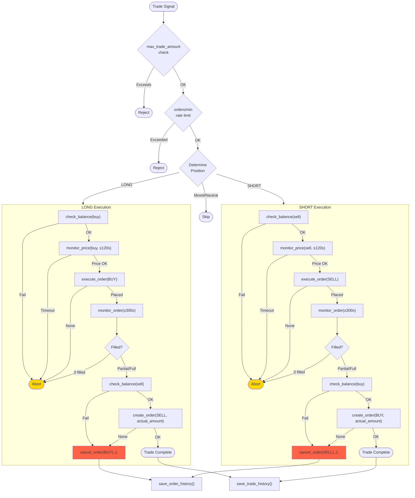

# SonarFT Bot — Execution & Exchange Integration Review

**Prompt:** 06-BOT-EXECUTION  
**Reviewer:** Senior Exchange Integration Engineer / Trading Safety Auditor  
**Date:** July 2025  
**Codebase:** `packages/bot` — `sonarft_execution.py` (412 LOC), `sonarft_api_manager.py` (354 LOC)

---

## 1. API Abstraction Layer

### 1.1 Architecture

`SonarftApiManager` is the sole gateway to exchange APIs. No other module calls ccxt/ccxtpro directly.

```
SonarftExecution ──┐
SonarftIndicators ─┤
SonarftPrices ─────┤──► SonarftApiManager ──► ccxt / ccxtpro ──► Exchange
SonarftValidators ─┘
```

### 1.2 Exchange Instance Management

```python
def load_exchanges_instances(self, exchanges: List[str]) -> List:
    return [
        getattr(self.apilib, exchange)({'enableRateLimit': True})
        for exchange in exchanges
    ]
```

- Instances created at startup from config (`exchanges_1: ["okx", "binance"]`)
- `enableRateLimit: True` — ccxt handles rate limiting internally
- Instances stored in `self.exchanges_instances` (list) and `self._exchange_map` (dict by ID)
- API keys set post-construction via `setAPIKeys()`

### 1.3 Method Routing — Dual API Dispatch

```python
async def call_api_method(self, exchange_id, ccxt_method, ccxtpro_method, *args, **kwargs):
    exchange = self.get_exchange_by_id(exchange_id)
    method = ccxt_method if self.__ccxt__ else ccxtpro_method
    method_call = getattr(exchange, method)
    if self.__ccxt__:
        loop = asyncio.get_running_loop()
        result = await loop.run_in_executor(None, lambda: method_call(*args, **kwargs))
    else:
        result = await method_call(*args, **kwargs)
```

| Aspect | Assessment |
|---|---|
| Library selection at startup | ✅ `load_api_library()` sets `__ccxt__` or `__ccxtpro__` flag |
| ccxt REST calls offloaded to thread | ✅ `run_in_executor(None, ...)` prevents event loop blocking |
| ccxtpro WebSocket calls awaited directly | ✅ Correct async pattern |
| Method name mapping | ✅ Each caller provides both method names |
| `getattr` dispatch | ✅ Dynamic — works for any ccxt method |
| Error handling | ⚠️ Generic `except Exception` — catches all errors, logs, returns `None` |

### 1.4 Error Handling Assessment

```python
try:
    result = await method_call(*args, **kwargs)
except Exception as e:
    self.logger.error(f"Error calling method {method}: {e}")
return result  # None if exception occurred
```

| Aspect | Assessment | Severity |
|---|---|---|
| All exceptions caught | ✅ No unhandled crashes | — |
| Returns `None` on error | ⚠️ Callers must check for `None` — some do, some don't | **Medium** |
| No exception type distinction | ⚠️ Rate limit errors, auth errors, network errors all treated the same | **Medium** |
| No retry logic | ⚠️ Single attempt — if it fails, returns `None` | **Medium** |
| Error logged with method name | ✅ Debuggable | — |

---

## 2. Transport Layer Options

### 2.1 WebSocket vs REST

| Mode | Library | Selection | Use Case |
|---|---|---|---|
| **WebSocket (default)** | `ccxt.pro` (ccxtpro) | `-l ccxtpro` or default | Lower latency, streaming data |
| **REST (fallback)** | `ccxt` | `-l ccxt` flag | Broader exchange support |

### 2.2 Method Mapping

| Operation | ccxt (REST) | ccxtpro (WebSocket) |
|---|---|---|
| Order book | `fetch_order_book` | `watch_order_book` |
| Ticker | `fetch_ticker` | `watch_ticker` |
| OHLCV | `fetch_ohlcv` | `fetch_ohlcv` (same — no watch) |
| Balance | `fetch_balance` | `watch_balance` |
| Place order | `create_order` | `create_order` (same) |
| Cancel order | `cancel_order` | `cancel_order` (same) |
| Watch orders | `fetch_orders` | `watch_orders` |
| Trade history | `fetch_trades` | `fetch_trades` (same) |
| Load markets | `load_markets` | `load_markets` (same) |

**Key observation:** Order placement (`create_order`) and cancellation (`cancel_order`) use the same method name in both modes — these are always REST calls even in ccxtpro mode. Only market data operations benefit from WebSocket streaming.

### 2.3 Failover Assessment

| Aspect | Assessment | Severity |
|---|---|---|
| **Automatic WebSocket→REST failover** | ❌ Not Found in Source Code — library is selected at startup and never changes | **Medium** |
| **Reconnection logic** | ✅ ccxtpro handles WebSocket reconnection internally | — |
| **Manual failover** | ✅ Restart bot with `-l ccxt` flag | — |
| **Per-exchange transport** | ❌ All exchanges use the same transport — can't use WebSocket for one and REST for another | **Low** |
| **Connection health monitoring** | ❌ Not Found in Source Code — relies on ccxt's internal error handling | **Low** |

### 2.4 Message Ordering

- **ccxtpro WebSocket:** Messages are processed in order by the event loop. `watch_order_book` returns the latest snapshot, not a delta — no ordering concern.
- **ccxt REST:** Each call is independent — no ordering concern.
- **Concurrent calls:** `asyncio.gather` may return results in any order, but each result is independent — no ordering concern.

✅ No message ordering issues.

---

## 3. Market Data Fetching

### 3.1 Order Book

```python
async def get_order_book(self, exchange_id, base, quote):
    cache_key = f"{exchange_id}:{symbol}"
    cached = self._order_book_cache.get(cache_key)
    if cached and now < cached[0]:
        return cached[1]
    order_book = await self.call_api_method(exchange_id, 'fetch_order_book', 'watch_order_book', symbol)
    if order_book:
        self._order_book_cache[cache_key] = (now + 2.0, order_book)
    return order_book
```

| Aspect | Assessment |
|---|---|
| Cache TTL | 2 seconds — fresh enough for trading decisions |
| Cache key | `exchange_id:base/quote` — correct granularity |
| Null handling | Returns `None` if API fails (no cache update) |
| Stale data risk | ⚠️ If cache is 1.9s old, it's used. In fast markets, 2s-old order book may be significantly different. |

### 3.2 OHLCV History

```python
async def get_ohlcv_history(self, exchange_id, base, quote, timeframe, since, limit):
    cache_key = f"{exchange_id}:{symbol}:{timeframe}:{limit}"
    ttl = _TIMEFRAME_SECONDS.get(timeframe, 60)
    # ... cache logic ...
    history = await self.call_api_method(exchange_id, 'fetch_ohlcv', 'fetch_ohlcv', symbol, timeframe, since, limit)
```

| Aspect | Assessment |
|---|---|
| Cache TTL | Matches candle duration (60s for 1m, 3600s for 1h) — ✅ correct |
| Cache size limit | 500 entries, LRU eviction — ✅ bounded |
| `since` parameter | Always `None` — fetches most recent candles | ✅ correct for indicators |
| Both modes use `fetch_ohlcv` | ✅ No `watch_ohlcv` in ccxtpro for most exchanges |

### 3.3 Ticker / Last Price

```python
async def get_last_price(self, exchange_id, base, quote):
    last_price = await self.call_api_method(exchange_id, 'fetch_ticker', 'watch_ticker', symbol)
    return last_price['last']
```

| Aspect | Assessment | Severity |
|---|---|---|
| No caching | ⚠️ Every call hits the exchange API | **Low** (used only in `monitor_price`, which polls every 3s) |
| No null check on `last_price` | ⚠️ If `call_api_method` returns `None`, `None['last']` → `TypeError` | **Medium** |
| ccxtpro `watch_ticker` | Returns latest cached ticker — effectively real-time | ✅ |

### 3.4 Trading Volume

```python
async def get_trading_volume(self, exchange_id, base, quote):
    trading_volume = await self.call_api_method(exchange_id, 'fetch_ticker', 'watch_ticker', symbol)
    return trading_volume['baseVolume']
```

Same null-check issue as `get_last_price`. If `call_api_method` returns `None`, `TypeError` on `None['baseVolume']`. Severity: **Medium**.

### 3.5 API Rate Limits

| Mechanism | Assessment |
|---|---|
| `enableRateLimit: True` on all exchange instances | ✅ ccxt handles rate limiting internally |
| `wait_for_rate_limit()` method exists | ✅ Legacy — no longer called (ccxt handles it) |
| No explicit rate limit tracking | ✅ Delegated to ccxt — correct approach |
| Concurrent API calls via `asyncio.gather` | ⚠️ 16+ concurrent calls per cycle — ccxt queues them internally, but burst may trigger exchange rate limits | **Low** |


---

## 4. Order Placement Logic

### 4.1 Order Parameters

Orders are placed via `SonarftApiManager.create_order()`:

```python
async def create_order(self, exchange_id, base, quote, side, amount, price):
    symbol = f"{base}/{quote}"
    order = await self.call_api_method(
        exchange_id, 'create_order', 'create_order',
        symbol, 'limit', side, amount, price
    )
```

| Parameter | Source | Validation | Assessment |
|---|---|---|---|
| `symbol` | Constructed from `base/quote` | ✅ Checked against loaded markets in `get_latest_prices` | — |
| `type` | Hardcoded `'limit'` | ✅ Always limit orders — no market orders | — |
| `side` | `'buy'` or `'sell'` from execution logic | ✅ Determined by LONG/SHORT position | — |
| `amount` | From `calculate_trade()` (Decimal-rounded) | ⚠️ Not validated against exchange minimum | **Medium** |
| `price` | From `monitor_price()` (live) or `trade_data` (sim) | ⚠️ Not rounded to exchange precision in live mode | **Medium** |

### 4.2 Pre-Flight Checks

Before order placement, the following checks occur:

```
SonarftExecution.execute_trade()
  ├─ max_trade_amount check
  ├─ max_orders_per_minute check
  └─ _execute_single_trade()
       ├─ Position determination (LONG/SHORT/SKIP)
       └─ execute_long_trade() or execute_short_trade()
            ├─ check_balance()
            ├─ create_order() → monitor_price() → execute_order()
            │   └─ amount > 0 and price > 0 check
            └─ (second leg with same checks)
```

| Check | Location | Assessment |
|---|---|---|
| Max trade amount | `execute_trade()` | ✅ Configurable, 0 = disabled |
| Order rate limit | `execute_trade()` | ✅ Rolling 60s window |
| Balance sufficiency | `check_balance()` | ✅ Checks `balance['free'][currency]` |
| Amount/price > 0 | `create_order()` | ✅ Returns `None` if invalid |
| Exchange minimum amount | ❌ Not checked | **Medium** |
| Exchange minimum cost | ❌ Not checked | **Medium** |
| Symbol available on exchange | ✅ Checked during `get_latest_prices()` | — |

### 4.3 Order Confirmation

**Live mode:**

```python
async def execute_order(self, exchange_id, base, quote, side, trade_amount, price, monitor_order):
    order_placed = await self.api_manager.create_order(exchange_id, base, quote, side, trade_amount, price)
    if order_placed is None:
        self.logger.error("Order placement returned None — possible untracked order")
        return None
    order_placed_id = order_placed['id']
    if monitor_order:
        executed_amount, remaining_amount = await self.monitor_order(
            exchange_id, order_placed['id'], side, base, quote, trade_amount, price
        )
```

| Aspect | Assessment | Severity |
|---|---|---|
| Order ID captured | ✅ From exchange response `order['id']` | — |
| `None` response handled | ✅ Logged as potential untracked order | — |
| Order monitoring | ✅ Polls `watch_orders`/`fetch_orders` every 1s for up to 300s | — |
| Fill confirmation | ✅ Checks `order['status'] == 'closed'` | — |
| Timeout handling | ✅ Returns `(0, target_amount)` after 300s — treated as unfilled | — |
| **"Possible untracked order" scenario** | ⚠️ If `create_order` returns `None` due to a network error AFTER the exchange accepted the order, the order exists on the exchange but the bot doesn't know about it | **High** |

### 4.4 Price Monitoring Before Order

In live mode, `monitor_price()` waits for a favorable price before placing the order:

```python
async def monitor_price(self, exchange_id, base, quote, side, price_to_check, max_wait_seconds=120):
    while loop.time() < deadline:
        await asyncio.sleep(3)
        price = await self.api_manager.get_last_price(exchange_id, base, quote)
        if side == 'buy' and price_to_check >= price:
            return price
        if side == 'sell' and price_to_check <= price:
            return price
    return None  # timeout
```

| Aspect | Assessment | Severity |
|---|---|---|
| Waits for price to be favorable | ✅ Buy only when market price ≤ target; sell only when ≥ target | — |
| 120s timeout | ✅ Prevents indefinite waiting | — |
| Returns `None` on timeout | ✅ Caller skips order | — |
| `get_last_price` can return `None` | ⚠️ `None` is handled: `if price is None: continue` | ✅ Fixed |
| **Returned price not rounded** | ⚠️ Raw float from ticker passed to `execute_order()` | **Medium** (confirmed Prompt 03, F2) |
| **Price can move between check and order** | ⚠️ 3s polling interval — price may change between the check and the `create_order` call | **Low** (inherent to limit orders) |

---

## 5. Simulated Order Execution

### 5.1 Simulation Behavior

```python
if self.is_simulation_mode:
    executed_amount = trade_amount
    remaining_amount = 0
    order_placed_id = f"{side}_{random.randint(100000, 999999)}"
```

### 5.2 Simulation Accuracy Assessment

| Aspect | Simulated Behavior | Real Behavior | Realism | Severity |
|---|---|---|---|---|
| **Fill rate** | Always 100% fill | Partial fills common | ❌ Unrealistic | **Medium** |
| **Fill price** | Exact target price | May slip from target | ❌ No slippage modeled | **Medium** |
| **Fill timing** | Instant | Can take seconds to minutes | ❌ No latency modeled | **Low** |
| **Balance check** | Always `True` | Depends on actual balance | ❌ No balance tracking | **Low** |
| **Order ID** | Random `{side}_{6digits}` | Exchange-assigned UUID | ✅ Acceptable for tracking | — |
| **Fee deduction** | Calculated in `calculate_trade()` | Same formula | ✅ Fees are realistic | — |
| **Order rejection** | Never happens | Can happen (min size, precision) | ❌ No rejection modeled | **Low** |
| **Price monitoring** | Skipped (`latest_price = price`) | Waits up to 120s | ❌ No wait modeled | **Low** |

### 5.3 Simulation Mode Gaps

The simulation always assumes perfect execution:
- Every order fills completely at the exact target price
- No slippage, no partial fills, no rejections
- Balance is never checked (always sufficient)

**Impact:** Simulation results will be more optimistic than real trading. A strategy that appears profitable in simulation may lose money in live trading due to slippage, partial fills, and order rejections.

**Recommendation:** Add optional slippage modeling:
```python
if self.is_simulation_mode:
    slippage = random.uniform(0, 0.001)  # 0-0.1% slippage
    if side == 'buy':
        simulated_price = price * (1 + slippage)
    else:
        simulated_price = price * (1 - slippage)
```

Severity: **Medium** (affects strategy validation accuracy).

---

## 6. Partial Fill Handling

### 6.1 Detection

Partial fills are detected in `monitor_order()`:

```python
if desired_order['status'] == 'closed':
    filled = desired_order.get('filled', target_amount)
    remaining = desired_order.get('remaining', 0)
    return filled if filled > 0 else target_amount, remaining
```

### 6.2 Propagation

The filled amount propagates to the second leg:

**LONG trade:**
```python
buy_order_id, buy_executed_amount, buy_remaining_amount = result_buy_order
actual_sell_amount = buy_executed_amount  # ← uses actual filled amount
if actual_sell_amount <= 0:
    self.logger.warning(f"Buy order filled 0 — skipping sell leg")
    return result_buy_order, result_sell_order
# ... sell with actual_sell_amount
```

**SHORT trade:**
```python
sell_order_id, sell_executed_amount, sell_remaining_amount = result_sell_order
actual_buy_amount = sell_executed_amount  # ← uses actual filled amount
if actual_buy_amount <= 0:
    self.logger.warning(f"Sell order filled 0 — skipping buy leg")
    return result_buy_order, result_sell_order
```

### 6.3 Assessment

| Aspect | Assessment | Severity |
|---|---|---|
| Partial fill detected | ✅ `filled` amount from exchange response | — |
| Second leg uses actual filled amount | ✅ `actual_sell_amount = buy_executed_amount` | — |
| Zero fill handled | ✅ Skips second leg if first leg filled 0 | — |
| **Partial fill on second leg** | ⚠️ If the second leg partially fills, the bot has an imbalanced position. No rebalancing logic exists. | **Medium** |
| **Remaining amount from first leg** | ⚠️ If first leg partially fills (e.g., 0.7 of 1.0 BTC), the remaining 0.3 BTC order stays open on the exchange. No cancellation of the remaining amount. | **Medium** |
| **`monitor_order` timeout** | ⚠️ After 300s, returns `(0, target_amount)` — treated as unfilled. But the order may still be open on the exchange. | **High** |

### 6.4 Partial Fill Scenarios

**Scenario 1: First leg partially fills**
```
Buy 1.0 BTC on OKX → fills 0.7 BTC (0.3 remaining)
Sell 0.7 BTC on Binance → fills 0.7 BTC
Result: 0.3 BTC buy order still open on OKX (unmanaged)
```

**Scenario 2: Second leg partially fills**
```
Buy 1.0 BTC on OKX → fills 1.0 BTC
Sell 1.0 BTC on Binance → fills 0.6 BTC (0.4 remaining)
Result: Bot holds 0.4 BTC on Binance with no sell order (unhedged)
```

**Scenario 3: `monitor_order` times out**
```
Buy 1.0 BTC on OKX → order placed, monitoring starts
300s passes → monitor_order returns (0, 1.0)
Bot treats as unfilled → but order may still be open on OKX
```

⚠️ **No stale order cleanup exists.** Orders that time out in `monitor_order` are abandoned — they remain open on the exchange until they fill or expire. Severity: **High**.


---

## 7. Error Handling & Retries

### 7.1 Error Handling Layers

| Layer | Location | Pattern | Assessment |
|---|---|---|---|
| API call | `call_api_method()` | `except Exception` → log → return `None` | ⚠️ No retry, no error classification |
| Order creation | `create_order()` (api_manager) | `except Exception` → log → return `None` | ⚠️ Same pattern |
| Order cancellation | `cancel_order()` | `except Exception` → log → return `None` | ⚠️ Same pattern |
| Trade execution | `execute_trade()` | `except Exception` → log → return `False` | ✅ Catches all |
| Single trade | `_execute_single_trade()` | `except Exception` → log → return `(False, False, False)` | ✅ Catches all |
| Search cycle | `search_trades()` | `return_exceptions=True` in gather | ✅ Per-symbol isolation |
| Bot run loop | `run_bot()` | Circuit breaker: 5 failures → stop + alert | ✅ Production-grade |

### 7.2 Retry Logic Assessment

| Operation | Retry? | Backoff? | Max Retries? | Assessment |
|---|---|---|---|---|
| API data fetch | ❌ No | — | — | Single attempt, returns `None` on failure |
| Order placement | ❌ No | — | — | Single attempt, returns `None` on failure |
| Order cancellation | ❌ No | — | — | Single attempt, returns `None` on failure |
| Price monitoring | ✅ Implicit | 3s polling interval | 40 attempts (120s/3s) | Retries by design |
| Order monitoring | ✅ Implicit | 1s polling interval | 300 attempts (300s/1s) | Retries by design |
| Bot search cycle | ✅ Yes | Exponential: 30s × failure_count | 5 consecutive failures | ✅ Circuit breaker |

**Key gap:** No retry on order placement failure. If a network glitch causes `create_order` to fail, the trade is abandoned. For the first leg this is safe (no position opened). For the second leg, the first leg's order is cancelled — but the cancel itself has no retry either. Severity: **Medium**.

### 7.3 Silent Failure Risks

| Scenario | What Happens | Silent? | Severity |
|---|---|---|---|
| `create_order` returns `None` (network error) | Order may exist on exchange but bot doesn't know | ⚠️ **Yes** — logged as "possible untracked order" but no recovery | **High** |
| `cancel_order` returns `None` | Order remains open on exchange | ⚠️ **Yes** — logged but no retry | **High** |
| `monitor_order` times out | Order may still be open | ⚠️ **Yes** — returns `(0, target_amount)` as if unfilled | **High** |
| `get_last_price` returns `None` in `monitor_price` | Continues polling (handled) | ❌ No — logged and retried | — |
| `get_balance` fails | Returns `False` → trade skipped | ❌ No — logged | — |

### 7.4 Error Classification Gap

All exchange errors are caught as generic `Exception`. ccxt provides specific exception types:

| ccxt Exception | Meaning | Ideal Handling |
|---|---|---|
| `ccxt.NetworkError` | Connection issue | Retry with backoff |
| `ccxt.ExchangeNotAvailable` | Exchange maintenance | Wait and retry |
| `ccxt.RateLimitExceeded` | Too many requests | Wait for rate limit reset |
| `ccxt.InvalidOrder` | Bad order parameters | Don't retry — fix parameters |
| `ccxt.InsufficientFunds` | Not enough balance | Don't retry — skip trade |
| `ccxt.AuthenticationError` | Bad API keys | Don't retry — alert operator |
| `ccxt.OrderNotFound` | Order doesn't exist | Don't retry — order already filled/cancelled |

**Recommendation:** Catch specific ccxt exceptions in `call_api_method` and `create_order` to enable intelligent retry/skip decisions. Severity: **Medium**.

---

## 8. Order Cancellation & Cleanup

### 8.1 Cancellation Mechanism

```python
async def cancel_order(self, exchange_id, order_id, base, quote):
    try:
        symbol = f"{base}/{quote}"
        result = await self.call_api_method(
            exchange_id, 'cancel_order', 'cancel_order', order_id, symbol
        )
        return result
    except Exception as e:
        self.logger.error(f"Error cancelling order {order_id} on {exchange_id}: {e}")
        return None
```

### 8.2 When Cancellation Occurs

| Trigger | Location | What's Cancelled |
|---|---|---|
| Second leg fails (LONG) | `execute_long_trade()` | First leg buy order |
| Second leg fails (SHORT) | `execute_short_trade()` | First leg sell order |
| `cancel_trade()` called | `TradeExecutor.cancel_trade()` | Async task (not the exchange order) |

### 8.3 Cancellation Assessment

| Aspect | Assessment | Severity |
|---|---|---|
| Cancel on second-leg failure | ✅ Attempts to cancel first leg | — |
| Cancel result checked | ❌ Return value ignored — no verification that cancel succeeded | **High** |
| Cancel retry | ❌ No retry on failure | **High** |
| Cancel after `monitor_order` timeout | ❌ Not implemented — timed-out orders left open | **High** |
| Cancel on bot shutdown | ❌ Not implemented — `stop_bot()` closes connections but doesn't cancel open orders | **High** |
| Stale order cleanup | ❌ Not Found in Source Code — no periodic scan for orphaned orders | **Medium** |

### 8.4 Shutdown Behavior

Current `stop_bot()`:
```python
async def stop_bot(self):
    self._stop_event.set()
    self.stop_bot_flag = True
    if self.api_manager:
        for exchange in self.api_manager.exchanges_instances:
            await self.api_manager.close_exchange(exchange.id)
```

**What happens to open orders on shutdown:**
1. `_stop_event` is set → `run_bot` loop exits
2. Exchange connections are closed
3. Any open orders on exchanges remain open
4. Any in-flight trade tasks continue running (confirmed Prompt 02)
5. If a trade task places an order after connections are closed → error

⚠️ **No order cleanup on shutdown.** Open orders persist on exchanges after the bot stops. They may fill at unexpected times, creating unmanaged positions. Severity: **High**.

**Recommended shutdown sequence:**
```
1. Set stop event
2. Cancel and await in-flight trade tasks
3. Cancel monitor_trade_tasks
4. Fetch all open orders from exchanges
5. Cancel all open orders
6. Verify cancellations
7. Close exchange connections
```

---

## 9. Exchange-Specific Assumptions

### 9.1 Configured Exchanges

Default config: `["okx", "binance"]`

### 9.2 Per-Exchange Assessment

**OKX:**

| Aspect | Code Assumption | Reality | Risk |
|---|---|---|---|
| Price precision | 1 dp (static) | Varies by symbol (BTC/USDT = 1, ETH/USDT = 2) | ⚠️ Dynamic precision preferred |
| Amount precision | 8 dp (static) | Varies by symbol | ⚠️ Dynamic precision preferred |
| Fee rate | 0.0008 buy, 0.001 sell | Depends on VIP tier | **Low** |
| Order type | Limit only | Supports limit, market, stop, etc. | ✅ Limit is safest |
| Min order size | Not checked | ~$5 minimum for most pairs | **Medium** |
| WebSocket support | ✅ Full ccxtpro support | ✅ | — |

**Binance:**

| Aspect | Code Assumption | Reality | Risk |
|---|---|---|---|
| Price precision | 2 dp (static) | Varies by symbol (BTC/USDT = 2, SHIB/USDT = 8) | ⚠️ Dynamic precision preferred |
| Amount precision | 5 dp (static) | Varies by symbol | ⚠️ Dynamic precision preferred |
| Fee rate | 0.001 buy, 0.001 sell | Depends on BNB discount and VIP tier | **Low** |
| Order type | Limit only | Supports limit, market, stop-limit, etc. | ✅ |
| Min order size | Not checked | $5 minimum (notional) | **Medium** |
| WebSocket support | ✅ Full ccxtpro support | ✅ | — |

**Bitfinex (configured in `exchanges_2`):**

| Aspect | Code Assumption | Reality | Risk |
|---|---|---|---|
| Price precision | 3 dp (static) | Varies by symbol | ⚠️ |
| Fee rate | 0.001 buy, 0.002 sell | Depends on volume tier | **Low** |
| Min order size | Not checked | Varies by symbol | **Medium** |

### 9.3 Dynamic Precision Mitigation

The `get_symbol_precision()` method loads precision from `load_markets()` at startup:

```python
buy_rules = (
    self.api_manager.get_symbol_precision(buy_exchange, base, quote)
    or self.EXCHANGE_RULES.get(buy_exchange)
)
```

✅ Dynamic precision is preferred over static. The static `EXCHANGE_RULES` is only used as a fallback if market data is unavailable.

### 9.4 Unsupported Exchange Risk

If an exchange is added to config but not in `EXCHANGE_RULES`:
1. `get_symbol_precision()` attempts dynamic lookup → may succeed if `load_markets()` worked
2. If dynamic lookup fails → `calculate_trade()` returns `(0, 0, None)` → trade skipped
3. `get_buy_fee()` / `get_sell_fee()` returns `None` → `calculate_trade()` returns `(0, 0, None)`

✅ Safe degradation — unsupported exchanges cause trades to be skipped, not executed with wrong parameters.


---

## 10. API Abstraction Matrix

| # | Operation | API Manager Method | ccxt (REST) | ccxtpro (WS) | Error Handling | Caching | Null-Safe Callers? |
|---|---|---|---|---|---|---|---|
| 1 | Fetch order book | `get_order_book()` | `fetch_order_book` | `watch_order_book` | ✅ try/except → `None` | ✅ 2s TTL | ⚠️ Most check, some don't |
| 2 | Fetch ticker | `get_last_price()` | `fetch_ticker` | `watch_ticker` | ✅ try/except → `None` | ❌ None | ❌ `None['last']` crash |
| 3 | Fetch volume | `get_trading_volume()` | `fetch_ticker` | `watch_ticker` | ✅ try/except → `None` | ❌ None | ❌ `None['baseVolume']` crash |
| 4 | Fetch OHLCV | `get_ohlcv_history()` | `fetch_ohlcv` | `fetch_ohlcv` | ✅ try/except → `None` | ✅ Per-candle TTL | ✅ Returns `[]` on None |
| 5 | Place order | `create_order()` | `create_order` | `create_order` | ✅ try/except → `None` | ❌ N/A | ✅ Checked |
| 6 | Cancel order | `cancel_order()` | `cancel_order` | `cancel_order` | ✅ try/except → `None` | ❌ N/A | ⚠️ Result ignored |
| 7 | Fetch balance | `get_balance()` | `fetch_balance` | `watch_balance` | ✅ try/except → `None` | ❌ None | ✅ Checked in try/except |
| 8 | Watch orders | `watch_orders()` | `fetch_orders` | `watch_orders` | ✅ try/except → `None` | ❌ None | ✅ Checked |
| 9 | Fetch trades | `get_trades_history()` | `fetch_trades` | `fetch_trades` | ✅ try/except → `None` | ❌ None | ⚠️ Not always checked |
| 10 | Load markets | `load_markets()` | `load_markets` | `load_markets` | ✅ try/except → `None` | ✅ Stored in `self.markets` | ✅ |
| 11 | Latest prices | `get_latest_prices()` | Both (gather) | Both (gather) | ✅ Per-exchange try/except | ❌ None | ✅ Filters `None` results |

---

## 11. Execution Flow Diagram



---

## 12. Failures & Edge Cases Table

| # | Scenario | Current Handling | Risk | Severity | Recommended Fix |
|---|---|---|---|---|---|
| **E1** | Exchange down during order placement | `create_order` returns `None` → trade aborted | Order may exist on exchange (untracked) | **High** | Query open orders after failure; implement order reconciliation |
| **E2** | `monitor_order` times out (300s) | Returns `(0, target_amount)` — treated as unfilled | Order may still be open on exchange | **High** | Cancel order on timeout; verify cancellation |
| **E3** | Cancel order fails (network error) | Returns `None` — logged but no retry | Unhedged position persists | **High** | Retry cancel 3× with backoff; alert on final failure |
| **E4** | Open orders on bot shutdown | Not cancelled — connections closed | Orders fill at unexpected times | **High** | Cancel all open orders before closing connections |
| **E5** | `get_last_price` returns `None` | `None['last']` → `TypeError` crash | Crashes `get_last_price` caller | **Medium** | Add null check: `if last_price is None: return None` |
| **E6** | `get_trading_volume` returns `None` | `None['baseVolume']` → `TypeError` crash | Crashes volume caller | **Medium** | Add null check |
| **E7** | Partial fill on second leg | Imbalanced position — no rebalancing | Unhedged exposure | **Medium** | Track imbalance; attempt rebalancing order |
| **E8** | Partial fill on first leg (remaining) | Remaining order stays open on exchange | Unexpected fill later | **Medium** | Cancel remaining amount after second leg completes |
| **E9** | API rate limit exceeded | ccxt `enableRateLimit` handles it | Delayed execution | **Low** | Already handled by ccxt |
| **E10** | Insufficient balance | `check_balance` returns `False` → skip | Trade not executed | **None** | ✅ Working correctly |
| **E11** | Duplicate order (same params) | No dedup — exchange may reject or accept | Double position | **Low** | Add order dedup by trade_data hash |
| **E12** | WebSocket disconnect | ccxtpro reconnects automatically | Brief data gap | **Low** | Already handled by ccxtpro |
| **E13** | Order rejected (min size) | Exchange returns error → `create_order` returns `None` | Trade aborted (safe) | **Medium** | Validate min size before placement |
| **E14** | Network timeout on `call_api_method` | No explicit timeout — relies on ccxt default | Could block indefinitely | **Medium** | Add `asyncio.wait_for(..., timeout=30)` (confirmed Prompt 02) |

---

## 13. Conclusion

### Exchange Integration Safety: **Moderate — Critical Gaps in Order Lifecycle**

The API abstraction layer is well-designed with clean dual-mode dispatch (ccxt/ccxtpro) and proper thread offloading for REST calls. However, the order lifecycle management has significant gaps that pose financial risk in production.

### Risk Distribution

| Severity | Count | Category |
|---|---|---|
| **High** | 4 | Untracked orders (E1), timed-out orders not cancelled (E2), cancel without retry (E3), no shutdown cleanup (E4) |
| **Medium** | 7 | Null crashes (E5-E6), partial fill imbalance (E7-E8), no retry on order placement, simulation unrealism, unrounded price |
| **Low** | 4 | No WS→REST failover, duplicate orders, per-exchange transport, rate limit burst |

### Critical Issues (Must Fix Before Production)

1. **Order reconciliation after failures (E1):** When `create_order` returns `None`, query the exchange for open orders to detect untracked orders.

2. **Cancel on `monitor_order` timeout (E2):** When monitoring times out, cancel the order and verify cancellation:
   ```python
   # After timeout in monitor_order:
   self.logger.warning(f"Order {order_id} timed out — cancelling")
   await self.api_manager.cancel_order(exchange_id, order_id, base, quote)
   ```

3. **Retry cancel with backoff (E3):**
   ```python
   for attempt in range(3):
       result = await self.api_manager.cancel_order(...)
       if result is not None:
           break
       await asyncio.sleep(2 ** attempt)
   else:
       await self._send_alert(f"CRITICAL: Failed to cancel order {order_id}")
   ```

4. **Shutdown order cleanup (E4):** Cancel all open orders before closing connections (see Prompt 02 recommended shutdown sequence).

5. **Null-safe ticker access (E5-E6):**
   ```python
   async def get_last_price(self, exchange_id, base, quote):
       result = await self.call_api_method(...)
       return result['last'] if result else None
   ```

### Key Strengths

- ✅ Clean API abstraction — single gateway to all exchange operations
- ✅ Dual-mode dispatch (REST/WebSocket) with proper thread offloading
- ✅ Order book and OHLCV caching reduces API load
- ✅ `enableRateLimit: True` on all exchange instances
- ✅ Partial fill propagation to second leg
- ✅ Cancel first leg on second-leg failure (hedging safety)
- ✅ Balance check before every order
- ✅ Safe degradation for unsupported exchanges

---

*Generated by Prompt 06-BOT-EXECUTION. Next: [07-configuration-runtime.md](../prompts/07-configuration-runtime.md)*


---

## Remediation Status (Post-Implementation Update — July 2025)

| # | Issue | Original Severity | Status | Task |
|---|---|---|---|---|
| E1 | Exchange down — untracked order | High | ✅ **FIXED** — Order reconciliation on startup cancels stale orders | A1/T33 |
| E2 | `monitor_order` timeout doesn't cancel | High | ✅ **FIXED** — Calls `_cancel_order_with_retry()` on timeout | T03 |
| E3 | Cancel order no retry | High | ✅ **FIXED** — 3× retry with exponential backoff + webhook alert | T02 |
| E4 | No shutdown cleanup | High | ✅ **FIXED** — `TradeExecutor.shutdown()` cancels all tasks before closing connections | T01 |
| E5 | `get_last_price` crashes on None | Medium | ✅ **FIXED** — Null check before dict access | T05 |
| E6 | `get_trading_volume` crashes on None | Medium | ✅ **FIXED** — Null check before dict access | T05 |
| E7 | Partial fill imbalance | Medium | ✅ **FIXED** — Second leg partial fill: cancel remaining + IMBALANCE alert | B1 |
| E8 | Remaining amount from partial first leg | Medium | ✅ **FIXED** — First leg remaining cancelled before second leg | B2 |
| E9 | API rate limit | Low | ✅ Already handled by ccxt `enableRateLimit` | — |
| E10 | Insufficient balance | None | ✅ Working correctly | — |
| E11 | Duplicate order | Low | ⚠️ Deferred — low priority (G5) | — |
| E12 | WebSocket disconnect | Low | ✅ Handled by ccxtpro | — |
| E13 | Order rejected (min size) | Medium | ✅ **FIXED** — Validates min amount/cost from market data | T21 |
| E14 | No timeout on `call_api_method` | Medium | ✅ **FIXED** — 30s `asyncio.wait_for` | T13 |

**All 4 High-severity execution issues resolved.** Additionally: partial fill handling for both legs (B1/B2), flash crash protection (D1), simulation slippage modeling (T35), safer config defaults (B4).

**Additionally:** Live order prices now rounded to exchange precision (T20). Simulation mode now models 0-0.1% slippage (T35). `check_balance` 1s sleep removed (T25). Module docstring added (T36).
