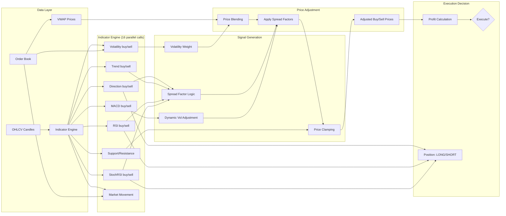

# SonarFT Bot — Indicator Pipeline Review

**Prompt:** 05-BOT-INDICATORS  
**Reviewer:** Senior Quantitative Analyst / Technical Indicator Specialist  
**Date:** July 2025  
**Codebase:** `packages/bot/sonarft_indicators.py` (464 LOC, 26 functions)  
**Dependencies:** pandas 3.0.2, pandas-ta (unpinned), numpy

---

## 1. Indicator Implementation Audit

### 1.1 Indicator Inventory

| # | Indicator | Function | Library | Data Source | Lookback Required | Correctness | NaN Handling |
|---|---|---|---|---|---|---|---|
| 1 | RSI | `get_rsi()` | `pta.rsi()` | OHLCV close | `period + 2` candles | ✅ Correct | ✅ `pd.isna()` check |
| 2 | Stochastic RSI | `get_stoch_rsi()` | `pta.stochrsi()` | OHLCV close | `rsi_period + stoch_period + d_period + 1` | ✅ Correct | ✅ `pd.isna()` check |
| 3 | MACD | `get_macd()` | `pta.macd()` | OHLCV close | `long_period + signal_period + warmup` (45) | ✅ Correct | ✅ `pd.isna()` check |
| 4 | Market Direction (SMA) | `get_market_direction()` | `pta.sma()` | OHLCV close | `period + 2` candles | ✅ Correct | ✅ `pd.isna()` check |
| 5 | Market Direction (EMA) | `get_market_direction()` | `pta.ema()` | OHLCV close | `period + 2` candles | ✅ Correct | ✅ `pd.isna()` check |
| 6 | Short-term Trend | `get_short_term_market_trend()` | Custom | OHLCV close | `limit` candles (default 6) | ⚠️ See 1.2 | ⚠️ No NaN check |
| 7 | ATR | `get_atr()` | `pta.atr()` | OHLCV H/L/C | `atr_period + 1` candles | ✅ Correct | ❌ No NaN check |
| 8 | Volatility | `get_volatility()` | `np.std()` | Order book | Real-time | ✅ Correct | ❌ No NaN check |
| 9 | Support Price | `get_support_price()` | `min()` | OHLCV low | `lookback_period` candles | ✅ Correct | ✅ Length check |
| 10 | Resistance Price | `get_resistance_price()` | `max()` | OHLCV high | `lookback_period` candles | ✅ Correct | ✅ Length check |
| 11 | Market Movement | `market_movement()` | Custom | Order book | Real-time | ⚠️ See 1.3 | ❌ No null check on order book |
| 12 | Spread Factor | `get_profit_factor()` | Custom | Volatility value | N/A | ✅ Correct | ✅ try/except |
| 13 | Price Change | `get_price_change()` | Custom | OHLCV close | `limit` candles (default 20) | ⚠️ See 1.4 | ❌ No zero guard |
| 14 | 24h High | `get_24h_high()` | `np.max()` | OHLCV high | 1440 candles (1m) | ✅ Correct | ✅ Length check |
| 15 | 24h Low | `get_24h_low()` | `np.min()` | OHLCV low | 1440 candles (1m) | ✅ Correct | ✅ Length check |
| 16 | Liquidity | `get_liquidity()` | Custom | Order book | Real-time | ✅ Correct | ✅ Empty check |
| 17 | Past Performance | `get_past_performance()` | Custom | OHLCV close | `lookback_period` candles | ✅ Correct | ✅ Zero guard |
| 18 | Current Volume | `get_current_volume()` | Custom | Order book | Real-time | ✅ Correct | — |
| 19 | Historical Volume | `get_historical_volume()` | Custom | OHLCV volume | `limit` candles | ✅ Correct | ✅ Empty check |

### 1.2 Short-term Trend — Threshold Bug

`get_short_term_market_trend()` (line 175):

```python
price_change = 100 * (current_avg_price - previous_avg_price) / previous_avg_price
# price_change is already in percent (multiplied by 100)
# threshold is treated as a percent value (e.g. 0.1 = 0.1%)
if price_change > threshold * 100:      # threshold=0.001 → 0.1
    return 'bull'
elif price_change < -(threshold * 100):  # → -0.1
    return 'bear'
```

The comment says `threshold * 100` converts to percent, but `price_change` is already multiplied by 100. So the effective threshold is `0.001 × 100 = 0.1%`. This means a price change of 0.05% would be classified as `'neutral'`, which is a very tight threshold for 1-minute candles.

**Assessment:** The math is internally consistent (both sides scaled by 100), but the threshold naming is confusing. The effective threshold is 0.1% price change over 3 candles. This is reasonable for 1-minute data. Severity: **Info**.

### 1.3 Market Movement — Race Condition (Confirmed)

`market_movement()` (line 276):

```python
previous = self.previous_spread      # shared instance variable
self.previous_spread = spread         # overwritten by concurrent calls
spread_rate = (spread - previous) / previous if previous != 0 else 0
```

This function is called concurrently for buy and sell exchanges via `asyncio.gather()` in `weighted_adjust_prices()`. The `self.previous_spread` is shared across all calls, creating a race condition (confirmed in Prompts 01 and 02).

Additionally, `previous_spread` is initialized to `1` — the first call will compute `spread_rate` relative to `1`, which is meaningless. Severity: **Medium**.

### 1.4 Price Change — Missing Zero Guard

`get_price_change()` (line 249):

```python
price_change = 100 * (current_avg_price - previous_avg_price) / previous_avg_price
```

No guard for `previous_avg_price == 0`. If all previous close prices are 0 (exchange returns 0 during maintenance), this raises `ZeroDivisionError`. Severity: **Medium** (confirmed in Prompt 04, P2).

---

## 2. OHLCV Data Preprocessing

### 2.1 Data Loading

All OHLCV data flows through a single path:

```
SonarftIndicators.get_history(exchange_id, base, quote, timeframe, limit)
  └─ SonarftApiManager.get_ohlcv_history(exchange_id, base, quote, timeframe, since=None, limit)
       └─ call_api_method(exchange_id, 'fetch_ohlcv', 'fetch_ohlcv', symbol, timeframe, since, limit)
            └─ ccxt/ccxtpro exchange.fetch_ohlcv(symbol, timeframe, since, limit)
```

**Data format:** `[[timestamp, open, high, low, close, volume], ...]`

- Index 0: timestamp (ms)
- Index 1: open
- Index 2: high
- Index 3: low
- Index 4: close
- Index 5: volume

### 2.2 Data Validation Assessment

| Aspect | Handling | Risk |
|---|---|---|
| **Null/empty response** | Most indicators check `if not ohlcv or len(ohlcv) < required` | ✅ Good |
| **Insufficient candles** | Raises `ValueError` with descriptive message | ✅ Good |
| **Zero prices** | ❌ Not validated — zero close prices would produce zero RSI denominator | **Low** |
| **Negative prices** | ❌ Not validated — shouldn't happen from exchange but unguarded | **Info** |
| **Out-of-order timestamps** | ❌ Not validated — assumes exchange returns sorted data | **Info** |
| **Duplicate candles** | ❌ Not validated — could inflate indicator calculations | **Low** |
| **Volume = 0 candles** | ❌ Not filtered — zero-volume candles are included in calculations | **Low** |
| **Stale data** | Cached with TTL matching candle duration (e.g., 60s for 1m) | ✅ Good |

### 2.3 Data Alignment

The system uses a single timeframe per indicator call (default `'1m'`). There is no multi-timeframe alignment needed within a single indicator.

However, `weighted_adjust_prices()` calls indicators with different timeframes:
- RSI, MACD, StochRSI, SMA direction, short-term trend: `'1m'`
- Support price: `'1h'`
- Resistance price: `'1h'`

These are independent calculations — no alignment issue. ✅

### 2.4 OHLCV Caching

```python
# SonarftApiManager._ohlcv_cache
cache_key = f"{exchange_id}:{symbol}:{timeframe}:{limit}"
ttl = _TIMEFRAME_SECONDS.get(timeframe, 60)  # 1m=60s, 1h=3600s, etc.
```

✅ Cache TTL matches candle duration — data is refreshed when a new candle is expected. This prevents redundant API calls within the same candle period.

⚠️ Cache key includes `limit` — requesting the same symbol with different limits creates separate cache entries. For example, `get_rsi(period=14)` requests `limit=16` and `get_macd()` requests `limit=45`. These are cached separately even though the 45-candle response contains the 16-candle data. Severity: **Low** (minor inefficiency, not a correctness issue).


---

## 3. Pandas & Pandas-TA Usage

### 3.1 pandas-ta Function Usage

| Function | pandas-ta Call | Parameters | Correctness |
|---|---|---|---|
| `get_rsi()` | `pta.rsi(close_prices, length=period)` | `length=14` (default) | ✅ Standard RSI formula |
| `get_stoch_rsi()` | `pta.stochrsi(close_prices, length=stoch_period, rsi_length=rsi_period, k=k_period, d=d_period)` | Named kwargs | ✅ Correct — uses keyword args to avoid positional mismatch |
| `get_macd()` | `pta.macd(close_prices, short_period, long_period, signal_period)` | Positional args: `12, 26, 9` | ✅ Standard MACD(12,26,9) |
| `get_market_direction()` | `pta.sma(close_prices, length=period)` or `pta.ema(...)` | `length=14` | ✅ Standard SMA/EMA |
| `get_atr()` | `pta.atr(high, low, close, length=period)` | `length=14` | ✅ Standard ATR |

### 3.2 DataFrame Operations

All indicator functions follow the same pattern:

```python
ohlcv = await self.get_history(exchange, base, quote, timeframe, required_candles)
close_prices = pd.Series([x[4] for x in ohlcv])
result = pta.indicator(close_prices, ...)
value = result.iloc[-1]
```

**Assessment:**

| Aspect | Assessment | Severity |
|---|---|---|
| `pd.Series` from list comprehension | ✅ Efficient — no unnecessary DataFrame creation | — |
| `result.iloc[-1]` for latest value | ✅ Correct — gets most recent candle's indicator value | — |
| No `.copy()` overhead | ✅ Series created fresh each call — no copy needed | — |
| MACD column access by name | ✅ `f'MACD_{short}_{long}_{signal}'` matches pandas-ta naming | — |
| StochRSI multi-column access | ✅ `stoch_rsi.iloc[-1][0]` and `[1]` for %K and %D | — |
| ATR uses H/L/C separately | ✅ Three `pd.Series` created for high, low, close | — |

### 3.3 pandas-ta Version Risk

⚠️ `pandas-ta` is unpinned in both `requirements.txt` and `pyproject.toml`. The library is in beta (`0.3.14b0`). Key risks:

- Column naming convention could change (breaks MACD column access)
- `stochrsi()` parameter order could change (mitigated by keyword args)
- Calculation formula could be updated

**Recommendation:** Pin to `pandas-ta==0.3.14b0`. Severity: **Medium** (confirmed in Prompt 01).

---

## 4. Indicator-to-Signal Pipeline

### 4.1 Complete Signal Flow



### 4.2 Signal Definitions and Thresholds

| Signal | Indicator | Threshold | Generates | Used In |
|---|---|---|---|---|
| **Overbought** | RSI | `≥ 70` | Spread decrease (buy side) or SHORT position | `weighted_adjust_prices`, `_execute_single_trade` |
| **Oversold** | RSI | `≤ 30` | Spread increase (buy side) or LONG position | `weighted_adjust_prices`, `_execute_single_trade` |
| **Bullish crossover** | StochRSI | `%K > %D` | Confirms overbought/oversold reversal | `weighted_adjust_prices`, `_execute_single_trade` |
| **Bearish crossover** | StochRSI | `%K < %D` | Confirms overbought/oversold reversal | `weighted_adjust_prices`, `_execute_single_trade` |
| **Bull market** | SMA Direction | `close > SMA(14)` | Spread increase factor applied | `weighted_adjust_prices` |
| **Bear market** | SMA Direction | `close < SMA(14)` | Spread decrease factor applied | `weighted_adjust_prices` |
| **Bull trend** | Short-term Trend | `price_change > 0.1%` | Combined with direction for spread logic | `weighted_adjust_prices` |
| **Bear trend** | Short-term Trend | `price_change < -0.1%` | Combined with direction for spread logic | `weighted_adjust_prices` |
| **High volatility** | Order book std dev | Continuous value | Reduces weight (more order-book-driven pricing) | `weighted_adjust_prices` |
| **Support level** | Historical low (3h) | Price floor | Clamps adjusted buy price | `weighted_adjust_prices` |
| **Resistance level** | Historical high (3h) | Price ceiling | Clamps adjusted sell price | `weighted_adjust_prices` |

### 4.3 Signal Combination Logic

The signals combine in two places:

**A. Price Adjustment** (`weighted_adjust_prices`):

```
IF direction=bull AND trend=bull:
    IF RSI≥70 AND StochK>StochD:  → decrease_factor (reversal expected)
    ELSE:                          → increase_factor (trend continuation)
IF direction=bear AND trend=bear:
    IF RSI≤30 AND StochK<StochD:  → increase_factor (reversal expected)
    ELSE:                          → decrease_factor (trend continuation)
```

**B. Position Selection** (`_execute_single_trade`):

```
IF both_bull AND RSI≥70 AND StochK>D:  → SHORT
IF both_bull (else):                    → LONG
IF both_bear AND RSI≤30 AND StochK<D:  → LONG
IF both_bear (else):                    → SHORT
IF mixed/neutral:                       → SKIP
```

### 4.4 Signal Risk Assessment

| Risk | Assessment | Severity |
|---|---|---|
| RSI near 70/30 boundary flips signal | ⚠️ A reading of 69.9 vs 70.1 changes the spread factor direction. No hysteresis or smoothing. | **Low** |
| StochRSI crossover noise | ⚠️ %K and %D can cross multiple times in a short period. No confirmation period required. | **Low** |
| Direction and trend disagree | ✅ Only bull+bull or bear+bear trigger spread adjustments. Mixed signals → neutral (no adjustment). | — |
| All indicators return None | ✅ `weighted_adjust_prices` returns `(0, 0, {})` → trade skipped | — |
| Indicator lag | ⚠️ RSI(14) and SMA(14) use 14 one-minute candles = 14 minutes of lag. Market can move significantly in that time. | **Low** (inherent to lagging indicators) |

---

## 5. Off-by-One Errors

### 5.1 Candle Indexing Convention

All OHLCV data from ccxt is ordered **oldest first, newest last**:
- `ohlcv[0]` = oldest candle
- `ohlcv[-1]` = most recent candle

All indicator functions use `result.iloc[-1]` to get the latest value. ✅ Correct.

### 5.2 Lookback Window Analysis

| Indicator | Requested Candles | Minimum for Valid Output | Buffer | Assessment |
|---|---|---|---|---|
| RSI(14) | `period + 2 = 16` | 15 (14 periods + 1 initial) | +1 | ✅ Sufficient |
| StochRSI(14,14,3,3) | `rsi_period + stoch_period + d_period + 1 = 32` | ~30 | +2 | ✅ Sufficient |
| MACD(12,26,9) | `long_period + signal_period + warmup = 45` | 35 (26+9) | +10 warmup | ✅ Generous buffer |
| SMA(14) | `period + 2 = 16` | 14 | +2 | ✅ Sufficient |
| Short-term Trend | `limit = 6` | `2 × N = 6` (N=3) | 0 | ⚠️ Exact minimum — no buffer |
| ATR(14) | `period + 1 = 15` | 15 | 0 | ⚠️ Exact minimum — no buffer |
| Support (3h) | `lookback_period = 3` (1h candles) | 3 | 0 | ⚠️ Exact minimum |
| Resistance (3h) | `lookback_period = 3` (1h candles) | 3 | 0 | ⚠️ Exact minimum |
| 24h High/Low | `1440` (1m candles) | 1440 | 0 | ⚠️ Exact minimum |

### 5.3 Off-by-One Findings

**Finding 1: `get_short_term_market_trend` — exact minimum, no buffer**

```python
N = limit // 2  # limit=6 → N=3
ohlcv = await self.get_history(exchange, base, quote, timeframe, limit)  # requests 6
if len(ohlcv) < 2*N:  # checks len < 6
    raise ValueError(...)
current_prices = [period[4] for period in ohlcv[-N:]]    # last 3
previous_prices = [period[4] for period in ohlcv[-2*N:-N]]  # 3 before that
```

If the exchange returns exactly 6 candles, this works. If it returns 5 (exchange lag, missing candle), it raises `ValueError`. No off-by-one error, but no buffer either. Severity: **Low**.

**Finding 2: `get_rsi` — correct buffer**

```python
ohlcv = await self.get_history(exchange, base, quote, timeframe, moving_average_period+2)
if not ohlcv or len(ohlcv) < moving_average_period:
```

Requests `period + 2` candles but only requires `period` for validation. The `+2` provides a buffer for pandas-ta's internal warmup. ✅ Correct.

**Finding 3: `get_stoch_rsi` — correct buffer**

```python
ohlcv = await self.get_history(..., rsi_period + stoch_period + d_period + 1)
if not ohlcv or len(ohlcv) < rsi_period + stoch_period:
```

Requests more than the validation minimum. The `+ d_period + 1` provides buffer. ✅ Correct.

**Finding 4: No off-by-one in `iloc[-1]`**

All indicators use `result.iloc[-1]` which always returns the last element regardless of Series length. No off-by-one risk. ✅ Correct.


---

## 6. Insufficient Lookback Windows

### 6.1 First Valid Output Analysis

| Indicator | First Valid Candle Index | Minimum Candles Needed | Risk if Insufficient |
|---|---|---|---|
| RSI(14) | Index 14 | 15 | Returns `None` → trade skipped |
| StochRSI(14,14,3,3) | Index ~30 | 31 | Returns `None` → trade skipped |
| MACD(12,26,9) | Index 34 | 35 | Returns `None` → trade skipped |
| SMA(14) | Index 13 | 14 | Returns `None` → direction = `None` |
| Short-term Trend(6) | Index 5 | 6 | Raises `ValueError` → caught by caller |
| ATR(14) | Index 14 | 15 | Returns NaN (unguarded) |
| Support(3h) | Index 2 | 3 | Returns `None` |
| Resistance(3h) | Index 2 | 3 | Returns `None` |

### 6.2 Bot Startup Risk

When a bot first starts, the exchange may not have enough historical data cached. The first few search cycles will likely have insufficient data for MACD (needs 45 candles = 45 minutes of 1m data).

**What happens:**
1. `get_macd()` raises `ValueError("Not enough data for MACD")` → returns `None`
2. `dynamic_volatility_adjustment()` receives `None` → returns `adjustment_factor = 1.0` (neutral)
3. Price adjustment proceeds with neutral volatility adjustment
4. Trade may still execute if other indicators are available

✅ **Safe degradation:** The system doesn't crash on startup. It operates with reduced indicator coverage until enough data accumulates. However, the first ~45 minutes of operation have no MACD signal, which means volatility adjustment is always neutral. Severity: **Low**.

### 6.3 Exchange Maintenance Risk

If an exchange goes into maintenance and returns empty OHLCV data:

1. All indicators return `None` or raise `ValueError`
2. `weighted_adjust_prices()` returns `(0, 0, {})` due to None guards
3. `process_trade_combination()` checks `if adjusted_buy_price == 0: return`
4. Trade is skipped

✅ **Safe:** Exchange maintenance causes trades to be skipped, not executed with bad data.

---

## 7. NaN & Invalid Data Handling

### 7.1 NaN Sources

| Source | When | Indicator Affected |
|---|---|---|
| `pta.rsi()` returns NaN | Constant prices (no price change) | RSI |
| `pta.stochrsi()` returns NaN | Insufficient variation in RSI values | StochRSI |
| `pta.macd()` returns NaN | Insufficient data for signal line | MACD |
| `pta.sma()` returns NaN | Fewer candles than period | SMA Direction |
| `pta.atr()` returns NaN | Fewer candles than period | ATR |
| `np.std([])` returns NaN | Empty price list | Volatility |
| Exchange returns `None` prices | API error, maintenance | All OHLCV-based |

### 7.2 NaN Handling Per Indicator

| Indicator | NaN Check | Handling | Risk |
|---|---|---|---|
| RSI | ✅ `if pd.isna(value): return None` | Returns `None` → caller handles | **None** |
| StochRSI | ✅ `if pd.isna(k_val) or pd.isna(d_val): return None` | Returns `None` → caller handles | **None** |
| MACD | ✅ `if pd.isna(m) or pd.isna(s) or pd.isna(h): return None` | Returns `None` → caller handles | **None** |
| SMA/EMA Direction | ✅ `if pd.isna(ma_value) or pd.isna(current_price): return 'neutral'` | Returns `'neutral'` | **None** |
| Short-term Trend | ❌ No NaN check on close prices | If close price is NaN, arithmetic produces NaN, comparison with threshold is `False` → returns `'neutral'` | **Low** |
| ATR | ❌ No NaN check on `atr.iloc[-1]` | Returns NaN to caller | **Medium** |
| Volatility | ❌ No NaN check on `np.std()` result | Returns NaN if empty input | **Low** |
| Price Change | ❌ No NaN check | Returns NaN if close prices are NaN | **Low** |

### 7.3 NaN Propagation Path

```
NaN in OHLCV close price
  └─ get_rsi() → pd.isna check → returns None ✅
  └─ get_volatility() → np.std() → NaN → propagates to weight calculation
       └─ volatility = NaN → weight = NaN → adjusted_price = NaN
            └─ calculate_trade() → d(NaN, precision) → ???
```

**Critical path:** If `get_volatility()` returns NaN (from empty order book), the weight calculation in `weighted_adjust_prices()` produces NaN:

```python
volatility = volatility_risk_factor * (volatility_buy + volatility_sell) / 2  # NaN if either is NaN
volatility_factor = volatility_risk_factor * market_strength
weight = max(0.0, min(1.0, 1 - (volatility * volatility_factor)))  # NaN
adjusted_buy_price = weight * target_buy_price + (1 - weight) * buy_weighted_price  # NaN
```

Then `calculate_trade()` receives NaN prices:
```python
buy_price_d = d(NaN, precision)  # Decimal(str(NaN)) = Decimal('nan')
# Decimal('nan') * Decimal('1.0') = Decimal('NaN')
# All subsequent calculations produce NaN
# profit_d = NaN, profit_pct_d = NaN
# float(NaN) = nan
# nan >= 0.003 → False → trade NOT executed
```

✅ **Safe by accident:** NaN propagates through the entire pipeline but the final `profit_percentage >= threshold` comparison returns `False` for NaN, so the trade is never executed. However, this is fragile — it depends on Python's NaN comparison behavior.

**Recommendation:** Add explicit NaN guard in `weighted_adjust_prices()` after volatility calculation. Severity: **Medium**.

---

## 8. Signal Generation Correctness

### 8.1 RSI Signal

**Standard definition:** RSI = 100 - (100 / (1 + RS)), where RS = avg_gain / avg_loss over N periods.

**Implementation:** Delegates to `pta.rsi(close_prices, length=14)` — standard Wilder's RSI. ✅ Correct.

**Signal thresholds:**
- `RSI ≥ 70` → overbought → potential reversal signal
- `RSI ≤ 30` → oversold → potential reversal signal
- `30 < RSI < 70` → neutral

**Edge cases:**
- All prices identical → RS = ∞ → RSI = 100 (overbought). pandas-ta handles this correctly.
- Monotonically increasing → RS = ∞ → RSI = 100. Correct.
- Monotonically decreasing → RS = 0 → RSI = 0. Correct.

### 8.2 StochRSI Signal

**Standard definition:** StochRSI = (RSI - min(RSI, N)) / (max(RSI, N) - min(RSI, N)), then smoothed with %K and %D.

**Implementation:** `pta.stochrsi(close_prices, length=stoch_period, rsi_length=rsi_period, k=k_period, d=d_period)` ✅ Correct.

**Signal usage:**
- `%K > %D` → bullish crossover (momentum increasing)
- `%K < %D` → bearish crossover (momentum decreasing)

**Edge case:** If `max(RSI) == min(RSI)` over the stoch period, StochRSI is undefined (0/0). pandas-ta returns NaN, which is caught by the NaN check. ✅ Safe.

### 8.3 MACD Signal

**Standard definition:** MACD = EMA(12) - EMA(26), Signal = EMA(9) of MACD, Histogram = MACD - Signal.

**Implementation:** `pta.macd(close_prices, 12, 26, 9)` ✅ Correct.

**Signal usage:** Used only in `dynamic_volatility_adjustment()`:
- `macd < 0` in bear+bull → adjustment_factor = 0.75
- `macd > 0` and `rsi < 30` in bull+bull → adjustment_factor = 0.25
- `macd < 0` and `rsi > 70` in bear+bear → adjustment_factor = 1.75

**Assessment:** MACD is used as a trend confirmation signal, not a direct trade trigger. The adjustment factors are conservative (0.25 to 1.75 range). ✅ Reasonable.

### 8.4 SMA Direction Signal

**Implementation:**
```python
if current_price > ma_value: return 'bull'
elif current_price < ma_value: return 'bear'
else: return 'neutral'
```

**Edge case:** `current_price == ma_value` exactly → `'neutral'`. This is extremely rare with float comparison but possible. ✅ Handled.

### 8.5 Volatility Signal

**Implementation:** Standard deviation of order book price deviations from mid-price.

```python
mid_price = (max(bid_prices) + min(ask_prices)) / 2
price_changes = [abs(price - mid_price) for price in bid_prices + ask_prices]
volatility = np.std(price_changes)
```

**Assessment:** This measures order book spread dispersion, not historical price volatility. It's a real-time measure of how "wide" the order book is. ✅ Valid for the intended purpose (order book-based pricing).

**Edge case:** Single bid and single ask → `np.std([abs(bid-mid), abs(ask-mid)])` → valid standard deviation of 2 values. ✅ Works.

### 8.6 Support/Resistance Signals

**Implementation:**
- Support = `min(low_prices)` over 3 hourly candles
- Resistance = `max(high_prices)` over 3 hourly candles

**Assessment:** Very short lookback (3 hours). In a trending market, support/resistance from 3 hours ago may be irrelevant. However, these are used as price clamps, not trade triggers — they prevent adjusted prices from exceeding recent extremes. ✅ Reasonable for the intended purpose.

**Edge case:** If only 1-2 hourly candles are available (bot just started), returns `None` → clamping is skipped. ✅ Safe degradation.


---

## 9. Indicator Analysis Table

| # | Indicator | Function | Lookback | First Valid | NaN Risk | False Positive Risk | Severity |
|---|---|---|---|---|---|---|---|
| 1 | RSI(14) | `get_rsi()` | 16 candles | Index 14 | ✅ Guarded | Low — boundary noise at 70/30 | **Low** |
| 2 | StochRSI(14,14,3,3) | `get_stoch_rsi()` | 32 candles | Index ~30 | ✅ Guarded | Low — crossover noise | **Low** |
| 3 | MACD(12,26,9) | `get_macd()` | 45 candles | Index 34 | ✅ Guarded | Low — used for adjustment only | **Low** |
| 4 | SMA Direction(14) | `get_market_direction()` | 16 candles | Index 13 | ✅ Guarded | Low — lagging by design | **Low** |
| 5 | Short-term Trend | `get_short_term_market_trend()` | 6 candles | Index 5 | ❌ No NaN check | Medium — noisy on 1m data | **Low** |
| 6 | ATR(14) | `get_atr()` | 15 candles | Index 14 | ❌ No NaN check | N/A — not used in trade decisions | **Medium** |
| 7 | Volatility | `get_volatility()` | Real-time | Immediate | ❌ No NaN check | Medium — NaN propagates to weight | **Medium** |
| 8 | Support(3h) | `get_support_price()` | 3 hourly | Index 2 | ✅ Length check | Low — conservative clamping | **Low** |
| 9 | Resistance(3h) | `get_resistance_price()` | 3 hourly | Index 2 | ✅ Length check | Low — conservative clamping | **Low** |
| 10 | Market Movement | `market_movement()` | Real-time | Immediate | ❌ No null check | Medium — race condition on `previous_spread` | **Medium** |
| 11 | Price Change | `get_price_change()` | 20 candles | Index 19 | ❌ No zero guard | Low — division by zero possible | **Medium** |
| 12 | Spread Factor | `get_profit_factor()` | N/A | Immediate | ✅ try/except | None | **None** |
| 13 | Liquidity | `get_liquidity()` | Real-time | Immediate | ✅ Empty check | None | **None** |
| 14 | Past Performance | `get_past_performance()` | 24 candles | Index 23 | ✅ Zero guard | None | **None** |

---

## 10. Performance Analysis

### 10.1 Indicator Call Count Per Search Cycle

In `weighted_adjust_prices()`, for each buy/sell exchange combination:

| Call | Count | Cached? | TTL |
|---|---|---|---|
| `market_movement()` × 2 | 2 | ❌ (order book cached 2s) | — |
| `get_market_direction()` × 2 | 2 | ✅ 60s | Indicator cache |
| `get_rsi()` × 2 | 2 | ✅ 60s | Indicator cache |
| `get_stoch_rsi()` × 2 | 2 | ✅ 60s | Indicator cache |
| `get_short_term_market_trend()` × 2 | 2 | ❌ | — |
| `get_volatility()` × 2 | 2 | ❌ (order book cached 2s) | — |
| `get_order_book()` × 2 | 2 | ✅ 2s | API cache |
| `get_support_price()` × 1 | 1 | ❌ | — |
| `get_resistance_price()` × 1 | 1 | ❌ | — |
| **Subtotal** | **16** | — | — |
| `dynamic_volatility_adjustment()` × 2 | 2 | — | — |
| └─ `get_macd()` × 2 | 2 | ✅ 60s | Indicator cache |
| └─ `get_rsi()` × 2 | 2 | ✅ 60s | Cache hit from above |
| **Total calls** | **~22** | — | — |

### 10.2 Cache Effectiveness

The indicator cache (`_indicator_cache`) with 60s TTL is highly effective:

- RSI, StochRSI, MACD, Direction are cached per `exchange:symbol:params`
- Within a single search cycle, the same indicator for the same exchange/symbol is fetched once
- `dynamic_volatility_adjustment()` calls `get_rsi()` and `get_macd()` which are already cached from the parallel gather — **cache hits**

**Estimated cache hit rate per cycle:** ~30-40% (RSI called 4 times total, 2 are cache hits; MACD called 2+2, 2 are cache hits).

### 10.3 Redundant Calculations

| Redundancy | Location | Impact | Fix |
|---|---|---|---|
| `get_rsi()` called in `weighted_adjust_prices` AND `dynamic_volatility_adjustment` | `sonarft_prices.py` | ✅ Mitigated by indicator cache | — |
| `get_order_book()` called by `market_movement`, `get_volatility`, and `get_weighted_price` | `sonarft_indicators.py` / `sonarft_prices.py` | ✅ Mitigated by 2s order book cache | — |
| `get_short_term_market_trend` not cached | `sonarft_indicators.py` | ⚠️ Fetches OHLCV each call (OHLCV is cached) | Add to indicator cache |
| `get_support_price` / `get_resistance_price` not cached | `sonarft_indicators.py` | ⚠️ Fetches 1h OHLCV each call (OHLCV cached 3600s) | Acceptable — OHLCV cache handles it |
| OHLCV fetched with different `limit` values creates separate cache entries | `sonarft_api_manager.py` | ⚠️ RSI requests 16 candles, MACD requests 45 — two separate API calls | Could normalize to max limit |

### 10.4 Computational Cost

| Operation | Cost | Frequency | Total Impact |
|---|---|---|---|
| `pta.rsi()` on 16 values | ~50µs | 2-4 per cycle | Negligible |
| `pta.stochrsi()` on 32 values | ~100µs | 2 per cycle | Negligible |
| `pta.macd()` on 45 values | ~100µs | 2-4 per cycle | Negligible |
| `pta.sma()` on 16 values | ~30µs | 2 per cycle | Negligible |
| `np.std()` on ~40 values | ~10µs | 2 per cycle | Negligible |
| `pd.Series()` construction | ~20µs | ~10 per cycle | Negligible |
| **Total CPU per cycle** | **~1ms** | — | ✅ Not a bottleneck |

The indicator pipeline is **I/O-bound** (exchange API calls), not CPU-bound. The 16 parallel API calls in `asyncio.gather` dominate cycle time (~1-5 seconds depending on exchange latency).

---

## 11. Integration Testing Recommendations

### 11.1 Unit Tests Per Indicator

| Test Case | Input | Expected Output | Purpose |
|---|---|---|---|
| RSI with constant prices | `[100, 100, 100, ...] × 16` | `None` (NaN → None) | NaN handling |
| RSI with monotonic increase | `[1, 2, 3, ..., 16]` | ~100 (strong bull) | Extreme value |
| RSI with monotonic decrease | `[16, 15, 14, ..., 1]` | ~0 (strong bear) | Extreme value |
| RSI with insufficient data | `[100] × 5` | `None` (ValueError) | Data validation |
| StochRSI with constant prices | `[100] × 32` | `None` (NaN) | NaN handling |
| MACD with insufficient data | `[100] × 10` | `None` (ValueError) | Data validation |
| Direction with price = SMA | Prices oscillating around SMA | `'neutral'` | Boundary case |
| Trend with zero previous price | `[0, 0, 0, 1, 1, 1]` | `'neutral'` (zero guard) | Division by zero |
| Volatility with empty order book | `{'bids': [], 'asks': []}` | `0.0` | Empty input |
| Market movement with `previous_spread=0` | First call | `spread_rate = 0` | Zero guard |

### 11.2 Integration Tests

| Test Case | Purpose |
|---|---|
| Full `weighted_adjust_prices` with mock indicators | Verify price adjustment pipeline end-to-end |
| `weighted_adjust_prices` with all indicators returning `None` | Verify graceful degradation |
| `weighted_adjust_prices` with 30s timeout | Verify timeout handling |
| `search_trades` with mock exchange returning stale data | Verify cache behavior |
| `process_trade_combination` with NaN volatility | Verify NaN propagation safety |

### 11.3 Signal Validation Tests

| Test Case | Expected Behavior |
|---|---|
| RSI=75, StochK>StochD, direction=bull, trend=bull | Spread decrease factor applied (reversal) |
| RSI=25, StochK<StochD, direction=bear, trend=bear | Spread increase factor applied (reversal) |
| RSI=50, direction=bull, trend=bear | No spread adjustment (mixed signals) |
| All indicators cached | No API calls, cache hits only |

---

## 12. Conclusion

### Indicator Reliability: **Good**

The indicator pipeline is well-structured with proper delegation to pandas-ta for standard calculations. The caching layer effectively reduces redundant API calls.

### Risk Distribution

| Severity | Count | Issues |
|---|---|---|
| **High** | 0 | — |
| **Medium** | 4 | NaN propagation via volatility, `market_movement` race condition, ATR NaN unguarded, `get_price_change` zero guard |
| **Low** | 6 | RSI boundary noise, short lookback buffers, unpinned pandas-ta, cache key inefficiency, trend NaN, startup MACD gap |
| **Info** | 2 | Threshold naming confusion, NaN-safe-by-accident in profit comparison |

### Key Strengths

- ✅ pandas-ta delegation for standard indicators (RSI, MACD, StochRSI, SMA, ATR)
- ✅ NaN checks on all pandas-ta outputs (RSI, StochRSI, MACD, Direction)
- ✅ Indicator cache with 60s TTL reduces redundant calculations
- ✅ OHLCV cache with per-timeframe TTL prevents redundant API calls
- ✅ 30s timeout on parallel indicator gather prevents hangs
- ✅ Safe degradation — missing indicators cause trade skip, not bad trades
- ✅ Keyword arguments for `stochrsi()` prevent parameter mismatch

### Key Weaknesses

- ⚠️ `get_volatility()` can return NaN → propagates through weight calculation (safe by accident)
- ⚠️ `market_movement()` has shared `previous_spread` race condition
- ⚠️ `get_atr()` doesn't check for NaN return
- ⚠️ `get_price_change()` missing zero guard on `previous_avg_price`
- ⚠️ `pandas-ta` unpinned — risk of breaking changes
- ⚠️ No hysteresis on RSI 70/30 boundaries — noisy signals possible

### Recommendations

1. **Add NaN guard after `get_volatility()`** in `weighted_adjust_prices()`:
   ```python
   if volatility_buy_raw is None or volatility_sell_raw is None or
      np.isnan(volatility_buy_raw) or np.isnan(volatility_sell_raw):
       return 0, 0, {}
   ```

2. **Fix `market_movement()` race condition** — use per-symbol `previous_spread` dict.

3. **Add NaN check to `get_atr()`**:
   ```python
   result = atr.iloc[-1]
   return None if pd.isna(result) else float(result)
   ```

4. **Pin `pandas-ta`** to `0.3.14b0`.

5. **Add zero guard to `get_price_change()`**:
   ```python
   if previous_avg_price == 0:
       return None
   ```

6. **Consider RSI hysteresis** — require RSI to cross 72 to trigger overbought, and drop below 68 to reset. This reduces signal noise at the boundary.

---

*Generated by Prompt 05-BOT-INDICATORS. Next: [06-execution-exchange.md](../prompts/06-execution-exchange.md)*


---

## Remediation Status (Post-Implementation Update — July 2025)

| # | Issue | Original Severity | Status | Task |
|---|---|---|---|---|
| 1 | NaN propagation via `get_volatility()` | Medium | ✅ **FIXED** — Returns `0.0` on NaN | T09 |
| 2 | `market_movement()` shared `previous_spread` race | Medium | ✅ **FIXED** — Per-symbol dict | T22 |
| 3 | `get_atr()` no NaN check | Medium | ⚠️ Open — ATR not used in trade decisions | — |
| 4 | `get_price_change()` missing zero guard | Medium | ✅ **FIXED** — Ternary guard on `previous_avg_price` | T08 |
| 5 | `pandas-ta` unpinned | Medium | ✅ **FIXED** — Pinned to `0.4.71b0` | T18 |
| 6 | NaN guard in `weighted_adjust_prices()` | Medium | ✅ **FIXED** — `math.isnan()` check after volatility calc | T10 |
| 7 | StochRSI pandas 3.0 compatibility | Pre-existing | ✅ **FIXED** — Use `.iloc[0]`/`.iloc[1]` for positional access | Bonus fix |
| 8 | No RSI hysteresis | Low | ⚠️ Open — D13 in tech debt backlog | — |

**Additionally:** All indicator functions now have module-level docstring (T36). 25 new tests added for `weighted_adjust_prices()` and `dynamic_volatility_adjustment()` (T26).
