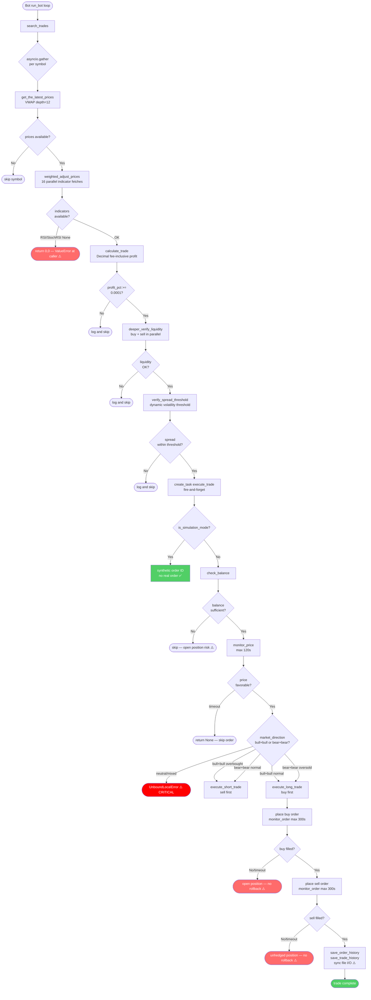

# SonarFT — Trading Engine & Strategy Logic Review

**Review Date:** July 2025
**Codebase Version:** 1.0.0
**Reviewer Role:** Senior Python Engineer / Quantitative Trading Reviewer / Financial Safety Auditor
**Scope:** Core trading logic correctness, profitability calculations, execution safety, fee handling, and precision
**Follows:** [Async & Concurrency Review](../architecture/async-concurrency.md)

---

## 1. Trade Detection Logic

### 1.1 Where Trade Opportunities Are Detected

Trade detection is orchestrated across three layers:

| Layer | File | Function | Role |
|---|---|---|---|
| Orchestration | `sonarft_search.py` | `SonarftSearch.search_trades` | Dispatches concurrent symbol searches |
| Processing | `sonarft_search.py` | `TradeProcessor.process_symbol` | Fetches prices, iterates buy×sell combinations |
| Evaluation | `sonarft_search.py` | `TradeProcessor.process_trade_combination` | Adjusts prices, calculates profit, gates execution |

### 1.2 Signals Used to Trigger Trades

A trade is triggered when **all** of the following conditions are met in sequence:

```
1. buy_prices_list and sell_prices_list are non-empty          [price availability]
2. weighted_adjust_prices() returns valid adjusted prices       [indicator pipeline]
3. profit_percentage >= profit_percentage_threshold (0.0001)   [profitability gate]
4. deeper_verify_liquidity() passes on both exchanges          [liquidity gate]
5. verify_spread_threshold() passes                            [spread gate]
```

The indicator signals used in price adjustment (not direct trade triggers):

| Indicator | Source | Influence |
|---|---|---|
| RSI (14-period) | `SonarftIndicators.get_rsi` | Overbought/oversold spread factor selection |
| StochRSI (%K/%D) | `SonarftIndicators.get_stoch_rsi` | Crossover confirmation for spread direction |
| SMA/EMA direction | `SonarftIndicators.get_market_direction` | Bull/bear classification for spread adjustment |
| Short-term trend | `SonarftIndicators.get_short_term_market_trend` | 6-candle price change direction |
| MACD | `SonarftIndicators.get_macd` | Dynamic volatility adjustment factor |
| Order book volatility | `SonarftIndicators.get_volatility` | Std dev of mid-price deviations |
| Support/Resistance | `SonarftIndicators.get_support/resistance_price` | Price clamping bounds |
| Market movement | `SonarftIndicators.market_movement` | Fast/slow movement classification |

### 1.3 Profitability Calculation

Profit is calculated **after fees** in `SonarftMath.calculate_trade`:

```
profit = (sell_price × amount − sell_fee) − (buy_price × amount + buy_fee)
profit_percentage = profit / (buy_price × amount + buy_fee)
```

The threshold check:
```python
# sonarft_search.py:223
if profit_percentage >= percentage_threshold:  # default: 0.0001 (0.01%)
```

**Assessment:** Fees are correctly included before the profitability decision. ✅

### 1.4 Risk of False Positives

| Risk | Description | Severity |
|---|---|---|
| Stale VWAP prices | OHLCV cache TTL = 60s for 1m candles; order book is fetched live but VWAP uses depth=12 which may not reflect current best bid/ask | Medium |
| Same-exchange arbitrage | No check prevents buy_exchange == sell_exchange; a bot could attempt to arbitrage against itself | **High** |
| Neutral market direction | `weighted_adjust_prices` applies spread factors only for bull+bull or bear+bear; neutral direction skips adjustment, potentially passing inflated prices to `calculate_trade` | Medium |
| Support/resistance swap | `get_support_price` is called on `sell_exchange` and `get_resistance_price` on `buy_exchange` — these are swapped from the expected convention (support should bound the buy side on the buy exchange) | Medium |

**Same-exchange arbitrage — no guard:**
```python
# sonarft_search.py:143
for buy_price_list in buy_prices_list:
    for sell_price_list in sell_prices_list:
        await self.process_trade_combination(...)
# buy_price_list[0] and sell_price_list[0] are both exchange IDs
# No check: if buy_exchange == sell_exchange: continue
```
When only one exchange is configured, or when the same exchange appears cheapest to buy and most expensive to sell, the bot will attempt to buy and sell on the same exchange simultaneously.

### 1.5 Margin of Safety

The default `profit_percentage_threshold = 0.0001` (0.01%) is extremely thin. For reference:

| Exchange pair | Typical combined fee | Required spread to break even |
|---|---|---|
| Binance + OKX | 0.1% + 0.08% = 0.18% | > 0.18% |
| Binance + Bitfinex | 0.1% + 0.2% = 0.3% | > 0.3% |

A 0.01% threshold means the bot will attempt trades where the calculated profit after fees is only 0.01%. Given floating-point rounding in price adjustment, market slippage between price calculation and order placement, and partial fills, this margin is insufficient for reliable profitability in live trading.

---

## 2. VWAP Calculation & Usage

### 2.1 VWAP Formula Implementation

**`SonarftApiManager.get_weighted_prices`** (used for initial price establishment):
```python
# sonarft_api_manager.py:318-325
bids = order_book['bids'][:depth]   # depth=12 (weight parameter)
asks = order_book['asks'][:depth]

total_bid_volume = sum(volume for _, volume in bids)
total_ask_volume = sum(volume for _, volume in asks)

if total_bid_volume == 0 or total_ask_volume == 0:
    return 0.0, 0.0  # zero-volume guard ✅

bid_vwap = sum(price * volume for price, volume in bids) / total_bid_volume
ask_vwap = sum(price * volume for price, volume in asks) / total_ask_volume
```

**Formula correctness:** ✅ Standard VWAP formula correctly implemented.
**Zero-volume guard:** ✅ Returns `(0.0, 0.0)` on zero volume.
**Precision:** ⚠️ Uses native Python `float` — no `Decimal` here. For BTC prices (~$60,000), float precision is adequate but not ideal.

**`SonarftPrices.get_weighted_price`** (used for order-book blending in price adjustment):
```python
# sonarft_prices.py:160-168
def get_weighted_price(self, price_list: list, depth: int) -> float:
    if len(price_list) < depth:
        depth = len(price_list)
    total_volume = sum(volume for price, volume in price_list[:depth])
    try:
        weighted_price = sum(price * volume for price, volume in price_list[:depth]) / total_volume
    except ZeroDivisionError:
        self.logger.error("Division by zero while calculating weighted price.")
        return 0.0
    return weighted_price
```

**Assessment:** Correct formula, handles zero-volume via `ZeroDivisionError`. ✅ However, returns `0.0` on zero volume — this `0.0` then feeds into the price blending formula:
```python
adjusted_buy_price = weight * target_buy_price + (1 - weight) * buy_weighted_price
# If buy_weighted_price = 0.0 and weight < 1.0, adjusted_buy_price is pulled toward 0
```
A zero-volume order book should abort price adjustment, not silently blend toward zero.

### 2.2 VWAP Depth Parameters

| Usage | Depth | Location |
|---|---|---|
| Initial price establishment (VWAP) | 12 (`weight=12`) | `sonarft_search.py:136` |
| Price adjustment blending | 3 | `sonarft_prices.py:99` |
| Market movement check | 6 (`order_book_depth=6`) | `sonarft_prices.py:32` |
| Liquidity verification | 10 | `sonarft_validators.py:57` |
| Spread threshold | 10 (bids) / 10 (asks) | `sonarft_validators.py:120` |

**Inconsistency:** The initial VWAP uses depth=12 but the adjustment blending uses depth=3. The blending weight is derived from the depth=12 VWAP target price, but the order-book anchor uses only the top 3 levels. Under thin markets, depth=3 may not represent true liquidity.

### 2.3 Edge Cases

| Edge Case | Handled? | Risk |
|---|---|---|
| Zero total volume | ✅ Yes — returns `(0.0, 0.0)` | Medium — caller must check for zero |
| Empty order book | ✅ Yes — `order_book is None` check in validators | Low |
| Single-level order book | ✅ Yes — depth clamped to `len(price_list)` | Low |
| Negative prices | ❌ No guard | Low (crypto prices are positive) |
| `0.0` VWAP fed into blending | ❌ Not guarded at blending site | **High** — pulls adjusted price toward zero |

### 2.4 VWAP Usage in Pricing Pipeline

```
Order book (depth=12)
    → get_weighted_prices() → bid_vwap, ask_vwap          [initial prices]
    → get_the_latest_prices() → buy_prices_list, sell_prices_list
    → sorted by bid_vwap (buy) / ask_vwap (sell, descending)
    → process_trade_combination()
        → weighted_adjust_prices()
            → get_weighted_price(bids, depth=3) → buy_weighted_price   [anchor]
            → get_weighted_price(asks, depth=3) → sell_weighted_price  [anchor]
            → adjusted = weight × target_vwap + (1-weight) × order_book_anchor
        → calculate_trade(adjusted_buy, adjusted_sell, ...)
```


---

## 3. Spread Calculation & Rules

### 3.1 Spread Definition

Two distinct spread concepts exist in the codebase:

**A. Bid-ask spread (per exchange):**
```python
# sonarft_validators.py:56
spread = ask_prices[0] - bid_prices[0]
```
Used in `deeper_verify_liquidity` to reject illiquid markets (spread/bid > 1% with shallow book).

**B. Cross-exchange spread (buy vs sell):**
```python
# sonarft_validators.py:170
spread = sell_price - buy_price
average_price = (sell_price + buy_price) / 2
spread_ratio = spread / average_price
```
Used in `verify_spread_threshold` to validate the arbitrage opportunity.

### 3.2 Spread Adjustment in Price Calculation

The `weighted_adjust_prices` method applies spread factors based on market direction and RSI signals:

```python
spread_increase_factor = 1.00072   # default (config: spread_increase_factor)
spread_decrease_factor = 0.99936   # default (config: spread_decrease_factor)
spread_factor = get_profit_factor(volatility)  # range: [0.99912, 0.99972]
```

**Spread factor logic matrix:**

| Buy Direction | Sell Direction | RSI/StochRSI Condition | Buy Price Effect | Sell Price Effect |
|---|---|---|---|---|
| bull | bull | RSI≥70 AND %K>%D | × decrease (−0.064%) | × decrease (−0.064%) |
| bull | bull | otherwise | × increase (+0.072%) | × increase (+0.072%) |
| bear | bear | RSI≤30 AND %K<%D | × increase (+0.072%) | × increase (+0.072%) |
| bear | bear | otherwise | × decrease (−0.064%) | × decrease (−0.064%) |
| neutral/mixed | any | — | no adjustment | no adjustment |

Then both prices are additionally multiplied/divided by `spread_factor` (0.99912–0.99972):
```python
adjusted_buy_price  *= spread_factor   # lowers buy price slightly
adjusted_sell_price /= spread_factor   # raises sell price slightly
```

**Issue — spread factors applied symmetrically to both prices:**
In the bull+bull / RSI≥70 case, both buy and sell prices are multiplied by `spread_decrease_factor`. This narrows the spread on both sides equally, which may reduce rather than improve the arbitrage margin. The intent appears to be: lower buy price (good) and lower sell price (bad) simultaneously — the net effect on profit depends on which side dominates.

**Issue — `spread_factor` from `get_profit_factor` is always < 1.0:**
```python
# sonarft_indicators.py:19
spread_factor = min_spread + (max_spread - min_spread) * normalized_volatility
# min_spread=0.99912, max_spread=0.99972 → always in [0.99912, 0.99972]
```
`adjusted_buy_price *= spread_factor` always reduces the buy price (good).
`adjusted_sell_price /= spread_factor` always increases the sell price (good).
This is a consistent profit-widening adjustment regardless of market conditions. ✅

### 3.3 Spread Threshold Validation

```python
# sonarft_validators.py:168-185
spread_ratio = (sell_price - buy_price) / ((sell_price + buy_price) / 2)

thresholds = {
    "Low":    medium_spread_threshold,          # uses medium for Low volatility
    "Medium": medium_spread_threshold / 100,    # ← divided by 100
    "High":   spread_threshold,                 # dynamic threshold
}
if spread_ratio <= thresholds[volatility]:
    return True
```

**Critical Bug — threshold for "Medium" volatility divided by 100:**
```python
"Medium": medium_spread_threshold / 100,
```
If `medium_spread_threshold` is, say, `0.5` (0.5%), then the Medium threshold becomes `0.005` (0.005%). This is 100× more restrictive than the Low volatility threshold. Under Medium volatility, virtually all trades will be rejected by this check, making the bot effectively inactive in the most common market condition.

**Issue — "Low" volatility uses `medium_spread_threshold`:**
The Low volatility case uses `medium_spread_threshold` instead of `low_spread_threshold`. This means the Low volatility threshold is more permissive than intended.

---

## 4. Fee Handling & Profitability

### 4.1 Fee Inclusion — Correct Order ✅

Fees are included **before** the profitability decision:

```python
# sonarft_math.py:81-97
# Step 1: Calculate buy cost with fee
buy_fee_d = d(buy_price_d × amount × buy_fee_rate, fee_precision)
value_buying_with_fee_d = value_buying_d + buy_fee_d

# Step 2: Calculate sell proceeds minus fee
sell_fee_d = d(sell_price_d × amount × sell_fee_rate, fee_precision)
value_selling_with_fee_d = value_selling_d - sell_fee_d

# Step 3: Net profit
profit_d = value_selling_with_fee_d - value_buying_with_fee_d

# Step 4: Profit percentage (denominator = total cost including buy fee)
profit_pct_d = profit_d / value_buying_with_fee_d
```

**Assessment:** Fee-inclusive profit calculation is correct. ✅ Fees are deducted before the threshold comparison.

### 4.2 Fee Accuracy

Fees are loaded from `config_fees.json` as static values:

```json
{ "exchange": "binance", "buy_fee": 0.001, "sell_fee": 0.001 }
```

**Issues:**

| Issue | Description | Severity |
|---|---|---|
| Static fees | Fees are hardcoded in config — no live fee fetch from exchange API | Medium |
| No VIP tier support | Many exchanges offer reduced fees for high-volume traders; not modeled | Low |
| `buy_fee_base` hardcoded to 0 | `trade_data['buy_fee_base'] = 0` — some exchanges charge fees in base currency (e.g., BNB discount on Binance) | Medium |
| Fee rate from config, not market | `get_buy_fee` / `get_sell_fee` do a linear scan of `exchanges_fees` list — O(n) per call | Low |

### 4.3 Precision in Fee Calculation

```python
# sonarft_math.py:14
getcontext().prec = 28  # ✅ high precision

def d(value, precision):
    fmt = Decimal(10) ** -precision
    return Decimal(str(value)).quantize(fmt, rounding=ROUND_HALF_UP)
```

**Assessment:** Using `Decimal` with `ROUND_HALF_UP` and precision=28 is correct for financial calculations. Converting via `str(value)` avoids float-to-Decimal precision loss. ✅

**Issue — final values converted back to `float`:**
```python
return float(profit_d), float(profit_pct_d), trade_data
# trade_data values also converted: 'profit': float(profit_d)
```
The careful `Decimal` arithmetic is discarded at the return boundary. Downstream comparisons use `float`:
```python
if profit_percentage >= percentage_threshold:  # float comparison
```
For a threshold of 0.0001, float precision is sufficient, but the precision benefit of `Decimal` is lost for any further calculations.

### 4.4 Net Profit Calculation — Verified

For a concrete example with Binance (fee=0.1%) buying 1 BTC at $60,000 and selling at $60,100:

```
buy_cost  = 60,000 × 1 = 60,000.00
buy_fee   = 60,000 × 0.001 = 60.00
total_buy = 60,060.00

sell_proceeds = 60,100 × 1 = 60,100.00
sell_fee      = 60,100 × 0.001 = 60.10
net_sell      = 60,039.90

profit        = 60,039.90 − 60,060.00 = −20.10  (LOSS)
profit_pct    = −20.10 / 60,060.00 = −0.0335%
```

The bot correctly identifies this as unprofitable (profit_pct < 0.0001). ✅ The spread must exceed combined fees (~0.2% for Binance+Binance) to be profitable.

---

## 5. Execution Gating & Safety Checks

### 5.1 Pre-Execution Validation Chain

```
process_trade_combination()
    ├── [1] profit_percentage >= threshold          (profitability gate)
    └── has_requirements_for_success_carrying_out()
            ├── [2] deeper_verify_liquidity(buy)    (liquidity gate — buy side)
            ├── [3] deeper_verify_liquidity(sell)   (liquidity gate — sell side)
            └── [4] verify_spread_threshold()       (spread gate)
                    └── [5] execute_trade()
                            ├── [6] check_balance() (balance gate)
                            └── create_order()
```

**Gate 1 — Profitability:** `profit_percentage >= 0.0001` ✅
**Gate 2/3 — Liquidity:** Order book depth, spread < 1%, volume ≥ `trade_amount × 50` ✅
**Gate 4 — Spread threshold:** Dynamic threshold based on historical volatility ⚠️ (bug in Medium threshold — see Section 3.3)
**Gate 5 — Balance:** Checks free balance before placing order ✅ (skipped in simulation mode)

**Missing gates:**
- No maximum position size check
- No check for duplicate/concurrent trades on the same symbol
- No check that buy_exchange ≠ sell_exchange

### 5.2 Simulation Mode Gates

Simulation mode (`is_simulating_trade = 1`) is gated at three points:

**Gate A — Balance check bypass:**
```python
# sonarft_execution.py:323
if self.is_simulation_mode:
    return True  # skip balance check ✅
```

**Gate B — Price monitoring bypass:**
```python
# sonarft_execution.py:215
if self.is_simulation_mode:
    latest_price = price  # use calculated price, no live monitoring ✅
```

**Gate C — Order placement bypass:**
```python
# sonarft_execution.py:259
if not self.is_simulation_mode:
    order_placed = await self.api_manager.create_order(...)
else:
    executed_amount = trade_amount
    remaining_amount = 0
    order_placed_id = f"{side}_{random.randint(100000, 999999)}"  ✅
```

**Assessment:** Simulation mode is consistently gated at all three real-money touchpoints. ✅ There is no path to real order placement when `is_simulation_mode = True`.

**Risk — `is_simulating_trade` type inconsistency:**
```python
# config_parameters.json
"is_simulating_trade": 1   # integer

# sonarft_bot.py:242
parameters['is_simulating_trade']  # loaded as int

# sonarft_execution.py:22
is_simulation_mode: bool  # type hint says bool

# sonarft_execution.py:259
if not self.is_simulation_mode:  # int 1 is truthy → works correctly
```
Python's truthiness means `not 1 == False` and `not 0 == True`, so this works. However, the type inconsistency (int vs bool) is a maintenance risk — a future refactor could break this.

### 5.3 Operator Controls

| Control | Mechanism | Works? |
|---|---|---|
| Stop bot | WebSocket `{"key": "remove"}` → `_stop_event.set()` | ✅ Yes |
| Pause bot | ⚠️ Not Found in Source Code | — |
| Emergency stop all | ⚠️ Not Found in Source Code | — |
| Adjust parameters live | POST `/bot/set_parameters/{client_id}` | ⚠️ Parameters written to file but not hot-reloaded into running bot |
| Switch simulation/live | Requires bot restart | ⚠️ No live toggle |

**Critical gap — parameter changes not hot-reloaded:**
```python
# sonarft_server.py:134
async def set_bot_parameters(...):
    with open(f"sonarftdata/config/{client_id}_parameters.json", "w") as write_file:
        json.dump(new_parameters, write_file)
    return {"message": "Parameters set successfully."}
```
The file is written but the running `SonarftBot` instance never re-reads it. A running bot continues with its original parameters until restarted.

### 5.4 Risk of Accidental Live Execution

| Scenario | Risk | Severity |
|---|---|---|
| `is_simulating_trade` set to `0` in config | All three simulation gates open → real orders placed | **Critical** — this is the intended live mode, but must be deliberate |
| Config file edited while bot is running | No effect until restart — safe | Low |
| `is_simulating_trade` type coercion | `int(0)` is falsy → live mode; `int(1)` is truthy → sim mode. Works correctly | Low |
| Exchange API keys not set | `api_manager.create_order` will fail with auth error — no silent live execution | Low ✅ |

---

## 6. Buy/Sell Trigger Logic

### 6.1 Entry Signal

A trade entry is triggered when:
1. Cross-exchange price spread (after adjustment) covers fees + profit threshold
2. Both exchanges have sufficient liquidity depth
3. Spread ratio is within dynamic threshold bounds

### 6.2 Position Determination (LONG vs SHORT)

```python
# sonarft_execution.py:100-119
if market_direction_buy == 'bull' and market_direction_sell == 'bull':
    if RSI_buy >= 70 AND RSI_sell >= 70 AND StochK_buy > StochD_buy AND StochK_sell > StochD_sell:
        trade_position = 'SHORT'   # overbought → expect reversal
    else:
        trade_position = 'LONG'    # bull trend → follow momentum

elif market_direction_buy == 'bear' and market_direction_sell == 'bear':
    if RSI_buy <= 30 AND RSI_sell <= 30 AND StochK_buy < StochD_buy AND StochK_sell < StochD_sell:
        trade_position = 'LONG'    # oversold → expect reversal
    else:
        trade_position = 'SHORT'   # bear trend → follow momentum

# NO ELSE — neutral/mixed direction → UnboundLocalError (Critical Bug)
```

**Issues:**

| Issue | Description | Severity |
|---|---|---|
| No neutral/mixed handling | `trade_position` unbound for neutral or bull+bear/bear+bull combinations | **Critical** |
| Position logic in execution layer | Position determination belongs in strategy layer, not execution | Medium |
| SHORT on bull+bull overbought | Shorting when both exchanges are overbought is a valid contrarian signal, but requires margin/short-selling capability — not verified | **High** |
| No verification of short-selling support | `execute_short_trade` places a sell order first — requires the exchange to support short selling or the bot to already hold the asset | **High** |

### 6.3 LONG Trade Execution

```python
# sonarft_execution.py:133-155
async def execute_long_trade(...):
    # 1. Check buy balance
    buy_balance_status = await self.check_balance(buy_exchange, ..., 'buy', ...)
    if not buy_balance_status: return None, None

    # 2. Place buy order
    result_buy_order = await self.create_order(buy_exchange, ..., 'buy', ...)
    if result_buy_order is None: return result_buy_order, None

    # 3. Use actually filled amount for sell (partial fill safe ✅)
    actual_sell_amount = buy_executed_amount
    if actual_sell_amount <= 0: return result_buy_order, None  # ← buy succeeded, sell skipped

    # 4. Check sell balance
    sell_balance_status = await self.check_balance(sell_exchange, ..., 'sell', actual_sell_amount, ...)

    # 5. Place sell order
    if sell_balance_status:
        result_sell_order = await self.create_order(sell_exchange, ..., 'sell', ...)
```

**Issue — open position on sell failure:**
If step 4 (sell balance check) fails or step 5 (sell order) fails, the function returns `(result_buy_order, None)`. The buy order has been placed and filled, but no sell order is placed. The bot holds an unhedged long position with no automated recovery.

### 6.4 Order Size Calculation

Order size = `trade_amount` (from config, default = 1 base currency unit).

```python
# sonarft_math.py:80
target_amount_buy_d = d(target_amount, buy_rules['buy_amount_precision'])
# For Binance: rounded to 5 decimal places
# For OKX: rounded to 8 decimal places
```

**Issue — fixed trade amount, no position sizing:**
The trade amount is a fixed value from config with no dynamic sizing based on:
- Available balance
- Volatility
- Kelly criterion or any risk-based sizing
- Maximum position as % of portfolio

A single misconfigured `trade_amount` could risk the entire exchange balance.


---

## 7. Rounding & Precision in Orders

### 7.1 Price Rounding

```python
# sonarft_math.py:79
buy_price_d = d(buy_price, buy_rules['prices_precision'])
```

| Exchange | Price Precision | Example: $60,123.456 rounds to |
|---|---|---|
| OKX | 1 decimal place | $60,123.5 |
| Bitfinex | 3 decimal places | $60,123.456 |
| Binance | 2 decimal places | $60,123.46 |

**Issue — OKX price precision = 1 decimal place:**
Rounding BTC/USDT to 1 decimal place introduces up to $0.05 rounding error per order. For a 1 BTC trade, this is negligible. For high-frequency small trades, cumulative rounding could erode profits.

**Issue — hardcoded fallback precision vs live market precision:**
`get_symbol_precision` from loaded market data is preferred, but falls back to `EXCHANGE_RULES` if unavailable. The fallback OKX `prices_precision = 1` may not match the actual market precision for all symbols on OKX.

### 7.2 Amount Rounding

```python
# sonarft_math.py:80
target_amount_buy_d = d(target_amount, buy_rules['buy_amount_precision'])
# sell amount = buy amount (same variable reused)
target_amount_sell_d = target_amount_buy_d
```

**Assessment:** Using the same rounded amount for both buy and sell is correct — it ensures the sell quantity matches what was actually bought (assuming full fill). ✅

**Issue — `sell_amount_decimal_precision` defined but never used:**
```python
# sonarft_math.py:25
'sell_amount_decimal_precision': '0.000000',  # defined in EXCHANGE_RULES
```
This field is defined in `EXCHANGE_RULES` for all three exchanges but is never referenced in `calculate_trade` or anywhere else in the codebase. It appears to be dead configuration.

### 7.3 Exchange Minimums

**⚠️ Not Found in Source Code** — No minimum order size or minimum notional value checks are implemented. Exchanges enforce minimums (e.g., Binance requires minimum notional of $10 for BTC/USDT). If `trade_amount` is set too small, orders will be rejected by the exchange with an error, which `call_api_method` will catch and return `None`, causing the trade to fail silently.

### 7.4 Precision Loss Analysis

The precision pipeline:

```
float (adjusted prices from weighted_adjust_prices)
    → Decimal via str() conversion in calculate_trade   [precision preserved ✅]
    → quantized with ROUND_HALF_UP                      [controlled rounding ✅]
    → converted back to float for trade_data            [precision lost ⚠️]
    → float comparison: profit_percentage >= threshold  [adequate for 0.0001 ✅]
    → float passed to execute_trade                     [adequate ✅]
    → float passed to create_order → exchange API       [exchange handles precision]
```

The round-trip through `Decimal` and back to `float` is the main precision concern. For the profit threshold check at 0.0001, float64 precision (15–17 significant digits) is more than adequate. The risk is minimal in practice.

---

## 8. Trade Pipeline Flowchart



---

## 9. Financial Risk Table

| # | Issue | Location | Scenario | Financial Risk | Severity | Fix |
|---|---|---|---|---|---|---|
| 1 | `trade_position` unbound | `sonarft_execution.py:121` | Market direction is neutral or bull+bear — `UnboundLocalError` crashes execution | Trade silently fails; no order placed | **Critical** | Initialize `trade_position = None`; add `else: return False, False, False` |
| 2 | Medium volatility threshold ÷100 | `sonarft_validators.py:180` | Under Medium volatility, threshold is 100× too strict — nearly all trades rejected | Bot inactive in most common market condition | **High** | Remove `/ 100` from Medium threshold |
| 3 | No same-exchange guard | `sonarft_search.py:143` | Single exchange configured → bot buys and sells on same exchange | Guaranteed loss (double fees, no arbitrage) | **High** | Add `if buy_exchange == sell_exchange: continue` |
| 4 | Unhedged position on sell failure | `sonarft_execution.py:152` | Buy succeeds, sell balance check fails → open long position | Unlimited downside exposure | **High** | Cancel buy order if sell cannot proceed |
| 5 | SHORT without short-selling verification | `sonarft_execution.py:102` | SHORT position placed on exchange that doesn't support short selling | Order rejected or wrong position type | **High** | Verify exchange supports short selling before SHORT execution |
| 6 | 0.0% VWAP blended into price | `sonarft_prices.py:103` | Zero-volume order book → `get_weighted_price` returns 0.0 → adjusted price pulled toward 0 | Wildly incorrect buy/sell prices | **High** | Return early if `buy_weighted_price == 0` or `sell_weighted_price == 0` |
| 7 | `weighted_adjust_prices` wrong return arity | `sonarft_prices.py:68,74` | RSI or StochRSI unavailable → returns `(0, 0)` → caller unpacks 3 values → `ValueError` | Trade cycle crashes for that symbol | **High** | Return `(0, 0, {})` on all early exits |
| 8 | Profit threshold 0.01% too thin | `config_parameters.json` | Combined fees (0.18–0.3%) far exceed threshold; slippage makes profitable execution unlikely | Systematic losses in live trading | **High** | Set threshold ≥ combined fee rate + slippage buffer (e.g., 0.003) |
| 9 | Parameter changes not hot-reloaded | `sonarft_server.py:134` | Operator sets `is_simulating_trade=0` via API → bot continues in simulation | Operator believes live trading is active; it is not | Medium | Implement parameter hot-reload or document restart requirement |
| 10 | No minimum order size check | `sonarft_execution.py` | `trade_amount` too small → exchange rejects order → silent failure | No trade executed; no alert | Medium | Check exchange minimums before order placement |
| 11 | Fixed trade amount, no position sizing | `config_parameters.json` | `trade_amount=1` BTC at $60K = $60K per trade regardless of balance | Could risk entire balance on one trade | Medium | Add max position size as % of balance |
| 12 | `buy_fee_base` hardcoded to 0 | `sonarft_math.py:116` | Exchange charges fee in base currency (e.g., BNB discount) → fee underestimated | Profit overestimated; unprofitable trades executed | Medium | Fetch actual fee currency from exchange API |
| 13 | Support/resistance exchange swap | `sonarft_prices.py:67-68` | Support fetched from sell exchange, resistance from buy exchange — inverted convention | Incorrect price clamping bounds | Medium | Swap: support on buy exchange, resistance on sell exchange |
| 14 | Sync file I/O in trade save | `sonarft_helpers.py:70-77` | Multiple bots writing simultaneously → JSON corruption | Trade history lost or corrupted | Medium | Use `aiofiles` + file lock or SQLite |
| 15 | `is_simulating_trade` int vs bool | `sonarft_bot.py:242` | Future refactor changes type check → simulation gate breaks → live orders placed | Real money at risk | Medium | Explicitly cast: `bool(parameters['is_simulating_trade'])` |
| 16 | `sell_amount_decimal_precision` unused | `sonarft_math.py:25` | Dead config field — may cause confusion about actual precision used | None (dead code) | Low | Remove or document |
| 17 | No exchange minimum notional check | `sonarft_execution.py` | Small `trade_amount` → exchange rejects with minimum notional error | Silent trade failure | Low | Add minimum notional validation |

---

## 10. Critical Logic Findings

### Finding 1 — CRITICAL: `trade_position` Unbound Variable

**File:** `sonarft_execution.py`, lines 100–121
**Scenario:** Any trade where `market_direction_buy` or `market_direction_sell` is `'neutral'`, or where one is `'bull'` and the other is `'bear'`.
**Effect:** `UnboundLocalError: local variable 'trade_position' referenced before assignment` — the entire `_execute_single_trade` method crashes, the exception is caught by the outer `try/except`, and `False, False, False` is returned. No order is placed, no error is surfaced to the operator beyond a log entry.
**Fix:**
```python
trade_position = None  # initialize before if/elif chain
...
if trade_position is None:
    self.logger.warning(f"No trade position determined for {base}/{quote} — skipping")
    return False, False, False
```

### Finding 2 — HIGH: Medium Volatility Spread Threshold Bug

**File:** `sonarft_validators.py`, line 180
**Scenario:** Market classified as Medium volatility (spread percentage 0.1%–0.5%).
**Effect:** Threshold is `medium_spread_threshold / 100` — approximately 100× more restrictive than intended. Under Medium volatility (the most common condition), virtually no trade will pass the spread check. The bot will appear to run but execute zero trades.
**Fix:**
```python
thresholds = {
    "Low":    low_spread_threshold,     # use the correct low threshold
    "Medium": medium_spread_threshold,  # remove / 100
    "High":   high_spread_threshold,    # use the correct high threshold
}
```

### Finding 3 — HIGH: No Same-Exchange Arbitrage Guard

**File:** `sonarft_search.py`, lines 143–150
**Scenario:** Only one exchange configured, or same exchange is cheapest to buy and most expensive to sell.
**Effect:** Bot attempts to buy and sell on the same exchange. Even if the order book shows a spread, the bot pays fees twice with no actual arbitrage. This is a guaranteed loss.
**Fix:**
```python
for buy_price_list in buy_prices_list:
    for sell_price_list in sell_prices_list:
        if buy_price_list[0] == sell_price_list[0]:  # same exchange
            continue
        await self.process_trade_combination(...)
```

### Finding 4 — HIGH: Profit Threshold Too Low for Live Trading

**File:** `sonarftdata/config_parameters.json`
**Current value:** `profit_percentage_threshold: 0.0001` (0.01%)
**Problem:** Combined trading fees for any exchange pair exceed 0.01% by a factor of 10–30×. Even with correct fee calculation, market slippage between price calculation and order execution will erode the margin. In live trading, this threshold will cause the bot to attempt trades that are profitable on paper but lose money in execution.
**Recommended minimum:** `0.003` (0.3%) for a Binance+OKX pair, adjusted upward for higher-fee pairs.

### Finding 5 — HIGH: Unhedged Position Risk

**File:** `sonarft_execution.py`, lines 133–155
**Scenario:** Buy order fills successfully, but sell order fails (insufficient balance, exchange error, network timeout).
**Effect:** Bot holds an open long position with no automated recovery. The position will remain open indefinitely, exposed to market price movements.
**Fix:** Implement a cancel-on-failure pattern:
```python
if result_buy_order and not result_sell_order:
    buy_order_id = result_buy_order[0]
    await self.api_manager.cancel_order(buy_exchange_id, buy_order_id, base, quote)
    self.logger.error(f"Sell leg failed — cancelled buy order {buy_order_id}")
```

---

*Generated as part of the SonarFT code review suite — Prompt 03: Trading Engine & Strategy Logic Review*
*Previous: [async-concurrency.md](../architecture/async-concurrency.md)*
*Next: [04-financial-math.md](../prompts/04-financial-math.md)*
