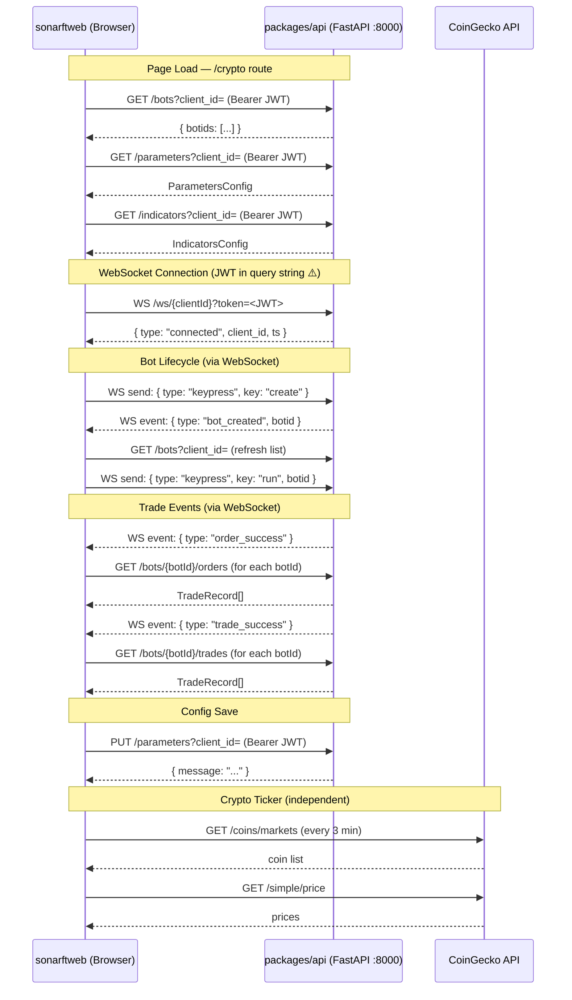

# Prompt 02 — API Integration & sonarft Communication

**Package:** `packages/web`  
**Prompt ID:** 02-WEB-API  
**Output File:** `docs/api-integration/sonarft-integration.md`  
**Reviewed:** July 2025  
**API Sources:** `packages/api` included — full contract verification enabled

---

## Executive Summary

The sonarftweb API integration layer is clean, centralized, and largely correct. All REST calls go through a single `utils/api.ts` module using the native `fetch` API. Auth headers are injected consistently. Error handling is intentionally asymmetric — critical calls throw, non-critical calls return `null` — which is a reasonable design choice but is applied inconsistently in one area.

The most significant finding is a confirmed security gap: the JWT is passed as a plain-text query parameter on the WebSocket URL (`?token=<JWT>`), which exposes it in server access logs and browser history. The API already provides a purpose-built single-use ticket endpoint (`POST /ws/ticket`) to solve this, but the frontend does not use it.

A secondary finding is a stale-token race condition in `useBots`: the WebSocket URL is built from `getAuthToken()` at hook render time, so a user who logs in after the component mounts will connect without a token.

The test suite covers `utils/api.ts` well but contains stale URL assertions that no longer match the actual endpoint paths, meaning some tests are silently passing against wrong URLs.

---

## 1. API Client Setup

### HTTP Client

The frontend uses the **native `fetch` API** exclusively for all sonarft backend calls. `axios` is present in `package.json` but is only used in `CryptoTicker.tsx` for the third-party CoinGecko API — it is not part of the sonarft integration layer.

### Base URL Configuration

```ts
// utils/constants.ts
export const HTTP: string =
    (import.meta.env.VITE_API_URL as string) ?? "http://localhost:8000/api/v1";

export const WS: string =
    (import.meta.env.VITE_WS_URL as string) ?? "ws://localhost:8000/api/v1/ws";
```

Base URLs are read from Vite environment variables with sensible localhost fallbacks. This is correct and environment-portable.

### Default Headers

```ts
// utils/api.ts
const baseHeaders: Record<string, string> = {
    Accept: "application/json",
    "Content-Type": "application/json",
};
```

Applied to every request via spread: `{ ...baseHeaders, ...getAuthHeaders() }`.

### Interceptors

None. There is no request/response interceptor layer. Each function handles its own errors independently.

### Timeout

**No timeout is configured on any request.** A slow or hung server will leave the UI in a loading state indefinitely. This is a gap for a trading application where responsiveness is critical.

### Retry Logic

**No automatic retry.** Failed requests either throw or return `null`. The WebSocket layer has exponential backoff reconnection, but REST calls have no retry.

---

## 2. Authentication & Authorization

### Token Storage

The auth token is **not stored by the frontend** — it is retrieved on demand from the `netlify-identity-widget` in-memory state:

```ts
// utils/api.ts
export const getAuthToken = (): string | null => {
    const user = netlifyIdentity.currentUser() as { token?: { access_token?: string } } | null;
    return user?.token?.access_token ?? null;
};
```

This is the correct approach — the token never touches `localStorage` or `sessionStorage` directly from the frontend code. Netlify Identity manages its own persistence internally.

### Token Passing

Bearer token is injected into every request via `getAuthHeaders()`:

```ts
const getAuthHeaders = (): Record<string, string> => {
    const token = getAuthToken();
    return token ? { Authorization: `Bearer ${token}` } : {};
};
```

If no token is present (unauthenticated or dev mode), the `Authorization` header is simply omitted. The API handles this correctly — in dev mode (no `NETLIFY_SITE_URL` or `SONARFT_API_TOKEN` set) it passes all requests through.

### Token Refresh

**No explicit token refresh logic in the frontend.** Netlify Identity handles token refresh internally via its widget. If the token expires mid-session, the next API call will send an expired token and receive a 401. There is no interceptor to catch 401s and trigger a re-login flow — the error will surface as a thrown exception or `null` return depending on the endpoint.

### Session Persistence

On page reload, `AuthProvider` calls `netlifyIdentity.currentUser()` to restore the session:

```ts
const currentUser = netlifyIdentity.currentUser() as NetlifyUser | null;
if (currentUser) setUser(currentUser);
```

This works correctly as long as Netlify Identity has a valid stored session.

### Logout & Token Clearing

`handleLogout` calls `netlifyIdentity.logout()`, which clears the Netlify Identity session. The `AuthContext` user state is set to `null` via the `logout` event listener. No manual token clearing is needed since the token is never stored independently.

### Protected Routes

`PrivateRoute` redirects to `/` if `value` is falsy. `Crypto.tsx` also performs its own `if (!user)` check before rendering. This is redundant — see Finding #12 from Prompt 01.

### API-Side Auth (confirmed from `packages/api`)

The API supports three auth modes, resolved in order:
1. **Netlify JWT** — if `NETLIFY_SITE_URL` is set, validates RS256 JWT via JWKS; `client_id` is derived from the `sub` claim (not the query parameter)
2. **Static token** — if `SONARFT_API_TOKEN` is set, timing-safe comparison
3. **Dev mode** — if neither is set, all requests pass through

**Important implication:** In Netlify JWT mode, the `client_id` query parameter sent by the frontend is **ignored** — the server derives identity from the JWT `sub` claim. The frontend sends `?client_id=${user.id}` where `user.id` is the Netlify user ID, which matches the JWT `sub`. This is consistent and correct, but it means the `client_id` parameter is redundant in production.

---

## 3. API Endpoint Usage

### Confirmed Endpoint Catalog

| Endpoint | Method | Frontend function | Called from | Trigger | Error handling |
|---|---|---|---|---|---|
| `/bots?client_id=` | GET | `getBotIds` | `useBots` | On mount, after `bot_created` WS event | Throws — sets `fetchError` state |
| `/bots/{botId}/orders` | GET | `getOrders` | `useBots` via `fetchAllOrders` | On `order_success` WS event | Returns `null` — silently ignored |
| `/bots/{botId}/trades` | GET | `getTrades` | `useBots` via `fetchAllTrades` | On `trade_success` WS event | Returns `null` — silently ignored |
| `/parameters/defaults` | GET | `getDefaultParameters` | `useConfigCheckboxes` | Fallback when fetch + localStorage fail | Returns local JSON fallback |
| `/parameters?client_id=` | GET | `getParameters` | `useConfigCheckboxes` | On mount | Throws — falls through to localStorage |
| `/parameters?client_id=` | PUT | `updateParameters` | `useConfigCheckboxes` | On save button click | Throws — sets `saveStatus = "error"` |
| `/indicators/defaults` | GET | `getDefaultIndicators` | `useConfigCheckboxes` | Fallback when fetch + localStorage fail | Returns local JSON fallback |
| `/indicators?client_id=` | GET | `getIndicators` | `useConfigCheckboxes` | On mount | Throws — falls through to localStorage |
| `/indicators?client_id=` | PUT | `updateIndicators` | `useConfigCheckboxes` | On save button click | Throws — sets `saveStatus = "error"` |

### API Endpoints NOT Called by Frontend

| Endpoint | Method | Purpose | Impact |
|---|---|---|---|
| `/ws/ticket` | POST | Exchange JWT for single-use WS ticket | **Security gap** — JWT exposed in WS URL instead |
| `/health` | GET | Service health check | No health polling or status indicator |
| `/bots/{botId}/run` | POST | Start a bot via REST | Bot start is done via WebSocket `keypress: run` |
| `/bots/{botId}/stop` | POST | Stop a bot via REST | No REST stop — only WS remove |
| `DELETE /bots/{botId}` | DELETE | Remove bot via REST | Bot removal is done via WebSocket `keypress: remove` |
| `/clients/{id}/bots` | GET/POST | Canonical new bot endpoints | Frontend uses legacy `/bots?client_id=` |

### Request/Response Shape Verification

All REST request and response shapes match the Pydantic schemas in `packages/api/src/models/schemas.py`:

| Frontend type | API schema | Match |
|---|---|---|
| `TradeRecord` (frontend) | `TradeRecord` (Pydantic) | ⚠️ Partial — see Finding #3 below |
| `ParametersConfig` | `ParametersConfig` | ✅ Exact match |
| `IndicatorsConfig` | `IndicatorsConfig` | ✅ Exact match |
| `{ botids: string[] }` | `BotListResponse` | ✅ Exact match |
| `{ message: string }` | `MessageResponse` | ✅ Exact match |

**Finding #3 — TradeRecord schema mismatch:** The API's `TradeRecord` Pydantic model includes fields not present in the frontend's `TradeRecord` interface:

| Field | API schema | Frontend interface |
|---|---|---|
| `sell_trade_amount` | ✅ present | ❌ missing |
| `executed_amount` | ✅ present | ❌ missing |
| `buy_fee_rate` | ✅ present | ❌ missing |
| `sell_fee_rate` | ✅ present | ❌ missing |
| `buy_fee_base` | ✅ present | ❌ missing |
| `buy_fee_quote` | ✅ present | ❌ missing |
| `sell_fee_quote` | ✅ present | ❌ missing |

These fields are silently dropped when the frontend deserializes the response. This is not a runtime error (TypeScript types are erased at runtime), but it means fee and execution data is never displayed to the user.

---

## 4. Error Handling Patterns

### Asymmetric Error Strategy

The API client uses two distinct error strategies, applied by endpoint type:

**Strategy A — Throw on failure** (used for critical operations):
```ts
// getBotIds, getParameters, updateParameters, getIndicators, updateIndicators
if (!response.ok) throw new Error(`HTTP error! status: ${response.status}`);
```
Callers catch these and set UI error state (`fetchError`, `saveStatus = "error"`).

**Strategy B — Return null on failure** (used for non-critical data):
```ts
// getOrders, getTrades
if (!response.ok) return null;
```
`fetchAllOrders` / `fetchAllTrades` filter out nulls silently. No error is shown to the user if order/trade history fails to load.

**Assessment:** The asymmetry is intentional and reasonable — a failed trade history fetch should not block the bot management UI. However, the silent failure for orders/trades means users have no feedback when history is unavailable.

### HTTP Error Granularity

Error messages only include the HTTP status code (`"HTTP error! status: 404"`). The API returns structured error bodies (e.g., `{ "detail": "Bot not found" }`) that are never read by the frontend. Users see generic error messages rather than the server's specific explanation.

### Network Errors

All functions wrap calls in `try/catch`. Network failures (DNS, connection refused) are caught and either re-thrown or return `null` depending on the strategy above.

### Error Display

| Error type | Display mechanism | Location |
|---|---|---|
| Bot fetch failure | `fetchError` state → `<div className="bots-ws-error">⚠ {fetchError}</div>` | `Bots.tsx` |
| WebSocket error | `wsError` state → `<div className="bots-ws-error">⚠ {wsError} — reconnecting...</div>` | `Bots.tsx` |
| Save failure | `saveStatus = "error"` → `"✗ Error — try again"` span | `Parameters.tsx`, `Indicators.tsx` |
| Render error | `ErrorBoundary` fallback | `Crypto.tsx` |
| Orders/trades failure | **Not displayed** | — |

### Error Logging

No errors are logged to the console or an error reporting service. `ErrorBoundary.componentDidCatch` has a comment noting it "could send to error reporting service here" but does nothing. In production, silent failures will be invisible.

---

## 5. Request Patterns & Best Practices

### Batching

`fetchAllOrders` and `fetchAllTrades` use `Promise.all` to fetch history for all bot IDs in parallel — this is correct and efficient:

```ts
const results = await Promise.all(botIds.map((id) => getOrders(id)));
```

### Request Deduplication

**No deduplication.** If `order_success` WebSocket events arrive in rapid succession, `fetchAllOrders` will be called multiple times concurrently. Each call fetches all bot IDs' orders in parallel. With multiple bots this could generate a burst of requests.

### Caching

**No request caching.** Every call fetches fresh data. For a trading application this is generally correct — stale data is dangerous. The `getDefaultParameters` / `getDefaultIndicators` fallback to bundled JSON files serves as an implicit cache for defaults only.

### Request Cancellation

**No cancellation.** If a component unmounts while a fetch is in flight, the response will attempt to call `setState` on an unmounted component. In React 18 this no longer throws, but it is wasted work. `AbortController` is not used anywhere.

### Race Conditions

**Confirmed race condition in `useBots`:** The `bot_created` handler fetches bot IDs and immediately sends a `run` command:

```ts
case "bot_created": {
    const ids = await getBotIds(clientId);       // async gap here
    setSelectedBotId(ids[ids.length - 1]);
    setBotIds(ids);
    setBotStatus(BotStatus.RUNNING);
    socket.send(JSON.stringify({ type: "keypress", key: "run", botid: ids[ids.length - 1] }));
    break;
}
```

If `getBotIds` is slow or fails, the `run` command is never sent and the bot is created but never started, with no error feedback to the user.

### Throttling / Debouncing

**No throttling or debouncing** on any request. The save buttons in `Parameters` and `Indicators` can be clicked rapidly, sending multiple PUT requests. The `saveStatus === "saving"` disabled state provides some protection but only within a single save cycle.

---

## 6. Response Handling

### Data Transformation

Minimal transformation. `fetchAllOrders` / `fetchAllTrades` flatten arrays of arrays:
```ts
results.filter((r): r is TradeRecord[] => r !== null).flat();
```

No normalization, no ID-keyed maps. Data is stored as flat arrays in state.

### Type Validation

**No runtime validation of API responses.** TypeScript types are cast assertions (`as TradeRecord[]`), not runtime checks. If the API returns an unexpected shape, the frontend will silently use malformed data or throw a runtime error when accessing undefined properties.

### Pagination

The API supports `limit` and `offset` query parameters on `/bots/{botId}/orders` and `/bots/{botId}/trades` (default: `limit=100`). The frontend **does not use pagination** — it always fetches the default 100 records. For active bots with high trade frequency, history will be truncated at 100 records with no indication to the user.

### Data Consistency

No optimistic updates. State is only updated after a successful server response or WebSocket event. This is the correct conservative approach for a trading application.

---

## 7. Loading & Skeleton States

| Operation | Loading state | User feedback |
|---|---|---|
| Initial bot list fetch | `isLoading` → `<div className="bots-loading">Loading...</div>` | ✅ Shown |
| Parameters/indicators fetch | None | ❌ No loading indicator |
| Save parameters/indicators | `saveStatus = "saving"` → button disabled + "Saving..." text | ✅ Shown |
| Order/trade history fetch | None | ❌ No loading indicator |
| Bot create/remove (WS) | None | ❌ No loading indicator |

**No skeleton screens** are used anywhere. The parameters and indicators forms render immediately with whatever state is in memory (localStorage or defaults), which avoids a blank flash — this is acceptable.

**No timeout messages.** If a request hangs indefinitely, the UI shows a loading spinner (where one exists) forever.

---

## 8. API Documentation & Constants

### Base URL

Configurable via `VITE_API_URL` and `VITE_WS_URL` environment variables. Correctly uses `import.meta.env` (Vite pattern). Falls back to `localhost:8000` for development.

### API Version Handling

The API version (`/api/v1`) is baked into the base URL environment variable. There is no version negotiation or version header. If the API version changes, the env var must be updated.

### Endpoint Constants

Endpoint paths are **not defined as constants** — they are constructed inline in each function:
```ts
fetch(HTTP + `/bots?client_id=${encodeURIComponent(clientId)}`, ...)
fetch(HTTP + `/bots/${botId}/orders`, ...)
```

This means a path change requires updating multiple function bodies. A `ENDPOINTS` constants object would be safer.

### Mock Data

The test suite has a well-structured mock layer:
- `mocks/fixtures.ts` — typed fixture data matching `TradeRecord`, `ParametersConfig`, `IndicatorsConfig`
- `mocks/handlers.ts` — MSW handlers for all REST endpoints
- `mocks/server.ts` — MSW server setup

**Finding — stale test URL assertions:** `api.test.ts` asserts against old endpoint paths that no longer match the current `utils/api.ts` implementation:

```ts
// api.test.ts asserts:
expect.stringContaining("/botids/client_123")          // actual: /bots?client_id=client_123
expect.stringContaining("/bot/set_parameters/client_123")  // actual: /parameters?client_id=client_123
expect.stringContaining("/bot/set_indicators/client_123")  // actual: /indicators?client_id=client_123
```

These tests pass because they only check `stringContaining` on the URL, and the mock `fetch` is set up to resolve regardless of URL. The URL assertions are wrong and would not catch a regression.

---

## 9. sonarft-Specific Integration

### Bot Management

Bot lifecycle is split across REST and WebSocket:

| Action | Transport | Frontend call |
|---|---|---|
| List bots | REST GET | `getBotIds` |
| Create bot | WebSocket | `keypress: create` |
| Run bot | WebSocket | `keypress: run` (auto-sent after `bot_created`) |
| Remove bot | WebSocket | `keypress: remove` |
| Toggle simulation | WebSocket | `keypress: set_simulation` |

**Finding — `set_simulation` missing `botid`:** The frontend sends:
```ts
socket.send(JSON.stringify({ type: "keypress", key: "set_simulation", value: next }));
```
But the API's `_receive_loop` requires a valid `botid` for `set_simulation`:
```python
elif key == "set_simulation":
    if not botid or not _BOTID_RE.match(str(botid)):
        await self._push_model(client_id, WsErrorEvent(...))
```
The frontend does not include `botid` in the `set_simulation` message. The server will respond with a `WsErrorEvent` ("Invalid or missing botid"), but the frontend has no handler for `type: "error"` WebSocket events — the error is silently dropped.

### Indicator & Parameter Configuration

Both use `useConfigCheckboxes` with a three-tier fallback: API → localStorage → bundled JSON defaults. This is a robust pattern for offline/degraded operation.

### Trade Execution

The frontend has no direct trade execution endpoint calls. All execution is triggered by the bot autonomously; the frontend only observes results via `order_success` and `trade_success` WebSocket events.

### Real-time Data

Real-time market data (prices, order book) is **not streamed to the frontend**. The WebSocket only carries bot lifecycle events and log lines. The `CryptoTicker` polls CoinGecko every 3 minutes for display prices — this is independent of the trading engine's data.

---

## 10. Security Concerns

### JWT in WebSocket Query String — High Severity

```ts
// hooks/useBots.ts
const wsUrl = token
    ? `${WS}/${clientId}?token=${encodeURIComponent(token)}`
    : `${WS}/${clientId}`;
```

The JWT is passed as a URL query parameter. This means:
- It appears in server access logs (nginx, uvicorn, Traefik)
- It appears in browser history
- It may be captured by analytics or monitoring tools
- It is visible in the browser's network tab URL

The API already provides the correct solution — `POST /ws/ticket` issues a 30-second single-use opaque ticket. The frontend should call this endpoint before opening the WebSocket and use `?ticket=<value>` instead.

**Remediation:**
```ts
// Before opening WebSocket:
const { ticket } = await fetch(HTTP + "/ws/ticket", {
    method: "POST",
    headers: { ...baseHeaders, ...getAuthHeaders() },
}).then(r => r.json());
const wsUrl = `${WS}/${clientId}?ticket=${ticket}`;
```

### Stale Token on WebSocket Connection

`getAuthToken()` is called once at hook render time to build the WS URL. If the user is not yet logged in when `useBots` first renders (e.g., auth state loads asynchronously), the WebSocket connects without a token. The hook does not re-connect when auth state changes.

### Input Validation

`clientId` and `botId` values are URL-encoded with `encodeURIComponent` before being inserted into query strings — correct. No additional client-side validation of user-supplied values before sending to the API.

### CORS

Configured server-side in `packages/api`. The frontend does not set any CORS-related headers (correct — CORS is a server concern). The API allows `http://localhost:3000` and `http://localhost:5173` by default.

### HTTPS Enforcement

No client-side HTTPS enforcement. The production `.env.production.example` uses `https://` and `wss://` URLs, but there is no runtime check that prevents the app from running over HTTP in production.

### Sensitive Data in Logs

No auth tokens or credentials are logged by the frontend. The `sendVitals` function sends performance metrics but no PII or auth data.

### `.env.production` Committed

The `.env.production` file is committed to the repository. It should be reviewed to confirm it contains no secrets (API tokens, credentials). The `.env.production.example` uses `REACT_APP_*` prefixes (old CRA convention) rather than `VITE_*` — this file appears to be a stale artifact from a previous CRA setup and would not work with the current Vite configuration.

---

## 11. Performance Considerations

### Request Frequency

- `CryptoTicker` polls CoinGecko every 3 minutes (2 requests per poll) — reasonable
- Bot history (`getOrders`, `getTrades`) is fetched on every `order_success` / `trade_success` WebSocket event — for a high-frequency bot this could generate many requests
- No debouncing on history fetches

### Bundle Size Impact

Using native `fetch` instead of `axios` for the sonarft API is the correct choice — it saves ~14KB gzipped. The `axios` dependency should be removed and `CryptoTicker` should be migrated to `fetch`.

### Waterfall Requests

On the `Crypto` page mount, the following requests fire in sequence:
1. `getBotIds` (from `useBots`)
2. `getParameters` (from `useConfigCheckboxes` in `Parameters`)
3. `getIndicators` (from `useConfigCheckboxes` in `Indicators`)

Requests 2 and 3 are independent and fire concurrently (separate component mounts). Request 1 is also independent. No waterfall — all three fire in parallel on mount.

---

## 12. API Integration Diagram



---

## Findings Summary

| # | Finding | Severity | File |
|---|---|---|---|
| 1 | JWT passed as WebSocket query parameter — exposed in server logs and browser history | High | `hooks/useBots.ts` |
| 2 | `set_simulation` WS message missing `botid` — server rejects with error event, frontend silently drops it | High | `hooks/useBots.ts` |
| 3 | `TradeRecord` frontend interface missing 7 fields present in API schema (fee data, executed amount) | Medium | `utils/api.ts` |
| 4 | No request timeout on any `fetch` call — hung server leaves UI in permanent loading state | Medium | `utils/api.ts` |
| 5 | Stale token race: `getAuthToken()` called at render time; WS URL not updated if user logs in after mount | Medium | `hooks/useBots.ts` |
| 6 | `bot_created` handler: if `getBotIds` fails, bot is created but never started — no error feedback | Medium | `hooks/useBots.ts` |
| 7 | No handler for `type: "error"` WebSocket events from server | Medium | `hooks/useBots.ts` |
| 8 | Stale URL assertions in `api.test.ts` — tests pass against wrong endpoint paths | Medium | `utils/api.test.ts` |
| 9 | No pagination support — history capped at 100 records with no user indication | Low | `utils/api.ts`, `hooks/useBots.ts` |
| 10 | No `AbortController` — in-flight requests not cancelled on component unmount | Low | `utils/api.ts` |
| 11 | API error response body (`detail` field) never read — users see generic status codes only | Low | `utils/api.ts` |
| 12 | No error reporting in `ErrorBoundary.componentDidCatch` — production errors are invisible | Low | `components/ErrorBoundary/ErrorBoundary.tsx` |
| 13 | `.env.production.example` uses stale `REACT_APP_*` prefix (CRA) instead of `VITE_*` | Low | `.env.production.example` |
| 14 | `axios` dependency used only for CoinGecko — should be replaced with `fetch` and removed | Low | `components/CryptoTicker/CryptoTicker.tsx` |

---

## Recommendations

**Priority 1 — Fix before production**

1. **Implement WS ticket auth:** Call `POST /ws/ticket` before opening the WebSocket and use `?ticket=<value>`. Remove `?token=` from the WS URL.

2. **Fix `set_simulation` message:** Include `botid` (the `selectedBotId`) in the `set_simulation` WebSocket message:
   ```ts
   socket.send(JSON.stringify({ type: "keypress", key: "set_simulation", botid: selectedBotId, value: next }));
   ```

3. **Handle `type: "error"` WS events:** Add a `case "error"` branch in the `useBots` message handler that sets an error state and displays it to the user.

**Priority 2 — Correctness**

4. **Add request timeouts** using `AbortController` with a configurable timeout (e.g., 10s):
   ```ts
   const controller = new AbortController();
   const timeoutId = setTimeout(() => controller.abort(), 10_000);
   fetch(url, { signal: controller.signal, ... });
   ```

5. **Fix stale token on WS connect:** Derive the WS URL inside a `useEffect` that depends on the auth token, or use the ticket flow (which naturally solves this).

6. **Sync `TradeRecord` interface** with the API schema — add the 7 missing fee/execution fields.

7. **Fix `api.test.ts` URL assertions** to match current endpoint paths.

**Priority 3 — Quality**

8. **Read API error bodies:** Parse the `detail` field from error responses and surface it to the user.

9. **Add `AbortController` cleanup** in `useEffect` hooks that fire fetch calls, to cancel in-flight requests on unmount.

10. **Remove `axios`** from `package.json` and migrate `CryptoTicker` to native `fetch`.

11. **Fix `.env.production.example`** to use `VITE_*` prefixes.
