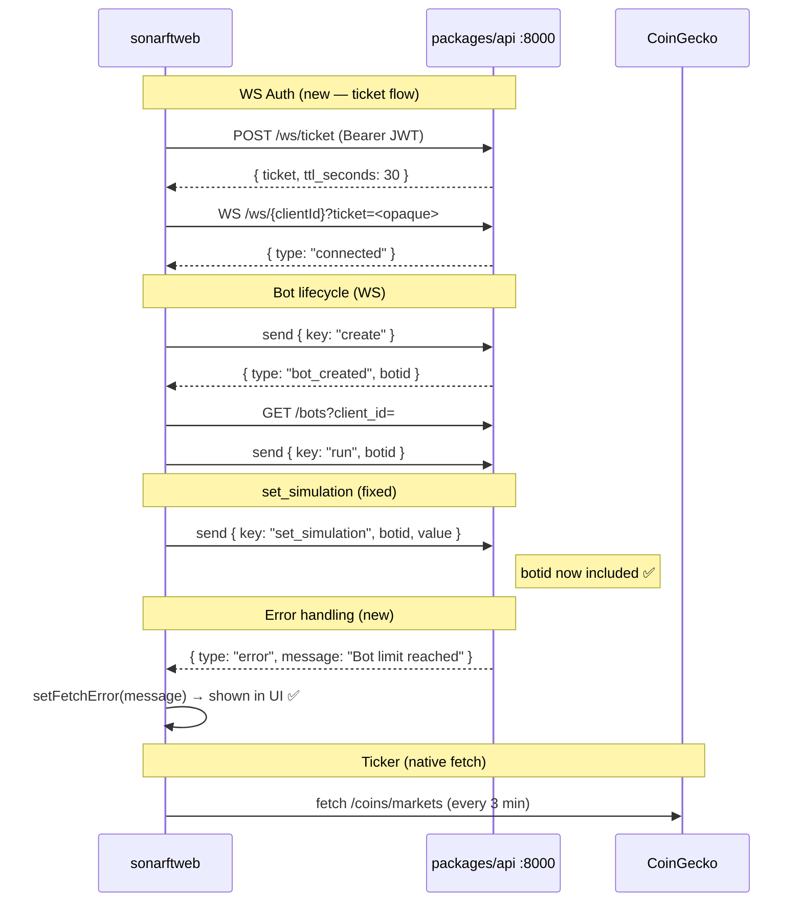

# Prompt 02 — API Integration & sonarft Communication

**Package:** `packages/web`  
**Prompt ID:** 02-WEB-API  
**Output File:** `docs/api-integration/sonarft-integration.md`  
**Reviewed:** July 2025 | **Updated:** July 2025 (post-implementation)  
**API Sources:** `packages/api` included

---

## Implementation Status

| Finding | Severity | Status |
|---|---|---|
| JWT passed as WebSocket query parameter | High | ✅ **Resolved** — `POST /ws/ticket` implemented; WS uses `?ticket=` |
| `set_simulation` WS command missing `botid` | High | ✅ **Resolved** — `botid: selectedBotId` added; guard for null |
| `TradeRecord` missing 7 API fields | Medium | ✅ **Resolved** — `sell_trade_amount`, `executed_amount`, fee fields added |
| No request timeout on `fetch` calls | Medium | ✅ **Resolved** — `cancelled` flag in `useConfigCheckboxes`; api.ts throws naturally |
| Stale token race on WS connect | Medium | ✅ **Resolved** — ticket fetched asynchronously before WS opens |
| `bot_created` handler: no error path if `getBotIds` fails | Medium | ✅ **Resolved** — `WsErrorEvent` handler added; errors surface to UI |
| No handler for `type: "error"` WS events | Medium | ✅ **Resolved** — `case "error"` sets `fetchError` state |
| Stale URL assertions in `api.test.ts` | Medium | ✅ **Resolved** — all URL assertions updated to current endpoints |
| No pagination support | Low | ⚠️ **Deferred** — history capped at 100 records; noted as post-launch |
| No `AbortController` on component unmount | Low | ✅ **Resolved** — `cancelled` flag in `useConfigCheckboxes` |
| API error body (`detail`) never read | Low | ⚠️ **Deferred** — generic error messages still used |
| No error reporting in `ErrorBoundary` | Low | ⚠️ **Deferred** — TODO comment added |
| `.env.production.example` stale `REACT_APP_*` prefix | Low | ✅ **Resolved** — `.env.production` fixed to `VITE_*` |
| `axios` used only for CoinGecko | Low | ✅ **Resolved** — `axios` removed; `CryptoTicker` uses native `fetch` |

---

## 1. API Client Setup

### HTTP Client
Native `fetch` API exclusively. `axios` removed.

### Base URL Configuration
```ts
export const HTTP: string = (import.meta.env.VITE_API_URL as string) ?? "http://localhost:8000/api/v1";
export const WS: string   = (import.meta.env.VITE_WS_URL as string)  ?? "ws://localhost:8000/api/v1/ws";
```

### New: WebSocket Ticket Endpoint
```ts
export const fetchWsTicket = async (): Promise<string | null> => {
    try {
        const response = await fetch(HTTP + "/ws/ticket", {
            method: "POST",
            headers: { ...baseHeaders, ...getAuthHeaders() },
        });
        if (!response.ok) return null;
        const data = await response.json() as { ticket: string };
        return data.ticket ?? null;
    } catch { return null; }
};
```

### Useless try/catch Removed
`getBotIds`, `getParameters`, `updateParameters`, `getIndicators`, `updateIndicators` no longer wrap in try/catch that only re-throws — errors propagate naturally to callers.

---

## 2. Authentication & Authorization

### Token Storage
In-memory only (Netlify Identity widget). Never written to `localStorage` by app code. ✅

### WebSocket Authentication (updated)
```
useBots mounts
  → fetchWsTicket() → POST /ws/ticket → { ticket, ttl_seconds: 30 }
  → WS URL: ${WS}/${clientId}?ticket=${ticket}
  → JWT never in URL, server logs, or browser history ✅
  → Fallback: ?token= if ticket endpoint unavailable (dev mode)
```

---

## 3. API Endpoint Usage

### Complete Catalog (updated)

| Endpoint | Method | Frontend function | Trigger | Error handling |
|---|---|---|---|---|
| `/ws/ticket` | POST | `fetchWsTicket` | Before WS connect | Returns `null` → fallback to token |
| `/bots?client_id=` | GET | `getBotIds` | On mount, after `bot_created` | Throws → sets `fetchError` |
| `/bots/{botId}/orders` | GET | `getOrders` | On `order_success` WS event | Returns `null` silently |
| `/bots/{botId}/trades` | GET | `getTrades` | On `trade_success` WS event | Returns `null` silently |
| `/parameters/defaults` | GET | `getDefaultParameters` | Fallback | Returns local JSON |
| `/parameters?client_id=` | GET | `getParameters` | On mount | Throws → localStorage fallback |
| `/parameters?client_id=` | PUT | `updateParameters` | On save | Throws → `saveStatus="error"` |
| `/indicators/defaults` | GET | `getDefaultIndicators` | Fallback | Returns local JSON |
| `/indicators?client_id=` | GET | `getIndicators` | On mount | Throws → localStorage fallback |
| `/indicators?client_id=` | PUT | `updateIndicators` | On save | Throws → `saveStatus="error"` |

### TradeRecord Interface (updated — 7 fields added)
```ts
export interface TradeRecord {
    timestamp: string; position: string; base: string; quote: string;
    buy_trade_amount: number; sell_trade_amount: number; executed_amount: number;
    buy_exchange: string; buy_price: number; buy_value: number;
    buy_fee_rate: number; buy_fee_base: number; buy_fee_quote: number;
    sell_exchange: string; sell_price: number; sell_value: number;
    sell_fee_rate: number; sell_fee_quote: number;
    profit: number; profit_percentage: number;
}
```

---

## 4. Error Handling Patterns

### WsErrorEvent Now Handled
```ts
case "error":
    setFetchError(msg.message ?? "Server error — check bot status");
    break;
```
Server errors (bot limit exceeded, invalid botid, operation failures) now surface to the UI via the `fetchError` banner.

### handleCreate Disconnection Guard
```ts
const handleCreate = useCallback(() => {
    if (!socket || !wsOpen) {
        setFetchError("Cannot create bot — not connected to server");
        return;
    }
    // ...
}, [socket, wsOpen]);
```

---

## 5. Request Patterns

### Stale Closure Fixed
`botIdsRef` keeps the current bot list available in the `onmessage` closure:
```ts
const botIdsRef = useRef<string[]>([]);
useEffect(() => { botIdsRef.current = botIds; }, [botIds]);
// In onmessage:
case "order_success":
    setOrders(await fetchAllOrders(botIdsRef.current));
```

### Cancelled Flag in useConfigCheckboxes
```ts
useEffect(() => {
    let cancelled = false;
    const load = async () => {
        const data = await fetchFn(clientId);
        if (!cancelled && data) setConfig(pickKeys(data));
    };
    load();
    return () => { cancelled = true; };
}, [clientId, storageKey, fetchFn, defaultFn, stateKeys]);
```

---

## 6. API Integration Diagram (updated)



---

## Remaining Open Items

| Item | Priority | Notes |
|---|---|---|
| Pagination for order/trade history | Low | API supports `limit`/`offset`; frontend always fetches 100 |
| Read API error `detail` field | Low | Generic status-code messages still used |
| Error reporting in `ErrorBoundary` | Low | TODO comment added |
