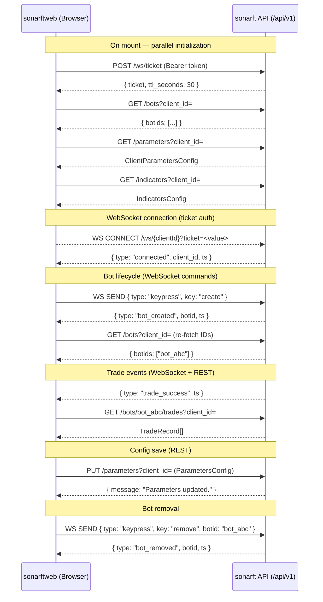

# API Integration & sonarft Communication
**Prompt:** 02-WEB-API | **Package:** web | **Reviewed:** July 2025

---

## Executive Summary

The sonarftweb API integration layer is clean, minimal, and well-structured. All
server communication is centralized in `utils/api.ts` using native `fetch` with a
consistent auth header injection pattern. The WebSocket ticket flow is correctly
implemented, keeping JWTs out of server logs. Error handling is present at every
call site and surfaces to the user via `role="alert"` banners or inline save-status
indicators. The main gaps are: no request timeouts, no request cancellation for
in-flight loads on unmount, the frontend still calls deprecated legacy API paths,
and the `ParametersConfig` type is missing the `version` field that the API now
includes in its response schema.

---

## 1. API Client Setup

**HTTP client:** Native browser `fetch`. No axios or other library.

**Base URL configuration:** Centralized in `utils/constants.ts`, read from Vite
environment variables at build time:

```typescript
export const HTTP: string =
    (import.meta.env.VITE_API_URL as string) ?? "http://localhost:8000/api/v1";
```

Development: `http://localhost:8000/api/v1`
Production: `https://api.sonarft.com` (from `.env.production`)

**Default headers:** Set inline in `api.ts` as a module-level constant:

```typescript
const baseHeaders: Record<string, string> = {
    Accept: "application/json",
    "Content-Type": "application/json",
};
```

Auth headers are merged per-call via `getAuthHeaders()`, which reads from
`sessionStorage` and returns `{ Authorization: "Bearer <token>" }` when a token
is present, or `{}` when not.

**Interceptors:** None. No request/response interceptor layer exists. Each function
constructs its own headers by spreading `baseHeaders` and `getAuthHeaders()`.

**Timeout:** None configured. All `fetch` calls have no `AbortController` or
`signal` with a timeout. A slow or hung server will leave the request pending
indefinitely.

**Retry logic:** None. Failed requests are not retried automatically. The three-tier
config load chain (server → localStorage → bundled defaults) in `useConfigCheckboxes`
and `Parameters` provides a graceful degradation path, but this is a fallback
strategy, not a retry.

**Error handling at the client level:** `fetch` does not throw on HTTP error status
codes — only on network failure. Each function in `api.ts` checks `response.ok` and
throws or returns `null` accordingly. There is no centralized error handler.

---

## 2. Authentication & Authorization

**Token storage:** `sessionStorage` under the key `"sonarft_token"`.

```typescript
export const getAuthToken = (): string | null =>
    sessionStorage.getItem("sonarft_token");
```

`sessionStorage` is cleared when the browser tab is closed, which is appropriate
for a trading application — it avoids persistent token exposure in `localStorage`
while still surviving page refreshes within the same session.

**Token passing:** `Authorization: Bearer <token>` header, injected by
`getAuthHeaders()` and merged into every `fetch` call. The token is never passed
as a query parameter for REST calls.

**WebSocket auth:** A single-use ticket is obtained via `POST /ws/ticket` before
opening the WebSocket. The ticket (not the JWT) is passed as `?ticket=<value>` in
the WS URL. This keeps the JWT out of server access logs and browser history. If
the ticket endpoint is unavailable (dev mode, no auth), the hook falls back to
`?token=<jwt>` or a bare URL.

**Token refresh:** No refresh mechanism. The app relies on Netlify Identity's
client-side token management. If the JWT expires mid-session, the next API call
will receive a 401 and the error will surface as a `fetchError` banner — there is
no automatic re-authentication.

**Session persistence:** On page reload, `AuthProvider` re-initializes `user` from
`DEFAULT_USER` (env vars). The token in `sessionStorage` persists across reloads
within the same tab. The combination means the user identity is always available
but the token may or may not be present depending on whether Netlify Identity has
set it.

**Logout:** `handleLogout` in `AuthProvider` sets `user` to `null`. It does not
clear `sessionStorage`. The token remains in storage after logout until the tab
is closed.

**Protected routes:** `PrivateRoute` exists as a component but is not wired into
`App.tsx`. The `Crypto` page guards itself with `if (!user) return null`, which
prevents rendering but does not redirect. This is functional but not a formal
route guard.

---

## 3. API Endpoint Usage

All calls use the legacy query-parameter paths. The canonical
`/clients/{client_id}/...` paths exist on the server but are not yet used by the
frontend.

| Endpoint | Method | Called From | Trigger | Error Handling |
|---|---|---|---|---|
| `POST /ws/ticket` | POST | `useBots` (resolveWsUrl) | On mount | Silent `null` return — falls back to token/bare URL |
| `GET /bots?client_id=` | GET | `useBots` (load, bot_created handler) | On mount + WS event | Caught → `fetchError` state |
| `GET /bots/{botId}/orders?client_id=` | GET | `helpers.fetchAllOrders` | On mount (if bots exist) + `order_success` WS event | Returns `null` on failure; filtered out by caller |
| `GET /bots/{botId}/trades?client_id=` | GET | `helpers.fetchAllTrades` | On mount (if bots exist) + `trade_success` WS event | Returns `null` on failure; filtered out by caller |
| `GET /parameters?client_id=` | GET | `Parameters`, `useConfigCheckboxes` | On mount | Falls through to localStorage → bundled defaults |
| `GET /parameters/defaults` | GET | `Parameters`, `useConfigCheckboxes` | On mount (fallback) | Falls through to bundled JSON |
| `PUT /parameters?client_id=` | PUT | `Parameters` | User clicks "Set bot parameters" | `saveStatus` → `"error"` shown inline |
| `GET /indicators?client_id=` | GET | `useConfigCheckboxes` (via Indicators) | On mount | Falls through to localStorage → bundled defaults |
| `GET /indicators/defaults` | GET | `useConfigCheckboxes` | On mount (fallback) | Falls through to bundled JSON |
| `PUT /indicators?client_id=` | PUT | `useConfigCheckboxes` | User clicks "Set bot indicators" | `saveStatus` → `"error"` shown inline |

**Request bodies (PUT calls):**

`PUT /parameters` sends `ParametersConfig`:
```json
{ "exchanges": { "Binance": true }, "symbols": { "BTC/USDT": true }, "strategy": "market_making" }
```

The API's `ClientParametersConfig` schema also includes `"version": 1`. The
frontend does not send this field. The API has `version` with a default of `1`,
so omitting it is safe — the server will use the default. However, on read, the
API response includes `"version"` and the frontend `ParametersConfig` type does
not declare it. The field is silently ignored via TypeScript type assertion.

`PUT /indicators` sends `IndicatorsConfig`:
```json
{ "periods": { "1h": true }, "oscillators": { "RSI": true }, "movingaverages": { "EMA": true } }
```

Same `version` field situation applies.

**Pagination:** The API supports `limit`, `offset`, `from_ts`, `to_ts` query
parameters on orders and trades endpoints. The frontend does not use any of these
— it always fetches with defaults (limit=100, offset=0, no date filter). For
high-volume bots this will silently truncate history at 100 records.

---

## 4. Error Handling Patterns

**HTTP errors (4xx/5xx):**
- `getBotIds`, `getParameters`, `getIndicators`, `updateParameters`,
  `updateIndicators`: throw `new Error("HTTP error! status: N")` on `!response.ok`.
  Callers catch these and set `fetchError` or `saveStatus` state.
- `getOrders`, `getTrades`, `fetchWsTicket`: return `null` on `!response.ok`.
  Callers filter out nulls.
- `getDefaultParameters`, `getDefaultIndicators`: throw on `!response.ok`, caught
  by the three-tier load chain's `catch` block.

**Network errors (connection refused, DNS failure):**
- `fetch` throws a `TypeError` on network failure. All call sites are wrapped in
  `try/catch`, so network errors are caught and handled the same as HTTP errors.

**Validation errors (422 from API):**
- The API returns `{ "detail": [...] }` for Pydantic validation failures. The
  frontend does not parse the `detail` array — it only checks `response.ok`. The
  user sees a generic "✗ Error — try again" message, not the specific field error.

**User-visible error display:**
- `useBots`: `fetchError` state rendered as `<div role="alert">⚠ {fetchError}</div>`
- `useBots`: `wsError` state rendered as `<div role="alert">⚠ {wsError} — reconnecting...</div>`
- Config components: `saveStatus === "error"` renders `<span role="status">✗ Error — try again</span>`

**Error logging:** No `console.error` calls in production paths. Errors are
surfaced to the user but not sent to any error reporting service. The `ErrorBoundary`
has a comment noting it "could send to error reporting service here" but does not.

**Error boundaries:** One `ErrorBoundary` wraps the entire `Crypto` page content.
It catches render-time errors but not async errors (promise rejections from `fetch`
are handled inline).

**Rate limit errors (429):** The API enforces rate limits (60/min for reads,
30/min for writes, 10/min for bot creation). The frontend does not handle 429
responses specially — they are treated as generic errors. No backoff or retry
is implemented for rate-limited requests.

---

## 5. Request Patterns & Best Practices

**Batch requests:** `fetchAllOrders` and `fetchAllTrades` in `helpers.ts` use
`Promise.all` to fetch history for all bot IDs concurrently. This is the only
batching in the codebase.

**Request deduplication:** None. If `bot_created` fires multiple times rapidly,
`getBotIds` will be called multiple times concurrently. In practice this is
unlikely given the bot lifecycle, but there is no guard.

**Caching:** No HTTP-level caching. The API sets `Cache-Control: no-store` on all
responses. The frontend's localStorage persistence for config state is a
client-side cache for the config load fallback chain, not an HTTP cache.

**Request throttling/debouncing:** None. Save buttons are disabled during
`saveStatus === "saving"` which prevents double-submission, but there is no
debounce on checkbox changes.

**Cancellation:** No `AbortController` usage. The `useConfigCheckboxes` and
`Parameters` load effects use a `cancelled` boolean flag to prevent state updates
after unmount, but the underlying `fetch` request is not aborted — it completes
in the background and its result is discarded. This is a minor resource waste
but not a correctness issue.

**Race conditions:**
- The `cancelled` flag in `useConfigCheckboxes` and `Parameters` correctly handles
  the case where `clientId` changes before the load completes.
- In `useBots`, the `bot_created` handler calls `getBotIds` and then
  `setSelectedBotId(ids[ids.length - 1])`. If two `bot_created` events arrive
  in rapid succession, the second `getBotIds` response could arrive before the
  first, leaving `selectedBotId` pointing to a stale ID. This is an edge case
  given the `MAX_BOTS_PER_CLIENT = 5` limit and the sequential nature of bot
  creation, but it is a latent race.

---

## 6. Response Handling

**Data transformation:** Minimal. Responses are cast directly to TypeScript types
via `as TypeName`. No normalization or transformation layer exists.

**Validation:** None at runtime. TypeScript type assertions (`as TradeRecord[]`)
provide compile-time safety but no runtime validation. If the API returns an
unexpected shape, the app will silently render incorrect data or throw a runtime
error.

**Type checking:** Compile-time only via TypeScript. The `TradeRecord` interface
in `api.ts` matches the API's `TradeRecord` Pydantic model field-for-field, with
one exception: the API's `ClientParametersConfig` and `IndicatorsConfig` include
a `version: int` field not present in the frontend types.

**Schema alignment (frontend vs API):**

| Field | Frontend `ParametersConfig` | API `ClientParametersConfig` | Status |
|---|---|---|---|
| `exchanges` | `Record<string, boolean>` | `dict[str, bool]` | ✅ Match |
| `symbols` | `Record<string, boolean>` | `dict[str, bool]` | ✅ Match |
| `strategy` | `"arbitrage" \| "market_making"` | `Literal["arbitrage", "market_making"]` | ✅ Match |
| `version` | ❌ Not declared | `int = 1` | ⚠️ Missing in frontend type |

| Field | Frontend `IndicatorsConfig` | API `IndicatorsConfig` | Status |
|---|---|---|---|
| `periods` | `Record<string, boolean>` | `dict[str, bool]` | ✅ Match |
| `oscillators` | `Record<string, boolean>` | `dict[str, bool]` | ✅ Match |
| `movingaverages` | `Record<string, boolean>` | `dict[str, bool]` | ✅ Match |
| `version` | ❌ Not declared | `int = 1` | ⚠️ Missing in frontend type |

**Pagination:** Not implemented on the frontend. The API supports `limit` (default
100, max 1000), `offset`, `from_ts`, and `to_ts` on orders and trades endpoints.
The frontend always fetches with defaults, silently capping history at 100 records
per bot.

**Data consistency:** After `order_success` and `trade_success` WebSocket events,
the frontend re-fetches the full history list. This is a simple and correct
approach at current scale, though it becomes inefficient as history grows.

---

## 7. Loading & Skeleton States

| Context | Loading indicator | Disabled during load? |
|---|---|---|
| Bot list initial load | `<div className="bots-loading">Loading...</div>` | N/A |
| Save parameters | `saveStatus === "saving"` → button `disabled` + "Saving..." text | ✅ Yes |
| Save indicators | `saveStatus === "saving"` → button `disabled` + "Saving..." text | ✅ Yes |
| Fetch orders/trades | None | No |
| WS ticket fetch | None (silent) | No |

**Skeleton screens:** None. The app uses simple text loading indicators.

**Timeout messages:** None. There is no timeout on any `fetch` call, so a hung
server will show "Loading..." indefinitely with no user feedback.

**Partial data:** Config components initialize from localStorage on first render
(before the server response arrives), so the user sees their last-known config
immediately rather than an empty state. This is a good UX pattern.

---

## 8. API Documentation & Constants

**Base URL:** Configurable per environment via `VITE_API_URL` in `.env.development`
and `.env.production`. Falls back to `http://localhost:8000/api/v1` if unset.

**API constants:** Base URLs are in `utils/constants.ts`. Endpoint paths are
inline strings in `utils/api.ts` — not extracted as named constants. This is
acceptable given the small number of endpoints but makes path changes require
searching the file.

**Version handling:** The API prefix `/api/v1` is baked into `VITE_API_URL`. There
is no runtime version negotiation.

**Documentation:** Functions in `api.ts` have no JSDoc comments. The code is
readable enough that comments are not strictly necessary, but documenting the
expected response shape and error behavior would aid future maintainers.

**Mock data:** MSW v2 handlers in `src/mocks/handlers.ts` mock all API endpoints
for testing. Fixtures are in `src/mocks/fixtures.ts`.

---

## 9. sonarft-Specific Integration

**Bot management:** Bots are created, stopped, and removed exclusively via
WebSocket commands (`create`, `stop`, `remove`). REST is used only to list bot
IDs and fetch history. This matches the server's design — the WebSocket is the
command channel, REST is the query channel.

**Indicator configuration:** Loaded on mount via `GET /indicators?client_id=`,
saved via `PUT /indicators?client_id=`. The frontend sends the full config object
on every save (no partial updates). The API validates all keys against
`_CONFIG_KEY_RE` and enforces a 50-entry limit per section.

**Trading parameters:** Same pattern as indicators. The `strategy` field
(`"arbitrage"` | `"market_making"`) is a new addition — the API's default is
`"arbitrage"` while the frontend's `DEFAULT_STATE` uses `"market_making"`. This
means a fresh client with no server config will default to `"market_making"` in
the UI but `"arbitrage"` on the server until the user saves.

**Trade execution:** Not triggered via REST. All execution commands go through
WebSocket. The frontend has no direct REST endpoint for placing orders.

**Real-time data:** Market prices and execution events arrive via WebSocket. The
frontend does not poll for price data — it relies entirely on the server pushing
events.

---

## 10. Security Concerns

| Finding | Severity | Detail |
|---|---|---|
| Token not cleared on logout | Low | `handleLogout` sets `user = null` but does not call `sessionStorage.removeItem("sonarft_token")`. The JWT remains in storage until the tab is closed. A subsequent page load in the same tab would still have the token available. |
| No request timeout | Low | All `fetch` calls have no timeout. A slow server can hold connections open indefinitely, potentially blocking the UI. |
| `version` field not sent on PUT | Info | `PUT /parameters` and `PUT /indicators` omit the `version` field. The API defaults it to `1`, so this is safe today. If the API introduces a breaking schema change and increments `version`, the frontend will silently send `version: 1` and may receive a validation error. |
| Legacy paths in use | Info | The frontend calls deprecated `/bots?client_id=` and `/parameters?client_id=` paths. These carry `Deprecation: true` and `Sunset: Sun, 01 Jan 2026` headers. No security risk, but migration is needed before the sunset date. |
| No 429 handling | Info | Rate limit responses are treated as generic errors. Under heavy use, the user would see "✗ Error — try again" with no indication that they are rate-limited. |
| CORS | ✅ OK | API allows `http://localhost:3000,http://localhost:5173` in dev and should be set to the production domain via `CORS_ORIGINS` env var. `allow_credentials=True` is set, which is required for the `Authorization` header. |
| HTTPS enforcement | ✅ OK | `.env.production` uses `https://` and `wss://`. The nginx config includes HSTS. |
| Token in WS URL | ✅ OK | The ticket pattern keeps the JWT out of server logs. The fallback `?token=` path is only used in dev mode when the ticket endpoint is unavailable. |
| Input validation | ✅ OK | The API validates all config keys against `_CONFIG_KEY_RE` and enforces size limits. The frontend sends only checkbox-derived boolean maps, so injection via user input is not possible. |

---

## 11. Performance Considerations

**Request frequency:** On `order_success` and `trade_success` WebSocket events,
the frontend re-fetches the full history for all bots. For a bot with 100 trades
and 100 orders, this is two GET requests per trade event. At high trading frequency
this could generate significant request volume. The API's `limit=100` default caps
the response size, but the requests themselves are unbounded in frequency.

**Bundle size:** Native `fetch` adds zero bundle weight. No HTTP client library
is included.

**Compression:** The API applies `GZipMiddleware` with `minimum_size=1000`. Trade
history responses (JSON arrays) will be gzip-compressed. The browser handles
decompression transparently.

**Caching headers:** The API sets `Cache-Control: no-store` on all responses.
This is correct for trading data but means config responses (parameters,
indicators) are also never cached, even though they change infrequently.

**Waterfall requests:** On mount, `useBots` fires two parallel effects:
1. Resolve WS ticket URL (POST /ws/ticket)
2. Fetch bot IDs (GET /bots)

These are independent and run concurrently. If bots exist, a second waterfall
follows: fetch orders and trades in parallel via `Promise.all`. This is a
two-level waterfall (bot IDs → history) but is unavoidable given that bot IDs
are needed before history can be fetched.

Config components (`Parameters`, `Indicators`) each fire their own load on mount,
independent of the bot load. These three load chains run concurrently.

---

## 12. API Integration Diagram



---

## Recommendations

| Priority | Finding | Recommendation |
|---|---|---|
| Medium | No request timeout on any `fetch` call | Add `AbortController` with a timeout (e.g. 15s) to all `fetch` calls, or create a `fetchWithTimeout` wrapper in `api.ts`. |
| Medium | Token not cleared on logout | Add `sessionStorage.removeItem("sonarft_token")` to `handleLogout` in `AuthProvider`. |
| Low | Frontend uses deprecated legacy API paths | Migrate `api.ts` to canonical `/clients/{client_id}/bots`, `/clients/{client_id}/parameters`, and `/clients/{client_id}/indicators` paths before the January 2026 sunset. |
| Low | `ParametersConfig` and `IndicatorsConfig` missing `version` field | Add `version?: number` to both frontend types so the field round-trips correctly and future schema versioning is handled. |
| Low | History fetch not paginated | Add `limit` and `offset` support to `getOrders` / `getTrades` calls, or at minimum increase the default limit beyond 100 for high-volume bots. |
| Low | No 429 rate-limit handling | Detect `response.status === 429` and show a user-friendly "Too many requests — please wait" message rather than the generic error. |
| Low | Default strategy mismatch | Align `DEFAULT_STATE.strategy` in `Parameters` with the API default (`"arbitrage"`), or document the intentional difference. |
| Info | Endpoint paths are inline strings | Extract endpoint path segments as constants in `api.ts` to make future path migrations a single-line change. |
| Info | No JSDoc on `api.ts` functions | Add brief JSDoc comments documenting the expected response shape and error behavior for each exported function. |
