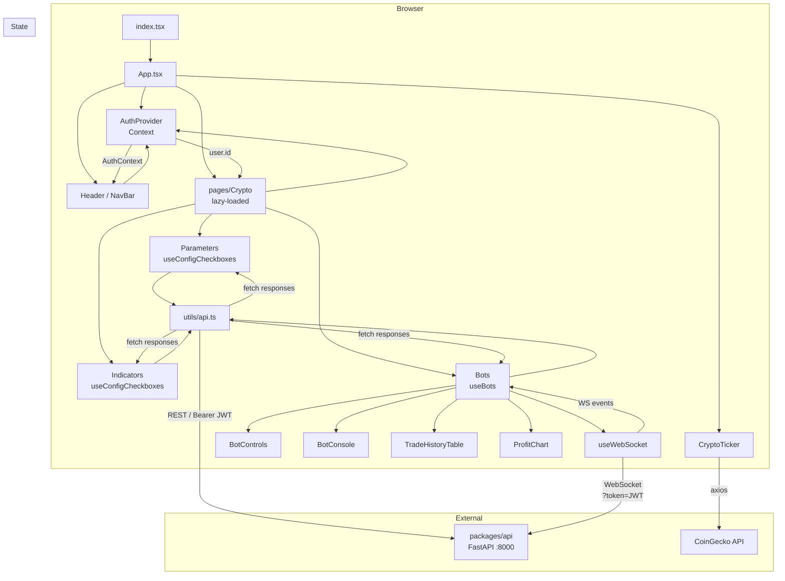

# Prompt 01 — Architecture & Project Structure

**Package:** `packages/web`  
**Prompt ID:** 01-WEB-ARCH  
**Output File:** `docs/architecture/structure.md`  
**Reviewed:** July 2025  
**API Sources:** `packages/api` included — full contract verification enabled

---

## Executive Summary

The sonarftweb frontend is a well-structured React 18 + TypeScript + Vite application. The codebase is small, focused, and largely follows modern React conventions: functional components throughout, custom hooks for all stateful logic, Context API for auth, and a flat but clear directory layout. The technology choices are appropriate for the domain.

Key strengths: clean hook-based architecture, good separation of API calls from UI, typed interfaces, lazy-loaded routes, and a working WebSocket reconnection strategy.

Key concerns: Redux is installed but unused; `axios` is imported only in one component that calls a third-party API directly; `packages/api` exposes a WebSocket ticket endpoint that the frontend does not use; `useConfigCheckboxes` has a suppressed exhaustive-deps lint warning; and several components have minor structural issues (invalid HTML nesting, `window.confirm` in a hook).

---

## 1. Technology Stack Inventory

| Category | Technology | Version | Notes |
|---|---|---|---|
| UI framework | React | ^18.2.0 | Functional components, hooks throughout |
| Language | TypeScript | ^5.0.0 | `strict: true` enabled |
| Build tool | Vite | ^8.0.8 | `@vitejs/plugin-react` |
| Routing | React Router DOM | ^6.30.3 | `BrowserRouter`, lazy-loaded routes |
| State management | React Context API | — | Auth state only |
| State management (installed, unused) | Redux Toolkit + React Redux | ^2.11.2 / ^9.2.0 | No store, no slices found in `src/` |
| HTTP client | `fetch` (native) | — | Used in `utils/api.ts` for all API calls |
| HTTP client (secondary) | axios | ^1.15.0 | Used only in `CryptoTicker` for CoinGecko |
| WebSocket | Native `WebSocket` | — | Wrapped in `useWebSocket` hook |
| Charts | Recharts | ^3.8.1 | Used in `ProfitChart` |
| Auth | netlify-identity-widget | ^1.9.2 | JWT-based; dev bypass via env var |
| Testing | Vitest + Testing Library | ^3.0.0 / ^13.4.0 | jsdom environment, MSW for mocking |
| Linting | ESLint (react-app preset) | — | Configured in `package.json` |
| Formatting | Prettier | ^3.0.3 | — |
| CSS | Plain CSS + CSS custom properties | — | `variables.css` for design tokens |
| Package manager | npm (+ yarn.lock present) | — | Both lock files exist — inconsistency |
| Web Vitals | web-vitals | ^2.1.4 | Custom `sendVitals` reporter |
| Utility | es-toolkit, clsx, immer, decimal.js-light | various | Most appear unused in reviewed source |

**Unused / orphaned dependencies (risk: bundle bloat):**
- `@reduxjs/toolkit`, `react-redux`, `reselect`, `use-sync-external-store` — Redux stack installed but no store exists
- `immer`, `eventemitter3`, `tiny-invariant`, `victory-vendor`, `es-toolkit`, `clsx`, `decimal.js-light` — not found in any reviewed source file
- `prop-types` — redundant given TypeScript strict mode

---

## 2. Directory Structure & Module Organization

```
packages/web/
├── src/
│   ├── assets/img/          # Static images (logo)
│   ├── components/          # Feature-grouped UI components
│   │   ├── Bots/            # Bot management UI (Bots, BotControls, BotConsole, TradeHistoryTable)
│   │   ├── Charts/          # ProfitChart (Recharts)
│   │   ├── CryptoTicker/    # Live price banner (CoinGecko)
│   │   ├── ErrorBoundary/   # Class-based error boundary
│   │   ├── Footer/          # Static footer
│   │   ├── Header/          # Header shell (wraps NavBar)
│   │   ├── Indicators/      # Indicator config checkboxes
│   │   ├── NavBar/          # Navigation + auth buttons
│   │   ├── Parameters/      # Exchange/symbol config checkboxes
│   │   └── PrivateRoute/    # Auth guard component
│   ├── hooks/               # Custom React hooks + AuthProvider
│   │   ├── AuthProvider.tsx # Context + Netlify Identity integration
│   │   ├── useBots.ts       # Bot lifecycle, WS messages, trade history
│   │   ├── useConfigCheckboxes.ts  # Generic config form state
│   │   ├── useIdleTimeout.ts       # Session idle detection
│   │   └── useWebSocket.tsx        # WS connection + exponential backoff
│   ├── integration/         # Integration test (workflows.test.tsx)
│   ├── mocks/               # MSW handlers, fixtures, server setup
│   ├── pages/               # Route-level page components
│   │   ├── Crypto/          # Main trading page (auth-gated)
│   │   ├── CryptoChatGPT/   # Placeholder page
│   │   ├── Dex/             # Placeholder page
│   │   ├── Doggy/           # Placeholder page
│   │   ├── Forex/           # Placeholder page
│   │   ├── Home/            # Landing page + Welcome sub-component
│   │   └── Token/           # Placeholder page
│   ├── utils/               # API client, constants, helpers, vitals
│   ├── App.tsx              # Root component: router, layout, lazy routes
│   ├── index.tsx            # React DOM entry point
│   ├── variables.css        # CSS custom properties (design tokens)
│   ├── reset.css            # CSS reset
│   └── styles.css / App.css / index.css  # Global styles
├── public/                  # Static assets + JSON config files
│   ├── indicators.json      # Default indicator options
│   ├── matrixDefinitions.json
│   └── stats.json
└── [config files]           # vite.config.js, tsconfig.json, package.json, etc.
```

**Organization principle:** by feature/domain within `components/` and `pages/`, by type within `hooks/` and `utils/`. This is consistent and appropriate for the codebase size.

**Naming conventions:** PascalCase for component files and directories, camelCase for hooks (`useBots.ts`), lowercase with dots for CSS (`bots.css`). Consistent throughout.

---

## 3. Component Architecture

| Component | Type | Purpose | Key Props | Reusable? |
|---|---|---|---|---|
| `App` | Functional | Root layout, router, lazy routes | — | No (singleton) |
| `Header` | Functional | Header shell | — | No |
| `NavBar` | Functional | Navigation links + auth buttons | — (reads AuthContext) | No |
| `Footer` | Functional | Static copyright footer | — | No |
| `CryptoTicker` | Functional | Live price banner (CoinGecko polling) | — | Yes |
| `ErrorBoundary` | Class | Catches render errors, shows fallback | `children` | Yes |
| `PrivateRoute` | Functional | Auth guard — redirects to `/` if no value | `children`, `value` | Yes (generic) |
| `Bots` | Functional | Bot management container | `user: { id, email? }` | No |
| `BotControls` | Functional | Create/select/remove bot buttons | `botIds`, `botState`, `selectedBotId`, `wsOpen`, callbacks | Yes |
| `BotConsole` | Functional | Scrolling log output | `logs: string[]` | Yes |
| `TradeHistoryTable` | Functional | Trade/order history table | `rows: TradeRecord[]` | Yes |
| `ProfitChart` | Functional | Cumulative P&L area chart | `trades: TradeRecord[]` | Yes |
| `Parameters` | Functional | Exchange/symbol checkbox config | `clientId: string` | No |
| `Indicators` | Functional | Indicator checkbox config | `clientId: string` | No |
| `Crypto` (page) | Functional | Main trading page, auth-gated | — (reads AuthContext) | No |
| `Home` (page) | Functional | Landing page | — | No |
| `Welcome` | Functional | Hero text inside Home | — | No |

**Component types:** 100% functional components except `ErrorBoundary` (class component, required for `componentDidCatch`).

**Container vs presentational:** Loosely applied. `Bots` acts as a container (calls `useBots`, passes data down). `BotControls`, `BotConsole`, `TradeHistoryTable`, `ProfitChart` are presentational. `Parameters` and `Indicators` are hybrid — they call `useConfigCheckboxes` internally rather than receiving config as props, which limits their reusability.

**Props design:** TypeScript interfaces defined inline per component. No PropTypes (correct given TypeScript). Props are minimal and well-typed.

**Custom hooks:**

| Hook | Purpose |
|---|---|
| `AuthProvider` / `AuthContext` | Netlify Identity auth state, idle timeout integration |
| `useBots` | Bot lifecycle, WebSocket message handling, trade/order history |
| `useWebSocket` | WebSocket connection with exponential backoff reconnection |
| `useConfigCheckboxes` | Generic config form: fetch → localStorage fallback → defaults, save |
| `useIdleTimeout` | Session idle detection via DOM events |

---

## 4. Layering & Separation of Concerns

```
┌─────────────────────────────────────────────────────┐
│  Route Layer       App.tsx (BrowserRouter, lazy)    │
├─────────────────────────────────────────────────────┤
│  Page Layer        pages/Crypto, pages/Home, ...    │
├─────────────────────────────────────────────────────┤
│  Component Layer   components/Bots, Parameters, ... │
├─────────────────────────────────────────────────────┤
│  Hook Layer        useBots, useWebSocket, useConfig  │
├─────────────────────────────────────────────────────┤
│  API/Utils Layer   utils/api.ts, utils/helpers.ts   │
├─────────────────────────────────────────────────────┤
│  Constants Layer   utils/constants.ts               │
└─────────────────────────────────────────────────────┘
```

**Assessment:**
- UI layer is clean — components do not call `fetch` directly (except `CryptoTicker`, which calls CoinGecko via axios inline).
- Business logic is correctly isolated in hooks.
- API calls are centralized in `utils/api.ts` — good single point of change.
- Auth is cleanly separated into `AuthProvider` context.
- `useBots` mixes WebSocket message handling, REST polling, and bot state — it is the most complex unit and could be split further (see recommendations).
- `Crypto.tsx` reads `AuthContext` and passes `user.id` down — appropriate, not excessive prop drilling.

**Concern — `window.confirm` in `useBots`:** The `handleRemove` callback calls `window.confirm(...)` inside a hook. This is a side effect that belongs in the UI layer (component), not in a hook. It also makes the hook untestable without mocking `window.confirm`.

---

## 5. Module Dependency Analysis

```
index.tsx
  └── App.tsx
        ├── hooks/AuthProvider  (AuthContext)
        ├── components/Header   → components/NavBar → hooks/AuthProvider
        ├── components/Footer
        ├── components/CryptoTicker  (axios, CoinGecko — external)
        └── pages/Crypto (lazy)
              ├── hooks/AuthProvider  (AuthContext)
              ├── components/PrivateRoute
              ├── components/ErrorBoundary
              ├── components/Parameters → hooks/useConfigCheckboxes → utils/api
              ├── components/Indicators → hooks/useConfigCheckboxes → utils/api
              └── components/Bots
                    ├── hooks/useBots
                    │     ├── hooks/useWebSocket
                    │     ├── utils/api  (getBotIds, getOrders, getTrades, getAuthToken)
                    │     └── utils/helpers (fetchAllOrders, fetchAllTrades)
                    ├── components/BotControls
                    ├── components/BotConsole
                    ├── components/TradeHistoryTable
                    └── components/Charts/ProfitChart
```

**Circular dependencies:** None detected.

**Key integration points:**
- `utils/api.ts` is the single REST API client — all components reach the backend through it.
- `utils/constants.ts` holds `HTTP` and `WS` base URLs — single source of truth for endpoint roots.
- `hooks/AuthProvider` is the single auth state source — consumed by `NavBar`, `Crypto`, and `utils/api.ts` (via `getAuthToken()`).

**Concern — `getAuthToken()` called at hook render time:** In `useBots`, `getAuthToken()` is called during render to build the WebSocket URL. If the token changes (e.g., after login), the URL does not update because the hook does not re-run. The WebSocket would remain connected with a stale or missing token.

---

## 6. Data Flow Architecture

### Initial Load
```
index.tsx → App renders → AuthProvider initialises Netlify Identity
→ Crypto page lazy-loads on /crypto route
→ Crypto reads user from AuthContext
→ Bots mounts → useBots(user.id) runs
  → getBotIds(clientId) fetches bot list via REST
  → useWebSocket(wsUrl) opens WS connection
→ Parameters/Indicators mount → useConfigCheckboxes runs
  → fetchFn(clientId) fetches config via REST
  → falls back to localStorage, then defaultFn()
```

### User Interactions
```
User clicks "Create New Bot"
→ handleCreate() → socket.send({ type: "keypress", key: "create" })
→ Server responds with WS event: bot_created
→ useBots onmessage handler: getBotIds() → setSelectedBotId → socket.send("run")
→ UI updates: botIds, selectedBotId, botStatus = RUNNING
```

### Real-time Updates
```
WS message received → parseMessage(event.data)
→ type="log"          → setLogs (capped at 500 lines)
→ type="bot_created"  → REST fetch botIds → auto-run bot
→ type="bot_removed"  → reset botState, botStatus
→ type="order_success"→ REST fetch all orders
→ type="trade_success"→ REST fetch all trades
```

### State Location

| State | Location | Rationale |
|---|---|---|
| Auth user | `AuthContext` | Global, needed by multiple components |
| Bot IDs, logs, status | `useBots` local state | Scoped to Bots component tree |
| Config (parameters/indicators) | `useConfigCheckboxes` local state + localStorage | Persisted locally, synced to server on save |
| WebSocket connection | `useWebSocket` local state | Encapsulated connection lifecycle |
| Crypto ticker prices | `CryptoTicker` local state | Isolated, no sharing needed |

**Prop drilling assessment:** Minimal. `user.id` is passed from `Crypto` → `Bots`, `Parameters`, `Indicators` — one level, acceptable. No deep drilling detected.

---

## 7. API Integration Points

### REST Endpoints (confirmed against `packages/api`)

| Frontend call | Method | URL | API route | Auth |
|---|---|---|---|---|
| `getBotIds` | GET | `/bots?client_id=` | `bots_router` | Bearer token |
| `getOrders` | GET | `/bots/{botId}/orders` | `bots_router` | Bearer token |
| `getTrades` | GET | `/bots/{botId}/trades` | `bots_router` | Bearer token |
| `getParameters` | GET | `/parameters?client_id=` | `config_router` | Bearer token |
| `updateParameters` | PUT | `/parameters?client_id=` | `config_router` | Bearer token |
| `getDefaultParameters` | GET | `/parameters/defaults` | `config_router` | Bearer token |
| `getIndicators` | GET | `/indicators?client_id=` | `config_router` | Bearer token |
| `updateIndicators` | PUT | `/indicators?client_id=` | `config_router` | Bearer token |
| `getDefaultIndicators` | GET | `/indicators/defaults` | `config_router` | Bearer token |

**Not called by frontend (API endpoints exist):**
- `POST /ws/ticket` — the API provides a single-use WebSocket ticket endpoint (`ws_ticket_router`). The frontend connects with `?token=<JWT>` directly instead. This is a security gap: passing JWT tokens in WebSocket query strings exposes them in server logs and browser history.
- `GET /health` — not polled by the frontend.
- `clients_router` (`/clients/{id}/bots`) — canonical new endpoint not used by frontend.

### WebSocket Events

| Direction | Event type | Frontend handler |
|---|---|---|
| Server → Client | `log` | Appends to `logs` state |
| Server → Client | `bot_created` | Fetches bot IDs, auto-runs bot |
| Server → Client | `bot_removed` | Resets bot state |
| Server → Client | `order_success` | Fetches all orders |
| Server → Client | `trade_success` | Fetches all trades |
| Client → Server | `keypress: create` | Creates a new bot |
| Client → Server | `keypress: run` | Starts a bot |
| Client → Server | `keypress: remove` | Removes a bot |
| Client → Server | `keypress: set_simulation` | Toggles simulation mode |

**Confirmed against API schemas:** `WsBotCreatedEvent`, `WsBotRemovedEvent`, `WsOrderSuccessEvent`, `WsTradeSuccessEvent`, `WsLogEvent` all match the frontend's `parseMessage` handler. The `connected` and `ping` event types defined in `schemas.py` are not handled by the frontend.

### Error Handling

| Scenario | Handling |
|---|---|
| `getBotIds` fails | Sets `fetchError` state → shown in UI |
| `getOrders`/`getTrades` fails | Returns `null` → silently ignored |
| `getParameters`/`getIndicators` fails | Falls back to localStorage, then defaults |
| `updateParameters`/`updateIndicators` fails | Sets `saveStatus = "error"` → shown in UI |
| WebSocket error | Sets `wsError` state → shown in UI |
| WebSocket close | Exponential backoff reconnect |
| Render error | `ErrorBoundary` catches, shows fallback |

---

## 8. Code Complexity Hotspots

| File | Lines (approx.) | Complexity driver |
|---|---|---|
| `hooks/useBots.ts` | ~130 | WebSocket message handling, REST calls, multiple state slices, bot lifecycle |
| `hooks/useConfigCheckboxes.ts` | ~90 | Three-tier fallback loading (API → localStorage → defaults), generic types |
| `components/Indicators/Indicators.tsx` | ~90 | Large TOOLTIPS constant, renderCheckboxes logic |
| `components/Parameters/Parameters.tsx` | ~75 | Same pattern as Indicators |
| `utils/api.ts` | ~120 | All REST calls, auth header injection, type definitions |
| `hooks/AuthProvider.tsx` | ~70 | Netlify Identity lifecycle, idle timeout, dev bypass |

`useBots.ts` is the highest-complexity file and the most likely source of future bugs. It handles WebSocket events, REST polling, bot state machine, and simulation toggle in a single hook.

---

## 9. Configuration & Constants

### Environment Variables

| Variable | Default | Used in |
|---|---|---|
| `VITE_API_URL` | `http://localhost:8000/api/v1` | `utils/constants.ts` → `HTTP` |
| `VITE_WS_URL` | `ws://localhost:8000/api/v1/ws` | `utils/constants.ts` → `WS` |
| `VITE_DEV_AUTH_BYPASS` | `false` | `hooks/AuthProvider.tsx` |
| `VITE_IDLE_TIMEOUT_MS` | `1800000` (30 min) | `hooks/AuthProvider.tsx` |
| `VITE_VITALS_URL` | — (optional) | `utils/vitals.ts` |

All env vars are correctly prefixed `VITE_` for Vite exposure. `.env.development` and `.env.production` are committed — `.env.production` should be reviewed to ensure no secrets are present.

### Constants

`utils/constants.ts` is minimal and correct — `HTTP` and `WS` base URLs plus four string message constants. No magic strings scattered in components.

### Design Tokens

`src/variables.css` defines 12 CSS custom properties covering background, text, border, and button colours. Used consistently across component CSS files. No Tailwind or CSS-in-JS — plain CSS with variables is appropriate for this codebase size.

### Feature Flags

`VITE_DEV_AUTH_BYPASS=true` in `.env.development` injects a dev user and skips Netlify Identity. This is a clean pattern. The dev token value (`"dev-token"`) is sent as a Bearer token to the API — the API must handle this gracefully in dev mode (confirmed: API has a dev-mode pass-through in `core/security.py`).

---

## 10. Architecture Diagram



---

## Findings Summary

| # | Finding | Severity | File |
|---|---|---|---|
| 1 | Redux stack installed but entirely unused — dead weight in bundle | Medium | `package.json` |
| 2 | `axios`, `immer`, `es-toolkit`, `clsx`, `victory-vendor`, `prop-types`, `eventemitter3`, `tiny-invariant`, `decimal.js-light` appear unused | Low | `package.json` |
| 3 | JWT passed in WebSocket query string (`?token=`) — exposed in server logs; ticket endpoint exists but is not used | High | `hooks/useBots.ts`, `utils/constants.ts` |
| 4 | `getAuthToken()` called at render time in `useBots` — stale token if user logs in after hook mounts | Medium | `hooks/useBots.ts` |
| 5 | `window.confirm` inside `handleRemove` hook — side effect belongs in UI layer, blocks testing | Medium | `hooks/useBots.ts` |
| 6 | `useConfigCheckboxes` suppresses `react-hooks/exhaustive-deps` — `fetchFn`, `defaultFn`, `updateFn`, `stateKeys` missing from dep array | Medium | `hooks/useConfigCheckboxes.ts` |
| 7 | `BotConsole` renders `<ul><pre>` — invalid HTML nesting (`pre` inside `ul` without `li`) | Low | `components/Bots/BotConsole.tsx` |
| 8 | `BotControls` renders buttons inside `<ul>` without `<li>` wrappers — invalid HTML | Low | `components/Bots/BotControls.tsx` |
| 9 | `Home.tsx` nests two `<main>` elements — only one `<main>` per page is valid | Low | `pages/Home/Home.tsx` |
| 10 | Both `npm` (package-lock.json) and `yarn` (yarn.lock) lock files committed — pick one | Low | root |
| 11 | `WsConnectedEvent` and `WsPingEvent` from API not handled in frontend | Low | `hooks/useBots.ts` |
| 12 | `Crypto.tsx` uses `PrivateRoute` incorrectly — passes `null` as value and empty fragment as children, then immediately checks `!user` itself | Low | `pages/Crypto/Crypto.tsx` |
| 13 | `.env.production` committed to repository — verify it contains no secrets | Medium | `.env.production` |

---

## Recommendations

**Priority 1 — Security**
- Migrate WebSocket auth to use the ticket endpoint (`POST /ws/ticket` → `?ticket=<token>`). This prevents the JWT from appearing in server access logs and browser history.
- Audit `.env.production` for any committed secrets.

**Priority 2 — Correctness**
- Move `window.confirm` out of `useBots.handleRemove` into the `BotControls` component's `onRemove` handler.
- Fix `useConfigCheckboxes` exhaustive-deps: wrap `fetchFn`, `defaultFn`, `updateFn` in `useCallback` at call sites, or restructure the effect.
- Fix `getAuthToken()` stale token: derive the WS URL inside the effect or subscribe to auth state changes.

**Priority 3 — Code Quality**
- Remove unused dependencies: Redux stack, `axios` (replace with `fetch` in `CryptoTicker`), and the other orphaned packages. This will meaningfully reduce bundle size.
- Fix invalid HTML: `BotConsole` (`ul > pre`), `BotControls` (buttons directly in `ul`), `Home` (nested `main`).
- Simplify `Crypto.tsx` auth guard — use `PrivateRoute` properly or remove it and keep the `if (!user)` check only.

**Priority 4 — Architecture**
- Consider splitting `useBots` into `useBotLifecycle` (create/remove/status) and `useTradeHistory` (orders/trades fetching) for better testability and single responsibility.
- The `Parameters` and `Indicators` components are near-identical — consider a single generic `ConfigCheckboxPanel` component parameterised by category definitions.
