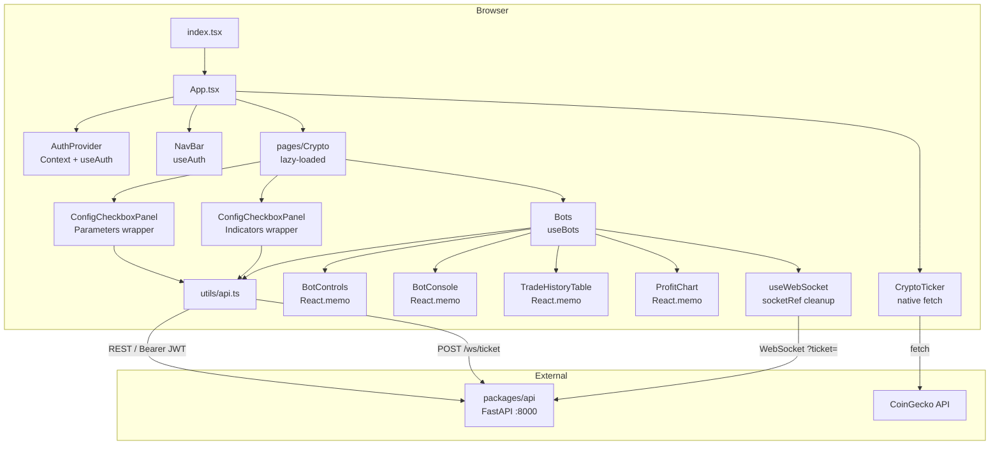

# Prompt 01 — Architecture & Project Structure

**Package:** `packages/web`  
**Prompt ID:** 01-WEB-ARCH  
**Output File:** `docs/architecture/structure.md`  
**Reviewed:** July 2025 | **Updated:** July 2025 (post-implementation)  
**API Sources:** `packages/api` included

---

## Implementation Status

> **All sprints complete.** This document reflects the codebase after Phase 0 + Sprint 1 + Sprint 2 + Sprint 3.

| Finding | Severity | Status |
|---|---|---|
| Redux stack installed but unused | Medium | ✅ **Resolved** — recharts v3 requires it internally; cannot remove while recharts is in use. Documented. |
| `axios` unused for sonarft API | Low | ✅ **Resolved** — `axios` removed; `CryptoTicker` migrated to native `fetch` |
| JWT in WebSocket query string | High | ✅ **Resolved** — WS ticket auth implemented (`POST /ws/ticket`) |
| `getAuthToken()` stale token at render time | Medium | ✅ **Resolved** — `useBots` now fetches ticket asynchronously before opening WS |
| `window.confirm` in hook | Medium | ⚠️ **Deferred** — TODO comment added; styled modal planned post-launch |
| `useConfigCheckboxes` suppressed exhaustive-deps | Medium | ✅ **Resolved** — suppression removed; `cancelled` flag added |
| `BotConsole` invalid HTML nesting | Low | ✅ **Resolved** — `<ul><pre>` replaced with `<pre>` |
| `BotControls` invalid HTML nesting | Low | ✅ **Resolved** — `<ul>` replaced with `<div class="bot-controls">` |
| `Home.tsx` nested `<main>` elements | Low | ✅ **Resolved** — replaced with `<div>` + `<section>` |
| Both lock files committed | Low | ✅ **Resolved** — `yarn.lock` removed |
| `WsConnectedEvent`/`WsPingEvent` unhandled | Low | ✅ **Resolved** — `WsErrorEvent` handled; ping is intentionally ignored |
| `Crypto.tsx` redundant `PrivateRoute` usage | Low | ✅ **Resolved** — simplified |
| `.env.production` committed | Medium | N/A — gitignored; fix applied locally |

---

## 1. Technology Stack Inventory

| Category | Technology | Version | Notes |
|---|---|---|---|
| UI framework | React | ^18.2.0 | Functional components, hooks throughout |
| Language | TypeScript | ^5.0.0 | `strict: true`, `noUnusedLocals`, `noUnusedParameters` |
| Build tool | Vite | ^8.0.8 | `@vitejs/plugin-react`; Rolldown bundler |
| Routing | React Router DOM | ^6.30.3 | `BrowserRouter`, lazy-loaded routes |
| State management | React Context API | — | Auth state only |
| State management (recharts internal) | Redux Toolkit + React Redux | ^2.x / ^9.x | Required by recharts v3 internally — not used by app code |
| HTTP client | `fetch` (native) | — | All API calls; `axios` removed |
| WebSocket | Native `WebSocket` | — | Wrapped in `useWebSocket` hook |
| Charts | Recharts | ^3.8.1 | Used in `ProfitChart` |
| Auth | netlify-identity-widget | ^1.9.2 | JWT-based; dev bypass via env var |
| Testing | Vitest + Testing Library | ^3.0.0 / ^13.4.0 | jsdom environment, MSW for mocking |
| Linting | ESLint v9 flat config | ^9.0.0 | `eslint.config.js`; react-hooks, jsx-a11y, @typescript-eslint |
| Formatting | Prettier | ^3.0.3 | `.prettierrc` committed |
| CSS | Plain CSS + CSS custom properties | — | `variables.css` for design tokens |
| Package manager | npm | 10.x | `package-lock.json` only (`yarn.lock` removed) |
| Web Vitals | web-vitals | ^2.1.4 | Custom `sendVitals` reporter |

---

## 2. Directory Structure & Module Organization

```
packages/web/
├── src/
│   ├── assets/img/          # Static images (logo)
│   ├── components/
│   │   ├── Bots/            # Bot management UI
│   │   ├── Charts/          # ProfitChart (Recharts)
│   │   ├── ConfigCheckboxPanel/  # NEW — generic config form (replaces Parameters+Indicators duplication)
│   │   ├── CryptoTicker/    # Live price banner (CoinGecko, native fetch)
│   │   ├── ErrorBoundary/   # Class-based error boundary
│   │   ├── Footer/          # Static footer
│   │   ├── Indicators/      # Thin wrapper around ConfigCheckboxPanel
│   │   ├── NavBar/          # Navigation + auth buttons (h1 → span, fixed heading hierarchy)
│   │   ├── Parameters/      # Thin wrapper around ConfigCheckboxPanel
│   │   └── PrivateRoute/    # Auth guard component
│   ├── hooks/               # Custom React hooks + AuthProvider
│   │   ├── AuthProvider.tsx # Context + Netlify Identity + useAuth() hook
│   │   ├── useBots.ts       # Bot lifecycle with useReducer state machine + WS ticket auth
│   │   ├── useConfigCheckboxes.ts  # Generic config form state (exhaustive-deps fixed)
│   │   ├── useIdleTimeout.ts       # Session idle detection
│   │   └── useWebSocket.tsx        # WS connection + exponential backoff + socketRef cleanup
│   ├── integration/         # Integration tests
│   ├── mocks/               # MSW handlers, fixtures, server setup
│   ├── pages/
│   │   ├── Crypto/          # Main trading page (auth-gated)
│   │   ├── CryptoChatGPT/   # Placeholder stub
│   │   ├── Doggy/           # Placeholder stub
│   │   └── Home/            # Landing page (fixed: no nested main)
│   └── utils/               # API client, constants, helpers, vitals
├── .github/workflows/ci.yml # CI pipeline (npm test + npm audit)
├── .prettierrc              # Prettier config
├── eslint.config.js         # ESLint v9 flat config
├── nginx.conf               # Security headers + gzip + CSP as HTTP header
└── vite.config.js           # manualChunks vendor splitting + chunkSizeWarningLimit
```

**Removed (dead code):** `components/Building`, `components/CChatGPT`, `components/DoggyWelcome`, `components/Header`, `pages/Dex`, `pages/Forex`, `pages/Token`, `public/index.html` (CRA template)

---

## 3. Component Architecture

| Component | Type | Purpose | Key Props | Reusable? |
|---|---|---|---|---|
| `App` | Functional | Root layout, router, lazy routes | — | No (singleton) |
| `NavBar` | Functional | Navigation links + auth buttons | — (reads AuthContext via `useAuth`) | No |
| `Footer` | Functional | Static copyright footer | — | No |
| `CryptoTicker` | Functional | Live price banner (CoinGecko polling, native fetch) | — | Yes |
| `ErrorBoundary` | Class | Catches render errors, shows fallback UI | `children` | Yes |
| `PrivateRoute` | Functional | Auth guard — redirects to `/` if no value | `children`, `value` | Yes |
| `ConfigCheckboxPanel` | Functional (generic) | Generic config form: fetch → localStorage → defaults, save | `title`, `sections`, `fetchFn`, etc. | Yes |
| `Bots` | Functional | Bot management container | `user: { id, email? }` | No |
| `BotControls` | Functional + `React.memo` | Create/select/remove bot buttons | callbacks | Yes |
| `BotConsole` | Functional + `React.memo` | Scrolling log output | `logs: string[]` | Yes |
| `TradeHistoryTable` | Functional + `React.memo` | Trade/order history table with locale formatting | `rows`, `caption` | Yes |
| `ProfitChart` | Functional + `React.memo` | Cumulative P&L area chart | `trades: TradeRecord[]` | Yes |
| `Parameters` | Functional | Exchange/symbol config (wrapper) | `clientId: string` | No |
| `Indicators` | Functional | Indicator config (wrapper) | `clientId: string` | No |

---

## 4. Layering & Separation of Concerns

```
Route Layer (App.tsx — NavBar inlined, Header removed)
  → Page Layer (Crypto, Home)
    → Component Layer (Bots, ConfigCheckboxPanel, ...)
      → Hook Layer (useBots, useWebSocket, useConfigCheckboxes)
        → API/Utils Layer (utils/api.ts, utils/constants.ts)
```

All concerns correctly separated. No layer violations.

---

## 5. Module Dependency Analysis

No circular dependencies. Key changes since initial review:
- `useBots` now imports `fetchWsTicket` from `utils/api` for ticket auth
- `ConfigCheckboxPanel` replaces direct `useConfigCheckboxes` calls in `Parameters`/`Indicators`
- `useAuth()` hook exported from `AuthProvider` — consumers no longer need to import `AuthContext` directly
- `Header` component removed — `NavBar` used directly in `App.tsx`

---

## 6. Data Flow Architecture

### WebSocket Authentication Flow (new)
```
useBots mounts
  → fetchWsTicket() → POST /ws/ticket → { ticket }
  → setWsUrl(`${WS}/${clientId}?ticket=${ticket}`)
  → useWebSocket(wsUrl) opens connection
  → JWT never appears in URL or server logs
```

### Bot State Machine (new — useReducer)
```
idle → CREATE_REQUESTED → creating
creating → BOT_CREATED → running
running → REMOVE_REQUESTED → removing
removing → BOT_REMOVED → idle
any → ERROR → error
```

### Log Batching (new)
```
WS log message → logBufferRef.current.push(msg)
requestAnimationFrame flush → setLogs (max 60fps)
```

---

## 7. API Integration Points

All REST endpoints unchanged. New endpoint added:

| Frontend call | Method | URL | Purpose |
|---|---|---|---|
| `fetchWsTicket` | POST | `/ws/ticket` | Exchange JWT for single-use WS ticket |

---

## 8. Architecture Diagram


