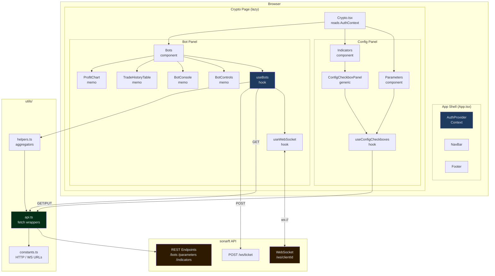

# Architecture & Project Structure
**Prompt:** 01-WEB-ARCH | **Package:** web | **Reviewed:** July 2025

---

## Executive Summary

The sonarftweb frontend is a lean, well-structured React 18 SPA. It follows a clear
layered architecture: a single page (`Crypto`) orchestrated by a central custom hook
(`useBots`), with reusable config panels abstracted behind a generic component
(`ConfigCheckboxPanel`) and a matching hook (`useConfigCheckboxes`). The technology
choices are modern and appropriate. The codebase is small (~15 source files), TypeScript-
strict, and has zero circular dependencies. The main architectural observation is that
`useBots` is a large orchestration hook that combines WebSocket lifecycle, bot state
machine, REST polling, and RAF log batching — a deliberate design that works well at
current scale but would benefit from splitting if the feature set grows.

---

## 1. Technology Stack Inventory

| Category | Technology | Version | Notes |
|---|---|---|---|
| UI framework | React | 18.2 | Functional components, hooks throughout |
| Language | TypeScript | 5.x | Strict mode, `noUnusedLocals`, `noUnusedParameters` |
| Build tool | Vite | 8.x | ESM, vendor chunk splitting, 100 KB gzip warning |
| Routing | React Router DOM | 6.30 | `BrowserRouter`, `Routes`, lazy `Crypto` page |
| Charting | Recharts | 3.8 | `AreaChart` for cumulative P&L |
| HTTP client | Native `fetch` | — | No axios; thin wrappers in `utils/api.ts` |
| WebSocket | Native `WebSocket` | — | Managed by `useWebSocket` hook |
| Auth | Context API + `sessionStorage` | — | Netlify Identity JWT stored in `sessionStorage` |
| State management | `useState` + `useReducer` + Context | — | No Redux/Zustand; local state + one context |
| Styling | Plain CSS + CSS custom properties | — | `variables.css` design tokens, per-component CSS files |
| Testing | Vitest + RTL + MSW v2 | 3.x / 13.x / 2.x | 110/110 passing |
| Linting | ESLint v9 flat config | 9.39 | `react-hooks`, `jsx-a11y`, `@typescript-eslint` |
| Formatting | Prettier | 3.x | `.prettierrc` present |
| Package manager | npm | — | `package-lock.json` present |
| Web Vitals | `web-vitals` | 2.x | `sendBeacon` / `fetch` reporting via `vitals.ts` |

---

## 2. Directory Structure & Module Organization

```
packages/web/
├── src/
│   ├── assets/img/          # Static images (logo)
│   ├── components/          # Feature-grouped UI components
│   │   ├── Bots/            # Bot management panel (Bots, BotControls, BotConsole, TradeHistoryTable)
│   │   ├── Charts/          # ProfitChart (Recharts AreaChart)
│   │   ├── ConfigCheckboxPanel/  # Generic checkbox config panel
│   │   ├── ErrorBoundary/   # Class-based error boundary
│   │   ├── Footer/          # Static footer
│   │   ├── Indicators/      # Indicator config (thin wrapper over ConfigCheckboxPanel)
│   │   ├── NavBar/          # Navigation bar
│   │   ├── Parameters/      # Trading parameters config
│   │   └── PrivateRoute/    # Auth guard component
│   ├── hooks/               # Custom React hooks + AuthProvider context
│   │   ├── AuthProvider.tsx # Context + useAuth hook
│   │   ├── useBots.ts       # Central orchestration hook
│   │   ├── useConfigCheckboxes.ts  # Generic config load/save hook
│   │   ├── useIdleTimeout.ts       # Session idle detection
│   │   └── useWebSocket.tsx        # WebSocket lifecycle + exponential backoff
│   ├── integration/         # End-to-end workflow tests
│   ├── mocks/               # MSW v2 handlers, fixtures, server setup
│   ├── pages/
│   │   └── Crypto/          # Single page: Crypto.tsx + crypto.css
│   └── utils/
│       ├── api.ts           # All REST + ticket fetch functions; TradeRecord type
│       ├── constants.ts     # HTTP/WS base URLs from env vars
│       ├── helpers.ts       # fetchAllOrders / fetchAllTrades aggregators
│       ├── vitals.ts        # Web Vitals reporting
│       ├── indicatorOptions.json   # Bundled indicator defaults
│       └── parameterOptions.json   # Bundled parameter defaults
├── public/                  # Static assets served as-is
├── index.html               # Vite entry HTML
├── vite.config.js           # Build + test config
├── tsconfig.json            # TypeScript strict config
├── eslint.config.js         # ESLint v9 flat config
└── nginx.conf               # Production nginx with security headers
```

**Organization principle:** by feature/type hybrid. Components are grouped by feature
(`Bots/`, `Charts/`, `Parameters/`). Hooks, utils, and pages are grouped by type.
Naming convention: `PascalCase` for component files and directories, `camelCase` for
hooks and utilities.

---

## 3. Component Architecture

All components are functional except `ErrorBoundary` (class component, required by
React's error boundary API).

| Component | Type | Purpose | Key Props | Reusable? |
|---|---|---|---|---|
| `App` | Functional | Root: router, layout, lazy page load | — | No |
| `NavBar` | Functional | Top navigation, user email display | — (reads AuthContext) | No |
| `Footer` | Functional | Static copyright footer | — | No |
| `ErrorBoundary` | Class | Catches render errors, shows fallback UI | `children` | Yes |
| `PrivateRoute` | Functional | Auth guard — redirects if `value` is falsy | `children`, `value` | Yes |
| `Crypto` (page) | Functional | Main trading dashboard layout | — (reads AuthContext) | No |
| `Bots` | Functional | Bot management: controls, console, history, chart | `user: AppUser` | No |
| `BotControls` | Functional (`memo`) | Create/Stop/Remove buttons + bot selector | `botIds`, `botState`, `selectedBotId`, `wsOpen`, callbacks | Yes |
| `BotConsole` | Functional (`memo`) | Scrolling log output with color-coded lines | `logs: string[]` | Yes |
| `TradeHistoryTable` | Functional (`memo`) | Tabular order/trade history | `rows: TradeRecord[]`, `caption` | Yes |
| `ProfitChart` | Functional (`memo`) | Cumulative P&L area chart | `trades: TradeRecord[]` | Yes |
| `Parameters` | Functional | Exchange/symbol/strategy config panel | `clientId` | No |
| `Indicators` | Functional | Indicator config (thin wrapper) | `clientId` | No |
| `ConfigCheckboxPanel` | Generic Functional | Reusable checkbox config panel | `title`, `clientId`, `sections`, `fetchFn`, `defaultFn`, `updateFn`, `saveLabel`, `className` | Yes |

**Custom hooks:**

| Hook | Purpose |
|---|---|
| `AuthProvider` / `useAuth` | Provides `user`, `handleLogin`, `handleLogout` via Context |
| `useBots` | Central orchestration: WS ticket, bot state machine, log RAF batching, REST polling |
| `useWebSocket` | WebSocket lifecycle, exponential backoff reconnection |
| `useConfigCheckboxes` | Generic config load (server → localStorage → bundled defaults) + save |
| `useIdleTimeout` | Session idle detection with activity event listeners |

**Props design:** TypeScript interfaces for all props. No PropTypes. `React.memo` applied
to pure display components (`BotControls`, `BotConsole`, `TradeHistoryTable`, `ProfitChart`).

---

## 4. Layering & Separation of Concerns

| Layer | Where it lives | Assessment |
|---|---|---|
| UI / Presentation | `components/` — `BotControls`, `BotConsole`, `TradeHistoryTable`, `ProfitChart`, `NavBar`, `Footer` | ✅ Clean — pure display, no API calls |
| Orchestration | `useBots` hook | ⚠️ Large — combines WS, state machine, REST, RAF batching in one hook (see §8) |
| Config logic | `useConfigCheckboxes` hook | ✅ Well-extracted generic hook |
| API / Data | `utils/api.ts`, `utils/helpers.ts` | ✅ All fetch calls centralized here |
| State | `useState` + `useReducer` in `useBots`; `useState` in `Parameters`; `AuthContext` | ✅ Appropriate — no global store needed at this scale |
| Routing | `App.tsx` via React Router v6 | ✅ Simple, single route |
| Auth | `AuthProvider` context | ✅ Isolated; token in `sessionStorage` |

Concerns are well-separated at the component level. The one area where concerns
converge is `useBots`, which is intentional but worth monitoring as the app grows.

---

## 5. Module Dependency Analysis

```
index.tsx
  └── App.tsx
        ├── AuthProvider (hooks/)
        ├── NavBar → AuthProvider
        ├── Footer
        └── Crypto (pages/) [lazy]
              ├── AuthProvider
              ├── ErrorBoundary
              ├── Parameters → api.ts, useConfigCheckboxes (via inline logic)
              ├── Indicators → ConfigCheckboxPanel → useConfigCheckboxes → api.ts
              └── Bots
                    ├── useBots
                    │     ├── useWebSocket
                    │     ├── api.ts (getBotIds, getOrders, getTrades, fetchWsTicket, getAuthToken)
                    │     ├── helpers.ts (fetchAllOrders, fetchAllTrades)
                    │     └── constants.ts (WS)
                    ├── BotControls (no external deps)
                    ├── BotConsole (no external deps)
                    ├── TradeHistoryTable → api.ts (TradeRecord type only)
                    └── ProfitChart → api.ts (TradeRecord type only)
```

**Circular dependencies:** None detected. The dependency graph is a strict DAG.

**Key integration points:**
- `utils/api.ts` is the single API boundary — all REST calls go through it.
- `utils/constants.ts` is the single source for base URLs (read from `import.meta.env`).
- `AuthProvider` is the single source of user identity.
- `useBots` is the single consumer of `useWebSocket`.

---

## 6. Data Flow Architecture

**Initial load:**
1. `index.tsx` renders `App` wrapped in `React.StrictMode`.
2. `AuthProvider` initializes `user` from `DEFAULT_USER` (env vars or hardcoded dev fallback).
3. `Crypto` page reads `user` from `AuthContext`; renders `Parameters`, `Indicators`, `Bots`.
4. `useBots` fires two parallel effects: resolve WS ticket URL, fetch existing bot IDs.
5. `Parameters` and `Indicators` each load config: server → localStorage → bundled JSON.

**User interactions → API calls:**
- Create/Stop/Remove bot: `Bots` → `useBots` handler → `socket.send(JSON)` over WebSocket.
- Save parameters/indicators: component → `updateParameters` / `updateIndicators` in `api.ts`.
- Select bot: local `setSelectedBotId` state in `useBots`.

**Real-time updates (WebSocket):**
- `useWebSocket` manages connection lifecycle and exposes `socket`.
- `useBots` attaches `socket.onmessage` when `wsOpen` is true.
- `log` messages → `logBufferRef` → flushed to `logs` state via `requestAnimationFrame` (≤60fps).
- `bot_created` / `bot_removed` → `dispatch` to `botMachineReducer` + REST re-fetch of bot IDs.
- `order_success` / `trade_success` → REST re-fetch of orders/trades.

**State updates:**
- Bot lifecycle: `useReducer` with explicit `BotMachineAction` transitions.
- Config state: `useState` in `useConfigCheckboxes` (and directly in `Parameters`).
- Auth: `useState` in `AuthProvider`.

**Prop drilling:** Minimal. `user.id` is passed from `Crypto` to `Bots`, `Parameters`,
and `Indicators` as `clientId`. No deep drilling — all components are one level below
the page.

```
Data Flow Diagram:

  sonarft API (REST)          sonarft API (WebSocket)
       │                              │
       ▼                              ▼
  utils/api.ts              useWebSocket hook
       │                              │
       ├──► useBots ◄─────────────────┘
       │       │
       │       ├── botMachineReducer (useReducer)
       │       ├── logBufferRef → RAF flush → logs state
       │       ├── botIds, orders, trades state
       │       └── exposes handlers + state to Bots component
       │
       ├──► useConfigCheckboxes (Parameters / Indicators)
       │       └── config state → localStorage cache
       │
       └──► AuthProvider (Context)
               └── user state → NavBar, Crypto, Bots
```

---

## 7. API Integration Points

All REST calls use native `fetch` with `Authorization: Bearer <token>` headers when a
token is present in `sessionStorage`.

| Function | Method | Endpoint | Used by |
|---|---|---|---|
| `fetchWsTicket` | POST | `/ws/ticket` | `useBots` (WS URL resolution) |
| `getBotIds` | GET | `/bots?client_id=` | `useBots` (init + after `bot_created`) |
| `getOrders` | GET | `/bots/{botId}/orders?client_id=` | `helpers.fetchAllOrders` |
| `getTrades` | GET | `/bots/{botId}/trades?client_id=` | `helpers.fetchAllTrades` |
| `getParameters` | GET | `/parameters?client_id=` | `Parameters` component |
| `getDefaultParameters` | GET | `/parameters/defaults` | `Parameters` (fallback) |
| `updateParameters` | PUT | `/parameters?client_id=` | `Parameters` component |
| `getIndicators` | GET | `/indicators?client_id=` | `useConfigCheckboxes` |
| `getDefaultIndicators` | GET | `/indicators/defaults` | `useConfigCheckboxes` (fallback) |
| `updateIndicators` | PUT | `/indicators?client_id=` | `useConfigCheckboxes` |

**Note:** The frontend calls the legacy `/bots?client_id=` and `/parameters?client_id=`
paths. The API has canonical `/clients/{client_id}/bots` and `/clients/{client_id}/parameters`
paths that are preferred for new integrations. The legacy paths remain functional but
carry `Deprecation: true` and `Sunset: Sun, 01 Jan 2026` response headers.

**WebSocket events handled:**

| Event type | Action |
|---|---|
| `log` | Buffer to `logBufferRef`, flush via RAF |
| `bot_created` | Re-fetch bot IDs, dispatch `BOT_CREATED` |
| `bot_removed` | Dispatch `BOT_REMOVED`, clear bot IDs |
| `order_success` | Re-fetch all orders |
| `trade_success` | Re-fetch all trades |
| `error` | Set `fetchError` state |

**WebSocket commands sent:**

| Key | Payload | Trigger |
|---|---|---|
| `create` | `{type, key}` | `handleCreate` |
| `stop` | `{type, key, botid}` | `handleStop` |
| `remove` | `{type, key, botid}` | `handleRemove` |
| `set_simulation` | `{type, key, botid, value}` | `handleToggleSimulation` |

**Error handling:**
- REST errors in `useBots`: caught, set `fetchError` state, displayed as `role="alert"` banner.
- REST errors in `Parameters` / `useConfigCheckboxes`: caught, `saveStatus` set to `"error"`, shown inline.
- `fetchWsTicket` failure: silently falls back to `?token=` or bare URL.
- WebSocket errors: `wsError` state, displayed as `role="alert"` banner.

**Loading states:** `isLoading` boolean in `useBots` shows a loading div. `saveStatus`
in config components shows "Saving..." during PUT requests.

**Authentication:** `getAuthToken()` reads from `sessionStorage("sonarft_token")`.
Headers are injected by `getAuthHeaders()` in every fetch call. WS auth uses a
single-use ticket (30s TTL) to keep the JWT out of server logs.

**Data transformation:** None beyond TypeScript type assertions. The API response
shapes match the frontend `TradeRecord`, `ParametersConfig`, and `IndicatorsConfig`
interfaces directly. The API's `ClientParametersConfig` includes a `version` field
not present in the frontend type — this is silently ignored on read (Pydantic
`extra="ignore"` equivalent on the frontend via type assertion).

---

## 8. Code Complexity Hotspots

| File | Lines | Complexity driver |
|---|---|---|
| `hooks/useBots.ts` | ~230 | Combines WS ticket, state machine, RAF batching, REST polling, 5 handlers |
| `components/Bots/Bots.tsx` | ~130 | Two confirmation modals + status rendering + useBots destructuring |
| `components/Parameters/Parameters.tsx` | ~120 | Inline load logic duplicates `useConfigCheckboxes` pattern |
| `components/ConfigCheckboxPanel/ConfigCheckboxPanel.tsx` | ~80 | Generic with type parameter — most complex type signature |
| `hooks/useConfigCheckboxes.ts` | ~90 | Three-tier fallback load chain |

**Most dependencies:** `useBots.ts` imports from 5 modules (`useWebSocket`, `api`,
`helpers`, `constants`, `useBots` internal types).

**Most state:** `useBots` manages 9 state variables + 1 reducer + 3 refs.

**Observation:** `Parameters` has its own load logic (server → localStorage → defaults)
that duplicates what `useConfigCheckboxes` does. This is the only code duplication in
the codebase. `Indicators` correctly delegates to `ConfigCheckboxPanel` +
`useConfigCheckboxes`. `Parameters` could be refactored to use the same pattern.

---

## 9. Configuration & Constants

**Environment variables** (Vite `VITE_` prefix, read via `import.meta.env`):

| Variable | Used in | Purpose |
|---|---|---|
| `VITE_API_URL` | `constants.ts` | REST base URL (default: `http://localhost:8000/api/v1`) |
| `VITE_WS_URL` | `constants.ts` | WebSocket base URL (default: `ws://localhost:8000/api/v1/ws`) |
| `VITE_DEV_AUTH_BYPASS` | `.env.development` | Skip Netlify Identity in dev |
| `VITE_DEFAULT_USER_ID` | `AuthProvider.tsx` | Dev user ID |
| `VITE_DEFAULT_USER_EMAIL` | `AuthProvider.tsx` | Dev user email |
| `VITE_VITALS_URL` | `vitals.ts` | Web Vitals reporting endpoint (optional) |
| `VITE_IDLE_TIMEOUT_MS` | — | Session idle timeout (referenced in README, not yet wired in source) |

**Constants file:** `utils/constants.ts` — HTTP/WS base URLs and four string message
constants (`BOT_CREATED_MESSAGE`, etc.). The message constants are defined but not
currently used in the reviewed source (may be used in tests).

**Feature flags:** None beyond `import.meta.env.DEV` used in `ErrorBoundary` to show
error details and in `vitals.ts` to log to console.

**Design tokens:** `variables.css` defines a complete dark trading dashboard palette
using CSS custom properties (`--bg-base`, `--accent`, `--green`, `--red`, etc.) plus
legacy aliases for backward compatibility. All components consume these via CSS files.

**Bundled defaults:** `utils/indicatorOptions.json` and `utils/parameterOptions.json`
serve as the last-resort fallback when both the server and localStorage are unavailable.

---

## 10. Architecture Diagram



---

## Architecture Recommendations

| Priority | Finding | Recommendation |
|---|---|---|
| Low | `Parameters` duplicates the three-tier load logic from `useConfigCheckboxes` | Refactor `Parameters` to use `ConfigCheckboxPanel` + `useConfigCheckboxes`, matching the `Indicators` pattern. Eliminates ~40 lines of duplicate code. |
| Low | Frontend calls legacy `/bots?client_id=` and `/parameters?client_id=` paths | Migrate `api.ts` calls to canonical `/clients/{client_id}/bots` and `/clients/{client_id}/parameters` paths before the January 2026 sunset date. |
| Low | `VITE_IDLE_TIMEOUT_MS` is documented in README and `.env.development` but `useIdleTimeout` is not wired into any component | Wire `useIdleTimeout` into `App` or `AuthProvider` using the env var, or remove the undocumented hook from the public API surface. |
| Info | `useBots` is a large orchestration hook (~230 lines, 9 state vars) | Acceptable at current scale. If bot management features grow, consider extracting `useWsTicket` and `useBotHistory` as separate hooks consumed by `useBots`. |
| Info | `PrivateRoute` is defined but not used in `App.tsx` routing | Either wire it into the route definitions or remove it to reduce dead code. |
